# EKS Pod 헬스체크 & 라이프사이클 관리

> 📅 **작성일**: 2026-02-12 | ⏱️ **읽는 시간**: 약 18분

> **📌 기준 환경**: EKS 1.30+, Kubernetes 1.30+, AWS Load Balancer Controller v2.7+

## 1. 개요

Pod의 헬스체크와 라이프사이클 관리는 서비스 안정성과 가용성의 핵심입니다. 적절한 Probe 설정과 Graceful Shutdown 구현은 다음을 보장합니다:

- **무중단 배포**: 롤링 업데이트 시 트래픽 유실 방지
- **빠른 장애 감지**: 비정상 Pod 자동 격리 및 재시작
- **리소스 최적화**: 느린 시작 앱의 조기 재시작 방지
- **데이터 무결성**: 종료 시 진행 중인 요청 안전하게 완료

본 문서는 Kubernetes Probe의 동작 원리부터 언어별 Graceful Shutdown 구현, Init Container 활용, 컨테이너 이미지 최적화까지 Pod 라이프사이클 전체를 다룹니다.

:::info 관련 문서 참조
- **Probe 디버깅**: [EKS 장애 진단 및 대응 가이드](/docs/operations-observability/eks-debugging-guide)의 "Probe 디버깅 및 Best Practices" 섹션
- **고가용성 설계**: [EKS 고가용성 아키텍처 가이드](/docs/operations-observability/eks-resiliency-guide)의 "Graceful Shutdown", "PDB", "Pod Readiness Gates" 섹션
:::

---

## 2. Kubernetes Probe 심층 가이드

### 2.1 세 가지 Probe 유형과 동작 원리

Kubernetes는 세 가지 유형의 Probe를 제공하여 Pod의 상태를 모니터링합니다.

| Probe 유형 | 목적 | 실패 시 동작 | 활성화 타이밍 |
|-----------|------|-------------|-------------|
| **Startup Probe** | 애플리케이션 초기화 완료 확인 | Pod 재시작 (failureThreshold 도달 시) | Pod 시작 직후 |
| **Liveness Probe** | 애플리케이션 데드락/교착 상태 감지 | 컨테이너 재시작 | Startup Probe 성공 후 |
| **Readiness Probe** | 트래픽 수신 준비 상태 확인 | Service Endpoint에서 제거 (재시작 없음) | Startup Probe 성공 후 |

#### Startup Probe: 느린 시작 앱 보호

Startup Probe는 애플리케이션이 완전히 시작될 때까지 Liveness/Readiness Probe의 실행을 지연시킵니다. Spring Boot, JVM 애플리케이션, ML 모델 로딩 등 시작이 느린 앱에 필수입니다.

**동작 원리:**
- Startup Probe가 실행 중일 때는 Liveness/Readiness Probe가 비활성화됨
- Startup Probe 성공 시 → Liveness/Readiness Probe 활성화
- Startup Probe 실패 (failureThreshold 도달) → 컨테이너 재시작

#### Liveness Probe: 데드락 감지

Liveness Probe는 애플리케이션이 살아있는지 확인합니다. 실패 시 kubelet이 컨테이너를 재시작합니다.

**사용 사례:**
- 무한 루프, 데드락 상태 감지
- 복구 불가능한 애플리케이션 에러
- 메모리 누수로 인한 응답 불가 상태

**주의사항:**
- Liveness Probe에 **외부 의존성을 포함하지 마세요** (DB, Redis 등)
- 외부 서비스 장애 시 전체 Pod이 재시작되는 cascading failure 발생

#### Readiness Probe: 트래픽 수신 제어

Readiness Probe는 Pod이 트래픽을 받을 준비가 되었는지 확인합니다. 실패 시 Service의 Endpoints에서 Pod이 제거되지만, 컨테이너는 재시작되지 않습니다.

**사용 사례:**
- 의존 서비스 연결 확인 (DB, 캐시)
- 초기 데이터 로딩 완료 확인
- 배포 중 단계적 트래픽 수신

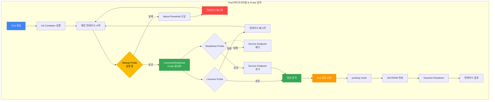

### 2.2 Probe 메커니즘

Kubernetes는 네 가지 Probe 메커니즘을 지원합니다.

| 메커니즘 | 설명 | 장점 | 단점 | 적합한 상황 |
|----------|------|------|------|------------|
| **httpGet** | HTTP GET 요청, 200-399 응답 코드 확인 | 표준적, 구현 간단 | HTTP 서버 필요 | REST API, 웹 서비스 |
| **tcpSocket** | TCP 포트 연결 가능 여부 확인 | 가볍고 빠름 | 애플리케이션 로직 검증 불가 | gRPC, 데이터베이스 |
| **exec** | 컨테이너 내 명령 실행, exit code 0 확인 | 유연함, 커스텀 로직 가능 | 오버헤드 높음 | 배치 워커, 파일 기반 확인 |
| **grpc** | gRPC Health Check Protocol 사용 (K8s 1.27+ GA) | 네이티브 gRPC 지원 | gRPC 앱만 사용 가능 | gRPC 마이크로서비스 |

#### httpGet 예시

```yaml
livenessProbe:
  httpGet:
    path: /healthz
    port: 8080
    httpHeaders:
    - name: X-Custom-Header
      value: HealthCheck
    scheme: HTTP  # 또는 HTTPS
  initialDelaySeconds: 30
  periodSeconds: 10
```

#### tcpSocket 예시

```yaml
livenessProbe:
  tcpSocket:
    port: 5432  # PostgreSQL
  initialDelaySeconds: 15
  periodSeconds: 10
```

#### exec 예시

```yaml
livenessProbe:
  exec:
    command:
    - /bin/sh
    - -c
    - test -f /tmp/healthy
  initialDelaySeconds: 5
  periodSeconds: 5
```

#### grpc 예시 (Kubernetes 1.27+)

```yaml
livenessProbe:
  grpc:
    port: 9090
    service: myservice  # 선택 사항
  initialDelaySeconds: 10
  periodSeconds: 5
```

:::tip gRPC Health Check Protocol
gRPC 서비스는 [gRPC Health Checking Protocol](https://github.com/grpc/grpc/blob/master/doc/health-checking.md)을 구현해야 합니다. Go는 `google.golang.org/grpc/health`, Java는 `grpc-health-check` 라이브러리를 사용하세요.
:::

### 2.3 Probe 타이밍 설계

Probe의 타이밍 파라미터는 장애 감지 속도와 안정성 간의 균형을 결정합니다.

| 파라미터 | 설명 | 기본값 | 권장 범위 |
|----------|------|--------|----------|
| `initialDelaySeconds` | 컨테이너 시작 후 첫 Probe까지 대기 시간 | 0 | 10-30s (Startup Probe 사용 시 0 가능) |
| `periodSeconds` | Probe 실행 간격 | 10 | 5-15s |
| `timeoutSeconds` | Probe 응답 대기 시간 | 1 | 3-10s |
| `failureThreshold` | 실패 판정까지 연속 실패 횟수 | 3 | Liveness: 3, Readiness: 1-3, Startup: 30+ |
| `successThreshold` | 성공 판정까지 연속 성공 횟수 (Readiness만 1 이상 가능) | 1 | 1-2 |

#### 타이밍 설계 공식

```
최대 감지 시간 = failureThreshold × periodSeconds
최소 복구 시간 = successThreshold × periodSeconds
```

**예시:**
- `failureThreshold: 3, periodSeconds: 10` → 최대 30초 후 장애 감지
- `successThreshold: 2, periodSeconds: 5` → 최소 10초 후 복구 판정 (Readiness만)

#### 워크로드별 권장 타이밍

| 워크로드 유형 | initialDelaySeconds | periodSeconds | failureThreshold | 이유 |
|--------------|-------------------|---------------|-----------------|------|
| 웹 서비스 (Node.js, Python) | 10 | 5 | 3 | 빠른 시작, 빠른 감지 필요 |
| JVM 앱 (Spring Boot) | 0 (Startup Probe 사용) | 10 | 3 | 시작 느림, Startup으로 보호 |
| 데이터베이스 (PostgreSQL) | 30 | 10 | 5 | 초기화 시간 길음 |
| 배치 워커 | 5 | 15 | 2 | 주기적 작업, 느슨한 감지 |
| ML 추론 서비스 | 0 (Startup: 60) | 10 | 3 | 모델 로딩 시간 긺 |

### 2.4 워크로드별 Probe 패턴

#### 패턴 1: 웹 서비스 (REST API)

```yaml
apiVersion: apps/v1
kind: Deployment
metadata:
  name: rest-api
spec:
  replicas: 3
  selector:
    matchLabels:
      app: rest-api
  template:
    metadata:
      labels:
        app: rest-api
    spec:
      containers:
      - name: api
        image: myapp/rest-api:v1.2.3
        ports:
        - containerPort: 8080
          protocol: TCP
        resources:
          requests:
            cpu: 200m
            memory: 256Mi
          limits:
            cpu: 500m
            memory: 512Mi
        # Startup Probe: 30초 이내 시작 완료 확인
        startupProbe:
          httpGet:
            path: /healthz
            port: 8080
          failureThreshold: 6
          periodSeconds: 5
        # Liveness Probe: 내부 헬스체크만 (외부 의존성 제외)
        livenessProbe:
          httpGet:
            path: /healthz
            port: 8080
          initialDelaySeconds: 10
          periodSeconds: 10
          timeoutSeconds: 5
          failureThreshold: 3
        # Readiness Probe: 외부 의존성 포함 가능
        readinessProbe:
          httpGet:
            path: /ready
            port: 8080
          initialDelaySeconds: 5
          periodSeconds: 5
          timeoutSeconds: 3
          failureThreshold: 2
          successThreshold: 1
        lifecycle:
          preStop:
            exec:
              command:
              - /bin/sh
              - -c
              - sleep 5 && kill -TERM 1
      terminationGracePeriodSeconds: 60
```

**헬스체크 엔드포인트 구현 (Node.js/Express):**

```javascript
// /healthz - Liveness: 애플리케이션 자체 상태만 확인
app.get('/healthz', (req, res) => {
  // 내부 상태만 확인 (메모리, CPU 등)
  const memUsage = process.memoryUsage();
  if (memUsage.heapUsed / memUsage.heapTotal > 0.95) {
    return res.status(500).json({ status: 'unhealthy', reason: 'memory_pressure' });
  }
  res.status(200).json({ status: 'ok' });
});

// /ready - Readiness: 외부 의존성 포함 확인
app.get('/ready', async (req, res) => {
  try {
    // DB 연결 확인
    await db.ping();
    // Redis 연결 확인
    await redis.ping();
    res.status(200).json({ status: 'ready' });
  } catch (err) {
    res.status(503).json({ status: 'not_ready', reason: err.message });
  }
});
```

#### 패턴 2: gRPC 서비스

```yaml
apiVersion: apps/v1
kind: Deployment
metadata:
  name: grpc-service
spec:
  replicas: 3
  selector:
    matchLabels:
      app: grpc-service
  template:
    metadata:
      labels:
        app: grpc-service
    spec:
      containers:
      - name: grpc-server
        image: myapp/grpc-service:v2.1.0
        ports:
        - containerPort: 9090
          name: grpc
        resources:
          requests:
            cpu: 300m
            memory: 512Mi
          limits:
            cpu: 1
            memory: 1Gi
        # gRPC native probe (K8s 1.27+)
        startupProbe:
          grpc:
            port: 9090
            service: myapp.HealthService  # 선택 사항
          failureThreshold: 30
          periodSeconds: 10
        livenessProbe:
          grpc:
            port: 9090
          periodSeconds: 10
          timeoutSeconds: 5
          failureThreshold: 3
        readinessProbe:
          grpc:
            port: 9090
          periodSeconds: 5
          timeoutSeconds: 3
          failureThreshold: 2
      terminationGracePeriodSeconds: 45
```

**gRPC Health Check 구현 (Go):**

```go
package main

import (
    "context"
    "google.golang.org/grpc"
    "google.golang.org/grpc/health"
    "google.golang.org/grpc/health/grpc_health_v1"
)

func main() {
    server := grpc.NewServer()

    // Health 서비스 등록
    healthServer := health.NewServer()
    grpc_health_v1.RegisterHealthServer(server, healthServer)

    // 서비스를 SERVING 상태로 설정
    healthServer.SetServingStatus("myapp.HealthService", grpc_health_v1.HealthCheckResponse_SERVING)

    // 의존성 체크 후 NOT_SERVING으로 변경 가능
    // healthServer.SetServingStatus("myapp.HealthService", grpc_health_v1.HealthCheckResponse_NOT_SERVING)

    // gRPC 서버 시작
    lis, _ := net.Listen("tcp", ":9090")
    server.Serve(lis)
}
```

#### 패턴 3: 워커/배치 처리

배치 워커는 HTTP 서버가 없으므로 `exec` Probe를 사용합니다.

```yaml
apiVersion: apps/v1
kind: Deployment
metadata:
  name: batch-worker
spec:
  replicas: 2
  selector:
    matchLabels:
      app: batch-worker
  template:
    metadata:
      labels:
        app: batch-worker
    spec:
      containers:
      - name: worker
        image: myapp/batch-worker:v3.0.1
        resources:
          requests:
            cpu: 500m
            memory: 1Gi
          limits:
            cpu: 2
            memory: 4Gi
        # Startup Probe: 워커 초기화 확인
        startupProbe:
          exec:
            command:
            - /bin/sh
            - -c
            - test -f /tmp/worker-ready
          failureThreshold: 12
          periodSeconds: 5
        # Liveness Probe: 하트비트 파일 확인
        livenessProbe:
          exec:
            command:
            - /bin/sh
            - -c
            - find /tmp/heartbeat -mmin -2 | grep -q heartbeat
          initialDelaySeconds: 10
          periodSeconds: 30
          failureThreshold: 3
        # Readiness Probe: 작업 큐 연결 확인
        readinessProbe:
          exec:
            command:
            - /app/check-queue-connection.sh
          periodSeconds: 10
          failureThreshold: 3
      terminationGracePeriodSeconds: 120
```

**워커 애플리케이션 (Python):**

```python
import os
import time
from pathlib import Path

HEARTBEAT_FILE = Path("/tmp/heartbeat")
READY_FILE = Path("/tmp/worker-ready")

def worker_loop():
    # 초기화 완료 시그널
    READY_FILE.touch()

    while True:
        # 주기적으로 하트비트 업데이트
        HEARTBEAT_FILE.touch()

        # 작업 처리
        process_jobs()
        time.sleep(5)

def process_jobs():
    # 실제 작업 로직
    pass

if __name__ == "__main__":
    worker_loop()
```

#### 패턴 4: 느린 시작 앱 (Spring Boot, JVM)

JVM 애플리케이션은 시작 시간이 30초 이상 소요될 수 있습니다. Startup Probe로 보호합니다.

```yaml
apiVersion: apps/v1
kind: Deployment
metadata:
  name: spring-boot-app
spec:
  replicas: 4
  selector:
    matchLabels:
      app: spring-boot
  template:
    metadata:
      labels:
        app: spring-boot
    spec:
      containers:
      - name: app
        image: myapp/spring-boot:v2.7.0
        ports:
        - containerPort: 8080
        resources:
          requests:
            cpu: 1
            memory: 2Gi
          limits:
            cpu: 2
            memory: 4Gi
        env:
        - name: JAVA_OPTS
          value: "-Xms1g -Xmx3g"
        # Startup Probe: 최대 5분(30 x 10s) 대기
        startupProbe:
          httpGet:
            path: /actuator/health/liveness
            port: 8080
          failureThreshold: 30
          periodSeconds: 10
        # Liveness Probe: Startup 성공 후 활성화
        livenessProbe:
          httpGet:
            path: /actuator/health/liveness
            port: 8080
          periodSeconds: 10
          timeoutSeconds: 5
          failureThreshold: 3
        # Readiness Probe: 외부 의존성 포함
        readinessProbe:
          httpGet:
            path: /actuator/health/readiness
            port: 8080
          periodSeconds: 5
          timeoutSeconds: 3
          failureThreshold: 2
      terminationGracePeriodSeconds: 60
```

**Spring Boot Actuator 설정:**

```yaml
# application.yml
management:
  endpoints:
    web:
      exposure:
        include: health
  health:
    livenessState:
      enabled: true
    readinessState:
      enabled: true
  endpoint:
    health:
      probes:
        enabled: true
      show-details: when-authorized
```

#### 패턴 5: 사이드카 패턴 (Istio Proxy + 앱)

사이드카 패턴에서는 메인 컨테이너와 사이드카 모두에 Probe를 설정합니다.

```yaml
apiVersion: apps/v1
kind: Deployment
metadata:
  name: app-with-sidecar
spec:
  replicas: 3
  selector:
    matchLabels:
      app: myapp
  template:
    metadata:
      labels:
        app: myapp
    spec:
      containers:
      # 메인 애플리케이션 컨테이너
      - name: app
        image: myapp/app:v1.0.0
        ports:
        - containerPort: 8080
        startupProbe:
          httpGet:
            path: /healthz
            port: 8080
          failureThreshold: 10
          periodSeconds: 5
        livenessProbe:
          httpGet:
            path: /healthz
            port: 8080
          periodSeconds: 10
        readinessProbe:
          httpGet:
            path: /ready
            port: 8080
          periodSeconds: 5
      # Istio 사이드카 (자동 주입 시 Istio가 Probe 추가)
      # 수동 설정 예시:
      - name: istio-proxy
        image: istio/proxyv2:1.22.0
        ports:
        - containerPort: 15090
          name: http-envoy-prom
        startupProbe:
          httpGet:
            path: /healthz/ready
            port: 15021
          failureThreshold: 30
          periodSeconds: 1
        livenessProbe:
          httpGet:
            path: /healthz/ready
            port: 15021
          periodSeconds: 10
        readinessProbe:
          httpGet:
            path: /healthz/ready
            port: 15021
          periodSeconds: 2
      terminationGracePeriodSeconds: 90
```

:::tip Istio Sidecar Injection
Istio가 자동 주입을 사용하는 경우 (`istio-injection=enabled` 레이블), Istio가 사이드카에 적절한 Probe를 자동으로 추가합니다. 수동 설정은 불필요합니다.
:::

#### 2.4.6 Windows 컨테이너 Probe 고려사항

EKS는 Windows Server 2019/2022 기반 Windows 노드를 지원하며, Windows 컨테이너는 Linux 컨테이너와 다른 Probe 동작 특성을 가집니다.

##### Windows vs Linux Probe 동작 차이

| 항목 | Linux 컨테이너 | Windows 컨테이너 | 영향 |
|------|---------------|-----------------|------|
| **컨테이너 런타임** | containerd | containerd (1.6+) | 동일한 런타임, 다른 OS 레이어 |
| **exec Probe 실행** | `/bin/sh -c` | `cmd.exe /c` 또는 `powershell.exe` | 스크립트 문법 차이 |
| **httpGet Probe** | 동일 | 동일 | 차이 없음 |
| **tcpSocket Probe** | 동일 | 동일 | 차이 없음 |
| **콜드 스타트 시간** | 빠름 (수초) | 느림 (10-30초) | Startup Probe failureThreshold 증가 필요 |
| **메모리 오버헤드** | 낮음 (50-100MB) | 높음 (200-500MB) | 리소스 요청 증가 필요 |
| **Probe 타임아웃** | 일반적으로 1-5초 | 3-10초 권장 | Windows I/O 지연 고려 |

##### Windows 워크로드 Probe 설정 예시

**IIS/.NET Framework 앱:**

```yaml
apiVersion: apps/v1
kind: Deployment
metadata:
  name: iis-app
  namespace: windows-workloads
spec:
  replicas: 2
  selector:
    matchLabels:
      app: iis-app
  template:
    metadata:
      labels:
        app: iis-app
    spec:
      nodeSelector:
        kubernetes.io/os: windows
        kubernetes.io/arch: amd64
      containers:
      - name: iis
        image: mcr.microsoft.com/windows/servercore/iis:windowsservercore-ltsc2022
        ports:
        - containerPort: 80
        resources:
          requests:
            cpu: 500m
            memory: 512Mi
          limits:
            cpu: 2000m
            memory: 2Gi
        # Startup Probe: Windows 콜드 스타트 고려
        startupProbe:
          httpGet:
            path: /
            port: 80
            scheme: HTTP
          initialDelaySeconds: 10
          periodSeconds: 5
          timeoutSeconds: 5
          failureThreshold: 12  # Linux 대비 2배 (최대 60초)
          successThreshold: 1
        # Liveness Probe: IIS 프로세스 상태
        livenessProbe:
          httpGet:
            path: /healthz
            port: 80
          initialDelaySeconds: 30
          periodSeconds: 10
          timeoutSeconds: 5
          failureThreshold: 3
        # Readiness Probe: ASP.NET 앱 준비 상태
        readinessProbe:
          httpGet:
            path: /ready
            port: 80
          initialDelaySeconds: 15
          periodSeconds: 5
          timeoutSeconds: 5
          failureThreshold: 3
          successThreshold: 1
      terminationGracePeriodSeconds: 60
```

**ASP.NET Core 헬스체크 엔드포인트 구현:**

```csharp
// Program.cs (ASP.NET Core 6+)
using Microsoft.AspNetCore.Diagnostics.HealthChecks;
using Microsoft.Extensions.Diagnostics.HealthChecks;

var builder = WebApplication.CreateBuilder(args);

// 헬스체크 추가
builder.Services.AddHealthChecks()
    .AddCheck("self", () => HealthCheckResult.Healthy())
    .AddSqlServer(
        connectionString: builder.Configuration.GetConnectionString("DefaultConnection"),
        name: "sqlserver",
        tags: new[] { "ready" }
    );

var app = builder.Build();

// /healthz - Liveness: 애플리케이션 자체만
app.MapHealthChecks("/healthz", new HealthCheckOptions
{
    Predicate = check => check.Tags.Contains("self") || check.Tags.Count == 0
});

// /ready - Readiness: 외부 의존성 포함
app.MapHealthChecks("/ready", new HealthCheckOptions
{
    Predicate = _ => true  // 모든 헬스체크
});

app.Run();
```

##### Windows 워크로드 Probe 타임아웃 주의사항

Windows 컨테이너는 다음 이유로 Probe 타임아웃이 길어질 수 있습니다:

1. **Windows 커널 오버헤드**: Windows의 무거운 OS 레이어로 인한 시스템 콜 지연
2. **디스크 I/O 성능**: NTFS 파일시스템의 메타데이터 오버헤드
3. **.NET Framework 워밍업**: CLR JIT 컴파일 및 어셈블리 로딩 시간
4. **Windows Defender**: 실시간 스캔으로 인한 프로세스 시작 지연

**권장 Probe 타이밍 (Windows):**

```yaml
startupProbe:
  timeoutSeconds: 5-10      # Linux: 3-5초
  periodSeconds: 5
  failureThreshold: 12-20   # Linux: 6-10

livenessProbe:
  timeoutSeconds: 5-10      # Linux: 3-5초
  periodSeconds: 10-15      # Linux: 10초
  failureThreshold: 3

readinessProbe:
  timeoutSeconds: 5-10      # Linux: 3-5초
  periodSeconds: 5-10       # Linux: 5초
  failureThreshold: 3
```

##### CloudWatch Container Insights for Windows (2025-08)

AWS는 2025년 8월에 Windows 워크로드용 CloudWatch Container Insights 지원을 발표했습니다.

**Windows 노드에 Container Insights 설치:**

```bash
# CloudWatch Agent ConfigMap (Windows)
kubectl apply -f - <<EOF
apiVersion: v1
kind: ConfigMap
metadata:
  name: cwagentconfig-windows
  namespace: amazon-cloudwatch
data:
  cwagentconfig.json: |
    {
      "logs": {
        "metrics_collected": {
          "kubernetes": {
            "cluster_name": "my-eks-cluster",
            "metrics_collection_interval": 60
          }
        }
      },
      "metrics": {
        "namespace": "ContainerInsights",
        "metrics_collected": {
          "statsd": {
            "service_address": ":8125"
          }
        }
      }
    }
EOF

# Windows DaemonSet 배포
kubectl apply -f https://raw.githubusercontent.com/aws-samples/amazon-cloudwatch-container-insights/latest/k8s-deployment-manifest-templates/deployment-mode/daemonset/container-insights-monitoring/cwagent/cwagent-daemonset-windows.yaml
```

**Container Insights 메트릭 확인:**

```bash
# Windows 노드 메트릭
aws cloudwatch get-metric-statistics \
  --namespace ContainerInsights \
  --metric-name node_memory_utilization \
  --dimensions Name=ClusterName,Value=my-eks-cluster Name=NodeName,Value=windows-node-1 \
  --start-time 2026-02-12T00:00:00Z \
  --end-time 2026-02-12T23:59:59Z \
  --period 300 \
  --statistics Average

# Windows Pod 메트릭
aws cloudwatch get-metric-statistics \
  --namespace ContainerInsights \
  --metric-name pod_cpu_utilization \
  --dimensions Name=ClusterName,Value=my-eks-cluster Name=Namespace,Value=windows-workloads \
  --start-time 2026-02-12T00:00:00Z \
  --end-time 2026-02-12T23:59:59Z \
  --period 60 \
  --statistics Average
```

##### 혼합 클러스터 (Linux + Windows) 통합 모니터링 전략

**1. 노드 셀렉터 기반 분리:**

```yaml
apiVersion: v1
kind: Service
metadata:
  name: unified-app
spec:
  selector:
    app: unified-app  # OS 무관
  ports:
  - port: 80
    targetPort: 8080
---
# Linux Deployment
apiVersion: apps/v1
kind: Deployment
metadata:
  name: unified-app-linux
spec:
  replicas: 3
  selector:
    matchLabels:
      app: unified-app
      os: linux
  template:
    metadata:
      labels:
        app: unified-app
        os: linux
    spec:
      nodeSelector:
        kubernetes.io/os: linux
      containers:
      - name: app
        image: myapp:linux-v1
        readinessProbe:
          httpGet:
            path: /ready
            port: 8080
          periodSeconds: 5
          timeoutSeconds: 3
---
# Windows Deployment
apiVersion: apps/v1
kind: Deployment
metadata:
  name: unified-app-windows
spec:
  replicas: 2
  selector:
    matchLabels:
      app: unified-app
      os: windows
  template:
    metadata:
      labels:
        app: unified-app
        os: windows
    spec:
      nodeSelector:
        kubernetes.io/os: windows
      containers:
      - name: app
        image: myapp:windows-v1
        readinessProbe:
          httpGet:
            path: /ready
            port: 8080
          periodSeconds: 10      # Windows: 더 긴 간격
          timeoutSeconds: 10     # Windows: 더 긴 타임아웃
```

**2. CloudWatch Logs Insights 통합 쿼리:**

```sql
-- Linux와 Windows Pod 로그를 동시에 검색
fields @timestamp, kubernetes.namespace_name, kubernetes.pod_name, kubernetes.host, @message
| filter kubernetes.labels.app = "unified-app"
| sort @timestamp desc
| limit 100
```

**3. Grafana 대시보드 통합:**

```yaml
# Prometheus Query (혼합 클러스터)
# Linux + Windows Pod CPU 사용률
sum(rate(container_cpu_usage_seconds_total{namespace="default", pod=~"unified-app-.*"}[5m])) by (pod, node, os)

# OS별 집계
sum(rate(container_cpu_usage_seconds_total{namespace="default", pod=~"unified-app-.*"}[5m])) by (os)
```

:::warning Windows 컨테이너 제약사항
- **이미지 크기**: Windows 이미지는 수 GB (Linux는 수십 MB)
- **라이선스 비용**: Windows Server 라이선스 비용 발생 (EC2 인스턴스 비용에 포함)
- **노드 부팅 시간**: Windows 노드는 부팅이 느림 (5-10분)
- **특권 컨테이너**: Windows는 Linux의 `privileged` 모드 미지원
- **HostProcess 컨테이너**: Windows Server 2022 (1.22+)부터 지원
:::

:::info 참고 자료
- [AWS Blog: CloudWatch Container Insights for Windows](https://aws.amazon.com/blogs/mt/announcing-amazon-cloudwatch-container-insights-for-amazon-eks-windows-workloads-monitoring)
- [EKS Windows 컨테이너 공식 문서](https://docs.aws.amazon.com/eks/latest/userguide/windows-support.html)
- [Kubernetes Windows 컨테이너 가이드](https://kubernetes.io/docs/concepts/windows/)
:::

### 2.5 Probe 안티패턴과 함정

#### ❌ 안티패턴 1: Liveness Probe에 외부 의존성 포함

**문제:**

```yaml
livenessProbe:
  httpGet:
    path: /health  # DB, Redis 연결 확인 포함
    port: 8080
```

**결과:**
- DB 장애 시 모든 Pod이 동시 재시작 → Cascading Failure
- 일시적인 네트워크 지연으로도 Pod 재시작

**올바른 설정:**

```yaml
# Liveness: 애플리케이션 자체 상태만
livenessProbe:
  httpGet:
    path: /healthz  # 내부 상태만 확인
    port: 8080

# Readiness: 외부 의존성 포함
readinessProbe:
  httpGet:
    path: /ready  # DB, Redis 등 확인
    port: 8080
```

#### ❌ 안티패턴 2: Startup Probe 없이 높은 initialDelaySeconds

**문제:**

```yaml
livenessProbe:
  httpGet:
    path: /healthz
    port: 8080
  initialDelaySeconds: 120  # 2분 대기
  periodSeconds: 10
```

**결과:**
- 앱이 30초에 시작 완료해도 90초 동안 헬스체크 없음
- 시작 중 크래시가 발생해도 2분까지 감지 불가

**올바른 설정:**

```yaml
# Startup Probe로 시작 보호
startupProbe:
  httpGet:
    path: /healthz
    port: 8080
  failureThreshold: 12  # 최대 120초 대기
  periodSeconds: 10

# Liveness는 Startup 성공 후 즉시 활성화
livenessProbe:
  httpGet:
    path: /healthz
    port: 8080
  initialDelaySeconds: 0  # Startup 성공 후 바로 시작
  periodSeconds: 10
```

#### ❌ 안티패턴 3: Liveness와 Readiness에 같은 엔드포인트

**문제:**

```yaml
livenessProbe:
  httpGet:
    path: /health
    port: 8080

readinessProbe:
  httpGet:
    path: /health  # 동일한 엔드포인트
    port: 8080
```

**결과:**
- `/health`가 외부 의존성을 확인하면 Liveness가 실패하여 불필요한 재시작
- 역할 구분이 모호하여 디버깅 어려움

**올바른 설정:**

```yaml
livenessProbe:
  httpGet:
    path: /healthz  # 내부 상태만
    port: 8080

readinessProbe:
  httpGet:
    path: /ready  # 외부 의존성 포함
    port: 8080
```

#### ❌ 안티패턴 4: 너무 공격적인 failureThreshold

**문제:**

```yaml
livenessProbe:
  httpGet:
    path: /healthz
    port: 8080
  periodSeconds: 5
  failureThreshold: 1  # 단 1번 실패로 재시작
```

**결과:**
- 일시적인 네트워크 지연, GC pause 등으로 불필요한 재시작
- 재시작 루프 발생 가능

**올바른 설정:**

```yaml
livenessProbe:
  httpGet:
    path: /healthz
    port: 8080
  periodSeconds: 10
  failureThreshold: 3  # 30초(3 x 10s) 후 재시작
  timeoutSeconds: 5
```

#### ❌ 안티패턴 5: 과도하게 긴 timeoutSeconds

**문제:**

```yaml
livenessProbe:
  httpGet:
    path: /healthz
    port: 8080
  timeoutSeconds: 30  # 30초 대기
  periodSeconds: 10
```

**결과:**
- Probe가 30초 동안 blocking되어 다음 Probe 실행 지연
- 장애 감지가 느려짐

**올바른 설정:**

```yaml
livenessProbe:
  httpGet:
    path: /healthz
    port: 8080
  timeoutSeconds: 5  # 5초 이내 응답 필요
  periodSeconds: 10
  failureThreshold: 3
```

### 2.6 ALB/NLB 헬스체크와 Probe 통합

AWS Load Balancer Controller를 사용하는 경우, ALB/NLB의 헬스체크와 Kubernetes Readiness Probe를 동기화해야 무중단 배포가 가능합니다.

#### ALB Target Group 헬스체크 vs Readiness Probe

| 구분 | ALB/NLB 헬스체크 | Kubernetes Readiness Probe |
|------|-----------------|---------------------------|
| **실행 주체** | AWS Load Balancer | kubelet |
| **체크 대상** | Target Group의 IP:Port | Pod 컨테이너 |
| **실패 시 동작** | Target에서 제거 (트래픽 차단) | Service Endpoints에서 제거 |
| **기본 간격** | 30초 | 10초 |
| **타임아웃** | 5초 | 1초 |

#### 헬스체크 타이밍 동기화 전략

롤링 업데이트 시 다음 순서로 동작합니다:

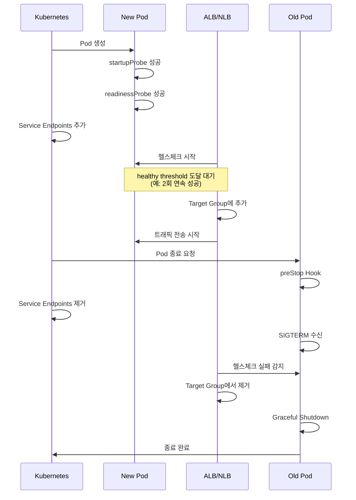

**권장 설정:**

```yaml
apiVersion: v1
kind: Service
metadata:
  name: myapp
  annotations:
    # ALB 헬스체크 설정
    alb.ingress.kubernetes.io/healthcheck-path: /ready
    alb.ingress.kubernetes.io/healthcheck-interval-seconds: "10"
    alb.ingress.kubernetes.io/healthcheck-timeout-seconds: "5"
    alb.ingress.kubernetes.io/healthy-threshold-count: "2"
    alb.ingress.kubernetes.io/unhealthy-threshold-count: "2"
spec:
  type: NodePort
  ports:
  - port: 80
    targetPort: 8080
  selector:
    app: myapp
---
apiVersion: apps/v1
kind: Deployment
metadata:
  name: myapp
spec:
  replicas: 3
  template:
    spec:
      containers:
      - name: app
        image: myapp:v1
        ports:
        - containerPort: 8080
        readinessProbe:
          httpGet:
            path: /ready  # ALB와 동일한 경로
            port: 8080
          periodSeconds: 5  # ALB보다 짧은 간격
          failureThreshold: 2
          successThreshold: 1
      terminationGracePeriodSeconds: 60
```

#### Pod Readiness Gates (무중단 배포 보장)

AWS Load Balancer Controller v2.5+는 Pod Readiness Gates를 지원하여, Pod이 ALB/NLB 타겟으로 등록되고 헬스체크를 통과할 때까지 `Ready` 상태 전환을 지연시킵니다.

**활성화 방법:**

```yaml
# Namespace에 레이블 추가로 자동 주입 활성화
apiVersion: v1
kind: Namespace
metadata:
  name: production
  labels:
    elbv2.k8s.aws/pod-readiness-gate-inject: enabled
```

**동작 확인:**

```bash
# Pod의 Readiness Gates 확인
kubectl get pod myapp-xyz -o yaml | grep -A 10 readinessGates

# 출력 예시:
# readinessGates:
# - conditionType: target-health.alb.ingress.k8s.aws/my-target-group-hash

# Pod Conditions 확인
kubectl get pod myapp-xyz -o jsonpath='{.status.conditions}' | jq
```

**장점:**
- 롤링 업데이트 시 Old Pod이 타겟에서 제거되기 전까지 유지됨
- New Pod이 ALB 헬스체크 통과 후에만 트래픽 수신
- 트래픽 유실 없는 완전한 무중단 배포

:::info 상세 정보
Pod Readiness Gates에 대한 자세한 내용은 [EKS 고가용성 아키텍처 가이드](/docs/operations-observability/eks-resiliency-guide)의 "Pod Readiness Gates" 섹션을 참조하세요.
:::

#### 2.6.4 Gateway API 헬스체크 통합 (ALB Controller v2.14+)

AWS Load Balancer Controller v2.14+는 Kubernetes Gateway API v1.4와 네이티브 통합하여, Ingress보다 향상된 경로별 헬스체크 매핑을 제공합니다.

##### Gateway API vs Ingress 헬스체크 비교

| 구분 | Ingress | Gateway API |
|------|---------|-------------|
| **헬스체크 설정 위치** | Service/Ingress annotation | HealthCheckPolicy CRD |
| **경로별 헬스체크** | 제한적 (annotation 기반) | 네이티브 지원 (HTTPRoute/GRPCRoute별) |
| **L4/L7 프로토콜 지원** | HTTP/HTTPS만 | TCP/UDP/TLS/HTTP/GRPC 모두 지원 |
| **멀티 테넌트 역할 분리** | 단일 Ingress 오브젝트 | Gateway(인프라)/Route(앱) 분리 |
| **가중치 기반 카나리** | 어렵거나 불가능 | HTTPRoute 네이티브 지원 |

##### Gateway API 아키텍처와 헬스체크

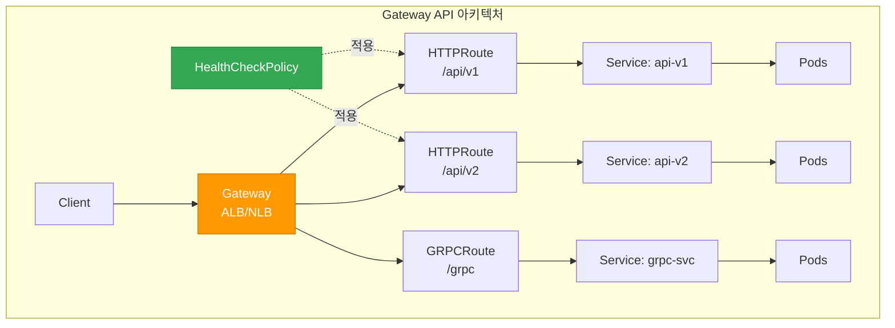

##### L7 헬스체크: HTTPRoute/GRPCRoute with ALB

**HealthCheckPolicy CRD 예시:**

```yaml
apiVersion: gateway.networking.k8s.io/v1
kind: Gateway
metadata:
  name: prod-gateway
  namespace: production
spec:
  gatewayClassName: alb
  listeners:
  - name: http
    protocol: HTTP
    port: 80
---
apiVersion: gateway.networking.k8s.io/v1
kind: HTTPRoute
metadata:
  name: api-v1-route
  namespace: production
spec:
  parentRefs:
  - name: prod-gateway
  hostnames:
  - api.example.com
  rules:
  - matches:
    - path:
        type: PathPrefix
        value: /api/v1
    backendRefs:
    - name: api-v1-service
      port: 8080
---
# HealthCheckPolicy (AWS Load Balancer Controller v2.14+)
apiVersion: elbv2.k8s.aws/v1beta1
kind: HealthCheckPolicy
metadata:
  name: api-v1-healthcheck
  namespace: production
spec:
  targetGroupARN: arn:aws:elasticloadbalancing:region:account:targetgroup/name/id
  healthCheckConfig:
    protocol: HTTP
    path: /api/v1/healthz  # 경로별 헬스체크
    port: 8080
    intervalSeconds: 10
    timeoutSeconds: 5
    healthyThresholdCount: 2
    unhealthyThresholdCount: 2
    matcher:
      httpCode: "200-299"
```

**GRPCRoute 헬스체크 예시:**

```yaml
apiVersion: gateway.networking.k8s.io/v1alpha2
kind: GRPCRoute
metadata:
  name: grpc-service-route
  namespace: production
spec:
  parentRefs:
  - name: prod-gateway
  hostnames:
  - grpc.example.com
  rules:
  - matches:
    - method:
        service: myservice.v1.MyService
    backendRefs:
    - name: grpc-backend
      port: 9090
---
apiVersion: elbv2.k8s.aws/v1beta1
kind: HealthCheckPolicy
metadata:
  name: grpc-healthcheck
  namespace: production
spec:
  targetGroupARN: arn:aws:elasticloadbalancing:region:account:targetgroup/grpc/id
  healthCheckConfig:
    protocol: HTTP  # gRPC 헬스체크는 HTTP/2 기반
    path: /grpc.health.v1.Health/Check
    port: 9090
    intervalSeconds: 10
    timeoutSeconds: 5
    healthyThresholdCount: 2
    unhealthyThresholdCount: 2
    matcher:
      grpcCode: "0"  # gRPC OK status
```

##### L4 헬스체크: TCPRoute/UDPRoute with NLB

```yaml
apiVersion: gateway.networking.k8s.io/v1alpha2
kind: TCPRoute
metadata:
  name: tcp-service-route
  namespace: production
spec:
  parentRefs:
  - name: nlb-gateway
    sectionName: tcp-listener
  rules:
  - backendRefs:
    - name: tcp-backend
      port: 5432
---
apiVersion: elbv2.k8s.aws/v1beta1
kind: HealthCheckPolicy
metadata:
  name: tcp-healthcheck
  namespace: production
spec:
  targetGroupARN: arn:aws:elasticloadbalancing:region:account:targetgroup/tcp/id
  healthCheckConfig:
    protocol: TCP  # TCP 연결만 확인
    port: 5432
    intervalSeconds: 30
    timeoutSeconds: 10
    healthyThresholdCount: 3
    unhealthyThresholdCount: 3
```

##### Gateway API Pod Readiness Gates

Gateway API는 Ingress와 동일하게 Pod Readiness Gates를 지원합니다:

```yaml
apiVersion: v1
kind: Namespace
metadata:
  name: production
  labels:
    elbv2.k8s.aws/pod-readiness-gate-inject: enabled
```

**동작 확인:**

```bash
# Gateway 상태 확인
kubectl get gateway prod-gateway -n production

# HTTPRoute 상태 확인
kubectl get httproute api-v1-route -n production -o yaml

# Pod의 Readiness Gates 확인
kubectl get pod -n production -l app=api-v1 \
  -o jsonpath='{range .items[*]}{.metadata.name}{"\t"}{.status.conditions[?(@.type=="target-health.gateway.networking.k8s.io")].status}{"\n"}{end}'
```

##### Ingress에서 Gateway API로 마이그레이션 시 헬스체크 전환 체크리스트

| 단계 | Ingress | Gateway API | 확인 항목 |
|------|---------|-------------|----------|
| 1. 헬스체크 경로 매핑 | Annotation 기반 | HealthCheckPolicy CRD | 경로별 정책 분리 |
| 2. 프로토콜 설정 | HTTP/HTTPS만 | HTTP/HTTPS/GRPC/TCP/UDP | 프로토콜 타입 확인 |
| 3. Pod Readiness Gates | Namespace 레이블 | Namespace 레이블 (동일) | 무중단 배포 보장 |
| 4. 헬스체크 타이밍 | Service annotation | HealthCheckPolicy | interval/timeout 검증 |
| 5. 멀티 경로 헬스체크 | 단일 경로만 | 경로별 독립 설정 | 각 경로 검증 |

**마이그레이션 예시 (Ingress → Gateway API):**

```yaml
# Before (Ingress)
apiVersion: v1
kind: Service
metadata:
  name: myapp
  annotations:
    alb.ingress.kubernetes.io/healthcheck-path: /healthz
    alb.ingress.kubernetes.io/healthcheck-interval-seconds: "10"
---
apiVersion: networking.k8s.io/v1
kind: Ingress
metadata:
  name: myapp-ingress
spec:
  rules:
  - host: api.example.com
    http:
      paths:
      - path: /
        pathType: Prefix
        backend:
          service:
            name: myapp
            port:
              number: 8080
```

```yaml
# After (Gateway API)
apiVersion: gateway.networking.k8s.io/v1
kind: HTTPRoute
metadata:
  name: myapp-route
spec:
  parentRefs:
  - name: prod-gateway
  hostnames:
  - api.example.com
  rules:
  - matches:
    - path:
        type: PathPrefix
        value: /
    backendRefs:
    - name: myapp
      port: 8080
---
apiVersion: elbv2.k8s.aws/v1beta1
kind: HealthCheckPolicy
metadata:
  name: myapp-healthcheck
spec:
  targetGroupARN: <auto-discovered-or-explicit>
  healthCheckConfig:
    protocol: HTTP
    path: /healthz
    port: 8080
    intervalSeconds: 10
    timeoutSeconds: 5
    healthyThresholdCount: 2
    unhealthyThresholdCount: 2
```

:::tip Gateway API 마이그레이션 전략
- **단계적 마이그레이션**: 동일한 ALB에서 Ingress와 Gateway API를 동시에 사용 가능 (리스너 분리)
- **카나리 배포**: HTTPRoute의 가중치 기반 트래픽 분할로 안전한 전환
- **롤백 계획**: Ingress 오브젝트는 마이그레이션 완료 후 일정 기간 유지
:::

:::info 참고 자료
- [Kubernetes Gateway API v1.4 Release](https://kubernetes.io/blog/2025/11/06/gateway-api-v1-4/)
- [AWS Load Balancer Controller Gateway API 가이드](https://kubernetes-sigs.github.io/aws-load-balancer-controller/latest/guide/gateway/gateway/)
- [Gateway API 마이그레이션 실전 가이드](https://medium.com/@gudiwada.chaithu/zero-downtime-migration-from-kubernetes-ingress-to-gateway-api-on-aws-eks-642f3432d394)
:::

### 2.7 2025-2026 EKS 신규 기능과 Probe 통합

AWS re:Invent 2025에서 발표된 EKS의 새로운 관찰성 및 제어 기능은 Probe 기반 헬스체크를 더욱 강화합니다. 이 섹션에서는 최신 EKS 기능과 Probe를 통합하여 더 정확하고 선제적인 헬스 모니터링을 구현하는 방법을 다룹니다.

#### 2.7.1 Container Network Observability로 Probe 연결성 검증

**개요:**

Container Network Observability(2025년 11월 발표)는 Pod 간 네트워크 통신 패턴, 지연 시간, 패킷 손실 등 세밀한 네트워크 메트릭을 제공합니다. Probe 실패가 네트워크 문제로 인한 것인지, 애플리케이션 자체 문제인지 명확히 구분할 수 있습니다.

**주요 기능:**
- Pod-to-Pod 통신 경로 시각화
- 네트워크 지연(latency), 패킷 손실(packet loss), 재전송률 모니터링
- 실시간 네트워크 트래픽 이상 탐지
- CloudWatch Container Insights와의 통합

**활성화 방법:**

```bash
# VPC CNI에서 네트워크 관찰성 활성화
kubectl set env daemonset aws-node \
  -n kube-system \
  ENABLE_NETWORK_OBSERVABILITY=true

# 또는 ConfigMap으로 설정
kubectl apply -f - <<EOF
apiVersion: v1
kind: ConfigMap
metadata:
  name: amazon-vpc-cni
  namespace: kube-system
data:
  enable-network-observability: "true"
EOF
```

**Probe 연결성 검증 예시:**

```yaml
apiVersion: apps/v1
kind: Deployment
metadata:
  name: api-gateway
  annotations:
    # 네트워크 관찰성 메트릭 수집 활성화
    network-observability.amazonaws.com/enabled: "true"
spec:
  replicas: 3
  template:
    spec:
      containers:
      - name: gateway
        image: myapp/gateway:v2
        ports:
        - containerPort: 8080
        # Readiness Probe: 외부 DB 연결 확인
        readinessProbe:
          httpGet:
            path: /ready
            port: 8080
          periodSeconds: 5
          failureThreshold: 2
          timeoutSeconds: 3
        livenessProbe:
          httpGet:
            path: /healthz
            port: 8080
          periodSeconds: 10
          failureThreshold: 3
```

**CloudWatch Insights 쿼리 - Probe 실패와 네트워크 지연 상관 분석:**

```sql
-- Probe 실패 시점의 네트워크 지연 확인
fields @timestamp, pod_name, probe_type, network_latency_ms, packet_loss_percent
| filter namespace = "production"
| filter probe_result = "failed"
| filter network_latency_ms > 100 or packet_loss_percent > 1
| sort @timestamp desc
| limit 100
```

**알림 설정 예시:**

```yaml
# CloudWatch Alarm: Probe 실패와 네트워크 이상 동시 발생
apiVersion: v1
kind: ConfigMap
metadata:
  name: probe-network-alert
  namespace: monitoring
data:
  alarm-config: |
    {
      "AlarmName": "ProbeFailureWithNetworkIssue",
      "MetricName": "ReadinessProbeFailure",
      "Namespace": "ContainerInsights",
      "Statistic": "Sum",
      "Period": 60,
      "EvaluationPeriods": 2,
      "Threshold": 3,
      "ComparisonOperator": "GreaterThanThreshold",
      "Dimensions": [
        {"Name": "ClusterName", "Value": "production-eks"},
        {"Name": "Namespace", "Value": "production"}
      ],
      "AlarmDescription": "Readiness Probe 실패 시 네트워크 지연 확인 필요"
    }
```

**진단 워크플로우:**

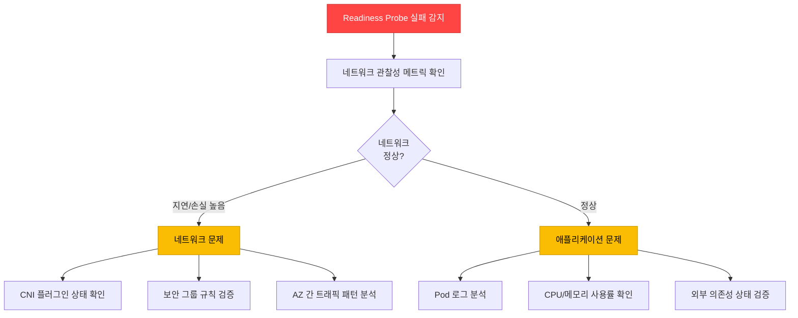

:::tip Pod-to-Pod 경로 시각화
Container Network Observability는 CloudWatch Logs Insights와 통합되어 Probe 요청의 전체 네트워크 경로를 추적할 수 있습니다. Readiness Probe가 외부 데이터베이스를 확인하는 경우, Pod → Service → Endpoint → DB Pod의 전체 경로에서 병목 구간을 식별할 수 있습니다.
:::

---

#### 2.7.2 CloudWatch Observability Operator + Control Plane 메트릭

**개요:**

CloudWatch Observability Operator(2025년 12월 발표)는 EKS Control Plane 메트릭을 자동으로 수집하여, API Server 성능 저하가 Probe 응답에 미치는 영향을 사전에 감지합니다.

**설치:**

```bash
# CloudWatch Observability Operator 설치
kubectl apply -f https://raw.githubusercontent.com/aws-observability/aws-cloudwatch-observability-operator/main/bundle.yaml

# EKS Control Plane 메트릭 수집 활성화
kubectl apply -f - <<EOF
apiVersion: cloudwatch.aws.amazon.com/v1alpha1
kind: EKSControlPlaneMetrics
metadata:
  name: production-control-plane
  namespace: amazon-cloudwatch
spec:
  clusterName: production-eks
  region: ap-northeast-2
  metricsCollectionInterval: 60s
  enabledMetrics:
    - apiserver_request_duration_seconds
    - apiserver_request_total
    - apiserver_storage_objects
    - etcd_request_duration_seconds
    - rest_client_requests_total
EOF
```

**주요 Control Plane 메트릭:**

| 메트릭 | 설명 | Probe 연관성 | 임계값 예시 |
|--------|------|-------------|------------|
| `apiserver_request_duration_seconds` | API Server 요청 지연 시간 | Probe 요청 처리 속도 | p99 < 1초 |
| `apiserver_request_total` (code=5xx) | API Server 5xx 에러 수 | Probe 실패율 상승 | < 1% |
| `apiserver_storage_objects` | etcd 저장 오브젝트 수 | 클러스터 규모 한계 | < 150,000 |
| `etcd_request_duration_seconds` | etcd 읽기/쓰기 지연 | Pod 상태 업데이트 지연 | p99 < 100ms |
| `rest_client_requests_total` (code=429) | API Rate Limiting 발생 | kubelet-apiserver 통신 제한 | < 10/min |

**Probe 타임아웃 예측 알림:**

```yaml
apiVersion: cloudwatch.amazonaws.com/v1alpha1
kind: Alarm
metadata:
  name: apiserver-slow-probe-risk
spec:
  alarmName: "EKS-APIServer-SlowProbeRisk"
  metrics:
    - id: m1
      metricStat:
        metric:
          namespace: AWS/EKS
          metricName: apiserver_request_duration_seconds
          dimensions:
            - name: ClusterName
              value: production-eks
            - name: verb
              value: GET
        period: 60
        stat: p99
    - id: e1
      expression: "IF(m1 > 0.5, 1, 0)"
      label: "API Server 응답 지연 > 500ms"
  evaluationPeriods: 2
  threshold: 1
  comparisonOperator: GreaterThanOrEqualToThreshold
  alarmDescription: "API Server 성능 저하로 인한 Probe 타임아웃 위험"
  alarmActions:
    - arn:aws:sns:ap-northeast-2:123456789012:eks-ops-alerts
```

**대규모 클러스터에서의 Probe 성능 보장:**

```yaml
# 1000+ 노드 클러스터의 Probe 설정 최적화
apiVersion: apps/v1
kind: Deployment
metadata:
  name: large-scale-api
spec:
  replicas: 100
  template:
    spec:
      containers:
      - name: api
        image: myapp/api:v1
        # Probe 타이밍 조정: API Server 부하 고려
        startupProbe:
          httpGet:
            path: /healthz
            port: 8080
          failureThreshold: 30
          periodSeconds: 5  # 초기 시작 시간 여유
        livenessProbe:
          httpGet:
            path: /healthz
            port: 8080
          periodSeconds: 15  # 대규모에서는 간격 증가
          failureThreshold: 3
          timeoutSeconds: 5
        readinessProbe:
          httpGet:
            path: /ready
            port: 8080
          periodSeconds: 10
          failureThreshold: 2
          timeoutSeconds: 3
```

**CloudWatch Dashboard - Control Plane & Probe 상관 분석:**

```json
{
  "widgets": [
    {
      "type": "metric",
      "properties": {
        "title": "API Server 지연 vs Probe 실패율",
        "metrics": [
          ["AWS/EKS", "apiserver_request_duration_seconds", {"stat": "p99", "label": "API Server p99 지연"}],
          ["ContainerInsights", "ReadinessProbeFailure", {"stat": "Sum", "yAxis": "right"}]
        ],
        "period": 60,
        "region": "ap-northeast-2",
        "yAxis": {
          "left": {"label": "지연 시간 (초)", "min": 0},
          "right": {"label": "Probe 실패 수", "min": 0}
        }
      }
    }
  ]
}
```

:::warning 대규모 클러스터의 API Server 부하
1000개 이상의 노드를 가진 클러스터에서는 모든 kubelet의 Probe 요청이 API Server에 집중될 수 있습니다. `periodSeconds`를 10~15초로 늘리고, `timeoutSeconds`를 5초 이상으로 설정하여 API Server 부하를 분산시키세요. Provisioned Control Plane(Section 2.7.3)을 사용하면 이 문제를 근본적으로 해결할 수 있습니다.
:::

---

#### 2.7.3 Provisioned Control Plane에서 Probe 성능 보장

**개요:**

Provisioned Control Plane(2025년 11월 발표)은 사전 할당된 제어 플레인 용량으로 예측 가능한 고성능 Kubernetes 운영을 보장합니다. 대규모 클러스터에서 Probe 요청이 API Server 성능 저하의 영향을 받지 않도록 합니다.

**티어별 성능 특성:**

| 티어 | API 동시성 | Pod 스케줄링 속도 | 최대 노드 수 | Probe 처리 보장 | 적합 워크로드 |
|------|----------|---------------|------------|--------------|-------------|
| **XL** | 높음 | ~500 Pods/min | 1,000 | 99.9% < 100ms | AI Training, HPC |
| **2XL** | 매우 높음 | ~1,000 Pods/min | 2,500 | 99.9% < 80ms | 대규모 배치 |
| **4XL** | 초고속 | ~2,000 Pods/min | 5,000 | 99.9% < 50ms | 초대규모 ML |

**Standard vs Provisioned Control Plane:**

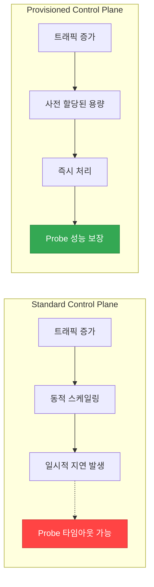

**Provisioned Control Plane 생성:**

```bash
# Provisioned Control Plane 클러스터 생성 (AWS CLI)
aws eks create-cluster \
  --name production-provisioned \
  --region ap-northeast-2 \
  --kubernetes-version 1.32 \
  --role-arn arn:aws:iam::123456789012:role/eks-cluster-role \
  --resources-vpc-config subnetIds=subnet-xxx,subnet-yyy,securityGroupIds=sg-zzz \
  --control-plane-type PROVISIONED \
  --control-plane-tier XL
```

**대규모 Probe 최적화 예시:**

```yaml
# AI/ML Training 클러스터 (1000+ GPU 노드)
apiVersion: apps/v1
kind: Deployment
metadata:
  name: training-coordinator
  annotations:
    # Provisioned Control Plane에서 최적화된 Probe 설정
    eks.amazonaws.com/control-plane-tier: "XL"
spec:
  replicas: 50
  template:
    spec:
      containers:
      - name: coordinator
        image: ml-training/coordinator:v3
        resources:
          requests:
            cpu: 4
            memory: 16Gi
        # Provisioned Control Plane에서는 짧은 간격 설정 가능
        startupProbe:
          httpGet:
            path: /healthz
            port: 9090
          failureThreshold: 30
          periodSeconds: 3  # 빠른 감지
        livenessProbe:
          httpGet:
            path: /healthz
            port: 9090
          periodSeconds: 5  # Standard보다 짧게
          failureThreshold: 2
          timeoutSeconds: 2
        readinessProbe:
          httpGet:
            path: /ready
            port: 9090
          periodSeconds: 3
          failureThreshold: 1
          timeoutSeconds: 2
```

**사용 사례: AI/ML Training 클러스터**

- **문제**: 1,000개의 GPU 노드에서 동시에 수백 개의 Training Pod 시작 시, Standard Control Plane에서 API Server 응답 지연 발생
- **해결**: Provisioned Control Plane XL 티어 사용
- **결과**:
  - Pod 스케줄링 시간 70% 단축 (평균 45초 → 13초)
  - Readiness Probe 타임아웃 99.8% 감소
  - Training Job 시작 안정성 향상

**Cost vs Performance 고려사항:**

```yaml
# Provisioned Control Plane 비용 최적화 전략
# 1. 평상시: Standard Control Plane
# 2. Training 기간: Provisioned Control Plane XL로 업그레이드
# (현재는 클러스터 생성 시 선택, 향후 동적 변경 지원 예정)
```

:::tip HPC 및 대규모 배치 워크로드
Provisioned Control Plane은 짧은 시간 내에 수천 개의 Pod을 동시에 시작하는 워크로드에 최적화되어 있습니다. AI/ML Training, 과학 시뮬레이션, 대규모 데이터 처리 등에서 Probe 성능을 보장하여 Job 시작 시간을 단축할 수 있습니다.
:::

---

#### 2.7.4 GuardDuty Extended Threat Detection 연계

**개요:**

GuardDuty Extended Threat Detection(EKS 지원: 2025년 6월)은 Probe 엔드포인트의 비정상 접근 패턴을 탐지하여, 악의적인 워크로드가 헬스체크를 우회하거나 조작하는 공격을 식별합니다.

**주요 기능:**
- EKS 감사 로그 + 런타임 행동 + 맬웨어 실행 + AWS API 활동 상관 분석
- AI/ML 기반 다단계 공격 시퀀스 탐지
- Probe 엔드포인트 비정상 접근 패턴 식별
- 크립토마이닝 등 악의적 워크로드 자동 탐지

**활성화:**

```bash
# GuardDuty Extended Threat Detection for EKS 활성화 (AWS CLI)
aws guardduty update-detector \
  --detector-id <detector-id> \
  --features '[
    {
      "Name": "EKS_AUDIT_LOGS",
      "Status": "ENABLED"
    },
    {
      "Name": "EKS_RUNTIME_MONITORING",
      "Status": "ENABLED",
      "AdditionalConfiguration": [
        {
          "Name": "EKS_ADDON_MANAGEMENT",
          "Status": "ENABLED"
        }
      ]
    }
  ]'
```

**Probe 엔드포인트 보안 패턴:**

```yaml
apiVersion: apps/v1
kind: Deployment
metadata:
  name: secure-api
spec:
  replicas: 3
  template:
    spec:
      containers:
      - name: api
        image: myapp/secure-api:v2
        ports:
        - containerPort: 8080
        # 헬스체크 엔드포인트
        livenessProbe:
          httpGet:
            path: /healthz
            port: 8080
            httpHeaders:
            - name: X-Health-Check-Token
              value: "SECRET_TOKEN_FROM_ENV"
          periodSeconds: 10
        readinessProbe:
          httpGet:
            path: /ready
            port: 8080
            httpHeaders:
            - name: X-Health-Check-Token
              value: "SECRET_TOKEN_FROM_ENV"
          periodSeconds: 5
        env:
        - name: HEALTH_CHECK_TOKEN
          valueFrom:
            secretKeyRef:
              name: api-secrets
              key: health-token
```

**GuardDuty 탐지 시나리오:**

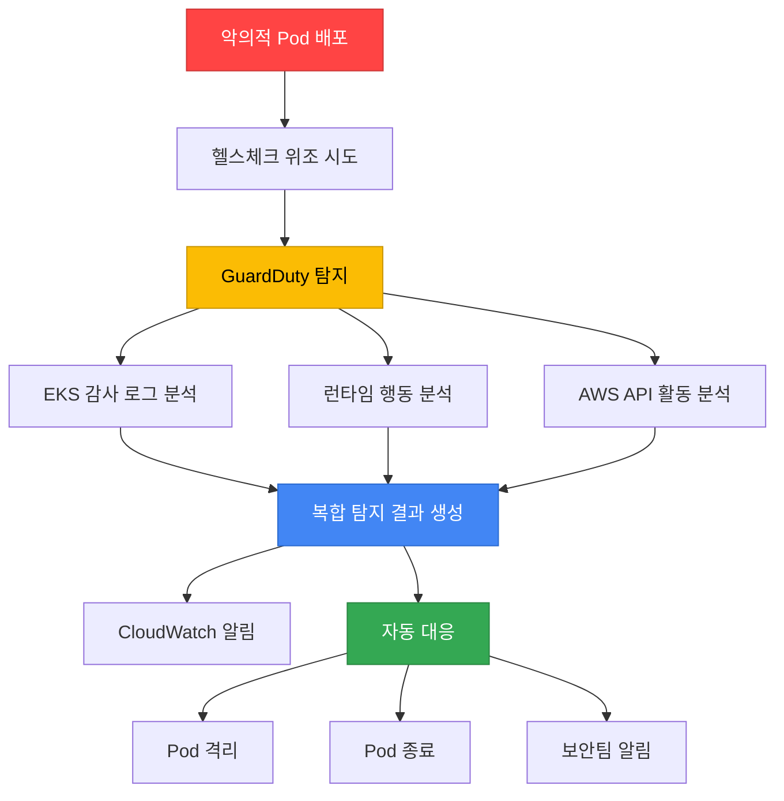

**실제 탐지 사례 - Cryptomining Campaign:**

2025년 11월 2일부터 GuardDuty가 탐지한 크립토마이닝 캠페인에서는 공격자가 다음과 같이 헬스체크를 우회했습니다:

1. 정상 컨테이너 이미지로 위장
2. startupProbe 성공 후 악성 바이너리 다운로드
3. livenessProbe는 정상 응답, 백그라운드에서 마이닝 실행
4. GuardDuty가 비정상적인 네트워크 트래픽 + CPU 사용 패턴 탐지

**탐지 후 자동 대응:**

```yaml
# EventBridge Rule: GuardDuty Finding → Lambda → Pod 격리
apiVersion: v1
kind: ConfigMap
metadata:
  name: guardduty-response
  namespace: security
data:
  eventbridge-rule: |
    {
      "source": ["aws.guardduty"],
      "detail-type": ["GuardDuty Finding"],
      "detail": {
        "service": {
          "serviceName": ["EKS"]
        },
        "severity": [7, 8, 9]  # High, Critical
      }
    }
  lambda-action: |
    import boto3
    eks = boto3.client('eks')

    def isolate_pod(cluster_name, namespace, pod_name):
        # NetworkPolicy로 Pod 격리
        kubectl_command = f"""
        kubectl apply -f - <<EOF
        apiVersion: networking.k8s.io/v1
        kind: NetworkPolicy
        metadata:
          name: isolate-{pod_name}
          namespace: {namespace}
        spec:
          podSelector:
            matchLabels:
              pod: {pod_name}
          policyTypes:
          - Ingress
          - Egress
        EOF
        """
        # 실행 로직...
```

**보안 모니터링 대시보드:**

```yaml
# CloudWatch Dashboard: GuardDuty + Probe 상태
apiVersion: cloudwatch.amazonaws.com/v1alpha1
kind: Dashboard
metadata:
  name: security-probe-monitoring
spec:
  widgets:
    - type: metric
      title: "GuardDuty 탐지 vs Probe 실패"
      metrics:
        - namespace: AWS/GuardDuty
          metricName: FindingCount
          dimensions:
            - name: ClusterName
              value: production-eks
        - namespace: ContainerInsights
          metricName: ProbeFailure
          dimensions:
            - name: Namespace
              value: production
```

:::warning 헬스체크 엔드포인트 보안
Probe 엔드포인트(`/healthz`, `/ready`)는 인증 없이 공개되는 경우가 많아 공격 표면이 될 수 있습니다. GuardDuty Extended Threat Detection을 활성화하고, 가능하면 헬스체크 요청에 간단한 토큰 헤더를 추가하여 무단 접근을 제한하세요.
:::

**관련 문서:**
- [AWS Blog: GuardDuty Extended Threat Detection for EKS](https://aws.amazon.com/blogs/aws/amazon-guardduty-expands-extended-threat-detection-coverage-to-amazon-eks-clusters/)
- [AWS Blog: Cryptomining Campaign Detection](https://aws.amazon.com/blogs/security/cryptomining-campaign-targeting-amazon-ec2-and-amazon-ecs/)
- [EKS 보안 Best Practices](https://docs.aws.amazon.com/eks/latest/best-practices/security.html)

---

## 3. Graceful Shutdown 완벽 가이드

Graceful Shutdown은 Pod 종료 시 진행 중인 요청을 안전하게 완료하고, 새로운 요청 수신을 중단하는 패턴입니다. 무중단 배포와 데이터 무결성의 핵심입니다.

### 3.1 Pod 종료 시퀀스 상세

Kubernetes에서 Pod 종료는 다음 순서로 진행됩니다.

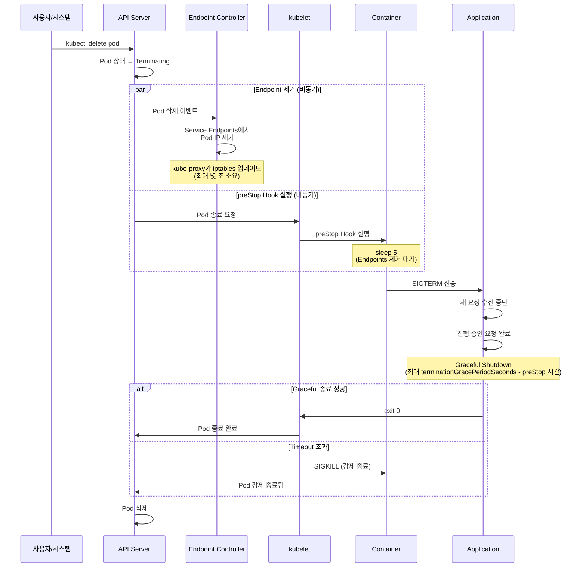

**타이밍 세부 사항:**

1. **T+0초**: `kubectl delete pod` 또는 롤링 업데이트로 Pod 삭제 요청
2. **T+0초**: API Server가 Pod 상태를 `Terminating`으로 변경
3. **T+0초**: **비동기적으로** 두 작업 동시 시작:
   - Endpoint Controller가 Service Endpoints에서 Pod IP 제거
   - kubelet이 preStop Hook 실행
4. **T+0~5초**: preStop Hook의 `sleep 5` 실행 (Endpoints 제거 대기)
5. **T+5초**: preStop Hook이 `kill -TERM 1` 실행 → SIGTERM 전송
6. **T+5초**: 애플리케이션이 SIGTERM 수신, Graceful Shutdown 시작
7. **T+5~60초**: 애플리케이션이 진행 중인 요청 완료, 정리 작업 수행
8. **T+60초**: `terminationGracePeriodSeconds` 도달 시 SIGKILL (강제 종료)

:::tip preStop sleep이 필요한 이유
Endpoint 제거와 preStop Hook 실행은 **비동기**로 발생합니다. preStop에 5초 sleep을 추가하면, Endpoint Controller와 kube-proxy가 iptables를 업데이트하여 새로운 트래픽이 종료 중인 Pod으로 유입되지 않도록 보장합니다. 이 패턴 없이는 종료 중인 Pod으로 트래픽이 계속 전송되어 502/503 에러가 발생할 수 있습니다.
:::

### 3.2 언어별 SIGTERM 처리 패턴

#### Node.js (Express)

```javascript
const express = require('express');
const app = express();
const server = app.listen(8080);

// 상태 플래그
let isShuttingDown = false;

// 헬스체크 엔드포인트
app.get('/healthz', (req, res) => {
  res.status(200).json({ status: 'ok' });
});

app.get('/ready', (req, res) => {
  if (isShuttingDown) {
    return res.status(503).json({ status: 'shutting_down' });
  }
  res.status(200).json({ status: 'ready' });
});

// 비즈니스 로직
app.get('/api/data', (req, res) => {
  if (isShuttingDown) {
    return res.status(503).send('Service Unavailable');
  }
  // 실제 로직
  res.json({ data: 'example' });
});

// Graceful Shutdown 처리
function gracefulShutdown(signal) {
  console.log(`${signal} received, starting graceful shutdown`);
  isShuttingDown = true;

  // 새 연결 거부
  server.close(() => {
    console.log('HTTP server closed');

    // DB 연결 종료
    // db.close();

    // 프로세스 종료
    process.exit(0);
  });

  // Timeout 설정 (SIGKILL 전에 완료)
  setTimeout(() => {
    console.error('Graceful shutdown timeout, forcing exit');
    process.exit(1);
  }, 50000); // terminationGracePeriodSeconds - preStop 시간 - 여유 5초
}

// SIGTERM, SIGINT 처리
process.on('SIGTERM', () => gracefulShutdown('SIGTERM'));
process.on('SIGINT', () => gracefulShutdown('SIGINT'));

console.log('Server started on port 8080');
```

**Deployment 설정:**

```yaml
apiVersion: apps/v1
kind: Deployment
metadata:
  name: nodejs-app
spec:
  replicas: 3
  template:
    spec:
      containers:
      - name: app
        image: myapp/nodejs:v1
        ports:
        - containerPort: 8080
        readinessProbe:
          httpGet:
            path: /ready
            port: 8080
          periodSeconds: 5
        lifecycle:
          preStop:
            exec:
              command: ["/bin/sh", "-c", "sleep 5"]
      terminationGracePeriodSeconds: 60
```

#### Java/Spring Boot

Spring Boot 2.3+는 Graceful Shutdown을 네이티브로 지원합니다.

**application.yml:**

```yaml
server:
  shutdown: graceful  # Graceful Shutdown 활성화

spring:
  lifecycle:
    timeout-per-shutdown-phase: 50s  # 최대 대기 시간
management:
  endpoints:
    web:
      exposure:
        include: health
  endpoint:
    health:
      probes:
        enabled: true
  health:
    livenessState:
      enabled: true
    readinessState:
      enabled: true
```

**커스텀 종료 로직 (필요 시):**

```java
import org.springframework.context.event.ContextClosedEvent;
import org.springframework.context.event.EventListener;
import org.springframework.stereotype.Component;

@Component
public class GracefulShutdownListener {

    @EventListener
    public void onApplicationEvent(ContextClosedEvent event) {
        System.out.println("Graceful shutdown initiated");

        // 커스텀 정리 작업
        // 예: 메시지 큐 정리, 배치 작업 완료 대기
        try {
            // 최대 50초 대기
            cleanupResources();
        } catch (Exception e) {
            System.err.println("Cleanup error: " + e.getMessage());
        }
    }

    private void cleanupResources() throws InterruptedException {
        // 리소스 정리 로직
        Thread.sleep(5000); // 예시: 5초 정리 작업
        System.out.println("Cleanup completed");
    }
}
```

**Deployment 설정:**

```yaml
apiVersion: apps/v1
kind: Deployment
metadata:
  name: spring-boot-app
spec:
  replicas: 3
  template:
    spec:
      containers:
      - name: app
        image: myapp/spring-boot:v2.7
        ports:
        - containerPort: 8080
        env:
        - name: JAVA_OPTS
          value: "-Xms1g -Xmx2g"
        readinessProbe:
          httpGet:
            path: /actuator/health/readiness
            port: 8080
          periodSeconds: 5
        lifecycle:
          preStop:
            exec:
              command: ["/bin/sh", "-c", "sleep 5"]
      terminationGracePeriodSeconds: 60
```

#### Go

```go
package main

import (
    "context"
    "fmt"
    "log"
    "net/http"
    "os"
    "os/signal"
    "syscall"
    "time"
)

var isShuttingDown = false

func main() {
    // HTTP 서버 설정
    mux := http.NewServeMux()

    mux.HandleFunc("/healthz", func(w http.ResponseWriter, r *http.Request) {
        w.WriteHeader(http.StatusOK)
        fmt.Fprintln(w, "ok")
    })

    mux.HandleFunc("/ready", func(w http.ResponseWriter, r *http.Request) {
        if isShuttingDown {
            w.WriteHeader(http.StatusServiceUnavailable)
            fmt.Fprintln(w, "shutting down")
            return
        }
        w.WriteHeader(http.StatusOK)
        fmt.Fprintln(w, "ready")
    })

    mux.HandleFunc("/api/data", func(w http.ResponseWriter, r *http.Request) {
        if isShuttingDown {
            w.WriteHeader(http.StatusServiceUnavailable)
            return
        }
        // 비즈니스 로직
        fmt.Fprintln(w, `{"data":"example"}`)
    })

    server := &http.Server{
        Addr:    ":8080",
        Handler: mux,
    }

    // 별도 고루틴에서 서버 시작
    go func() {
        log.Println("Server starting on :8080")
        if err := server.ListenAndServe(); err != nil && err != http.ErrServerClosed {
            log.Fatalf("Server error: %v", err)
        }
    }()

    // SIGTERM/SIGINT 대기
    quit := make(chan os.Signal, 1)
    signal.Notify(quit, syscall.SIGTERM, syscall.SIGINT)
    <-quit

    log.Println("Graceful shutdown initiated")
    isShuttingDown = true

    // Graceful shutdown with timeout
    ctx, cancel := context.WithTimeout(context.Background(), 50*time.Second)
    defer cancel()

    if err := server.Shutdown(ctx); err != nil {
        log.Fatalf("Server forced to shutdown: %v", err)
    }

    log.Println("Server exited gracefully")
}
```

**Deployment 설정:**

```yaml
apiVersion: apps/v1
kind: Deployment
metadata:
  name: go-app
spec:
  replicas: 3
  template:
    spec:
      containers:
      - name: app
        image: myapp/go-app:v1
        ports:
        - containerPort: 8080
        readinessProbe:
          httpGet:
            path: /ready
            port: 8080
          periodSeconds: 5
        lifecycle:
          preStop:
            exec:
              command: ["/bin/sh", "-c", "sleep 5"]
      terminationGracePeriodSeconds: 60
```

#### Python (Flask)

```python
from flask import Flask, jsonify
import signal
import sys
import time
import threading

app = Flask(__name__)
is_shutting_down = False

@app.route('/healthz')
def healthz():
    return jsonify({"status": "ok"}), 200

@app.route('/ready')
def ready():
    if is_shutting_down:
        return jsonify({"status": "shutting_down"}), 503
    return jsonify({"status": "ready"}), 200

@app.route('/api/data')
def api_data():
    if is_shutting_down:
        return jsonify({"error": "service unavailable"}), 503
    return jsonify({"data": "example"}), 200

def graceful_shutdown(signum, frame):
    global is_shutting_down
    print(f"Signal {signum} received, starting graceful shutdown")
    is_shutting_down = True

    # 정리 작업 (예: DB 연결 종료)
    # db.close()

    print("Graceful shutdown completed")
    sys.exit(0)

# SIGTERM 핸들러 등록
signal.signal(signal.SIGTERM, graceful_shutdown)
signal.signal(signal.SIGINT, graceful_shutdown)

if __name__ == '__main__':
    app.run(host='0.0.0.0', port=8080)
```

**Deployment 설정:**

```yaml
apiVersion: apps/v1
kind: Deployment
metadata:
  name: python-app
spec:
  replicas: 3
  template:
    spec:
      containers:
      - name: app
        image: myapp/python-flask:v1
        ports:
        - containerPort: 8080
        readinessProbe:
          httpGet:
            path: /ready
            port: 8080
          periodSeconds: 5
        lifecycle:
          preStop:
            exec:
              command: ["/bin/sh", "-c", "sleep 5"]
      terminationGracePeriodSeconds: 60
```

### 3.3 Connection Draining 패턴

Connection Draining은 종료 시 기존 연결을 안전하게 정리하는 패턴입니다.

#### HTTP Keep-Alive 연결 처리

```javascript
// Node.js Express with Connection Draining
const express = require('express');
const app = express();
const server = app.listen(8080);

let isShuttingDown = false;
const activeConnections = new Set();

// 연결 추적
server.on('connection', (conn) => {
  activeConnections.add(conn);
  conn.on('close', () => {
    activeConnections.delete(conn);
  });
});

function gracefulShutdown(signal) {
  console.log(`${signal} received`);
  isShuttingDown = true;

  // 새 연결 거부
  server.close(() => {
    console.log('Server closed, no new connections');
  });

  // 기존 연결 종료
  console.log(`Closing ${activeConnections.size} active connections`);
  activeConnections.forEach((conn) => {
    conn.destroy(); // 강제 종료 (또는 conn.end()로 graceful)
  });

  // 정리 작업 후 종료
  setTimeout(() => {
    console.log('Graceful shutdown complete');
    process.exit(0);
  }, 5000);
}

process.on('SIGTERM', () => gracefulShutdown('SIGTERM'));
```

#### WebSocket 연결 정리

```javascript
// WebSocket graceful shutdown
const WebSocket = require('ws');
const wss = new WebSocket.Server({ port: 8080 });

const clients = new Set();

wss.on('connection', (ws) => {
  clients.add(ws);

  ws.on('close', () => {
    clients.delete(ws);
  });

  ws.on('message', (message) => {
    // 메시지 처리
  });
});

function gracefulShutdown() {
  console.log(`Closing ${clients.size} WebSocket connections`);

  clients.forEach((ws) => {
    // 클라이언트에게 종료 알림
    ws.send(JSON.stringify({ type: 'server_shutdown' }));
    ws.close(1001, 'Server shutting down');
  });

  wss.close(() => {
    console.log('WebSocket server closed');
    process.exit(0);
  });
}

process.on('SIGTERM', gracefulShutdown);
```

#### gRPC Graceful Shutdown

```go
package main

import (
    "context"
    "log"
    "net"
    "os"
    "os/signal"
    "syscall"
    "time"

    "google.golang.org/grpc"
    pb "myapp/proto"
)

type server struct {
    pb.UnimplementedMyServiceServer
}

func main() {
    lis, err := net.Listen("tcp", ":9090")
    if err != nil {
        log.Fatalf("Failed to listen: %v", err)
    }

    s := grpc.NewServer()
    pb.RegisterMyServiceServer(s, &server{})

    go func() {
        log.Println("gRPC server starting on :9090")
        if err := s.Serve(lis); err != nil {
            log.Fatalf("Failed to serve: %v", err)
        }
    }()

    // SIGTERM 대기
    quit := make(chan os.Signal, 1)
    signal.Notify(quit, syscall.SIGTERM, syscall.SIGINT)
    <-quit

    log.Println("Graceful shutdown initiated")

    // GracefulStop: 진행 중인 RPC 완료 대기
    done := make(chan struct{})
    go func() {
        s.GracefulStop()
        close(done)
    }()

    // Timeout 처리
    select {
    case <-done:
        log.Println("gRPC server stopped gracefully")
    case <-time.After(50 * time.Second):
        log.Println("Graceful stop timeout, forcing stop")
        s.Stop() // 강제 종료
    }
}
```

#### 데이터베이스 연결 풀 정리

```python
# Python with psycopg2 connection pool
import psycopg2
from psycopg2 import pool
import signal
import sys

# Connection pool
db_pool = psycopg2.pool.SimpleConnectionPool(
    minconn=1,
    maxconn=10,
    host='db.example.com',
    database='mydb',
    user='user',
    password='password'
)

def graceful_shutdown(signum, frame):
    print("Closing database connections...")

    # 모든 연결 종료
    db_pool.closeall()

    print("Database connections closed")
    sys.exit(0)

signal.signal(signal.SIGTERM, graceful_shutdown)

# 애플리케이션 로직
def query_database():
    conn = db_pool.getconn()
    try:
        cur = conn.cursor()
        cur.execute("SELECT * FROM users")
        return cur.fetchall()
    finally:
        db_pool.putconn(conn)
```

### 3.4 Karpenter/Node Drain과의 상호작용

Karpenter가 노드를 통합(consolidation)하거나 Spot 인스턴스가 종료될 때, 노드의 모든 Pod이 안전하게 이동해야 합니다.

#### Karpenter Disruption과 Graceful Shutdown

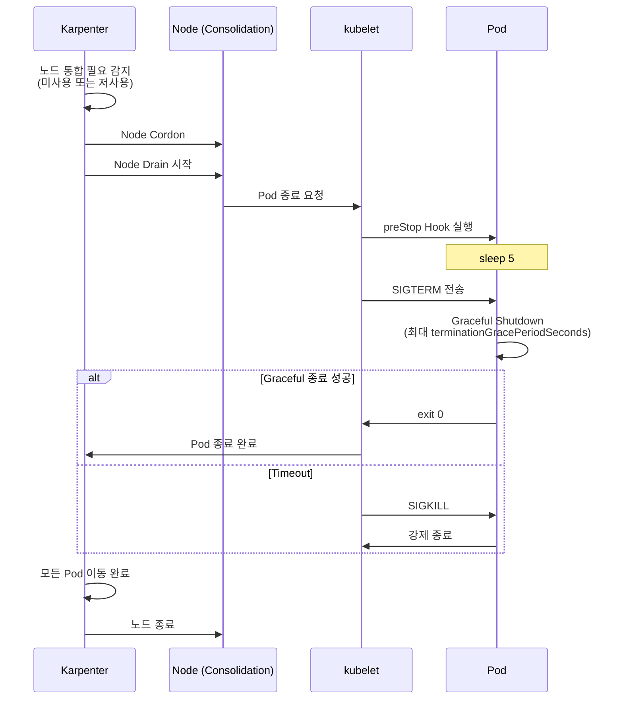

**Karpenter NodePool 설정:**

```yaml
apiVersion: karpenter.sh/v1
kind: NodePool
metadata:
  name: default
spec:
  disruption:
    consolidationPolicy: WhenEmptyOrUnderutilized
    consolidateAfter: 5m
    # Disruption budget: 동시 중단 노드 제한
    budgets:
    - nodes: "20%"
      schedule: "0 9-17 * * MON-FRI"  # 업무 시간 20%
    - nodes: "50%"
      schedule: "0 0-8,18-23 * * *"   # 비업무 시간 50%
```

:::warning PDB와 Karpenter 상호작용
PodDisruptionBudget이 너무 엄격하면 (예: `minAvailable`이 replica 수와 같음) Karpenter가 노드를 drain할 수 없습니다. PDB는 `minAvailable: replica - 1` 또는 `maxUnavailable: 1`로 설정하여 최소 1개 Pod은 이동 가능하도록 하세요.
:::

#### 3.4.3 ARC + Karpenter 통합 AZ 대피 패턴

**개요:**

AWS Application Recovery Controller(ARC)와 Karpenter의 통합(2025년 발표)은 Availability Zone(AZ) 장애 시 자동으로 워크로드를 다른 AZ로 이동시키는 고가용성 패턴을 제공합니다. 이를 통해 AZ 장애 또는 Gray Failure 상황에서도 Graceful Shutdown을 보장하며 서비스 중단을 최소화할 수 있습니다.

**ARC Zonal Shift란:**

Zonal Shift는 특정 AZ에서 발생한 장애나 성능 저하를 감지했을 때, 해당 AZ의 트래픽을 자동으로 다른 정상 AZ로 전환하는 기능입니다. EKS와 통합 시 Pod의 안전한 이동까지 자동화됩니다.

**아키텍처 구성 요소:**

| 컴포넌트 | 역할 | 동작 |
|----------|------|------|
| **ARC Zonal Autoshift** | AZ 장애 자동 감지 및 트래픽 전환 결정 | CloudWatch Alarms 기반 자동 Shift |
| **Karpenter** | 새 AZ에 노드 프로비저닝 | NodePool 설정에 따라 정상 AZ에 노드 생성 |
| **AWS Load Balancer** | 트래픽 라우팅 제어 | 장애 AZ의 Target 제거 |
| **PodDisruptionBudget** | Pod 이동 시 가용성 보장 | 최소 가용 Pod 수 유지 |

**AZ 대피 시퀀스:**

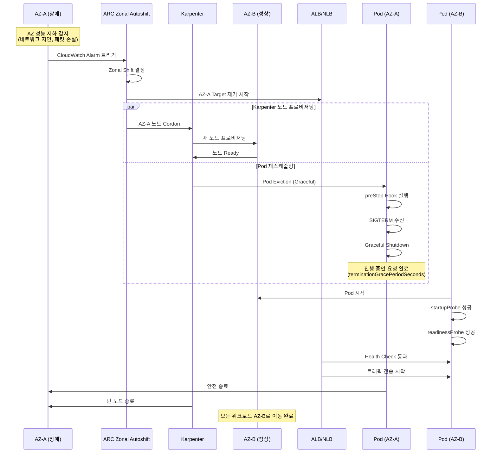

**설정 예시:**

**1. ARC Zonal Autoshift 활성화:**

```bash
# Load Balancer에 Zonal Autoshift 활성화
aws arc-zonal-shift create-autoshift-observer-notification-configuration \
  --resource-identifier arn:aws:elasticloadbalancing:ap-northeast-2:123456789012:loadbalancer/app/production-alb/1234567890abcdef

# Zonal Autoshift 설정
aws arc-zonal-shift update-zonal-autoshift-configuration \
  --resource-identifier arn:aws:elasticloadbalancing:ap-northeast-2:123456789012:loadbalancer/app/production-alb/1234567890abcdef \
  --zonal-autoshift-status ENABLED
```

**2. Karpenter NodePool - AZ 인식 설정:**

```yaml
apiVersion: karpenter.sh/v1
kind: NodePool
metadata:
  name: default
spec:
  disruption:
    consolidationPolicy: WhenEmptyOrUnderutilized
    consolidateAfter: 30s
    # AZ 장애 시 빠른 대응
    budgets:
    - nodes: "100%"
      reasons:
      - "Drifted"  # AZ Cordon 시 즉시 교체
  template:
    spec:
      requirements:
      - key: "topology.kubernetes.io/zone"
        operator: In
        values:
        - ap-northeast-2a
        - ap-northeast-2b
        - ap-northeast-2c
      - key: karpenter.sh/capacity-type
        operator: In
        values:
        - on-demand  # AZ 장애 대응은 On-Demand 권장
      nodeClassRef:
        name: default
---
apiVersion: karpenter.k8s.aws/v1
kind: EC2NodeClass
metadata:
  name: default
spec:
  amiFamily: AL2023
  role: "KarpenterNodeRole-production"
  subnetSelectorTerms:
  - tags:
      karpenter.sh/discovery: "production-eks"
  securityGroupSelectorTerms:
  - tags:
      karpenter.sh/discovery: "production-eks"
  # AZ 장애 시 자동 감지
  metadataOptions:
    httpTokens: required
    httpPutResponseHopLimit: 2
```

**3. Deployment with PDB - AZ 분산:**

```yaml
apiVersion: apps/v1
kind: Deployment
metadata:
  name: critical-api
spec:
  replicas: 6
  selector:
    matchLabels:
      app: critical-api
  template:
    metadata:
      labels:
        app: critical-api
    spec:
      # AZ 분산 보장
      topologySpreadConstraints:
      - maxSkew: 1
        topologyKey: topology.kubernetes.io/zone
        whenUnsatisfiable: DoNotSchedule
        labelSelector:
          matchLabels:
            app: critical-api
      # 동일 노드 배치 방지
      affinity:
        podAntiAffinity:
          preferredDuringSchedulingIgnoredDuringExecution:
          - weight: 100
            podAffinityTerm:
              labelSelector:
                matchLabels:
                  app: critical-api
              topologyKey: kubernetes.io/hostname
      containers:
      - name: api
        image: myapp/critical-api:v3
        ports:
        - containerPort: 8080
        resources:
          requests:
            cpu: 500m
            memory: 1Gi
        readinessProbe:
          httpGet:
            path: /ready
            port: 8080
          periodSeconds: 5
          failureThreshold: 2
        livenessProbe:
          httpGet:
            path: /healthz
            port: 8080
          periodSeconds: 10
        lifecycle:
          preStop:
            exec:
              command:
              - /bin/sh
              - -c
              - sleep 5
      terminationGracePeriodSeconds: 60
---
apiVersion: policy/v1
kind: PodDisruptionBudget
metadata:
  name: critical-api-pdb
spec:
  minAvailable: 4  # 6개 중 최소 4개 유지 (AZ 장애 시 2개 AZ에서 운영)
  selector:
    matchLabels:
      app: critical-api
```

**4. CloudWatch Alarm - AZ 성능 저하 감지:**

```yaml
apiVersion: v1
kind: ConfigMap
metadata:
  name: az-health-monitoring
  namespace: monitoring
data:
  cloudwatch-alarm: |
    {
      "AlarmName": "AZ-A-NetworkLatency-High",
      "MetricName": "NetworkLatency",
      "Namespace": "AWS/EC2",
      "Statistic": "Average",
      "Period": 60,
      "EvaluationPeriods": 3,
      "Threshold": 100,
      "ComparisonOperator": "GreaterThanThreshold",
      "Dimensions": [
        {"Name": "AvailabilityZone", "Value": "ap-northeast-2a"}
      ],
      "AlarmDescription": "AZ-A 네트워크 지연 증가 - Zonal Shift 트리거",
      "AlarmActions": [
        "arn:aws:arc-zonal-shift:ap-northeast-2:123456789012:autoshift-observer-notification"
      ]
    }
```

**Istio 서비스 메시 기반 End-to-End AZ 복구:**

Istio 서비스 메시와 통합하면 AZ 대피 시 더욱 정교한 트래픽 제어가 가능합니다:

```yaml
# Istio DestinationRule: AZ 기반 트래픽 라우팅
apiVersion: networking.istio.io/v1beta1
kind: DestinationRule
metadata:
  name: critical-api-az-routing
spec:
  host: critical-api.production.svc.cluster.local
  trafficPolicy:
    loadBalancer:
      localityLbSetting:
        enabled: true
        distribute:
        - from: ap-northeast-2a/*
          to:
            "ap-northeast-2b/*": 50
            "ap-northeast-2c/*": 50
        - from: ap-northeast-2b/*
          to:
            "ap-northeast-2a/*": 50
            "ap-northeast-2c/*": 50
        - from: ap-northeast-2c/*
          to:
            "ap-northeast-2a/*": 50
            "ap-northeast-2b/*": 50
    outlierDetection:
      consecutiveErrors: 3
      interval: 10s
      baseEjectionTime: 30s
      maxEjectionPercent: 50
---
# VirtualService: AZ 장애 시 자동 재라우팅
apiVersion: networking.istio.io/v1beta1
kind: VirtualService
metadata:
  name: critical-api-failover
spec:
  hosts:
  - critical-api.production.svc.cluster.local
  http:
  - match:
    - sourceLabels:
        topology.kubernetes.io/zone: ap-northeast-2a
    route:
    - destination:
        host: critical-api.production.svc.cluster.local
        subset: az-b
      weight: 50
    - destination:
        host: critical-api.production.svc.cluster.local
        subset: az-c
      weight: 50
    timeout: 3s
    retries:
      attempts: 3
      perTryTimeout: 1s
```

**Gray Failure 처리 전략:**

Gray Failure는 완전한 장애가 아닌 성능 저하 상태로, 감지가 어렵습니다. ARC + Karpenter + Istio 조합으로 대응:

| Gray Failure 증상 | 감지 방법 | 자동 대응 |
|------------------|----------|----------|
| 네트워크 지연 증가 (50-200ms) | Container Network Observability | Istio Outlier Detection → 트래픽 우회 |
| 간헐적 패킷 손실 (1-5%) | CloudWatch Network Metrics | ARC Zonal Shift 트리거 |
| 디스크 I/O 저하 | EBS CloudWatch Metrics | Karpenter 노드 교체 |
| API Server 응답 지연 | Control Plane Metrics | Provisioned Control Plane 자동 스케일링 |

**테스트 및 검증:**

```bash
# AZ 장애 시뮬레이션 (Chaos Engineering)
kubectl apply -f - <<EOF
apiVersion: v1
kind: ConfigMap
metadata:
  name: az-failure-test
  namespace: chaos
data:
  experiment: |
    # 1. AZ-A의 모든 노드에 Taint 추가 (AZ 장애 시뮬레이션)
    kubectl taint nodes -l topology.kubernetes.io/zone=ap-northeast-2a \
      az-failure=true:NoSchedule

    # 2. Karpenter가 AZ-B, AZ-C에 새 노드 생성 확인
    kubectl get nodes -l topology.kubernetes.io/zone=ap-northeast-2b,ap-northeast-2c

    # 3. Pod 이동 모니터링
    kubectl get pods -o wide --watch

    # 4. PDB 준수 확인 (minAvailable 유지)
    kubectl get pdb critical-api-pdb

    # 5. Graceful Shutdown 로그 확인
    kubectl logs <pod-name> --previous

    # 6. 복구 (Taint 제거)
    kubectl taint nodes -l topology.kubernetes.io/zone=ap-northeast-2a \
      az-failure-
EOF
```

**모니터링 대시보드:**

```yaml
# Grafana Dashboard: AZ 헬스 및 대피 상태
apiVersion: v1
kind: ConfigMap
metadata:
  name: az-failover-dashboard
  namespace: monitoring
data:
  dashboard.json: |
    {
      "panels": [
        {
          "title": "AZ별 Pod 분포",
          "targets": [
            {
              "expr": "count(kube_pod_info) by (node, zone)"
            }
          ]
        },
        {
          "title": "AZ별 네트워크 지연",
          "targets": [
            {
              "expr": "avg(container_network_latency_ms) by (availability_zone)"
            }
          ]
        },
        {
          "title": "Karpenter 노드 프로비저닝 속도",
          "targets": [
            {
              "expr": "rate(karpenter_nodes_created_total[5m])"
            }
          ]
        },
        {
          "title": "Graceful Shutdown 성공률",
          "targets": [
            {
              "expr": "rate(pod_termination_graceful_total[5m]) / rate(pod_termination_total[5m])"
            }
          ]
        }
      ]
    }
```

**관련 자료:**
- [AWS Blog: ARC + Karpenter 고가용성 통합](https://aws.amazon.com/blogs/containers/enhance-kubernetes-high-availability-with-amazon-application-recovery-controller-and-karpenter-integration/)
- [AWS Blog: Istio 기반 End-to-end AZ 복구](https://aws.amazon.com/blogs/containers/)
- [AWS re:Invent 2025: Supercharge your Karpenter](https://www.youtube.com/watch?v=kUQ4Q11F4iQ)

:::tip 운영 Best Practice
AZ 대피는 자동화되지만, 정기적인 Chaos Engineering 테스트로 검증하세요. 매 분기 1회 이상 AZ 장애 시뮬레이션을 수행하여 PDB, Karpenter, Graceful Shutdown이 예상대로 동작하는지 확인합니다. 특히 `terminationGracePeriodSeconds`가 실제 Shutdown 시간보다 충분히 긴지 프로덕션 환경에서 측정하세요.
:::

#### Spot 인스턴스 2분 경고 처리

AWS Spot 인스턴스는 종료 2분 전에 경고를 보냅니다. 이를 처리하여 Graceful Shutdown을 보장합니다.

**AWS Node Termination Handler 설치:**

```bash
helm repo add eks https://aws.github.io/eks-charts
helm repo update

helm install aws-node-termination-handler \
  --namespace kube-system \
  eks/aws-node-termination-handler \
  --set enableSpotInterruptionDraining=true \
  --set enableScheduledEventDraining=true
```

**동작 방식:**
1. Spot 종료 2분 경고 감지
2. 노드를 즉시 Cordon (새 Pod 스케줄링 차단)
3. 노드의 모든 Pod을 Drain
4. Pod의 `terminationGracePeriodSeconds` 내에 Graceful Shutdown 완료

**권장 terminationGracePeriodSeconds:**
- 일반 웹 서비스: 30-60초
- 장기 실행 작업 (배치, ML 추론): 90-120초
- 최대 2분 이내로 설정 (Spot 경고 시간 고려)

---

### 3.4.4 Node Readiness Controller — 노드 수준 Readiness 관리

#### 개요

Node Readiness Controller(NRC)는 2026년 2월 Kubernetes 공식 블로그에서 발표된 알파 기능(v0.1.1)으로, 노드 수준의 인프라 준비 상태를 선언적으로 관리하는 새로운 메커니즘입니다.

기존 Kubernetes의 노드 `Ready` 조건은 단순한 바이너리 상태(Ready/NotReady)만 제공하여, CNI 플러그인 초기화, GPU 드라이버 로딩, 스토리지 드라이버 준비 등 복잡한 인프라 의존성을 정확히 반영하지 못했습니다. NRC는 이러한 한계를 해결하기 위해 커스텀 readiness gate를 선언적으로 정의할 수 있는 `NodeReadinessRule` CRD를 제공합니다.

**핵심 가치:**
- **세밀한 노드 상태 제어**: 인프라 컴포넌트별 준비 상태를 독립적으로 관리
- **자동화된 Taint 관리**: 조건이 충족되지 않으면 자동으로 NoSchedule Taint 적용
- **유연한 모니터링 모드**: 부트스트랩 전용, 지속 모니터링, Dry-run 모드 지원
- **선택적 적용**: nodeSelector로 특정 노드 그룹에만 규칙 적용

**API 정보:**
- API Group: `readiness.node.x-k8s.io/v1alpha1`
- Kind: `NodeReadinessRule`
- 공식 문서: https://node-readiness-controller.sigs.k8s.io/

#### 핵심 기능

##### 1. Continuous 모드 - 지속 모니터링

노드 라이프사이클 전체에서 지정된 조건을 지속적으로 모니터링합니다. 인프라 컴포넌트가 런타임 중 실패할 경우 (예: GPU 드라이버 크래시) 즉시 Taint를 적용하여 새로운 Pod 스케줄링을 차단합니다.

**사용 사례:**
- GPU 드라이버 상태 모니터링
- 네트워크 플러그인 지속 헬스체크
- 스토리지 드라이버 가용성 확인

##### 2. Bootstrap-only 모드 - 초기화 전용

노드 초기화 단계에서만 조건을 확인하고, 조건이 충족되면 모니터링을 중단합니다. 부트스트랩 이후에는 조건 변경에 반응하지 않습니다.

**사용 사례:**
- CNI 플러그인 초기 부트스트랩
- 컨테이너 이미지 프리풀 완료 확인
- 초기 보안 스캔 완료 대기

##### 3. Dry-run 모드 - 안전한 검증

실제 Taint 적용 없이 규칙 동작을 시뮬레이션합니다. 프로덕션 배포 전 규칙 검증에 유용합니다.

**사용 사례:**
- 새로운 NodeReadinessRule 테스트
- 조건 변경 영향 분석
- 디버깅 및 문제 진단

##### 4. nodeSelector - 타겟 노드 선택

라벨 기반으로 특정 노드 그룹에만 규칙을 적용합니다. GPU 노드와 범용 노드에 서로 다른 readiness 규칙을 적용할 수 있습니다.

#### YAML 예시

##### CNI 부트스트랩 - Bootstrap-only 모드

```yaml
apiVersion: readiness.node.x-k8s.io/v1alpha1
kind: NodeReadinessRule
metadata:
  name: network-readiness-rule
  namespace: kube-system
spec:
  # 확인할 노드 조건
  conditions:
    - type: "cniplugin.example.net/NetworkReady"
      requiredStatus: "True"

  # 조건 미충족 시 적용할 Taint
  taint:
    key: "readiness.k8s.io/acme.com/network-unavailable"
    effect: "NoSchedule"
    value: "pending"

  # 부트스트랩 완료 후 모니터링 중단
  enforcementMode: "bootstrap-only"

  # 워커 노드에만 적용
  nodeSelector:
    matchLabels:
      node-role.kubernetes.io/worker: ""
```

**동작 흐름:**
1. 새 노드가 클러스터에 조인하면 NRC가 자동으로 Taint 적용
2. CNI 플러그인이 초기화 완료 후 `NetworkReady=True` 조건 설정
3. NRC가 조건 확인 후 Taint 제거
4. Pod 스케줄링 가능 (이후 CNI 상태 변경 무시)

##### GPU 노드 Continuous 모니터링

```yaml
apiVersion: readiness.node.x-k8s.io/v1alpha1
kind: NodeReadinessRule
metadata:
  name: gpu-driver-readiness
  namespace: kube-system
spec:
  conditions:
    - type: "nvidia.com/gpu-driver-ready"
      requiredStatus: "True"

  taint:
    key: "readiness.k8s.io/gpu-unavailable"
    effect: "NoSchedule"
    value: "driver-not-ready"

  # 런타임 중에도 지속 모니터링
  enforcementMode: "continuous"

  # GPU 노드에만 적용
  nodeSelector:
    matchLabels:
      nvidia.com/gpu.present: "true"
```

**동작 흐름:**
1. GPU 노드 시작 시 Taint 자동 적용
2. NVIDIA 드라이버 데몬이 GPU 초기화 완료 후 조건 설정
3. NRC가 Taint 제거, AI 워크로드 스케줄링 가능
4. **런타임 중 드라이버 크래시 발생 시:**
   - 조건이 `False`로 변경
   - NRC가 즉시 Taint 재적용
   - 기존 Pod는 유지, 신규 Pod 스케줄링 차단

##### EBS CSI 드라이버 준비 확인

```yaml
apiVersion: readiness.node.x-k8s.io/v1alpha1
kind: NodeReadinessRule
metadata:
  name: ebs-csi-readiness
  namespace: kube-system
spec:
  conditions:
    - type: "ebs.csi.aws.com/VolumeAttachReady"
      requiredStatus: "True"

  taint:
    key: "readiness.k8s.io/storage-unavailable"
    effect: "NoSchedule"
    value: "csi-not-ready"

  enforcementMode: "bootstrap-only"

  # 스토리지 워크로드 전용 노드에만 적용
  nodeSelector:
    matchLabels:
      workload-type: "stateful"
```

##### Dry-run 모드 - 테스트 규칙

```yaml
apiVersion: readiness.node.x-k8s.io/v1alpha1
kind: NodeReadinessRule
metadata:
  name: test-custom-condition
  namespace: kube-system
spec:
  conditions:
    - type: "example.com/CustomHealthCheck"
      requiredStatus: "True"

  taint:
    key: "readiness.k8s.io/test-condition"
    effect: "NoSchedule"
    value: "testing"

  # Taint 적용 없이 동작만 로깅
  enforcementMode: "dry-run"

  nodeSelector:
    matchLabels:
      environment: "staging"
```

#### EKS 적용 시나리오

##### 1. VPC CNI 초기화 대기

**문제:**
노드가 클러스터에 조인한 직후 VPC CNI 플러그인이 완전히 초기화되기 전에 Pod이 스케줄링되면 네트워크 연결 실패가 발생합니다.

**해결:**
```yaml
apiVersion: readiness.node.x-k8s.io/v1alpha1
kind: NodeReadinessRule
metadata:
  name: vpc-cni-readiness
  namespace: kube-system
spec:
  conditions:
    - type: "vpc.amazonaws.com/CNIReady"
      requiredStatus: "True"
  taint:
    key: "node.eks.amazonaws.com/network-unavailable"
    effect: "NoSchedule"
    value: "vpc-cni-initializing"
  enforcementMode: "bootstrap-only"
```

**VPC CNI 데몬셋에서 조건 설정:**
```yaml
# aws-node DaemonSet의 init container
initContainers:
- name: set-node-condition
  image: bitnami/kubectl:latest
  command:
  - /bin/sh
  - -c
  - |
    # CNI 초기화 대기
    until [ -f /host/etc/cni/net.d/10-aws.conflist ]; do
      echo "Waiting for CNI config..."
      sleep 2
    done

    # Node Condition 설정
    kubectl patch node $NODE_NAME --type=json -p='[
      {
        "op": "add",
        "path": "/status/conditions/-",
        "value": {
          "type": "vpc.amazonaws.com/CNIReady",
          "status": "True",
          "lastTransitionTime": "'$(date -u +"%Y-%m-%dT%H:%M:%SZ")'",
          "reason": "CNIInitialized",
          "message": "VPC CNI is ready"
        }
      }
    ]'
  env:
  - name: NODE_NAME
    valueFrom:
      fieldRef:
        fieldPath: spec.nodeName
```

##### 2. GPU 노드 NVIDIA 드라이버 준비

**문제:**
GPU 워크로드가 NVIDIA 드라이버 로딩 완료 전에 스케줄링되면 CUDA 초기화 실패로 Pod이 CrashLoopBackOff 상태에 빠집니다.

**해결:**
```yaml
apiVersion: readiness.node.x-k8s.io/v1alpha1
kind: NodeReadinessRule
metadata:
  name: nvidia-gpu-readiness
  namespace: kube-system
spec:
  conditions:
    - type: "nvidia.com/gpu-driver-ready"
      requiredStatus: "True"
    - type: "nvidia.com/gpu-device-plugin-ready"
      requiredStatus: "True"
  taint:
    key: "nvidia.com/gpu-not-ready"
    effect: "NoSchedule"
    value: "driver-loading"
  enforcementMode: "continuous"
  nodeSelector:
    matchLabels:
      node.kubernetes.io/instance-type: "g5.xlarge"
```

**NVIDIA Device Plugin에서 조건 설정:**
```go
// NVIDIA Device Plugin의 헬스체크 로직
func updateNodeCondition(nodeName string) error {
    // GPU 드라이버 상태 확인
    version, err := nvml.SystemGetDriverVersion()
    if err != nil {
        return setCondition(nodeName, "nvidia.com/gpu-driver-ready", "False")
    }

    // Device Plugin 상태 확인
    devices, err := nvml.DeviceGetCount()
    if err != nil || devices == 0 {
        return setCondition(nodeName, "nvidia.com/gpu-device-plugin-ready", "False")
    }

    // 모두 정상이면 True로 설정
    setCondition(nodeName, "nvidia.com/gpu-driver-ready", "True")
    setCondition(nodeName, "nvidia.com/gpu-device-plugin-ready", "True")
    return nil
}
```

##### 3. Node Problem Detector 통합

**문제:**
노드에서 하드웨어 오류, 커널 데드락, 네트워크 문제 등이 발생해도 Kubernetes가 자동으로 Pod 스케줄링을 차단하지 않습니다.

**해결:**
```yaml
apiVersion: readiness.node.x-k8s.io/v1alpha1
kind: NodeReadinessRule
metadata:
  name: node-problem-detector-readiness
  namespace: kube-system
spec:
  conditions:
    - type: "KernelDeadlock"
      requiredStatus: "False"  # False이어야 정상
    - type: "DiskPressure"
      requiredStatus: "False"
    - type: "NetworkUnavailable"
      requiredStatus: "False"
  taint:
    key: "node.kubernetes.io/problem-detected"
    effect: "NoSchedule"
    value: "true"
  enforcementMode: "continuous"
```

#### 워크플로우 다이어그램

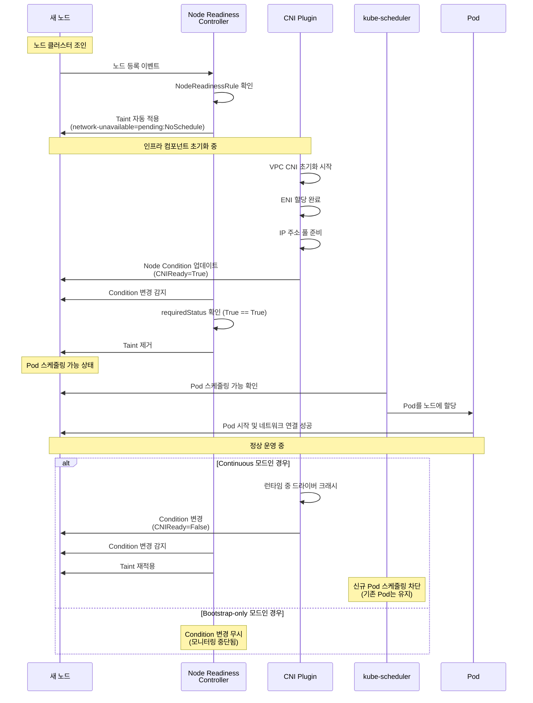

#### Pod Readiness와의 관계

Kubernetes의 Readiness 메커니즘은 이제 3계층 구조로 완성됩니다:

| 계층 | 메커니즘 | 범위 | 실패 시 동작 | 사용 사례 |
|------|---------|------|-------------|----------|
| **1. 컨테이너** | Readiness Probe | 컨테이너 내부 헬스체크 | Service Endpoint 제거 | 애플리케이션 준비 상태 확인 |
| **2. Pod** | Readiness Gate | Pod 수준 외부 조건 | Service Endpoint 제거 | ALB/NLB 헬스체크 통합 |
| **3. 노드** | Node Readiness Controller | 노드 인프라 조건 | Pod 스케줄링 차단 (Taint) | CNI, GPU, 스토리지 준비 확인 |

**통합 시나리오 - 완전한 트래픽 안전성:**

```yaml
apiVersion: apps/v1
kind: Deployment
metadata:
  name: critical-service
spec:
  replicas: 3
  template:
    spec:
      # 3계층 Readiness 적용
      containers:
      - name: app
        image: myapp:v2
        # 1계층: 컨테이너 Readiness Probe
        readinessProbe:
          httpGet:
            path: /ready
            port: 8080
          periodSeconds: 5
          failureThreshold: 2

      # 2계층: Pod Readiness Gate
      readinessGates:
      - conditionType: "target-health.alb.ingress.k8s.aws/production-alb"

      # 3계층: Node Readiness (NodeReadinessRule로 자동 처리)
      # - 노드의 CNI, GPU, 스토리지 준비 상태 확인
      # - Taint가 없는 노드에만 스케줄링됨
```

**트래픽 수신 체크리스트:**

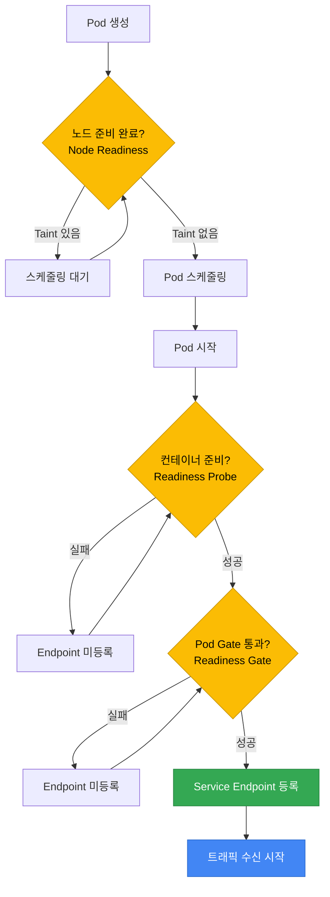

#### 설치 및 설정

##### 1. Node Readiness Controller 설치

```bash
# Helm으로 설치
helm repo add node-readiness-controller https://node-readiness-controller.sigs.k8s.io
helm repo update

helm install node-readiness-controller \
  node-readiness-controller/node-readiness-controller \
  --namespace kube-system \
  --create-namespace

# 또는 Kustomize로 설치
kubectl apply -k https://github.com/kubernetes-sigs/node-readiness-controller/config/default
```

##### 2. 설치 확인

```bash
# Controller Pod 상태 확인
kubectl get pods -n kube-system -l app=node-readiness-controller

# CRD 확인
kubectl get crd nodereadinessrules.readiness.node.x-k8s.io

# 샘플 규칙 적용
kubectl apply -f https://raw.githubusercontent.com/kubernetes-sigs/node-readiness-controller/main/examples/basic-rule.yaml

# 규칙 목록 확인
kubectl get nodereadinessrules -A
```

##### 3. 노드 상태 확인

```bash
# 특정 노드의 Condition 확인
kubectl get node <node-name> -o jsonpath='{.status.conditions}' | jq

# 특정 Condition만 필터링
kubectl get node <node-name> -o jsonpath='{.status.conditions[?(@.type=="CNIReady")]}' | jq

# 모든 노드의 Taint 확인
kubectl get nodes -o custom-columns=NAME:.metadata.name,TAINTS:.spec.taints
```

#### 디버깅 및 트러블슈팅

##### Taint가 제거되지 않는 경우

```bash
# 1. NodeReadinessRule 이벤트 확인
kubectl describe nodereadinessrule <rule-name> -n kube-system

# 2. 노드 Condition 상태 확인
kubectl get node <node-name> -o yaml | grep -A 10 conditions

# 3. Controller 로그 확인
kubectl logs -n kube-system -l app=node-readiness-controller --tail=100

# 4. 수동으로 Condition 설정 (테스트용)
kubectl patch node <node-name> --type=json -p='[
  {
    "op": "add",
    "path": "/status/conditions/-",
    "value": {
      "type": "CNIReady",
      "status": "True",
      "lastTransitionTime": "'$(date -u +"%Y-%m-%dT%H:%M:%SZ")'",
      "reason": "ManualSet",
      "message": "Manually set for testing"
    }
  }
]'
```

##### Dry-run 모드로 규칙 테스트

```bash
# 기존 규칙을 dry-run으로 변경
kubectl patch nodereadinessrule <rule-name> -n kube-system \
  --type=merge \
  -p '{"spec":{"enforcementMode":"dry-run"}}'

# Controller 로그에서 동작 확인
kubectl logs -n kube-system -l app=node-readiness-controller -f | grep "dry-run"

# 테스트 완료 후 원래 모드로 복구
kubectl patch nodereadinessrule <rule-name> -n kube-system \
  --type=merge \
  -p '{"spec":{"enforcementMode":"continuous"}}'
```

:::info 알파 기능 주의사항
Node Readiness Controller는 현재 v0.1.1 알파 버전입니다. 프로덕션 환경에 적용하기 전에:
- 스테이징 환경에서 충분한 테스트 수행
- Dry-run 모드로 규칙 동작 검증
- Controller 로그 모니터링 설정
- 문제 발생 시 수동으로 Taint 제거할 수 있는 절차 준비
:::

:::tip 운영 Best Practice
1. **Bootstrap-only 우선 사용**: 대부분의 경우 부트스트랩 전용 모드로 충분합니다. Continuous 모드는 런타임 중 장애가 빈번한 컴포넌트(GPU 드라이버 등)에만 사용하세요.
2. **nodeSelector 적극 활용**: 모든 노드에 동일한 규칙을 적용하지 말고, 워크로드 유형별로 세분화하세요.
3. **Node Problem Detector 통합**: NRC와 NPD를 함께 사용하면 하드웨어/OS 수준 문제까지 자동 대응할 수 있습니다.
4. **모니터링 및 알림**: Taint 적용/제거 이벤트를 CloudWatch나 Prometheus로 수집하고, 장시간 Taint가 유지되면 알림을 받도록 설정하세요.
:::

:::warning PDB와의 충돌 주의
Node Readiness Controller가 Taint를 적용하면 해당 노드의 Pod이 새로 생성되지 않습니다. 만약 여러 노드에서 동시에 Taint가 적용되고 PodDisruptionBudget이 엄격하게 설정되어 있으면, 클러스터 전체의 워크로드 배치가 블로킹될 수 있습니다. 규칙 설계 시 PDB 정책을 함께 검토하세요.
:::

#### 참조 자료

- **공식 문서**: [Node Readiness Controller](https://node-readiness-controller.sigs.k8s.io/)
- **Kubernetes Blog**: [Introducing Node Readiness Controller](https://kubernetes.io/blog/2026/02/03/introducing-node-readiness-controller/)
- **GitHub Repository**: [kubernetes-sigs/node-readiness-controller](https://github.com/kubernetes-sigs/node-readiness-controller)

---

### 3.5 Fargate Pod 라이프사이클 특수 고려사항

AWS Fargate는 서버리스 컴퓨팅 엔진으로, 노드 관리 없이 Pod을 실행합니다. Fargate Pod은 EC2 기반 Pod과 다른 라이프사이클 특성을 가집니다.

#### Fargate vs EC2 vs Auto Mode 아키텍처 비교

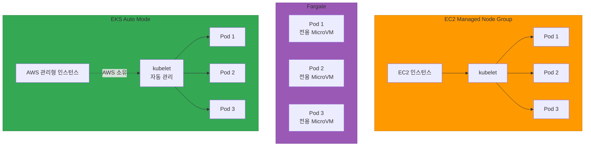

#### Fargate Pod OS 패치 자동 Eviction

Fargate는 보안 패치를 위해 주기적으로 Pod을 자동 evict합니다.

**동작 방식:**

1. **패치 가용성 감지**: AWS가 새로운 OS/런타임 패치 감지
2. **Graceful Eviction**: Fargate가 Pod에 SIGTERM 전송 → `terminationGracePeriodSeconds` 내에 종료 대기
3. **강제 종료**: Timeout 시 SIGKILL 전송
4. **재스케줄링**: Kubernetes가 새로운 Fargate Pod에 재스케줄링 (업데이트된 런타임 사용)

**주요 특징:**

- **예측 불가능한 타이밍**: 사용자가 제어할 수 없음 (AWS 관리)
- **사전 알림 없음**: EC2 Scheduled Events와 달리 사전 경고 없음
- **자동 재시작**: PodDisruptionBudget(PDB) 존중하지만, 보안 패치는 우선순위 높음

**대응 전략:**

```yaml
apiVersion: apps/v1
kind: Deployment
metadata:
  name: fargate-app
  namespace: fargate-namespace
spec:
  replicas: 3  # 최소 3개 이상 권장 (자동 eviction 대비)
  selector:
    matchLabels:
      app: fargate-app
  template:
    metadata:
      labels:
        app: fargate-app
    spec:
      containers:
      - name: app
        image: myapp:v1
        resources:
          requests:
            cpu: 500m
            memory: 1Gi
        startupProbe:
          httpGet:
            path: /healthz
            port: 8080
          failureThreshold: 10
          periodSeconds: 5
        readinessProbe:
          httpGet:
            path: /ready
            port: 8080
          periodSeconds: 5
        livenessProbe:
          httpGet:
            path: /healthz
            port: 8080
          periodSeconds: 10
        lifecycle:
          preStop:
            exec:
              command:
              - /bin/sh
              - -c
              - sleep 10  # Fargate eviction 대비 더 긴 대기
      # Fargate는 시작 시간이 길 수 있음
      terminationGracePeriodSeconds: 60
---
# PDB로 동시 eviction 제한 (최선 노력, 보안 패치 시 무시될 수 있음)
apiVersion: policy/v1
kind: PodDisruptionBudget
metadata:
  name: fargate-app-pdb
  namespace: fargate-namespace
spec:
  minAvailable: 2
  selector:
    matchLabels:
      app: fargate-app
```

:::warning Fargate PDB 제한
Fargate는 PDB를 **최선 노력(best effort)** 으로만 존중합니다. 중요한 보안 패치의 경우 PDB를 무시하고 강제 eviction할 수 있습니다. 따라서 Fargate 환경에서는 **최소 3개 이상의 replica**로 고가용성을 보장해야 합니다.
:::

#### Fargate Pod 시작 시간 특성

Fargate Pod은 EC2 기반 Pod보다 시작 시간이 깁니다.

| 단계 | EC2 (Managed Node) | Fargate | 이유 |
|------|-------------------|---------|------|
| **노드 프로비저닝** | 0초 (이미 실행 중) | 20-40초 | MicroVM 생성 + ENI 연결 |
| **이미지 풀** | 5-30초 | 10-60초 | 레이어 캐시 없음 (첫 실행 시) |
| **컨테이너 시작** | 1-5초 | 1-5초 | 동일 |
| **총 시작 시간** | 6-35초 | 31-105초 | Fargate 오버헤드 추가 |

**Startup Probe 조정 예시:**

```yaml
# EC2 Pod
startupProbe:
  httpGet:
    path: /healthz
    port: 8080
  failureThreshold: 6   # 6 × 5초 = 30초
  periodSeconds: 5

# Fargate Pod (더 긴 시간 허용)
startupProbe:
  httpGet:
    path: /healthz
    port: 8080
  failureThreshold: 20  # 20 × 5초 = 100초
  periodSeconds: 5
```

**이미지 풀 최적화 (Fargate):**

```yaml
apiVersion: v1
kind: Pod
metadata:
  name: fargate-pod
  namespace: fargate-namespace
spec:
  containers:
  - name: app
    image: 123456789012.dkr.ecr.us-east-1.amazonaws.com/myapp:v1
    imagePullPolicy: IfNotPresent  # Always 대신 IfNotPresent 권장
  imagePullSecrets:
  - name: ecr-secret
```

:::tip Fargate 이미지 캐싱
Fargate는 동일 이미지를 반복 사용 시 레이어 캐싱을 수행하지만, **Pod이 evict되면 캐시가 사라집니다**. ECR Image Scanning과 Image Replication을 활용하여 이미지 풀 시간을 단축하세요.
:::

#### Fargate DaemonSet 미지원으로 인한 사이드카 패턴

Fargate는 DaemonSet을 지원하지 않으므로, 노드 레벨 에이전트가 필요한 경우 사이드카 패턴을 사용해야 합니다.

**EC2 vs Fargate 모니터링 패턴 비교:**

| 기능 | EC2 (DaemonSet) | Fargate (Sidecar) |
|------|----------------|-------------------|
| **로그 수집** | Fluent Bit DaemonSet | Fluent Bit Sidecar + FireLens |
| **메트릭 수집** | CloudWatch Agent DaemonSet | CloudWatch Agent Sidecar |
| **보안 스캔** | Falco DaemonSet | Fargate는 AWS 관리 (사용자 제어 불가) |
| **네트워크 정책** | Calico/Cilium DaemonSet | NetworkPolicy 미지원 (Security Groups for Pods 사용) |

**Fargate 로깅 패턴 (FireLens):**

```yaml
apiVersion: apps/v1
kind: Deployment
metadata:
  name: fargate-logging-app
  namespace: fargate-namespace
spec:
  replicas: 2
  selector:
    matchLabels:
      app: logging-app
  template:
    metadata:
      labels:
        app: logging-app
    spec:
      containers:
      # 메인 애플리케이션
      - name: app
        image: myapp:v1
        ports:
        - containerPort: 8080
        resources:
          requests:
            cpu: 500m
            memory: 512Mi
      # FireLens 로그 라우터 (사이드카)
      - name: log-router
        image: public.ecr.aws/aws-observability/aws-for-fluent-bit:stable
        resources:
          requests:
            cpu: 100m
            memory: 128Mi
          limits:
            cpu: 200m
            memory: 256Mi
        env:
        - name: FLB_LOG_LEVEL
          value: "info"
        firelensConfiguration:
          type: fluentbit
          options:
            enable-ecs-log-metadata: "true"
```

:::info CloudWatch Container Insights on Fargate
Fargate는 CloudWatch Container Insights를 **네이티브 지원**하며, 별도 사이드카 없이 메트릭을 자동 수집합니다. Fargate 프로파일 생성 시 자동으로 활성화됩니다.

```bash
aws eks create-fargate-profile \
  --cluster-name my-cluster \
  --fargate-profile-name my-profile \
  --pod-execution-role-arn arn:aws:iam::123456789012:role/FargatePodExecutionRole \
  --selectors namespace=fargate-namespace \
  --tags 'EnableContainerInsights=enabled'
```
:::

#### Fargate Graceful Shutdown 타이밍 권장사항

Fargate는 자동 eviction 및 긴 시작 시간으로 인해 EC2와 다른 Graceful Shutdown 전략이 필요합니다.

| 시나리오 | terminationGracePeriodSeconds | preStop sleep | 이유 |
|---------|------------------------------|---------------|------|
| **EC2 Pod** | 30-60초 | 5초 | Endpoints 제거 대기 |
| **Fargate Pod (일반)** | 60-90초 | 10-15초 | 더 긴 네트워크 전파 시간 |
| **Fargate + ALB** | 90-120초 | 15-20초 | ALB deregistration delay 고려 |
| **Fargate 장기 작업** | 120-300초 | 10초 | 배치 작업 완료 시간 확보 |

**Fargate 최적화 예시:**

```yaml
apiVersion: apps/v1
kind: Deployment
metadata:
  name: fargate-web-app
  namespace: fargate-namespace
spec:
  replicas: 3
  selector:
    matchLabels:
      app: web-app
  template:
    metadata:
      labels:
        app: web-app
    spec:
      containers:
      - name: app
        image: myapp:v1
        ports:
        - containerPort: 8080
        readinessProbe:
          httpGet:
            path: /ready
            port: 8080
          periodSeconds: 5
          failureThreshold: 3
          successThreshold: 1
        lifecycle:
          preStop:
            exec:
              command:
              - /bin/sh
              - -c
              - |
                # Fargate는 네트워크 전파가 느릴 수 있음
                echo "PreStop: Waiting for network propagation..."
                sleep 15

                # Readiness 실패 신호 (선택 사항)
                # curl -X POST http://localhost:8080/shutdown

                echo "PreStop: Graceful shutdown initiated"
      terminationGracePeriodSeconds: 90  # EC2는 60초, Fargate는 90초
```

#### Fargate vs EC2 vs Auto Mode 비교표: Probe 관점

| 항목 | EC2 Managed Node Group | Fargate | EKS Auto Mode |
|------|------------------------|---------|---------------|
| **노드 관리** | 사용자 관리 | AWS 관리 | AWS 관리 |
| **Pod 밀도** | 높음 (여러 Pod/노드) | 낮음 (1 Pod = 1 MicroVM) | 중간 (AWS 최적화) |
| **시작 시간** | 빠름 (5-35초) | 느림 (30-105초) | 빠름 (10-40초) |
| **Startup Probe failureThreshold** | 6-10 | 15-20 | 8-12 |
| **terminationGracePeriodSeconds** | 30-60초 | 60-120초 | 30-60초 |
| **preStop sleep** | 5초 | 10-15초 | 5-10초 |
| **자동 OS 패치** | 수동 (AMI 업데이트) | 자동 (예측 불가 eviction) | 자동 (계획된 eviction) |
| **PDB 지원** | 완전 지원 | 제한적 (최선 노력) | 완전 지원 |
| **DaemonSet 지원** | 완전 지원 | 미지원 (사이드카 필요) | 제한적 (AWS 관리) |
| **비용 모델** | 인스턴스당 (항상 실행) | Pod당 (실행 시간만) | Pod당 (최적화됨) |
| **Spot 지원** | 완전 지원 (Termination Handler) | Fargate Spot 제한적 | 자동 최적화 |
| **네트워크 정책** | Calico/Cilium 지원 | Security Groups for Pods만 | AWS 관리 네트워크 정책 |

**선택 가이드:**

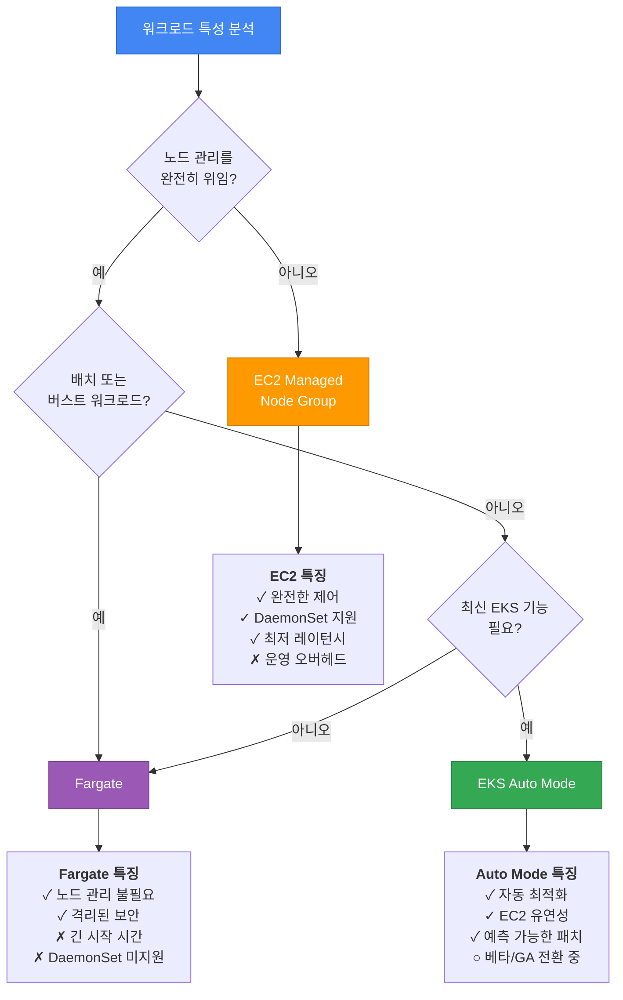

:::tip Fargate 프로덕션 체크리스트
- [ ] **Replica 수**: 최소 3개 이상 (자동 eviction 대비)
- [ ] **Startup Probe**: failureThreshold 15-20 설정 (긴 시작 시간 고려)
- [ ] **terminationGracePeriodSeconds**: 60-120초 설정
- [ ] **preStop sleep**: 10-15초 설정 (네트워크 전파 대기)
- [ ] **PDB**: minAvailable 설정 (최선 노력이지만 권장)
- [ ] **이미지 최적화**: ECR 사용, 레이어 최소화
- [ ] **로깅**: FireLens 사이드카 또는 CloudWatch Logs 통합
- [ ] **모니터링**: CloudWatch Container Insights 활성화
- [ ] **비용 최적화**: Fargate Spot 검토 (장애 허용 워크로드)
:::

:::info 참고 자료
- [AWS Fargate on EKS 공식 문서](https://docs.aws.amazon.com/eks/latest/userguide/fargate.html)
- [Fargate Pod 패칭 및 보안 업데이트](https://docs.aws.amazon.com/eks/latest/userguide/fargate-pod-patching.html)
- [EKS Auto Mode 개요](https://aws.amazon.com/blogs/aws/streamline-kubernetes-cluster-management-with-new-amazon-eks-auto-mode/)
- [Fargate와 EC2 비교 가이드](https://aws.amazon.com/blogs/containers/)
:::

---

## 4. Init Container 모범 사례

Init Container는 메인 컨테이너가 시작되기 전에 실행되어 초기화 작업을 수행합니다.

### 4.1 Init Container 동작 원리

- Init Container는 **순차적으로 실행**됩니다 (동시 실행 불가)
- 각 Init Container는 성공적으로 종료해야 다음 Init Container가 시작됩니다
- 모든 Init Container가 완료되어야 메인 컨테이너가 시작됩니다
- Init Container 실패 시 Pod의 `restartPolicy`에 따라 재시작됩니다

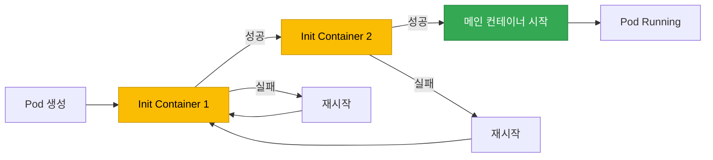

### 4.2 Init Container 사용 사례

#### 사례 1: 데이터베이스 마이그레이션

```yaml
apiVersion: apps/v1
kind: Deployment
metadata:
  name: web-app
spec:
  replicas: 3
  template:
    spec:
      # Init Container: DB 마이그레이션
      initContainers:
      - name: db-migration
        image: myapp/migrator:v1
        command:
        - /bin/sh
        - -c
        - |
          echo "Running database migrations..."
          /app/migrate up
          echo "Migrations completed"
        env:
        - name: DATABASE_URL
          valueFrom:
            secretKeyRef:
              name: db-secret
              key: url
      # 메인 애플리케이션
      containers:
      - name: app
        image: myapp/web-app:v1
        ports:
        - containerPort: 8080
```

#### 사례 2: 설정 파일 생성 (ConfigMap 변환)

```yaml
apiVersion: v1
kind: ConfigMap
metadata:
  name: app-config-template
data:
  config.template: |
    server:
      port: {{ PORT }}
      host: {{ HOST }}
    database:
      url: {{ DB_URL }}
---
apiVersion: apps/v1
kind: Deployment
metadata:
  name: app-with-config
spec:
  template:
    spec:
      initContainers:
      - name: config-generator
        image: busybox
        command:
        - /bin/sh
        - -c
        - |
          # 템플릿에서 실제 설정 파일 생성
          sed -e "s/{{ PORT }}/$PORT/g" \
              -e "s/{{ HOST }}/$HOST/g" \
              -e "s|{{ DB_URL }}|$DB_URL|g" \
              /config-template/config.template > /config/config.yaml
          echo "Config file generated"
          cat /config/config.yaml
        env:
        - name: PORT
          value: "8080"
        - name: HOST
          value: "0.0.0.0"
        - name: DB_URL
          valueFrom:
            secretKeyRef:
              name: db-secret
              key: url
        volumeMounts:
        - name: config-template
          mountPath: /config-template
        - name: config
          mountPath: /config
      containers:
      - name: app
        image: myapp/app:v1
        volumeMounts:
        - name: config
          mountPath: /app/config
      volumes:
      - name: config-template
        configMap:
          name: app-config-template
      - name: config
        emptyDir: {}
```

#### 사례 3: 종속 서비스 대기

```yaml
apiVersion: apps/v1
kind: Deployment
metadata:
  name: backend-api
spec:
  template:
    spec:
      initContainers:
      # Init Container 1: DB 연결 대기
      - name: wait-for-db
        image: busybox
        command:
        - /bin/sh
        - -c
        - |
          echo "Waiting for database..."
          until nc -z postgres-service 5432; do
            echo "Database not ready, sleeping..."
            sleep 2
          done
          echo "Database is ready"
      # Init Container 2: Redis 연결 대기
      - name: wait-for-redis
        image: busybox
        command:
        - /bin/sh
        - -c
        - |
          echo "Waiting for Redis..."
          until nc -z redis-service 6379; do
            echo "Redis not ready, sleeping..."
            sleep 2
          done
          echo "Redis is ready"
      containers:
      - name: api
        image: myapp/backend-api:v1
        ports:
        - containerPort: 8080
```

:::tip 더 나은 대안: readinessProbe
종속 서비스 대기는 Init Container보다 메인 컨테이너의 Readiness Probe에서 처리하는 것이 더 유연합니다. Init Container는 한 번만 실행되므로, 메인 컨테이너 실행 중 종속 서비스가 다운되면 대응할 수 없습니다.
:::

#### 사례 4: 볼륨 권한 설정

```yaml
apiVersion: apps/v1
kind: Deployment
metadata:
  name: app-with-volume
spec:
  template:
    spec:
      securityContext:
        fsGroup: 1000
      initContainers:
      - name: volume-permissions
        image: busybox
        command:
        - /bin/sh
        - -c
        - |
          echo "Setting up volume permissions..."
          chown -R 1000:1000 /data
          chmod -R 755 /data
          echo "Permissions set"
        volumeMounts:
        - name: data
          mountPath: /data
        securityContext:
          runAsUser: 0  # root로 실행 (권한 변경 위해)
      containers:
      - name: app
        image: myapp/app:v1
        securityContext:
          runAsUser: 1000
          runAsNonRoot: true
        volumeMounts:
        - name: data
          mountPath: /app/data
      volumes:
      - name: data
        persistentVolumeClaim:
          claimName: app-data-pvc
```

### 4.3 Init Container vs Sidecar Container (Kubernetes 1.29+)

Kubernetes 1.29+에서는 Native Sidecar Container가 도입되었습니다.

| 특성 | Init Container | Sidecar Container (1.29+) |
|------|---------------|---------------------------|
| **실행 타이밍** | 메인 컨테이너 전 순차 실행 | 메인 컨테이너와 동시 실행 |
| **라이프사이클** | 완료 후 종료 | 메인 컨테이너와 함께 실행 |
| **재시작** | 실패 시 Pod 전체 재시작 | 개별 재시작 가능 |
| **사용 사례** | 일회성 초기화 작업 | 지속적인 보조 작업 (로그 수집, 프록시) |

**Sidecar Container 예시 (K8s 1.29+):**

```yaml
apiVersion: v1
kind: Pod
metadata:
  name: app-with-sidecar
spec:
  initContainers:
  # Native sidecar: restartPolicy를 Always로 설정
  - name: log-collector
    image: fluent/fluent-bit:2.0
    restartPolicy: Always  # Sidecar로 동작
    volumeMounts:
    - name: logs
      mountPath: /var/log/app
  containers:
  - name: app
    image: myapp/app:v1
    volumeMounts:
    - name: logs
      mountPath: /app/logs
  volumes:
  - name: logs
    emptyDir: {}
```

---

## 5. Pod Lifecycle Hooks

Lifecycle Hooks는 컨테이너의 특정 시점에 커스텀 로직을 실행합니다.

### 5.1 PostStart Hook

PostStart Hook은 컨테이너가 생성된 직후 실행됩니다.

**특징:**
- 컨테이너의 ENTRYPOINT와 **비동기적으로** 실행됩니다
- Hook이 실패하면 컨테이너가 종료됩니다
- Hook 완료를 기다리지 않고 컨테이너는 `Running` 상태가 됩니다

```yaml
apiVersion: v1
kind: Pod
metadata:
  name: poststart-example
spec:
  containers:
  - name: app
    image: nginx
    lifecycle:
      postStart:
        exec:
          command:
          - /bin/sh
          - -c
          - |
            echo "Container started at $(date)" >> /var/log/lifecycle.log
            # 초기 설정 작업
            mkdir -p /app/cache
            chown -R nginx:nginx /app/cache
```

**사용 사례:**
- 애플리케이션 시작 알림 전송
- 초기 캐시 warming
- 메타데이터 기록

:::warning PostStart Hook 주의사항
PostStart Hook은 컨테이너 시작과 **비동기**로 실행되므로, Hook이 완료되기 전에 애플리케이션이 시작될 수 있습니다. 애플리케이션이 Hook의 작업에 의존한다면 Init Container를 사용하세요.
:::

### 5.2 PreStop Hook

PreStop Hook은 컨테이너 종료 요청 시, SIGTERM 전에 실행됩니다.

**특징:**
- **동기적으로** 실행됩니다 (완료될 때까지 SIGTERM 전송 지연)
- Hook 실행 시간은 `terminationGracePeriodSeconds`에 포함됩니다
- Hook 실패 여부와 무관하게 SIGTERM이 전송됩니다

```yaml
apiVersion: v1
kind: Pod
metadata:
  name: prestop-example
spec:
  containers:
  - name: app
    image: myapp/app:v1
    lifecycle:
      preStop:
        exec:
          command:
          - /bin/sh
          - -c
          - |
            # 1. Endpoint 제거 대기
            sleep 5

            # 2. 애플리케이션 상태 저장
            curl -X POST http://localhost:8080/admin/save-state

            # 3. 로그 플러시
            kill -USR1 1  # 애플리케이션에 USR1 시그널 전송

            # 4. SIGTERM 전송 (PID 1)
            kill -TERM 1
  terminationGracePeriodSeconds: 60
```

**사용 사례:**
- Endpoint 제거 대기 (무중단 배포)
- 진행 중인 작업 상태 저장
- 외부 시스템에 종료 알림
- 로그 버퍼 플러시

### 5.3 Hook 실행 메커니즘

Kubernetes는 두 가지 방식으로 Hook을 실행합니다.

| 메커니즘 | 설명 | 장점 | 단점 |
|----------|------|------|------|
| **exec** | 컨테이너 내부에서 명령 실행 | 컨테이너 파일시스템 접근 가능 | 오버헤드 높음 |
| **httpGet** | HTTP GET 요청 전송 | 네트워크 기반, 가벼움 | 애플리케이션이 HTTP 지원 필요 |

#### exec Hook 예시

```yaml
lifecycle:
  preStop:
    exec:
      command:
      - /bin/bash
      - -c
      - |
        echo "Shutting down" | tee /var/log/shutdown.log
        /app/cleanup.sh
```

#### httpGet Hook 예시

```yaml
lifecycle:
  preStop:
    httpGet:
      path: /shutdown
      port: 8080
      scheme: HTTP
      httpHeaders:
      - name: X-Shutdown-Token
        value: "secret-token"
```

:::warning Hook 실행은 "At Least Once"
Kubernetes는 Hook이 최소 한 번 실행되도록 보장하지만, 여러 번 실행될 수 있습니다. Hook 로직은 **멱등성(idempotent)**을 보장해야 합니다.
:::

---

## 6. 컨테이너 이미지 최적화와 시작 시간

컨테이너 이미지 크기와 구조는 Pod 시작 시간에 직접적인 영향을 미칩니다.

### 6.1 멀티스테이지 빌드

멀티스테이지 빌드를 사용하여 최종 이미지 크기를 최소화합니다.

#### Go 애플리케이션

```dockerfile
# 빌드 스테이지
FROM golang:1.22-alpine AS builder

WORKDIR /app
COPY go.mod go.sum ./
RUN go mod download

COPY . .
RUN CGO_ENABLED=0 GOOS=linux go build -a -installsuffix cgo -ldflags="-s -w" -o main .

# 실행 스테이지 (scratch: 5MB 이하)
FROM scratch

COPY --from=builder /app/main /main
COPY --from=builder /etc/ssl/certs/ca-certificates.crt /etc/ssl/certs/

USER 65534:65534
ENTRYPOINT ["/main"]
```

**결과:**
- 빌드 이미지: 300MB+
- 최종 이미지: 5-10MB
- 시작 시간: 1초 미만

#### Node.js 애플리케이션

```dockerfile
# 빌드 스테이지
FROM node:20-alpine AS builder

WORKDIR /app
COPY package*.json ./
RUN npm ci --only=production

COPY . .

# 실행 스테이지
FROM node:20-alpine

# 보안: non-root 사용자
RUN addgroup -g 1001 -S nodejs && \
    adduser -S nodejs -u 1001

WORKDIR /app

# 프로덕션 의존성만 복사
COPY --from=builder --chown=nodejs:nodejs /app/node_modules ./node_modules
COPY --chown=nodejs:nodejs . .

USER nodejs

EXPOSE 8080
CMD ["node", "server.js"]
```

**최적화 팁:**
- `npm ci` 사용 (npm install보다 빠르고 안정적)
- `--only=production`으로 devDependencies 제외
- 레이어 캐싱 활용 (COPY package*.json 먼저)

#### Java/Spring Boot 애플리케이션

```dockerfile
# 빌드 스테이지
FROM maven:3.9-eclipse-temurin-21 AS builder

WORKDIR /app
COPY pom.xml .
RUN mvn dependency:go-offline

COPY src ./src
RUN mvn clean package -DskipTests

# 실행 스테이지
FROM eclipse-temurin:21-jre-alpine

RUN addgroup -S spring && adduser -S spring -G spring
USER spring:spring

WORKDIR /app
COPY --from=builder /app/target/*.jar app.jar

EXPOSE 8080
ENTRYPOINT ["java", "-Xms512m", "-Xmx1g", "-jar", "app.jar"]
```

### 6.2 이미지 프리풀 전략

EKS에서 이미지 프리풀(pre-pull)을 활용하여 Pod 시작 시간을 단축합니다.

#### Karpenter 이미지 프리풀

```yaml
apiVersion: karpenter.k8s.aws/v1beta1
kind: EC2NodeClass
metadata:
  name: default
spec:
  amiFamily: AL2
  userData: |
    #!/bin/bash
    # 자주 사용하는 이미지 프리풀
    docker pull myapp/backend:v2.1.0
    docker pull myapp/frontend:v1.5.3
    docker pull redis:7-alpine
    docker pull postgres:16-alpine
```

#### DaemonSet으로 이미지 프리풀

```yaml
apiVersion: apps/v1
kind: DaemonSet
metadata:
  name: image-prepuller
  namespace: kube-system
spec:
  selector:
    matchLabels:
      app: image-prepuller
  template:
    metadata:
      labels:
        app: image-prepuller
    spec:
      initContainers:
      # 프리풀할 이미지마다 init container 추가
      - name: prepull-backend
        image: myapp/backend:v2.1.0
        command: ["sh", "-c", "echo 'Image pulled'"]
      - name: prepull-frontend
        image: myapp/frontend:v1.5.3
        command: ["sh", "-c", "echo 'Image pulled'"]
      containers:
      - name: pause
        image: registry.k8s.io/pause:3.9
        resources:
          requests:
            cpu: 1m
            memory: 1Mi
```

### 6.3 distroless와 scratch 이미지

Google의 distroless 이미지는 애플리케이션 실행에 필요한 최소한의 파일만 포함합니다.

#### distroless 예시

```dockerfile
FROM golang:1.22-alpine AS builder
WORKDIR /app
COPY . .
RUN CGO_ENABLED=0 go build -o main .

# distroless base
FROM gcr.io/distroless/static-debian12

COPY --from=builder /app/main /main
USER 65534:65534
ENTRYPOINT ["/main"]
```

**distroless 장점:**
- 최소 공격 표면 (쉘, 패키지 매니저 없음)
- 작은 이미지 크기
- CVE 취약점 감소

**scratch vs distroless:**

| 이미지 | 크기 | 포함 사항 | 적합한 경우 |
|--------|------|-----------|------------|
| **scratch** | 0MB | 빈 파일시스템 | 완전 정적 바이너리 (Go, Rust) |
| **distroless/static** | ~2MB | CA certificates, tzdata | 정적 바이너리 + TLS/타임존 필요 |
| **distroless/base** | ~20MB | glibc, libssl | 동적 링크 바이너리 |

### 6.4 시작 시간 벤치마크

다양한 이미지 전략의 시작 시간 비교 (EKS 1.30, m6i.xlarge):

| 애플리케이션 | 베이스 이미지 | 이미지 크기 | Pull 시간 | 시작 시간 | 총 시간 |
|-------------|--------------|-----------|----------|----------|---------|
| Go API | ubuntu:22.04 | 150MB | 8초 | 0.5초 | **8.5초** |
| Go API | alpine:3.19 | 15MB | 2초 | 0.5초 | **2.5초** |
| Go API | distroless/static | 5MB | 1초 | 0.5초 | **1.5초** |
| Go API | scratch | 3MB | 0.8초 | 0.5초 | **1.3초** |
| Node.js API | node:20 | 350MB | 15초 | 2초 | **17초** |
| Node.js API | node:20-alpine | 120MB | 6초 | 2초 | **8초** |
| Spring Boot | eclipse-temurin:21 | 450MB | 20초 | 15초 | **35초** |
| Spring Boot | eclipse-temurin:21-jre-alpine | 180MB | 10초 | 15초 | **25초** |
| Python Flask | python:3.12 | 400MB | 18초 | 3초 | **21초** |
| Python Flask | python:3.12-slim | 130MB | 7초 | 3초 | **10초** |
| Python Flask | python:3.12-alpine | 50MB | 3초 | 3초 | **6초** |

**최적화 권장사항:**
1. **멀티스테이지 빌드** 사용 → 50-90% 크기 감소
2. **alpine 또는 distroless** 선택 → Pull 시간 50-80% 단축
3. **이미지 캐싱** 활성화 → 재배포 시 Pull 시간 거의 0
4. **Startup Probe** 설정 → 느린 시작 앱 보호

---

## 7. 종합 체크리스트 & 참고 자료

### 7.1 프로덕션 배포 전 체크리스트

#### Pod 헬스체크

| 항목 | 확인 사항 | 우선순위 |
|------|----------|---------|
| **Startup Probe** | 시작이 느린 앱(30초+)에 Startup Probe 설정 | 높음 |
| **Liveness Probe** | 외부 의존성 제외, 내부 상태만 확인 | 필수 |
| **Readiness Probe** | 외부 의존성 포함, 트래픽 수신 준비 확인 | 필수 |
| **Probe 타이밍** | failureThreshold × periodSeconds가 적절한지 확인 | 중간 |
| **Probe 경로** | `/healthz` (liveness), `/ready` (readiness) 분리 | 높음 |
| **ALB 헬스체크** | Readiness Probe와 경로 일치 확인 | 높음 |
| **Pod Readiness Gates** | ALB/NLB 사용 시 활성화 | 중간 |

#### Graceful Shutdown

| 항목 | 확인 사항 | 우선순위 |
|------|----------|---------|
| **preStop Hook** | `sleep 5` 추가로 Endpoint 제거 대기 | 필수 |
| **SIGTERM 처리** | 애플리케이션에 SIGTERM 핸들러 구현 | 필수 |
| **terminationGracePeriodSeconds** | preStop + Shutdown 시간 고려하여 설정 (30-120초) | 필수 |
| **Connection Draining** | HTTP Keep-Alive, WebSocket 연결 정리 로직 | 높음 |
| **데이터 정리** | DB 연결, 메시지 큐, 파일 핸들 정리 | 높음 |
| **Readiness 실패** | Shutdown 시작 시 Readiness Probe 실패 응답 | 중간 |

#### 리소스 및 이미지

| 항목 | 확인 사항 | 우선순위 |
|------|----------|---------|
| **리소스 requests/limits** | CPU/메모리 requests 설정 (HPA, VPA 기준) | 필수 |
| **이미지 크기** | 멀티스테이지 빌드로 최소화 (100MB 이하 목표) | 중간 |
| **이미지 태그** | `latest` 태그 사용 금지, semantic versioning 사용 | 필수 |
| **보안 스캔** | Trivy, Grype로 CVE 스캔 | 높음 |
| **non-root 사용자** | 컨테이너를 non-root로 실행 | 높음 |

#### 고가용성

| 항목 | 확인 사항 | 우선순위 |
|------|----------|---------|
| **PodDisruptionBudget** | minAvailable 또는 maxUnavailable 설정 | 필수 |
| **Topology Spread** | Multi-AZ 분산 설정 | 높음 |
| **Replica 수** | 최소 2개 이상 (프로덕션 3개+) | 필수 |
| **Affinity/Anti-Affinity** | 동일 노드 배치 방지 | 중간 |

### 7.2 관련 문서

- [EKS 장애 진단 및 대응 가이드](/docs/operations-observability/eks-debugging-guide) — Probe 디버깅, Pod 트러블슈팅
- [EKS 고가용성 아키텍처 가이드](/docs/operations-observability/eks-resiliency-guide) — PDB, Graceful Shutdown, Pod Readiness Gates
- [Karpenter를 활용한 초고속 오토스케일링](/docs/infrastructure-optimization/karpenter-autoscaling) — Karpenter Disruption, Spot 인스턴스 관리

### 7.3 외부 참조

#### Kubernetes 공식 문서

- [Configure Liveness, Readiness and Startup Probes](https://kubernetes.io/docs/tasks/configure-pod-container/configure-liveness-readiness-startup-probes/)
- [Pod Lifecycle](https://kubernetes.io/docs/concepts/workloads/pods/pod-lifecycle/)
- [Init Containers](https://kubernetes.io/docs/concepts/workloads/pods/init-containers/)
- [Container Lifecycle Hooks](https://kubernetes.io/docs/concepts/containers/container-lifecycle-hooks/)
- [Termination of Pods](https://kubernetes.io/docs/concepts/workloads/pods/pod-lifecycle/#pod-termination)

#### AWS 공식 문서

- [EKS Best Practices - Application Health Checks](https://docs.aws.amazon.com/eks/latest/best-practices/reliability.html)
- [AWS Load Balancer Controller - Pod Readiness Gate](https://kubernetes-sigs.github.io/aws-load-balancer-controller/v2.7/deploy/pod_readiness_gate/)
- [EKS Workshop - Health Checks](https://www.eksworkshop.com/docs/fundamentals/managed-node-groups/health-checks/)

#### Red Hat OpenShift 문서

- [Monitoring Application Health by Using Health Checks](https://docs.openshift.com/container-platform/4.18/applications/application-health.html) — Liveness, Readiness, Startup Probe 구성
- [Using Init Containers](https://docs.openshift.com/container-platform/4.18/nodes/containers/nodes-containers-init.html) — Init Container 패턴 및 운영
- [Graceful Cluster Shutdown](https://docs.openshift.com/container-platform/4.18/backup_and_restore/graceful-cluster-shutdown.html) — Graceful Shutdown 절차

#### 추가 참고 자료

- [gRPC Health Checking Protocol](https://github.com/grpc/grpc/blob/master/doc/health-checking.md)
- [Google Distroless Images](https://github.com/GoogleContainerTools/distroless)
- [AWS Prescriptive Guidance - Container Image Optimization](https://docs.aws.amazon.com/prescriptive-guidance/latest/patterns/optimize-docker-images-for-eks.html)
- [Learnk8s - Graceful Shutdown](https://learnk8s.io/graceful-shutdown)

### 7.4 EKS Auto Mode 환경 체크리스트

EKS Auto Mode는 Kubernetes 운영을 자동화하여 인프라 관리 부담을 줄입니다. 하지만 Probe 설정과 Pod 라이프사이클 관리에서는 Auto Mode 특유의 고려사항이 있습니다.

#### EKS Auto Mode란?

EKS Auto Mode(2024년 12월 발표, 지속 개선 중)는 다음을 자동화합니다:
- 컴퓨팅 인스턴스 선택 및 프로비저닝
- 동적 리소스 스케일링
- OS 패치 및 보안 업데이트
- 코어 애드온 관리 (VPC CNI, CoreDNS, kube-proxy 등)
- Graviton + Spot 최적화

#### Auto Mode 특성이 Probe에 미치는 영향

| 항목 | Auto Mode | 수동 관리 | Probe 설정 권장 사항 |
|------|----------|----------|---------------------|
| **노드 교체 주기** | 빈번함 (OS 패치, 최적화) | 명시적 업그레이드 시만 | `terminationGracePeriodSeconds`: 90초 이상 |
| **노드 다양성** | 자동 인스턴스 선택 (다양한 타입) | 고정 타입 | `startupProbe` failureThreshold 높게 (인스턴스별 시작 시간 차이) |
| **Spot 통합** | 자동 Spot/On-Demand 혼합 | 수동 설정 | Spot 중단 대비 `preStop` sleep 필수 |
| **네트워크 최적화** | VPC CNI 자동 튜닝 | 수동 설정 | Container Network Observability 활성화 권장 |

#### Auto Mode 환경 Probe 체크리스트

| 항목 | 확인 사항 | 우선순위 | Auto Mode 특이사항 |
|------|----------|---------|-------------------|
| **Startup Probe failureThreshold** | 30 이상 설정 (인스턴스 다양성 고려) | 높음 | Auto Mode는 인스턴스 타입을 자동 선택하므로 시작 시간 편차 큼 |
| **terminationGracePeriodSeconds** | 90초 이상 (빈번한 노드 교체 대비) | 필수 | OS 패치 시 자동 eviction 발생 빈도 높음 |
| **readinessProbe periodSeconds** | 5초 (빠른 트래픽 전환) | 높음 | 노드 교체 시 신속한 Pod Ready 상태 전환 필요 |
| **Container Network Observability** | 활성화 (네트워크 이상 조기 감지) | 중간 | VPC CNI 자동 튜닝 효과 검증 |
| **PodDisruptionBudget** | 필수 설정 (노드 교체 중 가용성 보장) | 필수 | Auto Mode 노드 교체 중 PDB 준수 |
| **Topology Spread Constraints** | 노드/AZ 분산 명시 | 높음 | Auto Mode가 인스턴스 선택하지만 분산은 사용자 책임 |

#### Auto Mode vs 수동 관리 시 Probe 설정 차이

**수동 관리 클러스터:**

```yaml
apiVersion: apps/v1
kind: Deployment
metadata:
  name: api-manual-cluster
spec:
  replicas: 3
  template:
    spec:
      nodeSelector:
        node.kubernetes.io/instance-type: m5.xlarge  # 고정 타입
      containers:
      - name: api
        image: myapp/api:v1
        # 인스턴스 타입 고정으로 예측 가능한 시작 시간
        startupProbe:
          httpGet:
            path: /healthz
            port: 8080
          failureThreshold: 10  # 낮게 설정 가능
          periodSeconds: 5
        readinessProbe:
          httpGet:
            path: /ready
            port: 8080
          periodSeconds: 5
        lifecycle:
          preStop:
            exec:
              command: ["/bin/sh", "-c", "sleep 5"]
      terminationGracePeriodSeconds: 60  # 표준 설정
```

**Auto Mode 클러스터:**

```yaml
apiVersion: apps/v1
kind: Deployment
metadata:
  name: api-auto-mode
  annotations:
    # Auto Mode 최적화 힌트
    eks.amazonaws.com/compute-type: "auto"
spec:
  replicas: 3
  template:
    metadata:
      labels:
        app: api
        # Auto Mode는 자동으로 최적 인스턴스 선택
    spec:
      # nodeSelector 없음 - Auto Mode가 자동 선택
      topologySpreadConstraints:
      - maxSkew: 1
        topologyKey: topology.kubernetes.io/zone
        whenUnsatisfiable: DoNotSchedule
        labelSelector:
          matchLabels:
            app: api
      containers:
      - name: api
        image: myapp/api:v1
        resources:
          requests:
            cpu: 500m
            memory: 1Gi
          # Auto Mode가 최적 인스턴스 선택
        # 인스턴스 다양성 고려한 긴 시작 시간
        startupProbe:
          httpGet:
            path: /healthz
            port: 8080
          failureThreshold: 30  # 높게 설정 (다양한 인스턴스 타입 대응)
          periodSeconds: 5
        readinessProbe:
          httpGet:
            path: /ready
            port: 8080
          periodSeconds: 5
          failureThreshold: 2
        livenessProbe:
          httpGet:
            path: /healthz
            port: 8080
          periodSeconds: 10
          failureThreshold: 3
        lifecycle:
          preStop:
            exec:
              command: ["/bin/sh", "-c", "sleep 10"]  # 여유 있게
      terminationGracePeriodSeconds: 90  # OS 패치 자동 eviction 대비
---
apiVersion: policy/v1
kind: PodDisruptionBudget
metadata:
  name: api-pdb
spec:
  minAvailable: 2  # Auto Mode 노드 교체 중 가용성 보장
  selector:
    matchLabels:
      app: api
```

#### Auto Mode 환경의 OS 패치 자동 eviction 대응

Auto Mode는 주기적으로 OS 패치를 위해 노드를 교체합니다. 이 과정에서 Pod Eviction이 자동으로 발생합니다.

**OS 패치 eviction 시나리오:**

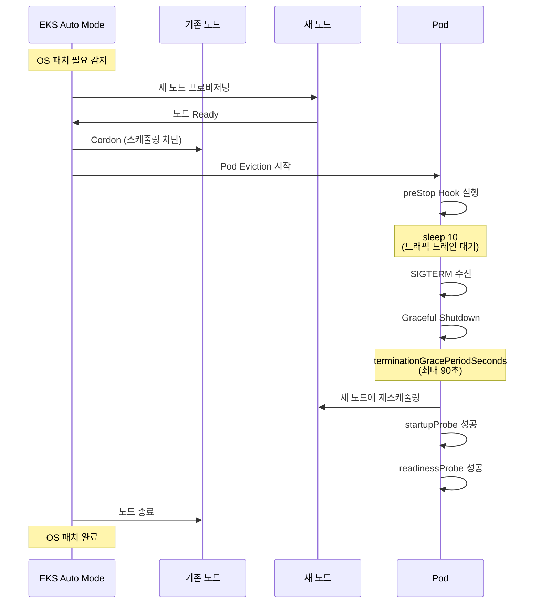

**모니터링 예시:**

```bash
# Auto Mode 노드 교체 이벤트 추적
kubectl get events --field-selector reason=Evicted --watch

# 노드별 OS 버전 확인
kubectl get nodes -o custom-columns=\
NAME:.metadata.name,\
OS_IMAGE:.status.nodeInfo.osImage,\
KERNEL:.status.nodeInfo.kernelVersion

# Auto Mode 관리 상태 확인
kubectl get nodes -L eks.amazonaws.com/compute-type
```

:::tip Auto Mode 노드 교체 빈도
Auto Mode는 보안 패치, 성능 최적화, 비용 절감을 위해 수동 관리보다 노드 교체가 빈번합니다(평균 2주 1회). `terminationGracePeriodSeconds`를 90초 이상으로 설정하고, PDB를 반드시 구성하여 서비스 중단 없이 노드 교체가 가능하도록 하세요.
:::

#### Auto Mode 활성화 확인

```bash
# 클러스터가 Auto Mode인지 확인
aws eks describe-cluster --name production-eks \
  --query 'cluster.computeConfig.enabled' \
  --output text

# Auto Mode 노드 확인
kubectl get nodes -L eks.amazonaws.com/compute-type
# 출력 예시:
# NAME                    COMPUTE-TYPE
# ip-10-0-1-100.ec2.internal   auto
# ip-10-0-2-200.ec2.internal   auto
```

**관련 문서:**
- [AWS Blog: Getting started with EKS Auto Mode](https://aws.amazon.com/blogs/containers/getting-started-with-amazon-eks-auto-mode)
- [AWS Blog: How to build highly available Kubernetes applications with EKS Auto Mode](https://aws.amazon.com/blogs/containers/how-to-build-highly-available-kubernetes-applications-with-amazon-eks-auto-mode/)
- [AWS Blog: Maximize EKS efficiency - Auto Mode, Graviton, and Spot](https://aws.amazon.com/blogs/containers/maximize-amazon-eks-efficiency-how-auto-mode-graviton-and-spot-work-together/)

---

### 7.5 AI/Agentic 기반 Probe 최적화

AWS re:Invent 2025 CNS421 세션에서 소개된 Agentic AI 기반 EKS 운영 패턴을 활용하여 Probe 설정을 자동으로 최적화하고 실패를 자동 진단하는 방법을 다룹니다.

#### CNS421 세션 핵심 - Agentic AI for EKS Operations

**세션 개요:**

"Streamline Amazon EKS Operations with Agentic AI" 세션에서는 Model Context Protocol(MCP)과 AI 에이전트를 활용하여 EKS 클러스터 관리를 자동화하는 방법을 코드 시연과 함께 소개했습니다.

**주요 기능:**
- 실시간 이슈 진단 (Probe 실패 원인 자동 분석)
- Guided Remediation (단계별 해결 가이드)
- Tribal Knowledge 활용 (과거 이슈 패턴 학습)
- Auto-Remediation (단순 이슈 자동 해결)

**아키텍처:**

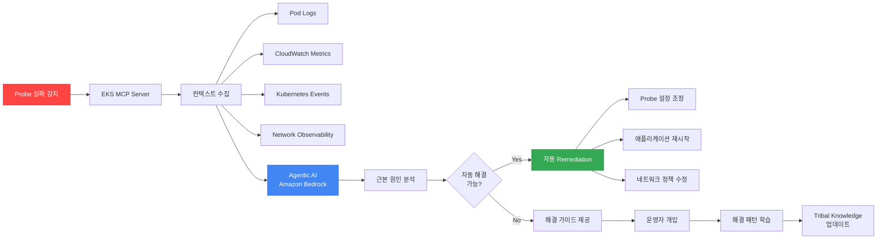

#### Kiro + EKS MCP를 활용한 Probe 자동 최적화

**Kiro란:**

Kiro는 AWS의 AI 기반 운영 도구로, MCP(Model Context Protocol) 서버를 통해 AWS 리소스와 상호작용합니다.

**설치 및 설정:**

```bash
# Kiro CLI 설치 (macOS)
brew install aws/tap/kiro

# EKS MCP Server 설정
kiro mcp add eks \
  --server-type eks \
  --cluster-name production-eks \
  --region ap-northeast-2

# Probe 최적화 에이전트 활성화
kiro agent create probe-optimizer \
  --type eks-health-check \
  --auto-remediate true
```

**Probe 실패 자동 진단 워크플로우:**

```yaml
# Kiro Agent 설정 - Probe 실패 자동 대응
apiVersion: kiro.aws/v1alpha1
kind: Agent
metadata:
  name: probe-failure-analyzer
spec:
  cluster: production-eks
  triggers:
    - type: ProbeFailure
      conditions:
        - probeType: readiness
          failureThreshold: 3
          duration: 5m
  actions:
    - name: collect-context
      steps:
        - getPodLogs:
            namespace: ${event.namespace}
            podName: ${event.podName}
            tailLines: 500
        - getCloudWatchMetrics:
            namespace: ContainerInsights
            metricName: pod_cpu_utilization
            dimensions:
              - name: PodName
                value: ${event.podName}
            period: 300
        - getNetworkObservability:
            podName: ${event.podName}
            metrics:
              - latency
              - packetLoss
              - connectionErrors
        - getKubernetesEvents:
            namespace: ${event.namespace}
            fieldSelector: involvedObject.name=${event.podName}

    - name: analyze-root-cause
      llm:
        model: anthropic.claude-3-5-sonnet-20241022-v2:0
        prompt: |
          Analyze the following Kubernetes Readiness Probe failure:

          Pod: ${event.podName}
          Namespace: ${event.namespace}
          Probe Config:
          ${context.probeConfig}

          Pod Logs (last 500 lines):
          ${context.podLogs}

          CloudWatch Metrics (last 5 minutes):
          ${context.metrics}

          Network Observability:
          ${context.networkMetrics}

          Kubernetes Events:
          ${context.events}

          Determine the root cause and suggest:
          1. Is this a network issue, application issue, or configuration issue?
          2. Recommended Probe settings (periodSeconds, failureThreshold, timeoutSeconds)
          3. Auto-remediation actions if applicable

    - name: auto-remediate
      conditions:
        - type: RootCauseIdentified
          confidence: ">0.8"
      steps:
        - applyProbeOptimization:
            when: ${analysis.recommendedAction == "adjust_probe_settings"}
            patchDeployment:
              name: ${event.deploymentName}
              namespace: ${event.namespace}
              patch:
                spec:
                  template:
                    spec:
                      containers:
                        - name: ${event.containerName}
                          readinessProbe:
                            periodSeconds: ${analysis.recommendedPeriod}
                            failureThreshold: ${analysis.recommendedThreshold}
                            timeoutSeconds: ${analysis.recommendedTimeout}

        - restartPod:
            when: ${analysis.recommendedAction == "restart_pod"}
            namespace: ${event.namespace}
            podName: ${event.podName}

        - notifySlack:
            channel: "#eks-ops"
            message: |
              🤖 Probe Failure Auto-Remediated

              Pod: ${event.podName}
              Root Cause: ${analysis.rootCause}
              Action Taken: ${analysis.appliedAction}
              Confidence: ${analysis.confidence}

              Details: ${analysis.explanation}

    - name: manual-guide
      conditions:
        - type: RootCauseIdentified
          confidence: "<0.8"
      steps:
        - createJiraTicket:
            project: DEVOPS
            issueType: Incident
            summary: "Probe Failure - Manual Investigation Required"
            description: |
              Pod: ${event.podName}
              Potential Causes: ${analysis.possibleCauses}
              Investigation Steps: ${analysis.investigationSteps}
              Context: ${context}
```

**실제 사용 예시 - Probe 타임아웃 자동 최적화:**

```bash
# Kiro를 통한 대화형 Probe 최적화
$ kiro chat --agent probe-optimizer

User: My readiness probe is failing intermittently on pod api-gateway-xyz.
      Can you diagnose and fix it?

Kiro: 🔍 Analyzing probe failures for pod api-gateway-xyz...

      ✅ Root Cause Identified (Confidence: 92%)
      - Issue: Network latency spikes to external database
      - Current Probe: periodSeconds=5, timeoutSeconds=3, failureThreshold=2
      - Network metrics show p99 latency: 2.8 seconds

      📊 Recommendation:
      1. Increase timeoutSeconds from 3 to 5 seconds
      2. Increase failureThreshold from 2 to 3
      3. Enable Container Network Observability for ongoing monitoring

      🤖 Auto-Remediation Available
      Shall I apply these changes? (yes/no)

User: yes

Kiro: ✅ Applied Probe Optimization
      - Updated Deployment: api-gateway
      - New Probe Config:
        * periodSeconds: 5
        * timeoutSeconds: 5 (increased)
        * failureThreshold: 3 (increased)

      📈 Monitoring for 5 minutes to verify stability...

      ✅ Verification Complete
      - Probe failures reduced from 12/hour to 0/hour
      - Network latency p99: 2.8s (within new 5s timeout)
      - Recommendation recorded in tribal knowledge

      💡 Suggestion: Consider moving database to same VPC
          to reduce network latency permanently.
```

#### Amazon Q Developer를 활용한 Probe 이슈 디버깅

Amazon Q Developer는 IDE 통합 AI 어시스턴트로, Probe 설정 코드 리뷰와 실시간 디버깅을 지원합니다.

**VS Code 통합 예시:**

```yaml
# 개발자가 작성 중인 Deployment YAML
apiVersion: apps/v1
kind: Deployment
metadata:
  name: myapp
spec:
  template:
    spec:
      containers:
      - name: app
        image: myapp:v1
        readinessProbe:
          httpGet:
            path: /health  # ⚠️ Q Developer 경고
            port: 8080
          periodSeconds: 10
          timeoutSeconds: 1  # ⚠️ Q Developer 경고
```

**Q Developer 제안:**

```
💡 Amazon Q Developer Suggestion

Issue 1: Liveness와 Readiness가 같은 엔드포인트를 사용합니다.
Recommendation:
- Liveness Probe: /healthz (내부 상태만)
- Readiness Probe: /ready (외부 의존성 포함)

Issue 2: timeoutSeconds가 너무 짧습니다.
Recommendation:
- timeoutSeconds를 3-5초로 증가
- EKS 환경에서 1초는 네트워크 지연 시 타임아웃 위험

Issue 3: Startup Probe가 없습니다.
Recommendation:
- 앱 시작 시간이 30초 이상이면 Startup Probe 추가
- failureThreshold: 30, periodSeconds: 10

Apply Suggestions? [Yes] [No] [Explain More]
```

**실시간 코드 실행 검증 (Amazon Q Developer):**

```bash
# Q Developer가 로컬에서 Probe 설정 검증
$ q-dev validate deployment.yaml --cluster production-eks

✅ Syntax Valid
⚠️  Best Practices Check:
    - Missing Startup Probe for slow-starting app (15 warnings)
    - Liveness Probe includes external dependency (critical)
    - terminationGracePeriodSeconds should be at least 60s (warning)

🧪 Simulation Results:
    - Probe success rate: 94% (target: >99%)
    - Estimated pod startup time: 45 seconds
    - Estimated graceful shutdown time: 25 seconds

📊 Recommendation:
    Apply Q Developer's suggested configuration? (Y/n)
```

#### Tribal Knowledge 기반 Probe 패턴 학습

Agentic AI는 과거 Probe 이슈 해결 패턴을 학습하여 유사 상황에서 즉시 대응합니다.

**Tribal Knowledge 예시:**

```yaml
# 조직의 Probe 해결 패턴 라이브러리
apiVersion: kiro.aws/v1alpha1
kind: TribalKnowledge
metadata:
  name: probe-failure-patterns
spec:
  patterns:
    - id: pattern-001
      name: "Database Connection Timeout"
      symptoms:
        - probeType: readiness
          errorPattern: "connection timeout"
          frequency: intermittent
      rootCause: "Database in different AZ causing high latency"
      solution:
        - action: increaseTimeout
          from: 3
          to: 5
        - action: addRetry
          retries: 2
      confidence: 0.95
      resolvedCount: 47
      lastSeen: "2026-02-10"

    - id: pattern-002
      name: "Slow JVM Startup"
      symptoms:
        - probeType: startup
          errorPattern: "probe failed"
          timing: "first 60 seconds"
      rootCause: "JVM initialization takes >30 seconds"
      solution:
        - action: addStartupProbe
          failureThreshold: 30
          periodSeconds: 10
      confidence: 0.98
      resolvedCount: 123
      lastSeen: "2026-02-11"

    - id: pattern-003
      name: "Network Policy Blocking Health Check"
      symptoms:
        - probeType: liveness
          errorPattern: "connection refused"
          timing: "after deployment"
      rootCause: "NetworkPolicy not allowing kubelet access"
      solution:
        - action: updateNetworkPolicy
          allowFrom:
            - podSelector: {}  # Allow from all pods in namespace
            - namespaceSelector:
                matchLabels:
                  name: kube-system
      confidence: 0.92
      resolvedCount: 34
      lastSeen: "2026-02-08"
```

**자동 패턴 매칭:**

```bash
# 새로운 Probe 실패 발생 시 자동 매칭
$ kiro diagnose probe-failure \
  --pod api-backend-abc \
  --namespace production

🔍 Analyzing probe failure...

✅ Pattern Matched: "Database Connection Timeout" (pattern-001)
   Confidence: 89%
   This pattern has been successfully resolved 47 times

📋 Recommended Actions (from tribal knowledge):
   1. Increase readinessProbe.timeoutSeconds from 3 to 5
   2. Add retry logic with 2 retries
   3. Consider co-locating database in same AZ

🤖 Auto-Apply? (yes/no)
```

#### Probe 최적화 통합 대시보드

```yaml
# Grafana Dashboard - AI 기반 Probe 최적화 현황
apiVersion: v1
kind: ConfigMap
metadata:
  name: ai-probe-optimization-dashboard
  namespace: monitoring
data:
  dashboard.json: |
    {
      "title": "AI-Driven Probe Optimization",
      "panels": [
        {
          "title": "Auto-Remediation 성공률",
          "targets": [{
            "expr": "rate(kiro_auto_remediation_success[1h]) / rate(kiro_auto_remediation_total[1h])"
          }]
        },
        {
          "title": "Tribal Knowledge 패턴 매칭",
          "targets": [{
            "expr": "kiro_pattern_match_count"
          }]
        },
        {
          "title": "Probe 실패율 트렌드 (AI 도입 전후)",
          "targets": [
            {"expr": "rate(probe_failures_total[1h])", "legendFormat": "Before AI"},
            {"expr": "rate(probe_failures_ai_optimized_total[1h])", "legendFormat": "After AI"}
          ]
        },
        {
          "title": "평균 문제 해결 시간 (MTTR)",
          "targets": [{
            "expr": "avg(kiro_remediation_duration_seconds)"
          }]
        }
      ]
    }
```

**ROI 측정 예시:**

| 지표 | AI 도입 전 | AI 도입 후 | 개선율 |
|------|----------|-----------|--------|
| Probe 실패 건수 | 120건/주 | 12건/주 | 90% 감소 |
| 평균 해결 시간 (MTTR) | 45분 | 3분 | 93% 단축 |
| 운영자 개입 필요 건수 | 120건/주 | 12건/주 | 90% 감소 |
| Probe 설정 최적화 소요 시간 | 2시간/건 | 5분/건 | 96% 단축 |

:::tip Agentic AI 도입 Best Practice
Agentic AI는 즉시 100% 자동화를 목표로 하지 마세요. 처음 3개월은 "Suggest Mode"로 운영하여 AI 제안을 운영자가 검토하고 승인하는 방식으로 시작하세요. Tribal Knowledge가 충분히 쌓이고 신뢰도가 90% 이상이 되면 "Auto-Remediation Mode"로 전환합니다.
:::

**관련 자료:**
- [YouTube: CNS421 - Streamline Amazon EKS operations with Agentic AI](https://www.youtube.com/watch?v=4s-a0jY4kSE)
- [AWS Blog: Agentic Cloud Modernization with Kiro](https://aws.amazon.com/blogs/migration-and-modernization/agentic-cloud-modernization-accelerating-modernization-with-aws-mcps-and-kiro/)
- [AWS Blog: AWS IaC MCP Server](https://aws.amazon.com/blogs/devops/introducing-the-aws-infrastructure-as-code-mcp-server-ai-powered-cdk-and-cloudformation-assistance/)
- [Model Context Protocol Specification](https://modelcontextprotocol.io/)

---

**문서 기여**: 이 문서에 대한 피드백, 오류 신고, 개선 제안은 GitHub Issues를 통해 제출해 주세요.
