# EKS Pod í—¬ìŠ¤ì²´í¬ & ë¼ì´í”„사ì´í´ 관리

> 📅 **ì‘성ì¼**: 2026-02-12 | â±ï¸ **ì½ëŠ” 시간**: 약 18분

> **📌 기준 환경**: EKS 1.30+, Kubernetes 1.30+, AWS Load Balancer Controller v2.7+

## 1. 개요

Podì˜ í—¬ìŠ¤ì²´í¬ì™€ ë¼ì´í”„사ì´í´ 관리는 서비스 안정성과 ê°€ìš©ì„±ì˜ í•µì‹¬ì…니다. ì ì ˆí•œ Probe 설정과 Graceful Shutdown êµ¬í˜„ì€ ë‹¤ìŒì„ ë³´ì¥í•©ë‹ˆë‹¤:

- **무중단 ë°°í¬**: ë¡¤ë§ ì—…ë°ì´íŠ¸ ì‹œ 트ë˜í”½ 유실 방지
- **빠른 ì¥ì•  ê°ì§€**: ë¹„ì •ìƒ Pod ìë™ ê²©ë¦¬ ë° ì¬ì‹œì‘
- **리소스 최ì í™”**: ëŠë¦° ì‹œì‘ ì•±ì˜ ì¡°ê¸° ì¬ì‹œì‘ 방지
- **ë°ì´í„° 무결성**: 종료 ì‹œ 진행 ì¤‘ì¸ ìš”ì²­ 안전하게 완료

본 문서는 Kubernetes Probeì˜ ë™ì‘ ì›ë¦¬ë¶€í„° 언어별 Graceful Shutdown 구현, Init Container 활용, 컨테ì´ë„ˆ ì´ë¯¸ì§€ 최ì í™”까지 Pod ë¼ì´í”„사ì´í´ 전체를 다룹니다.

:::info 관련 문서 참조
- **Probe 디버깅**: [EKS ì¥ì•  진단 ë° ëŒ€ì‘ ê°€ì´ë“œ](/docs/operations-observability/eks-debugging-guide)ì˜ "Probe 디버깅 ë° Best Practices" 섹션
- **고가용성 설계**: [EKS 고가용성 아키í…처 ê°€ì´ë“œ](/docs/operations-observability/eks-resiliency-guide)ì˜ "Graceful Shutdown", "PDB", "Pod Readiness Gates" 섹션
:::

---

## 2. Kubernetes Probe 심층 ê°€ì´ë“œ

### 2.1 세 가지 Probe 유형과 ë™ì‘ ì›ë¦¬

Kubernetes는 세 가지 ìœ í˜•ì˜ Probe를 제공하여 Podì˜ ìƒíƒœë¥¼ 모니터ë§í•©ë‹ˆë‹¤.

| Probe 유형 | ëª©ì  | 실패 ì‹œ ë™ì‘ | 활성화 타ì´ë° |
|-----------|------|-------------|-------------|
| **Startup Probe** | 애플리케ì´ì…˜ 초기화 완료 í™•ì¸ | Pod ì¬ì‹œì‘ (failureThreshold ë„달 ì‹œ) | Pod ì‹œì‘ ì§í›„ |
| **Liveness Probe** | 애플리케ì´ì…˜ ë°ë“œë½/êµì°© ìƒíƒœ ê°ì§€ | 컨테ì´ë„ˆ ì¬ì‹œì‘ | Startup Probe 성공 후 |
| **Readiness Probe** | 트ë˜í”½ 수신 준비 ìƒíƒœ í™•ì¸ | Service Endpointì—ì„œ 제거 (ì¬ì‹œì‘ ì—†ìŒ) | Startup Probe 성공 후 |

#### Startup Probe: ëŠë¦° ì‹œì‘ ì•± 보호

Startup Probe는 애플리케ì´ì…˜ì´ ì™„ì „íˆ ì‹œì‘ë  ë•Œê¹Œì§€ Liveness/Readiness Probeì˜ ì‹¤í–‰ì„ ì§€ì—°ì‹œí‚µë‹ˆë‹¤. Spring Boot, JVM 애플리케ì´ì…˜, ML ëª¨ë¸ ë¡œë”© 등 ì‹œì‘ì´ ëŠë¦° ì•±ì— í•„ìˆ˜ì…니다.

**ë™ì‘ ì›ë¦¬:**
- Startup Probeê°€ 실행 ì¤‘ì¼ ë•ŒëŠ” Liveness/Readiness Probeê°€ 비활성화ë¨
- Startup Probe 성공 시 → Liveness/Readiness Probe 활성화
- Startup Probe 실패 (failureThreshold ë„달) → 컨테ì´ë„ˆ ì¬ì‹œì‘

#### Liveness Probe: ë°ë“œë½ ê°ì§€

Liveness Probe는 애플리케ì´ì…˜ì´ ì‚´ì•„ìˆëŠ”지 확ì¸í•©ë‹ˆë‹¤. 실패 ì‹œ kubeletì´ ì»¨í…Œì´ë„ˆë¥¼ ì¬ì‹œì‘합니다.

**사용 사례:**
- 무한 루프, ë°ë“œë½ ìƒíƒœ ê°ì§€
- 복구 불가능한 애플리케ì´ì…˜ ì—러
- 메모리 누수로 ì¸í•œ ì‘답 불가 ìƒíƒœ

**주ì˜ì‚¬í•­:**
- Liveness Probeì— **외부 ì˜ì¡´ì„±ì„ í¬í•¨í•˜ì§€ 마세요** (DB, Redis 등)
- 외부 서비스 ì¥ì•  ì‹œ ì „ì²´ Podì´ ì¬ì‹œì‘ë˜ëŠ” cascading failure ë°œìƒ

#### Readiness Probe: 트ë˜í”½ 수신 제어

Readiness Probe는 Podì´ íŠ¸ë˜í”½ì„ ë°›ì„ ì¤€ë¹„ê°€ ë˜ì—ˆëŠ”지 확ì¸í•©ë‹ˆë‹¤. 실패 ì‹œ Serviceì˜ Endpointsì—ì„œ Podì´ ì œê±°ë˜ì§€ë§Œ, 컨테ì´ë„ˆëŠ” ì¬ì‹œì‘ë˜ì§€ 않습니다.

**사용 사례:**
- ì˜ì¡´ 서비스 ì—°ê²° í™•ì¸ (DB, ìºì‹œ)
- 초기 ë°ì´í„° 로딩 완료 확ì¸
- ë°°í¬ ì¤‘ ë‹¨ê³„ì  íŠ¸ë˜í”½ 수신


### 2.2 Probe 메커니즘

Kubernetes는 네 가지 Probe ë©”ì»¤ë‹ˆì¦˜ì„ ì§€ì›í•©ë‹ˆë‹¤.

| 메커니즘 | 설명 | ì¥ì  | ë‹¨ì  | ì í•©í•œ ìƒí™© |
|----------|------|------|------|------------|
| **httpGet** | HTTP GET 요청, 200-399 ì‘답 코드 í™•ì¸ | 표준ì , 구현 간단 | HTTP 서버 í•„ìš” | REST API, 웹 서비스 |
| **tcpSocket** | TCP í¬íŠ¸ ì—°ê²° 가능 여부 í™•ì¸ | ê°€ë³ê³  빠름 | 애플리케ì´ì…˜ ë¡œì§ ê²€ì¦ ë¶ˆê°€ | gRPC, ë°ì´í„°ë² ì´ìŠ¤ |
| **exec** | 컨테ì´ë„ˆ ë‚´ 명령 실행, exit code 0 í™•ì¸ | 유연함, 커스텀 ë¡œì§ ê°€ëŠ¥ | 오버헤드 ë†’ìŒ | 배치 워커, íŒŒì¼ ê¸°ë°˜ í™•ì¸ |
| **grpc** | gRPC Health Check Protocol 사용 (K8s 1.27+ GA) | 네ì´í‹°ë¸Œ gRPC ì§€ì› | gRPC 앱만 사용 가능 | gRPC 마ì´í¬ë¡œì„œë¹„스 |

#### httpGet 예시

```yaml
livenessProbe:
  httpGet:
    path: /healthz
    port: 8080
    httpHeaders:
    - name: X-Custom-Header
      value: HealthCheck
    scheme: HTTP  # ë˜ëŠ” HTTPS
  initialDelaySeconds: 30
  periodSeconds: 10
```

#### tcpSocket 예시

```yaml
livenessProbe:
  tcpSocket:
    port: 5432  # PostgreSQL
  initialDelaySeconds: 15
  periodSeconds: 10
```

#### exec 예시

```yaml
livenessProbe:
  exec:
    command:
    - /bin/sh
    - -c
    - test -f /tmp/healthy
  initialDelaySeconds: 5
  periodSeconds: 5
```

#### grpc 예시 (Kubernetes 1.27+)

```yaml
livenessProbe:
  grpc:
    port: 9090
    service: myservice  # ì„ íƒ ì‚¬í•­
  initialDelaySeconds: 10
  periodSeconds: 5
```

:::tip gRPC Health Check Protocol
gRPC 서비스는 [gRPC Health Checking Protocol](https://github.com/grpc/grpc/blob/master/doc/health-checking.md)ì„ êµ¬í˜„í•´ì•¼ 합니다. Go는 `google.golang.org/grpc/health`, Java는 `grpc-health-check` ë¼ì´ë¸ŒëŸ¬ë¦¬ë¥¼ 사용하세요.
:::

### 2.3 Probe 타ì´ë° 설계

Probeì˜ íƒ€ì´ë° 파ë¼ë¯¸í„°ëŠ” ì¥ì•  ê°ì§€ ì†ë„와 안정성 ê°„ì˜ ê· í˜•ì„ ê²°ì •í•©ë‹ˆë‹¤.

| 파ë¼ë¯¸í„° | 설명 | 기본값 | ê¶Œì¥ ë²”ìœ„ |
|----------|------|--------|----------|
| `initialDelaySeconds` | 컨테ì´ë„ˆ ì‹œì‘ í›„ 첫 Probe까지 대기 시간 | 0 | 10-30s (Startup Probe 사용 ì‹œ 0 가능) |
| `periodSeconds` | Probe 실행 간격 | 10 | 5-15s |
| `timeoutSeconds` | Probe ì‘답 대기 시간 | 1 | 3-10s |
| `failureThreshold` | 실패 íŒì •ê¹Œì§€ ì—°ì† ì‹¤íŒ¨ 횟수 | 3 | Liveness: 3, Readiness: 1-3, Startup: 30+ |
| `successThreshold` | 성공 íŒì •ê¹Œì§€ ì—°ì† ì„±ê³µ 횟수 (Readiness만 1 ì´ìƒ 가능) | 1 | 1-2 |

#### 타ì´ë° 설계 ê³µì‹

```
최대 ê°ì§€ 시간 = failureThreshold × periodSeconds
최소 복구 시간 = successThreshold × periodSeconds
```

**예시:**
- `failureThreshold: 3, periodSeconds: 10` → 최대 30ì´ˆ 후 ì¥ì•  ê°ì§€
- `successThreshold: 2, periodSeconds: 5` → 최소 10ì´ˆ 후 복구 íŒì • (Readiness만)

#### 워í¬ë¡œë“œë³„ ê¶Œì¥ íƒ€ì´ë°

| 워í¬ë¡œë“œ 유형 | initialDelaySeconds | periodSeconds | failureThreshold | ì´ìœ  |
|--------------|-------------------|---------------|-----------------|------|
| 웹 서비스 (Node.js, Python) | 10 | 5 | 3 | 빠른 ì‹œì‘, 빠른 ê°ì§€ í•„ìš” |
| JVM 앱 (Spring Boot) | 0 (Startup Probe 사용) | 10 | 3 | ì‹œì‘ ëŠë¦¼, Startup으로 보호 |
| ë°ì´í„°ë² ì´ìŠ¤ (PostgreSQL) | 30 | 10 | 5 | 초기화 시간 ê¸¸ìŒ |
| 배치 워커 | 5 | 15 | 2 | ì£¼ê¸°ì  ì‘ì—…, ëŠìŠ¨í•œ ê°ì§€ |
| ML 추론 서비스 | 0 (Startup: 60) | 10 | 3 | ëª¨ë¸ ë¡œë”© 시간 긺 |

### 2.4 워í¬ë¡œë“œë³„ Probe 패턴

#### 패턴 1: 웹 서비스 (REST API)

```yaml
apiVersion: apps/v1
kind: Deployment
metadata:
  name: rest-api
spec:
  replicas: 3
  selector:
    matchLabels:
      app: rest-api
  template:
    metadata:
      labels:
        app: rest-api
    spec:
      containers:
      - name: api
        image: myapp/rest-api:v1.2.3
        ports:
        - containerPort: 8080
          protocol: TCP
        resources:
          requests:
            cpu: 200m
            memory: 256Mi
          limits:
            cpu: 500m
            memory: 512Mi
        # Startup Probe: 30ì´ˆ ì´ë‚´ ì‹œì‘ ì™„ë£Œ 확ì¸
        startupProbe:
          httpGet:
            path: /healthz
            port: 8080
          failureThreshold: 6
          periodSeconds: 5
        # Liveness Probe: 내부 헬스체í¬ë§Œ (외부 ì˜ì¡´ì„± 제외)
        livenessProbe:
          httpGet:
            path: /healthz
            port: 8080
          initialDelaySeconds: 10
          periodSeconds: 10
          timeoutSeconds: 5
          failureThreshold: 3
        # Readiness Probe: 외부 ì˜ì¡´ì„± í¬í•¨ 가능
        readinessProbe:
          httpGet:
            path: /ready
            port: 8080
          initialDelaySeconds: 5
          periodSeconds: 5
          timeoutSeconds: 3
          failureThreshold: 2
          successThreshold: 1
        lifecycle:
          preStop:
            exec:
              command:
              - /bin/sh
              - -c
              - sleep 5 && kill -TERM 1
      terminationGracePeriodSeconds: 60
```

**í—¬ìŠ¤ì²´í¬ ì—”ë“œí¬ì¸íŠ¸ 구현 (Node.js/Express):**

```javascript
// /healthz - Liveness: 애플리케ì´ì…˜ ìì²´ ìƒíƒœë§Œ 확ì¸
app.get('/healthz', (req, res) => {
  // 내부 ìƒíƒœë§Œ í™•ì¸ (메모리, CPU 등)
  const memUsage = process.memoryUsage();
  if (memUsage.heapUsed / memUsage.heapTotal > 0.95) {
    return res.status(500).json({ status: 'unhealthy', reason: 'memory_pressure' });
  }
  res.status(200).json({ status: 'ok' });
});

// /ready - Readiness: 외부 ì˜ì¡´ì„± í¬í•¨ 확ì¸
app.get('/ready', async (req, res) => {
  try {
    // DB ì—°ê²° 확ì¸
    await db.ping();
    // Redis ì—°ê²° 확ì¸
    await redis.ping();
    res.status(200).json({ status: 'ready' });
  } catch (err) {
    res.status(503).json({ status: 'not_ready', reason: err.message });
  }
});
```

#### 패턴 2: gRPC 서비스

```yaml
apiVersion: apps/v1
kind: Deployment
metadata:
  name: grpc-service
spec:
  replicas: 3
  selector:
    matchLabels:
      app: grpc-service
  template:
    metadata:
      labels:
        app: grpc-service
    spec:
      containers:
      - name: grpc-server
        image: myapp/grpc-service:v2.1.0
        ports:
        - containerPort: 9090
          name: grpc
        resources:
          requests:
            cpu: 300m
            memory: 512Mi
          limits:
            cpu: 1
            memory: 1Gi
        # gRPC native probe (K8s 1.27+)
        startupProbe:
          grpc:
            port: 9090
            service: myapp.HealthService  # ì„ íƒ ì‚¬í•­
          failureThreshold: 30
          periodSeconds: 10
        livenessProbe:
          grpc:
            port: 9090
          periodSeconds: 10
          timeoutSeconds: 5
          failureThreshold: 3
        readinessProbe:
          grpc:
            port: 9090
          periodSeconds: 5
          timeoutSeconds: 3
          failureThreshold: 2
      terminationGracePeriodSeconds: 45
```

**gRPC Health Check 구현 (Go):**

```go
package main

import (
    "context"
    "google.golang.org/grpc"
    "google.golang.org/grpc/health"
    "google.golang.org/grpc/health/grpc_health_v1"
)

func main() {
    server := grpc.NewServer()

    // Health 서비스 등ë¡
    healthServer := health.NewServer()
    grpc_health_v1.RegisterHealthServer(server, healthServer)

    // 서비스를 SERVING ìƒíƒœë¡œ 설정
    healthServer.SetServingStatus("myapp.HealthService", grpc_health_v1.HealthCheckResponse_SERVING)

    // ì˜ì¡´ì„± ì²´í¬ í›„ NOT_SERVING으로 변경 가능
    // healthServer.SetServingStatus("myapp.HealthService", grpc_health_v1.HealthCheckResponse_NOT_SERVING)

    // gRPC 서버 ì‹œì‘
    lis, _ := net.Listen("tcp", ":9090")
    server.Serve(lis)
}
```

#### 패턴 3: 워커/배치 처리

배치 워커는 HTTP 서버가 없으므로 `exec` Probe를 사용합니다.

```yaml
apiVersion: apps/v1
kind: Deployment
metadata:
  name: batch-worker
spec:
  replicas: 2
  selector:
    matchLabels:
      app: batch-worker
  template:
    metadata:
      labels:
        app: batch-worker
    spec:
      containers:
      - name: worker
        image: myapp/batch-worker:v3.0.1
        resources:
          requests:
            cpu: 500m
            memory: 1Gi
          limits:
            cpu: 2
            memory: 4Gi
        # Startup Probe: 워커 초기화 확ì¸
        startupProbe:
          exec:
            command:
            - /bin/sh
            - -c
            - test -f /tmp/worker-ready
          failureThreshold: 12
          periodSeconds: 5
        # Liveness Probe: 하트비트 íŒŒì¼ í™•ì¸
        livenessProbe:
          exec:
            command:
            - /bin/sh
            - -c
            - find /tmp/heartbeat -mmin -2 | grep -q heartbeat
          initialDelaySeconds: 10
          periodSeconds: 30
          failureThreshold: 3
        # Readiness Probe: ì‘ì—… í ì—°ê²° 확ì¸
        readinessProbe:
          exec:
            command:
            - /app/check-queue-connection.sh
          periodSeconds: 10
          failureThreshold: 3
      terminationGracePeriodSeconds: 120
```

**워커 애플리케ì´ì…˜ (Python):**

```python
import os
import time
from pathlib import Path

HEARTBEAT_FILE = Path("/tmp/heartbeat")
READY_FILE = Path("/tmp/worker-ready")

def worker_loop():
    # 초기화 완료 시그ë„
    READY_FILE.touch()

    while True:
        # 주기ì ìœ¼ë¡œ 하트비트 ì—…ë°ì´íŠ¸
        HEARTBEAT_FILE.touch()

        # ì‘ì—… 처리
        process_jobs()
        time.sleep(5)

def process_jobs():
    # 실제 ì‘ì—… ë¡œì§
    pass

if __name__ == "__main__":
    worker_loop()
```

#### 패턴 4: ëŠë¦° ì‹œì‘ ì•± (Spring Boot, JVM)

JVM 애플리케ì´ì…˜ì€ ì‹œì‘ ì‹œê°„ì´ 30ì´ˆ ì´ìƒ ì†Œìš”ë  ìˆ˜ ìˆìŠµë‹ˆë‹¤. Startup Probeë¡œ 보호합니다.

```yaml
apiVersion: apps/v1
kind: Deployment
metadata:
  name: spring-boot-app
spec:
  replicas: 4
  selector:
    matchLabels:
      app: spring-boot
  template:
    metadata:
      labels:
        app: spring-boot
    spec:
      containers:
      - name: app
        image: myapp/spring-boot:v2.7.0
        ports:
        - containerPort: 8080
        resources:
          requests:
            cpu: 1
            memory: 2Gi
          limits:
            cpu: 2
            memory: 4Gi
        env:
        - name: JAVA_OPTS
          value: "-Xms1g -Xmx3g"
        # Startup Probe: 최대 5분(30 x 10s) 대기
        startupProbe:
          httpGet:
            path: /actuator/health/liveness
            port: 8080
          failureThreshold: 30
          periodSeconds: 10
        # Liveness Probe: Startup 성공 후 활성화
        livenessProbe:
          httpGet:
            path: /actuator/health/liveness
            port: 8080
          periodSeconds: 10
          timeoutSeconds: 5
          failureThreshold: 3
        # Readiness Probe: 외부 ì˜ì¡´ì„± í¬í•¨
        readinessProbe:
          httpGet:
            path: /actuator/health/readiness
            port: 8080
          periodSeconds: 5
          timeoutSeconds: 3
          failureThreshold: 2
      terminationGracePeriodSeconds: 60
```

**Spring Boot Actuator 설정:**

```yaml
# application.yml
management:
  endpoints:
    web:
      exposure:
        include: health
  health:
    livenessState:
      enabled: true
    readinessState:
      enabled: true
  endpoint:
    health:
      probes:
        enabled: true
      show-details: when-authorized
```

#### 패턴 5: 사ì´ë“œì¹´ 패턴 (Istio Proxy + 앱)

사ì´ë“œì¹´ 패턴ì—서는 ë©”ì¸ ì»¨í…Œì´ë„ˆì™€ 사ì´ë“œì¹´ 모ë‘ì— Probe를 설정합니다.

```yaml
apiVersion: apps/v1
kind: Deployment
metadata:
  name: app-with-sidecar
spec:
  replicas: 3
  selector:
    matchLabels:
      app: myapp
  template:
    metadata:
      labels:
        app: myapp
    spec:
      containers:
      # ë©”ì¸ ì• í”Œë¦¬ì¼€ì´ì…˜ 컨테ì´ë„ˆ
      - name: app
        image: myapp/app:v1.0.0
        ports:
        - containerPort: 8080
        startupProbe:
          httpGet:
            path: /healthz
            port: 8080
          failureThreshold: 10
          periodSeconds: 5
        livenessProbe:
          httpGet:
            path: /healthz
            port: 8080
          periodSeconds: 10
        readinessProbe:
          httpGet:
            path: /ready
            port: 8080
          periodSeconds: 5
      # Istio 사ì´ë“œì¹´ (ìë™ ì£¼ì… ì‹œ Istioê°€ Probe 추가)
      # ìˆ˜ë™ ì„¤ì • 예시:
      - name: istio-proxy
        image: istio/proxyv2:1.22.0
        ports:
        - containerPort: 15090
          name: http-envoy-prom
        startupProbe:
          httpGet:
            path: /healthz/ready
            port: 15021
          failureThreshold: 30
          periodSeconds: 1
        livenessProbe:
          httpGet:
            path: /healthz/ready
            port: 15021
          periodSeconds: 10
        readinessProbe:
          httpGet:
            path: /healthz/ready
            port: 15021
          periodSeconds: 2
      terminationGracePeriodSeconds: 90
```

:::tip Istio Sidecar Injection
Istioê°€ ìë™ ì£¼ì…ì„ ì‚¬ìš©í•˜ëŠ” 경우 (`istio-injection=enabled` ë ˆì´ë¸”), Istioê°€ 사ì´ë“œì¹´ì— ì ì ˆí•œ Probe를 ìë™ìœ¼ë¡œ 추가합니다. ìˆ˜ë™ ì„¤ì •ì€ ë¶ˆí•„ìš”í•©ë‹ˆë‹¤.
:::

#### 2.4.6 Windows 컨테ì´ë„ˆ Probe 고려사항

EKS는 Windows Server 2019/2022 기반 Windows 노드를 지ì›í•˜ë©°, Windows 컨테ì´ë„ˆëŠ” Linux 컨테ì´ë„ˆì™€ 다른 Probe ë™ì‘ íŠ¹ì„±ì„ ê°€ì§‘ë‹ˆë‹¤.

##### Windows vs Linux Probe ë™ì‘ ì°¨ì´

| 항목 | Linux 컨테ì´ë„ˆ | Windows 컨테ì´ë„ˆ | ì˜í–¥ |
|------|---------------|-----------------|------|
| **컨테ì´ë„ˆ 런타ì„** | containerd | containerd (1.6+) | ë™ì¼í•œ 런타ì„, 다른 OS ë ˆì´ì–´ |
| **exec Probe 실행** | `/bin/sh -c` | `cmd.exe /c` ë˜ëŠ” `powershell.exe` | 스í¬ë¦½íŠ¸ 문법 ì°¨ì´ |
| **httpGet Probe** | ë™ì¼ | ë™ì¼ | ì°¨ì´ ì—†ìŒ |
| **tcpSocket Probe** | ë™ì¼ | ë™ì¼ | ì°¨ì´ ì—†ìŒ |
| **콜드 스타트 시간** | 빠름 (수초) | ëŠë¦¼ (10-30ì´ˆ) | Startup Probe failureThreshold ì¦ê°€ í•„ìš” |
| **메모리 오버헤드** | ë‚®ìŒ (50-100MB) | ë†’ìŒ (200-500MB) | 리소스 요청 ì¦ê°€ í•„ìš” |
| **Probe 타ì„아웃** | ì¼ë°˜ì ìœ¼ë¡œ 1-5ì´ˆ | 3-10ì´ˆ ê¶Œì¥ | Windows I/O 지연 ê³ ë ¤ |

##### Windows 워í¬ë¡œë“œ Probe 설정 예시

**IIS/.NET Framework 앱:**

```yaml
apiVersion: apps/v1
kind: Deployment
metadata:
  name: iis-app
  namespace: windows-workloads
spec:
  replicas: 2
  selector:
    matchLabels:
      app: iis-app
  template:
    metadata:
      labels:
        app: iis-app
    spec:
      nodeSelector:
        kubernetes.io/os: windows
        kubernetes.io/arch: amd64
      containers:
      - name: iis
        image: mcr.microsoft.com/windows/servercore/iis:windowsservercore-ltsc2022
        ports:
        - containerPort: 80
        resources:
          requests:
            cpu: 500m
            memory: 512Mi
          limits:
            cpu: 2000m
            memory: 2Gi
        # Startup Probe: Windows 콜드 스타트 고려
        startupProbe:
          httpGet:
            path: /
            port: 80
            scheme: HTTP
          initialDelaySeconds: 10
          periodSeconds: 5
          timeoutSeconds: 5
          failureThreshold: 12  # Linux 대비 2배 (최대 60초)
          successThreshold: 1
        # Liveness Probe: IIS 프로세스 ìƒíƒœ
        livenessProbe:
          httpGet:
            path: /healthz
            port: 80
          initialDelaySeconds: 30
          periodSeconds: 10
          timeoutSeconds: 5
          failureThreshold: 3
        # Readiness Probe: ASP.NET 앱 준비 ìƒíƒœ
        readinessProbe:
          httpGet:
            path: /ready
            port: 80
          initialDelaySeconds: 15
          periodSeconds: 5
          timeoutSeconds: 5
          failureThreshold: 3
          successThreshold: 1
      terminationGracePeriodSeconds: 60
```

**ASP.NET Core í—¬ìŠ¤ì²´í¬ ì—”ë“œí¬ì¸íŠ¸ 구현:**

```csharp
// Program.cs (ASP.NET Core 6+)
using Microsoft.AspNetCore.Diagnostics.HealthChecks;
using Microsoft.Extensions.Diagnostics.HealthChecks;

var builder = WebApplication.CreateBuilder(args);

// í—¬ìŠ¤ì²´í¬ ì¶”ê°€
builder.Services.AddHealthChecks()
    .AddCheck("self", () => HealthCheckResult.Healthy())
    .AddSqlServer(
        connectionString: builder.Configuration.GetConnectionString("DefaultConnection"),
        name: "sqlserver",
        tags: new[] { "ready" }
    );

var app = builder.Build();

// /healthz - Liveness: 애플리케ì´ì…˜ ì체만
app.MapHealthChecks("/healthz", new HealthCheckOptions
{
    Predicate = check => check.Tags.Contains("self") || check.Tags.Count == 0
});

// /ready - Readiness: 외부 ì˜ì¡´ì„± í¬í•¨
app.MapHealthChecks("/ready", new HealthCheckOptions
{
    Predicate = _ => true  // 모든 헬스체í¬
});

app.Run();
```

##### Windows 워í¬ë¡œë“œ Probe 타ì„아웃 주ì˜ì‚¬í•­

Windows 컨테ì´ë„ˆëŠ” ë‹¤ìŒ ì´ìœ ë¡œ Probe 타ì„ì•„ì›ƒì´ ê¸¸ì–´ì§ˆ 수 ìˆìŠµë‹ˆë‹¤:

1. **Windows ì»¤ë„ ì˜¤ë²„í—¤ë“œ**: Windowsì˜ ë¬´ê±°ìš´ OS ë ˆì´ì–´ë¡œ ì¸í•œ 시스템 콜 지연
2. **ë””ìŠ¤í¬ I/O 성능**: NTFS 파ì¼ì‹œìŠ¤í…œì˜ 메타ë°ì´í„° 오버헤드
3. **.NET Framework 워ë°ì—…**: CLR JIT ì»´íŒŒì¼ ë° ì–´ì…ˆë¸”ë¦¬ 로딩 시간
4. **Windows Defender**: 실시간 스캔으로 ì¸í•œ 프로세스 ì‹œì‘ ì§€ì—°

**ê¶Œì¥ Probe 타ì´ë° (Windows):**

```yaml
startupProbe:
  timeoutSeconds: 5-10      # Linux: 3-5ì´ˆ
  periodSeconds: 5
  failureThreshold: 12-20   # Linux: 6-10

livenessProbe:
  timeoutSeconds: 5-10      # Linux: 3-5ì´ˆ
  periodSeconds: 10-15      # Linux: 10ì´ˆ
  failureThreshold: 3

readinessProbe:
  timeoutSeconds: 5-10      # Linux: 3-5ì´ˆ
  periodSeconds: 5-10       # Linux: 5ì´ˆ
  failureThreshold: 3
```

##### CloudWatch Container Insights for Windows (2025-08)

AWS는 2025ë…„ 8ì›”ì— Windows 워í¬ë¡œë“œìš© CloudWatch Container Insights 지ì›ì„ 발표했습니다.

**Windows ë…¸ë“œì— Container Insights 설치:**

```bash
# CloudWatch Agent ConfigMap (Windows)
kubectl apply -f - <<EOF
apiVersion: v1
kind: ConfigMap
metadata:
  name: cwagentconfig-windows
  namespace: amazon-cloudwatch
data:
  cwagentconfig.json: |
    {
      "logs": {
        "metrics_collected": {
          "kubernetes": {
            "cluster_name": "my-eks-cluster",
            "metrics_collection_interval": 60
          }
        }
      },
      "metrics": {
        "namespace": "ContainerInsights",
        "metrics_collected": {
          "statsd": {
            "service_address": ":8125"
          }
        }
      }
    }
EOF

# Windows DaemonSet ë°°í¬
kubectl apply -f https://raw.githubusercontent.com/aws-samples/amazon-cloudwatch-container-insights/latest/k8s-deployment-manifest-templates/deployment-mode/daemonset/container-insights-monitoring/cwagent/cwagent-daemonset-windows.yaml
```

**Container Insights 메트릭 확ì¸:**

```bash
# Windows 노드 메트릭
aws cloudwatch get-metric-statistics \
  --namespace ContainerInsights \
  --metric-name node_memory_utilization \
  --dimensions Name=ClusterName,Value=my-eks-cluster Name=NodeName,Value=windows-node-1 \
  --start-time 2026-02-12T00:00:00Z \
  --end-time 2026-02-12T23:59:59Z \
  --period 300 \
  --statistics Average

# Windows Pod 메트릭
aws cloudwatch get-metric-statistics \
  --namespace ContainerInsights \
  --metric-name pod_cpu_utilization \
  --dimensions Name=ClusterName,Value=my-eks-cluster Name=Namespace,Value=windows-workloads \
  --start-time 2026-02-12T00:00:00Z \
  --end-time 2026-02-12T23:59:59Z \
  --period 60 \
  --statistics Average
```

##### 혼합 í´ëŸ¬ìŠ¤í„° (Linux + Windows) 통합 ëª¨ë‹ˆí„°ë§ ì „ëµ

**1. 노드 셀렉터 기반 분리:**

```yaml
apiVersion: v1
kind: Service
metadata:
  name: unified-app
spec:
  selector:
    app: unified-app  # OS 무관
  ports:
  - port: 80
    targetPort: 8080
---
# Linux Deployment
apiVersion: apps/v1
kind: Deployment
metadata:
  name: unified-app-linux
spec:
  replicas: 3
  selector:
    matchLabels:
      app: unified-app
      os: linux
  template:
    metadata:
      labels:
        app: unified-app
        os: linux
    spec:
      nodeSelector:
        kubernetes.io/os: linux
      containers:
      - name: app
        image: myapp:linux-v1
        readinessProbe:
          httpGet:
            path: /ready
            port: 8080
          periodSeconds: 5
          timeoutSeconds: 3
---
# Windows Deployment
apiVersion: apps/v1
kind: Deployment
metadata:
  name: unified-app-windows
spec:
  replicas: 2
  selector:
    matchLabels:
      app: unified-app
      os: windows
  template:
    metadata:
      labels:
        app: unified-app
        os: windows
    spec:
      nodeSelector:
        kubernetes.io/os: windows
      containers:
      - name: app
        image: myapp:windows-v1
        readinessProbe:
          httpGet:
            path: /ready
            port: 8080
          periodSeconds: 10      # Windows: ë” ê¸´ 간격
          timeoutSeconds: 10     # Windows: ë” ê¸´ 타ì„아웃
```

**2. CloudWatch Logs Insights 통합 쿼리:**

```sql
-- Linux와 Windows Pod 로그를 ë™ì‹œì— 검색
fields @timestamp, kubernetes.namespace_name, kubernetes.pod_name, kubernetes.host, @message
| filter kubernetes.labels.app = "unified-app"
| sort @timestamp desc
| limit 100
```

**3. Grafana 대시보드 통합:**

```yaml
# Prometheus Query (혼합 í´ëŸ¬ìŠ¤í„°)
# Linux + Windows Pod CPU 사용률
sum(rate(container_cpu_usage_seconds_total{namespace="default", pod=~"unified-app-.*"}[5m])) by (pod, node, os)

# OS별 집계
sum(rate(container_cpu_usage_seconds_total{namespace="default", pod=~"unified-app-.*"}[5m])) by (os)
```

:::warning Windows 컨테ì´ë„ˆ 제약사항
- **ì´ë¯¸ì§€ í¬ê¸°**: Windows ì´ë¯¸ì§€ëŠ” 수 GB (Linux는 수십 MB)
- **ë¼ì´ì„ ìŠ¤ 비용**: Windows Server ë¼ì´ì„ ìŠ¤ 비용 ë°œìƒ (EC2 ì¸ìŠ¤í„´ìŠ¤ ë¹„ìš©ì— í¬í•¨)
- **노드 부팅 시간**: Windows 노드는 ë¶€íŒ…ì´ ëŠë¦¼ (5-10분)
- **특권 컨테ì´ë„ˆ**: Windows는 Linuxì˜ `privileged` 모드 미지ì›
- **HostProcess 컨테ì´ë„ˆ**: Windows Server 2022 (1.22+)부터 지ì›
:::

:::info 참고 ì료
- [AWS Blog: CloudWatch Container Insights for Windows](https://aws.amazon.com/blogs/mt/announcing-amazon-cloudwatch-container-insights-for-amazon-eks-windows-workloads-monitoring)
- [EKS Windows 컨테ì´ë„ˆ ê³µì‹ ë¬¸ì„œ](https://docs.aws.amazon.com/eks/latest/userguide/windows-support.html)
- [Kubernetes Windows 컨테ì´ë„ˆ ê°€ì´ë“œ](https://kubernetes.io/docs/concepts/windows/)
:::

### 2.5 Probe 안티패턴과 함정

#### ⌠안티패턴 1: Liveness Probeì— ì™¸ë¶€ ì˜ì¡´ì„± í¬í•¨

**문제:**

```yaml
livenessProbe:
  httpGet:
    path: /health  # DB, Redis ì—°ê²° í™•ì¸ í¬í•¨
    port: 8080
```

**ê²°ê³¼:**
- DB ì¥ì•  ì‹œ 모든 Podì´ ë™ì‹œ ì¬ì‹œì‘ → Cascading Failure
- ì¼ì‹œì ì¸ ë„¤íŠ¸ì›Œí¬ ì§€ì—°ìœ¼ë¡œë„ Pod ì¬ì‹œì‘

**올바른 설정:**

```yaml
# Liveness: 애플리케ì´ì…˜ ìì²´ ìƒíƒœë§Œ
livenessProbe:
  httpGet:
    path: /healthz  # 내부 ìƒíƒœë§Œ 확ì¸
    port: 8080

# Readiness: 외부 ì˜ì¡´ì„± í¬í•¨
readinessProbe:
  httpGet:
    path: /ready  # DB, Redis 등 확ì¸
    port: 8080
```

#### ⌠안티패턴 2: Startup Probe ì—†ì´ ë†’ì€ initialDelaySeconds

**문제:**

```yaml
livenessProbe:
  httpGet:
    path: /healthz
    port: 8080
  initialDelaySeconds: 120  # 2분 대기
  periodSeconds: 10
```

**ê²°ê³¼:**
- ì•±ì´ 30ì´ˆì— ì‹œì‘ ì™„ë£Œí•´ë„ 90ì´ˆ ë™ì•ˆ í—¬ìŠ¤ì²´í¬ ì—†ìŒ
- ì‹œì‘ ì¤‘ í¬ë˜ì‹œê°€ ë°œìƒí•´ë„ 2분까지 ê°ì§€ 불가

**올바른 설정:**

```yaml
# Startup Probeë¡œ ì‹œì‘ ë³´í˜¸
startupProbe:
  httpGet:
    path: /healthz
    port: 8080
  failureThreshold: 12  # 최대 120초 대기
  periodSeconds: 10

# Liveness는 Startup 성공 후 즉시 활성화
livenessProbe:
  httpGet:
    path: /healthz
    port: 8080
  initialDelaySeconds: 0  # Startup 성공 후 바로 ì‹œì‘
  periodSeconds: 10
```

#### ⌠안티패턴 3: Liveness와 Readinessì— ê°™ì€ ì—”ë“œí¬ì¸íŠ¸

**문제:**

```yaml
livenessProbe:
  httpGet:
    path: /health
    port: 8080

readinessProbe:
  httpGet:
    path: /health  # ë™ì¼í•œ 엔드í¬ì¸íŠ¸
    port: 8080
```

**ê²°ê³¼:**
- `/health`ê°€ 외부 ì˜ì¡´ì„±ì„ 확ì¸í•˜ë©´ Livenessê°€ 실패하여 불필요한 ì¬ì‹œì‘
- ì—­í•  êµ¬ë¶„ì´ ëª¨í˜¸í•˜ì—¬ 디버깅 어려움

**올바른 설정:**

```yaml
livenessProbe:
  httpGet:
    path: /healthz  # 내부 ìƒíƒœë§Œ
    port: 8080

readinessProbe:
  httpGet:
    path: /ready  # 외부 ì˜ì¡´ì„± í¬í•¨
    port: 8080
```

#### ⌠안티패턴 4: 너무 공격ì ì¸ failureThreshold

**문제:**

```yaml
livenessProbe:
  httpGet:
    path: /healthz
    port: 8080
  periodSeconds: 5
  failureThreshold: 1  # 단 1번 실패로 ì¬ì‹œì‘
```

**ê²°ê³¼:**
- ì¼ì‹œì ì¸ ë„¤íŠ¸ì›Œí¬ ì§€ì—°, GC pause 등으로 불필요한 ì¬ì‹œì‘
- ì¬ì‹œì‘ 루프 ë°œìƒ ê°€ëŠ¥

**올바른 설정:**

```yaml
livenessProbe:
  httpGet:
    path: /healthz
    port: 8080
  periodSeconds: 10
  failureThreshold: 3  # 30ì´ˆ(3 x 10s) 후 ì¬ì‹œì‘
  timeoutSeconds: 5
```

#### ⌠안티패턴 5: ê³¼ë„하게 긴 timeoutSeconds

**문제:**

```yaml
livenessProbe:
  httpGet:
    path: /healthz
    port: 8080
  timeoutSeconds: 30  # 30초 대기
  periodSeconds: 10
```

**ê²°ê³¼:**
- Probeê°€ 30ì´ˆ ë™ì•ˆ blockingë˜ì–´ ë‹¤ìŒ Probe 실행 지연
- ì¥ì•  ê°ì§€ê°€ ëŠë ¤ì§

**올바른 설정:**

```yaml
livenessProbe:
  httpGet:
    path: /healthz
    port: 8080
  timeoutSeconds: 5  # 5ì´ˆ ì´ë‚´ ì‘답 í•„ìš”
  periodSeconds: 10
  failureThreshold: 3
```

### 2.6 ALB/NLB 헬스체í¬ì™€ Probe 통합

AWS Load Balancer Controller를 사용하는 경우, ALB/NLBì˜ í—¬ìŠ¤ì²´í¬ì™€ Kubernetes Readiness Probe를 ë™ê¸°í™”해야 무중단 ë°°í¬ê°€ 가능합니다.

#### ALB Target Group í—¬ìŠ¤ì²´í¬ vs Readiness Probe

| 구분 | ALB/NLB í—¬ìŠ¤ì²´í¬ | Kubernetes Readiness Probe |
|------|-----------------|---------------------------|
| **실행 주체** | AWS Load Balancer | kubelet |
| **ì²´í¬ ëŒ€ìƒ** | Target Groupì˜ IP:Port | Pod 컨테ì´ë„ˆ |
| **실패 ì‹œ ë™ì‘** | Targetì—ì„œ 제거 (트ë˜í”½ 차단) | Service Endpointsì—ì„œ 제거 |
| **기본 간격** | 30초 | 10초 |
| **타ì„아웃** | 5ì´ˆ | 1ì´ˆ |

#### í—¬ìŠ¤ì²´í¬ íƒ€ì´ë° ë™ê¸°í™” ì „ëµ

ë¡¤ë§ ì—…ë°ì´íŠ¸ ì‹œ ë‹¤ìŒ ìˆœì„œë¡œ ë™ì‘합니다:

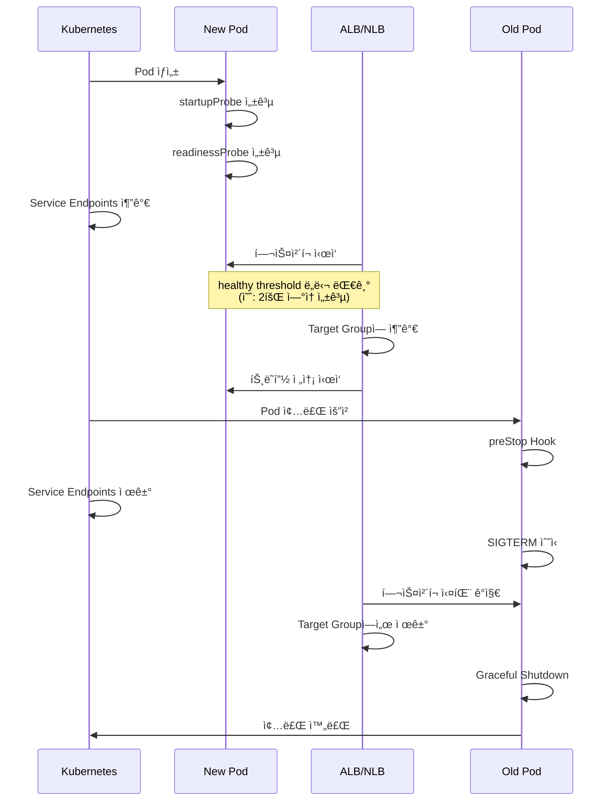

**ê¶Œì¥ ì„¤ì •:**

```yaml
apiVersion: v1
kind: Service
metadata:
  name: myapp
  annotations:
    # ALB í—¬ìŠ¤ì²´í¬ ì„¤ì •
    alb.ingress.kubernetes.io/healthcheck-path: /ready
    alb.ingress.kubernetes.io/healthcheck-interval-seconds: "10"
    alb.ingress.kubernetes.io/healthcheck-timeout-seconds: "5"
    alb.ingress.kubernetes.io/healthy-threshold-count: "2"
    alb.ingress.kubernetes.io/unhealthy-threshold-count: "2"
spec:
  type: NodePort
  ports:
  - port: 80
    targetPort: 8080
  selector:
    app: myapp
---
apiVersion: apps/v1
kind: Deployment
metadata:
  name: myapp
spec:
  replicas: 3
  template:
    spec:
      containers:
      - name: app
        image: myapp:v1
        ports:
        - containerPort: 8080
        readinessProbe:
          httpGet:
            path: /ready  # ALB와 ë™ì¼í•œ 경로
            port: 8080
          periodSeconds: 5  # ALB보다 ì§§ì€ ê°„ê²©
          failureThreshold: 2
          successThreshold: 1
      terminationGracePeriodSeconds: 60
```

#### Pod Readiness Gates (무중단 ë°°í¬ ë³´ì¥)

AWS Load Balancer Controller v2.5+는 Pod Readiness Gates를 지ì›í•˜ì—¬, Podì´ ALB/NLB 타겟으로 등ë¡ë˜ê³  헬스체í¬ë¥¼ 통과할 때까지 `Ready` ìƒíƒœ ì „í™˜ì„ ì§€ì—°ì‹œí‚µë‹ˆë‹¤.

**활성화 방법:**

```yaml
# Namespaceì— ë ˆì´ë¸” 추가로 ìë™ ì£¼ì… í™œì„±í™”
apiVersion: v1
kind: Namespace
metadata:
  name: production
  labels:
    elbv2.k8s.aws/pod-readiness-gate-inject: enabled
```

**ë™ì‘ 확ì¸:**

```bash
# Podì˜ Readiness Gates 확ì¸
kubectl get pod myapp-xyz -o yaml | grep -A 10 readinessGates

# 출력 예시:
# readinessGates:
# - conditionType: target-health.alb.ingress.k8s.aws/my-target-group-hash

# Pod Conditions 확ì¸
kubectl get pod myapp-xyz -o jsonpath='{.status.conditions}' | jq
```

**ì¥ì :**
- ë¡¤ë§ ì—…ë°ì´íŠ¸ ì‹œ Old Podì´ íƒ€ê²Ÿì—ì„œ 제거ë˜ê¸° 전까지 유지ë¨
- New Podì´ ALB í—¬ìŠ¤ì²´í¬ í†µê³¼ 후ì—만 트ë˜í”½ 수신
- 트ë˜í”½ 유실 없는 완전한 무중단 ë°°í¬

:::info ìƒì„¸ ì •ë³´
Pod Readiness Gatesì— ëŒ€í•œ ì세한 ë‚´ìš©ì€ [EKS 고가용성 아키í…처 ê°€ì´ë“œ](/docs/operations-observability/eks-resiliency-guide)ì˜ "Pod Readiness Gates" ì„¹ì…˜ì„ ì°¸ì¡°í•˜ì„¸ìš”.
:::

#### 2.6.4 Gateway API í—¬ìŠ¤ì²´í¬ í†µí•© (ALB Controller v2.14+)

AWS Load Balancer Controller v2.14+는 Kubernetes Gateway API v1.4와 네ì´í‹°ë¸Œ 통합하여, Ingress보다 í–¥ìƒëœ 경로별 í—¬ìŠ¤ì²´í¬ ë§¤í•‘ì„ ì œê³µí•©ë‹ˆë‹¤.

##### Gateway API vs Ingress í—¬ìŠ¤ì²´í¬ ë¹„êµ

| 구분 | Ingress | Gateway API |
|------|---------|-------------|
| **í—¬ìŠ¤ì²´í¬ ì„¤ì • 위치** | Service/Ingress annotation | HealthCheckPolicy CRD |
| **경로별 헬스체í¬** | ì œí•œì  (annotation 기반) | 네ì´í‹°ë¸Œ ì§€ì› (HTTPRoute/GRPCRoute별) |
| **L4/L7 프로토콜 지ì›** | HTTP/HTTPS만 | TCP/UDP/TLS/HTTP/GRPC ëª¨ë‘ ì§€ì› |
| **멀티 테넌트 ì—­í•  분리** | ë‹¨ì¼ Ingress 오브ì íŠ¸ | Gateway(ì¸í”„ë¼)/Route(앱) 분리 |
| **가중치 기반 카나리** | 어렵거나 불가능 | HTTPRoute 네ì´í‹°ë¸Œ ì§€ì› |

##### Gateway API 아키í…처와 헬스체í¬


##### L7 헬스체í¬: HTTPRoute/GRPCRoute with ALB

**HealthCheckPolicy CRD 예시:**

```yaml
apiVersion: gateway.networking.k8s.io/v1
kind: Gateway
metadata:
  name: prod-gateway
  namespace: production
spec:
  gatewayClassName: alb
  listeners:
  - name: http
    protocol: HTTP
    port: 80
---
apiVersion: gateway.networking.k8s.io/v1
kind: HTTPRoute
metadata:
  name: api-v1-route
  namespace: production
spec:
  parentRefs:
  - name: prod-gateway
  hostnames:
  - api.example.com
  rules:
  - matches:
    - path:
        type: PathPrefix
        value: /api/v1
    backendRefs:
    - name: api-v1-service
      port: 8080
---
# HealthCheckPolicy (AWS Load Balancer Controller v2.14+)
apiVersion: elbv2.k8s.aws/v1beta1
kind: HealthCheckPolicy
metadata:
  name: api-v1-healthcheck
  namespace: production
spec:
  targetGroupARN: arn:aws:elasticloadbalancing:region:account:targetgroup/name/id
  healthCheckConfig:
    protocol: HTTP
    path: /api/v1/healthz  # 경로별 헬스체í¬
    port: 8080
    intervalSeconds: 10
    timeoutSeconds: 5
    healthyThresholdCount: 2
    unhealthyThresholdCount: 2
    matcher:
      httpCode: "200-299"
```

**GRPCRoute í—¬ìŠ¤ì²´í¬ ì˜ˆì‹œ:**

```yaml
apiVersion: gateway.networking.k8s.io/v1alpha2
kind: GRPCRoute
metadata:
  name: grpc-service-route
  namespace: production
spec:
  parentRefs:
  - name: prod-gateway
  hostnames:
  - grpc.example.com
  rules:
  - matches:
    - method:
        service: myservice.v1.MyService
    backendRefs:
    - name: grpc-backend
      port: 9090
---
apiVersion: elbv2.k8s.aws/v1beta1
kind: HealthCheckPolicy
metadata:
  name: grpc-healthcheck
  namespace: production
spec:
  targetGroupARN: arn:aws:elasticloadbalancing:region:account:targetgroup/grpc/id
  healthCheckConfig:
    protocol: HTTP  # gRPC 헬스체í¬ëŠ” HTTP/2 기반
    path: /grpc.health.v1.Health/Check
    port: 9090
    intervalSeconds: 10
    timeoutSeconds: 5
    healthyThresholdCount: 2
    unhealthyThresholdCount: 2
    matcher:
      grpcCode: "0"  # gRPC OK status
```

##### L4 헬스체í¬: TCPRoute/UDPRoute with NLB

```yaml
apiVersion: gateway.networking.k8s.io/v1alpha2
kind: TCPRoute
metadata:
  name: tcp-service-route
  namespace: production
spec:
  parentRefs:
  - name: nlb-gateway
    sectionName: tcp-listener
  rules:
  - backendRefs:
    - name: tcp-backend
      port: 5432
---
apiVersion: elbv2.k8s.aws/v1beta1
kind: HealthCheckPolicy
metadata:
  name: tcp-healthcheck
  namespace: production
spec:
  targetGroupARN: arn:aws:elasticloadbalancing:region:account:targetgroup/tcp/id
  healthCheckConfig:
    protocol: TCP  # TCP 연결만 확ì¸
    port: 5432
    intervalSeconds: 30
    timeoutSeconds: 10
    healthyThresholdCount: 3
    unhealthyThresholdCount: 3
```

##### Gateway API Pod Readiness Gates

Gateway API는 Ingress와 ë™ì¼í•˜ê²Œ Pod Readiness Gates를 지ì›í•©ë‹ˆë‹¤:

```yaml
apiVersion: v1
kind: Namespace
metadata:
  name: production
  labels:
    elbv2.k8s.aws/pod-readiness-gate-inject: enabled
```

**ë™ì‘ 확ì¸:**

```bash
# Gateway ìƒíƒœ 확ì¸
kubectl get gateway prod-gateway -n production

# HTTPRoute ìƒíƒœ 확ì¸
kubectl get httproute api-v1-route -n production -o yaml

# Podì˜ Readiness Gates 확ì¸
kubectl get pod -n production -l app=api-v1 \
  -o jsonpath='{range .items[*]}{.metadata.name}{"\t"}{.status.conditions[?(@.type=="target-health.gateway.networking.k8s.io")].status}{"\n"}{end}'
```

##### Ingressì—ì„œ Gateway APIë¡œ 마ì´ê·¸ë ˆì´ì…˜ ì‹œ í—¬ìŠ¤ì²´í¬ ì „í™˜ ì²´í¬ë¦¬ìŠ¤íŠ¸

| 단계 | Ingress | Gateway API | í™•ì¸ í•­ëª© |
|------|---------|-------------|----------|
| 1. í—¬ìŠ¤ì²´í¬ ê²½ë¡œ 매핑 | Annotation 기반 | HealthCheckPolicy CRD | 경로별 ì •ì±… 분리 |
| 2. 프로토콜 설정 | HTTP/HTTPS만 | HTTP/HTTPS/GRPC/TCP/UDP | 프로토콜 íƒ€ì… í™•ì¸ |
| 3. Pod Readiness Gates | Namespace ë ˆì´ë¸” | Namespace ë ˆì´ë¸” (ë™ì¼) | 무중단 ë°°í¬ ë³´ì¥ |
| 4. í—¬ìŠ¤ì²´í¬ íƒ€ì´ë° | Service annotation | HealthCheckPolicy | interval/timeout ê²€ì¦ |
| 5. 멀티 경로 í—¬ìŠ¤ì²´í¬ | ë‹¨ì¼ ê²½ë¡œë§Œ | 경로별 ë…립 설정 | ê° ê²½ë¡œ ê²€ì¦ |

**마ì´ê·¸ë ˆì´ì…˜ 예시 (Ingress → Gateway API):**

```yaml
# Before (Ingress)
apiVersion: v1
kind: Service
metadata:
  name: myapp
  annotations:
    alb.ingress.kubernetes.io/healthcheck-path: /healthz
    alb.ingress.kubernetes.io/healthcheck-interval-seconds: "10"
---
apiVersion: networking.k8s.io/v1
kind: Ingress
metadata:
  name: myapp-ingress
spec:
  rules:
  - host: api.example.com
    http:
      paths:
      - path: /
        pathType: Prefix
        backend:
          service:
            name: myapp
            port:
              number: 8080
```

```yaml
# After (Gateway API)
apiVersion: gateway.networking.k8s.io/v1
kind: HTTPRoute
metadata:
  name: myapp-route
spec:
  parentRefs:
  - name: prod-gateway
  hostnames:
  - api.example.com
  rules:
  - matches:
    - path:
        type: PathPrefix
        value: /
    backendRefs:
    - name: myapp
      port: 8080
---
apiVersion: elbv2.k8s.aws/v1beta1
kind: HealthCheckPolicy
metadata:
  name: myapp-healthcheck
spec:
  targetGroupARN: <auto-discovered-or-explicit>
  healthCheckConfig:
    protocol: HTTP
    path: /healthz
    port: 8080
    intervalSeconds: 10
    timeoutSeconds: 5
    healthyThresholdCount: 2
    unhealthyThresholdCount: 2
```

:::tip Gateway API 마ì´ê·¸ë ˆì´ì…˜ ì „ëµ
- **ë‹¨ê³„ì  ë§ˆì´ê·¸ë ˆì´ì…˜**: ë™ì¼í•œ ALBì—ì„œ Ingress와 Gateway API를 ë™ì‹œì— 사용 가능 (리스너 분리)
- **카나리 ë°°í¬**: HTTPRouteì˜ ê°€ì¤‘ì¹˜ 기반 트ë˜í”½ 분할로 안전한 전환
- **롤백 계íš**: Ingress 오브ì íŠ¸ëŠ” 마ì´ê·¸ë ˆì´ì…˜ 완료 후 ì¼ì • 기간 유지
:::

:::info 참고 ì료
- [Kubernetes Gateway API v1.4 Release](https://kubernetes.io/blog/2025/11/06/gateway-api-v1-4/)
- [AWS Load Balancer Controller Gateway API ê°€ì´ë“œ](https://kubernetes-sigs.github.io/aws-load-balancer-controller/latest/guide/gateway/gateway/)
- [Gateway API 마ì´ê·¸ë ˆì´ì…˜ 실전 ê°€ì´ë“œ](https://medium.com/@gudiwada.chaithu/zero-downtime-migration-from-kubernetes-ingress-to-gateway-api-on-aws-eks-642f3432d394)
:::

### 2.7 2025-2026 EKS 신규 기능과 Probe 통합

AWS re:Invent 2025ì—ì„œ ë°œí‘œëœ EKSì˜ ìƒˆë¡œìš´ 관찰성 ë° ì œì–´ ê¸°ëŠ¥ì€ Probe 기반 헬스체í¬ë¥¼ ë”ìš± 강화합니다. ì´ ì„¹ì…˜ì—서는 최신 EKS 기능과 Probe를 통합하여 ë” ì •í™•í•˜ê³  ì„ ì œì ì¸ 헬스 모니터ë§ì„ 구현하는 ë°©ë²•ì„ ë‹¤ë£¹ë‹ˆë‹¤.

#### 2.7.1 Container Network Observabilityë¡œ Probe 연결성 ê²€ì¦

**개요:**

Container Network Observability(2025ë…„ 11ì›” 발표)는 Pod ê°„ ë„¤íŠ¸ì›Œí¬ í†µì‹  패턴, 지연 시간, 패킷 ì†ì‹¤ 등 세밀한 ë„¤íŠ¸ì›Œí¬ ë©”íŠ¸ë¦­ì„ ì œê³µí•©ë‹ˆë‹¤. Probe 실패가 ë„¤íŠ¸ì›Œí¬ ë¬¸ì œë¡œ ì¸í•œ 것ì¸ì§€, 애플리케ì´ì…˜ ìì²´ 문제ì¸ì§€ ëª…í™•íˆ êµ¬ë¶„í•  수 ìˆìŠµë‹ˆë‹¤.

**주요 기능:**
- Pod-to-Pod 통신 경로 ì‹œê°í™”
- ë„¤íŠ¸ì›Œí¬ ì§€ì—°(latency), 패킷 ì†ì‹¤(packet loss), ì¬ì „송률 모니터ë§
- 실시간 ë„¤íŠ¸ì›Œí¬ íŠ¸ë˜í”½ ì´ìƒ íƒì§€
- CloudWatch Container Insightsì™€ì˜ í†µí•©

**활성화 방법:**

```bash
# VPC CNIì—ì„œ ë„¤íŠ¸ì›Œí¬ ê´€ì°°ì„± 활성화
kubectl set env daemonset aws-node \
  -n kube-system \
  ENABLE_NETWORK_OBSERVABILITY=true

# ë˜ëŠ” ConfigMap으로 설정
kubectl apply -f - <<EOF
apiVersion: v1
kind: ConfigMap
metadata:
  name: amazon-vpc-cni
  namespace: kube-system
data:
  enable-network-observability: "true"
EOF
```

**Probe 연결성 ê²€ì¦ ì˜ˆì‹œ:**

```yaml
apiVersion: apps/v1
kind: Deployment
metadata:
  name: api-gateway
  annotations:
    # ë„¤íŠ¸ì›Œí¬ ê´€ì°°ì„± 메트릭 수집 활성화
    network-observability.amazonaws.com/enabled: "true"
spec:
  replicas: 3
  template:
    spec:
      containers:
      - name: gateway
        image: myapp/gateway:v2
        ports:
        - containerPort: 8080
        # Readiness Probe: 외부 DB ì—°ê²° 확ì¸
        readinessProbe:
          httpGet:
            path: /ready
            port: 8080
          periodSeconds: 5
          failureThreshold: 2
          timeoutSeconds: 3
        livenessProbe:
          httpGet:
            path: /healthz
            port: 8080
          periodSeconds: 10
          failureThreshold: 3
```

**CloudWatch Insights 쿼리 - Probe 실패와 ë„¤íŠ¸ì›Œí¬ ì§€ì—° ìƒê´€ 분ì„:**

```sql
-- Probe 실패 ì‹œì ì˜ ë„¤íŠ¸ì›Œí¬ ì§€ì—° 확ì¸
fields @timestamp, pod_name, probe_type, network_latency_ms, packet_loss_percent
| filter namespace = "production"
| filter probe_result = "failed"
| filter network_latency_ms > 100 or packet_loss_percent > 1
| sort @timestamp desc
| limit 100
```

**알림 설정 예시:**

```yaml
# CloudWatch Alarm: Probe 실패와 ë„¤íŠ¸ì›Œí¬ ì´ìƒ ë™ì‹œ ë°œìƒ
apiVersion: v1
kind: ConfigMap
metadata:
  name: probe-network-alert
  namespace: monitoring
data:
  alarm-config: |
    {
      "AlarmName": "ProbeFailureWithNetworkIssue",
      "MetricName": "ReadinessProbeFailure",
      "Namespace": "ContainerInsights",
      "Statistic": "Sum",
      "Period": 60,
      "EvaluationPeriods": 2,
      "Threshold": 3,
      "ComparisonOperator": "GreaterThanThreshold",
      "Dimensions": [
        {"Name": "ClusterName", "Value": "production-eks"},
        {"Name": "Namespace", "Value": "production"}
      ],
      "AlarmDescription": "Readiness Probe 실패 ì‹œ ë„¤íŠ¸ì›Œí¬ ì§€ì—° í™•ì¸ í•„ìš”"
    }
```

**진단 워í¬í”Œë¡œìš°:**

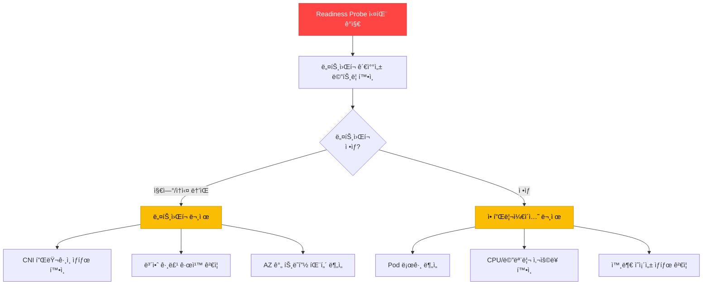

:::tip Pod-to-Pod 경로 ì‹œê°í™”
Container Network Observability는 CloudWatch Logs Insights와 통합ë˜ì–´ Probe ìš”ì²­ì˜ ì „ì²´ ë„¤íŠ¸ì›Œí¬ ê²½ë¡œë¥¼ 추ì í•  수 ìˆìŠµë‹ˆë‹¤. Readiness Probeê°€ 외부 ë°ì´í„°ë² ì´ìŠ¤ë¥¼ 확ì¸í•˜ëŠ” 경우, Pod → Service → Endpoint → DB Podì˜ ì „ì²´ 경로ì—ì„œ 병목 êµ¬ê°„ì„ ì‹ë³„í•  수 ìˆìŠµë‹ˆë‹¤.
:::

---

#### 2.7.2 CloudWatch Observability Operator + Control Plane 메트릭

**개요:**

CloudWatch Observability Operator(2025ë…„ 12ì›” 발표)는 EKS Control Plane ë©”íŠ¸ë¦­ì„ ìë™ìœ¼ë¡œ 수집하여, API Server 성능 저하가 Probe ì‘ë‹µì— ë¯¸ì¹˜ëŠ” ì˜í–¥ì„ ì‚¬ì „ì— ê°ì§€í•©ë‹ˆë‹¤.

**설치:**

```bash
# CloudWatch Observability Operator 설치
kubectl apply -f https://raw.githubusercontent.com/aws-observability/aws-cloudwatch-observability-operator/main/bundle.yaml

# EKS Control Plane 메트릭 수집 활성화
kubectl apply -f - <<EOF
apiVersion: cloudwatch.aws.amazon.com/v1alpha1
kind: EKSControlPlaneMetrics
metadata:
  name: production-control-plane
  namespace: amazon-cloudwatch
spec:
  clusterName: production-eks
  region: ap-northeast-2
  metricsCollectionInterval: 60s
  enabledMetrics:
    - apiserver_request_duration_seconds
    - apiserver_request_total
    - apiserver_storage_objects
    - etcd_request_duration_seconds
    - rest_client_requests_total
EOF
```

**주요 Control Plane 메트릭:**

| 메트릭 | 설명 | Probe 연관성 | ì„계값 예시 |
|--------|------|-------------|------------|
| `apiserver_request_duration_seconds` | API Server 요청 지연 시간 | Probe 요청 처리 ì†ë„ | p99 < 1ì´ˆ |
| `apiserver_request_total` (code=5xx) | API Server 5xx ì—러 수 | Probe 실패율 ìƒìŠ¹ | < 1% |
| `apiserver_storage_objects` | etcd ì €ì¥ ì˜¤ë¸Œì íŠ¸ 수 | í´ëŸ¬ìŠ¤í„° 규모 한계 | < 150,000 |
| `etcd_request_duration_seconds` | etcd ì½ê¸°/쓰기 지연 | Pod ìƒíƒœ ì—…ë°ì´íŠ¸ 지연 | p99 < 100ms |
| `rest_client_requests_total` (code=429) | API Rate Limiting ë°œìƒ | kubelet-apiserver 통신 제한 | < 10/min |

**Probe 타ì„아웃 예측 알림:**

```yaml
apiVersion: cloudwatch.amazonaws.com/v1alpha1
kind: Alarm
metadata:
  name: apiserver-slow-probe-risk
spec:
  alarmName: "EKS-APIServer-SlowProbeRisk"
  metrics:
    - id: m1
      metricStat:
        metric:
          namespace: AWS/EKS
          metricName: apiserver_request_duration_seconds
          dimensions:
            - name: ClusterName
              value: production-eks
            - name: verb
              value: GET
        period: 60
        stat: p99
    - id: e1
      expression: "IF(m1 > 0.5, 1, 0)"
      label: "API Server ì‘답 지연 > 500ms"
  evaluationPeriods: 2
  threshold: 1
  comparisonOperator: GreaterThanOrEqualToThreshold
  alarmDescription: "API Server 성능 저하로 ì¸í•œ Probe 타ì„아웃 위험"
  alarmActions:
    - arn:aws:sns:ap-northeast-2:123456789012:eks-ops-alerts
```

**대규모 í´ëŸ¬ìŠ¤í„°ì—ì„œì˜ Probe 성능 ë³´ì¥:**

```yaml
# 1000+ 노드 í´ëŸ¬ìŠ¤í„°ì˜ Probe 설정 최ì í™”
apiVersion: apps/v1
kind: Deployment
metadata:
  name: large-scale-api
spec:
  replicas: 100
  template:
    spec:
      containers:
      - name: api
        image: myapp/api:v1
        # Probe 타ì´ë° ì¡°ì •: API Server 부하 ê³ ë ¤
        startupProbe:
          httpGet:
            path: /healthz
            port: 8080
          failureThreshold: 30
          periodSeconds: 5  # 초기 ì‹œì‘ ì‹œê°„ 여유
        livenessProbe:
          httpGet:
            path: /healthz
            port: 8080
          periodSeconds: 15  # 대규모ì—서는 간격 ì¦ê°€
          failureThreshold: 3
          timeoutSeconds: 5
        readinessProbe:
          httpGet:
            path: /ready
            port: 8080
          periodSeconds: 10
          failureThreshold: 2
          timeoutSeconds: 3
```

**CloudWatch Dashboard - Control Plane & Probe ìƒê´€ 분ì„:**

```json
{
  "widgets": [
    {
      "type": "metric",
      "properties": {
        "title": "API Server 지연 vs Probe 실패율",
        "metrics": [
          ["AWS/EKS", "apiserver_request_duration_seconds", {"stat": "p99", "label": "API Server p99 지연"}],
          ["ContainerInsights", "ReadinessProbeFailure", {"stat": "Sum", "yAxis": "right"}]
        ],
        "period": 60,
        "region": "ap-northeast-2",
        "yAxis": {
          "left": {"label": "지연 시간 (초)", "min": 0},
          "right": {"label": "Probe 실패 수", "min": 0}
        }
      }
    }
  ]
}
```

:::warning 대규모 í´ëŸ¬ìŠ¤í„°ì˜ API Server 부하
1000ê°œ ì´ìƒì˜ 노드를 가진 í´ëŸ¬ìŠ¤í„°ì—서는 모든 kubeletì˜ Probe ìš”ì²­ì´ API Serverì— ì§‘ì¤‘ë  ìˆ˜ ìˆìŠµë‹ˆë‹¤. `periodSeconds`를 10~15초로 늘리고, `timeoutSeconds`를 5ì´ˆ ì´ìƒìœ¼ë¡œ 설정하여 API Server 부하를 분산시키세요. Provisioned Control Plane(Section 2.7.3)ì„ ì‚¬ìš©í•˜ë©´ ì´ ë¬¸ì œë¥¼ 근본ì ìœ¼ë¡œ í•´ê²°í•  수 ìˆìŠµë‹ˆë‹¤.
:::

---

#### 2.7.3 Provisioned Control Planeì—ì„œ Probe 성능 ë³´ì¥

**개요:**

Provisioned Control Plane(2025ë…„ 11ì›” 발표)ì€ ì‚¬ì „ í• ë‹¹ëœ ì œì–´ í”Œë ˆì¸ ìš©ëŸ‰ìœ¼ë¡œ 예측 가능한 고성능 Kubernetes ìš´ì˜ì„ ë³´ì¥í•©ë‹ˆë‹¤. 대규모 í´ëŸ¬ìŠ¤í„°ì—ì„œ Probe ìš”ì²­ì´ API Server 성능 ì €í•˜ì˜ ì˜í–¥ì„ 받지 ì•Šë„ë¡ í•©ë‹ˆë‹¤.

**티어별 성능 특성:**

| í‹°ì–´ | API ë™ì‹œì„± | Pod ìŠ¤ì¼€ì¤„ë§ ì†ë„ | 최대 노드 수 | Probe 처리 ë³´ì¥ | ì í•© 워í¬ë¡œë“œ |
|------|----------|---------------|------------|--------------|-------------|
| **XL** | ë†’ìŒ | ~500 Pods/min | 1,000 | 99.9% < 100ms | AI Training, HPC |
| **2XL** | 매우 ë†’ìŒ | ~1,000 Pods/min | 2,500 | 99.9% < 80ms | 대규모 배치 |
| **4XL** | ì´ˆê³ ì† | ~2,000 Pods/min | 5,000 | 99.9% < 50ms | 초대규모 ML |

**Standard vs Provisioned Control Plane:**

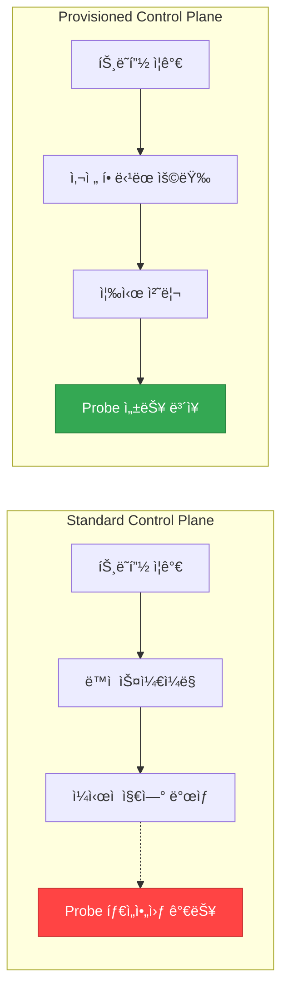

**Provisioned Control Plane ìƒì„±:**

```bash
# Provisioned Control Plane í´ëŸ¬ìŠ¤í„° ìƒì„± (AWS CLI)
aws eks create-cluster \
  --name production-provisioned \
  --region ap-northeast-2 \
  --kubernetes-version 1.32 \
  --role-arn arn:aws:iam::123456789012:role/eks-cluster-role \
  --resources-vpc-config subnetIds=subnet-xxx,subnet-yyy,securityGroupIds=sg-zzz \
  --control-plane-type PROVISIONED \
  --control-plane-tier XL
```

**대규모 Probe 최ì í™” 예시:**

```yaml
# AI/ML Training í´ëŸ¬ìŠ¤í„° (1000+ GPU 노드)
apiVersion: apps/v1
kind: Deployment
metadata:
  name: training-coordinator
  annotations:
    # Provisioned Control Planeì—ì„œ 최ì í™”ëœ Probe 설정
    eks.amazonaws.com/control-plane-tier: "XL"
spec:
  replicas: 50
  template:
    spec:
      containers:
      - name: coordinator
        image: ml-training/coordinator:v3
        resources:
          requests:
            cpu: 4
            memory: 16Gi
        # Provisioned Control Planeì—서는 ì§§ì€ ê°„ê²© 설정 가능
        startupProbe:
          httpGet:
            path: /healthz
            port: 9090
          failureThreshold: 30
          periodSeconds: 3  # 빠른 ê°ì§€
        livenessProbe:
          httpGet:
            path: /healthz
            port: 9090
          periodSeconds: 5  # Standard보다 짧게
          failureThreshold: 2
          timeoutSeconds: 2
        readinessProbe:
          httpGet:
            path: /ready
            port: 9090
          periodSeconds: 3
          failureThreshold: 1
          timeoutSeconds: 2
```

**사용 사례: AI/ML Training í´ëŸ¬ìŠ¤í„°**

- **문제**: 1,000ê°œì˜ GPU 노드ì—ì„œ ë™ì‹œì— 수백 ê°œì˜ Training Pod ì‹œì‘ ì‹œ, Standard Control Planeì—ì„œ API Server ì‘답 지연 ë°œìƒ
- **해결**: Provisioned Control Plane XL 티어 사용
- **ê²°ê³¼**:
  - Pod ìŠ¤ì¼€ì¤„ë§ ì‹œê°„ 70% 단축 (í‰ê·  45ì´ˆ → 13ì´ˆ)
  - Readiness Probe 타ì„아웃 99.8% ê°ì†Œ
  - Training Job ì‹œì‘ ì•ˆì •ì„± í–¥ìƒ

**Cost vs Performance 고려사항:**

```yaml
# Provisioned Control Plane 비용 최ì í™” ì „ëµ
# 1. í‰ìƒì‹œ: Standard Control Plane
# 2. Training 기간: Provisioned Control Plane XLë¡œ 업그레ì´ë“œ
# (현ì¬ëŠ” í´ëŸ¬ìŠ¤í„° ìƒì„± ì‹œ ì„ íƒ, 향후 ë™ì  변경 ì§€ì› ì˜ˆì •)
```

:::tip HPC ë° ëŒ€ê·œëª¨ 배치 워í¬ë¡œë“œ
Provisioned Control Planeì€ ì§§ì€ ì‹œê°„ ë‚´ì— ìˆ˜ì²œ ê°œì˜ Podì„ ë™ì‹œì— ì‹œì‘하는 워í¬ë¡œë“œì— 최ì í™”ë˜ì–´ ìˆìŠµë‹ˆë‹¤. AI/ML Training, 과학 시뮬레ì´ì…˜, 대규모 ë°ì´í„° 처리 등ì—ì„œ Probe ì„±ëŠ¥ì„ ë³´ì¥í•˜ì—¬ Job ì‹œì‘ ì‹œê°„ì„ ë‹¨ì¶•í•  수 ìˆìŠµë‹ˆë‹¤.
:::

---

#### 2.7.4 GuardDuty Extended Threat Detection 연계

**개요:**

GuardDuty Extended Threat Detection(EKS 지ì›: 2025ë…„ 6ì›”)ì€ Probe 엔드í¬ì¸íŠ¸ì˜ ë¹„ì •ìƒ ì ‘ê·¼ íŒ¨í„´ì„ íƒì§€í•˜ì—¬, ì•…ì˜ì ì¸ 워í¬ë¡œë“œê°€ 헬스체í¬ë¥¼ 우회하거나 ì¡°ì‘하는 ê³µê²©ì„ ì‹ë³„합니다.

**주요 기능:**
- EKS ê°ì‚¬ 로그 + ëŸ°íƒ€ì„ í–‰ë™ + 맬웨어 실행 + AWS API í™œë™ ìƒê´€ 분ì„
- AI/ML 기반 다단계 공격 시퀀스 íƒì§€
- Probe 엔드í¬ì¸íŠ¸ ë¹„ì •ìƒ ì ‘ê·¼ 패턴 ì‹ë³„
- í¬ë¦½í† ë§ˆì´ë‹ 등 ì•…ì˜ì  워í¬ë¡œë“œ ìë™ íƒì§€

**활성화:**

```bash
# GuardDuty Extended Threat Detection for EKS 활성화 (AWS CLI)
aws guardduty update-detector \
  --detector-id <detector-id> \
  --features '[
    {
      "Name": "EKS_AUDIT_LOGS",
      "Status": "ENABLED"
    },
    {
      "Name": "EKS_RUNTIME_MONITORING",
      "Status": "ENABLED",
      "AdditionalConfiguration": [
        {
          "Name": "EKS_ADDON_MANAGEMENT",
          "Status": "ENABLED"
        }
      ]
    }
  ]'
```

**Probe 엔드í¬ì¸íŠ¸ 보안 패턴:**

```yaml
apiVersion: apps/v1
kind: Deployment
metadata:
  name: secure-api
spec:
  replicas: 3
  template:
    spec:
      containers:
      - name: api
        image: myapp/secure-api:v2
        ports:
        - containerPort: 8080
        # í—¬ìŠ¤ì²´í¬ ì—”ë“œí¬ì¸íŠ¸
        livenessProbe:
          httpGet:
            path: /healthz
            port: 8080
            httpHeaders:
            - name: X-Health-Check-Token
              value: "SECRET_TOKEN_FROM_ENV"
          periodSeconds: 10
        readinessProbe:
          httpGet:
            path: /ready
            port: 8080
            httpHeaders:
            - name: X-Health-Check-Token
              value: "SECRET_TOKEN_FROM_ENV"
          periodSeconds: 5
        env:
        - name: HEALTH_CHECK_TOKEN
          valueFrom:
            secretKeyRef:
              name: api-secrets
              key: health-token
```

**GuardDuty íƒì§€ 시나리오:**

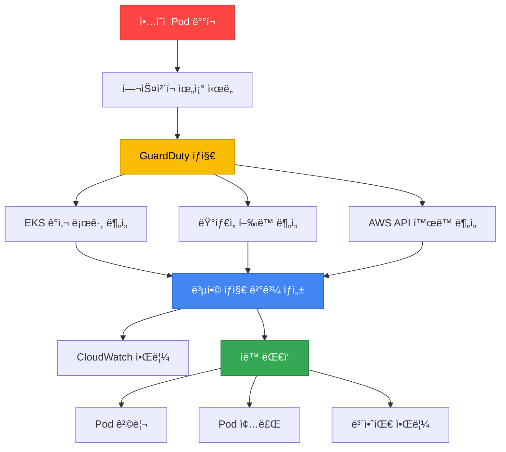

**실제 íƒì§€ 사례 - Cryptomining Campaign:**

2025ë…„ 11ì›” 2ì¼ë¶€í„° GuardDutyê°€ íƒì§€í•œ í¬ë¦½í† ë§ˆì´ë‹ 캠í˜ì¸ì—서는 공격ìê°€ 다ìŒê³¼ ê°™ì´ í—¬ìŠ¤ì²´í¬ë¥¼ 우회했습니다:

1. ì •ìƒ ì»¨í…Œì´ë„ˆ ì´ë¯¸ì§€ë¡œ 위ì¥
2. startupProbe 성공 후 악성 ë°”ì´ë„ˆë¦¬ 다운로드
3. livenessProbe는 ì •ìƒ ì‘답, 백그ë¼ìš´ë“œì—ì„œ 마ì´ë‹ 실행
4. GuardDutyê°€ 비정ìƒì ì¸ ë„¤íŠ¸ì›Œí¬ íŠ¸ë˜í”½ + CPU 사용 패턴 íƒì§€

**íƒì§€ 후 ìë™ ëŒ€ì‘:**

```yaml
# EventBridge Rule: GuardDuty Finding → Lambda → Pod 격리
apiVersion: v1
kind: ConfigMap
metadata:
  name: guardduty-response
  namespace: security
data:
  eventbridge-rule: |
    {
      "source": ["aws.guardduty"],
      "detail-type": ["GuardDuty Finding"],
      "detail": {
        "service": {
          "serviceName": ["EKS"]
        },
        "severity": [7, 8, 9]  # High, Critical
      }
    }
  lambda-action: |
    import boto3
    eks = boto3.client('eks')

    def isolate_pod(cluster_name, namespace, pod_name):
        # NetworkPolicy로 Pod 격리
        kubectl_command = f"""
        kubectl apply -f - <<EOF
        apiVersion: networking.k8s.io/v1
        kind: NetworkPolicy
        metadata:
          name: isolate-{pod_name}
          namespace: {namespace}
        spec:
          podSelector:
            matchLabels:
              pod: {pod_name}
          policyTypes:
          - Ingress
          - Egress
        EOF
        """
        # 실행 ë¡œì§...
```

**보안 ëª¨ë‹ˆí„°ë§ ëŒ€ì‹œë³´ë“œ:**

```yaml
# CloudWatch Dashboard: GuardDuty + Probe ìƒíƒœ
apiVersion: cloudwatch.amazonaws.com/v1alpha1
kind: Dashboard
metadata:
  name: security-probe-monitoring
spec:
  widgets:
    - type: metric
      title: "GuardDuty íƒì§€ vs Probe 실패"
      metrics:
        - namespace: AWS/GuardDuty
          metricName: FindingCount
          dimensions:
            - name: ClusterName
              value: production-eks
        - namespace: ContainerInsights
          metricName: ProbeFailure
          dimensions:
            - name: Namespace
              value: production
```

:::warning í—¬ìŠ¤ì²´í¬ ì—”ë“œí¬ì¸íŠ¸ 보안
Probe 엔드í¬ì¸íŠ¸(`/healthz`, `/ready`)는 ì¸ì¦ ì—†ì´ ê³µê°œë˜ëŠ” 경우가 ë§ì•„ 공격 í‘œë©´ì´ ë  ìˆ˜ ìˆìŠµë‹ˆë‹¤. GuardDuty Extended Threat Detectionì„ í™œì„±í™”í•˜ê³ , 가능하면 í—¬ìŠ¤ì²´í¬ ìš”ì²­ì— ê°„ë‹¨í•œ í† í° í—¤ë”를 추가하여 무단 ì ‘ê·¼ì„ ì œí•œí•˜ì„¸ìš”.
:::

**관련 문서:**
- [AWS Blog: GuardDuty Extended Threat Detection for EKS](https://aws.amazon.com/blogs/aws/amazon-guardduty-expands-extended-threat-detection-coverage-to-amazon-eks-clusters/)
- [AWS Blog: Cryptomining Campaign Detection](https://aws.amazon.com/blogs/security/cryptomining-campaign-targeting-amazon-ec2-and-amazon-ecs/)
- [EKS 보안 Best Practices](https://docs.aws.amazon.com/eks/latest/best-practices/security.html)

---

## 3. Graceful Shutdown 완벽 ê°€ì´ë“œ

Graceful Shutdownì€ Pod 종료 ì‹œ 진행 ì¤‘ì¸ ìš”ì²­ì„ ì•ˆì „í•˜ê²Œ 완료하고, 새로운 요청 ìˆ˜ì‹ ì„ ì¤‘ë‹¨í•˜ëŠ” 패턴ì…니다. 무중단 ë°°í¬ì™€ ë°ì´í„° ë¬´ê²°ì„±ì˜ í•µì‹¬ì…니다.

### 3.1 Pod 종료 시퀀스 ìƒì„¸

Kubernetesì—ì„œ Pod 종료는 ë‹¤ìŒ ìˆœì„œë¡œ 진행ë©ë‹ˆë‹¤.

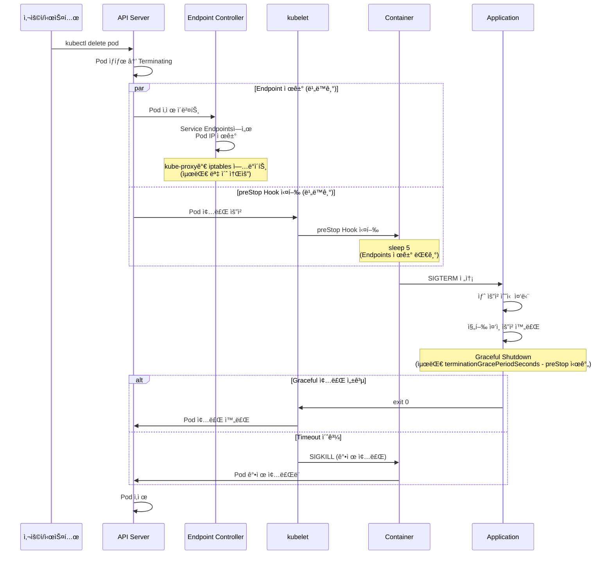

**타ì´ë° 세부 사항:**

1. **T+0ì´ˆ**: `kubectl delete pod` ë˜ëŠ” ë¡¤ë§ ì—…ë°ì´íŠ¸ë¡œ Pod ì‚­ì œ 요청
2. **T+0ì´ˆ**: API Serverê°€ Pod ìƒíƒœë¥¼ `Terminating`으로 변경
3. **T+0ì´ˆ**: **비ë™ê¸°ì ìœ¼ë¡œ** ë‘ ì‘ì—… ë™ì‹œ ì‹œì‘:
   - Endpoint Controllerê°€ Service Endpointsì—ì„œ Pod IP 제거
   - kubeletì´ preStop Hook 실행
4. **T+0~5ì´ˆ**: preStop Hookì˜ `sleep 5` 실행 (Endpoints 제거 대기)
5. **T+5ì´ˆ**: preStop Hookì´ `kill -TERM 1` 실행 → SIGTERM 전송
6. **T+5ì´ˆ**: 애플리케ì´ì…˜ì´ SIGTERM 수신, Graceful Shutdown ì‹œì‘
7. **T+5~60ì´ˆ**: 애플리케ì´ì…˜ì´ 진행 ì¤‘ì¸ ìš”ì²­ 완료, 정리 ì‘ì—… 수행
8. **T+60ì´ˆ**: `terminationGracePeriodSeconds` ë„달 ì‹œ SIGKILL (ê°•ì œ 종료)

:::tip preStop sleepì´ í•„ìš”í•œ ì´ìœ 
Endpoint 제거와 preStop Hook ì‹¤í–‰ì€ **비ë™ê¸°**ë¡œ ë°œìƒí•©ë‹ˆë‹¤. preStopì— 5ì´ˆ sleepì„ ì¶”ê°€í•˜ë©´, Endpoint Controller와 kube-proxyê°€ iptables를 ì—…ë°ì´íŠ¸í•˜ì—¬ 새로운 트ë˜í”½ì´ 종료 ì¤‘ì¸ Pod으로 유ì…ë˜ì§€ ì•Šë„ë¡ ë³´ì¥í•©ë‹ˆë‹¤. ì´ íŒ¨í„´ ì—†ì´ëŠ” 종료 ì¤‘ì¸ Pod으로 트ë˜í”½ì´ ê³„ì† ì „ì†¡ë˜ì–´ 502/503 ì—러가 ë°œìƒí•  수 ìˆìŠµë‹ˆë‹¤.
:::

### 3.2 언어별 SIGTERM 처리 패턴

#### Node.js (Express)

```javascript
const express = require('express');
const app = express();
const server = app.listen(8080);

// ìƒíƒœ 플ë˜ê·¸
let isShuttingDown = false;

// í—¬ìŠ¤ì²´í¬ ì—”ë“œí¬ì¸íŠ¸
app.get('/healthz', (req, res) => {
  res.status(200).json({ status: 'ok' });
});

app.get('/ready', (req, res) => {
  if (isShuttingDown) {
    return res.status(503).json({ status: 'shutting_down' });
  }
  res.status(200).json({ status: 'ready' });
});

// 비즈니스 ë¡œì§
app.get('/api/data', (req, res) => {
  if (isShuttingDown) {
    return res.status(503).send('Service Unavailable');
  }
  // 실제 ë¡œì§
  res.json({ data: 'example' });
});

// Graceful Shutdown 처리
function gracefulShutdown(signal) {
  console.log(`${signal} received, starting graceful shutdown`);
  isShuttingDown = true;

  // 새 연결 거부
  server.close(() => {
    console.log('HTTP server closed');

    // DB 연결 종료
    // db.close();

    // 프로세스 종료
    process.exit(0);
  });

  // Timeout 설정 (SIGKILL ì „ì— ì™„ë£Œ)
  setTimeout(() => {
    console.error('Graceful shutdown timeout, forcing exit');
    process.exit(1);
  }, 50000); // terminationGracePeriodSeconds - preStop 시간 - 여유 5초
}

// SIGTERM, SIGINT 처리
process.on('SIGTERM', () => gracefulShutdown('SIGTERM'));
process.on('SIGINT', () => gracefulShutdown('SIGINT'));

console.log('Server started on port 8080');
```

**Deployment 설정:**

```yaml
apiVersion: apps/v1
kind: Deployment
metadata:
  name: nodejs-app
spec:
  replicas: 3
  template:
    spec:
      containers:
      - name: app
        image: myapp/nodejs:v1
        ports:
        - containerPort: 8080
        readinessProbe:
          httpGet:
            path: /ready
            port: 8080
          periodSeconds: 5
        lifecycle:
          preStop:
            exec:
              command: ["/bin/sh", "-c", "sleep 5"]
      terminationGracePeriodSeconds: 60
```

#### Java/Spring Boot

Spring Boot 2.3+는 Graceful Shutdownì„ ë„¤ì´í‹°ë¸Œë¡œ 지ì›í•©ë‹ˆë‹¤.

**application.yml:**

```yaml
server:
  shutdown: graceful  # Graceful Shutdown 활성화

spring:
  lifecycle:
    timeout-per-shutdown-phase: 50s  # 최대 대기 시간
management:
  endpoints:
    web:
      exposure:
        include: health
  endpoint:
    health:
      probes:
        enabled: true
  health:
    livenessState:
      enabled: true
    readinessState:
      enabled: true
```

**커스텀 종료 ë¡œì§ (í•„ìš” ì‹œ):**

```java
import org.springframework.context.event.ContextClosedEvent;
import org.springframework.context.event.EventListener;
import org.springframework.stereotype.Component;

@Component
public class GracefulShutdownListener {

    @EventListener
    public void onApplicationEvent(ContextClosedEvent event) {
        System.out.println("Graceful shutdown initiated");

        // 커스텀 정리 ì‘ì—…
        // 예: 메시지 í 정리, 배치 ì‘ì—… 완료 대기
        try {
            // 최대 50초 대기
            cleanupResources();
        } catch (Exception e) {
            System.err.println("Cleanup error: " + e.getMessage());
        }
    }

    private void cleanupResources() throws InterruptedException {
        // 리소스 정리 ë¡œì§
        Thread.sleep(5000); // 예시: 5ì´ˆ 정리 ì‘ì—…
        System.out.println("Cleanup completed");
    }
}
```

**Deployment 설정:**

```yaml
apiVersion: apps/v1
kind: Deployment
metadata:
  name: spring-boot-app
spec:
  replicas: 3
  template:
    spec:
      containers:
      - name: app
        image: myapp/spring-boot:v2.7
        ports:
        - containerPort: 8080
        env:
        - name: JAVA_OPTS
          value: "-Xms1g -Xmx2g"
        readinessProbe:
          httpGet:
            path: /actuator/health/readiness
            port: 8080
          periodSeconds: 5
        lifecycle:
          preStop:
            exec:
              command: ["/bin/sh", "-c", "sleep 5"]
      terminationGracePeriodSeconds: 60
```

#### Go

```go
package main

import (
    "context"
    "fmt"
    "log"
    "net/http"
    "os"
    "os/signal"
    "syscall"
    "time"
)

var isShuttingDown = false

func main() {
    // HTTP 서버 설정
    mux := http.NewServeMux()

    mux.HandleFunc("/healthz", func(w http.ResponseWriter, r *http.Request) {
        w.WriteHeader(http.StatusOK)
        fmt.Fprintln(w, "ok")
    })

    mux.HandleFunc("/ready", func(w http.ResponseWriter, r *http.Request) {
        if isShuttingDown {
            w.WriteHeader(http.StatusServiceUnavailable)
            fmt.Fprintln(w, "shutting down")
            return
        }
        w.WriteHeader(http.StatusOK)
        fmt.Fprintln(w, "ready")
    })

    mux.HandleFunc("/api/data", func(w http.ResponseWriter, r *http.Request) {
        if isShuttingDown {
            w.WriteHeader(http.StatusServiceUnavailable)
            return
        }
        // 비즈니스 ë¡œì§
        fmt.Fprintln(w, `{"data":"example"}`)
    })

    server := &http.Server{
        Addr:    ":8080",
        Handler: mux,
    }

    // ë³„ë„ ê³ ë£¨í‹´ì—ì„œ 서버 ì‹œì‘
    go func() {
        log.Println("Server starting on :8080")
        if err := server.ListenAndServe(); err != nil && err != http.ErrServerClosed {
            log.Fatalf("Server error: %v", err)
        }
    }()

    // SIGTERM/SIGINT 대기
    quit := make(chan os.Signal, 1)
    signal.Notify(quit, syscall.SIGTERM, syscall.SIGINT)
    <-quit

    log.Println("Graceful shutdown initiated")
    isShuttingDown = true

    // Graceful shutdown with timeout
    ctx, cancel := context.WithTimeout(context.Background(), 50*time.Second)
    defer cancel()

    if err := server.Shutdown(ctx); err != nil {
        log.Fatalf("Server forced to shutdown: %v", err)
    }

    log.Println("Server exited gracefully")
}
```

**Deployment 설정:**

```yaml
apiVersion: apps/v1
kind: Deployment
metadata:
  name: go-app
spec:
  replicas: 3
  template:
    spec:
      containers:
      - name: app
        image: myapp/go-app:v1
        ports:
        - containerPort: 8080
        readinessProbe:
          httpGet:
            path: /ready
            port: 8080
          periodSeconds: 5
        lifecycle:
          preStop:
            exec:
              command: ["/bin/sh", "-c", "sleep 5"]
      terminationGracePeriodSeconds: 60
```

#### Python (Flask)

```python
from flask import Flask, jsonify
import signal
import sys
import time
import threading

app = Flask(__name__)
is_shutting_down = False

@app.route('/healthz')
def healthz():
    return jsonify({"status": "ok"}), 200

@app.route('/ready')
def ready():
    if is_shutting_down:
        return jsonify({"status": "shutting_down"}), 503
    return jsonify({"status": "ready"}), 200

@app.route('/api/data')
def api_data():
    if is_shutting_down:
        return jsonify({"error": "service unavailable"}), 503
    return jsonify({"data": "example"}), 200

def graceful_shutdown(signum, frame):
    global is_shutting_down
    print(f"Signal {signum} received, starting graceful shutdown")
    is_shutting_down = True

    # 정리 ì‘ì—… (예: DB ì—°ê²° 종료)
    # db.close()

    print("Graceful shutdown completed")
    sys.exit(0)

# SIGTERM 핸들러 등ë¡
signal.signal(signal.SIGTERM, graceful_shutdown)
signal.signal(signal.SIGINT, graceful_shutdown)

if __name__ == '__main__':
    app.run(host='0.0.0.0', port=8080)
```

**Deployment 설정:**

```yaml
apiVersion: apps/v1
kind: Deployment
metadata:
  name: python-app
spec:
  replicas: 3
  template:
    spec:
      containers:
      - name: app
        image: myapp/python-flask:v1
        ports:
        - containerPort: 8080
        readinessProbe:
          httpGet:
            path: /ready
            port: 8080
          periodSeconds: 5
        lifecycle:
          preStop:
            exec:
              command: ["/bin/sh", "-c", "sleep 5"]
      terminationGracePeriodSeconds: 60
```

### 3.3 Connection Draining 패턴

Connection Drainingì€ ì¢…ë£Œ ì‹œ 기존 ì—°ê²°ì„ ì•ˆì „í•˜ê²Œ 정리하는 패턴ì…니다.

#### HTTP Keep-Alive 연결 처리

```javascript
// Node.js Express with Connection Draining
const express = require('express');
const app = express();
const server = app.listen(8080);

let isShuttingDown = false;
const activeConnections = new Set();

// ì—°ê²° 추ì 
server.on('connection', (conn) => {
  activeConnections.add(conn);
  conn.on('close', () => {
    activeConnections.delete(conn);
  });
});

function gracefulShutdown(signal) {
  console.log(`${signal} received`);
  isShuttingDown = true;

  // 새 연결 거부
  server.close(() => {
    console.log('Server closed, no new connections');
  });

  // 기존 연결 종료
  console.log(`Closing ${activeConnections.size} active connections`);
  activeConnections.forEach((conn) => {
    conn.destroy(); // ê°•ì œ 종료 (ë˜ëŠ” conn.end()ë¡œ graceful)
  });

  // 정리 ì‘ì—… 후 종료
  setTimeout(() => {
    console.log('Graceful shutdown complete');
    process.exit(0);
  }, 5000);
}

process.on('SIGTERM', () => gracefulShutdown('SIGTERM'));
```

#### WebSocket 연결 정리

```javascript
// WebSocket graceful shutdown
const WebSocket = require('ws');
const wss = new WebSocket.Server({ port: 8080 });

const clients = new Set();

wss.on('connection', (ws) => {
  clients.add(ws);

  ws.on('close', () => {
    clients.delete(ws);
  });

  ws.on('message', (message) => {
    // 메시지 처리
  });
});

function gracefulShutdown() {
  console.log(`Closing ${clients.size} WebSocket connections`);

  clients.forEach((ws) => {
    // í´ë¼ì´ì–¸íŠ¸ì—게 종료 알림
    ws.send(JSON.stringify({ type: 'server_shutdown' }));
    ws.close(1001, 'Server shutting down');
  });

  wss.close(() => {
    console.log('WebSocket server closed');
    process.exit(0);
  });
}

process.on('SIGTERM', gracefulShutdown);
```

#### gRPC Graceful Shutdown

```go
package main

import (
    "context"
    "log"
    "net"
    "os"
    "os/signal"
    "syscall"
    "time"

    "google.golang.org/grpc"
    pb "myapp/proto"
)

type server struct {
    pb.UnimplementedMyServiceServer
}

func main() {
    lis, err := net.Listen("tcp", ":9090")
    if err != nil {
        log.Fatalf("Failed to listen: %v", err)
    }

    s := grpc.NewServer()
    pb.RegisterMyServiceServer(s, &server{})

    go func() {
        log.Println("gRPC server starting on :9090")
        if err := s.Serve(lis); err != nil {
            log.Fatalf("Failed to serve: %v", err)
        }
    }()

    // SIGTERM 대기
    quit := make(chan os.Signal, 1)
    signal.Notify(quit, syscall.SIGTERM, syscall.SIGINT)
    <-quit

    log.Println("Graceful shutdown initiated")

    // GracefulStop: 진행 ì¤‘ì¸ RPC 완료 대기
    done := make(chan struct{})
    go func() {
        s.GracefulStop()
        close(done)
    }()

    // Timeout 처리
    select {
    case <-done:
        log.Println("gRPC server stopped gracefully")
    case <-time.After(50 * time.Second):
        log.Println("Graceful stop timeout, forcing stop")
        s.Stop() // 강제 종료
    }
}
```

#### ë°ì´í„°ë² ì´ìŠ¤ ì—°ê²° í’€ 정리

```python
# Python with psycopg2 connection pool
import psycopg2
from psycopg2 import pool
import signal
import sys

# Connection pool
db_pool = psycopg2.pool.SimpleConnectionPool(
    minconn=1,
    maxconn=10,
    host='db.example.com',
    database='mydb',
    user='user',
    password='password'
)

def graceful_shutdown(signum, frame):
    print("Closing database connections...")

    # 모든 연결 종료
    db_pool.closeall()

    print("Database connections closed")
    sys.exit(0)

signal.signal(signal.SIGTERM, graceful_shutdown)

# 애플리케ì´ì…˜ ë¡œì§
def query_database():
    conn = db_pool.getconn()
    try:
        cur = conn.cursor()
        cur.execute("SELECT * FROM users")
        return cur.fetchall()
    finally:
        db_pool.putconn(conn)
```

### 3.4 Karpenter/Node Drainê³¼ì˜ ìƒí˜¸ì‘ìš©

Karpenterê°€ 노드를 통합(consolidation)하거나 Spot ì¸ìŠ¤í„´ìŠ¤ê°€ ì¢…ë£Œë  ë•Œ, ë…¸ë“œì˜ ëª¨ë“  Podì´ ì•ˆì „í•˜ê²Œ ì´ë™í•´ì•¼ 합니다.

#### Karpenter Disruptionê³¼ Graceful Shutdown

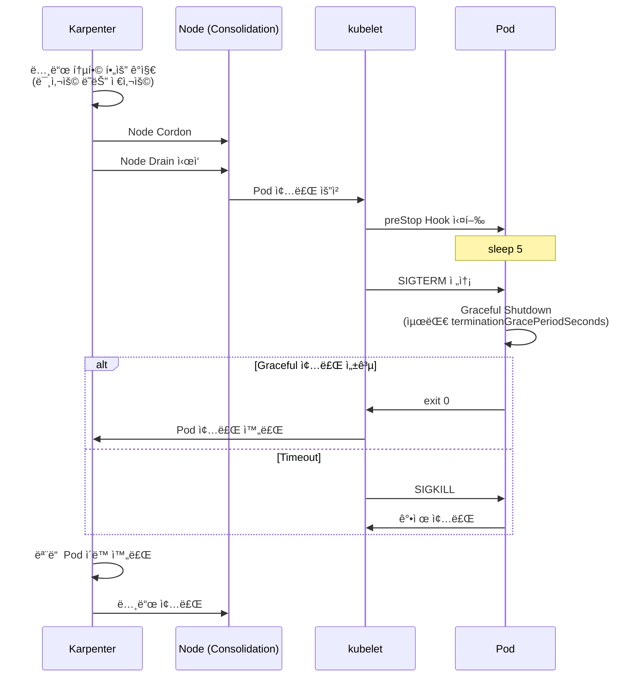

**Karpenter NodePool 설정:**

```yaml
apiVersion: karpenter.sh/v1
kind: NodePool
metadata:
  name: default
spec:
  disruption:
    consolidationPolicy: WhenEmptyOrUnderutilized
    consolidateAfter: 5m
    # Disruption budget: ë™ì‹œ 중단 노드 제한
    budgets:
    - nodes: "20%"
      schedule: "0 9-17 * * MON-FRI"  # 업무 시간 20%
    - nodes: "50%"
      schedule: "0 0-8,18-23 * * *"   # 비업무 시간 50%
```

:::warning PDB와 Karpenter ìƒí˜¸ì‘ìš©
PodDisruptionBudgetì´ ë„ˆë¬´ 엄격하면 (예: `minAvailable`ì´ replica 수와 ê°™ìŒ) Karpenterê°€ 노드를 drainí•  수 없습니다. PDB는 `minAvailable: replica - 1` ë˜ëŠ” `maxUnavailable: 1`ë¡œ 설정하여 최소 1ê°œ Podì€ ì´ë™ 가능하ë„ë¡ í•˜ì„¸ìš”.
:::

#### 3.4.3 ARC + Karpenter 통합 AZ 대피 패턴

**개요:**

AWS Application Recovery Controller(ARC)와 Karpenterì˜ í†µí•©(2025ë…„ 발표)ì€ Availability Zone(AZ) ì¥ì•  ì‹œ ìë™ìœ¼ë¡œ 워í¬ë¡œë“œë¥¼ 다른 AZë¡œ ì´ë™ì‹œí‚¤ëŠ” 고가용성 íŒ¨í„´ì„ ì œê³µí•©ë‹ˆë‹¤. ì´ë¥¼ 통해 AZ ì¥ì•  ë˜ëŠ” Gray Failure ìƒí™©ì—ì„œë„ Graceful Shutdownì„ ë³´ì¥í•˜ë©° 서비스 ì¤‘ë‹¨ì„ ìµœì†Œí™”í•  수 ìˆìŠµë‹ˆë‹¤.

**ARC Zonal Shiftë€:**

Zonal Shift는 특정 AZì—ì„œ ë°œìƒí•œ ì¥ì• ë‚˜ 성능 저하를 ê°ì§€í–ˆì„ ë•Œ, 해당 AZì˜ íŠ¸ë˜í”½ì„ ìë™ìœ¼ë¡œ 다른 ì •ìƒ AZë¡œ 전환하는 기능ì…니다. EKS와 통합 ì‹œ Podì˜ ì•ˆì „í•œ ì´ë™ê¹Œì§€ ìë™í™”ë©ë‹ˆë‹¤.

**아키í…처 구성 요소:**

| ì»´í¬ë„ŒíŠ¸ | ì—­í•  | ë™ì‘ |
|----------|------|------|
| **ARC Zonal Autoshift** | AZ ì¥ì•  ìë™ ê°ì§€ ë° íŠ¸ë˜í”½ 전환 ê²°ì • | CloudWatch Alarms 기반 ìë™ Shift |
| **Karpenter** | 새 AZì— ë…¸ë“œ í”„ë¡œë¹„ì €ë‹ | NodePool ì„¤ì •ì— ë”°ë¼ ì •ìƒ AZì— ë…¸ë“œ ìƒì„± |
| **AWS Load Balancer** | 트ë˜í”½ ë¼ìš°íŒ… 제어 | ì¥ì•  AZì˜ Target 제거 |
| **PodDisruptionBudget** | Pod ì´ë™ ì‹œ 가용성 ë³´ì¥ | 최소 가용 Pod 수 유지 |

**AZ 대피 시퀀스:**

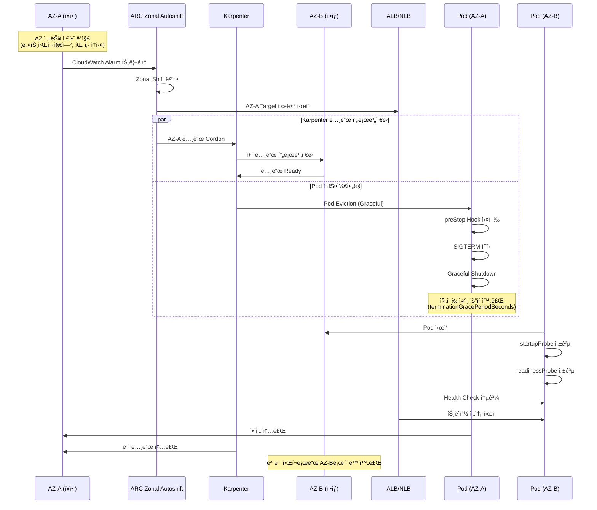

**설정 예시:**

**1. ARC Zonal Autoshift 활성화:**

```bash
# Load Balancerì— Zonal Autoshift 활성화
aws arc-zonal-shift create-autoshift-observer-notification-configuration \
  --resource-identifier arn:aws:elasticloadbalancing:ap-northeast-2:123456789012:loadbalancer/app/production-alb/1234567890abcdef

# Zonal Autoshift 설정
aws arc-zonal-shift update-zonal-autoshift-configuration \
  --resource-identifier arn:aws:elasticloadbalancing:ap-northeast-2:123456789012:loadbalancer/app/production-alb/1234567890abcdef \
  --zonal-autoshift-status ENABLED
```

**2. Karpenter NodePool - AZ ì¸ì‹ 설정:**

```yaml
apiVersion: karpenter.sh/v1
kind: NodePool
metadata:
  name: default
spec:
  disruption:
    consolidationPolicy: WhenEmptyOrUnderutilized
    consolidateAfter: 30s
    # AZ ì¥ì•  ì‹œ 빠른 대ì‘
    budgets:
    - nodes: "100%"
      reasons:
      - "Drifted"  # AZ Cordon ì‹œ 즉시 êµì²´
  template:
    spec:
      requirements:
      - key: "topology.kubernetes.io/zone"
        operator: In
        values:
        - ap-northeast-2a
        - ap-northeast-2b
        - ap-northeast-2c
      - key: karpenter.sh/capacity-type
        operator: In
        values:
        - on-demand  # AZ ì¥ì•  대ì‘ì€ On-Demand 권ì¥
      nodeClassRef:
        name: default
---
apiVersion: karpenter.k8s.aws/v1
kind: EC2NodeClass
metadata:
  name: default
spec:
  amiFamily: AL2023
  role: "KarpenterNodeRole-production"
  subnetSelectorTerms:
  - tags:
      karpenter.sh/discovery: "production-eks"
  securityGroupSelectorTerms:
  - tags:
      karpenter.sh/discovery: "production-eks"
  # AZ ì¥ì•  ì‹œ ìë™ ê°ì§€
  metadataOptions:
    httpTokens: required
    httpPutResponseHopLimit: 2
```

**3. Deployment with PDB - AZ 분산:**

```yaml
apiVersion: apps/v1
kind: Deployment
metadata:
  name: critical-api
spec:
  replicas: 6
  selector:
    matchLabels:
      app: critical-api
  template:
    metadata:
      labels:
        app: critical-api
    spec:
      # AZ 분산 ë³´ì¥
      topologySpreadConstraints:
      - maxSkew: 1
        topologyKey: topology.kubernetes.io/zone
        whenUnsatisfiable: DoNotSchedule
        labelSelector:
          matchLabels:
            app: critical-api
      # ë™ì¼ 노드 배치 방지
      affinity:
        podAntiAffinity:
          preferredDuringSchedulingIgnoredDuringExecution:
          - weight: 100
            podAffinityTerm:
              labelSelector:
                matchLabels:
                  app: critical-api
              topologyKey: kubernetes.io/hostname
      containers:
      - name: api
        image: myapp/critical-api:v3
        ports:
        - containerPort: 8080
        resources:
          requests:
            cpu: 500m
            memory: 1Gi
        readinessProbe:
          httpGet:
            path: /ready
            port: 8080
          periodSeconds: 5
          failureThreshold: 2
        livenessProbe:
          httpGet:
            path: /healthz
            port: 8080
          periodSeconds: 10
        lifecycle:
          preStop:
            exec:
              command:
              - /bin/sh
              - -c
              - sleep 5
      terminationGracePeriodSeconds: 60
---
apiVersion: policy/v1
kind: PodDisruptionBudget
metadata:
  name: critical-api-pdb
spec:
  minAvailable: 4  # 6ê°œ 중 최소 4ê°œ 유지 (AZ ì¥ì•  ì‹œ 2ê°œ AZì—ì„œ ìš´ì˜)
  selector:
    matchLabels:
      app: critical-api
```

**4. CloudWatch Alarm - AZ 성능 저하 ê°ì§€:**

```yaml
apiVersion: v1
kind: ConfigMap
metadata:
  name: az-health-monitoring
  namespace: monitoring
data:
  cloudwatch-alarm: |
    {
      "AlarmName": "AZ-A-NetworkLatency-High",
      "MetricName": "NetworkLatency",
      "Namespace": "AWS/EC2",
      "Statistic": "Average",
      "Period": 60,
      "EvaluationPeriods": 3,
      "Threshold": 100,
      "ComparisonOperator": "GreaterThanThreshold",
      "Dimensions": [
        {"Name": "AvailabilityZone", "Value": "ap-northeast-2a"}
      ],
      "AlarmDescription": "AZ-A ë„¤íŠ¸ì›Œí¬ ì§€ì—° ì¦ê°€ - Zonal Shift 트리거",
      "AlarmActions": [
        "arn:aws:arc-zonal-shift:ap-northeast-2:123456789012:autoshift-observer-notification"
      ]
    }
```

**Istio 서비스 메시 기반 End-to-End AZ 복구:**

Istio 서비스 메시와 통합하면 AZ 대피 ì‹œ ë”ìš± ì •êµí•œ 트ë˜í”½ 제어가 가능합니다:

```yaml
# Istio DestinationRule: AZ 기반 트ë˜í”½ ë¼ìš°íŒ…
apiVersion: networking.istio.io/v1beta1
kind: DestinationRule
metadata:
  name: critical-api-az-routing
spec:
  host: critical-api.production.svc.cluster.local
  trafficPolicy:
    loadBalancer:
      localityLbSetting:
        enabled: true
        distribute:
        - from: ap-northeast-2a/*
          to:
            "ap-northeast-2b/*": 50
            "ap-northeast-2c/*": 50
        - from: ap-northeast-2b/*
          to:
            "ap-northeast-2a/*": 50
            "ap-northeast-2c/*": 50
        - from: ap-northeast-2c/*
          to:
            "ap-northeast-2a/*": 50
            "ap-northeast-2b/*": 50
    outlierDetection:
      consecutiveErrors: 3
      interval: 10s
      baseEjectionTime: 30s
      maxEjectionPercent: 50
---
# VirtualService: AZ ì¥ì•  ì‹œ ìë™ ì¬ë¼ìš°íŒ…
apiVersion: networking.istio.io/v1beta1
kind: VirtualService
metadata:
  name: critical-api-failover
spec:
  hosts:
  - critical-api.production.svc.cluster.local
  http:
  - match:
    - sourceLabels:
        topology.kubernetes.io/zone: ap-northeast-2a
    route:
    - destination:
        host: critical-api.production.svc.cluster.local
        subset: az-b
      weight: 50
    - destination:
        host: critical-api.production.svc.cluster.local
        subset: az-c
      weight: 50
    timeout: 3s
    retries:
      attempts: 3
      perTryTimeout: 1s
```

**Gray Failure 처리 ì „ëµ:**

Gray Failure는 완전한 ì¥ì• ê°€ ì•„ë‹Œ 성능 저하 ìƒíƒœë¡œ, ê°ì§€ê°€ 어렵습니다. ARC + Karpenter + Istio 조합으로 대ì‘:

| Gray Failure ì¦ìƒ | ê°ì§€ 방법 | ìë™ ëŒ€ì‘ |
|------------------|----------|----------|
| ë„¤íŠ¸ì›Œí¬ ì§€ì—° ì¦ê°€ (50-200ms) | Container Network Observability | Istio Outlier Detection → 트ë˜í”½ 우회 |
| ê°„í—ì  íŒ¨í‚· ì†ì‹¤ (1-5%) | CloudWatch Network Metrics | ARC Zonal Shift 트리거 |
| ë””ìŠ¤í¬ I/O 저하 | EBS CloudWatch Metrics | Karpenter 노드 êµì²´ |
| API Server ì‘답 지연 | Control Plane Metrics | Provisioned Control Plane ìë™ ìŠ¤ì¼€ì¼ë§ |

**테스트 ë° ê²€ì¦:**

```bash
# AZ ì¥ì•  시뮬레ì´ì…˜ (Chaos Engineering)
kubectl apply -f - <<EOF
apiVersion: v1
kind: ConfigMap
metadata:
  name: az-failure-test
  namespace: chaos
data:
  experiment: |
    # 1. AZ-Aì˜ ëª¨ë“  ë…¸ë“œì— Taint 추가 (AZ ì¥ì•  시뮬레ì´ì…˜)
    kubectl taint nodes -l topology.kubernetes.io/zone=ap-northeast-2a \
      az-failure=true:NoSchedule

    # 2. Karpenterê°€ AZ-B, AZ-Cì— ìƒˆ 노드 ìƒì„± 확ì¸
    kubectl get nodes -l topology.kubernetes.io/zone=ap-northeast-2b,ap-northeast-2c

    # 3. Pod ì´ë™ 모니터ë§
    kubectl get pods -o wide --watch

    # 4. PDB 준수 í™•ì¸ (minAvailable 유지)
    kubectl get pdb critical-api-pdb

    # 5. Graceful Shutdown 로그 확ì¸
    kubectl logs <pod-name> --previous

    # 6. 복구 (Taint 제거)
    kubectl taint nodes -l topology.kubernetes.io/zone=ap-northeast-2a \
      az-failure-
EOF
```

**ëª¨ë‹ˆí„°ë§ ëŒ€ì‹œë³´ë“œ:**

```yaml
# Grafana Dashboard: AZ 헬스 ë° ëŒ€í”¼ ìƒíƒœ
apiVersion: v1
kind: ConfigMap
metadata:
  name: az-failover-dashboard
  namespace: monitoring
data:
  dashboard.json: |
    {
      "panels": [
        {
          "title": "AZ별 Pod 분í¬",
          "targets": [
            {
              "expr": "count(kube_pod_info) by (node, zone)"
            }
          ]
        },
        {
          "title": "AZ별 ë„¤íŠ¸ì›Œí¬ ì§€ì—°",
          "targets": [
            {
              "expr": "avg(container_network_latency_ms) by (availability_zone)"
            }
          ]
        },
        {
          "title": "Karpenter 노드 í”„ë¡œë¹„ì €ë‹ ì†ë„",
          "targets": [
            {
              "expr": "rate(karpenter_nodes_created_total[5m])"
            }
          ]
        },
        {
          "title": "Graceful Shutdown 성공률",
          "targets": [
            {
              "expr": "rate(pod_termination_graceful_total[5m]) / rate(pod_termination_total[5m])"
            }
          ]
        }
      ]
    }
```

**관련 ì료:**
- [AWS Blog: ARC + Karpenter 고가용성 통합](https://aws.amazon.com/blogs/containers/enhance-kubernetes-high-availability-with-amazon-application-recovery-controller-and-karpenter-integration/)
- [AWS Blog: Istio 기반 End-to-end AZ 복구](https://aws.amazon.com/blogs/containers/)
- [AWS re:Invent 2025: Supercharge your Karpenter](https://www.youtube.com/watch?v=kUQ4Q11F4iQ)

:::tip ìš´ì˜ Best Practice
AZ 대피는 ìë™í™”ë˜ì§€ë§Œ, 정기ì ì¸ Chaos Engineering 테스트로 ê²€ì¦í•˜ì„¸ìš”. 매 분기 1회 ì´ìƒ AZ ì¥ì•  시뮬레ì´ì…˜ì„ 수행하여 PDB, Karpenter, Graceful Shutdownì´ ì˜ˆìƒëŒ€ë¡œ ë™ì‘하는지 확ì¸í•©ë‹ˆë‹¤. íŠ¹íˆ `terminationGracePeriodSeconds`ê°€ 실제 Shutdown 시간보다 ì¶©ë¶„íˆ ê¸´ì§€ 프로ë•ì…˜ 환경ì—ì„œ 측정하세요.
:::

#### Spot ì¸ìŠ¤í„´ìŠ¤ 2분 경고 처리

AWS Spot ì¸ìŠ¤í„´ìŠ¤ëŠ” 종료 2분 ì „ì— ê²½ê³ ë¥¼ 보냅니다. ì´ë¥¼ 처리하여 Graceful Shutdownì„ ë³´ì¥í•©ë‹ˆë‹¤.

**AWS Node Termination Handler 설치:**

```bash
helm repo add eks https://aws.github.io/eks-charts
helm repo update

helm install aws-node-termination-handler \
  --namespace kube-system \
  eks/aws-node-termination-handler \
  --set enableSpotInterruptionDraining=true \
  --set enableScheduledEventDraining=true
```

**ë™ì‘ ë°©ì‹:**
1. Spot 종료 2분 경고 ê°ì§€
2. 노드를 즉시 Cordon (새 Pod ìŠ¤ì¼€ì¤„ë§ ì°¨ë‹¨)
3. ë…¸ë“œì˜ ëª¨ë“  Podì„ Drain
4. Podì˜ `terminationGracePeriodSeconds` ë‚´ì— Graceful Shutdown 완료

**ê¶Œì¥ terminationGracePeriodSeconds:**
- ì¼ë°˜ 웹 서비스: 30-60ì´ˆ
- ì¥ê¸° 실행 ì‘ì—… (배치, ML 추론): 90-120ì´ˆ
- 최대 2분 ì´ë‚´ë¡œ 설정 (Spot 경고 시간 ê³ ë ¤)

---

### 3.4.4 Node Readiness Controller — 노드 수준 Readiness 관리

#### 개요

Node Readiness Controller(NRC)는 2026ë…„ 2ì›” Kubernetes ê³µì‹ ë¸”ë¡œê·¸ì—ì„œ ë°œí‘œëœ ì•ŒíŒŒ 기능(v0.1.1)으로, 노드 ìˆ˜ì¤€ì˜ ì¸í”„ë¼ ì¤€ë¹„ ìƒíƒœë¥¼ ì„ ì–¸ì ìœ¼ë¡œ 관리하는 새로운 메커니즘ì…니다.

기존 Kubernetesì˜ ë…¸ë“œ `Ready` ì¡°ê±´ì€ ë‹¨ìˆœí•œ ë°”ì´ë„ˆë¦¬ ìƒíƒœ(Ready/NotReady)만 제공하여, CNI í”ŒëŸ¬ê·¸ì¸ ì´ˆê¸°í™”, GPU ë“œë¼ì´ë²„ 로딩, 스토리지 ë“œë¼ì´ë²„ 준비 등 ë³µì¡í•œ ì¸í”„ë¼ ì˜ì¡´ì„±ì„ ì •í™•íˆ ë°˜ì˜í•˜ì§€ 못했습니다. NRC는 ì´ëŸ¬í•œ 한계를 해결하기 위해 커스텀 readiness gate를 ì„ ì–¸ì ìœ¼ë¡œ ì •ì˜í•  수 ìˆëŠ” `NodeReadinessRule` CRD를 제공합니다.

**핵심 가치:**
- **세밀한 노드 ìƒíƒœ 제어**: ì¸í”„ë¼ ì»´í¬ë„ŒíŠ¸ë³„ 준비 ìƒíƒœë¥¼ ë…립ì ìœ¼ë¡œ 관리
- **ìë™í™”ëœ Taint 관리**: ì¡°ê±´ì´ ì¶©ì¡±ë˜ì§€ 않으면 ìë™ìœ¼ë¡œ NoSchedule Taint ì ìš©
- **유연한 ëª¨ë‹ˆí„°ë§ ëª¨ë“œ**: ë¶€íŠ¸ìŠ¤íŠ¸ë© ì „ìš©, ì§€ì† ëª¨ë‹ˆí„°ë§, Dry-run 모드 지ì›
- **ì„ íƒì  ì ìš©**: nodeSelectorë¡œ 특정 노드 그룹ì—만 규칙 ì ìš©

**API ì •ë³´:**
- API Group: `readiness.node.x-k8s.io/v1alpha1`
- Kind: `NodeReadinessRule`
- ê³µì‹ ë¬¸ì„œ: https://node-readiness-controller.sigs.k8s.io/

#### 핵심 기능

##### 1. Continuous 모드 - ì§€ì† ëª¨ë‹ˆí„°ë§

노드 ë¼ì´í”„사ì´í´ ì „ì²´ì—ì„œ ì§€ì •ëœ ì¡°ê±´ì„ ì§€ì†ì ìœ¼ë¡œ 모니터ë§í•©ë‹ˆë‹¤. ì¸í”„ë¼ ì»´í¬ë„ŒíŠ¸ê°€ ëŸ°íƒ€ì„ ì¤‘ 실패할 경우 (예: GPU ë“œë¼ì´ë²„ í¬ë˜ì‹œ) 즉시 Taint를 ì ìš©í•˜ì—¬ 새로운 Pod 스케줄ë§ì„ 차단합니다.

**사용 사례:**
- GPU ë“œë¼ì´ë²„ ìƒíƒœ 모니터ë§
- ë„¤íŠ¸ì›Œí¬ í”ŒëŸ¬ê·¸ì¸ ì§€ì† í—¬ìŠ¤ì²´í¬
- 스토리지 ë“œë¼ì´ë²„ 가용성 확ì¸

##### 2. Bootstrap-only 모드 - 초기화 전용

노드 초기화 단계ì—서만 ì¡°ê±´ì„ í™•ì¸í•˜ê³ , ì¡°ê±´ì´ ì¶©ì¡±ë˜ë©´ 모니터ë§ì„ 중단합니다. ë¶€íŠ¸ìŠ¤íŠ¸ë© ì´í›„ì—는 ì¡°ê±´ ë³€ê²½ì— ë°˜ì‘하지 않습니다.

**사용 사례:**
- CNI í”ŒëŸ¬ê·¸ì¸ ì´ˆê¸° 부트스트ë©
- 컨테ì´ë„ˆ ì´ë¯¸ì§€ 프리풀 완료 확ì¸
- 초기 보안 스캔 완료 대기

##### 3. Dry-run 모드 - 안전한 ê²€ì¦

실제 Taint ì ìš© ì—†ì´ ê·œì¹™ ë™ì‘ì„ ì‹œë®¬ë ˆì´ì…˜í•©ë‹ˆë‹¤. 프로ë•ì…˜ ë°°í¬ ì „ 규칙 ê²€ì¦ì— 유용합니다.

**사용 사례:**
- 새로운 NodeReadinessRule 테스트
- ì¡°ê±´ 변경 ì˜í–¥ 분ì„
- 디버깅 ë° ë¬¸ì œ 진단

##### 4. nodeSelector - 타겟 노드 ì„ íƒ

ë¼ë²¨ 기반으로 특정 노드 그룹ì—만 ê·œì¹™ì„ ì ìš©í•©ë‹ˆë‹¤. GPU 노드와 범용 ë…¸ë“œì— ì„œë¡œ 다른 readiness ê·œì¹™ì„ ì ìš©í•  수 ìˆìŠµë‹ˆë‹¤.

#### YAML 예시

##### CNI ë¶€íŠ¸ìŠ¤íŠ¸ë© - Bootstrap-only 모드

```yaml
apiVersion: readiness.node.x-k8s.io/v1alpha1
kind: NodeReadinessRule
metadata:
  name: network-readiness-rule
  namespace: kube-system
spec:
  # 확ì¸í•  노드 ì¡°ê±´
  conditions:
    - type: "cniplugin.example.net/NetworkReady"
      requiredStatus: "True"

  # ì¡°ê±´ 미충족 ì‹œ ì ìš©í•  Taint
  taint:
    key: "readiness.k8s.io/acme.com/network-unavailable"
    effect: "NoSchedule"
    value: "pending"

  # ë¶€íŠ¸ìŠ¤íŠ¸ë© ì™„ë£Œ 후 ëª¨ë‹ˆí„°ë§ ì¤‘ë‹¨
  enforcementMode: "bootstrap-only"

  # 워커 노드ì—만 ì ìš©
  nodeSelector:
    matchLabels:
      node-role.kubernetes.io/worker: ""
```

**ë™ì‘ í름:**
1. 새 노드가 í´ëŸ¬ìŠ¤í„°ì— ì¡°ì¸í•˜ë©´ NRCê°€ ìë™ìœ¼ë¡œ Taint ì ìš©
2. CNI 플러그ì¸ì´ 초기화 완료 후 `NetworkReady=True` ì¡°ê±´ 설정
3. NRCê°€ ì¡°ê±´ í™•ì¸ í›„ Taint 제거
4. Pod ìŠ¤ì¼€ì¤„ë§ ê°€ëŠ¥ (ì´í›„ CNI ìƒíƒœ 변경 무시)

##### GPU 노드 Continuous 모니터ë§

```yaml
apiVersion: readiness.node.x-k8s.io/v1alpha1
kind: NodeReadinessRule
metadata:
  name: gpu-driver-readiness
  namespace: kube-system
spec:
  conditions:
    - type: "nvidia.com/gpu-driver-ready"
      requiredStatus: "True"

  taint:
    key: "readiness.k8s.io/gpu-unavailable"
    effect: "NoSchedule"
    value: "driver-not-ready"

  # ëŸ°íƒ€ì„ ì¤‘ì—ë„ ì§€ì† ëª¨ë‹ˆí„°ë§
  enforcementMode: "continuous"

  # GPU 노드ì—만 ì ìš©
  nodeSelector:
    matchLabels:
      nvidia.com/gpu.present: "true"
```

**ë™ì‘ í름:**
1. GPU 노드 ì‹œì‘ ì‹œ Taint ìë™ ì ìš©
2. NVIDIA ë“œë¼ì´ë²„ ë°ëª¬ì´ GPU 초기화 완료 후 ì¡°ê±´ 설정
3. NRCê°€ Taint 제거, AI 워í¬ë¡œë“œ ìŠ¤ì¼€ì¤„ë§ ê°€ëŠ¥
4. **ëŸ°íƒ€ì„ ì¤‘ ë“œë¼ì´ë²„ í¬ë˜ì‹œ ë°œìƒ ì‹œ:**
   - ì¡°ê±´ì´ `False`ë¡œ 변경
   - NRCê°€ 즉시 Taint ì¬ì ìš©
   - 기존 Pod는 유지, ì‹ ê·œ Pod ìŠ¤ì¼€ì¤„ë§ ì°¨ë‹¨

##### EBS CSI ë“œë¼ì´ë²„ 준비 확ì¸

```yaml
apiVersion: readiness.node.x-k8s.io/v1alpha1
kind: NodeReadinessRule
metadata:
  name: ebs-csi-readiness
  namespace: kube-system
spec:
  conditions:
    - type: "ebs.csi.aws.com/VolumeAttachReady"
      requiredStatus: "True"

  taint:
    key: "readiness.k8s.io/storage-unavailable"
    effect: "NoSchedule"
    value: "csi-not-ready"

  enforcementMode: "bootstrap-only"

  # 스토리지 워í¬ë¡œë“œ ì „ìš© 노드ì—만 ì ìš©
  nodeSelector:
    matchLabels:
      workload-type: "stateful"
```

##### Dry-run 모드 - 테스트 규칙

```yaml
apiVersion: readiness.node.x-k8s.io/v1alpha1
kind: NodeReadinessRule
metadata:
  name: test-custom-condition
  namespace: kube-system
spec:
  conditions:
    - type: "example.com/CustomHealthCheck"
      requiredStatus: "True"

  taint:
    key: "readiness.k8s.io/test-condition"
    effect: "NoSchedule"
    value: "testing"

  # Taint ì ìš© ì—†ì´ ë™ì‘만 로깅
  enforcementMode: "dry-run"

  nodeSelector:
    matchLabels:
      environment: "staging"
```

#### EKS ì ìš© 시나리오

##### 1. VPC CNI 초기화 대기

**문제:**
노드가 í´ëŸ¬ìŠ¤í„°ì— ì¡°ì¸í•œ ì§í›„ VPC CNI 플러그ì¸ì´ ì™„ì „íˆ ì´ˆê¸°í™”ë˜ê¸° ì „ì— Podì´ ìŠ¤ì¼€ì¤„ë§ë˜ë©´ ë„¤íŠ¸ì›Œí¬ ì—°ê²° 실패가 ë°œìƒí•©ë‹ˆë‹¤.

**í•´ê²°:**
```yaml
apiVersion: readiness.node.x-k8s.io/v1alpha1
kind: NodeReadinessRule
metadata:
  name: vpc-cni-readiness
  namespace: kube-system
spec:
  conditions:
    - type: "vpc.amazonaws.com/CNIReady"
      requiredStatus: "True"
  taint:
    key: "node.eks.amazonaws.com/network-unavailable"
    effect: "NoSchedule"
    value: "vpc-cni-initializing"
  enforcementMode: "bootstrap-only"
```

**VPC CNI ë°ëª¬ì…‹ì—ì„œ ì¡°ê±´ 설정:**
```yaml
# aws-node DaemonSetì˜ init container
initContainers:
- name: set-node-condition
  image: bitnami/kubectl:latest
  command:
  - /bin/sh
  - -c
  - |
    # CNI 초기화 대기
    until [ -f /host/etc/cni/net.d/10-aws.conflist ]; do
      echo "Waiting for CNI config..."
      sleep 2
    done

    # Node Condition 설정
    kubectl patch node $NODE_NAME --type=json -p='[
      {
        "op": "add",
        "path": "/status/conditions/-",
        "value": {
          "type": "vpc.amazonaws.com/CNIReady",
          "status": "True",
          "lastTransitionTime": "'$(date -u +"%Y-%m-%dT%H:%M:%SZ")'",
          "reason": "CNIInitialized",
          "message": "VPC CNI is ready"
        }
      }
    ]'
  env:
  - name: NODE_NAME
    valueFrom:
      fieldRef:
        fieldPath: spec.nodeName
```

##### 2. GPU 노드 NVIDIA ë“œë¼ì´ë²„ 준비

**문제:**
GPU 워í¬ë¡œë“œê°€ NVIDIA ë“œë¼ì´ë²„ 로딩 완료 ì „ì— ìŠ¤ì¼€ì¤„ë§ë˜ë©´ CUDA 초기화 실패로 Podì´ CrashLoopBackOff ìƒíƒœì— 빠집니다.

**í•´ê²°:**
```yaml
apiVersion: readiness.node.x-k8s.io/v1alpha1
kind: NodeReadinessRule
metadata:
  name: nvidia-gpu-readiness
  namespace: kube-system
spec:
  conditions:
    - type: "nvidia.com/gpu-driver-ready"
      requiredStatus: "True"
    - type: "nvidia.com/gpu-device-plugin-ready"
      requiredStatus: "True"
  taint:
    key: "nvidia.com/gpu-not-ready"
    effect: "NoSchedule"
    value: "driver-loading"
  enforcementMode: "continuous"
  nodeSelector:
    matchLabels:
      node.kubernetes.io/instance-type: "g5.xlarge"
```

**NVIDIA Device Pluginì—ì„œ ì¡°ê±´ 설정:**
```go
// NVIDIA Device Pluginì˜ í—¬ìŠ¤ì²´í¬ ë¡œì§
func updateNodeCondition(nodeName string) error {
    // GPU ë“œë¼ì´ë²„ ìƒíƒœ 확ì¸
    version, err := nvml.SystemGetDriverVersion()
    if err != nil {
        return setCondition(nodeName, "nvidia.com/gpu-driver-ready", "False")
    }

    // Device Plugin ìƒíƒœ 확ì¸
    devices, err := nvml.DeviceGetCount()
    if err != nil || devices == 0 {
        return setCondition(nodeName, "nvidia.com/gpu-device-plugin-ready", "False")
    }

    // ëª¨ë‘ ì •ìƒì´ë©´ Trueë¡œ 설정
    setCondition(nodeName, "nvidia.com/gpu-driver-ready", "True")
    setCondition(nodeName, "nvidia.com/gpu-device-plugin-ready", "True")
    return nil
}
```

##### 3. Node Problem Detector 통합

**문제:**
노드ì—ì„œ 하드웨어 오류, ì»¤ë„ ë°ë“œë½, ë„¤íŠ¸ì›Œí¬ ë¬¸ì œ ë“±ì´ ë°œìƒí•´ë„ Kubernetesê°€ ìë™ìœ¼ë¡œ Pod 스케줄ë§ì„ 차단하지 않습니다.

**í•´ê²°:**
```yaml
apiVersion: readiness.node.x-k8s.io/v1alpha1
kind: NodeReadinessRule
metadata:
  name: node-problem-detector-readiness
  namespace: kube-system
spec:
  conditions:
    - type: "KernelDeadlock"
      requiredStatus: "False"  # Falseì´ì–´ì•¼ ì •ìƒ
    - type: "DiskPressure"
      requiredStatus: "False"
    - type: "NetworkUnavailable"
      requiredStatus: "False"
  taint:
    key: "node.kubernetes.io/problem-detected"
    effect: "NoSchedule"
    value: "true"
  enforcementMode: "continuous"
```

#### 워í¬í”Œë¡œìš° 다ì´ì–´ê·¸ë¨

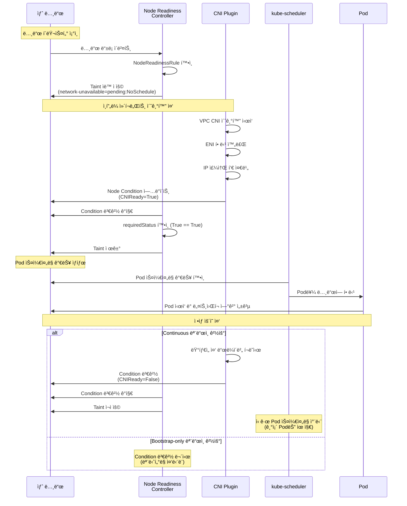

#### Pod Readinessì™€ì˜ ê´€ê³„

Kubernetesì˜ Readiness ë©”ì»¤ë‹ˆì¦˜ì€ ì´ì œ 3계층 구조로 완성ë©ë‹ˆë‹¤:

| 계층 | 메커니즘 | 범위 | 실패 ì‹œ ë™ì‘ | 사용 사례 |
|------|---------|------|-------------|----------|
| **1. 컨테ì´ë„ˆ** | Readiness Probe | 컨테ì´ë„ˆ 내부 í—¬ìŠ¤ì²´í¬ | Service Endpoint 제거 | 애플리케ì´ì…˜ 준비 ìƒíƒœ í™•ì¸ |
| **2. Pod** | Readiness Gate | Pod 수준 외부 ì¡°ê±´ | Service Endpoint 제거 | ALB/NLB í—¬ìŠ¤ì²´í¬ í†µí•© |
| **3. 노드** | Node Readiness Controller | 노드 ì¸í”„ë¼ ì¡°ê±´ | Pod ìŠ¤ì¼€ì¤„ë§ ì°¨ë‹¨ (Taint) | CNI, GPU, 스토리지 준비 í™•ì¸ |

**통합 시나리오 - 완전한 트ë˜í”½ 안전성:**

```yaml
apiVersion: apps/v1
kind: Deployment
metadata:
  name: critical-service
spec:
  replicas: 3
  template:
    spec:
      # 3계층 Readiness ì ìš©
      containers:
      - name: app
        image: myapp:v2
        # 1계층: 컨테ì´ë„ˆ Readiness Probe
        readinessProbe:
          httpGet:
            path: /ready
            port: 8080
          periodSeconds: 5
          failureThreshold: 2

      # 2계층: Pod Readiness Gate
      readinessGates:
      - conditionType: "target-health.alb.ingress.k8s.aws/production-alb"

      # 3계층: Node Readiness (NodeReadinessRuleë¡œ ìë™ ì²˜ë¦¬)
      # - ë…¸ë“œì˜ CNI, GPU, 스토리지 준비 ìƒíƒœ 확ì¸
      # - Taintê°€ 없는 노드ì—만 스케줄ë§ë¨
```

**트ë˜í”½ 수신 ì²´í¬ë¦¬ìŠ¤íŠ¸:**

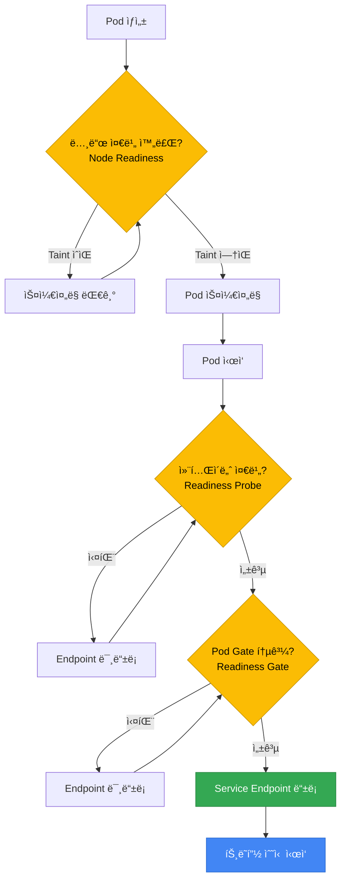

#### 설치 ë° ì„¤ì •

##### 1. Node Readiness Controller 설치

```bash
# Helm으로 설치
helm repo add node-readiness-controller https://node-readiness-controller.sigs.k8s.io
helm repo update

helm install node-readiness-controller \
  node-readiness-controller/node-readiness-controller \
  --namespace kube-system \
  --create-namespace

# ë˜ëŠ” Kustomizeë¡œ 설치
kubectl apply -k https://github.com/kubernetes-sigs/node-readiness-controller/config/default
```

##### 2. 설치 확ì¸

```bash
# Controller Pod ìƒíƒœ 확ì¸
kubectl get pods -n kube-system -l app=node-readiness-controller

# CRD 확ì¸
kubectl get crd nodereadinessrules.readiness.node.x-k8s.io

# 샘플 규칙 ì ìš©
kubectl apply -f https://raw.githubusercontent.com/kubernetes-sigs/node-readiness-controller/main/examples/basic-rule.yaml

# 규칙 ëª©ë¡ í™•ì¸
kubectl get nodereadinessrules -A
```

##### 3. 노드 ìƒíƒœ 확ì¸

```bash
# 특정 ë…¸ë“œì˜ Condition 확ì¸
kubectl get node <node-name> -o jsonpath='{.status.conditions}' | jq

# 특정 Condition만 í•„í„°ë§
kubectl get node <node-name> -o jsonpath='{.status.conditions[?(@.type=="CNIReady")]}' | jq

# 모든 ë…¸ë“œì˜ Taint 확ì¸
kubectl get nodes -o custom-columns=NAME:.metadata.name,TAINTS:.spec.taints
```

#### 디버깅 ë° íŠ¸ëŸ¬ë¸”ìŠˆíŒ…

##### Taintê°€ 제거ë˜ì§€ 않는 경우

```bash
# 1. NodeReadinessRule ì´ë²¤íŠ¸ 확ì¸
kubectl describe nodereadinessrule <rule-name> -n kube-system

# 2. 노드 Condition ìƒíƒœ 확ì¸
kubectl get node <node-name> -o yaml | grep -A 10 conditions

# 3. Controller 로그 확ì¸
kubectl logs -n kube-system -l app=node-readiness-controller --tail=100

# 4. 수ë™ìœ¼ë¡œ Condition 설정 (테스트용)
kubectl patch node <node-name> --type=json -p='[
  {
    "op": "add",
    "path": "/status/conditions/-",
    "value": {
      "type": "CNIReady",
      "status": "True",
      "lastTransitionTime": "'$(date -u +"%Y-%m-%dT%H:%M:%SZ")'",
      "reason": "ManualSet",
      "message": "Manually set for testing"
    }
  }
]'
```

##### Dry-run 모드로 규칙 테스트

```bash
# 기존 ê·œì¹™ì„ dry-run으로 변경
kubectl patch nodereadinessrule <rule-name> -n kube-system \
  --type=merge \
  -p '{"spec":{"enforcementMode":"dry-run"}}'

# Controller 로그ì—ì„œ ë™ì‘ 확ì¸
kubectl logs -n kube-system -l app=node-readiness-controller -f | grep "dry-run"

# 테스트 완료 후 ì›ë˜ 모드로 복구
kubectl patch nodereadinessrule <rule-name> -n kube-system \
  --type=merge \
  -p '{"spec":{"enforcementMode":"continuous"}}'
```

:::info 알파 기능 주ì˜ì‚¬í•­
Node Readiness Controller는 í˜„ì¬ v0.1.1 알파 버전ì…니다. 프로ë•ì…˜ í™˜ê²½ì— ì ìš©í•˜ê¸° ì „ì—:
- 스테ì´ì§• 환경ì—ì„œ 충분한 테스트 수행
- Dry-run 모드로 규칙 ë™ì‘ ê²€ì¦
- Controller 로그 ëª¨ë‹ˆí„°ë§ ì„¤ì •
- 문제 ë°œìƒ ì‹œ 수ë™ìœ¼ë¡œ Taint 제거할 수 ìˆëŠ” 절차 준비
:::

:::tip ìš´ì˜ Best Practice
1. **Bootstrap-only ìš°ì„  사용**: ëŒ€ë¶€ë¶„ì˜ ê²½ìš° ë¶€íŠ¸ìŠ¤íŠ¸ë© ì „ìš© 모드로 충분합니다. Continuous 모드는 ëŸ°íƒ€ì„ ì¤‘ ì¥ì• ê°€ 빈번한 ì»´í¬ë„ŒíŠ¸(GPU ë“œë¼ì´ë²„ 등)ì—만 사용하세요.
2. **nodeSelector ì ê·¹ 활용**: 모든 ë…¸ë“œì— ë™ì¼í•œ ê·œì¹™ì„ ì ìš©í•˜ì§€ ë§ê³ , 워í¬ë¡œë“œ 유형별로 세분화하세요.
3. **Node Problem Detector 통합**: NRC와 NPD를 함께 사용하면 하드웨어/OS 수준 문제까지 ìë™ ëŒ€ì‘í•  수 ìˆìŠµë‹ˆë‹¤.
4. **ëª¨ë‹ˆí„°ë§ ë° ì•Œë¦¼**: Taint ì ìš©/제거 ì´ë²¤íŠ¸ë¥¼ CloudWatch나 Prometheusë¡œ 수집하고, ì¥ì‹œê°„ Taintê°€ 유지ë˜ë©´ ì•Œë¦¼ì„ ë°›ë„ë¡ ì„¤ì •í•˜ì„¸ìš”.
:::

:::warning PDBì™€ì˜ ì¶©ëŒ ì£¼ì˜
Node Readiness Controllerê°€ Taint를 ì ìš©í•˜ë©´ 해당 ë…¸ë“œì˜ Podì´ ìƒˆë¡œ ìƒì„±ë˜ì§€ 않습니다. 만약 여러 노드ì—ì„œ ë™ì‹œì— Taintê°€ ì ìš©ë˜ê³  PodDisruptionBudgetì´ ì—„ê²©í•˜ê²Œ 설정ë˜ì–´ ìˆìœ¼ë©´, í´ëŸ¬ìŠ¤í„° ì „ì²´ì˜ ì›Œí¬ë¡œë“œ 배치가 ë¸”ë¡œí‚¹ë  ìˆ˜ ìˆìŠµë‹ˆë‹¤. 규칙 설계 ì‹œ PDB ì •ì±…ì„ í•¨ê»˜ 검토하세요.
:::

#### 참조 ì료

- **ê³µì‹ ë¬¸ì„œ**: [Node Readiness Controller](https://node-readiness-controller.sigs.k8s.io/)
- **Kubernetes Blog**: [Introducing Node Readiness Controller](https://kubernetes.io/blog/2026/02/03/introducing-node-readiness-controller/)
- **GitHub Repository**: [kubernetes-sigs/node-readiness-controller](https://github.com/kubernetes-sigs/node-readiness-controller)

---

### 3.5 Fargate Pod ë¼ì´í”„사ì´í´ 특수 고려사항

AWS Fargate는 서버리스 컴퓨팅 엔진으로, 노드 관리 ì—†ì´ Podì„ ì‹¤í–‰í•©ë‹ˆë‹¤. Fargate Podì€ EC2 기반 Podê³¼ 다른 ë¼ì´í”„사ì´í´ íŠ¹ì„±ì„ ê°€ì§‘ë‹ˆë‹¤.

#### Fargate vs EC2 vs Auto Mode 아키í…처 비êµ

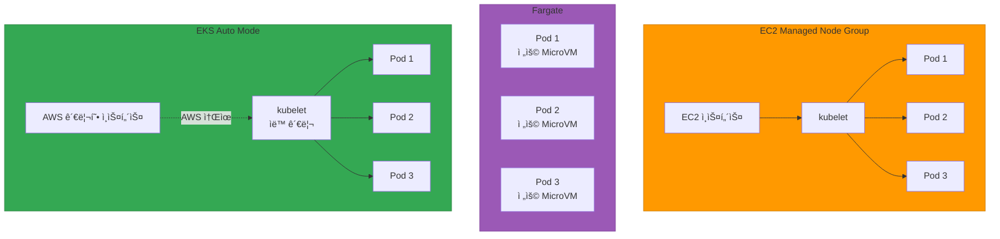

#### Fargate Pod OS 패치 ìë™ Eviction

Fargate는 보안 패치를 위해 주기ì ìœ¼ë¡œ Podì„ ìë™ evict합니다.

**ë™ì‘ ë°©ì‹:**

1. **패치 가용성 ê°ì§€**: AWSê°€ 새로운 OS/ëŸ°íƒ€ì„ íŒ¨ì¹˜ ê°ì§€
2. **Graceful Eviction**: Fargateê°€ Podì— SIGTERM 전송 → `terminationGracePeriodSeconds` ë‚´ì— ì¢…ë£Œ 대기
3. **강제 종료**: Timeout 시 SIGKILL 전송
4. **ì¬ìŠ¤ì¼€ì¤„ë§**: Kubernetesê°€ 새로운 Fargate Podì— ì¬ìŠ¤ì¼€ì¤„ë§ (ì—…ë°ì´íŠ¸ëœ ëŸ°íƒ€ì„ ì‚¬ìš©)

**주요 특징:**

- **예측 불가능한 타ì´ë°**: 사용ìê°€ 제어할 수 ì—†ìŒ (AWS 관리)
- **사전 알림 ì—†ìŒ**: EC2 Scheduled Events와 달리 사전 경고 ì—†ìŒ
- **ìë™ ì¬ì‹œì‘**: PodDisruptionBudget(PDB) 존중하지만, 보안 패치는 우선순위 높ìŒ

**ëŒ€ì‘ ì „ëµ:**

```yaml
apiVersion: apps/v1
kind: Deployment
metadata:
  name: fargate-app
  namespace: fargate-namespace
spec:
  replicas: 3  # 최소 3ê°œ ì´ìƒ ê¶Œì¥ (ìë™ eviction 대비)
  selector:
    matchLabels:
      app: fargate-app
  template:
    metadata:
      labels:
        app: fargate-app
    spec:
      containers:
      - name: app
        image: myapp:v1
        resources:
          requests:
            cpu: 500m
            memory: 1Gi
        startupProbe:
          httpGet:
            path: /healthz
            port: 8080
          failureThreshold: 10
          periodSeconds: 5
        readinessProbe:
          httpGet:
            path: /ready
            port: 8080
          periodSeconds: 5
        livenessProbe:
          httpGet:
            path: /healthz
            port: 8080
          periodSeconds: 10
        lifecycle:
          preStop:
            exec:
              command:
              - /bin/sh
              - -c
              - sleep 10  # Fargate eviction 대비 ë” ê¸´ 대기
      # Fargate는 ì‹œì‘ ì‹œê°„ì´ ê¸¸ 수 ìˆìŒ
      terminationGracePeriodSeconds: 60
---
# PDBë¡œ ë™ì‹œ eviction 제한 (최선 노력, 보안 패치 ì‹œ ë¬´ì‹œë  ìˆ˜ ìˆìŒ)
apiVersion: policy/v1
kind: PodDisruptionBudget
metadata:
  name: fargate-app-pdb
  namespace: fargate-namespace
spec:
  minAvailable: 2
  selector:
    matchLabels:
      app: fargate-app
```

:::warning Fargate PDB 제한
Fargate는 PDB를 **최선 노력(best effort)** 으로만 존중합니다. 중요한 보안 íŒ¨ì¹˜ì˜ ê²½ìš° PDB를 무시하고 ê°•ì œ evictioní•  수 ìˆìŠµë‹ˆë‹¤. ë”°ë¼ì„œ Fargate 환경ì—서는 **최소 3ê°œ ì´ìƒì˜ replica**ë¡œ ê³ ê°€ìš©ì„±ì„ ë³´ì¥í•´ì•¼ 합니다.
:::

#### Fargate Pod ì‹œì‘ ì‹œê°„ 특성

Fargate Podì€ EC2 기반 Pod보다 ì‹œì‘ ì‹œê°„ì´ ê¹ë‹ˆë‹¤.

| 단계 | EC2 (Managed Node) | Fargate | ì´ìœ  |
|------|-------------------|---------|------|
| **노드 프로비저ë‹** | 0ì´ˆ (ì´ë¯¸ 실행 중) | 20-40ì´ˆ | MicroVM ìƒì„± + ENI ì—°ê²° |
| **ì´ë¯¸ì§€ í’€** | 5-30ì´ˆ | 10-60ì´ˆ | ë ˆì´ì–´ ìºì‹œ ì—†ìŒ (첫 실행 ì‹œ) |
| **컨테ì´ë„ˆ ì‹œì‘** | 1-5ì´ˆ | 1-5ì´ˆ | ë™ì¼ |
| **ì´ ì‹œì‘ ì‹œê°„** | 6-35ì´ˆ | 31-105ì´ˆ | Fargate 오버헤드 추가 |

**Startup Probe 조정 예시:**

```yaml
# EC2 Pod
startupProbe:
  httpGet:
    path: /healthz
    port: 8080
  failureThreshold: 6   # 6 × 5초 = 30초
  periodSeconds: 5

# Fargate Pod (ë” ê¸´ 시간 허용)
startupProbe:
  httpGet:
    path: /healthz
    port: 8080
  failureThreshold: 20  # 20 × 5초 = 100초
  periodSeconds: 5
```

**ì´ë¯¸ì§€ í’€ 최ì í™” (Fargate):**

```yaml
apiVersion: v1
kind: Pod
metadata:
  name: fargate-pod
  namespace: fargate-namespace
spec:
  containers:
  - name: app
    image: 123456789012.dkr.ecr.us-east-1.amazonaws.com/myapp:v1
    imagePullPolicy: IfNotPresent  # Always 대신 IfNotPresent 권ì¥
  imagePullSecrets:
  - name: ecr-secret
```

:::tip Fargate ì´ë¯¸ì§€ ìºì‹±
Fargate는 ë™ì¼ ì´ë¯¸ì§€ë¥¼ 반복 사용 ì‹œ ë ˆì´ì–´ ìºì‹±ì„ 수행하지만, **Podì´ evictë˜ë©´ ìºì‹œê°€ 사ë¼ì§‘니다**. ECR Image Scanningê³¼ Image Replicationì„ í™œìš©í•˜ì—¬ ì´ë¯¸ì§€ í’€ ì‹œê°„ì„ ë‹¨ì¶•í•˜ì„¸ìš”.
:::

#### Fargate DaemonSet 미지ì›ìœ¼ë¡œ ì¸í•œ 사ì´ë“œì¹´ 패턴

Fargate는 DaemonSetì„ ì§€ì›í•˜ì§€ 않으므로, 노드 레벨 ì—ì´ì „트가 필요한 경우 사ì´ë“œì¹´ íŒ¨í„´ì„ ì‚¬ìš©í•´ì•¼ 합니다.

**EC2 vs Fargate ëª¨ë‹ˆí„°ë§ íŒ¨í„´ 비êµ:**

| 기능 | EC2 (DaemonSet) | Fargate (Sidecar) |
|------|----------------|-------------------|
| **로그 수집** | Fluent Bit DaemonSet | Fluent Bit Sidecar + FireLens |
| **메트릭 수집** | CloudWatch Agent DaemonSet | CloudWatch Agent Sidecar |
| **보안 스캔** | Falco DaemonSet | Fargate는 AWS 관리 (사용ì 제어 불가) |
| **ë„¤íŠ¸ì›Œí¬ ì •ì±…** | Calico/Cilium DaemonSet | NetworkPolicy ë¯¸ì§€ì› (Security Groups for Pods 사용) |

**Fargate 로깅 패턴 (FireLens):**

```yaml
apiVersion: apps/v1
kind: Deployment
metadata:
  name: fargate-logging-app
  namespace: fargate-namespace
spec:
  replicas: 2
  selector:
    matchLabels:
      app: logging-app
  template:
    metadata:
      labels:
        app: logging-app
    spec:
      containers:
      # ë©”ì¸ ì• í”Œë¦¬ì¼€ì´ì…˜
      - name: app
        image: myapp:v1
        ports:
        - containerPort: 8080
        resources:
          requests:
            cpu: 500m
            memory: 512Mi
      # FireLens 로그 ë¼ìš°í„° (사ì´ë“œì¹´)
      - name: log-router
        image: public.ecr.aws/aws-observability/aws-for-fluent-bit:stable
        resources:
          requests:
            cpu: 100m
            memory: 128Mi
          limits:
            cpu: 200m
            memory: 256Mi
        env:
        - name: FLB_LOG_LEVEL
          value: "info"
        firelensConfiguration:
          type: fluentbit
          options:
            enable-ecs-log-metadata: "true"
```

:::info CloudWatch Container Insights on Fargate
Fargate는 CloudWatch Container Insights를 **네ì´í‹°ë¸Œ 지ì›**하며, ë³„ë„ ì‚¬ì´ë“œì¹´ ì—†ì´ ë©”íŠ¸ë¦­ì„ ìë™ ìˆ˜ì§‘í•©ë‹ˆë‹¤. Fargate í”„ë¡œíŒŒì¼ ìƒì„± ì‹œ ìë™ìœ¼ë¡œ 활성화ë©ë‹ˆë‹¤.

```bash
aws eks create-fargate-profile \
  --cluster-name my-cluster \
  --fargate-profile-name my-profile \
  --pod-execution-role-arn arn:aws:iam::123456789012:role/FargatePodExecutionRole \
  --selectors namespace=fargate-namespace \
  --tags 'EnableContainerInsights=enabled'
```
:::

#### Fargate Graceful Shutdown 타ì´ë° 권ì¥ì‚¬í•­

Fargate는 ìë™ eviction ë° ê¸´ ì‹œì‘ ì‹œê°„ìœ¼ë¡œ ì¸í•´ EC2와 다른 Graceful Shutdown ì „ëµì´ 필요합니다.

| 시나리오 | terminationGracePeriodSeconds | preStop sleep | ì´ìœ  |
|---------|------------------------------|---------------|------|
| **EC2 Pod** | 30-60초 | 5초 | Endpoints 제거 대기 |
| **Fargate Pod (ì¼ë°˜)** | 60-90ì´ˆ | 10-15ì´ˆ | ë” ê¸´ ë„¤íŠ¸ì›Œí¬ ì „íŒŒ 시간 |
| **Fargate + ALB** | 90-120ì´ˆ | 15-20ì´ˆ | ALB deregistration delay ê³ ë ¤ |
| **Fargate ì¥ê¸° ì‘ì—…** | 120-300ì´ˆ | 10ì´ˆ | 배치 ì‘ì—… 완료 시간 확보 |

**Fargate 최ì í™” 예시:**

```yaml
apiVersion: apps/v1
kind: Deployment
metadata:
  name: fargate-web-app
  namespace: fargate-namespace
spec:
  replicas: 3
  selector:
    matchLabels:
      app: web-app
  template:
    metadata:
      labels:
        app: web-app
    spec:
      containers:
      - name: app
        image: myapp:v1
        ports:
        - containerPort: 8080
        readinessProbe:
          httpGet:
            path: /ready
            port: 8080
          periodSeconds: 5
          failureThreshold: 3
          successThreshold: 1
        lifecycle:
          preStop:
            exec:
              command:
              - /bin/sh
              - -c
              - |
                # Fargate는 ë„¤íŠ¸ì›Œí¬ ì „íŒŒê°€ ëŠë¦´ 수 ìˆìŒ
                echo "PreStop: Waiting for network propagation..."
                sleep 15

                # Readiness 실패 신호 (ì„ íƒ ì‚¬í•­)
                # curl -X POST http://localhost:8080/shutdown

                echo "PreStop: Graceful shutdown initiated"
      terminationGracePeriodSeconds: 90  # EC2는 60초, Fargate는 90초
```

#### Fargate vs EC2 vs Auto Mode 비êµí‘œ: Probe ê´€ì 

| 항목 | EC2 Managed Node Group | Fargate | EKS Auto Mode |
|------|------------------------|---------|---------------|
| **노드 관리** | 사용ì 관리 | AWS 관리 | AWS 관리 |
| **Pod ë°€ë„** | ë†’ìŒ (여러 Pod/노드) | ë‚®ìŒ (1 Pod = 1 MicroVM) | 중간 (AWS 최ì í™”) |
| **ì‹œì‘ ì‹œê°„** | 빠름 (5-35ì´ˆ) | ëŠë¦¼ (30-105ì´ˆ) | 빠름 (10-40ì´ˆ) |
| **Startup Probe failureThreshold** | 6-10 | 15-20 | 8-12 |
| **terminationGracePeriodSeconds** | 30-60ì´ˆ | 60-120ì´ˆ | 30-60ì´ˆ |
| **preStop sleep** | 5ì´ˆ | 10-15ì´ˆ | 5-10ì´ˆ |
| **ìë™ OS 패치** | ìˆ˜ë™ (AMI ì—…ë°ì´íŠ¸) | ìë™ (예측 불가 eviction) | ìë™ (계íšëœ eviction) |
| **PDB 지ì›** | 완전 ì§€ì› | ì œí•œì  (최선 노력) | 완전 ì§€ì› |
| **DaemonSet 지ì›** | 완전 ì§€ì› | ë¯¸ì§€ì› (사ì´ë“œì¹´ í•„ìš”) | ì œí•œì  (AWS 관리) |
| **비용 모ë¸** | ì¸ìŠ¤í„´ìŠ¤ë‹¹ (í•­ìƒ ì‹¤í–‰) | Pod당 (실행 시간만) | Pod당 (최ì í™”ë¨) |
| **Spot 지ì›** | 완전 ì§€ì› (Termination Handler) | Fargate Spot ì œí•œì  | ìë™ ìµœì í™” |
| **ë„¤íŠ¸ì›Œí¬ ì •ì±…** | Calico/Cilium ì§€ì› | Security Groups for Pods만 | AWS 관리 ë„¤íŠ¸ì›Œí¬ ì •ì±… |

**ì„ íƒ ê°€ì´ë“œ:**

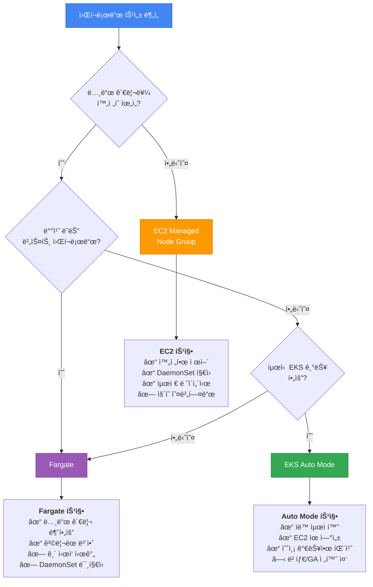

:::tip Fargate 프로ë•ì…˜ ì²´í¬ë¦¬ìŠ¤íŠ¸
- [ ] **Replica 수**: 최소 3ê°œ ì´ìƒ (ìë™ eviction 대비)
- [ ] **Startup Probe**: failureThreshold 15-20 설정 (긴 ì‹œì‘ ì‹œê°„ ê³ ë ¤)
- [ ] **terminationGracePeriodSeconds**: 60-120초 설정
- [ ] **preStop sleep**: 10-15ì´ˆ 설정 (ë„¤íŠ¸ì›Œí¬ ì „íŒŒ 대기)
- [ ] **PDB**: minAvailable 설정 (최선 노력ì´ì§€ë§Œ 권ì¥)
- [ ] **ì´ë¯¸ì§€ 최ì í™”**: ECR 사용, ë ˆì´ì–´ 최소화
- [ ] **로깅**: FireLens 사ì´ë“œì¹´ ë˜ëŠ” CloudWatch Logs 통합
- [ ] **모니터ë§**: CloudWatch Container Insights 활성화
- [ ] **비용 최ì í™”**: Fargate Spot 검토 (ì¥ì•  허용 워í¬ë¡œë“œ)
:::

:::info 참고 ì료
- [AWS Fargate on EKS ê³µì‹ ë¬¸ì„œ](https://docs.aws.amazon.com/eks/latest/userguide/fargate.html)
- [Fargate Pod 패칭 ë° ë³´ì•ˆ ì—…ë°ì´íŠ¸](https://docs.aws.amazon.com/eks/latest/userguide/fargate-pod-patching.html)
- [EKS Auto Mode 개요](https://aws.amazon.com/blogs/aws/streamline-kubernetes-cluster-management-with-new-amazon-eks-auto-mode/)
- [Fargate와 EC2 ë¹„êµ ê°€ì´ë“œ](https://aws.amazon.com/blogs/containers/)
:::

---

## 4. Init Container 모범 사례

Init Container는 ë©”ì¸ ì»¨í…Œì´ë„ˆê°€ ì‹œì‘ë˜ê¸° ì „ì— ì‹¤í–‰ë˜ì–´ 초기화 ì‘ì—…ì„ ìˆ˜í–‰í•©ë‹ˆë‹¤.

### 4.1 Init Container ë™ì‘ ì›ë¦¬

- Init Container는 **순차ì ìœ¼ë¡œ 실행**ë©ë‹ˆë‹¤ (ë™ì‹œ 실행 불가)
- ê° Init Container는 성공ì ìœ¼ë¡œ 종료해야 ë‹¤ìŒ Init Containerê°€ ì‹œì‘ë©ë‹ˆë‹¤
- 모든 Init Containerê°€ 완료ë˜ì–´ì•¼ ë©”ì¸ ì»¨í…Œì´ë„ˆê°€ ì‹œì‘ë©ë‹ˆë‹¤
- Init Container 실패 ì‹œ Podì˜ `restartPolicy`ì— ë”°ë¼ ì¬ì‹œì‘ë©ë‹ˆë‹¤

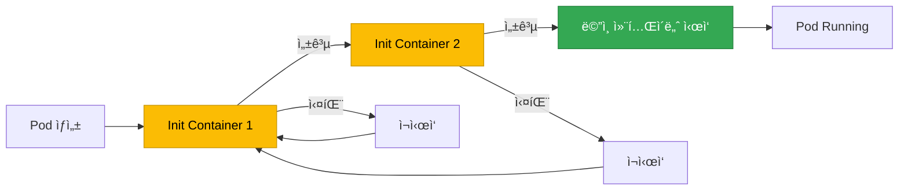

### 4.2 Init Container 사용 사례

#### 사례 1: ë°ì´í„°ë² ì´ìŠ¤ 마ì´ê·¸ë ˆì´ì…˜

```yaml
apiVersion: apps/v1
kind: Deployment
metadata:
  name: web-app
spec:
  replicas: 3
  template:
    spec:
      # Init Container: DB 마ì´ê·¸ë ˆì´ì…˜
      initContainers:
      - name: db-migration
        image: myapp/migrator:v1
        command:
        - /bin/sh
        - -c
        - |
          echo "Running database migrations..."
          /app/migrate up
          echo "Migrations completed"
        env:
        - name: DATABASE_URL
          valueFrom:
            secretKeyRef:
              name: db-secret
              key: url
      # ë©”ì¸ ì• í”Œë¦¬ì¼€ì´ì…˜
      containers:
      - name: app
        image: myapp/web-app:v1
        ports:
        - containerPort: 8080
```

#### 사례 2: 설정 íŒŒì¼ ìƒì„± (ConfigMap 변환)

```yaml
apiVersion: v1
kind: ConfigMap
metadata:
  name: app-config-template
data:
  config.template: |
    server:
      port: {{ PORT }}
      host: {{ HOST }}
    database:
      url: {{ DB_URL }}
---
apiVersion: apps/v1
kind: Deployment
metadata:
  name: app-with-config
spec:
  template:
    spec:
      initContainers:
      - name: config-generator
        image: busybox
        command:
        - /bin/sh
        - -c
        - |
          # 템플릿ì—ì„œ 실제 설정 íŒŒì¼ ìƒì„±
          sed -e "s/{{ PORT }}/$PORT/g" \
              -e "s/{{ HOST }}/$HOST/g" \
              -e "s|{{ DB_URL }}|$DB_URL|g" \
              /config-template/config.template > /config/config.yaml
          echo "Config file generated"
          cat /config/config.yaml
        env:
        - name: PORT
          value: "8080"
        - name: HOST
          value: "0.0.0.0"
        - name: DB_URL
          valueFrom:
            secretKeyRef:
              name: db-secret
              key: url
        volumeMounts:
        - name: config-template
          mountPath: /config-template
        - name: config
          mountPath: /config
      containers:
      - name: app
        image: myapp/app:v1
        volumeMounts:
        - name: config
          mountPath: /app/config
      volumes:
      - name: config-template
        configMap:
          name: app-config-template
      - name: config
        emptyDir: {}
```

#### 사례 3: ì¢…ì† ì„œë¹„ìŠ¤ 대기

```yaml
apiVersion: apps/v1
kind: Deployment
metadata:
  name: backend-api
spec:
  template:
    spec:
      initContainers:
      # Init Container 1: DB 연결 대기
      - name: wait-for-db
        image: busybox
        command:
        - /bin/sh
        - -c
        - |
          echo "Waiting for database..."
          until nc -z postgres-service 5432; do
            echo "Database not ready, sleeping..."
            sleep 2
          done
          echo "Database is ready"
      # Init Container 2: Redis 연결 대기
      - name: wait-for-redis
        image: busybox
        command:
        - /bin/sh
        - -c
        - |
          echo "Waiting for Redis..."
          until nc -z redis-service 6379; do
            echo "Redis not ready, sleeping..."
            sleep 2
          done
          echo "Redis is ready"
      containers:
      - name: api
        image: myapp/backend-api:v1
        ports:
        - containerPort: 8080
```

:::tip ë” ë‚˜ì€ ëŒ€ì•ˆ: readinessProbe
ì¢…ì† ì„œë¹„ìŠ¤ 대기는 Init Container보다 ë©”ì¸ ì»¨í…Œì´ë„ˆì˜ Readiness Probeì—ì„œ 처리하는 ê²ƒì´ ë” ìœ ì—°í•©ë‹ˆë‹¤. Init Container는 í•œ 번만 실행ë˜ë¯€ë¡œ, ë©”ì¸ ì»¨í…Œì´ë„ˆ 실행 중 ì¢…ì† ì„œë¹„ìŠ¤ê°€ 다운ë˜ë©´ 대ì‘í•  수 없습니다.
:::

#### 사례 4: 볼륨 권한 설정

```yaml
apiVersion: apps/v1
kind: Deployment
metadata:
  name: app-with-volume
spec:
  template:
    spec:
      securityContext:
        fsGroup: 1000
      initContainers:
      - name: volume-permissions
        image: busybox
        command:
        - /bin/sh
        - -c
        - |
          echo "Setting up volume permissions..."
          chown -R 1000:1000 /data
          chmod -R 755 /data
          echo "Permissions set"
        volumeMounts:
        - name: data
          mountPath: /data
        securityContext:
          runAsUser: 0  # root로 실행 (권한 변경 위해)
      containers:
      - name: app
        image: myapp/app:v1
        securityContext:
          runAsUser: 1000
          runAsNonRoot: true
        volumeMounts:
        - name: data
          mountPath: /app/data
      volumes:
      - name: data
        persistentVolumeClaim:
          claimName: app-data-pvc
```

### 4.3 Init Container vs Sidecar Container (Kubernetes 1.29+)

Kubernetes 1.29+ì—서는 Native Sidecar Containerê°€ ë„ì…ë˜ì—ˆìŠµë‹ˆë‹¤.

| 특성 | Init Container | Sidecar Container (1.29+) |
|------|---------------|---------------------------|
| **실행 타ì´ë°** | ë©”ì¸ ì»¨í…Œì´ë„ˆ ì „ 순차 실행 | ë©”ì¸ ì»¨í…Œì´ë„ˆì™€ ë™ì‹œ 실행 |
| **ë¼ì´í”„사ì´í´** | 완료 후 종료 | ë©”ì¸ ì»¨í…Œì´ë„ˆì™€ 함께 실행 |
| **ì¬ì‹œì‘** | 실패 ì‹œ Pod ì „ì²´ ì¬ì‹œì‘ | 개별 ì¬ì‹œì‘ 가능 |
| **사용 사례** | ì¼íšŒì„± 초기화 ì‘ì—… | 지ì†ì ì¸ ë³´ì¡° ì‘ì—… (로그 수집, 프ë¡ì‹œ) |

**Sidecar Container 예시 (K8s 1.29+):**

```yaml
apiVersion: v1
kind: Pod
metadata:
  name: app-with-sidecar
spec:
  initContainers:
  # Native sidecar: restartPolicy를 Always로 설정
  - name: log-collector
    image: fluent/fluent-bit:2.0
    restartPolicy: Always  # Sidecarë¡œ ë™ì‘
    volumeMounts:
    - name: logs
      mountPath: /var/log/app
  containers:
  - name: app
    image: myapp/app:v1
    volumeMounts:
    - name: logs
      mountPath: /app/logs
  volumes:
  - name: logs
    emptyDir: {}
```

---

## 5. Pod Lifecycle Hooks

Lifecycle Hooks는 컨테ì´ë„ˆì˜ 특정 ì‹œì ì— 커스텀 ë¡œì§ì„ 실행합니다.

### 5.1 PostStart Hook

PostStart Hookì€ ì»¨í…Œì´ë„ˆê°€ ìƒì„±ëœ ì§í›„ 실행ë©ë‹ˆë‹¤.

**특징:**
- 컨테ì´ë„ˆì˜ ENTRYPOINT와 **비ë™ê¸°ì ìœ¼ë¡œ** 실행ë©ë‹ˆë‹¤
- Hookì´ ì‹¤íŒ¨í•˜ë©´ 컨테ì´ë„ˆê°€ 종료ë©ë‹ˆë‹¤
- Hook 완료를 기다리지 ì•Šê³  컨테ì´ë„ˆëŠ” `Running` ìƒíƒœê°€ ë©ë‹ˆë‹¤

```yaml
apiVersion: v1
kind: Pod
metadata:
  name: poststart-example
spec:
  containers:
  - name: app
    image: nginx
    lifecycle:
      postStart:
        exec:
          command:
          - /bin/sh
          - -c
          - |
            echo "Container started at $(date)" >> /var/log/lifecycle.log
            # 초기 설정 ì‘ì—…
            mkdir -p /app/cache
            chown -R nginx:nginx /app/cache
```

**사용 사례:**
- 애플리케ì´ì…˜ ì‹œì‘ ì•Œë¦¼ 전송
- 초기 ìºì‹œ warming
- 메타ë°ì´í„° 기ë¡

:::warning PostStart Hook 주ì˜ì‚¬í•­
PostStart Hookì€ ì»¨í…Œì´ë„ˆ ì‹œì‘ê³¼ **비ë™ê¸°**ë¡œ 실행ë˜ë¯€ë¡œ, Hookì´ ì™„ë£Œë˜ê¸° ì „ì— ì• í”Œë¦¬ì¼€ì´ì…˜ì´ ì‹œì‘ë  ìˆ˜ ìˆìŠµë‹ˆë‹¤. 애플리케ì´ì…˜ì´ Hookì˜ ì‘ì—…ì— ì˜ì¡´í•œë‹¤ë©´ Init Container를 사용하세요.
:::

### 5.2 PreStop Hook

PreStop Hookì€ ì»¨í…Œì´ë„ˆ 종료 요청 ì‹œ, SIGTERM ì „ì— ì‹¤í–‰ë©ë‹ˆë‹¤.

**특징:**
- **ë™ê¸°ì ìœ¼ë¡œ** 실행ë©ë‹ˆë‹¤ (ì™„ë£Œë  ë•Œê¹Œì§€ SIGTERM 전송 지연)
- Hook 실행 ì‹œê°„ì€ `terminationGracePeriodSeconds`ì— í¬í•¨ë©ë‹ˆë‹¤
- Hook 실패 여부와 무관하게 SIGTERMì´ ì „ì†¡ë©ë‹ˆë‹¤

```yaml
apiVersion: v1
kind: Pod
metadata:
  name: prestop-example
spec:
  containers:
  - name: app
    image: myapp/app:v1
    lifecycle:
      preStop:
        exec:
          command:
          - /bin/sh
          - -c
          - |
            # 1. Endpoint 제거 대기
            sleep 5

            # 2. 애플리케ì´ì…˜ ìƒíƒœ ì €ì¥
            curl -X POST http://localhost:8080/admin/save-state

            # 3. 로그 플러시
            kill -USR1 1  # 애플리케ì´ì…˜ì— USR1 ì‹œê·¸ë„ ì „ì†¡

            # 4. SIGTERM 전송 (PID 1)
            kill -TERM 1
  terminationGracePeriodSeconds: 60
```

**사용 사례:**
- Endpoint 제거 대기 (무중단 ë°°í¬)
- 진행 ì¤‘ì¸ ì‘ì—… ìƒíƒœ ì €ì¥
- 외부 ì‹œìŠ¤í…œì— ì¢…ë£Œ 알림
- 로그 ë²„í¼ í”ŒëŸ¬ì‹œ

### 5.3 Hook 실행 메커니즘

Kubernetes는 ë‘ ê°€ì§€ ë°©ì‹ìœ¼ë¡œ Hookì„ ì‹¤í–‰í•©ë‹ˆë‹¤.

| 메커니즘 | 설명 | ì¥ì  | ë‹¨ì  |
|----------|------|------|------|
| **exec** | 컨테ì´ë„ˆ 내부ì—ì„œ 명령 실행 | 컨테ì´ë„ˆ 파ì¼ì‹œìŠ¤í…œ ì ‘ê·¼ 가능 | 오버헤드 ë†’ìŒ |
| **httpGet** | HTTP GET 요청 전송 | ë„¤íŠ¸ì›Œí¬ ê¸°ë°˜, 가벼움 | 애플리케ì´ì…˜ì´ HTTP ì§€ì› í•„ìš” |

#### exec Hook 예시

```yaml
lifecycle:
  preStop:
    exec:
      command:
      - /bin/bash
      - -c
      - |
        echo "Shutting down" | tee /var/log/shutdown.log
        /app/cleanup.sh
```

#### httpGet Hook 예시

```yaml
lifecycle:
  preStop:
    httpGet:
      path: /shutdown
      port: 8080
      scheme: HTTP
      httpHeaders:
      - name: X-Shutdown-Token
        value: "secret-token"
```

:::warning Hook ì‹¤í–‰ì€ "At Least Once"
Kubernetes는 Hookì´ ìµœì†Œ í•œ 번 실행ë˜ë„ë¡ ë³´ì¥í•˜ì§€ë§Œ, 여러 번 ì‹¤í–‰ë  ìˆ˜ ìˆìŠµë‹ˆë‹¤. Hook ë¡œì§ì€ **멱등성(idempotent)**ì„ ë³´ì¥í•´ì•¼ 합니다.
:::

---

## 6. 컨테ì´ë„ˆ ì´ë¯¸ì§€ 최ì í™”와 ì‹œì‘ ì‹œê°„

컨테ì´ë„ˆ ì´ë¯¸ì§€ í¬ê¸°ì™€ 구조는 Pod ì‹œì‘ ì‹œê°„ì— ì§ì ‘ì ì¸ ì˜í–¥ì„ 미칩니다.

### 6.1 멀티스테ì´ì§€ 빌드

멀티스테ì´ì§€ 빌드를 사용하여 최종 ì´ë¯¸ì§€ í¬ê¸°ë¥¼ 최소화합니다.

#### Go 애플리케ì´ì…˜

```dockerfile
# 빌드 스테ì´ì§€
FROM golang:1.22-alpine AS builder

WORKDIR /app
COPY go.mod go.sum ./
RUN go mod download

COPY . .
RUN CGO_ENABLED=0 GOOS=linux go build -a -installsuffix cgo -ldflags="-s -w" -o main .

# 실행 스테ì´ì§€ (scratch: 5MB ì´í•˜)
FROM scratch

COPY --from=builder /app/main /main
COPY --from=builder /etc/ssl/certs/ca-certificates.crt /etc/ssl/certs/

USER 65534:65534
ENTRYPOINT ["/main"]
```

**ê²°ê³¼:**
- 빌드 ì´ë¯¸ì§€: 300MB+
- 최종 ì´ë¯¸ì§€: 5-10MB
- ì‹œì‘ ì‹œê°„: 1ì´ˆ 미만

#### Node.js 애플리케ì´ì…˜

```dockerfile
# 빌드 스테ì´ì§€
FROM node:20-alpine AS builder

WORKDIR /app
COPY package*.json ./
RUN npm ci --only=production

COPY . .

# 실행 스테ì´ì§€
FROM node:20-alpine

# 보안: non-root 사용ì
RUN addgroup -g 1001 -S nodejs && \
    adduser -S nodejs -u 1001

WORKDIR /app

# 프로ë•ì…˜ ì˜ì¡´ì„±ë§Œ 복사
COPY --from=builder --chown=nodejs:nodejs /app/node_modules ./node_modules
COPY --chown=nodejs:nodejs . .

USER nodejs

EXPOSE 8080
CMD ["node", "server.js"]
```

**최ì í™” íŒ:**
- `npm ci` 사용 (npm install보다 빠르고 안정ì )
- `--only=production`으로 devDependencies 제외
- ë ˆì´ì–´ ìºì‹± 활용 (COPY package*.json 먼저)

#### Java/Spring Boot 애플리케ì´ì…˜

```dockerfile
# 빌드 스테ì´ì§€
FROM maven:3.9-eclipse-temurin-21 AS builder

WORKDIR /app
COPY pom.xml .
RUN mvn dependency:go-offline

COPY src ./src
RUN mvn clean package -DskipTests

# 실행 스테ì´ì§€
FROM eclipse-temurin:21-jre-alpine

RUN addgroup -S spring && adduser -S spring -G spring
USER spring:spring

WORKDIR /app
COPY --from=builder /app/target/*.jar app.jar

EXPOSE 8080
ENTRYPOINT ["java", "-Xms512m", "-Xmx1g", "-jar", "app.jar"]
```

### 6.2 ì´ë¯¸ì§€ 프리풀 ì „ëµ

EKSì—ì„œ ì´ë¯¸ì§€ 프리풀(pre-pull)ì„ í™œìš©í•˜ì—¬ Pod ì‹œì‘ ì‹œê°„ì„ ë‹¨ì¶•í•©ë‹ˆë‹¤.

#### Karpenter ì´ë¯¸ì§€ 프리풀

```yaml
apiVersion: karpenter.k8s.aws/v1beta1
kind: EC2NodeClass
metadata:
  name: default
spec:
  amiFamily: AL2
  userData: |
    #!/bin/bash
    # ì주 사용하는 ì´ë¯¸ì§€ 프리풀
    docker pull myapp/backend:v2.1.0
    docker pull myapp/frontend:v1.5.3
    docker pull redis:7-alpine
    docker pull postgres:16-alpine
```

#### DaemonSet으로 ì´ë¯¸ì§€ 프리풀

```yaml
apiVersion: apps/v1
kind: DaemonSet
metadata:
  name: image-prepuller
  namespace: kube-system
spec:
  selector:
    matchLabels:
      app: image-prepuller
  template:
    metadata:
      labels:
        app: image-prepuller
    spec:
      initContainers:
      # 프리풀할 ì´ë¯¸ì§€ë§ˆë‹¤ init container 추가
      - name: prepull-backend
        image: myapp/backend:v2.1.0
        command: ["sh", "-c", "echo 'Image pulled'"]
      - name: prepull-frontend
        image: myapp/frontend:v1.5.3
        command: ["sh", "-c", "echo 'Image pulled'"]
      containers:
      - name: pause
        image: registry.k8s.io/pause:3.9
        resources:
          requests:
            cpu: 1m
            memory: 1Mi
```

### 6.3 distroless와 scratch ì´ë¯¸ì§€

Googleì˜ distroless ì´ë¯¸ì§€ëŠ” 애플리케ì´ì…˜ ì‹¤í–‰ì— í•„ìš”í•œ ìµœì†Œí•œì˜ íŒŒì¼ë§Œ í¬í•¨í•©ë‹ˆë‹¤.

#### distroless 예시

```dockerfile
FROM golang:1.22-alpine AS builder
WORKDIR /app
COPY . .
RUN CGO_ENABLED=0 go build -o main .

# distroless base
FROM gcr.io/distroless/static-debian12

COPY --from=builder /app/main /main
USER 65534:65534
ENTRYPOINT ["/main"]
```

**distroless ì¥ì :**
- 최소 공격 표면 (쉘, 패키지 매니저 ì—†ìŒ)
- ì‘ì€ ì´ë¯¸ì§€ í¬ê¸°
- CVE ì·¨ì•½ì  ê°ì†Œ

**scratch vs distroless:**

| ì´ë¯¸ì§€ | í¬ê¸° | í¬í•¨ 사항 | ì í•©í•œ 경우 |
|--------|------|-----------|------------|
| **scratch** | 0MB | 빈 파ì¼ì‹œìŠ¤í…œ | 완전 ì •ì  ë°”ì´ë„ˆë¦¬ (Go, Rust) |
| **distroless/static** | ~2MB | CA certificates, tzdata | ì •ì  ë°”ì´ë„ˆë¦¬ + TLS/타ì„ì¡´ í•„ìš” |
| **distroless/base** | ~20MB | glibc, libssl | ë™ì  ë§í¬ ë°”ì´ë„ˆë¦¬ |

### 6.4 ì‹œì‘ ì‹œê°„ 벤치마í¬

다양한 ì´ë¯¸ì§€ ì „ëµì˜ ì‹œì‘ ì‹œê°„ ë¹„êµ (EKS 1.30, m6i.xlarge):

| 애플리케ì´ì…˜ | ë² ì´ìŠ¤ ì´ë¯¸ì§€ | ì´ë¯¸ì§€ í¬ê¸° | Pull 시간 | ì‹œì‘ ì‹œê°„ | ì´ ì‹œê°„ |
|-------------|--------------|-----------|----------|----------|---------|
| Go API | ubuntu:22.04 | 150MB | 8ì´ˆ | 0.5ì´ˆ | **8.5ì´ˆ** |
| Go API | alpine:3.19 | 15MB | 2ì´ˆ | 0.5ì´ˆ | **2.5ì´ˆ** |
| Go API | distroless/static | 5MB | 1ì´ˆ | 0.5ì´ˆ | **1.5ì´ˆ** |
| Go API | scratch | 3MB | 0.8ì´ˆ | 0.5ì´ˆ | **1.3ì´ˆ** |
| Node.js API | node:20 | 350MB | 15ì´ˆ | 2ì´ˆ | **17ì´ˆ** |
| Node.js API | node:20-alpine | 120MB | 6ì´ˆ | 2ì´ˆ | **8ì´ˆ** |
| Spring Boot | eclipse-temurin:21 | 450MB | 20ì´ˆ | 15ì´ˆ | **35ì´ˆ** |
| Spring Boot | eclipse-temurin:21-jre-alpine | 180MB | 10ì´ˆ | 15ì´ˆ | **25ì´ˆ** |
| Python Flask | python:3.12 | 400MB | 18ì´ˆ | 3ì´ˆ | **21ì´ˆ** |
| Python Flask | python:3.12-slim | 130MB | 7ì´ˆ | 3ì´ˆ | **10ì´ˆ** |
| Python Flask | python:3.12-alpine | 50MB | 3ì´ˆ | 3ì´ˆ | **6ì´ˆ** |

**최ì í™” 권ì¥ì‚¬í•­:**
1. **멀티스테ì´ì§€ 빌드** 사용 → 50-90% í¬ê¸° ê°ì†Œ
2. **alpine ë˜ëŠ” distroless** ì„ íƒ â†’ Pull 시간 50-80% 단축
3. **ì´ë¯¸ì§€ ìºì‹±** 활성화 → ì¬ë°°í¬ ì‹œ Pull 시간 ê±°ì˜ 0
4. **Startup Probe** 설정 → ëŠë¦° ì‹œì‘ ì•± 보호

---

## 7. 종합 ì²´í¬ë¦¬ìŠ¤íŠ¸ & 참고 ì료

### 7.1 프로ë•ì…˜ ë°°í¬ ì „ ì²´í¬ë¦¬ìŠ¤íŠ¸

#### Pod 헬스체í¬

| 항목 | í™•ì¸ ì‚¬í•­ | 우선순위 |
|------|----------|---------|
| **Startup Probe** | ì‹œì‘ì´ ëŠë¦° 앱(30ì´ˆ+)ì— Startup Probe 설정 | ë†’ìŒ |
| **Liveness Probe** | 외부 ì˜ì¡´ì„± 제외, 내부 ìƒíƒœë§Œ í™•ì¸ | 필수 |
| **Readiness Probe** | 외부 ì˜ì¡´ì„± í¬í•¨, 트ë˜í”½ 수신 준비 í™•ì¸ | 필수 |
| **Probe 타ì´ë°** | failureThreshold × periodSecondsê°€ ì ì ˆí•œì§€ í™•ì¸ | 중간 |
| **Probe 경로** | `/healthz` (liveness), `/ready` (readiness) 분리 | ë†’ìŒ |
| **ALB 헬스체í¬** | Readiness Probe와 경로 ì¼ì¹˜ í™•ì¸ | ë†’ìŒ |
| **Pod Readiness Gates** | ALB/NLB 사용 시 활성화 | 중간 |

#### Graceful Shutdown

| 항목 | í™•ì¸ ì‚¬í•­ | 우선순위 |
|------|----------|---------|
| **preStop Hook** | `sleep 5` 추가로 Endpoint 제거 대기 | 필수 |
| **SIGTERM 처리** | 애플리케ì´ì…˜ì— SIGTERM 핸들러 구현 | 필수 |
| **terminationGracePeriodSeconds** | preStop + Shutdown 시간 고려하여 설정 (30-120초) | 필수 |
| **Connection Draining** | HTTP Keep-Alive, WebSocket ì—°ê²° 정리 ë¡œì§ | ë†’ìŒ |
| **ë°ì´í„° 정리** | DB ì—°ê²°, 메시지 í, íŒŒì¼ í•¸ë“¤ 정리 | ë†’ìŒ |
| **Readiness 실패** | Shutdown ì‹œì‘ ì‹œ Readiness Probe 실패 ì‘답 | 중간 |

#### 리소스 ë° ì´ë¯¸ì§€

| 항목 | í™•ì¸ ì‚¬í•­ | 우선순위 |
|------|----------|---------|
| **리소스 requests/limits** | CPU/메모리 requests 설정 (HPA, VPA 기준) | 필수 |
| **ì´ë¯¸ì§€ í¬ê¸°** | 멀티스테ì´ì§€ 빌드로 최소화 (100MB ì´í•˜ 목표) | 중간 |
| **ì´ë¯¸ì§€ 태그** | `latest` 태그 사용 금지, semantic versioning 사용 | 필수 |
| **보안 스캔** | Trivy, Grypeë¡œ CVE 스캔 | ë†’ìŒ |
| **non-root 사용ì** | 컨테ì´ë„ˆë¥¼ non-rootë¡œ 실행 | ë†’ìŒ |

#### 고가용성

| 항목 | í™•ì¸ ì‚¬í•­ | 우선순위 |
|------|----------|---------|
| **PodDisruptionBudget** | minAvailable ë˜ëŠ” maxUnavailable 설정 | 필수 |
| **Topology Spread** | Multi-AZ 분산 설정 | ë†’ìŒ |
| **Replica 수** | 최소 2ê°œ ì´ìƒ (프로ë•ì…˜ 3ê°œ+) | 필수 |
| **Affinity/Anti-Affinity** | ë™ì¼ 노드 배치 방지 | 중간 |

### 7.2 관련 문서

- [EKS ì¥ì•  진단 ë° ëŒ€ì‘ ê°€ì´ë“œ](/docs/operations-observability/eks-debugging-guide) — Probe 디버깅, Pod 트러블슈팅
- [EKS 고가용성 아키í…처 ê°€ì´ë“œ](/docs/operations-observability/eks-resiliency-guide) — PDB, Graceful Shutdown, Pod Readiness Gates
- [Karpenter를 활용한 ì´ˆê³ ì† ì˜¤í† ìŠ¤ì¼€ì¼ë§](/docs/infrastructure-optimization/karpenter-autoscaling) — Karpenter Disruption, Spot ì¸ìŠ¤í„´ìŠ¤ 관리

### 7.3 외부 참조

#### Kubernetes ê³µì‹ ë¬¸ì„œ

- [Configure Liveness, Readiness and Startup Probes](https://kubernetes.io/docs/tasks/configure-pod-container/configure-liveness-readiness-startup-probes/)
- [Pod Lifecycle](https://kubernetes.io/docs/concepts/workloads/pods/pod-lifecycle/)
- [Init Containers](https://kubernetes.io/docs/concepts/workloads/pods/init-containers/)
- [Container Lifecycle Hooks](https://kubernetes.io/docs/concepts/containers/container-lifecycle-hooks/)
- [Termination of Pods](https://kubernetes.io/docs/concepts/workloads/pods/pod-lifecycle/#pod-termination)

#### AWS ê³µì‹ ë¬¸ì„œ

- [EKS Best Practices - Application Health Checks](https://docs.aws.amazon.com/eks/latest/best-practices/reliability.html)
- [AWS Load Balancer Controller - Pod Readiness Gate](https://kubernetes-sigs.github.io/aws-load-balancer-controller/v2.7/deploy/pod_readiness_gate/)
- [EKS Workshop - Health Checks](https://www.eksworkshop.com/docs/fundamentals/managed-node-groups/health-checks/)

#### Red Hat OpenShift 문서

- [Monitoring Application Health by Using Health Checks](https://docs.openshift.com/container-platform/4.18/applications/application-health.html) — Liveness, Readiness, Startup Probe 구성
- [Using Init Containers](https://docs.openshift.com/container-platform/4.18/nodes/containers/nodes-containers-init.html) — Init Container 패턴 ë° ìš´ì˜
- [Graceful Cluster Shutdown](https://docs.openshift.com/container-platform/4.18/backup_and_restore/graceful-cluster-shutdown.html) — Graceful Shutdown 절차

#### 추가 참고 ì료

- [gRPC Health Checking Protocol](https://github.com/grpc/grpc/blob/master/doc/health-checking.md)
- [Google Distroless Images](https://github.com/GoogleContainerTools/distroless)
- [AWS Prescriptive Guidance - Container Image Optimization](https://docs.aws.amazon.com/prescriptive-guidance/latest/patterns/optimize-docker-images-for-eks.html)
- [Learnk8s - Graceful Shutdown](https://learnk8s.io/graceful-shutdown)

### 7.4 EKS Auto Mode 환경 ì²´í¬ë¦¬ìŠ¤íŠ¸

EKS Auto Mode는 Kubernetes ìš´ì˜ì„ ìë™í™”하여 ì¸í”„ë¼ ê´€ë¦¬ ë¶€ë‹´ì„ ì¤„ì…니다. 하지만 Probe 설정과 Pod ë¼ì´í”„사ì´í´ 관리ì—서는 Auto Mode íŠ¹ìœ ì˜ ê³ ë ¤ì‚¬í•­ì´ ìˆìŠµë‹ˆë‹¤.

#### EKS Auto Mode�

EKS Auto Mode(2024ë…„ 12ì›” 발표, ì§€ì† ê°œì„  중)는 다ìŒì„ ìë™í™”합니다:
- 컴퓨팅 ì¸ìŠ¤í„´ìŠ¤ ì„ íƒ ë° í”„ë¡œë¹„ì €ë‹
- ë™ì  리소스 스케ì¼ë§
- OS 패치 ë° ë³´ì•ˆ ì—…ë°ì´íŠ¸
- 코어 애드온 관리 (VPC CNI, CoreDNS, kube-proxy 등)
- Graviton + Spot 최ì í™”

#### Auto Mode íŠ¹ì„±ì´ Probeì— ë¯¸ì¹˜ëŠ” ì˜í–¥

| 항목 | Auto Mode | ìˆ˜ë™ ê´€ë¦¬ | Probe 설정 ê¶Œì¥ ì‚¬í•­ |
|------|----------|----------|---------------------|
| **노드 êµì²´ 주기** | 빈번함 (OS 패치, 최ì í™”) | ëª…ì‹œì  ì—…ê·¸ë ˆì´ë“œ 시만 | `terminationGracePeriodSeconds`: 90ì´ˆ ì´ìƒ |
| **노드 다양성** | ìë™ ì¸ìŠ¤í„´ìŠ¤ ì„ íƒ (다양한 타ì…) | ê³ ì • íƒ€ì… | `startupProbe` failureThreshold 높게 (ì¸ìŠ¤í„´ìŠ¤ë³„ ì‹œì‘ ì‹œê°„ ì°¨ì´) |
| **Spot 통합** | ìë™ Spot/On-Demand 혼합 | ìˆ˜ë™ ì„¤ì • | Spot 중단 대비 `preStop` sleep 필수 |
| **ë„¤íŠ¸ì›Œí¬ ìµœì í™”** | VPC CNI ìë™ íŠœë‹ | ìˆ˜ë™ ì„¤ì • | Container Network Observability 활성화 ê¶Œì¥ |

#### Auto Mode 환경 Probe ì²´í¬ë¦¬ìŠ¤íŠ¸

| 항목 | í™•ì¸ ì‚¬í•­ | 우선순위 | Auto Mode 특ì´ì‚¬í•­ |
|------|----------|---------|-------------------|
| **Startup Probe failureThreshold** | 30 ì´ìƒ 설정 (ì¸ìŠ¤í„´ìŠ¤ 다양성 ê³ ë ¤) | ë†’ìŒ | Auto Mode는 ì¸ìŠ¤í„´ìŠ¤ 타ì…ì„ ìë™ ì„ íƒí•˜ë¯€ë¡œ ì‹œì‘ ì‹œê°„ í¸ì°¨ í¼ |
| **terminationGracePeriodSeconds** | 90ì´ˆ ì´ìƒ (빈번한 노드 êµì²´ 대비) | 필수 | OS 패치 ì‹œ ìë™ eviction ë°œìƒ ë¹ˆë„ ë†’ìŒ |
| **readinessProbe periodSeconds** | 5ì´ˆ (빠른 트ë˜í”½ 전환) | ë†’ìŒ | 노드 êµì²´ ì‹œ ì‹ ì†í•œ Pod Ready ìƒíƒœ 전환 í•„ìš” |
| **Container Network Observability** | 활성화 (ë„¤íŠ¸ì›Œí¬ ì´ìƒ 조기 ê°ì§€) | 중간 | VPC CNI ìë™ íŠœë‹ íš¨ê³¼ ê²€ì¦ |
| **PodDisruptionBudget** | 필수 설정 (노드 êµì²´ 중 가용성 ë³´ì¥) | 필수 | Auto Mode 노드 êµì²´ 중 PDB 준수 |
| **Topology Spread Constraints** | 노드/AZ 분산 명시 | ë†’ìŒ | Auto Modeê°€ ì¸ìŠ¤í„´ìŠ¤ ì„ íƒí•˜ì§€ë§Œ ë¶„ì‚°ì€ ì‚¬ìš©ì ì±…ì„ |

#### Auto Mode vs ìˆ˜ë™ ê´€ë¦¬ ì‹œ Probe 설정 ì°¨ì´

**ìˆ˜ë™ ê´€ë¦¬ í´ëŸ¬ìŠ¤í„°:**

```yaml
apiVersion: apps/v1
kind: Deployment
metadata:
  name: api-manual-cluster
spec:
  replicas: 3
  template:
    spec:
      nodeSelector:
        node.kubernetes.io/instance-type: m5.xlarge  # ê³ ì • 타ì…
      containers:
      - name: api
        image: myapp/api:v1
        # ì¸ìŠ¤í„´ìŠ¤ íƒ€ì… ê³ ì •ìœ¼ë¡œ 예측 가능한 ì‹œì‘ ì‹œê°„
        startupProbe:
          httpGet:
            path: /healthz
            port: 8080
          failureThreshold: 10  # 낮게 설정 가능
          periodSeconds: 5
        readinessProbe:
          httpGet:
            path: /ready
            port: 8080
          periodSeconds: 5
        lifecycle:
          preStop:
            exec:
              command: ["/bin/sh", "-c", "sleep 5"]
      terminationGracePeriodSeconds: 60  # 표준 설정
```

**Auto Mode í´ëŸ¬ìŠ¤í„°:**

```yaml
apiVersion: apps/v1
kind: Deployment
metadata:
  name: api-auto-mode
  annotations:
    # Auto Mode 최ì í™” íŒíŠ¸
    eks.amazonaws.com/compute-type: "auto"
spec:
  replicas: 3
  template:
    metadata:
      labels:
        app: api
        # Auto Mode는 ìë™ìœ¼ë¡œ ìµœì  ì¸ìŠ¤í„´ìŠ¤ ì„ íƒ
    spec:
      # nodeSelector ì—†ìŒ - Auto Modeê°€ ìë™ ì„ íƒ
      topologySpreadConstraints:
      - maxSkew: 1
        topologyKey: topology.kubernetes.io/zone
        whenUnsatisfiable: DoNotSchedule
        labelSelector:
          matchLabels:
            app: api
      containers:
      - name: api
        image: myapp/api:v1
        resources:
          requests:
            cpu: 500m
            memory: 1Gi
          # Auto Modeê°€ ìµœì  ì¸ìŠ¤í„´ìŠ¤ ì„ íƒ
        # ì¸ìŠ¤í„´ìŠ¤ 다양성 고려한 긴 ì‹œì‘ ì‹œê°„
        startupProbe:
          httpGet:
            path: /healthz
            port: 8080
          failureThreshold: 30  # 높게 설정 (다양한 ì¸ìŠ¤í„´ìŠ¤ íƒ€ì… ëŒ€ì‘)
          periodSeconds: 5
        readinessProbe:
          httpGet:
            path: /ready
            port: 8080
          periodSeconds: 5
          failureThreshold: 2
        livenessProbe:
          httpGet:
            path: /healthz
            port: 8080
          periodSeconds: 10
          failureThreshold: 3
        lifecycle:
          preStop:
            exec:
              command: ["/bin/sh", "-c", "sleep 10"]  # 여유 ìˆê²Œ
      terminationGracePeriodSeconds: 90  # OS 패치 ìë™ eviction 대비
---
apiVersion: policy/v1
kind: PodDisruptionBudget
metadata:
  name: api-pdb
spec:
  minAvailable: 2  # Auto Mode 노드 êµì²´ 중 가용성 ë³´ì¥
  selector:
    matchLabels:
      app: api
```

#### Auto Mode í™˜ê²½ì˜ OS 패치 ìë™ eviction 대ì‘

Auto Mode는 주기ì ìœ¼ë¡œ OS 패치를 위해 노드를 êµì²´í•©ë‹ˆë‹¤. ì´ ê³¼ì •ì—ì„œ Pod Evictionì´ ìë™ìœ¼ë¡œ ë°œìƒí•©ë‹ˆë‹¤.

**OS 패치 eviction 시나리오:**

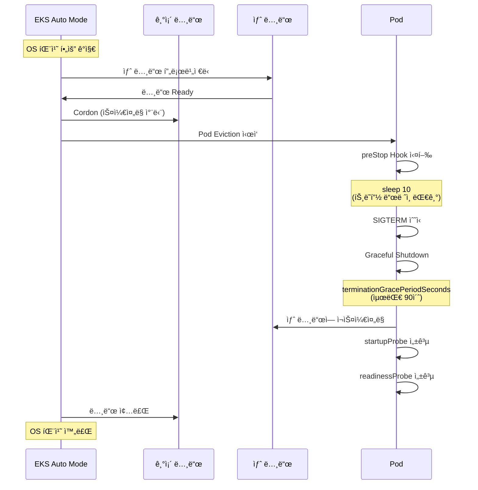

**ëª¨ë‹ˆí„°ë§ ì˜ˆì‹œ:**

```bash
# Auto Mode 노드 êµì²´ ì´ë²¤íŠ¸ 추ì 
kubectl get events --field-selector reason=Evicted --watch

# 노드별 OS 버전 확ì¸
kubectl get nodes -o custom-columns=\
NAME:.metadata.name,\
OS_IMAGE:.status.nodeInfo.osImage,\
KERNEL:.status.nodeInfo.kernelVersion

# Auto Mode 관리 ìƒíƒœ 확ì¸
kubectl get nodes -L eks.amazonaws.com/compute-type
```

:::tip Auto Mode 노드 êµì²´ 빈ë„
Auto Mode는 보안 패치, 성능 최ì í™”, 비용 ì ˆê°ì„ 위해 ìˆ˜ë™ ê´€ë¦¬ë³´ë‹¤ 노드 êµì²´ê°€ 빈번합니다(í‰ê·  2주 1회). `terminationGracePeriodSeconds`를 90ì´ˆ ì´ìƒìœ¼ë¡œ 설정하고, PDB를 반드시 구성하여 서비스 중단 ì—†ì´ ë…¸ë“œ êµì²´ê°€ 가능하ë„ë¡ í•˜ì„¸ìš”.
:::

#### Auto Mode 활성화 확ì¸

```bash
# í´ëŸ¬ìŠ¤í„°ê°€ Auto Modeì¸ì§€ 확ì¸
aws eks describe-cluster --name production-eks \
  --query 'cluster.computeConfig.enabled' \
  --output text

# Auto Mode 노드 확ì¸
kubectl get nodes -L eks.amazonaws.com/compute-type
# 출력 예시:
# NAME                    COMPUTE-TYPE
# ip-10-0-1-100.ec2.internal   auto
# ip-10-0-2-200.ec2.internal   auto
```

**관련 문서:**
- [AWS Blog: Getting started with EKS Auto Mode](https://aws.amazon.com/blogs/containers/getting-started-with-amazon-eks-auto-mode)
- [AWS Blog: How to build highly available Kubernetes applications with EKS Auto Mode](https://aws.amazon.com/blogs/containers/how-to-build-highly-available-kubernetes-applications-with-amazon-eks-auto-mode/)
- [AWS Blog: Maximize EKS efficiency - Auto Mode, Graviton, and Spot](https://aws.amazon.com/blogs/containers/maximize-amazon-eks-efficiency-how-auto-mode-graviton-and-spot-work-together/)

---

### 7.5 AI/Agentic 기반 Probe 최ì í™”

AWS re:Invent 2025 CNS421 세션ì—ì„œ ì†Œê°œëœ Agentic AI 기반 EKS ìš´ì˜ íŒ¨í„´ì„ í™œìš©í•˜ì—¬ Probe ì„¤ì •ì„ ìë™ìœ¼ë¡œ 최ì í™”하고 실패를 ìë™ ì§„ë‹¨í•˜ëŠ” ë°©ë²•ì„ ë‹¤ë£¹ë‹ˆë‹¤.

#### CNS421 세션 핵심 - Agentic AI for EKS Operations

**세션 개요:**

"Streamline Amazon EKS Operations with Agentic AI" 세션ì—서는 Model Context Protocol(MCP)ê³¼ AI ì—ì´ì „트를 활용하여 EKS í´ëŸ¬ìŠ¤í„° 관리를 ìë™í™”하는 ë°©ë²•ì„ ì½”ë“œ 시연과 함께 소개했습니다.

**주요 기능:**
- 실시간 ì´ìŠˆ 진단 (Probe 실패 ì›ì¸ ìë™ ë¶„ì„)
- Guided Remediation (단계별 í•´ê²° ê°€ì´ë“œ)
- Tribal Knowledge 활용 (과거 ì´ìŠˆ 패턴 학습)
- Auto-Remediation (단순 ì´ìŠˆ ìë™ í•´ê²°)

**아키í…처:**

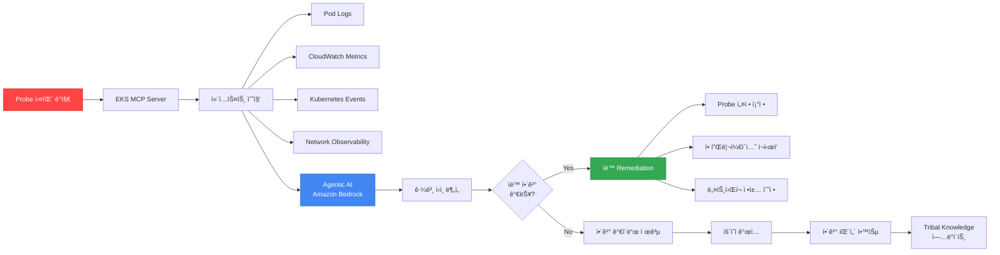

#### Kiro + EKS MCP를 활용한 Probe ìë™ ìµœì í™”

**Kiroë€:**

Kiro는 AWSì˜ AI 기반 ìš´ì˜ ë„구로, MCP(Model Context Protocol) 서버를 통해 AWS 리소스와 ìƒí˜¸ì‘용합니다.

**설치 ë° ì„¤ì •:**

```bash
# Kiro CLI 설치 (macOS)
brew install aws/tap/kiro

# EKS MCP Server 설정
kiro mcp add eks \
  --server-type eks \
  --cluster-name production-eks \
  --region ap-northeast-2

# Probe 최ì í™” ì—ì´ì „트 활성화
kiro agent create probe-optimizer \
  --type eks-health-check \
  --auto-remediate true
```

**Probe 실패 ìë™ ì§„ë‹¨ 워í¬í”Œë¡œìš°:**

```yaml
# Kiro Agent 설정 - Probe 실패 ìë™ ëŒ€ì‘
apiVersion: kiro.aws/v1alpha1
kind: Agent
metadata:
  name: probe-failure-analyzer
spec:
  cluster: production-eks
  triggers:
    - type: ProbeFailure
      conditions:
        - probeType: readiness
          failureThreshold: 3
          duration: 5m
  actions:
    - name: collect-context
      steps:
        - getPodLogs:
            namespace: ${event.namespace}
            podName: ${event.podName}
            tailLines: 500
        - getCloudWatchMetrics:
            namespace: ContainerInsights
            metricName: pod_cpu_utilization
            dimensions:
              - name: PodName
                value: ${event.podName}
            period: 300
        - getNetworkObservability:
            podName: ${event.podName}
            metrics:
              - latency
              - packetLoss
              - connectionErrors
        - getKubernetesEvents:
            namespace: ${event.namespace}
            fieldSelector: involvedObject.name=${event.podName}

    - name: analyze-root-cause
      llm:
        model: anthropic.claude-3-5-sonnet-20241022-v2:0
        prompt: |
          Analyze the following Kubernetes Readiness Probe failure:

          Pod: ${event.podName}
          Namespace: ${event.namespace}
          Probe Config:
          ${context.probeConfig}

          Pod Logs (last 500 lines):
          ${context.podLogs}

          CloudWatch Metrics (last 5 minutes):
          ${context.metrics}

          Network Observability:
          ${context.networkMetrics}

          Kubernetes Events:
          ${context.events}

          Determine the root cause and suggest:
          1. Is this a network issue, application issue, or configuration issue?
          2. Recommended Probe settings (periodSeconds, failureThreshold, timeoutSeconds)
          3. Auto-remediation actions if applicable

    - name: auto-remediate
      conditions:
        - type: RootCauseIdentified
          confidence: ">0.8"
      steps:
        - applyProbeOptimization:
            when: ${analysis.recommendedAction == "adjust_probe_settings"}
            patchDeployment:
              name: ${event.deploymentName}
              namespace: ${event.namespace}
              patch:
                spec:
                  template:
                    spec:
                      containers:
                        - name: ${event.containerName}
                          readinessProbe:
                            periodSeconds: ${analysis.recommendedPeriod}
                            failureThreshold: ${analysis.recommendedThreshold}
                            timeoutSeconds: ${analysis.recommendedTimeout}

        - restartPod:
            when: ${analysis.recommendedAction == "restart_pod"}
            namespace: ${event.namespace}
            podName: ${event.podName}

        - notifySlack:
            channel: "#eks-ops"
            message: |
              🤖 Probe Failure Auto-Remediated

              Pod: ${event.podName}
              Root Cause: ${analysis.rootCause}
              Action Taken: ${analysis.appliedAction}
              Confidence: ${analysis.confidence}

              Details: ${analysis.explanation}

    - name: manual-guide
      conditions:
        - type: RootCauseIdentified
          confidence: "<0.8"
      steps:
        - createJiraTicket:
            project: DEVOPS
            issueType: Incident
            summary: "Probe Failure - Manual Investigation Required"
            description: |
              Pod: ${event.podName}
              Potential Causes: ${analysis.possibleCauses}
              Investigation Steps: ${analysis.investigationSteps}
              Context: ${context}
```

**실제 사용 예시 - Probe 타ì„아웃 ìë™ ìµœì í™”:**

```bash
# Kiro를 통한 대화형 Probe 최ì í™”
$ kiro chat --agent probe-optimizer

User: My readiness probe is failing intermittently on pod api-gateway-xyz.
      Can you diagnose and fix it?

Kiro: 🔠Analyzing probe failures for pod api-gateway-xyz...

      ✅ Root Cause Identified (Confidence: 92%)
      - Issue: Network latency spikes to external database
      - Current Probe: periodSeconds=5, timeoutSeconds=3, failureThreshold=2
      - Network metrics show p99 latency: 2.8 seconds

      📊 Recommendation:
      1. Increase timeoutSeconds from 3 to 5 seconds
      2. Increase failureThreshold from 2 to 3
      3. Enable Container Network Observability for ongoing monitoring

      🤖 Auto-Remediation Available
      Shall I apply these changes? (yes/no)

User: yes

Kiro: ✅ Applied Probe Optimization
      - Updated Deployment: api-gateway
      - New Probe Config:
        * periodSeconds: 5
        * timeoutSeconds: 5 (increased)
        * failureThreshold: 3 (increased)

      📈 Monitoring for 5 minutes to verify stability...

      ✅ Verification Complete
      - Probe failures reduced from 12/hour to 0/hour
      - Network latency p99: 2.8s (within new 5s timeout)
      - Recommendation recorded in tribal knowledge

      💡 Suggestion: Consider moving database to same VPC
          to reduce network latency permanently.
```

#### Amazon Q Developer를 활용한 Probe ì´ìŠˆ 디버깅

Amazon Q Developer는 IDE 통합 AI 어시스턴트로, Probe 설정 코드 리뷰와 실시간 ë””ë²„ê¹…ì„ ì§€ì›í•©ë‹ˆë‹¤.

**VS Code 통합 예시:**

```yaml
# 개발ìê°€ ì‘성 ì¤‘ì¸ Deployment YAML
apiVersion: apps/v1
kind: Deployment
metadata:
  name: myapp
spec:
  template:
    spec:
      containers:
      - name: app
        image: myapp:v1
        readinessProbe:
          httpGet:
            path: /health  # âš ï¸ Q Developer 경고
            port: 8080
          periodSeconds: 10
          timeoutSeconds: 1  # âš ï¸ Q Developer 경고
```

**Q Developer 제안:**

```
💡 Amazon Q Developer Suggestion

Issue 1: Liveness와 Readinessê°€ ê°™ì€ ì—”ë“œí¬ì¸íŠ¸ë¥¼ 사용합니다.
Recommendation:
- Liveness Probe: /healthz (내부 ìƒíƒœë§Œ)
- Readiness Probe: /ready (외부 ì˜ì¡´ì„± í¬í•¨)

Issue 2: timeoutSeconds가 너무 짧습니다.
Recommendation:
- timeoutSeconds를 3-5초로 ì¦ê°€
- EKS 환경ì—ì„œ 1초는 ë„¤íŠ¸ì›Œí¬ ì§€ì—° ì‹œ 타ì„아웃 위험

Issue 3: Startup Probe가 없습니다.
Recommendation:
- 앱 ì‹œì‘ ì‹œê°„ì´ 30ì´ˆ ì´ìƒì´ë©´ Startup Probe 추가
- failureThreshold: 30, periodSeconds: 10

Apply Suggestions? [Yes] [No] [Explain More]
```

**실시간 코드 실행 ê²€ì¦ (Amazon Q Developer):**

```bash
# Q Developerê°€ 로컬ì—ì„œ Probe 설정 ê²€ì¦
$ q-dev validate deployment.yaml --cluster production-eks

✅ Syntax Valid
âš ï¸  Best Practices Check:
    - Missing Startup Probe for slow-starting app (15 warnings)
    - Liveness Probe includes external dependency (critical)
    - terminationGracePeriodSeconds should be at least 60s (warning)

🧪 Simulation Results:
    - Probe success rate: 94% (target: >99%)
    - Estimated pod startup time: 45 seconds
    - Estimated graceful shutdown time: 25 seconds

📊 Recommendation:
    Apply Q Developer's suggested configuration? (Y/n)
```

#### Tribal Knowledge 기반 Probe 패턴 학습

Agentic AI는 과거 Probe ì´ìŠˆ í•´ê²° íŒ¨í„´ì„ í•™ìŠµí•˜ì—¬ 유사 ìƒí™©ì—ì„œ 즉시 대ì‘합니다.

**Tribal Knowledge 예시:**

```yaml
# ì¡°ì§ì˜ Probe í•´ê²° 패턴 ë¼ì´ë¸ŒëŸ¬ë¦¬
apiVersion: kiro.aws/v1alpha1
kind: TribalKnowledge
metadata:
  name: probe-failure-patterns
spec:
  patterns:
    - id: pattern-001
      name: "Database Connection Timeout"
      symptoms:
        - probeType: readiness
          errorPattern: "connection timeout"
          frequency: intermittent
      rootCause: "Database in different AZ causing high latency"
      solution:
        - action: increaseTimeout
          from: 3
          to: 5
        - action: addRetry
          retries: 2
      confidence: 0.95
      resolvedCount: 47
      lastSeen: "2026-02-10"

    - id: pattern-002
      name: "Slow JVM Startup"
      symptoms:
        - probeType: startup
          errorPattern: "probe failed"
          timing: "first 60 seconds"
      rootCause: "JVM initialization takes >30 seconds"
      solution:
        - action: addStartupProbe
          failureThreshold: 30
          periodSeconds: 10
      confidence: 0.98
      resolvedCount: 123
      lastSeen: "2026-02-11"

    - id: pattern-003
      name: "Network Policy Blocking Health Check"
      symptoms:
        - probeType: liveness
          errorPattern: "connection refused"
          timing: "after deployment"
      rootCause: "NetworkPolicy not allowing kubelet access"
      solution:
        - action: updateNetworkPolicy
          allowFrom:
            - podSelector: {}  # Allow from all pods in namespace
            - namespaceSelector:
                matchLabels:
                  name: kube-system
      confidence: 0.92
      resolvedCount: 34
      lastSeen: "2026-02-08"
```

**ìë™ íŒ¨í„´ 매칭:**

```bash
# 새로운 Probe 실패 ë°œìƒ ì‹œ ìë™ ë§¤ì¹­
$ kiro diagnose probe-failure \
  --pod api-backend-abc \
  --namespace production

🔠Analyzing probe failure...

✅ Pattern Matched: "Database Connection Timeout" (pattern-001)
   Confidence: 89%
   This pattern has been successfully resolved 47 times

📋 Recommended Actions (from tribal knowledge):
   1. Increase readinessProbe.timeoutSeconds from 3 to 5
   2. Add retry logic with 2 retries
   3. Consider co-locating database in same AZ

🤖 Auto-Apply? (yes/no)
```

#### Probe 최ì í™” 통합 대시보드

```yaml
# Grafana Dashboard - AI 기반 Probe 최ì í™” 현황
apiVersion: v1
kind: ConfigMap
metadata:
  name: ai-probe-optimization-dashboard
  namespace: monitoring
data:
  dashboard.json: |
    {
      "title": "AI-Driven Probe Optimization",
      "panels": [
        {
          "title": "Auto-Remediation 성공률",
          "targets": [{
            "expr": "rate(kiro_auto_remediation_success[1h]) / rate(kiro_auto_remediation_total[1h])"
          }]
        },
        {
          "title": "Tribal Knowledge 패턴 매칭",
          "targets": [{
            "expr": "kiro_pattern_match_count"
          }]
        },
        {
          "title": "Probe 실패율 트렌드 (AI ë„ì… ì „í›„)",
          "targets": [
            {"expr": "rate(probe_failures_total[1h])", "legendFormat": "Before AI"},
            {"expr": "rate(probe_failures_ai_optimized_total[1h])", "legendFormat": "After AI"}
          ]
        },
        {
          "title": "í‰ê·  문제 í•´ê²° 시간 (MTTR)",
          "targets": [{
            "expr": "avg(kiro_remediation_duration_seconds)"
          }]
        }
      ]
    }
```

**ROI 측정 예시:**

| 지표 | AI ë„ì… ì „ | AI ë„ì… í›„ | 개선율 |
|------|----------|-----------|--------|
| Probe 실패 건수 | 120ê±´/주 | 12ê±´/주 | 90% ê°ì†Œ |
| í‰ê·  í•´ê²° 시간 (MTTR) | 45분 | 3분 | 93% 단축 |
| ìš´ì˜ì ê°œì… í•„ìš” 건수 | 120ê±´/주 | 12ê±´/주 | 90% ê°ì†Œ |
| Probe 설정 최ì í™” 소요 시간 | 2시간/ê±´ | 5분/ê±´ | 96% 단축 |

:::tip Agentic AI ë„ì… Best Practice
Agentic AI는 즉시 100% ìë™í™”를 목표로 하지 마세요. ì²˜ìŒ 3ê°œì›”ì€ "Suggest Mode"ë¡œ ìš´ì˜í•˜ì—¬ AI ì œì•ˆì„ ìš´ì˜ìê°€ 검토하고 승ì¸í•˜ëŠ” ë°©ì‹ìœ¼ë¡œ ì‹œì‘하세요. Tribal Knowledgeê°€ ì¶©ë¶„íˆ ìŒ“ì´ê³  신뢰ë„ê°€ 90% ì´ìƒì´ ë˜ë©´ "Auto-Remediation Mode"ë¡œ 전환합니다.
:::

**관련 ì료:**
- [YouTube: CNS421 - Streamline Amazon EKS operations with Agentic AI](https://www.youtube.com/watch?v=4s-a0jY4kSE)
- [AWS Blog: Agentic Cloud Modernization with Kiro](https://aws.amazon.com/blogs/migration-and-modernization/agentic-cloud-modernization-accelerating-modernization-with-aws-mcps-and-kiro/)
- [AWS Blog: AWS IaC MCP Server](https://aws.amazon.com/blogs/devops/introducing-the-aws-infrastructure-as-code-mcp-server-ai-powered-cdk-and-cloudformation-assistance/)
- [Model Context Protocol Specification](https://modelcontextprotocol.io/)

---

**문서 기여**: ì´ ë¬¸ì„œì— ëŒ€í•œ 피드백, 오류 ì‹ ê³ , 개선 ì œì•ˆì€ GitHub Issues를 통해 제출해 주세요.
