# EKS Pod 스케줄링 & 가용성 패턴

> 📅 **작성일**: 2026-02-12 | **수정일**: 2026-02-14 | ⏱️ **읽는 시간**: 약 54분

> **📌 기준 환경**: EKS 1.30+, Karpenter v1.x, Kubernetes 1.30+

## 1. 개요

Kubernetes의 Pod 스케줄링은 서비스 가용성, 성능, 비용 효율성에 직접적인 영향을 미치는 핵심 메커니즘입니다. 올바른 스케줄링 전략을 적용하면 다음과 같은 이점을 얻을 수 있습니다:

- **고가용성**: 장애 도메인 분리를 통한 서비스 중단 최소화
- **성능 최적화**: 워크로드 특성에 맞는 노드 배치로 응답 시간 개선
- **리소스 효율**: 노드 리소스의 균형 있는 활용으로 비용 절감
- **안정적 운영**: 우선순위 기반 리소스 보장 및 Preemption 제어

본 문서는 Pod 스케줄링의 핵심 개념부터 고급 패턴까지 다루며, EKS 환경에서 실전 적용 가능한 YAML 예시와 의사결정 가이드를 제공합니다.

:::info 고가용성 아키텍처 참고
본 문서는 **Pod 수준**의 스케줄링 패턴에 초점을 맞춥니다. 클러스터 전체의 고가용성 아키텍처(Multi-AZ 전략, Topology Spread, Cell Architecture)는 [EKS 고가용성 아키텍처 가이드](/docs/operations-observability/eks-resiliency-guide)를 참조하세요.
:::

### 스케줄링이 중요한 이유

| 시나리오 | 잘못된 스케줄링 | 올바른 스케줄링 |
|---------|----------------|----------------|
| **장애 격리** | 모든 replica가 같은 노드 → 노드 장애 시 전체 중단 | Anti-Affinity로 노드 분산 → 부분 장애만 발생 |
| **리소스 경합** | CPU 집약적 Pod들이 한 노드에 집중 → 성능 저하 | Node Affinity로 워크로드 분리 → 안정적 성능 |
| **비용 최적화** | GPU 필요 없는 Pod가 GPU 노드에 배치 → 비용 낭비 | Taints/Tolerations로 전용 노드 격리 → 비용 절감 |
| **업그레이드 안전성** | PDB 미설정 → 롤링 업데이트 중 서비스 중단 | PDB 설정 → 최소 가용 Pod 보장 |
| **긴급 대응** | 우선순위 미설정 → 중요 워크로드 Pending | PriorityClass 설정 → 중요 Pod 우선 스케줄링 |

---

## 2. Kubernetes 스케줄링 기본 원리

### 2.1 스케줄링 프로세스

Kubernetes 스케줄러는 3단계 프로세스를 거쳐 Pod를 노드에 배치합니다:

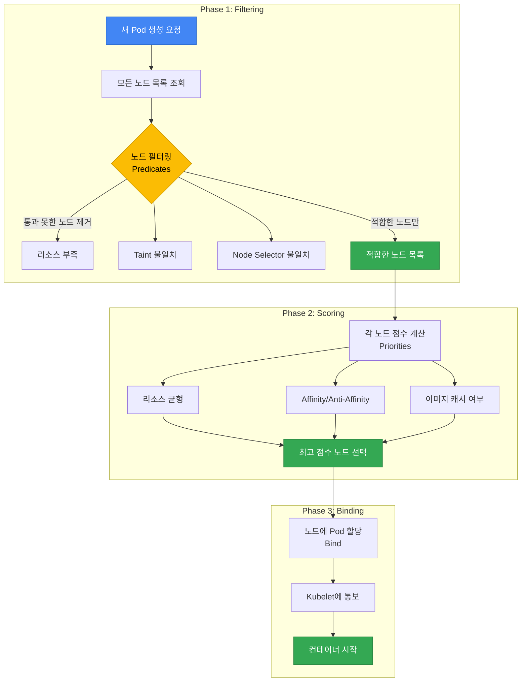

**1. Filtering (Predicates)**: 요구사항을 충족하지 못하는 노드를 제외
- 리소스 부족 (CPU, Memory)
- Taints/Tolerations 불일치
- Node Selector 조건 미충족
- Volume 토폴로지 제약 (EBS AZ-Pinning)
- Port 충돌

**2. Scoring (Priorities)**: 남은 노드들에 점수를 매겨 최적의 노드 선택
- 리소스 밸런스 (균등 사용)
- Pod Affinity/Anti-Affinity 만족도
- 이미지 캐시 존재 여부
- Topology Spread 균등도
- 노드 Preference (PreferredDuringScheduling)

**3. Binding**: 최고 점수 노드에 Pod를 할당하고 Kubelet에 통보

:::tip 스케줄링 실패 디버깅
Pod가 `Pending` 상태로 남아있다면, `kubectl describe pod <pod-name>`으로 Events 섹션을 확인하세요. `Insufficient cpu`, `No nodes available`, `Taint not tolerated` 등의 메시지로 실패 원인을 파악할 수 있습니다.
:::

### 2.2 스케줄링에 영향을 주는 요소

| 요소 | 타입 | 영향 단계 | 강제성 | 주요 사용 사례 |
|------|------|-----------|--------|---------------|
| **Node Selector** | Pod | Filtering | Hard | 특정 노드 타입 지정 (GPU, ARM) |
| **Node Affinity** | Pod | Filtering/Scoring | Hard/Soft | 세밀한 노드 선택 조건 |
| **Pod Affinity** | Pod | Scoring | Hard/Soft | 관련 Pod를 가까이 배치 |
| **Pod Anti-Affinity** | Pod | Filtering/Scoring | Hard/Soft | Pod를 서로 멀리 배치 |
| **Taints/Tolerations** | Node + Pod | Filtering | Hard | 전용 노드 격리 |
| **Topology Spread** | Pod | Scoring | Hard/Soft | AZ/노드 간 균등 분산 |
| **PriorityClass** | Pod | Preemption | Hard | 우선순위 기반 리소스 선점 |
| **Resource Requests** | Pod | Filtering | Hard | 최소 리소스 보장 |
| **PDB** | Pod Group | Eviction | Hard | 최소 가용 Pod 보장 |

**Hard vs Soft 제약:**
- **Hard (Required)**: 조건을 충족하지 못하면 스케줄링 실패 → `Pending` 상태
- **Soft (Preferred)**: 조건을 선호하지만 충족하지 못해도 스케줄링 진행 → 차선책 허용

---

## 3. Node Affinity & Anti-Affinity

### 3.1 Node Selector (기본)

Node Selector는 가장 간단한 노드 선택 메커니즘으로, 레이블 기반 정확한 일치(exact match)만 지원합니다.

```yaml
apiVersion: apps/v1
kind: Deployment
metadata:
  name: gpu-workload
spec:
  replicas: 2
  selector:
    matchLabels:
      app: ml-training
  template:
    metadata:
      labels:
        app: ml-training
    spec:
      nodeSelector:
        node.kubernetes.io/instance-type: g5.2xlarge
        workload-type: gpu
      containers:
      - name: trainer
        image: ml/trainer:v2.0
        resources:
          requests:
            nvidia.com/gpu: 1
```

**제한사항**: Node Selector는 `AND` 조건만 지원하며, `OR`, `NOT`, 비교 연산자 등을 사용할 수 없습니다. 복잡한 조건이 필요하면 Node Affinity를 사용하세요.

### 3.2 Node Affinity 상세

Node Affinity는 Node Selector의 확장 버전으로, 복잡한 논리 조건과 선호도(preference)를 표현할 수 있습니다.

#### Required vs Preferred

| 타입 | 동작 | 사용 시기 |
|------|------|----------|
| `requiredDuringSchedulingIgnoredDuringExecution` | 조건 충족 필수 (Hard) | 반드시 특정 노드에 배치해야 할 때 |
| `preferredDuringSchedulingIgnoredDuringExecution` | 조건 선호 (Soft, 가중치 기반) | 선호하지만 대안 허용할 때 |

:::info IgnoredDuringExecution의 의미
`IgnoredDuringExecution`은 Pod가 **이미 실행 중**일 때 노드 레이블이 변경되어도 Pod를 Evict하지 않는다는 의미입니다. 미래에 `RequiredDuringExecution`이 도입되면 실행 중에도 조건 불충족 시 재배치됩니다.
:::

#### 연산자 종류

| 연산자 | 설명 | 예시 |
|--------|------|------|
| `In` | 값이 목록에 포함됨 | `values: ["t3.xlarge", "t3.2xlarge"]` |
| `NotIn` | 값이 목록에 포함되지 않음 | `values: ["t2.micro", "t2.small"]` |
| `Exists` | 키가 존재함 (값 무관) | 레이블 존재 여부만 확인 |
| `DoesNotExist` | 키가 존재하지 않음 | 특정 레이블이 없는 노드 선택 |
| `Gt` | 값이 크다 (숫자) | `values: ["100"]` (CPU 코어 수 등) |
| `Lt` | 값이 작다 (숫자) | `values: ["10"]` |

#### 사용 사례별 YAML 예시

**예시 1: GPU 노드에 ML 워크로드 배치 (Hard)**

```yaml
apiVersion: apps/v1
kind: Deployment
metadata:
  name: ml-training
spec:
  replicas: 3
  selector:
    matchLabels:
      app: ml-training
  template:
    metadata:
      labels:
        app: ml-training
    spec:
      affinity:
        nodeAffinity:
          requiredDuringSchedulingIgnoredDuringExecution:
            nodeSelectorTerms:
            - matchExpressions:
              - key: node.kubernetes.io/instance-type
                operator: In
                values:
                - g5.xlarge
                - g5.2xlarge
                - g5.4xlarge
              - key: karpenter.sh/capacity-type
                operator: NotIn
                values:
                - spot  # GPU 워크로드는 Spot 제외
      containers:
      - name: trainer
        image: ml/trainer:v3.0
        resources:
          requests:
            nvidia.com/gpu: 1
            cpu: "4"
            memory: 16Gi
```

**예시 2: 인스턴스 패밀리 선호 (Soft, 가중치)**

```yaml
apiVersion: apps/v1
kind: Deployment
metadata:
  name: api-server
spec:
  replicas: 6
  selector:
    matchLabels:
      app: api-server
  template:
    metadata:
      labels:
        app: api-server
    spec:
      affinity:
        nodeAffinity:
          # 필수: On-Demand 노드만 사용
          requiredDuringSchedulingIgnoredDuringExecution:
            nodeSelectorTerms:
            - matchExpressions:
              - key: karpenter.sh/capacity-type
                operator: In
                values:
                - on-demand
          # 선호: c7i > c6i > m6i 순서
          preferredDuringSchedulingIgnoredDuringExecution:
          - weight: 100
            preference:
              matchExpressions:
              - key: node.kubernetes.io/instance-type
                operator: In
                values:
                - c7i.xlarge
                - c7i.2xlarge
          - weight: 80
            preference:
              matchExpressions:
              - key: node.kubernetes.io/instance-type
                operator: In
                values:
                - c6i.xlarge
                - c6i.2xlarge
          - weight: 50
            preference:
              matchExpressions:
              - key: node.kubernetes.io/instance-type
                operator: In
                values:
                - m6i.xlarge
                - m6i.2xlarge
      containers:
      - name: api
        image: api-server:v2.5
        resources:
          requests:
            cpu: "1"
            memory: 2Gi
```

**예시 3: 특정 AZ 지정 (데이터베이스 클라이언트)**

```yaml
apiVersion: apps/v1
kind: Deployment
metadata:
  name: db-client
spec:
  replicas: 4
  selector:
    matchLabels:
      app: db-client
  template:
    metadata:
      labels:
        app: db-client
    spec:
      affinity:
        nodeAffinity:
          # RDS 인스턴스와 같은 AZ (us-east-1a)에 배치하여 Cross-AZ 비용 절감
          requiredDuringSchedulingIgnoredDuringExecution:
            nodeSelectorTerms:
            - matchExpressions:
              - key: topology.kubernetes.io/zone
                operator: In
                values:
                - us-east-1a
      containers:
      - name: client
        image: db-client:v1.2
        env:
        - name: DB_ENDPOINT
          value: "mydb.us-east-1a.rds.amazonaws.com"
```

### 3.3 Node Anti-Affinity

Node Anti-Affinity는 명시적인 문법이 없지만, Node Affinity의 `NotIn`, `DoesNotExist` 연산자로 구현합니다.

```yaml
apiVersion: apps/v1
kind: Deployment
metadata:
  name: avoid-spot
spec:
  replicas: 3
  selector:
    matchLabels:
      app: critical-service
  template:
    metadata:
      labels:
        app: critical-service
    spec:
      affinity:
        nodeAffinity:
          requiredDuringSchedulingIgnoredDuringExecution:
            nodeSelectorTerms:
            - matchExpressions:
              # Spot 노드 회피
              - key: karpenter.sh/capacity-type
                operator: NotIn
                values:
                - spot
              # ARM 아키텍처 회피
              - key: kubernetes.io/arch
                operator: NotIn
                values:
                - arm64
      containers:
      - name: app
        image: critical-service:v1.0
```

---

## 4. Pod Affinity & Anti-Affinity

Pod Affinity와 Anti-Affinity는 **Pod 간의 관계**를 기반으로 스케줄링 결정을 내립니다. 이를 통해 관련된 Pod들을 가까이 배치하거나(Affinity), 멀리 배치(Anti-Affinity)할 수 있습니다.

### 4.1 Pod Affinity

Pod Affinity는 특정 Pod가 있는 토폴로지 도메인(노드, AZ, 리전)에 다른 Pod를 함께 배치합니다.

**주요 사용 사례:**
- **Cache Locality**: 캐시 서버와 애플리케이션을 같은 노드에 배치하여 레이턴시 최소화
- **Data Locality**: 데이터 처리 워크로드를 데이터 소스와 가까이 배치
- **Communication Intensive**: 빈번하게 통신하는 마이크로서비스를 같은 AZ에 배치

```yaml
apiVersion: apps/v1
kind: Deployment
metadata:
  name: cache-client
spec:
  replicas: 3
  selector:
    matchLabels:
      app: cache-client
  template:
    metadata:
      labels:
        app: cache-client
    spec:
      affinity:
        podAffinity:
          # Hard: Redis Pod와 같은 노드에 배치 (초저지연 요구사항)
          requiredDuringSchedulingIgnoredDuringExecution:
          - labelSelector:
              matchExpressions:
              - key: app
                operator: In
                values:
                - redis
            topologyKey: kubernetes.io/hostname
      containers:
      - name: client
        image: cache-client:v1.0
```

**topologyKey 설명:**

| topologyKey | 범위 | 설명 |
|-------------|------|------|
| `kubernetes.io/hostname` | 노드 | 같은 노드에 배치 (가장 강력한 co-location) |
| `topology.kubernetes.io/zone` | AZ | 같은 AZ에 배치 |
| `topology.kubernetes.io/region` | 리전 | 같은 리전에 배치 |
| 커스텀 레이블 | 사용자 정의 | 예: `rack`, `datacenter` |

**Soft Affinity 예시 (선호, 대안 허용):**

```yaml
apiVersion: apps/v1
kind: Deployment
metadata:
  name: web-frontend
spec:
  replicas: 6
  selector:
    matchLabels:
      app: web-frontend
  template:
    metadata:
      labels:
        app: web-frontend
    spec:
      affinity:
        podAffinity:
          # Soft: API 서버와 같은 AZ 선호 (Cross-AZ 비용 절감)
          preferredDuringSchedulingIgnoredDuringExecution:
          - weight: 100
            podAffinityTerm:
              labelSelector:
                matchExpressions:
                - key: app
                  operator: In
                  values:
                  - api-server
              topologyKey: topology.kubernetes.io/zone
      containers:
      - name: frontend
        image: web-frontend:v2.0
```

### 4.2 Pod Anti-Affinity

Pod Anti-Affinity는 특정 Pod가 있는 토폴로지 도메인에 다른 Pod를 배치하지 **않도록** 합니다. 고가용성 확보의 핵심 패턴입니다.

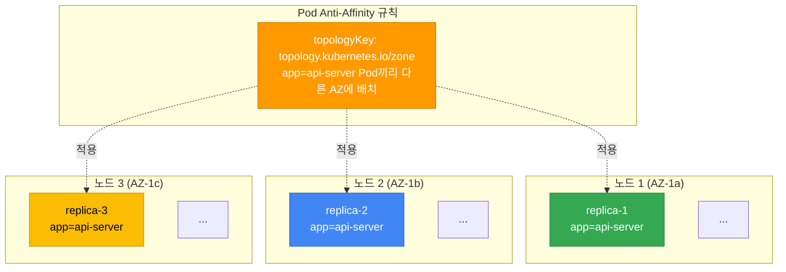

#### Hard Anti-Affinity (장애 도메인 격리)

```yaml
apiVersion: apps/v1
kind: Deployment
metadata:
  name: api-server
spec:
  replicas: 6
  selector:
    matchLabels:
      app: api-server
  template:
    metadata:
      labels:
        app: api-server
    spec:
      affinity:
        podAntiAffinity:
          # Hard: 각 노드에 최대 1개 replica만 배치 (노드 장애 격리)
          requiredDuringSchedulingIgnoredDuringExecution:
          - labelSelector:
              matchExpressions:
              - key: app
                operator: In
                values:
                - api-server
            topologyKey: kubernetes.io/hostname
      containers:
      - name: api
        image: api-server:v3.0
        resources:
          requests:
            cpu: "1"
            memory: 2Gi
```

:::warning Hard Anti-Affinity 주의사항
Hard Anti-Affinity를 `kubernetes.io/hostname`에 적용하면, replica 수가 노드 수보다 많을 때 일부 Pod가 `Pending` 상태로 남습니다. 예를 들어 노드 3개에 replica 5개를 배포하면 2개가 스케줄링되지 않습니다. 이 경우 Soft Anti-Affinity를 사용하세요.
:::

#### Soft Anti-Affinity (권장 패턴)

```yaml
apiVersion: apps/v1
kind: Deployment
metadata:
  name: worker
spec:
  replicas: 10
  selector:
    matchLabels:
      app: worker
  template:
    metadata:
      labels:
        app: worker
    spec:
      affinity:
        podAntiAffinity:
          # Soft: 가능한 한 다른 노드에 분산 배치 (유연성 확보)
          preferredDuringSchedulingIgnoredDuringExecution:
          - weight: 100
            podAffinityTerm:
              labelSelector:
                matchExpressions:
                - key: app
                  operator: In
                  values:
                  - worker
              topologyKey: kubernetes.io/hostname
      containers:
      - name: worker
        image: worker:v2.1
        resources:
          requests:
            cpu: "500m"
            memory: 1Gi
```

#### Hard vs Soft 선택 기준

| 시나리오 | 권장 | 이유 |
|---------|------|------|
| replica 수 ≤ 노드 수 | Hard | 각 노드에 정확히 1개씩 배치 가능 |
| replica 수 > 노드 수 | Soft | 일부 노드에 2개 이상 배치 허용 |
| 미션 크리티컬 서비스 | Hard (AZ 레벨) | 장애 도메인 완전 격리 |
| 일반 워크로드 | Soft | 스케줄링 유연성 확보 |
| 빠른 스케일링 필요 | Soft | Pending 상태 방지 |

### 4.3 Affinity/Anti-Affinity vs Topology Spread 비교

| 비교 항목 | Pod Anti-Affinity | Topology Spread Constraints |
|----------|-------------------|----------------------------|
| **목적** | Pod 간 분리 | Pod 균등 분산 |
| **세밀함** | Pod 단위 제어 | 도메인 간 균형 제어 |
| **복잡성** | 낮음 | 중간 |
| **유연성** | Hard/Soft 선택 | maxSkew로 허용 범위 제어 |
| **주요 사용** | 같은 앱 replica 분리 | 여러 앱의 전체 균형 |
| **AZ 분산** | 가능 | 더 정교함 (minDomains) |
| **노드 분산** | 가능 | 더 정교함 (maxSkew) |
| **권장 조합** | Topology Spread (AZ) + Anti-Affinity (노드) | |

:::info Topology Spread Constraints 참고
Topology Spread Constraints는 Pod Anti-Affinity보다 더 정교한 분산 제어를 제공합니다. 자세한 내용과 YAML 예시는 [EKS 고가용성 아키텍처 가이드](/docs/operations-observability/eks-resiliency-guide#pod-topology-spread-constraints)를 참조하세요.
:::

#### 4.3.1 Topology Spread Constraints 실전 패턴

Topology Spread Constraints는 복잡한 분산 요구사항을 우아하게 해결합니다. 실제 프로덕션 환경에서 자주 사용되는 패턴을 YAML과 함께 소개합니다.

##### 패턴 1: Multi-AZ 균등 분배 (기본)

가장 일반적인 패턴으로, 모든 replica를 AZ 간에 균등하게 분산시킵니다.

```yaml
apiVersion: apps/v1
kind: Deployment
metadata:
  name: multi-az-app
  namespace: production
spec:
  replicas: 9
  selector:
    matchLabels:
      app: multi-az-app
  template:
    metadata:
      labels:
        app: multi-az-app
    spec:
      topologySpreadConstraints:
      - maxSkew: 1
        topologyKey: topology.kubernetes.io/zone
        whenUnsatisfiable: DoNotSchedule
        labelSelector:
          matchLabels:
            app: multi-az-app
      containers:
      - name: app
        image: myapp:v1.0
        resources:
          requests:
            cpu: 500m
            memory: 512Mi
```

**동작 방식:**
- `maxSkew: 1`: AZ 간 Pod 수 차이가 최대 1개까지 허용
- 9개 replica → us-east-1a(3), us-east-1b(3), us-east-1c(3)
- `whenUnsatisfiable: DoNotSchedule`: 조건 위반 시 Pod를 Pending 상태로 유지

**사용 시나리오:**
- 미션 크리티컬 서비스의 AZ 장애 대응
- 클라이언트 트래픽이 모든 AZ에서 균등하게 들어오는 경우
- 데이터센터 수준의 장애 격리가 필요한 경우

##### 패턴 2: minDomains 활용 (최소 AZ 보장)

`minDomains`는 Pod가 반드시 분산되어야 하는 최소 도메인(AZ) 수를 보장합니다. AZ 축소 시나리오에서 Pod가 한 곳으로 밀리는 것을 방지합니다.

```yaml
apiVersion: apps/v1
kind: Deployment
metadata:
  name: ha-critical-service
  namespace: production
spec:
  replicas: 6
  selector:
    matchLabels:
      app: ha-critical-service
      tier: critical
  template:
    metadata:
      labels:
        app: ha-critical-service
        tier: critical
    spec:
      topologySpreadConstraints:
      - maxSkew: 1
        minDomains: 3  # 반드시 3개 AZ에 분산
        topologyKey: topology.kubernetes.io/zone
        whenUnsatisfiable: DoNotSchedule
        labelSelector:
          matchLabels:
            app: ha-critical-service
      containers:
      - name: service
        image: critical-service:v2.5
        resources:
          requests:
            cpu: "1"
            memory: 1Gi
          limits:
            cpu: "2"
            memory: 2Gi
```

**동작 방식:**
- `minDomains: 3`: 최소 3개 AZ에 Pod 분산 보장
- 6개 replica → 각 AZ에 최소 2개씩 배치
- 특정 AZ가 리소스 부족이어도, 다른 AZ로만 몰리지 않음

**사용 시나리오:**
- 금융, 결제 시스템 등 초고가용성 요구 서비스
- SLA 99.99% 이상 보장 필요 시
- AZ 축소(Zonal Shift) 중에도 최소 가용성 유지

:::warning minDomains 설정 시 주의사항
`minDomains`를 설정하면 해당 수만큼의 도메인이 존재하지 않거나 리소스가 부족할 경우, Pod가 Pending 상태로 남습니다. 클러스터에 실제로 사용 가능한 AZ 수를 확인 후 설정하세요.
:::

##### 패턴 3: Anti-Affinity + Topology Spread 조합

같은 노드에 replica를 2개 이상 배치하지 않으면서, 동시에 AZ 간 균등 분배를 보장하는 패턴입니다.

```yaml
apiVersion: apps/v1
kind: Deployment
metadata:
  name: combined-constraints-app
  namespace: production
spec:
  replicas: 12
  selector:
    matchLabels:
      app: combined-app
  template:
    metadata:
      labels:
        app: combined-app
        version: v3.0
    spec:
      # 1. Topology Spread: AZ 간 균등 분산 (Hard)
      topologySpreadConstraints:
      - maxSkew: 1
        minDomains: 3
        topologyKey: topology.kubernetes.io/zone
        whenUnsatisfiable: DoNotSchedule
        labelSelector:
          matchLabels:
            app: combined-app

      # 2. Anti-Affinity: 노드 간 분산 (Hard)
      affinity:
        podAntiAffinity:
          requiredDuringSchedulingIgnoredDuringExecution:
          - labelSelector:
              matchExpressions:
              - key: app
                operator: In
                values:
                - combined-app
            topologyKey: kubernetes.io/hostname

      containers:
      - name: app
        image: combined-app:v3.0
        resources:
          requests:
            cpu: "2"
            memory: 4Gi
```

**동작 방식:**
- **Level 1 (AZ)**: 12개 replica → 각 AZ에 4개씩 균등 배치
- **Level 2 (Node)**: 각 노드에 최대 1개 Pod만 배치

**효과:**
- 노드 장애 시 최대 1개 Pod만 영향
- AZ 장애 시 최대 4개 Pod만 영향
- 총 12개 중 8개(66.7%) 항상 가용

**사용 시나리오:**
- 단일 장애점(Single Point of Failure) 완전 제거
- 하드웨어 장애와 데이터센터 장애 모두 대응
- 고트래픽 API 서버, 결제 게이트웨이

##### 패턴 4: 다중 Topology Spread (Zone + Node)

하나의 Pod Spec에서 여러 토폴로지 레벨의 분산을 동시에 제어합니다.

```yaml
apiVersion: apps/v1
kind: Deployment
metadata:
  name: multi-level-spread
  namespace: production
spec:
  replicas: 18
  selector:
    matchLabels:
      app: multi-level-app
  template:
    metadata:
      labels:
        app: multi-level-app
    spec:
      topologySpreadConstraints:
      # 제약 1: AZ 레벨 분산 (Hard)
      - maxSkew: 1
        minDomains: 3
        topologyKey: topology.kubernetes.io/zone
        whenUnsatisfiable: DoNotSchedule
        labelSelector:
          matchLabels:
            app: multi-level-app

      # 제약 2: 노드 레벨 분산 (Soft)
      - maxSkew: 2
        topologyKey: kubernetes.io/hostname
        whenUnsatisfiable: ScheduleAnyway
        labelSelector:
          matchLabels:
            app: multi-level-app

      containers:
      - name: app
        image: multi-level-app:v1.5
        resources:
          requests:
            cpu: "1"
            memory: 2Gi
```

**동작 방식:**
- **1단계 (AZ)**: 18개 → us-east-1a(6), us-east-1b(6), us-east-1c(6)
- **2단계 (Node)**: 각 AZ 내에서 노드당 Pod 수 차이 최대 2개
- Node 제약은 Soft(`ScheduleAnyway`)로 설정하여 스케줄링 실패 방지

**사용 시나리오:**
- 대규모 replica(10개 이상) 배포
- 노드 수가 유동적인 환경 (Karpenter 오토스케일링)
- AZ 분산은 필수, 노드 분산은 선호하는 경우

##### 패턴 비교표

| 패턴 | maxSkew | minDomains | whenUnsatisfiable | 추가 제약 | 복잡도 | 권장 Replica 수 |
|------|---------|------------|-------------------|----------|--------|----------------|
| **패턴 1: 기본 Multi-AZ** | 1 | - | DoNotSchedule | 없음 | 낮음 | 3~12 |
| **패턴 2: minDomains** | 1 | 3 | DoNotSchedule | 없음 | 중간 | 6~20 |
| **패턴 3: Anti-Affinity 조합** | 1 | 3 | DoNotSchedule | Hard Anti-Affinity | 높음 | 12~50 |
| **패턴 4: 다중 Spread** | 1, 2 | 3 | Mixed | 2단계 Topology | 높음 | 15+ |

##### 트러블슈팅: Topology Spread 실패 원인

| 증상 | 원인 | 해결 방법 |
|------|------|----------|
| Pod가 Pending 상태 | `maxSkew` 초과 또는 `minDomains` 미충족 | `kubectl describe pod`로 Events 확인, replica 수 조정 또는 노드 추가 |
| 특정 AZ에만 Pod 집중 | `whenUnsatisfiable: ScheduleAnyway` 사용 | `DoNotSchedule`로 변경하여 Hard 제약 적용 |
| 신규 AZ 추가 시 재배치 안됨 | 스케줄러는 기존 Pod 재배치 안함 | Descheduler 사용 또는 Rolling Restart |
| `minDomains` 설정 후 모든 Pod Pending | 클러스터에 해당 수의 AZ 없음 | 실제 AZ 수에 맞춰 `minDomains` 조정 |

:::tip Topology Spread 디버깅 명령어
```bash
# Pod가 배치된 AZ 분포 확인
kubectl get pods -n production -l app=multi-az-app \
  -o custom-columns=NAME:.metadata.name,NODE:.spec.nodeName,ZONE:.spec.nodeSelector.topology\.kubernetes\.io/zone

# 노드별 Pod 수 확인
kubectl get pods -A -o wide --no-headers | \
  awk '{print $8}' | sort | uniq -c | sort -rn
```
:::

**권장 조합 패턴:**

```yaml
apiVersion: apps/v1
kind: Deployment
metadata:
  name: best-practice-app
spec:
  replicas: 6
  selector:
    matchLabels:
      app: best-practice-app
  template:
    metadata:
      labels:
        app: best-practice-app
    spec:
      # Topology Spread: AZ 간 균등 분산 (Hard)
      topologySpreadConstraints:
      - maxSkew: 1
        topologyKey: topology.kubernetes.io/zone
        whenUnsatisfiable: DoNotSchedule
        labelSelector:
          matchLabels:
            app: best-practice-app
        minDomains: 3
      # Anti-Affinity: 노드 간 분산 (Soft)
      affinity:
        podAntiAffinity:
          preferredDuringSchedulingIgnoredDuringExecution:
          - weight: 100
            podAffinityTerm:
              labelSelector:
                matchExpressions:
                - key: app
                  operator: In
                  values:
                  - best-practice-app
              topologyKey: kubernetes.io/hostname
      containers:
      - name: app
        image: app:v1.0
```

---

## 5. Taints & Tolerations

Taints와 Tolerations는 **노드 수준의 회피(repel) 메커니즘**입니다. 노드에 Taint를 적용하면, 해당 Taint를 Tolerate하는 Pod만 스케줄링됩니다.

**개념:**
- **Taint**: 노드에 적용 (예: "이 노드는 GPU 전용입니다")
- **Toleration**: Pod에 적용 (예: "나는 GPU 노드를 Tolerate합니다")

### 5.1 Taint 효과 (Effect)

| Effect | 동작 | 기존 Pod 영향 | 사용 시기 |
|--------|------|--------------|----------|
| `NoSchedule` | 새 Pod 스케줄링 차단 | 기존 Pod 유지 | 신규 전용 노드 생성 시 |
| `PreferNoSchedule` | 가능하면 스케줄링 차단 (Soft) | 기존 Pod 유지 | 선호 회피 (대안 허용) |
| `NoExecute` | 스케줄링 차단 + 기존 Pod Evict | 기존 Pod 즉시 Evict | 노드 유지보수, 긴급 대피 |

**Taint 적용 명령어:**

```bash
# NoSchedule: 신규 Pod 스케줄링 차단
kubectl taint nodes node1 workload-type=gpu:NoSchedule

# NoExecute: 신규 차단 + 기존 Pod Evict
kubectl taint nodes node1 maintenance=true:NoExecute

# Taint 제거 (마지막에 '-' 추가)
kubectl taint nodes node1 workload-type=gpu:NoSchedule-
```

### 5.2 일반적인 Taint 패턴

#### 패턴 1: 전용 노드 그룹 (GPU, High-Memory)

```yaml
# 노드에 Taint 적용 (kubectl 또는 Karpenter)
# kubectl taint nodes gpu-node-1 nvidia.com/gpu=present:NoSchedule

# GPU Pod가 Toleration 선언
apiVersion: v1
kind: Pod
metadata:
  name: gpu-job
spec:
  tolerations:
  - key: nvidia.com/gpu
    operator: Equal
    value: present
    effect: NoSchedule
  nodeSelector:
    node.kubernetes.io/instance-type: g5.2xlarge
  containers:
  - name: trainer
    image: ml/trainer:v1.0
    resources:
      limits:
        nvidia.com/gpu: 1
```

#### 패턴 2: 시스템 워크로드 격리

```yaml
# Karpenter로 시스템 전용 NodePool 생성
apiVersion: karpenter.sh/v1
kind: NodePool
metadata:
  name: system-pool
spec:
  template:
    spec:
      requirements:
      - key: node.kubernetes.io/instance-type
        operator: In
        values: ["c6i.large", "c6i.xlarge"]
      taints:
      - key: workload-type
        value: system
        effect: NoSchedule
  limits:
    cpu: "20"
---
# 시스템 DaemonSet (모니터링 에이전트)
apiVersion: apps/v1
kind: DaemonSet
metadata:
  name: monitoring-agent
spec:
  selector:
    matchLabels:
      app: monitoring-agent
  template:
    metadata:
      labels:
        app: monitoring-agent
    spec:
      tolerations:
      - key: workload-type
        operator: Equal
        value: system
        effect: NoSchedule
      # 모든 노드에 배포되어야 하므로 기본 Taints도 Tolerate
      - key: node.kubernetes.io/not-ready
        operator: Exists
        effect: NoExecute
      - key: node.kubernetes.io/unreachable
        operator: Exists
        effect: NoExecute
      containers:
      - name: agent
        image: monitoring-agent:v2.0
```

#### 패턴 3: 노드 유지보수 (Drain 준비)

```bash
# Step 1: 노드에 NoExecute Taint 적용
kubectl taint nodes node-1 maintenance=true:NoExecute

# 결과: Toleration 없는 모든 Pod가 즉시 Evict되고 다른 노드로 이동
# PDB가 설정된 경우, minAvailable을 존중하며 순차적으로 Evict

# Step 2: 유지보수 완료 후 Taint 제거
kubectl taint nodes node-1 maintenance=true:NoExecute-
kubectl uncordon node-1
```

### 5.3 Toleration 설정

#### Operator: Equal vs Exists

```yaml
# Equal: 정확한 key=value 일치 필요
tolerations:
- key: workload-type
  operator: Equal
  value: gpu
  effect: NoSchedule

# Exists: key만 존재하면 됨 (value 무시)
tolerations:
- key: workload-type
  operator: Exists
  effect: NoSchedule

# 모든 Taint Tolerate (DaemonSet 등)
tolerations:
- operator: Exists
```

#### tolerationSeconds (NoExecute 전용)

`NoExecute` Taint가 적용되면 기본적으로 즉시 Evict되지만, `tolerationSeconds`로 유예 시간을 부여할 수 있습니다.

```yaml
apiVersion: v1
kind: Pod
metadata:
  name: resilient-app
spec:
  tolerations:
  # 노드가 NotReady 상태가 되어도 300초 동안 유지 (일시적 장애 대응)
  - key: node.kubernetes.io/not-ready
    operator: Exists
    effect: NoExecute
    tolerationSeconds: 300
  # 노드가 Unreachable 상태가 되어도 300초 동안 유지
  - key: node.kubernetes.io/unreachable
    operator: Exists
    effect: NoExecute
    tolerationSeconds: 300
  containers:
  - name: app
    image: app:v1.0
```

**기본값**: Kubernetes는 `tolerationSeconds` 미지정 시 다음 기본값을 사용합니다:
- `node.kubernetes.io/not-ready`: 300초
- `node.kubernetes.io/unreachable`: 300초

### 5.4 EKS 기본 Taints

EKS는 특정 노드에 자동으로 Taint를 적용합니다:

| Taint | 적용 대상 | 효과 | 대응 방법 |
|-------|----------|------|----------|
| `node.kubernetes.io/not-ready` | 준비되지 않은 노드 | NoExecute | 자동 Toleration (kubelet) |
| `node.kubernetes.io/unreachable` | 연결 불가 노드 | NoExecute | 자동 Toleration (kubelet) |
| `node.kubernetes.io/disk-pressure` | 디스크 부족 노드 | NoSchedule | DaemonSet만 Tolerate |
| `node.kubernetes.io/memory-pressure` | 메모리 부족 노드 | NoSchedule | DaemonSet만 Tolerate |
| `node.kubernetes.io/pid-pressure` | PID 부족 노드 | NoSchedule | DaemonSet만 Tolerate |
| `node.kubernetes.io/network-unavailable` | 네트워크 미구성 노드 | NoSchedule | CNI 플러그인이 제거 |

### 5.5 Karpenter에서 Taint 관리

Karpenter는 NodePool에서 선언적으로 Taint를 관리합니다:

```yaml
apiVersion: karpenter.sh/v1
kind: NodePool
metadata:
  name: gpu-pool
spec:
  template:
    spec:
      requirements:
      - key: node.kubernetes.io/instance-type
        operator: In
        values: ["g5.xlarge", "g5.2xlarge"]
      - key: karpenter.sh/capacity-type
        operator: In
        values: ["on-demand"]
      # 노드 프로비저닝 시 자동으로 Taint 적용
      taints:
      - key: nvidia.com/gpu
        value: present
        effect: NoSchedule
      - key: workload-type
        value: ml
        effect: NoSchedule
      nodeClassRef:
        group: karpenter.k8s.aws
        kind: EC2NodeClass
        name: gpu-nodes
  limits:
    cpu: "100"
    memory: 500Gi
```

Karpenter가 프로비저닝하는 모든 노드에 자동으로 Taint가 적용되므로, 수동으로 `kubectl taint` 명령을 실행할 필요가 없습니다.

### 5.6 Cluster Autoscaler에서 Karpenter로 마이그레이션

Cluster Autoscaler와 Karpenter는 모두 노드 오토스케일링을 제공하지만, 근본적으로 다른 접근 방식을 사용합니다. 이 섹션에서는 마이그레이션 시 스케줄링 동작의 차이와 체크리스트를 제공합니다.

#### 5.6.1 스케줄링 동작 차이

Cluster Autoscaler와 Karpenter의 핵심 차이는 **노드 프로비저닝 방식**과 **Pod 스케줄링과의 통합 수준**입니다.

##### 동작 비교

| 비교 항목 | Cluster Autoscaler | Karpenter |
|----------|-------------------|-----------|
| **트리거 방식** | Pending Pod 감지 → ASG 확장 요청 | Pending Pod 감지 → 즉시 EC2 프로비저닝 |
| **확장 속도** | 수십 초 ~ 수 분 (ASG 대기 시간) | 수 초 (직접 EC2 API 호출) |
| **노드 선택** | 미리 정의된 ASG 그룹 중 선택 | Pod 요구사항 기반 실시간 인스턴스 타입 선택 |
| **인스턴스 타입 다양성** | ASG당 고정된 타입 (LaunchTemplate) | 100+ 타입 중 최적 선택 (NodePool 요구사항) |
| **비용 최적화** | 수동 ASG 설정 필요 | 자동 Spot/On-Demand 믹스, 최저가 선택 |
| **Bin Packing** | 제한적 (ASG 단위) | 고급 (Pod 요구사항 인식) |
| **Taints/Tolerations 인식** | 제한적 | 네이티브 통합 |
| **Topology Spread 인식** | 제한적 | 네이티브 통합 |
| **통합 수준** | Kubernetes 외부 도구 | Kubernetes 네이티브 (CRD 기반) |

##### 확장 시나리오 예시

**시나리오: GPU를 요청하는 Pod 3개 생성**

**Cluster Autoscaler 동작:**
```
1. Pod 3개 Pending 상태 (GPU 요청)
2. Cluster Autoscaler가 10초마다 Pending Pod 스캔
3. GPU ASG를 찾아 확장 요청 (예: g5.2xlarge ASG)
4. AWS ASG가 노드 프로비저닝 시작 (30~90초)
5. 노드 Ready 후 kubelet이 Pod 스케줄링
6. 총 소요 시간: 1~2분
```

**Karpenter 동작:**
```
1. Pod 3개 Pending 상태 (GPU 요청)
2. Karpenter가 즉시 감지 (1~2초)
3. NodePool 요구사항 기반 최적 인스턴스 선택 (g5.xlarge, g5.2xlarge 중)
4. 직접 EC2 RunInstances API 호출
5. 노드 Ready 후 Pod 스케줄링
6. 총 소요 시간: 30~45초
```

##### 비용 최적화 차이

**Cluster Autoscaler:**
- ASG별로 Spot/On-Demand 분리 설정 필요
- 인스턴스 타입 변경 시 LaunchTemplate 수동 업데이트
- 과도한 프로비저닝(over-provisioning) 발생 가능

**Karpenter:**
- NodePool에서 Spot/On-Demand 우선순위 선언적 설정
- 실시간으로 가장 저렴한 인스턴스 타입 선택
- Pod 요구사항에 정확히 맞는 노드 프로비저닝

**비용 절감 예시 (실측 데이터):**
```yaml
# Cluster Autoscaler: 고정 ASG
# m5.2xlarge (8 vCPU, 32GB) → $0.384/시간
# → Pod가 2 vCPU만 요청해도 전체 노드 비용 부담

# Karpenter: 유연한 선택
# m5.large (2 vCPU, 8GB) → $0.096/시간
# → Pod 요구사항에 맞춰 작은 노드 선택
# → 75% 비용 절감
```

#### 5.6.2 마이그레이션 체크리스트

Cluster Autoscaler에서 Karpenter로의 안전한 전환을 위한 단계별 가이드입니다.

##### 1단계: NodePool 정의 (ASG → NodePool 매핑)

기존 ASG 설정을 Karpenter NodePool CRD로 변환합니다.

**기존 Cluster Autoscaler 설정:**
```yaml
# ASG: eks-general-purpose-asg
# - 인스턴스 타입: m5.xlarge, m5.2xlarge
# - 용량 타입: On-Demand
# - AZ: us-east-1a, us-east-1b, us-east-1c
```

**Karpenter NodePool 변환:**
```yaml
apiVersion: karpenter.sh/v1
kind: NodePool
metadata:
  name: general-purpose
spec:
  template:
    spec:
      requirements:
      # 인스턴스 타입: ASG LaunchTemplate에서 가져옴
      - key: node.kubernetes.io/instance-type
        operator: In
        values: ["m5.xlarge", "m5.2xlarge", "m5a.xlarge", "m5a.2xlarge"]

      # 용량 타입: On-Demand 우선, Spot 허용
      - key: karpenter.sh/capacity-type
        operator: In
        values: ["on-demand", "spot"]

      # AZ: 기존 ASG AZ 유지
      - key: topology.kubernetes.io/zone
        operator: In
        values: ["us-east-1a", "us-east-1b", "us-east-1c"]

      # 아키텍처: x86_64만 (ARM 제외)
      - key: kubernetes.io/arch
        operator: In
        values: ["amd64"]

      nodeClassRef:
        group: karpenter.k8s.aws
        kind: EC2NodeClass
        name: default

  # 리소스 제한: ASG Max Size 기반
  limits:
    cpu: "1000"
    memory: 1000Gi

  # 통합 정책: Consolidation 활성화
  disruption:
    consolidationPolicy: WhenUnderutilized
    expireAfter: 720h  # 30일
```

**변환 가이드:**

| ASG 설정 | NodePool 필드 | 비고 |
|---------|--------------|------|
| LaunchTemplate 인스턴스 타입 | `requirements[instance-type]` | 더 넓은 범위 권장 (비용 최적화) |
| Spot/On-Demand | `requirements[capacity-type]` | 우선순위 배열로 변경 |
| Subnets (AZ) | `requirements[zone]` | SubnetSelector로도 가능 |
| Max Size | `limits.cpu`, `limits.memory` | vCPU/메모리 총합으로 환산 |
| Tags | `EC2NodeClass.tags` | 보안, 비용 추적용 태그 |

##### 2단계: Taints/Tolerations 호환성 확인

기존 ASG에 적용된 Taints를 NodePool에서도 동일하게 적용해야 합니다.

**기존 ASG Taint (UserData 스크립트):**
```bash
# /etc/eks/bootstrap.sh 옵션
--kubelet-extra-args '--register-with-taints=workload-type=batch:NoSchedule'
```

**Karpenter NodePool Taint:**
```yaml
apiVersion: karpenter.sh/v1
kind: NodePool
metadata:
  name: batch-workload
spec:
  template:
    spec:
      requirements:
      - key: karpenter.sh/capacity-type
        operator: In
        values: ["spot"]  # Batch는 Spot 사용

      # Taint 적용: 기존 ASG와 동일하게
      taints:
      - key: workload-type
        value: batch
        effect: NoSchedule
```

**검증 명령어:**
```bash
# 기존 ASG 노드의 Taints 확인
kubectl get nodes -l eks.amazonaws.com/nodegroup=batch-asg \
  -o jsonpath='{.items[*].spec.taints}' | jq

# Karpenter 노드의 Taints 확인
kubectl get nodes -l karpenter.sh/nodepool=batch-workload \
  -o jsonpath='{.items[*].spec.taints}' | jq

# 일치 여부 확인
```

##### 3단계: PDB 검증 (마이그레이션 중 중단 최소화)

마이그레이션 중 Pod 중단을 최소화하려면 PodDisruptionBudget이 올바르게 설정되어 있어야 합니다.

**PDB 설정 확인:**
```bash
# 모든 PDB 조회
kubectl get pdb -A

# 특정 PDB 상세 확인
kubectl describe pdb api-server-pdb -n production
```

**권장 PDB 설정 (마이그레이션용):**
```yaml
apiVersion: policy/v1
kind: PodDisruptionBudget
metadata:
  name: critical-app-pdb
  namespace: production
spec:
  minAvailable: 2  # 마이그레이션 중 최소 2개 유지
  selector:
    matchLabels:
      app: critical-app
```

**검증 체크리스트:**
- [ ] 모든 프로덕션 워크로드에 PDB 설정 확인
- [ ] `minAvailable` 또는 `maxUnavailable` 적절히 설정
- [ ] StatefulSet은 추가 주의 (순차 종료 확인)

##### 4단계: Topology Spread 재검증

Karpenter는 Topology Spread Constraints를 네이티브 지원하지만, 기존 설정을 재검증해야 합니다.

**검증 포인트:**

| 항목 | 확인 사항 |
|------|----------|
| **maxSkew** | Karpenter가 새 노드를 어느 AZ에 생성할지 결정할 때 영향 |
| **minDomains** | 클러스터의 실제 AZ 수와 일치하는지 확인 |
| **whenUnsatisfiable** | `DoNotSchedule` 사용 시 Karpenter가 노드를 생성해도 Pod가 Pending 가능 |

**예시: Topology Spread 문제 디버깅**
```bash
# Pod가 Pending인 이유 확인
kubectl describe pod my-app-xyz -n production

# Events 섹션에서 확인 가능한 메시지:
# "0/10 nodes are available: 3 node(s) didn't match pod topology spread constraints."

# 해결: maxSkew 완화 또는 replica 수 조정
```

##### 5단계: 모니터링 전환 (메트릭 변경)

Cluster Autoscaler와 Karpenter는 다른 메트릭을 제공합니다.

**Cluster Autoscaler 메트릭:**
```promql
# 기존 메트릭 예시
cluster_autoscaler_scaled_up_nodes_total
cluster_autoscaler_scaled_down_nodes_total
cluster_autoscaler_unschedulable_pods_count
```

**Karpenter 메트릭:**
```promql
# 새로운 메트릭 예시
karpenter_nodes_created
karpenter_nodes_terminated
karpenter_pods_startup_duration_seconds
karpenter_disruption_queue_depth
karpenter_nodepool_usage
```

**CloudWatch 대시보드 업데이트:**
```yaml
# CloudWatch Container Insights 위젯 예시
{
  "type": "metric",
  "properties": {
    "metrics": [
      [ "AWS/Karpenter", "NodesCreated", { "stat": "Sum" } ],
      [ ".", "NodesTerminated", { "stat": "Sum" } ],
      [ ".", "PendingPods", { "stat": "Average" } ]
    ],
    "period": 300,
    "stat": "Average",
    "region": "us-east-1",
    "title": "Karpenter 노드 오토스케일링"
  }
}
```

**알람 전환 체크리스트:**
- [ ] Cluster Autoscaler 알람 비활성화
- [ ] Karpenter 메트릭 기반 새 알람 생성
- [ ] 노드 생성 실패 알람 (`karpenter_nodeclaims_created{reason="failed"}`)
- [ ] Pending Pod 지속 알람 (`karpenter_pods_state{state="pending"} > 5`)

##### 6단계: 단계별 마이그레이션 전략

워크로드별로 순차적으로 전환하여 리스크를 최소화합니다.

**Phase 1: 비프로덕션 워크로드 (Week 1-2)**
```yaml
# 개발/스테이징 네임스페이스부터 시작
# 1. Karpenter NodePool 생성 (dev-workload)
# 2. 기존 ASG 노드에 Taint 추가 (신규 Pod 차단)
kubectl taint nodes -l eks.amazonaws.com/nodegroup=dev-asg \
  migration=in-progress:NoSchedule

# 3. 개발 워크로드 Rolling Restart
kubectl rollout restart deployment -n dev --all

# 4. 새 Pod가 Karpenter 노드에 스케줄링 확인
kubectl get pods -n dev -o wide

# 5. 기존 ASG 스케일 다운
```

**Phase 2: 프로덕션 워크로드 (Week 3-4)**
```yaml
# Canary 배포 방식: 일부 replica만 Karpenter로 이동
apiVersion: apps/v1
kind: Deployment
metadata:
  name: api-server-karpenter
  namespace: production
spec:
  replicas: 2  # 기존 10개 중 2개만
  selector:
    matchLabels:
      app: api-server
      migration: karpenter
  template:
    metadata:
      labels:
        app: api-server
        migration: karpenter
    spec:
      # NodeSelector 제거 (Karpenter가 자동 선택)
      # nodeSelector:
      #   eks.amazonaws.com/nodegroup: prod-asg  # 제거
      containers:
      - name: api
        image: api-server:v3.0
```

**Phase 3: 병행 운영 검증 (Week 5-6)**
- Cluster Autoscaler와 Karpenter가 동시에 실행
- 트래픽 패턴 모니터링
- 비용 비교 분석
- 스케일링 속도 비교

**Phase 4: 완전 전환 (Week 7-8)**
```bash
# 1. 모든 워크로드가 Karpenter 노드에서 실행 확인
kubectl get pods -A -o wide | grep -v karpenter

# 2. Cluster Autoscaler 비활성화
kubectl scale deployment cluster-autoscaler \
  -n kube-system --replicas=0

# 3. 기존 ASG 삭제
aws autoscaling delete-auto-scaling-group \
  --auto-scaling-group-name eks-prod-asg \
  --force-delete

# 4. Cluster Autoscaler Deployment 삭제
kubectl delete deployment cluster-autoscaler -n kube-system
```

#### 5.6.3 병행 운영 패턴 (Cluster Autoscaler + Karpenter)

마이그레이션 기간 동안 두 오토스케일러를 안전하게 병행 운영하는 방법입니다.

##### 충돌 방지 설정

**1. NodePool에 노드 그룹 제외 설정**

Karpenter가 Cluster Autoscaler 관리 노드를 건드리지 않도록 설정합니다.

```yaml
apiVersion: karpenter.sh/v1
kind: NodePool
metadata:
  name: karpenter-only
spec:
  template:
    spec:
      requirements:
      # Cluster Autoscaler 관리 노드 제외
      - key: eks.amazonaws.com/nodegroup
        operator: DoesNotExist  # NodeGroup 레이블이 없는 노드만 관리

      - key: karpenter.sh/capacity-type
        operator: In
        values: ["on-demand", "spot"]
```

**2. Cluster Autoscaler에 노드 제외 설정**

Cluster Autoscaler가 Karpenter 관리 노드를 스케일 다운하지 않도록 설정합니다.

```yaml
apiVersion: apps/v1
kind: Deployment
metadata:
  name: cluster-autoscaler
  namespace: kube-system
spec:
  template:
    spec:
      containers:
      - name: cluster-autoscaler
        image: registry.k8s.io/autoscaling/cluster-autoscaler:v1.30.0
        command:
        - ./cluster-autoscaler
        - --v=4
        - --cloud-provider=aws
        - --skip-nodes-with-system-pods=false
        # Karpenter 노드 제외
        - --skip-nodes-with-local-storage=false
        - --balance-similar-node-groups
        - --node-group-auto-discovery=asg:tag=k8s.io/cluster-autoscaler/enabled,k8s.io/cluster-autoscaler/my-cluster
```

**3. Pod NodeSelector로 명시적 분리**

특정 워크로드를 어느 오토스케일러가 관리하는 노드에 배치할지 명시합니다.

```yaml
# Cluster Autoscaler 노드로 배치
apiVersion: apps/v1
kind: Deployment
metadata:
  name: legacy-app
spec:
  template:
    spec:
      nodeSelector:
        eks.amazonaws.com/nodegroup: prod-asg  # ASG 노드만
---
# Karpenter 노드로 배치
apiVersion: apps/v1
kind: Deployment
metadata:
  name: new-app
spec:
  template:
    spec:
      nodeSelector:
        karpenter.sh/nodepool: general-purpose  # Karpenter 노드만
```

##### 병행 운영 체크리스트

- [ ] NodePool에 `eks.amazonaws.com/nodegroup: DoesNotExist` 설정
- [ ] Cluster Autoscaler에 Karpenter 노드 제외 플래그 추가
- [ ] 워크로드별 NodeSelector 또는 NodeAffinity 설정
- [ ] 두 오토스케일러의 메트릭 동시 모니터링
- [ ] 비용 비교 대시보드 생성
- [ ] 롤백 계획 수립 (Karpenter 문제 시 ASG로 복귀)

:::warning 병행 운영 시 주의사항
Cluster Autoscaler와 Karpenter를 동시에 실행하면 다음 문제가 발생할 수 있습니다:
- 노드 프로비저닝 경쟁 (같은 워크로드를 두 오토스케일러가 동시에 처리)
- 비용 예측 어려움 (어느 오토스케일러가 노드를 생성했는지 추적 필요)
- 디버깅 복잡성 증가

**권장 접근:**
- 병행 운영 기간은 최대 2주로 제한
- 명확한 워크로드 분리 (NodeSelector 필수)
- 단계별 전환 일정 수립
:::

##### 롤백 절차

Karpenter로 전환 후 문제 발생 시 Cluster Autoscaler로 복귀하는 방법입니다.

```bash
# 1. Karpenter NodePool 삭제 (노드는 유지)
kubectl delete nodepool --all

# 2. Cluster Autoscaler 재활성화
kubectl scale deployment cluster-autoscaler \
  -n kube-system --replicas=1

# 3. 기존 ASG 스케일 업
aws autoscaling set-desired-capacity \
  --auto-scaling-group-name eks-prod-asg \
  --desired-capacity 10

# 4. Karpenter 노드에 Taint 추가 (신규 Pod 차단)
kubectl taint nodes -l karpenter.sh/nodepool \
  rollback=true:NoSchedule

# 5. 워크로드 Rolling Restart
kubectl rollout restart deployment -n production --all

# 6. Karpenter 노드 제거
kubectl delete nodes -l karpenter.sh/nodepool
```

---

## 6. PodDisruptionBudget (PDB) 고급 패턴

PodDisruptionBudget은 **자발적 중단(Voluntary Disruption)** 시 최소한의 Pod 가용성을 보장합니다.

### 6.1 PDB 기본 복습

:::info 기본 PDB 개념
PDB의 기본 개념과 Karpenter와의 상호작용은 [EKS 고가용성 아키텍처 가이드](/docs/operations-observability/eks-resiliency-guide#poddisruptionbudgets-pdb)에서 다룹니다. 본 섹션은 고급 패턴과 트러블슈팅에 초점을 맞춥니다.
:::

**자발적 vs 비자발적 중단:**

| 중단 유형 | 예시 | PDB 적용 | 대응 방법 |
|----------|------|---------|----------|
| **자발적** | 노드 Drain, 클러스터 업그레이드, Karpenter 통합 | ✅ 적용 | PDB 설정 |
| **비자발적** | 노드 크래시, OOM Kill, 하드웨어 장애, AZ 장애 | ❌ 미적용 | Replica 증가, Anti-Affinity |

### 6.2 PDB 고급 전략

#### 전략 1: Rolling Update + PDB 조합

```yaml
apiVersion: apps/v1
kind: Deployment
metadata:
  name: api-server
spec:
  replicas: 10
  strategy:
    type: RollingUpdate
    rollingUpdate:
      maxSurge: 2         # 최대 12개까지 증가 허용
      maxUnavailable: 0   # 동시에 사용 불가 Pod 0개 (무중단 배포)
  selector:
    matchLabels:
      app: api-server
  template:
    metadata:
      labels:
        app: api-server
    spec:
      containers:
      - name: api
        image: api-server:v3.0
---
apiVersion: policy/v1
kind: PodDisruptionBudget
metadata:
  name: api-server-pdb
spec:
  minAvailable: 8  # 항상 최소 8개 유지 (80% 가용성)
  selector:
    matchLabels:
      app: api-server
```

**효과:**
- Rolling Update 중: `maxUnavailable: 0`으로 기존 Pod가 새 Pod가 Ready될 때까지 유지
- 노드 Drain 중: PDB가 최소 8개 보장 → 동시에 최대 2개만 Evict 허용

#### 전략 2: StatefulSet + PDB (데이터베이스 클러스터)

```yaml
apiVersion: apps/v1
kind: StatefulSet
metadata:
  name: cassandra
spec:
  serviceName: cassandra
  replicas: 5
  selector:
    matchLabels:
      app: cassandra
  template:
    metadata:
      labels:
        app: cassandra
    spec:
      containers:
      - name: cassandra
        image: cassandra:4.1
        ports:
        - containerPort: 9042
          name: cql
---
apiVersion: policy/v1
kind: PodDisruptionBudget
metadata:
  name: cassandra-pdb
spec:
  maxUnavailable: 1  # 동시에 최대 1개 노드만 중단 허용 (쿼럼 유지)
  selector:
    matchLabels:
      app: cassandra
```

**효과:**
- Cassandra 쿼럼(5개 중 3개 이상)을 유지하면서 안전하게 노드 Drain 가능
- Karpenter 통합 시 노드가 한 번에 하나씩만 제거됨

#### 전략 3: 비율 기반 PDB (대규모 Deployment)

```yaml
apiVersion: policy/v1
kind: PodDisruptionBudget
metadata:
  name: worker-pdb
spec:
  maxUnavailable: "25%"  # 동시에 최대 25% 중단 허용
  selector:
    matchLabels:
      app: worker
```

| Replica 수 | maxUnavailable: "25%" | 동시 Evict 가능 수 |
|-----------|---------------------|------------------|
| 4 | 1개 | 1 |
| 10 | 2.5 → 2개 | 2 |
| 100 | 25개 | 25 |

**비율 기반의 장점:**
- 스케일링 시 자동으로 비율 조정
- Cluster Autoscaler / Karpenter와 자연스럽게 협업

### 6.3 PDB 트러블슈팅

#### 문제 1: Drain이 영구적으로 차단됨

**증상:**
```bash
$ kubectl drain node-1 --ignore-daemonsets
error: cannot delete Pods with local storage (use --delete-emptydir-data to override)
Cannot evict pod as it would violate the pod's disruption budget.
```

**원인:** PDB의 `minAvailable`이 현재 `replicas`와 동일하거나, 노드에 PDB 대상 Pod가 과도하게 집중됨

```yaml
# 잘못된 설정 예시
apiVersion: apps/v1
kind: Deployment
metadata:
  name: critical-app
spec:
  replicas: 3  # ⚠️ 문제: minAvailable과 같음
  # ...
---
apiVersion: policy/v1
kind: PodDisruptionBudget
metadata:
  name: critical-app-pdb
spec:
  minAvailable: 3  # ⚠️ 문제: replica 수와 같음
  selector:
    matchLabels:
      app: critical-app
```

**해결 방법:**

```yaml
# 올바른 설정 예시
apiVersion: policy/v1
kind: PodDisruptionBudget
metadata:
  name: critical-app-pdb
spec:
  minAvailable: 2  # ✅ replica 수(3)보다 작게 설정
  selector:
    matchLabels:
      app: critical-app
```

또는 비율 사용:

```yaml
spec:
  minAvailable: "67%"  # 3개 중 2개 (67%)
```

:::warning PDB 설정 시 주의사항
`minAvailable: replicas`로 설정하면 **어떤 노드도 Drain할 수 없습니다**. 항상 `minAvailable < replicas` 또는 `maxUnavailable ≥ 1`로 설정하여 최소 1개의 Pod Evict를 허용하세요.
:::

#### 문제 2: PDB가 적용되지 않음

**증상:** 노드 Drain 시 PDB 무시되고 모든 Pod가 동시에 Evict됨

**원인:**
1. PDB의 `selector`가 Pod `labels`와 일치하지 않음
2. PDB가 다른 namespace에 생성됨
3. PDB의 `minAvailable: 0` 또는 `maxUnavailable: "100%"`

**확인 방법:**

```bash
# PDB 상태 확인
kubectl get pdb -A
kubectl describe pdb <pdb-name>

# PDB가 선택하는 Pod 수 확인
# ALLOWED DISRUPTIONS 컬럼이 0이면 Drain 차단, 1 이상이면 허용
```

#### 문제 3: Karpenter 통합과 PDB 충돌

**증상:** Karpenter가 노드를 제거하려 하지만 PDB 때문에 실패하고, 노드가 `cordoned` 상태로 남음

**원인:** PDB가 너무 엄격하여 Karpenter의 Disruption budget과 충돌

**해결 방법:**

```yaml
# Karpenter NodePool에 Disruption budget 설정
apiVersion: karpenter.sh/v1
kind: NodePool
metadata:
  name: general-pool
spec:
  disruption:
    consolidationPolicy: WhenEmptyOrUnderutilized
    consolidateAfter: 5m
    # 동시에 최대 20% 노드 중단 허용
    budgets:
    - nodes: "20%"
  # ...
```

**균형 잡힌 PDB 예시:**

```yaml
# 애플리케이션 PDB: 최소 가용성 보장
apiVersion: policy/v1
kind: PodDisruptionBudget
metadata:
  name: app-pdb
spec:
  maxUnavailable: "33%"  # 동시에 33%까지 중단 허용
  selector:
    matchLabels:
      app: my-app
```

이렇게 설정하면 Karpenter가 노드를 통합할 때 PDB를 존중하면서도 유연하게 통합을 진행할 수 있습니다.

---

## 7. Priority & Preemption

PriorityClass는 Pod의 우선순위를 정의하며, 리소스 부족 시 낮은 우선순위 Pod를 Evict(Preemption)하여 높은 우선순위 Pod를 스케줄링합니다.

### 7.1 PriorityClass 정의

```yaml
apiVersion: scheduling.k8s.io/v1
kind: PriorityClass
metadata:
  name: high-priority
value: 1000000  # 높을수록 우선순위 높음 (최대 10억)
globalDefault: false
description: "High priority for mission-critical services"
```

**주요 속성:**

| 속성 | 설명 | 권장값 |
|------|------|--------|
| `value` | 우선순위 값 (정수) | 0 ~ 1,000,000,000 |
| `globalDefault` | 기본 PriorityClass 여부 | `false` (명시적 지정 권장) |
| `preemptionPolicy` | Preemption 정책 | `PreemptLowerPriority` (기본) 또는 `Never` |
| `description` | 설명 | 사용 목적 명시 |

:::warning System PriorityClass 예약 범위
10억 이상의 값은 Kubernetes 시스템 컴포넌트(kube-system)용으로 예약되어 있습니다. 사용자 정의 PriorityClass는 10억 미만의 값을 사용하세요.
:::

### 7.2 프로덕션 4-Tier 우선순위 체계

**권장 우선순위 계층:**

```yaml
# Tier 1: Critical System (10억 미만 최고값)
apiVersion: scheduling.k8s.io/v1
kind: PriorityClass
metadata:
  name: system-critical
value: 999999000
globalDefault: false
description: "Critical system components (DNS, CNI, monitoring)"
---
# Tier 2: Business Critical (100만)
apiVersion: scheduling.k8s.io/v1
kind: PriorityClass
metadata:
  name: business-critical
value: 1000000
globalDefault: false
description: "Revenue-impacting services (payment, checkout, auth)"
---
# Tier 3: High Priority (10만)
apiVersion: scheduling.k8s.io/v1
kind: PriorityClass
metadata:
  name: high-priority
value: 100000
globalDefault: false
description: "Important services (API, web frontend)"
---
# Tier 4: Standard (1만, 기본값)
apiVersion: scheduling.k8s.io/v1
kind: PriorityClass
metadata:
  name: standard-priority
value: 10000
globalDefault: true  # PriorityClass 미지정 시 기본값
description: "Standard workloads"
---
# Tier 5: Low Priority (1천)
apiVersion: scheduling.k8s.io/v1
kind: PriorityClass
metadata:
  name: low-priority
value: 1000
globalDefault: false
preemptionPolicy: Never  # 다른 Pod를 Preempt하지 않음
description: "Batch jobs, non-critical background tasks"
```

**적용 예시:**

```yaml
apiVersion: apps/v1
kind: Deployment
metadata:
  name: payment-service
spec:
  replicas: 5
  selector:
    matchLabels:
      app: payment-service
  template:
    metadata:
      labels:
        app: payment-service
    spec:
      priorityClassName: business-critical  # 최우선 보장
      containers:
      - name: payment
        image: payment-service:v2.0
        resources:
          requests:
            cpu: "1"
            memory: 2Gi
---
apiVersion: batch/v1
kind: CronJob
metadata:
  name: data-cleanup
spec:
  schedule: "0 2 * * *"
  jobTemplate:
    spec:
      template:
        spec:
          priorityClassName: low-priority  # 배치 작업은 낮은 우선순위
          containers:
          - name: cleanup
            image: data-cleanup:v1.0
```

### 7.3 Preemption 동작 이해

Preemption은 높은 우선순위 Pod가 스케줄링되지 못할 때, 낮은 우선순위 Pod를 Evict하여 리소스를 확보하는 메커니즘입니다.

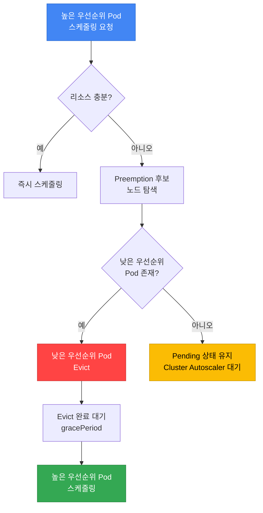

**Preemption 의사결정 과정:**

1. **높은 우선순위 Pod 스케줄링 실패**
2. **Preemption 후보 노드 탐색**: 낮은 우선순위 Pod를 제거하면 스케줄링 가능한 노드 찾기
3. **Victim Pod 선택**: 가장 낮은 우선순위부터 제거 대상 선정
4. **PDB 확인**: Victim Pod가 PDB로 보호되는지 확인 → PDB 위반 시 다른 노드 탐색
5. **Graceful Eviction**: `terminationGracePeriodSeconds` 존중하며 Evict
6. **리소스 확보 후 스케줄링**: 높은 우선순위 Pod 배치

:::tip Preemption과 PDB의 관계
Preemption은 PDB를 **존중합니다**. PDB의 `minAvailable`을 위반하는 Eviction은 발생하지 않습니다. 즉, PDB가 설정된 낮은 우선순위 Pod도 보호받을 수 있습니다.
:::

**Preemption 예시 시나리오:**

```yaml
# 현재 클러스터 상태: 노드 리소스가 거의 가득 참
# Node-1: low-priority-pod (CPU: 2, Memory: 4Gi)
# Node-2: standard-priority-pod (CPU: 2, Memory: 4Gi)

# 높은 우선순위 Pod 생성 요청
apiVersion: v1
kind: Pod
metadata:
  name: critical-payment
spec:
  priorityClassName: business-critical  # 우선순위: 1000000
  containers:
  - name: payment
    image: payment:v1.0
    resources:
      requests:
        cpu: "2"
        memory: 4Gi

# 결과:
# 1. 스케줄러가 리소스 부족 감지
# 2. low-priority-pod (우선순위: 1000)를 Victim으로 선택
# 3. low-priority-pod Evict (graceful shutdown)
# 4. critical-payment Pod 스케줄링
```

### 7.4 PreemptionPolicy: Never

특정 워크로드가 다른 Pod를 Preempt하지 않도록 설정할 수 있습니다:

```yaml
apiVersion: scheduling.k8s.io/v1
kind: PriorityClass
metadata:
  name: batch-job
value: 5000
globalDefault: false
preemptionPolicy: Never  # 다른 Pod를 Preempt하지 않음
description: "Batch jobs that wait for available resources"
```

**사용 사례:**
- **배치 작업**: 리소스가 생길 때까지 대기하는 것이 더 나은 경우
- **테스트/개발 워크로드**: 프로덕션 워크로드를 방해하지 않아야 할 때
- **낮은 긴급성**: 즉시 실행되지 않아도 괜찮은 작업

### 7.5 Priority + QoS Class 조합 고급 패턴

PriorityClass와 QoS Class는 서로 다른 목적을 가진 메커니즘이지만, 함께 사용하면 리소스 부족 상황에서 더욱 예측 가능한 동작을 보장할 수 있습니다. 이 섹션에서는 두 개념의 상호작용과 프로덕션 환경에서 검증된 조합 패턴을 소개합니다.

#### QoS Class 복습

Kubernetes는 Pod의 리소스 요청(requests)과 제한(limits) 설정에 따라 자동으로 QoS Class를 할당합니다.

| QoS Class | 조건 | CPU 스로틀링 | OOM 시 Eviction 순서 | 일반적 사용 |
|-----------|------|-------------|-------------------|------------|
| **Guaranteed** | 모든 컨테이너의 requests = limits | 제한 도달 시만 | 마지막 (가장 안전) | 미션 크리티컬, DB |
| **Burstable** | 최소 하나의 컨테이너에 requests 설정, requests < limits | 제한 도달 시만 | 중간 | 일반 웹 앱, API |
| **BestEffort** | requests/limits 모두 미설정 | 제한 없음 | 가장 먼저 (위험) | 배치 작업, 테스트 |

**QoS Class 결정 규칙:**

```yaml
# Guaranteed: requests = limits (모든 컨테이너)
resources:
  requests:
    cpu: "1"
    memory: 2Gi
  limits:
    cpu: "1"      # requests와 동일
    memory: 2Gi   # requests와 동일

# Burstable: requests < limits
resources:
  requests:
    cpu: "500m"
    memory: 1Gi
  limits:
    cpu: "2"      # requests보다 큼
    memory: 4Gi   # requests보다 큼

# BestEffort: 아무것도 설정 안함
resources: {}
```

**QoS Class 확인:**
```bash
# Pod의 QoS Class 확인
kubectl get pod my-pod -o jsonpath='{.status.qosClass}'

# 네임스페이스 전체 Pod의 QoS 분포
kubectl get pods -n production \
  -o custom-columns=NAME:.metadata.name,QOS:.status.qosClass
```

#### 권장 조합 매트릭스

Priority와 QoS를 어떻게 조합할지에 따라 리소스 보장 수준과 비용이 달라집니다.

| 조합 | Priority | QoS | 스케줄링 우선순위 | OOM 시 생존율 | 비용 | 권장 워크로드 | 예시 |
|------|----------|-----|-----------------|-------------|------|-------------|------|
| **Tier 1** | critical (10000) | Guaranteed | 최우선 | 최고 | 높음 | 미션 크리티컬 | 결제 시스템, DB |
| **Tier 2** | high (5000) | Guaranteed | 높음 | 높음 | 중상 | 핵심 서비스 | API 게이트웨이 |
| **Tier 3** | standard (1000) | Burstable | 보통 | 중간 | 중간 | 일반 웹 앱 | 프론트엔드, 백오피스 |
| **Tier 4** | low (500) | Burstable | 낮음 | 낮음 | 저렴 | 내부 도구 | 모니터링, 로깅 |
| **Tier 5** | batch (100) | BestEffort | 최하위 | 매우 낮음 | 매우 저렴 | 배치, CI/CD | 데이터 파이프라인 |

**조합별 상세 설명:**

##### Tier 1: Guaranteed + critical-priority (최고 보장)

**특징:**
- 스케줄링 시 다른 Pod를 Preempt하여 즉시 배치
- CPU/메모리 보장 (requests = limits)
- OOM 발생 시 가장 마지막에 종료
- 노드 리소스 압박 시에도 절대 Evict되지 않음

**실전 YAML:**
```yaml
apiVersion: apps/v1
kind: Deployment
metadata:
  name: payment-gateway
  namespace: production
spec:
  replicas: 6
  selector:
    matchLabels:
      app: payment-gateway
      tier: critical
  template:
    metadata:
      labels:
        app: payment-gateway
        tier: critical
    spec:
      priorityClassName: critical-priority  # Priority: 10000
      containers:
      - name: gateway
        image: payment-gateway:v3.5
        resources:
          requests:
            cpu: "2"
            memory: 4Gi
          limits:
            cpu: "2"       # requests와 동일 → Guaranteed
            memory: 4Gi    # requests와 동일 → Guaranteed
        livenessProbe:
          httpGet:
            path: /health
            port: 8080
          initialDelaySeconds: 30
          periodSeconds: 10
        readinessProbe:
          httpGet:
            path: /ready
            port: 8080
          initialDelaySeconds: 10
          periodSeconds: 5
---
apiVersion: policy/v1
kind: PodDisruptionBudget
metadata:
  name: payment-gateway-pdb
  namespace: production
spec:
  minAvailable: 4  # 6개 중 최소 4개 항상 유지
  selector:
    matchLabels:
      app: payment-gateway
```

**사용 시나리오:**
- 금융 거래 시스템 (결제, 송금)
- 실시간 주문 처리
- 데이터베이스 (MySQL, PostgreSQL)
- 메시지 큐 (Kafka, RabbitMQ)

##### Tier 2: Guaranteed + high-priority (핵심 서비스)

**특징:**
- critical 다음 우선순위
- CPU/메모리 보장
- OOM 시 BestEffort, Burstable 다음으로 종료
- 일반적인 프로덕션 서비스의 권장 설정

**실전 YAML:**
```yaml
apiVersion: apps/v1
kind: Deployment
metadata:
  name: api-server
  namespace: production
spec:
  replicas: 10
  selector:
    matchLabels:
      app: api-server
  template:
    metadata:
      labels:
        app: api-server
    spec:
      priorityClassName: high-priority  # Priority: 5000
      containers:
      - name: api
        image: api-server:v2.8
        resources:
          requests:
            cpu: "1"
            memory: 2Gi
          limits:
            cpu: "1"       # Guaranteed
            memory: 2Gi    # Guaranteed
        env:
        - name: MAX_CONNECTIONS
          value: "1000"
```

**사용 시나리오:**
- REST API 서버
- GraphQL 서버
- 인증/인가 서비스
- 세션 관리 서비스

##### Tier 3: Burstable + standard-priority (일반 웹 앱)

**특징:**
- 기본 리소스 보장 (requests)
- 유휴 시 추가 리소스 사용 가능 (limits > requests)
- 비용 효율적이면서 안정적
- 대부분의 웹 애플리케이션에 적합

**실전 YAML:**
```yaml
apiVersion: apps/v1
kind: Deployment
metadata:
  name: web-frontend
  namespace: production
spec:
  replicas: 8
  selector:
    matchLabels:
      app: web-frontend
  template:
    metadata:
      labels:
        app: web-frontend
    spec:
      priorityClassName: standard-priority  # Priority: 1000
      containers:
      - name: frontend
        image: web-frontend:v1.12
        resources:
          requests:
            cpu: "500m"    # 최소 보장
            memory: 1Gi    # 최소 보장
          limits:
            cpu: "2"       # 최대 4배 버스트 허용
            memory: 4Gi    # 최대 4배 버스트 허용
        env:
        - name: NODE_ENV
          value: "production"
```

**사용 시나리오:**
- 웹 프론트엔드 (React, Vue, Angular)
- 백오피스 애플리케이션
- 내부 대시보드
- CMS (Content Management System)

##### Tier 4: Burstable + low-priority (내부 도구)

**특징:**
- 최소한의 리소스 보장
- 리소스 부족 시 Preempt 대상
- 비용 최소화
- 서비스 중단 시 영향 제한적

**실전 YAML:**
```yaml
apiVersion: apps/v1
kind: Deployment
metadata:
  name: monitoring-agent
  namespace: monitoring
spec:
  replicas: 3
  selector:
    matchLabels:
      app: monitoring-agent
  template:
    metadata:
      labels:
        app: monitoring-agent
    spec:
      priorityClassName: low-priority  # Priority: 500
      containers:
      - name: agent
        image: monitoring-agent:v2.1
        resources:
          requests:
            cpu: "100m"    # 최소한의 보장
            memory: 256Mi
          limits:
            cpu: "500m"
            memory: 1Gi
```

**사용 시나리오:**
- 모니터링 에이전트
- 로그 수집기 (Fluent Bit, Fluentd)
- 메트릭 Exporter
- 개발 도구

##### Tier 5: BestEffort + batch-priority (배치 작업)

**특징:**
- 리소스 보장 없음 (유휴 리소스만 사용)
- OOM 발생 시 가장 먼저 종료
- 비용 최소화 (Spot 인스턴스 활용 가능)
- 재시도 가능한 작업에 적합

**실전 YAML:**
```yaml
apiVersion: batch/v1
kind: CronJob
metadata:
  name: data-pipeline
  namespace: batch
spec:
  schedule: "0 2 * * *"  # 매일 새벽 2시
  jobTemplate:
    spec:
      template:
        spec:
          priorityClassName: batch-priority  # Priority: 100
          restartPolicy: OnFailure
          containers:
          - name: etl
            image: data-pipeline:v1.8
            resources: {}  # BestEffort: requests/limits 없음
            env:
            - name: BATCH_SIZE
              value: "10000"
          # Spot 인스턴스에 배치
          nodeSelector:
            karpenter.sh/capacity-type: spot
          tolerations:
          - key: karpenter.sh/capacity-type
            operator: Equal
            value: spot
            effect: NoSchedule
```

**사용 시나리오:**
- ETL 파이프라인
- 데이터 분석 작업
- CI/CD 빌드
- 이미지/동영상 처리

#### Eviction 순서 (OOM 발생 시)

노드에서 메모리가 부족할 때, Kubelet은 다음 순서로 Pod를 종료합니다:

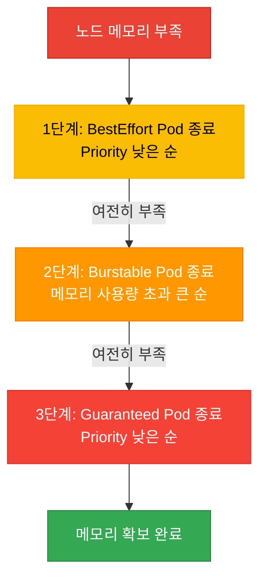

**Eviction 결정 요소:**

1. **QoS Class** (1차 기준)
   - BestEffort → Burstable → Guaranteed 순서

2. **Priority** (2차 기준, QoS 동일 시)
   - 낮은 Priority 먼저 종료

3. **메모리 사용량** (3차 기준, QoS + Priority 동일 시)
   - requests 대비 초과 사용량이 큰 Pod 먼저 종료

**예시 시나리오:**

```yaml
# 노드 상황: 메모리 32GB 중 31GB 사용, OOM 임박

# Pod 1: BestEffort + low-priority (500)
# - 사용 중: 4GB
# → Eviction 순서: 1위

# Pod 2: Burstable + standard-priority (1000)
# - requests: 2GB, limits: 8GB
# - 사용 중: 6GB (requests 대비 +4GB 초과)
# → Eviction 순서: 2위

# Pod 3: Burstable + high-priority (5000)
# - requests: 4GB, limits: 8GB
# - 사용 중: 5GB (requests 대비 +1GB 초과)
# → Eviction 순서: 3위

# Pod 4: Guaranteed + critical-priority (10000)
# - requests = limits: 8GB
# - 사용 중: 8GB (초과 없음)
# → Eviction 순서: 4위 (마지막)
```

#### Kubelet Eviction 설정

Kubelet의 Eviction 임계값은 노드 수준에서 설정됩니다. EKS에서는 User Data 스크립트로 커스터마이징 가능합니다.

**기본 설정 (EKS):**
```yaml
# /etc/kubernetes/kubelet/kubelet-config.json
{
  "evictionHard": {
    "memory.available": "100Mi",
    "nodefs.available": "10%",
    "imagefs.available": "15%"
  },
  "evictionSoft": {
    "memory.available": "500Mi",
    "nodefs.available": "15%"
  },
  "evictionSoftGracePeriod": {
    "memory.available": "1m30s",
    "nodefs.available": "2m"
  }
}
```

**커스터마이징 예시 (Karpenter EC2NodeClass):**
```yaml
apiVersion: karpenter.k8s.aws/v1
kind: EC2NodeClass
metadata:
  name: custom-eviction
spec:
  amiFamily: AL2023
  userData: |
    #!/bin/bash
    # Kubelet 설정 수정
    cat <<EOF > /etc/kubernetes/kubelet/kubelet-config.json
    {
      "evictionHard": {
        "memory.available": "200Mi",  # 더 보수적으로 설정
        "nodefs.available": "10%"
      },
      "evictionSoft": {
        "memory.available": "1Gi",    # Soft 임계값 상향
        "nodefs.available": "15%"
      },
      "evictionSoftGracePeriod": {
        "memory.available": "2m",     # 유예 시간 증가
        "nodefs.available": "3m"
      }
    }
    EOF

    systemctl restart kubelet
```

**Eviction 임계값 설명:**

| 설정 | 의미 | 기본값 | 권장값 (프로덕션) |
|------|------|--------|-----------------|
| `evictionHard.memory.available` | 이 수준 이하 시 즉시 Eviction | 100Mi | 200~500Mi |
| `evictionSoft.memory.available` | 이 수준 이하로 일정 시간 유지 시 Eviction | 500Mi | 1Gi |
| `evictionSoftGracePeriod.memory.available` | Soft 임계값 유예 시간 | 1m30s | 2~5m |

:::warning Eviction 설정 시 주의사항
`evictionHard` 임계값을 너무 낮게 설정하면 OOM Killer가 먼저 동작하여 Kubelet의 graceful eviction이 무용지물이 됩니다. 반대로 너무 높게 설정하면 노드 리소스 활용률이 낮아져 비용이 증가합니다.

**권장 접근:**
- 일반 워크로드: `evictionHard: 200Mi`, `evictionSoft: 1Gi`
- 메모리 집약적: `evictionHard: 500Mi`, `evictionSoft: 2Gi`
- 모니터링: `kube_node_status_condition{condition="MemoryPressure"}` 메트릭 추적
:::

#### 실전 조합 패턴 검증

**패턴 1: Multi-Tier 아키텍처**

```yaml
# Tier 1: Database (Guaranteed + critical)
apiVersion: apps/v1
kind: StatefulSet
metadata:
  name: postgres
spec:
  serviceName: postgres
  replicas: 3
  template:
    spec:
      priorityClassName: critical-priority
      containers:
      - name: postgres
        image: postgres:16
        resources:
          requests:
            cpu: "4"
            memory: 16Gi
          limits:
            cpu: "4"
            memory: 16Gi
---
# Tier 2: API Server (Guaranteed + high)
apiVersion: apps/v1
kind: Deployment
metadata:
  name: api-server
spec:
  replicas: 10
  template:
    spec:
      priorityClassName: high-priority
      containers:
      - name: api
        resources:
          requests: { cpu: "1", memory: 2Gi }
          limits: { cpu: "1", memory: 2Gi }
---
# Tier 3: Frontend (Burstable + standard)
apiVersion: apps/v1
kind: Deployment
metadata:
  name: frontend
spec:
  replicas: 8
  template:
    spec:
      priorityClassName: standard-priority
      containers:
      - name: frontend
        resources:
          requests: { cpu: "500m", memory: 1Gi }
          limits: { cpu: "2", memory: 4Gi }
---
# Tier 4: Monitoring (Burstable + low)
apiVersion: apps/v1
kind: DaemonSet
metadata:
  name: node-exporter
spec:
  template:
    spec:
      priorityClassName: low-priority
      containers:
      - name: exporter
        resources:
          requests: { cpu: "100m", memory: 128Mi }
          limits: { cpu: "200m", memory: 256Mi }
```

**검증 명령어:**
```bash
# QoS + Priority 분포 확인
kubectl get pods -A -o custom-columns=\
NAME:.metadata.name,\
NAMESPACE:.metadata.namespace,\
QOS:.status.qosClass,\
PRIORITY:.spec.priorityClassName,\
CPU_REQ:.spec.containers[0].resources.requests.cpu,\
MEM_REQ:.spec.containers[0].resources.requests.memory

# 노드별 QoS 분포 확인
kubectl describe node <node-name> | grep -A 10 "Non-terminated Pods"
```

#### 트러블슈팅: QoS + Priority 조합 문제

| 증상 | 원인 | 해결 방법 |
|------|------|----------|
| Guaranteed Pod가 OOM Kill됨 | limits 설정이 너무 낮음 | 메모리 프로파일링 후 limits 상향 |
| Burstable Pod가 CPU 스로틀링 | limits 도달, 노드 리소스 부족 | requests 상향 또는 노드 추가 |
| Low-priority Pod가 계속 Pending | High-priority Pod가 리소스 독점 | 노드 추가 또는 Priority 재조정 |
| BestEffort Pod가 즉시 종료됨 | Eviction 임계값 도달 | Burstable로 전환, requests 설정 |

:::tip QoS + Priority 최적화 팁
1. **모니터링**: Prometheus의 `container_memory_working_set_bytes`, `container_cpu_usage_seconds_total` 메트릭으로 실제 사용량 추적
2. **Rightsizing**: VPA(Vertical Pod Autoscaler) 권장값 참고
3. **단계적 전환**: BestEffort → Burstable → Guaranteed 순으로 점진적 적용
4. **비용 균형**: 모든 Pod를 Guaranteed로 설정하면 비용 증가, 워크로드 중요도에 따라 차등 적용
:::

---

## 8. Descheduler

Descheduler는 이미 스케줄링된 Pod를 **재배치**하여 클러스터의 균형을 맞추는 도구입니다. Kubernetes 스케줄러는 초기 배치만 담당하므로, 시간이 지나면 노드 간 불균형이 발생할 수 있습니다.

### 8.1 Descheduler가 필요한 이유

**시나리오 1: 노드 추가 후 불균형**
- 기존 노드에 Pod가 몰려있고, 새로 추가된 노드는 비어있음
- Descheduler가 오래된 Pod를 Evict → 스케줄러가 새 노드에 재배치

**시나리오 2: Affinity/Anti-Affinity 위반**
- Pod 배치 후 노드 레이블이 변경되어 Affinity 조건 위반
- Descheduler가 위반 Pod를 Evict → 조건에 맞는 노드에 재배치

**시나리오 3: 리소스 파편화**
- 일부 노드는 CPU 과다 사용, 일부는 유휴 상태
- Descheduler가 불균형 해소

### 8.2 Descheduler 설치 (Helm)

```bash
# Descheduler Helm Chart 추가
helm repo add descheduler https://kubernetes-sigs.github.io/descheduler/
helm repo update

# 기본 설치
helm install descheduler descheduler/descheduler \
  --namespace kube-system \
  --set cronJobApiVersion="batch/v1" \
  --set schedule="*/15 * * * *"  # 15분마다 실행
```

**CronJob vs Deployment 모드:**

| 모드 | 실행 주기 | 리소스 사용 | 권장 환경 |
|------|----------|------------|----------|
| **CronJob** | 주기적 (예: 15분) | 실행 시만 리소스 사용 | 소~중규모 클러스터 (권장) |
| **Deployment** | 지속적 실행 | 항상 리소스 사용 | 대규모 클러스터 (1000+ 노드) |

### 8.3 주요 Descheduler 전략

#### 전략 1: RemoveDuplicates

**목적**: 같은 Controller(ReplicaSet, Deployment)의 Pod가 한 노드에 중복 배치된 경우, 분산시킴

```yaml
apiVersion: v1
kind: ConfigMap
metadata:
  name: descheduler-policy
  namespace: kube-system
data:
  policy.yaml: |
    apiVersion: "descheduler/v1alpha2"
    kind: "DeschedulerPolicy"
    profiles:
      - name: default
        pluginConfig:
        - name: RemoveDuplicates
          args:
            # 노드당 같은 Controller의 Pod 1개만 유지
            excludeOwnerKinds:
            - "ReplicaSet"
            - "StatefulSet"
        plugins:
          balance:
            enabled:
            - RemoveDuplicates
```

**효과**: 같은 Deployment의 replica가 여러 개 한 노드에 있으면, 일부를 Evict하여 다른 노드로 분산

#### 전략 2: LowNodeUtilization

**목적**: 리소스 사용률이 낮은 노드와 높은 노드 간 균형 조정

```yaml
apiVersion: v1
kind: ConfigMap
metadata:
  name: descheduler-policy
  namespace: kube-system
data:
  policy.yaml: |
    apiVersion: "descheduler/v1alpha2"
    kind: "DeschedulerPolicy"
    profiles:
      - name: default
        pluginConfig:
        - name: LowNodeUtilization
          args:
            # 낮은 사용률 기준 (이 이하면 underutilized)
            thresholds:
              cpu: 20
              memory: 20
              pods: 20
            # 높은 사용률 기준 (이 이상이면 overutilized)
            targetThresholds:
              cpu: 50
              memory: 50
              pods: 50
        plugins:
          balance:
            enabled:
            - LowNodeUtilization
```

**동작:**
1. CPU/Memory/Pod 수가 20% 미만인 노드 식별 (underutilized)
2. 50% 이상인 노드 식별 (overutilized)
3. overutilized 노드에서 Pod를 Evict
4. Kubernetes 스케줄러가 underutilized 노드에 재배치

#### 전략 3: RemovePodsViolatingNodeAffinity

**목적**: Node Affinity 조건을 위반하는 Pod 제거 (노드 레이블 변경 후)

```yaml
apiVersion: v1
kind: ConfigMap
metadata:
  name: descheduler-policy
  namespace: kube-system
data:
  policy.yaml: |
    apiVersion: "descheduler/v1alpha2"
    kind: "DeschedulerPolicy"
    profiles:
      - name: default
        pluginConfig:
        - name: RemovePodsViolatingNodeAffinity
          args:
            nodeAffinityType:
            - requiredDuringSchedulingIgnoredDuringExecution
        plugins:
          deschedule:
            enabled:
            - RemovePodsViolatingNodeAffinity
```

**시나리오**: GPU 노드에서 `gpu=true` 레이블 제거 → GPU 요구 Pod가 레이블 없는 노드에 남음 → Descheduler가 Evict → GPU 노드에 재배치

#### 전략 4: RemovePodsViolatingInterPodAntiAffinity

**목적**: Pod Anti-Affinity 조건을 위반하는 Pod 제거

```yaml
apiVersion: v1
kind: ConfigMap
metadata:
  name: descheduler-policy
  namespace: kube-system
data:
  policy.yaml: |
    apiVersion: "descheduler/v1alpha2"
    kind: "DeschedulerPolicy"
    profiles:
      - name: default
        plugins:
          deschedule:
            enabled:
            - RemovePodsViolatingInterPodAntiAffinity
```

**시나리오**: 초기에는 노드가 충분하여 Anti-Affinity 만족 → 노드 축소로 같은 노드에 위반 Pod 배치 → 노드 추가 후 Descheduler가 재배치

#### 전략 5: RemovePodsHavingTooManyRestarts

**목적**: 과도하게 재시작되는 문제 있는 Pod 제거 (다른 노드에서 재시도)

```yaml
apiVersion: v1
kind: ConfigMap
metadata:
  name: descheduler-policy
  namespace: kube-system
data:
  policy.yaml: |
    apiVersion: "descheduler/v1alpha2"
    kind: "DeschedulerPolicy"
    profiles:
      - name: default
        pluginConfig:
        - name: RemovePodsHavingTooManyRestarts
          args:
            podRestartThreshold: 10  # 10회 이상 재시작 시 Evict
            includingInitContainers: true
        plugins:
          deschedule:
            enabled:
            - RemovePodsHavingTooManyRestarts
```

#### 전략 6: PodLifeTime

**목적**: 오래된 Pod를 제거하여 최신 이미지/설정으로 교체

```yaml
apiVersion: v1
kind: ConfigMap
metadata:
  name: descheduler-policy
  namespace: kube-system
data:
  policy.yaml: |
    apiVersion: "descheduler/v1alpha2"
    kind: "DeschedulerPolicy"
    profiles:
      - name: default
        pluginConfig:
        - name: PodLifeTime
          args:
            maxPodLifeTimeSeconds: 604800  # 7일 (7 * 24 * 3600)
            # 특정 상태의 Pod만 대상
            states:
            - Running
            # 특정 레이블의 Pod 제외
            labelSelector:
              matchExpressions:
              - key: app
                operator: NotIn
                values:
                - stateful-db
        plugins:
          deschedule:
            enabled:
            - PodLifeTime
```

### 8.4 Descheduler vs Karpenter Consolidation 비교

| 기능 | Descheduler | Karpenter Consolidation |
|------|------------|------------------------|
| **목적** | Pod 재배치 (균형) | 노드 제거 (비용 절감) |
| **범위** | Pod 레벨 | 노드 레벨 |
| **실행 주기** | CronJob (예: 15분) | 지속적 감시 (실시간) |
| **전략** | 다양한 전략 (6+개) | Empty / Underutilized 노드 |
| **PDB 존중** | ✅ 예 | ✅ 예 |
| **노드 추가/제거** | ❌ 아니오 | ✅ 예 |
| **Cluster Autoscaler 호환** | ✅ 예 | N/A (대체재) |
| **주요 사용 사례** | 불균형 해소, Affinity 위반 해결 | 비용 최적화, 노드 통합 |
| **함께 사용 가능** | ✅ Karpenter와 병행 가능 | ✅ Descheduler와 병행 가능 |

:::tip Descheduler + Karpenter 조합 권장
Descheduler는 Pod 재배치에 특화되고, Karpenter는 노드 관리에 특화되어 있습니다. 두 도구를 함께 사용하면 시너지가 발생합니다:
- Descheduler가 불균형 Pod를 Evict
- Kubernetes 스케줄러가 Pod를 다른 노드에 재배치
- Karpenter가 비어있는 노드를 제거하여 비용 절감
:::

**함께 사용하는 설정 예시:**

```yaml
# Descheduler: 15분마다 균형 조정
apiVersion: batch/v1
kind: CronJob
metadata:
  name: descheduler
  namespace: kube-system
spec:
  schedule: "*/15 * * * *"
  jobTemplate:
    spec:
      template:
        spec:
          containers:
          - name: descheduler
            image: registry.k8s.io/descheduler/descheduler:v0.29.0
            command:
            - /bin/descheduler
            - --policy-config-file=/policy/policy.yaml
---
# Karpenter: 지속적 노드 통합
apiVersion: karpenter.sh/v1
kind: NodePool
metadata:
  name: general
spec:
  disruption:
    consolidationPolicy: WhenEmptyOrUnderutilized
    consolidateAfter: 5m  # 5분 후 통합 시작
    budgets:
    - nodes: "20%"
```

#### 8.4.1 Descheduler + Karpenter 실전 조합 패턴

Descheduler와 Karpenter를 함께 사용하면 Pod 재배치와 노드 통합이 자동으로 조율되어 클러스터 효율성과 비용 절감을 동시에 달성할 수 있습니다.

**조합의 시너지 원리:**

1. **1단계 (Descheduler)**: 리소스 불균형 감지 및 Pod 재배치
   - `LowNodeUtilization` 전략으로 과도하게 사용되는 노드에서 Pod Evict
   - `RemoveDuplicates`, `RemovePodsViolatingNodeAffinity` 등으로 불필요한 Pod 재배치

2. **2단계 (Kubernetes Scheduler)**: Evict된 Pod를 최적의 노드에 재스케줄링
   - 리소스 여유가 있는 노드 선택
   - Affinity/Anti-Affinity, Topology Spread 조건 만족

3. **3단계 (Karpenter)**: 비어있거나 저활용 노드 제거
   - `consolidateAfter` 시간 경과 후 빈 노드 통합
   - 여러 저활용 노드의 Pod를 더 작은 수의 노드로 통합
   - 불필요한 노드 종료로 비용 절감

**타이밍 조율 예시:**

```yaml
# Descheduler: 15분 주기로 LowNodeUtilization 실행
apiVersion: v1
kind: ConfigMap
metadata:
  name: descheduler-policy
  namespace: kube-system
data:
  policy.yaml: |
    apiVersion: "descheduler/v1alpha2"
    kind: "DeschedulerPolicy"
    profiles:
      - name: default
        pluginConfig:
        - name: LowNodeUtilization
          args:
            thresholds:
              cpu: 20
              memory: 20
              pods: 20
            targetThresholds:
              cpu: 50
              memory: 50
              pods: 50
        plugins:
          balance:
            enabled:
            - LowNodeUtilization
---
# Karpenter: 5분 후 빈 노드 통합 (Descheduler 실행 후 충분한 시간 부여)
apiVersion: karpenter.sh/v1
kind: NodePool
metadata:
  name: general-pool
spec:
  disruption:
    consolidationPolicy: WhenEmptyOrUnderutilized
    consolidateAfter: 5m  # Descheduler가 Pod를 이동시킨 후 5분 대기
    budgets:
    - nodes: "20%"  # 동시에 최대 20% 노드만 통합
  template:
    spec:
      requirements:
      - key: karpenter.sh/capacity-type
        operator: In
        values: ["on-demand", "spot"]
      - key: kubernetes.io/arch
        operator: In
        values: ["amd64"]
```

**실제 동작 시나리오:**

```
시간: 00:00 - Descheduler 실행 (15분 주기)
  └─ Node-A (CPU 80%, Memory 85%) → overutilized 감지
  └─ Node-B (CPU 15%, Memory 10%) → underutilized 감지
  └─ Node-A에서 Pod-1, Pod-2 Evict

시간: 00:01 - Kubernetes Scheduler 재배치
  └─ Pod-1 → Node-B로 스케줄링
  └─ Pod-2 → Node-C로 스케줄링
  └─ Node-A는 이제 CPU 50%, Memory 55% (정상 범위)

시간: 00:06 - Karpenter 통합 (5분 경과)
  └─ Node-B: 여전히 저활용 상태지만 Pod 실행 중 → 유지
  └─ Node-D: 빈 노드 감지 (이전에 Pod가 있었으나 이동) → 종료
  └─ 비용 절감 달성
```

**PDB와의 상호작용:**

Descheduler와 Karpenter는 모두 PDB를 존중하므로, 안전한 조합이 가능합니다:

```yaml
# 애플리케이션 PDB 설정
apiVersion: policy/v1
kind: PodDisruptionBudget
metadata:
  name: api-server-pdb
spec:
  minAvailable: 2
  selector:
    matchLabels:
      app: api-server
---
# Descheduler와 Karpenter는 모두 이 PDB를 존중하며 동작
# - Descheduler: minAvailable을 위반하는 Eviction 차단
# - Karpenter: 노드 제거 시 minAvailable 보장
```

**주의사항: Pod Flapping 방지**

Descheduler와 Karpenter의 타이밍이 충돌하면 Pod가 반복적으로 이동하는 현상이 발생할 수 있습니다:

:::warning Pod Flapping 방지
Descheduler 실행 주기와 Karpenter `consolidateAfter` 간격을 적절히 조율하세요:
- **권장 패턴**: Descheduler 15분 주기 + Karpenter 5분 `consolidateAfter`
- **위험 패턴**: Descheduler 5분 주기 + Karpenter 1분 `consolidateAfter` (너무 빈번)
- **안전장치**: Karpenter `budgets`로 동시 통합 노드 수 제한
:::

**모니터링 및 검증:**

```bash
# 1. Descheduler 로그 확인
kubectl logs -n kube-system -l app=descheduler --tail=50

# 2. Karpenter 통합 이벤트 확인
kubectl logs -n karpenter -l app.kubernetes.io/name=karpenter --tail=50 | grep consolidation

# 3. 노드별 Pod 분포 확인
kubectl get pods -A -o wide | awk '{print $8}' | sort | uniq -c

# 4. 노드 리소스 사용률 확인
kubectl top nodes

# 5. PDB 상태 확인 (Eviction 차단 여부)
kubectl get pdb -A
```

**조합의 장점:**

| 장점 | 설명 |
|------|------|
| **자동 균형 조정** | Descheduler가 리소스 불균형 자동 해소 |
| **비용 최적화** | Karpenter가 불필요한 노드 제거 |
| **안전성 보장** | PDB 존중으로 서비스 중단 방지 |
| **운영 부담 감소** | 수동 개입 없이 자동 조율 |
| **확장성** | 클러스터 규모에 관계없이 동작 |

---

## 9. EKS 스케줄링 종합 전략

### 9.1 워크로드 유형별 스케줄링 설정 매트릭스

아래 표는 다양한 워크로드 유형에 대한 권장 스케줄링 설정을 정리한 것입니다.

| 워크로드 유형 | Node Selector/Affinity | Pod Anti-Affinity | Topology Spread | Taints/Tolerations | PriorityClass | PDB | 추가 고려사항 |
|-------------|----------------------|-------------------|-----------------|-------------------|---------------|-----|-------------|
| **API 서버** | On-Demand 노드 | Soft (노드 분산) | Hard (AZ 분산) | - | `high-priority` | `minAvailable: "67%"` | Readiness Probe 필수 |
| **결제 서비스** | On-Demand, 특정 인스턴스 타입 | Hard (노드 분산) | Hard (AZ 분산, minDomains: 3) | - | `business-critical` | `minAvailable: 2` | PCI-DSS 준수 노드 |
| **ML 학습** | GPU 노드 (g5.xlarge+) | Soft (노드 분산) | - | GPU Taint Tolerate | `high-priority` | `maxUnavailable: 1` | Spot 가능 (checkpointing 있을 때) |
| **ML 추론** | GPU 노드 | Hard (AZ 분산) | Hard (AZ 분산) | GPU Taint Tolerate | `high-priority` | `minAvailable: 2` | On-Demand 권장 |
| **데이터베이스 (StatefulSet)** | EBS 가용 노드, WaitForFirstConsumer | Hard (노드 분산) | Hard (AZ 분산) | - | `business-critical` | `maxUnavailable: 1` | PVC 백업 필수 |
| **캐시 (Redis)** | Memory 최적화 노드 (r6i) | Hard (노드 분산) | Hard (AZ 분산) | - | `high-priority` | `minAvailable: 2` | Persistence 설정 |
| **배치 작업** | Spot 노드 허용 | - | - | Spot Tolerate | `low-priority`, `preemptionPolicy: Never` | - | 재시작 가능 설계 |
| **CI/CD Runner** | Spot 노드 선호 | - | - | Spot Tolerate | `low-priority` | - | Ephemeral 작업 |
| **로그 수집 (DaemonSet)** | 모든 노드 | - | - | 모든 Taint Tolerate | `system-critical` | - | `hostPath` 사용 |
| **Ingress Controller** | On-Demand | Hard (노드 분산) | Hard (AZ 분산) | - | `high-priority` | `minAvailable: 2` | NodePort / LB 구성 |
| **모니터링 (Prometheus)** | 전용 모니터링 노드 | Soft (노드 분산) | Soft (AZ 분산) | 모니터링 Taint Tolerate | `high-priority` | `minAvailable: 1` | 대용량 스토리지 |
| **웹 프론트엔드** | ARM 노드 가능 | Soft (노드 분산) | Hard (AZ 분산) | - | `standard-priority` | `minAvailable: "50%"` | CDN 통합 |
| **백그라운드 워커** | Spot 노드 | - | Soft (AZ 분산) | Spot Tolerate | `standard-priority` | `maxUnavailable: "50%"` | 재시도 로직 필수 |
| **Serverless (Knative)** | Spot + On-Demand 혼합 | - | Soft (AZ 분산) | - | `standard-priority` | - | Scale-to-zero 설정 |
| **AI/ML 학습** | GPU 노드 (g5.xlarge+) | Soft (노드 분산) | Soft (AZ 분산) | GPU Taint Tolerate | `high-priority` | `maxUnavailable: 1` | Checkpointing, Spot 가능 |
| **AI/ML 추론** | GPU/Inferentia 노드 | Hard (노드 분산) | Hard (AZ 분산) | GPU Taint Tolerate | `high-priority` | `minAvailable: 2` | On-Demand 권장 |

### 9.2 AI/ML 워크로드 스케줄링 패턴

AI/ML 워크로드는 GPU, 대용량 메모리, 특수 가속기(Inferentia, Trainium) 등의 리소스를 필요로 하며, 학습과 추론의 요구사항이 크게 다릅니다.

#### 9.2.1 GPU 워크로드 스케줄링

GPU 워크로드는 전용 노드 격리, 리소스 요청, Node Affinity를 조합하여 효율적으로 스케줄링합니다.

**GPU 리소스 요청 패턴:**

```yaml
apiVersion: v1
kind: Pod
metadata:
  name: gpu-training-job
spec:
  containers:
  - name: trainer
    image: ml/trainer:v3.0
    resources:
      requests:
        nvidia.com/gpu: 1  # GPU 1개 요청
        cpu: "4"
        memory: 16Gi
      limits:
        nvidia.com/gpu: 1  # limits는 requests와 동일하게 설정
        cpu: "4"
        memory: 16Gi
```

:::info GPU 리소스 관리
`nvidia.com/gpu`는 정수 단위로만 요청 가능하며, limits는 requests와 동일해야 합니다. GPU는 오버커밋(overcommit)이 불가능하므로 fractional GPU가 필요하면 Multi-Instance GPU(MIG) 또는 Time-Slicing을 고려하세요.
:::

**GPU 전용 NodePool + 워크로드 배포:**

```yaml
# Karpenter NodePool: GPU 전용 노드 그룹
apiVersion: karpenter.sh/v1
kind: NodePool
metadata:
  name: gpu-pool
spec:
  template:
    spec:
      requirements:
      - key: node.kubernetes.io/instance-type
        operator: In
        values:
        - g5.xlarge   # 1x NVIDIA A10G, 4 vCPU, 16 GiB
        - g5.2xlarge  # 1x NVIDIA A10G, 8 vCPU, 32 GiB
        - g5.4xlarge  # 1x NVIDIA A10G, 16 vCPU, 64 GiB
        - g5.12xlarge # 4x NVIDIA A10G, 48 vCPU, 192 GiB
      - key: karpenter.sh/capacity-type
        operator: In
        values:
        - on-demand  # 학습 워크로드는 On-Demand 권장
      # GPU 전용 노드 격리
      taints:
      - key: nvidia.com/gpu
        value: present
        effect: NoSchedule
      - key: workload-type
        value: ml-training
        effect: NoSchedule
      nodeClassRef:
        group: karpenter.k8s.aws
        kind: EC2NodeClass
        name: gpu-nodes
  limits:
    cpu: "200"
    memory: 800Gi
  disruption:
    consolidationPolicy: WhenEmpty
    consolidateAfter: 10m  # 빈 GPU 노드는 10분 후 제거 (비용 절감)
---
# EC2NodeClass: GPU 노드 구성
apiVersion: karpenter.k8s.aws/v1
kind: EC2NodeClass
metadata:
  name: gpu-nodes
spec:
  amiFamily: AL2
  amiSelectorTerms:
  - alias: al2@latest  # GPU 드라이버 포함된 EKS-optimized AMI
  role: KarpenterNodeRole
  subnetSelectorTerms:
  - tags:
      karpenter.sh/discovery: my-cluster
  securityGroupSelectorTerms:
  - tags:
      karpenter.sh/discovery: my-cluster
  userData: |
    #!/bin/bash
    # NVIDIA 컨테이너 런타임 설정 (이미 AMI에 포함됨)
    echo "GPU node initialized"
---
# ML 학습 워크로드: GPU 노드에 스케줄링
apiVersion: batch/v1
kind: Job
metadata:
  name: model-training
spec:
  parallelism: 4  # 4개 병렬 학습
  completions: 4
  template:
    metadata:
      labels:
        app: model-training
    spec:
      # GPU Taint Tolerate
      tolerations:
      - key: nvidia.com/gpu
        operator: Equal
        value: present
        effect: NoSchedule
      - key: workload-type
        operator: Equal
        value: ml-training
        effect: NoSchedule
      # GPU 노드 선택
      nodeSelector:
        node.kubernetes.io/instance-type: g5.2xlarge
      # Pod Anti-Affinity: 각 Job Pod를 다른 노드에 배치
      affinity:
        podAntiAffinity:
          preferredDuringSchedulingIgnoredDuringExecution:
          - weight: 100
            podAffinityTerm:
              labelSelector:
                matchExpressions:
                - key: app
                  operator: In
                  values:
                  - model-training
              topologyKey: kubernetes.io/hostname
      containers:
      - name: trainer
        image: ml/pytorch-trainer:v2.0
        resources:
          requests:
            nvidia.com/gpu: 1
            cpu: "7"
            memory: 28Gi
          limits:
            nvidia.com/gpu: 1
            cpu: "7"
            memory: 28Gi
        env:
        - name: NCCL_DEBUG
          value: "INFO"
        volumeMounts:
        - name: data
          mountPath: /data
        - name: checkpoints
          mountPath: /checkpoints
      volumes:
      - name: data
        persistentVolumeClaim:
          claimName: training-data
      - name: checkpoints
        persistentVolumeClaim:
          claimName: model-checkpoints
      restartPolicy: OnFailure
```

**Multi-Instance GPU (MIG) 활용:**

NVIDIA A100, A30 등의 GPU는 MIG를 지원하여 하나의 GPU를 여러 독립적인 인스턴스로 분할할 수 있습니다.

```yaml
# MIG 프로파일 요청 예시 (A100 GPU)
apiVersion: v1
kind: Pod
metadata:
  name: mig-inference
spec:
  containers:
  - name: inference
    image: ml/inference:v1.0
    resources:
      requests:
        nvidia.com/mig-1g.5gb: 1  # 1/7 A100 (1 GPU slice, 5GB memory)
      limits:
        nvidia.com/mig-1g.5gb: 1
```

**MIG 프로파일:**

| MIG 프로파일 | GPU Slice | 메모리 | 사용 사례 |
|-------------|-----------|--------|----------|
| `mig-1g.5gb` | 1/7 | 5GB | 소형 추론 |
| `mig-2g.10gb` | 2/7 | 10GB | 중형 추론 |
| `mig-3g.20gb` | 3/7 | 20GB | 대형 추론 |
| `mig-7g.40gb` | 7/7 | 40GB | 전체 GPU (학습) |

#### 9.2.2 DRA (Dynamic Resource Allocation) 소개

Kubernetes 1.34+에서는 Dynamic Resource Allocation(DRA)을 통해 GPU 등의 특수 리소스를 더 유연하게 할당할 수 있습니다.

**DRA의 장점:**

| 기존 방식 (Device Plugin) | DRA (K8s 1.34+) |
|-------------------------|----------------|
| 정적 리소스 이름 (`nvidia.com/gpu`) | 동적 리소스 클레임 |
| 노드 레벨 할당 | Pod 레벨 세밀한 제어 |
| 단순 카운팅 (1, 2, 3...) | 리소스 속성 기반 선택 |
| 제한적 공유 | 동적 공유/분할 |
| 노드 재시작 필요 | 런타임 재구성 |

**DRA ResourceClass 및 ResourceClaim 예시:**

```yaml
# ResourceClass: GPU 리소스 클래스 정의
apiVersion: resource.k8s.io/v1alpha4
kind: ResourceClass
metadata:
  name: nvidia-a100-gpu
spec:
  driverName: gpu.nvidia.com
  parameters:
    apiVersion: gpu.nvidia.com/v1alpha1
    kind: GpuConfig
    memory: "40Gi"
    computeCapability: "8.0"  # A100
    migEnabled: true
---
# ResourceClaim: GPU 리소스 요청
apiVersion: resource.k8s.io/v1alpha4
kind: ResourceClaim
metadata:
  name: ml-training-gpu
  namespace: ml-team
spec:
  resourceClassName: nvidia-a100-gpu
  parametersRef:
    apiGroup: gpu.nvidia.com
    kind: GpuClaimParameters
    name: training-params
---
# GpuClaimParameters: 세부 요구사항
apiVersion: gpu.nvidia.com/v1alpha1
kind: GpuClaimParameters
metadata:
  name: training-params
  namespace: ml-team
spec:
  count: 1  # GPU 1개
  migProfile: "mig-3g.20gb"  # MIG 프로파일 지정
  sharing: "TimeSlicing"  # 시간 분할 공유 허용
---
# Pod: ResourceClaim 사용
apiVersion: v1
kind: Pod
metadata:
  name: dra-training-pod
  namespace: ml-team
spec:
  resourceClaims:
  - name: gpu-claim
    resourceClaimName: ml-training-gpu
  containers:
  - name: trainer
    image: ml/trainer:v3.0
    resources:
      claims:
      - name: gpu-claim
    env:
    - name: CUDA_VISIBLE_DEVICES
      value: "0"
```

:::info DRA 도입 시기
DRA는 Kubernetes 1.34에서 Alpha, 1.36에서 Beta로 예상됩니다. 프로덕션 사용은 1.38+ Stable 이후를 권장합니다. 현재는 기존 Device Plugin 방식이 안정적입니다.
:::

#### 9.2.3 AI 학습 vs 추론 스케줄링 전략

AI/ML 워크로드는 학습(Training)과 추론(Inference)의 요구사항이 크게 다르므로, 각각에 맞는 스케줄링 전략이 필요합니다.

**학습 vs 추론 비교:**

| 비교 항목 | 학습 (Training) | 추론 (Inference) |
|----------|----------------|-----------------|
| **GPU 요구** | 대규모 (4-8+ GPU) | 소규모 (1-2 GPU) 또는 Inferentia |
| **실행 시간** | 장시간 (수 시간~수 일) | 짧은 지연 (ms~초) |
| **워크로드 타입** | 배치 작업 (Job) | 상시 서비스 (Deployment) |
| **인스턴스 타입** | g5, p4d, p5 (NVIDIA) | g5 (소형), inf2 (Inferentia), c7g (Graviton) |
| **Spot 사용** | ✅ 가능 (Checkpointing 필수) | ⚠️ 신중 (고가용성 필요) |
| **PriorityClass** | `standard-priority` | `high-priority` |
| **PDB** | `maxUnavailable: 1` (재시작 허용) | `minAvailable: 2` (가용성 보장) |
| **스케줄링 전략** | Soft Anti-Affinity (분산 선호) | Hard Anti-Affinity (장애 격리) |
| **비용 최적화** | Spot + Reserved Instances | On-Demand + Savings Plans |

**학습 워크로드 스케줄링 예시:**

```yaml
# 대규모 분산 학습: 8-GPU Job
apiVersion: batch/v1
kind: Job
metadata:
  name: distributed-training
spec:
  parallelism: 8
  completions: 8
  template:
    metadata:
      labels:
        app: distributed-training
    spec:
      tolerations:
      - key: nvidia.com/gpu
        operator: Exists
        effect: NoSchedule
      - key: karpenter.sh/capacity-type
        operator: Equal
        value: spot
        effect: NoSchedule  # Spot 노드 허용
      nodeSelector:
        node.kubernetes.io/instance-type: g5.12xlarge  # 4x A10G per node
      affinity:
        # Soft Anti-Affinity: 가능하면 다른 노드에 분산
        podAntiAffinity:
          preferredDuringSchedulingIgnoredDuringExecution:
          - weight: 100
            podAffinityTerm:
              labelSelector:
                matchLabels:
                  app: distributed-training
              topologyKey: kubernetes.io/hostname
      containers:
      - name: trainer
        image: ml/pytorch-distributed:v2.0
        resources:
          requests:
            nvidia.com/gpu: 4  # 노드당 4 GPU
            cpu: "45"
            memory: 180Gi
        env:
        - name: MASTER_ADDR
          value: "distributed-training-master"
        - name: WORLD_SIZE
          value: "8"  # 총 8개 프로세스
        - name: RANK
          valueFrom:
            fieldRef:
              fieldPath: metadata.name
        volumeMounts:
        - name: checkpoints
          mountPath: /checkpoints
      volumes:
      - name: checkpoints
        persistentVolumeClaim:
          claimName: training-checkpoints
      restartPolicy: OnFailure
```

#### 9.2.4 Setu: Kueue + Karpenter 프로액티브 스케줄링

분산 AI 학습 워크로드(예: PyTorch DDP, JAX)는 **Gang Scheduling** 요구사항을 가집니다. 모든 GPU 노드가 동시에 준비되지 않으면 리소스 낭비가 발생하거나 학습이 시작되지 않습니다. 기존 Karpenter는 **반응형(reactive)** 프로비저닝만 지원하여, Pod가 Pending 상태가 된 후에야 노드를 생성합니다. 이로 인해 다음과 같은 문제가 발생합니다:

**기존 Karpenter의 한계:**

| 문제 | 설명 | 영향 |
|------|------|------|
| **부분 할당 리스크** | 4-GPU 노드 4대가 필요한데 2대만 프로비저닝 성공 | 2대는 유휴 상태 유지, 비용 낭비 |
| **스케줄링 지연** | Pod Pending → Karpenter 감지 → EC2 프로비저닝 (순차 프로세스) | 분산 학습 시작까지 수 분 소요 |
| **원자성 부재** | 일부 노드만 생성되고 나머지는 용량 부족으로 실패 | 워크로드가 무한 대기 상태 |

**Setu 솔루션:**

Setu는 Kueue의 **AdmissionCheck**와 Karpenter의 **NodeClaim v1 API**를 브릿지하여, 워크로드 승인 전에 필요한 모든 노드를 **프로액티브하게** 프로비저닝합니다.

**동작 흐름:**

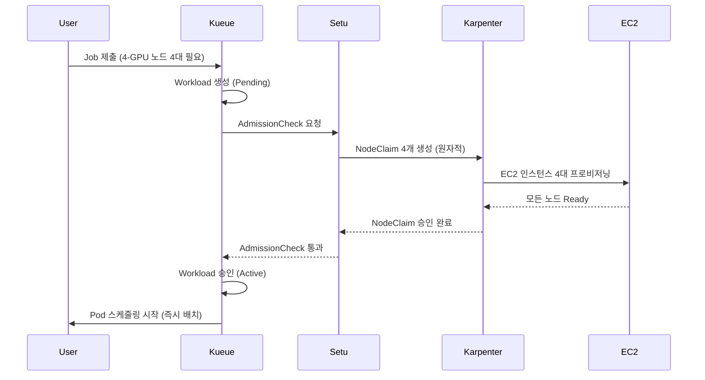

**Gang Scheduling과 스케줄링 안전성:**

Setu의 핵심 가치는 **All-or-Nothing** 보장입니다. 분산 학습 워크로드는 모든 replica가 동시에 실행되어야 의미가 있습니다.

| 시나리오 | 기존 Karpenter | Setu + Kueue |
|---------|---------------|-------------|
| **4-GPU 노드 4대 필요** | 2대만 생성 → 2대 유휴 → 비용 낭비 | 4대 모두 Ready 확인 후 승인 → 낭비 제로 |
| **노드 프로비저닝 실패** | 일부 Pod만 Running, 나머지 무한 Pending | 자동 롤백 + 지수 백오프 재시도 (5s-80s, 최대 5회) |
| **스케줄링 시작 시점** | 노드가 생성될 때마다 순차 스케줄링 | 모든 노드 Ready → 동시 스케줄링 |

**실패 처리 및 재시도 로직:**

Setu는 노드 프로비저닝 실패 시 지능적으로 대응합니다:

```
실패 시나리오:
1. NodeClaim 4개 중 3개만 성공 (1개는 Spot 용량 부족)
2. Setu가 실패 감지 → 모든 NodeClaim 삭제 (롤백)
3. 지수 백오프 재시도:
   - 1회 재시도: 5초 후
   - 2회 재시도: 10초 후
   - 3회 재시도: 20초 후
   - 4회 재시도: 40초 후
   - 5회 재시도: 80초 후 (최종)
4. 5회 실패 시 AdmissionCheck 영구 실패 → Kueue가 Workload 거부
```

**Kueue 통합 아키텍처:**

Setu는 Kueue의 AdmissionCheck CRD를 사용하여 워크로드 승인 프로세스에 통합됩니다.

```yaml
# 1. AdmissionCheck 정의: Setu 컨트롤러 지정
apiVersion: kueue.x-k8s.io/v1beta1
kind: AdmissionCheck
metadata:
  name: karpenter-provision
spec:
  controllerName: setu.io/karpenter-provision
---
# 2. ClusterQueue: AdmissionCheck 적용
apiVersion: kueue.x-k8s.io/v1beta1
kind: ClusterQueue
metadata:
  name: ml-training-queue
spec:
  namespaceSelector: {}
  resourceGroups:
  - coveredResources: ["cpu", "memory", "nvidia.com/gpu"]
    flavors:
    - name: gpu-flavor
      resources:
      - name: nvidia.com/gpu
        nominalQuota: 32  # 총 32 GPU까지 허용
  # Setu AdmissionCheck 연결
  admissionChecks:
  - karpenter-provision
---
# 3. LocalQueue: 네임스페이스별 큐
apiVersion: kueue.x-k8s.io/v1beta1
kind: LocalQueue
metadata:
  name: training-jobs
  namespace: ml-team
spec:
  clusterQueue: ml-training-queue
---
# 4. Job: Kueue 라벨 추가
apiVersion: batch/v1
kind: Job
metadata:
  name: distributed-training
  namespace: ml-team
  labels:
    kueue.x-k8s.io/queue-name: training-jobs  # LocalQueue 지정
spec:
  parallelism: 4
  completions: 4
  template:
    spec:
      nodeSelector:
        node.kubernetes.io/instance-type: g5.2xlarge
      tolerations:
      - key: nvidia.com/gpu
        operator: Exists
        effect: NoSchedule
      containers:
      - name: trainer
        image: ml/pytorch-distributed:v2.0
        resources:
          requests:
            nvidia.com/gpu: 1
            cpu: "7"
            memory: 28Gi
      restartPolicy: OnFailure
```

**실행 흐름 상세:**

```
1. Job 제출 → Kueue Workload 생성 (Pending 상태)
2. Kueue가 리소스 쿼터 확인 (ClusterQueue: 32 GPU 중 4 GPU 사용 가능)
3. Kueue가 AdmissionCheck 실행 → Setu 컨트롤러 호출
4. Setu가 NodeClaim 4개 생성 (g5.2xlarge, 각 1 GPU)
5. Karpenter가 EC2 인스턴스 4대 프로비저닝
6. 모든 노드 Ready 확인 (kubelet 등록 + GPU 디바이스 플러그인 활성화)
7. Setu가 AdmissionCheck 승인 → Kueue가 Workload Active로 전환
8. Kueue가 Job의 suspend: false 설정 → Pod 4개 스케줄링 시작
9. Scheduler가 Pod를 새로 생성된 GPU 노드에 즉시 배치 (Pending 시간 제로)
```

**비교: 기존 Karpenter vs Setu + Kueue:**

| 단계 | 기존 Karpenter | Setu + Kueue |
|------|---------------|-------------|
| **Job 제출** | 즉시 Pod 생성 (Pending) | Kueue가 Workload로 관리 (승인 대기) |
| **노드 프로비저닝** | Pod Pending 감지 후 반응 | AdmissionCheck에서 사전 프로비저닝 |
| **부분 실패 처리** | 일부 Pod만 Running, 나머지 무한 대기 | 전체 롤백 + 재시도 (All-or-Nothing) |
| **스케줄링 시작** | 노드 생성 시마다 순차 | 모든 노드 Ready 후 동시 |
| **소요 시간** | 2-3분 (순차 프로세스) | 1-2분 (병렬 + 사전 준비) |

**권장 사용 사례:**

| 워크로드 유형 | Setu 필요 여부 | 이유 |
|-------------|--------------|------|
| **대규모 분산 학습** (16+ GPU) | ✅ 필수 | Gang Scheduling 보장, 부분 할당 방지 |
| **소규모 학습** (1-4 GPU) | ⚠️ 선택 | 오버헤드 대비 이득 제한적 |
| **단일 GPU 추론** | ❌ 불필요 | 기존 Karpenter로 충분 |
| **배치 처리** (CPU 워크로드) | ⚠️ 선택 | 비용 효율성 목적이라면 유용 |

:::info Setu 설치 및 설정
Setu는 Karpenter v0.32+ 및 Kueue v0.6+를 요구합니다. Helm 차트를 통해 설치 가능하며, 상세 가이드는 [Setu GitHub 저장소](https://github.com/sanjeevrg89/Setu)를 참조하세요.
:::

:::warning 프로덕션 사용 시 고려사항
Setu는 커뮤니티 프로젝트로, 프로덕션 환경에서는 다음을 검증해야 합니다:
- Karpenter/Kueue 버전 호환성
- NodeClaim 생성 실패 시 알람 설정
- ClusterQueue 쿼터 모니터링 (리소스 고갈 방지)
:::

**추론 워크로드 스케줄링 예시:**

```yaml
# 고가용성 추론 서비스: On-Demand GPU 노드
apiVersion: apps/v1
kind: Deployment
metadata:
  name: ml-inference
spec:
  replicas: 4
  selector:
    matchLabels:
      app: ml-inference
  template:
    metadata:
      labels:
        app: ml-inference
    spec:
      tolerations:
      - key: nvidia.com/gpu
        operator: Exists
        effect: NoSchedule
      nodeSelector:
        karpenter.sh/capacity-type: on-demand  # On-Demand만 사용
      affinity:
        # Hard Anti-Affinity: 각 노드에 최대 1개 replica
        podAntiAffinity:
          requiredDuringSchedulingIgnoredDuringExecution:
          - labelSelector:
              matchLabels:
                app: ml-inference
            topologyKey: kubernetes.io/hostname
        # AZ 분산
        podAntiAffinity:
          requiredDuringSchedulingIgnoredDuringExecution:
          - labelSelector:
              matchLabels:
                app: ml-inference
            topologyKey: topology.kubernetes.io/zone
      priorityClassName: high-priority
      containers:
      - name: inference
        image: ml/triton-inference:v2.0
        resources:
          requests:
            nvidia.com/gpu: 1
            cpu: "3"
            memory: 12Gi
          limits:
            nvidia.com/gpu: 1
            cpu: "3"
            memory: 12Gi
        ports:
        - containerPort: 8000
          name: http
        - containerPort: 8001
          name: grpc
        livenessProbe:
          httpGet:
            path: /v2/health/live
            port: 8000
          initialDelaySeconds: 30
          periodSeconds: 10
        readinessProbe:
          httpGet:
            path: /v2/health/ready
            port: 8000
          initialDelaySeconds: 15
          periodSeconds: 5
---
# PDB: 최소 2개 replica 유지
apiVersion: policy/v1
kind: PodDisruptionBudget
metadata:
  name: ml-inference-pdb
spec:
  minAvailable: 2
  selector:
    matchLabels:
      app: ml-inference
```

**Inferentia/Graviton 추론 최적화:**

AWS Inferentia는 추론 전용 가속기로, GPU 대비 최대 70% 비용 절감이 가능합니다.

```yaml
# Inferentia 노드 스케줄링
apiVersion: apps/v1
kind: Deployment
metadata:
  name: inferentia-inference
spec:
  replicas: 6
  selector:
    matchLabels:
      app: inferentia-inference
  template:
    metadata:
      labels:
        app: inferentia-inference
    spec:
      nodeSelector:
        node.kubernetes.io/instance-type: inf2.xlarge  # AWS Inferentia2
      tolerations:
      - key: aws.amazon.com/neuron
        operator: Exists
        effect: NoSchedule
      containers:
      - name: inference
        image: ml/neuron-inference:v1.0
        resources:
          requests:
            aws.amazon.com/neuron: 1  # Inferentia 코어 1개
            cpu: "3"
            memory: 8Gi
          limits:
            aws.amazon.com/neuron: 1
        env:
        - name: NEURON_RT_NUM_CORES
          value: "1"
```

**비용 최적화 전략 요약:**

| 워크로드 | 인스턴스 타입 | Spot 사용 | 권장 전략 |
|---------|-------------|----------|----------|
| **대규모 학습** | g5.12xlarge, p4d.24xlarge | ✅ 가능 | Spot + Checkpointing + Spot Interruption Handler |
| **소규모 학습** | g5.2xlarge, g5.4xlarge | ✅ 가능 | Spot 70% + On-Demand 30% 혼합 |
| **고성능 추론** | g5.xlarge, g5.2xlarge | ❌ 비권장 | On-Demand + Savings Plans |
| **경량 추론** | inf2.xlarge, c7g.xlarge | ❌ 비권장 | On-Demand 또는 Reserved Instances |
| **배치 추론** | g5.xlarge | ✅ 가능 | Spot + 재시도 로직 |

### 9.2 스케줄링 의사결정 플로우차트

```mermaid
flowchart TB
    START[새 워크로드 배포]
    Q1{미션 크리티컬?<br/>매출/보안 영향}

    Q2{GPU/특수 HW<br/>필요?}
    Q3{재시작<br/>허용 가능?}
    Q4{여러 AZ에<br/>분산 필요?}
    Q5{동일 노드에<br/>여러 replica<br/>허용 가능?}
    Q6{특정 노드 타입<br/>필요?}

    A1[PriorityClass:<br/>business-critical]
    A2[PriorityClass:<br/>high-priority]
    A3[PriorityClass:<br/>standard-priority]
    A4[PriorityClass:<br/>low-priority]

    B1[Node Affinity:<br/>GPU 노드 지정]
    B2[Taints/Tolerations:<br/>전용 노드 격리]
    B3[Spot 노드 허용]

    C1[Topology Spread:<br/>maxSkew: 1, AZ 분산]
    C2[Topology Spread:<br/>maxSkew: 2, Soft]

    D1[Pod Anti-Affinity:<br/>Hard, hostname]
    D2[Pod Anti-Affinity:<br/>Soft, hostname]

    E1[PDB:<br/>minAvailable: 2]
    E2[PDB:<br/>minAvailable: 67%]
    E3[PDB:<br/>maxUnavailable: 1]

    F1[Node Selector:<br/>특정 인스턴스 타입]
    F2[Node Affinity:<br/>인스턴스 패밀리 선호]

    FINAL[배포 설정 완료]

    START --> Q1
    Q1 -->|예| A1
    Q1 -->|중요| A2
    Q1 -->|보통| A3
    Q1 -->|배치 작업| A4

    A1 --> Q2
    A2 --> Q2
    A3 --> Q2
    A4 --> Q3

    Q2 -->|예| B1
    Q2 -->|아니오| Q6

    Q3 -->|예| B3
    Q3 -->|아니오| Q6

    B1 --> B2
    B2 --> Q4
    B3 --> FINAL

    Q6 -->|예| F1
    Q6 -->|선호| F2
    Q6 -->|아니오| Q4
    F1 --> Q4
    F2 --> Q4

    Q4 -->|예| C1
    Q4 -->|선호| C2
    Q4 -->|아니오| Q5

    C1 --> E1
    C2 --> Q5

    Q5 -->|아니오| D1
    Q5 -->|예| D2
    Q5 -->|무관| E2

    D1 --> E1
    D2 --> E2
    E1 --> FINAL
    E2 --> FINAL
    E3 --> FINAL

    style START fill:#4286f4,stroke:#2a6acf,color:#fff
    style A1 fill:#ff4444,stroke:#cc3636,color:#fff
    style A2 fill:#ff9900,stroke:#cc7a00,color:#fff
    style FINAL fill:#34a853,stroke:#2a8642,color:#fff
```

**의사결정 가이드:**

1. **비즈니스 영향도 평가** → PriorityClass 결정
2. **하드웨어 요구사항** → Node Affinity, Taints/Tolerations
3. **비용 최적화** → Spot 노드 허용 여부
4. **고가용성 요구사항** → Topology Spread, Anti-Affinity
5. **업그레이드 안전성** → PDB 설정

---

## 10. 2025-2026 AWS 혁신과 스케줄링 전략

AWS re:Invent 2025에서 발표된 주요 혁신들은 EKS 스케줄링 전략에 큰 영향을 미치고 있습니다. 본 섹션에서는 Provisioned Control Plane, EKS Auto Mode, Karpenter + ARC 통합, Container Network Observability 등 최신 기능이 Pod 스케줄링과 가용성에 어떻게 적용되는지 다룹니다.

### 10.1 Provisioned Control Plane 스케줄링 성능

**개요:**

Provisioned Control Plane은 XL, 2XL, 4XL 등 사전 정의된 티어로 컨트롤 플레인 용량을 프로비저닝하여 예측 가능한 고성능 Kubernetes 운영을 제공합니다.

**티어별 성능 특성:**

| 티어 | API 동시성 | Pod 스케줄링 속도 | 클러스터 규모 | 사용 사례 |
|------|-----------|-----------------|------------|----------|
| **Standard** | 동적 스케일링 | 일반 | ~1,000 노드 | 일반 워크로드 |
| **XL** | 높음 | 빠름 | ~2,000 노드 | 대규모 배포 |
| **2XL** | 매우 높음 | 매우 빠름 | ~4,000 노드 | AI/ML 학습, HPC |
| **4XL** | 극대화 | 극대화 | ~8,000 노드 | 초대규모 클러스터 |

**스케줄링 성능 향상:**

Provisioned Control Plane은 다음과 같은 방식으로 스케줄링 성능을 향상시킵니다:

1. **API 서버 동시 처리 능력**: 더 많은 스케줄링 요청을 동시에 처리
2. **etcd 용량 확장**: 더 많은 노드 및 Pod 메타데이터 저장
3. **스케줄러 처리량 증가**: 초당 더 많은 Pod 바인딩 처리
4. **예측 가능한 지연**: 트래픽 버스트 시에도 일관된 스케줄링 지연 보장

**대규모 클러스터 스케줄링 전략:**

```yaml
# 예시: Provisioned Control Plane XL 티어에서 대규모 Deployment 배포
apiVersion: apps/v1
kind: Deployment
metadata:
  name: large-scale-app
spec:
  replicas: 1000  # 1000개 replica 동시 배포
  selector:
    matchLabels:
      app: large-scale-app
  template:
    metadata:
      labels:
        app: large-scale-app
    spec:
      # Topology Spread: 1000개 Pod를 균등 분산
      topologySpreadConstraints:
      - maxSkew: 10  # 대규모 배포에서는 maxSkew를 높여 유연성 확보
        topologyKey: topology.kubernetes.io/zone
        whenUnsatisfiable: DoNotSchedule
        labelSelector:
          matchLabels:
            app: large-scale-app
      - maxSkew: 50
        topologyKey: kubernetes.io/hostname
        whenUnsatisfiable: DoNotSchedule
        labelSelector:
          matchLabels:
            app: large-scale-app
      affinity:
        podAntiAffinity:
          preferredDuringSchedulingIgnoredDuringExecution:
          - weight: 100
            podAffinityTerm:
              labelSelector:
                matchLabels:
                  app: large-scale-app
              topologyKey: kubernetes.io/hostname
      containers:
      - name: app
        image: app:v1.0
        resources:
          requests:
            cpu: "500m"
            memory: 1Gi
```

**AI/ML 학습 워크로드 최적화 (수천 GPU Pod):**

Provisioned Control Plane은 AI/ML 학습 워크로드에서 수천 개의 GPU Pod를 동시에 스케줄링하는 시나리오에 최적화되어 있습니다.

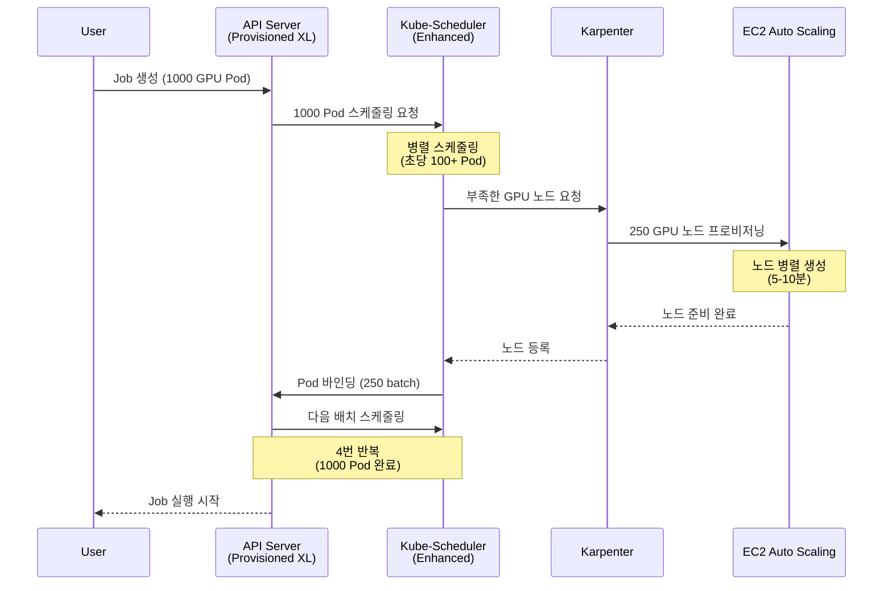

**사용 사례별 권장 티어:**

| 사용 사례 | 권장 티어 | 이유 |
|----------|----------|------|
| **일반 웹 애플리케이션** | Standard | 동적 스케일링으로 충분 |
| **대규모 배치 작업 (500+ Pod)** | XL | 빠른 동시 스케줄링 필요 |
| **분산 ML 학습 (1000+ GPU Pod)** | 2XL | 초고속 스케줄링 + 높은 API 동시성 |
| **HPC 클러스터 (수천 노드)** | 4XL | 최대 스케일 + 예측 가능한 성능 |
| **미션 크리티컬 서비스** | XL 이상 | 트래픽 버스트 시에도 일관된 지연 |

:::tip Provisioned Control Plane 선택 기준
- **노드 수 > 1,000**: XL 이상 고려
- **빈번한 대규모 배포 (500+ Pod)**: XL 이상
- **GPU 워크로드 (100+ GPU)**: 2XL 이상
- **예측 가능한 성능 요구**: 모든 규모에서 Provisioned 고려
:::

### 10.2 EKS Auto Mode 자동 노드 프로비저닝

**개요:**

EKS Auto Mode는 컴퓨팅, 스토리지, 네트워킹의 프로비저닝부터 지속적 유지보수까지 완전 자동화하여 Kubernetes 운영을 단순화합니다.

**Auto Mode가 스케줄링에 미치는 영향:**

| 기능 | 기존 방식 (수동) | Auto Mode |
|------|---------------|----------|
| **노드 선택** | NodeSelector, Node Affinity 명시 | 자동 인스턴스 타입 선택 |
| **동적 스케일링** | Cluster Autoscaler 또는 Karpenter 설정 | 자동 스케일링 (설정 불필요) |
| **비용 최적화** | Spot, Graviton 수동 설정 | 자동 Spot + Graviton 활용 |
| **AZ 배치** | Topology Spread 수동 설정 | 자동 Multi-AZ 분산 |
| **노드 업그레이드** | 수동 AMI 업데이트 | 자동 OS 패칭 |

**수동 NodeSelector/Affinity vs Auto Mode 비교:**

```yaml
# 기존 방식: 수동 NodeSelector + Karpenter NodePool
---
# Karpenter NodePool 생성
apiVersion: karpenter.sh/v1
kind: NodePool
metadata:
  name: general-pool
spec:
  template:
    spec:
      requirements:
      - key: node.kubernetes.io/instance-type
        operator: In
        values: ["c6i.xlarge", "c6i.2xlarge", "c6a.xlarge"]
      - key: karpenter.sh/capacity-type
        operator: In
        values: ["on-demand", "spot"]
---
# Deployment: NodeSelector로 노드 지정
apiVersion: apps/v1
kind: Deployment
metadata:
  name: api-server
spec:
  replicas: 10
  template:
    spec:
      nodeSelector:
        karpenter.sh/nodepool: general-pool
      containers:
      - name: api
        image: api:v1.0
        resources:
          requests:
            cpu: "1"
            memory: 2Gi
```

```yaml
# Auto Mode 방식: 최소한의 설정
apiVersion: apps/v1
kind: Deployment
metadata:
  name: api-server
spec:
  replicas: 10
  template:
    spec:
      # NodeSelector, Affinity 불필요 - Auto Mode가 자동 선택
      containers:
      - name: api
        image: api:v1.0
        resources:
          requests:
            cpu: "1"
            memory: 2Gi
      # Auto Mode가 자동으로:
      # - 적합한 인스턴스 타입 선택 (c6i, c6a, c7i 등)
      # - Spot vs On-Demand 최적 조합
      # - Multi-AZ 분산
      # - Graviton (ARM) 가능 시 활용
```

**Auto Mode 환경에서 여전히 필요한 스케줄링 설정:**

Auto Mode는 노드 프로비저닝을 자동화하지만, 다음 스케줄링 설정은 **여전히 명시적으로 설정해야 합니다**:

| 설정 | Auto Mode 자동화 여부 | 설명 |
|------|---------------------|------|
| **Resource Requests/Limits** | ❌ 필수 설정 | 워크로드 리소스 요구사항 명시 필요 |
| **Topology Spread** | ⚠️ 기본 제공 + 세밀한 제어 시 설정 | Auto Mode가 기본 분산 제공, 세밀한 제어 필요 시 명시 |
| **Pod Anti-Affinity** | ❌ 필수 설정 | 같은 앱 replica 분산은 명시 필요 |
| **PDB** | ❌ 필수 설정 | 최소 가용성 보장은 앱 담당 |
| **PriorityClass** | ❌ 필수 설정 | 우선순위는 앱 담당 |
| **Taints/Tolerations** | ⚠️ 특수 노드만 | GPU 등 특수 워크로드는 명시 필요 |

**Auto Mode 환경의 권장 스케줄링 패턴:**

```yaml
# Auto Mode에서 권장되는 최소한의 스케줄링 설정
apiVersion: apps/v1
kind: Deployment
metadata:
  name: production-app
spec:
  replicas: 6
  selector:
    matchLabels:
      app: production-app
  template:
    metadata:
      labels:
        app: production-app
    spec:
      # 1. Resource Requests (필수)
      containers:
      - name: app
        image: app:v1.0
        resources:
          requests:
            cpu: "1"
            memory: 2Gi
          limits:
            cpu: "2"
            memory: 4Gi

      # 2. Topology Spread (세밀한 AZ 분산 제어)
      topologySpreadConstraints:
      - maxSkew: 1
        topologyKey: topology.kubernetes.io/zone
        whenUnsatisfiable: DoNotSchedule
        labelSelector:
          matchLabels:
            app: production-app
        minDomains: 3

      # 3. Pod Anti-Affinity (노드 분산)
      affinity:
        podAntiAffinity:
          preferredDuringSchedulingIgnoredDuringExecution:
          - weight: 100
            podAffinityTerm:
              labelSelector:
                matchLabels:
                  app: production-app
              topologyKey: kubernetes.io/hostname

      # 4. PriorityClass (우선순위)
      priorityClassName: high-priority
---
# 5. PDB (가용성 보장)
apiVersion: policy/v1
kind: PodDisruptionBudget
metadata:
  name: production-app-pdb
spec:
  minAvailable: 4
  selector:
    matchLabels:
      app: production-app
```

**Auto Mode + PDB + Karpenter 상호작용:**

Auto Mode는 내부적으로 Karpenter와 유사한 자동 스케일링을 제공하며, PDB를 존중합니다.

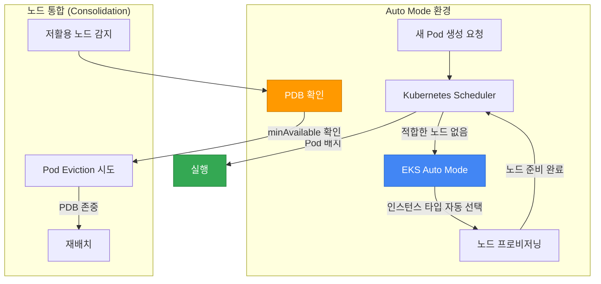

### 10.3 ARC + Karpenter 통합 AZ 대피

**개요:**

AWS Application Recovery Controller(ARC)와 Karpenter의 통합은 AZ 장애 시 자동 Zonal Shift를 통해 워크로드를 건강한 AZ로 대피시킵니다.

**AZ 장애 자동 복구 패턴:**

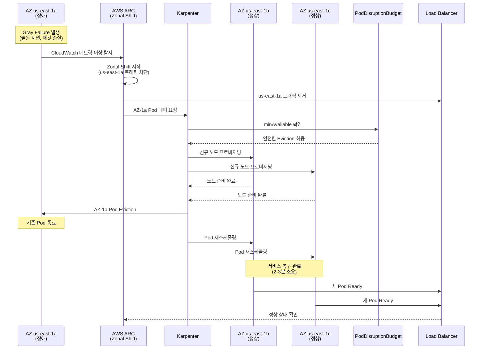

**ARC + Karpenter 통합 설정 예시:**

```yaml
# Karpenter NodePool: AZ 대피 지원
apiVersion: karpenter.sh/v1
kind: NodePool
metadata:
  name: arc-enabled-pool
spec:
  template:
    spec:
      requirements:
      - key: topology.kubernetes.io/zone
        operator: In
        values:
        - us-east-1a
        - us-east-1b
        - us-east-1c
      - key: karpenter.sh/capacity-type
        operator: In
        values: ["on-demand"]  # AZ 대피 시 On-Demand 권장
  disruption:
    consolidationPolicy: WhenEmptyOrUnderutilized
    consolidateAfter: 5m
    budgets:
    - nodes: "30%"  # AZ 대피 시 빠른 재배치를 위한 여유
---
# 애플리케이션: Topology Spread + PDB
apiVersion: apps/v1
kind: Deployment
metadata:
  name: resilient-app
spec:
  replicas: 9  # 3 AZ x 3 replica
  selector:
    matchLabels:
      app: resilient-app
  template:
    metadata:
      labels:
        app: resilient-app
    spec:
      topologySpreadConstraints:
      - maxSkew: 1
        topologyKey: topology.kubernetes.io/zone
        whenUnsatisfiable: DoNotSchedule
        labelSelector:
          matchLabels:
            app: resilient-app
        minDomains: 3  # 반드시 3 AZ에 분산
      affinity:
        podAntiAffinity:
          preferredDuringSchedulingIgnoredDuringExecution:
          - weight: 100
            podAffinityTerm:
              labelSelector:
                matchLabels:
                  app: resilient-app
              topologyKey: kubernetes.io/hostname
      containers:
      - name: app
        image: app:v1.0
        resources:
          requests:
            cpu: "1"
            memory: 2Gi
---
# PDB: AZ 대피 중에도 6개 유지 (9개 중 3개 Evict 허용)
apiVersion: policy/v1
kind: PodDisruptionBudget
metadata:
  name: resilient-app-pdb
spec:
  minAvailable: 6
  selector:
    matchLabels:
      app: resilient-app
```

**Istio 서비스 메시 통합 End-to-end 복구:**

Istio와 ARC를 함께 사용하면 AZ 장애 시 트래픽 라우팅과 Pod 재배치를 조율하여 End-to-end 복구를 달성합니다.

```yaml
# Istio DestinationRule: AZ별 Subset
apiVersion: networking.istio.io/v1beta1
kind: DestinationRule
metadata:
  name: resilient-app-dr
spec:
  host: resilient-app.default.svc.cluster.local
  trafficPolicy:
    loadBalancer:
      localityLbSetting:
        enabled: true
        failover:
        - from: us-east-1a
          to: us-east-1b
        - from: us-east-1b
          to: us-east-1c
        - from: us-east-1c
          to: us-east-1a
    outlierDetection:
      consecutiveErrors: 5
      interval: 30s
      baseEjectionTime: 30s
      maxEjectionPercent: 50
  subsets:
  - name: az-1a
    labels:
      topology.kubernetes.io/zone: us-east-1a
  - name: az-1b
    labels:
      topology.kubernetes.io/zone: us-east-1b
  - name: az-1c
    labels:
      topology.kubernetes.io/zone: us-east-1c
---
# Istio VirtualService: 정상 AZ로만 트래픽
apiVersion: networking.istio.io/v1beta1
kind: VirtualService
metadata:
  name: resilient-app-vs
spec:
  hosts:
  - resilient-app.default.svc.cluster.local
  http:
  - route:
    - destination:
        host: resilient-app.default.svc.cluster.local
        subset: az-1b
      weight: 50
    - destination:
        host: resilient-app.default.svc.cluster.local
        subset: az-1c
      weight: 50
    # ARC Zonal Shift 시 az-1a는 자동 제거됨
```

**Gray Failure 감지 패턴:**

Gray Failure는 완전한 장애는 아니지만 성능 저하로 서비스 품질이 떨어지는 상황입니다. ARC는 CloudWatch 메트릭 기반으로 Gray Failure를 감지합니다.

```yaml
# CloudWatch Alarm: Gray Failure 감지
apiVersion: v1
kind: ConfigMap
metadata:
  name: gray-failure-detection
data:
  alarm.json: |
    {
      "AlarmName": "EKS-AZ-1a-HighLatency",
      "MetricName": "TargetResponseTime",
      "Namespace": "AWS/ApplicationELB",
      "Statistic": "Average",
      "Period": 60,
      "EvaluationPeriods": 3,
      "Threshold": 1.0,
      "ComparisonOperator": "GreaterThanThreshold",
      "Dimensions": [
        {
          "Name": "AvailabilityZone",
          "Value": "us-east-1a"
        }
      ],
      "TreatMissingData": "notBreaching"
    }
```

**AZ 대피 전략 요약:**

| 시나리오 | PDB 설정 | Topology Spread | Karpenter 설정 | 복구 시간 |
|---------|---------|----------------|---------------|----------|
| **완전 AZ 장애** | `minAvailable: 6` (9개 중) | `minDomains: 3` | On-Demand 우선 | 2-3분 |
| **Gray Failure** | `minAvailable: 6` (9개 중) | `minDomains: 2` 허용 | Spot 가능 | 3-5분 |
| **계획된 유지보수** | `maxUnavailable: 3` | `minDomains: 2` 허용 | Spot + On-Demand | 5-10분 |

### 10.4 Container Network Observability와 스케줄링

**개요:**

Container Network Observability는 세분화된 네트워크 메트릭을 제공하여 Pod 배치와 네트워크 성능의 상관관계를 분석하고, 스케줄링 전략을 최적화할 수 있게 합니다.

**Pod 배치와 네트워크 성능 상관관계:**

| Pod 배치 패턴 | 네트워크 지연 | Cross-AZ 트래픽 비용 | 사용 사례 |
|-------------|-------------|-------------------|----------|
| **Same Node** | ~0.1ms | $0 | Cache 서버 + 애플리케이션 |
| **Same AZ** | ~0.5ms | $0 | 빈번한 통신하는 마이크로서비스 |
| **Cross-AZ** | ~2-5ms | $0.01/GB | 고가용성 필요 서비스 |
| **Cross-Region** | ~50-100ms | $0.02/GB | 지역별 분산 서비스 |

**Cross-AZ 트래픽 비용을 고려한 스케줄링:**

```yaml
# 예시: API Gateway + Backend Service 같은 AZ 배치
apiVersion: apps/v1
kind: Deployment
metadata:
  name: api-gateway
spec:
  replicas: 6
  selector:
    matchLabels:
      app: api-gateway
  template:
    metadata:
      labels:
        app: api-gateway
        network-locality: same-az  # 네트워크 관찰성 라벨
    spec:
      # Topology Spread: AZ 균등 분산
      topologySpreadConstraints:
      - maxSkew: 1
        topologyKey: topology.kubernetes.io/zone
        whenUnsatisfiable: DoNotSchedule
        labelSelector:
          matchLabels:
            app: api-gateway
      containers:
      - name: gateway
        image: api-gateway:v1.0
        resources:
          requests:
            cpu: "1"
            memory: 2Gi
---
# Backend Service: API Gateway와 같은 AZ 선호
apiVersion: apps/v1
kind: Deployment
metadata:
  name: backend-service
spec:
  replicas: 6
  selector:
    matchLabels:
      app: backend-service
  template:
    metadata:
      labels:
        app: backend-service
        network-locality: same-az
    spec:
      affinity:
        # Pod Affinity: API Gateway와 같은 AZ 선호 (Cross-AZ 비용 절감)
        podAffinity:
          preferredDuringSchedulingIgnoredDuringExecution:
          - weight: 100
            podAffinityTerm:
              labelSelector:
                matchExpressions:
                - key: app
                  operator: In
                  values:
                  - api-gateway
              topologyKey: topology.kubernetes.io/zone
      containers:
      - name: backend
        image: backend-service:v1.0
        resources:
          requests:
            cpu: "2"
            memory: 4Gi
```

**네트워크 관찰성 기반 Topology Spread 최적화:**

Container Network Observability 메트릭을 분석하여 스케줄링 전략을 조정합니다.

```yaml
# CloudWatch Container Insights 메트릭 쿼리 예시
apiVersion: v1
kind: ConfigMap
metadata:
  name: network-metrics-query
data:
  query.json: |
    {
      "MetricName": "pod_network_rx_bytes",
      "Namespace": "ContainerInsights",
      "Dimensions": [
        {"Name": "PodName", "Value": "api-gateway-*"},
        {"Name": "Namespace", "Value": "default"}
      ],
      "Period": 300,
      "Stat": "Sum"
    }
```

**네트워크 관찰성 기반 최적화 패턴:**

1. **높은 Cross-AZ 트래픽 감지** → Pod Affinity로 같은 AZ 배치
2. **특정 AZ 네트워크 혼잡 감지** → Topology Spread로 다른 AZ 분산
3. **Pod 간 통신 패턴 분석** → Service Mesh(Istio)로 트래픽 최적화
4. **네트워크 지연 급증 감지** → ARC Zonal Shift로 장애 AZ 대피

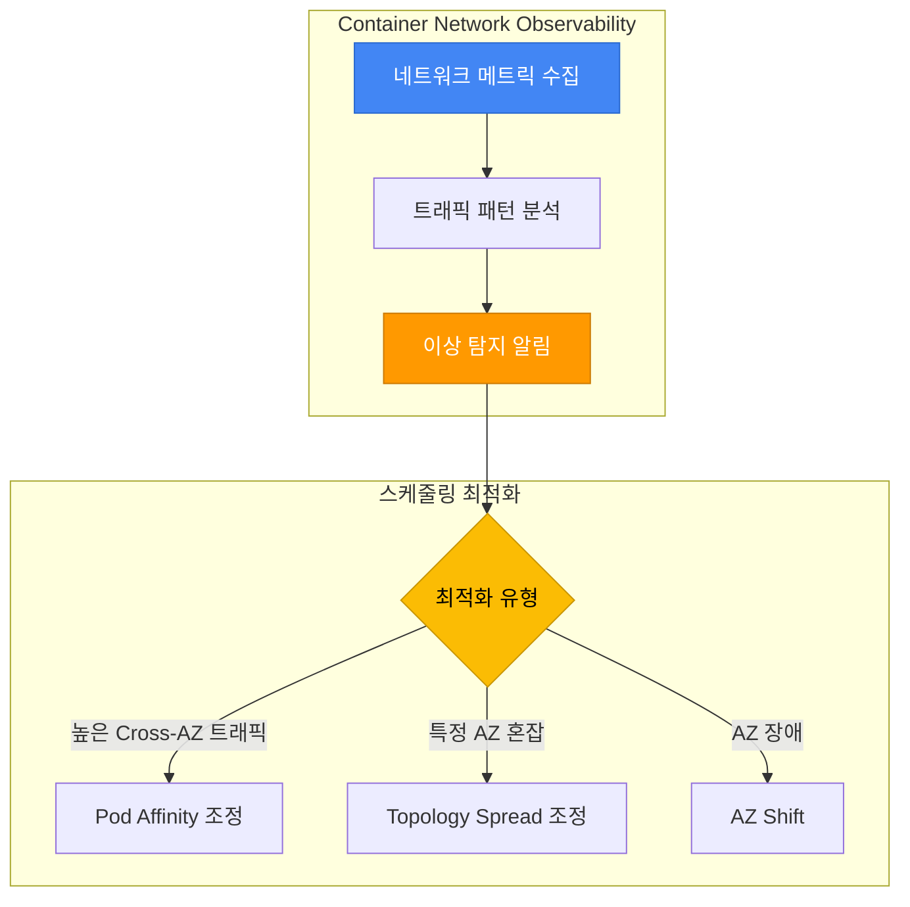

**실전 예시: ML 추론 서비스 네트워크 최적화:**

```yaml
# ML 추론 서비스: 낮은 지연 + 비용 최적화
apiVersion: apps/v1
kind: Deployment
metadata:
  name: ml-inference-optimized
spec:
  replicas: 9
  selector:
    matchLabels:
      app: ml-inference
  template:
    metadata:
      labels:
        app: ml-inference
    spec:
      # 1. Topology Spread: AZ 균등 분산 (고가용성)
      topologySpreadConstraints:
      - maxSkew: 1
        topologyKey: topology.kubernetes.io/zone
        whenUnsatisfiable: DoNotSchedule
        labelSelector:
          matchLabels:
            app: ml-inference
        minDomains: 3

      # 2. Pod Affinity: API Gateway와 같은 AZ (낮은 지연)
      affinity:
        podAffinity:
          preferredDuringSchedulingIgnoredDuringExecution:
          - weight: 80
            podAffinityTerm:
              labelSelector:
                matchExpressions:
                - key: app
                  operator: In
                  values:
                  - api-gateway
              topologyKey: topology.kubernetes.io/zone

      containers:
      - name: inference
        image: ml-inference:v1.0
        resources:
          requests:
            cpu: "2"
            memory: 8Gi
```

**네트워크 관찰성 기반 비용 절감 효과:**

| 최적화 전 | 최적화 후 | 절감 효과 |
|----------|----------|----------|
| Cross-AZ 트래픽: 1TB/월 | Cross-AZ 트래픽: 0.2TB/월 | $8/월 절감 |
| 평균 지연: 3ms | 평균 지연: 0.5ms | 6배 성능 향상 |
| Pod Affinity 미사용 | Pod Affinity 최적화 | 운영 효율 증가 |

---

### 10.5 Node Readiness Controller — 스케줄링 안전성 강화

**개요:**

Node Readiness Controller(NRC)는 Kubernetes 1.32에서 Alpha로 도입된 기능으로, 노드가 `Ready` 상태라도 실제로 Pod를 안전하게 실행할 수 없는 상황을 방지합니다. CNI 플러그인, CSI 드라이버, GPU 드라이버 등 인프라 구성 요소가 완전히 준비될 때까지 Pod 스케줄링을 차단함으로써 스케줄링 안전성을 크게 향상시킵니다.

**스케줄링 관점에서의 문제:**

기존 Kubernetes 스케줄러는 노드의 `Ready` 상태만 확인하여 Pod를 배치합니다. 그러나 다음과 같은 상황에서 Pod 배치가 실패할 수 있습니다:

| 시나리오 | 노드 상태 | 실제 상황 | 결과 |
|---------|---------|----------|------|
| **CNI 플러그인 미준비** | `Ready` | Calico/Cilium Pod 시작 중 | Pod 네트워크 연결 실패 |
| **CSI 드라이버 미준비** | `Ready` | EBS CSI Driver 초기화 중 | PVC 마운트 실패 |
| **GPU 드라이버 미준비** | `Ready` | NVIDIA Device Plugin 로딩 중 | GPU 워크로드 시작 실패 |
| **이미지 프리풀 진행 중** | `Ready` | 대용량 이미지(10GB) 다운로드 중 | Pod 시작 지연 (5분 이상) |

**Node Readiness Controller의 동작 원리:**

NRC는 `NodeReadinessRule` CRD(`readiness.node.x-k8s.io/v1alpha1`)를 사용하여 다음과 같이 동작합니다:

1. **조건 기반 Taint 관리**: 특정 Node Condition이 충족될 때까지 taint 적용
2. **스케줄러 차단**: Taint가 적용된 노드에는 Pod 스케줄링 불가
3. **자동 Taint 제거**: 조건 충족 시 taint 자동 제거 → Pod 스케줄링 허용

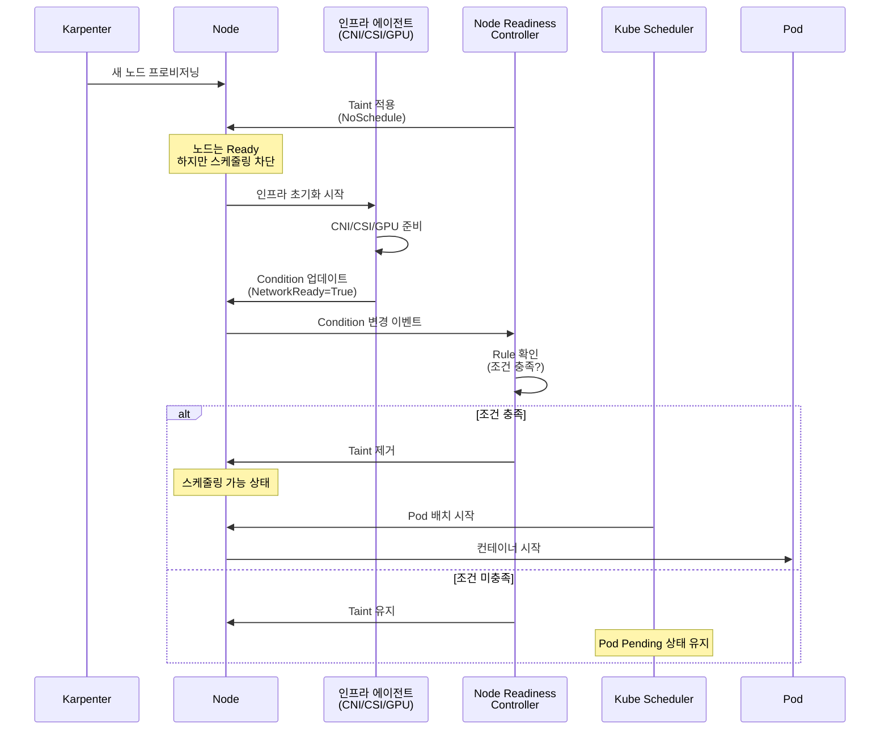

**두 가지 Enforcement 모드:**

NRC는 두 가지 모드로 동작하며, 각 모드는 스케줄링 안전성에 다른 영향을 미칩니다:

| 모드 | 동작 방식 | 스케줄링 영향 | 사용 사례 |
|------|---------|-------------|----------|
| **bootstrap-only** | 노드 초기화 시에만 taint 적용<br/>→ 한번 준비되면 해제 후 모니터링 중단 | 초기 스케줄링 안전성 보장<br/>런타임 장애는 미탐지 | CNI 플러그인, 이미지 프리풀<br/>(한번만 확인하면 충분) |
| **continuous** | 지속적 모니터링<br/>→ 드라이버 크래시 시 즉시 re-taint | 런타임 장애 시에도<br/>새 Pod 스케줄링 차단 | GPU 드라이버, CSI 드라이버<br/>(런타임 장애 가능) |

**실전 예시 1: CNI 플러그인 준비 확인 (Bootstrap-only)**

```yaml
apiVersion: readiness.node.x-k8s.io/v1alpha1
kind: NodeReadinessRule
metadata:
  name: network-readiness-rule
spec:
  # CNI 플러그인이 NetworkReady Condition을 True로 보고할 때까지 대기
  conditions:
    - type: "cniplugin.example.net/NetworkReady"
      requiredStatus: "True"

  # 준비될 때까지 이 taint 적용
  taint:
    key: "readiness.k8s.io/network-unavailable"
    effect: "NoSchedule"
    value: "pending"

  # Bootstrap-only: 한번 준비되면 모니터링 중단
  enforcementMode: "bootstrap-only"

  # Worker 노드에만 적용
  nodeSelector:
    matchLabels:
      node.kubernetes.io/role: worker
```

**실전 예시 2: GPU 드라이버 지속 모니터링 (Continuous)**

```yaml
apiVersion: readiness.node.x-k8s.io/v1alpha1
kind: NodeReadinessRule
metadata:
  name: gpu-driver-readiness-rule
spec:
  # NVIDIA Device Plugin이 GPUReady Condition을 True로 보고할 때까지 대기
  conditions:
    - type: "nvidia.com/gpu.present"
      requiredStatus: "True"
    - type: "nvidia.com/gpu.driver.ready"
      requiredStatus: "True"

  # GPU 준비될 때까지 이 taint 적용
  taint:
    key: "readiness.k8s.io/gpu-unavailable"
    effect: "NoSchedule"
    value: "pending"

  # Continuous: GPU 드라이버 크래시 시 re-taint로 새 Pod 스케줄링 차단
  enforcementMode: "continuous"

  # GPU 노드 그룹에만 적용
  nodeSelector:
    matchLabels:
      node.kubernetes.io/instance-type: "p4d.24xlarge"
```

**Pod Scheduling Readiness(schedulingGates)와의 비교:**

Kubernetes는 Pod 수준과 노드 수준 양쪽에서 스케줄링 안전성을 제어할 수 있습니다:

| 비교 항목 | `schedulingGates` (Pod 수준) | `NodeReadinessRule` (노드 수준) |
|----------|------------------------------|--------------------------------|
| **제어 대상** | 특정 Pod의 스케줄링 | 특정 노드의 모든 Pod 스케줄링 |
| **사용 사례** | 외부 조건 충족까지 Pod 보류<br/>(예: 데이터베이스 준비 대기) | 인프라 준비까지 노드 차단<br/>(예: CNI/GPU 드라이버 로딩) |
| **조건 위치** | Pod Spec에 명시 | Node Condition으로 보고 |
| **제거 방법** | 외부 컨트롤러가 gate 제거 | NRC가 자동으로 taint 제거 |
| **영향 범위** | 단일 Pod | 노드의 모든 신규 Pod |

**조합 패턴:**

```yaml
# Pod 수준 + 노드 수준 스케줄링 안전성 조합
apiVersion: v1
kind: Pod
metadata:
  name: ml-training-job
spec:
  # Pod 수준: 데이터셋 준비까지 스케줄링 보류
  schedulingGates:
    - name: "example.com/dataset-ready"

  # 노드 수준: GPU 드라이버 준비된 노드에만 배치 (NodeReadinessRule이 taint 관리)
  tolerations:
    - key: "readiness.k8s.io/gpu-unavailable"
      operator: "DoesNotExist"  # Taint가 없는 노드(=GPU 준비된 노드)만 허용

  containers:
    - name: trainer
      image: ml-trainer:v1.0
      resources:
        limits:
          nvidia.com/gpu: 8
```

**Karpenter + NRC 연동 패턴:**

Karpenter로 동적 노드 프로비저닝을 사용하는 환경에서 NRC는 다음과 같은 워크플로우를 제공합니다:

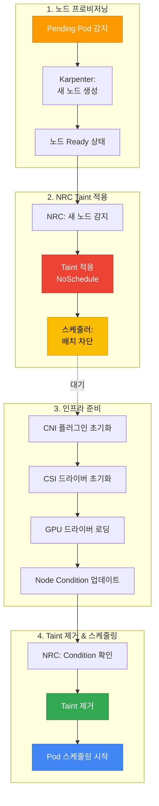

**GPU 노드 그룹 실전 예시:**

AI/ML 워크로드를 위한 GPU 노드 그룹에서 NRC를 사용하면 NVIDIA 드라이버 로딩이 완료될 때까지 AI 워크로드 스케줄링을 지연시켜 배치 실패를 방지할 수 있습니다:

```yaml
# Karpenter NodePool: GPU 노드 그룹
apiVersion: karpenter.sh/v1
kind: NodePool
metadata:
  name: gpu-pool
spec:
  template:
    spec:
      requirements:
        - key: node.kubernetes.io/instance-type
          operator: In
          values: ["p4d.24xlarge", "p5.48xlarge"]
        - key: karpenter.sh/capacity-type
          operator: In
          values: ["on-demand"]
      nodeClassRef:
        name: gpu-nodeclass
---
# NodeReadinessRule: GPU 드라이버 준비 확인
apiVersion: readiness.node.x-k8s.io/v1alpha1
kind: NodeReadinessRule
metadata:
  name: gpu-readiness-rule
spec:
  conditions:
    - type: "nvidia.com/gpu.driver.ready"
      requiredStatus: "True"
  taint:
    key: "readiness.k8s.io/gpu-unavailable"
    effect: "NoSchedule"
    value: "pending"
  enforcementMode: "continuous"
  nodeSelector:
    matchLabels:
      karpenter.sh/nodepool: gpu-pool
---
# AI 워크로드: Toleration으로 준비된 GPU 노드에만 배치
apiVersion: batch/v1
kind: Job
metadata:
  name: ml-training
spec:
  template:
    spec:
      # GPU 준비된 노드에만 배치
      tolerations:
        - key: "readiness.k8s.io/gpu-unavailable"
          operator: "DoesNotExist"

      containers:
        - name: trainer
          image: ml-trainer:v1.0
          resources:
            limits:
              nvidia.com/gpu: 8

      restartPolicy: OnFailure
```

:::tip 스케줄링 안전성 최적화 권장사항
- **CNI 플러그인**: `bootstrap-only` 모드로 초기 네트워크 준비 확인
- **GPU 드라이버**: `continuous` 모드로 런타임 장애 시에도 새 Pod 배치 차단
- **CSI 드라이버**: `continuous` 모드로 스토리지 드라이버 크래시 대응
- **이미지 프리풀**: `bootstrap-only` 모드로 대용량 이미지 다운로드 완료 대기
- **Karpenter 연동**: NodePool별 NodeReadinessRule 설정으로 워크로드별 맞춤 준비 조건
:::

:::warning Alpha 기능 사용 시 주의사항
Node Readiness Controller는 Kubernetes 1.32에서 Alpha 기능입니다:

1. **Feature Gate 활성화 필요**: `--feature-gates=NodeReadiness=true` (kube-apiserver, kube-controller-manager)
2. **API 변경 가능성**: Beta/GA 전환 시 `NodeReadinessRule` CRD 스키마 변경 가능
3. **프로덕션 환경**: 철저한 테스트 후 도입 권장
4. **대체 방법**: Alpha 기능 사용이 부담스럽다면 기존 Node Taint 수동 관리 또는 Init Container 패턴 활용
:::

**참고 자료:**

- [Kubernetes Blog: Introducing Node Readiness Controller](https://kubernetes.io/blog/2026/02/03/introducing-node-readiness-controller/)
- [Node Readiness Controller GitHub](https://github.com/kubernetes-sigs/node-readiness-controller)

---

## 11. 종합 체크리스트 & 참고 자료

### 11.1 종합 체크리스트

프로덕션 배포 전 아래 체크리스트를 활용하여 스케줄링 설정을 검증하세요.

#### 기본 스케줄링 (모든 워크로드)

| 항목 | 설명 | 확인 |
|------|------|------|
| **Resource Requests 설정** | 모든 컨테이너에 CPU, Memory requests 명시 | [ ] |
| **PriorityClass 지정** | 워크로드 중요도에 맞는 PriorityClass 할당 | [ ] |
| **Liveness/Readiness Probe** | 헬스 체크 설정으로 Pod 안정성 보장 | [ ] |
| **Graceful Shutdown** | preStop Hook + terminationGracePeriodSeconds | [ ] |
| **Image Pull Policy** | 프로덕션: `IfNotPresent` 또는 `Always` | [ ] |

#### 고가용성 (Critical 워크로드)

| 항목 | 설명 | 확인 |
|------|------|------|
| **Replica 수 ≥ 3** | 장애 도메인 격리를 위한 최소 replica | [ ] |
| **Topology Spread Constraints** | AZ 간 균등 분산 (maxSkew: 1) | [ ] |
| **Pod Anti-Affinity** | 노드 분산 (Soft 또는 Hard) | [ ] |
| **PDB 설정** | minAvailable 또는 maxUnavailable 명시 | [ ] |
| **PDB 검증** | `minAvailable < replicas` 확인 | [ ] |
| **Multi-AZ 배포 확인** | `kubectl get pods -o wide`로 AZ 분산 검증 | [ ] |

#### 리소스 최적화

| 항목 | 설명 | 확인 |
|------|------|------|
| **Spot 노드 활용** | 재시작 가능한 워크로드에 Spot 노드 허용 | [ ] |
| **Node Affinity 최적화** | 워크로드에 맞는 인스턴스 타입 선택 | [ ] |
| **Taints/Tolerations** | GPU, 고성능 노드 등 전용 노드 격리 | [ ] |
| **Descheduler 설정** | 노드 불균형 해소 (optional) | [ ] |
| **Karpenter 통합** | Disruption budget 설정 | [ ] |

#### 특수 워크로드

| 항목 | 설명 | 확인 |
|------|------|------|
| **GPU 워크로드** | GPU Taint Tolerate + GPU 리소스 요청 | [ ] |
| **StatefulSet** | WaitForFirstConsumer StorageClass 사용 | [ ] |
| **DaemonSet** | 모든 Taint Tolerate 설정 | [ ] |
| **배치 작업** | PriorityClass: low-priority, preemptionPolicy: Never | [ ] |

### Pod 스케줄링 검증 명령어

```bash
# 1. Pod 배치 확인 (AZ, 노드 분산)
kubectl get pods -n <namespace> -o wide

# 2. Pod 스케줄링 이벤트 확인 (Pending 원인 파악)
kubectl describe pod <pod-name> -n <namespace>

# 3. PDB 상태 확인
kubectl get pdb -A
kubectl describe pdb <pdb-name> -n <namespace>

# 4. PriorityClass 목록
kubectl get priorityclass

# 5. 노드 Taint 확인
kubectl describe node <node-name> | grep Taints

# 6. 노드별 Pod 분포 확인
kubectl get pods -A -o wide | awk '{print $8}' | sort | uniq -c

# 7. AZ별 Pod 분포 확인
kubectl get pods -A -o json | \
  jq -r '.items[] | "\(.metadata.namespace) \(.metadata.name) \(.spec.nodeName)"' | \
  while read ns pod node; do
    az=$(kubectl get node $node -o jsonpath='{.metadata.labels.topology\.kubernetes\.io/zone}')
    echo "$ns $pod $node $az"
  done | column -t

# 8. Pending Pod 원인 분석
kubectl get events --sort-by='.lastTimestamp' -A | grep -i warning

# 9. Descheduler 로그 확인 (설치된 경우)
kubectl logs -n kube-system -l app=descheduler --tail=100
```

### 11.2 관련 문서

**내부 문서:**
- [EKS 고가용성 아키텍처 가이드](/docs/operations-observability/eks-resiliency-guide) — Multi-AZ 전략, Topology Spread, Cell Architecture
- [Karpenter를 활용한 초고속 오토스케일링](/docs/infrastructure-optimization/karpenter-autoscaling) — Karpenter NodePool 심층 설정
- [EKS 리소스 최적화 가이드](/docs/infrastructure-optimization/eks-resource-optimization) — 리소스 Requests/Limits 최적화
- [EKS Pod 헬스체크 & 라이프사이클](/docs/operations-observability/eks-pod-health-lifecycle) — Probe, Lifecycle Hooks

### 11.3 외부 참조

**공식 Kubernetes 문서:**
- [Kubernetes Scheduling Framework](https://kubernetes.io/docs/concepts/scheduling-eviction/scheduling-framework/)
- [Assigning Pods to Nodes](https://kubernetes.io/docs/concepts/scheduling-eviction/assign-pod-node/)
- [Pod Priority and Preemption](https://kubernetes.io/docs/concepts/scheduling-eviction/pod-priority-preemption/)
- [Taints and Tolerations](https://kubernetes.io/docs/concepts/scheduling-eviction/taint-and-toleration/)
- [Pod Topology Spread Constraints](https://kubernetes.io/docs/concepts/scheduling-eviction/topology-spread-constraints/)
- [PodDisruptionBudget](https://kubernetes.io/docs/concepts/workloads/pods/disruptions/)

**Descheduler:**
- [Descheduler GitHub](https://github.com/kubernetes-sigs/descheduler)
- [Descheduler Strategies](https://github.com/kubernetes-sigs/descheduler#policy-and-strategies)

**AWS EKS 공식 문서:**
- [EKS Best Practices — Reliability](https://docs.aws.amazon.com/eks/latest/best-practices/reliability.html)
- [Karpenter Scheduling](https://karpenter.sh/docs/concepts/scheduling/)
- [EKS Node Taints](https://docs.aws.amazon.com/eks/latest/userguide/node-taints-managed-node-groups.html)

**AWS re:Invent 2025 관련 자료:**
- [Amazon EKS introduces Provisioned Control Plane](https://aws.amazon.com/blogs/containers/amazon-eks-introduces-provisioned-control-plane/) — XL/2XL/4XL 티어별 스케줄링 성능
- [Getting started with Amazon EKS Auto Mode](https://aws.amazon.com/blogs/containers/getting-started-with-amazon-eks-auto-mode) — 자동 노드 프로비저닝
- [Enhance Kubernetes high availability with ARC and Karpenter](https://aws.amazon.com/blogs/containers/enhance-kubernetes-high-availability-with-amazon-application-recovery-controller-and-karpenter-integration/) — AZ 자동 대피 패턴
- [Monitor network performance across EKS clusters](https://aws.amazon.com/blogs/aws/monitor-network-performance-and-traffic-across-your-eks-clusters-with-container-network-observability/) — Container Network Observability
- [Proactive EKS monitoring with CloudWatch Operator](https://aws.amazon.com/blogs/containers/proactive-amazon-eks-monitoring-with-amazon-cloudwatch-operator-and-aws-control-plane-metrics/) — Control Plane 메트릭

**Red Hat OpenShift 문서:**
- [Controlling Pod Placement with Taints and Tolerations](https://docs.openshift.com/container-platform/4.18/nodes/scheduling/nodes-scheduler-taints-tolerations.html) — Taints/Tolerations 운영
- [Placing Pods on Specific Nodes with Pod Affinity](https://docs.openshift.com/container-platform/4.18/nodes/scheduling/nodes-scheduler-pod-affinity.html) — Pod Affinity/Anti-Affinity 구성
- [Evicting Pods Using the Descheduler](https://docs.openshift.com/container-platform/4.18/nodes/scheduling/nodes-descheduler.html) — Descheduler 전략 및 설정
- [Managing Pods](https://docs.openshift.com/container-platform/4.18/nodes/pods/nodes-pods-configuring.html) — Pod 관리 및 스케줄링 기본

**커뮤니티:**
- [CNCF Scheduler SIG](https://github.com/kubernetes/community/tree/master/sig-scheduling)
- [Kubernetes Scheduling Deep Dive (KubeCon)](https://www.youtube.com/results?search_query=kubecon+scheduling)
- [AWS re:Invent 2025 — Amazon EKS Sessions](https://aws.amazon.com/blogs/containers/guide-to-amazon-eks-and-kubernetes-sessions-at-aws-reinvent-2025/)
