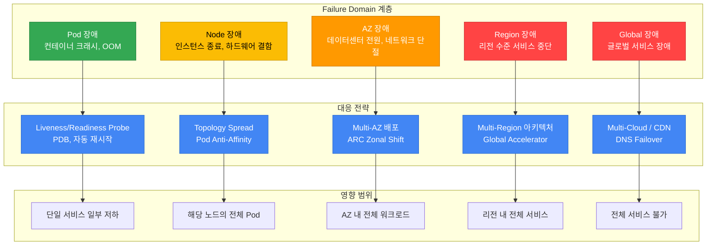
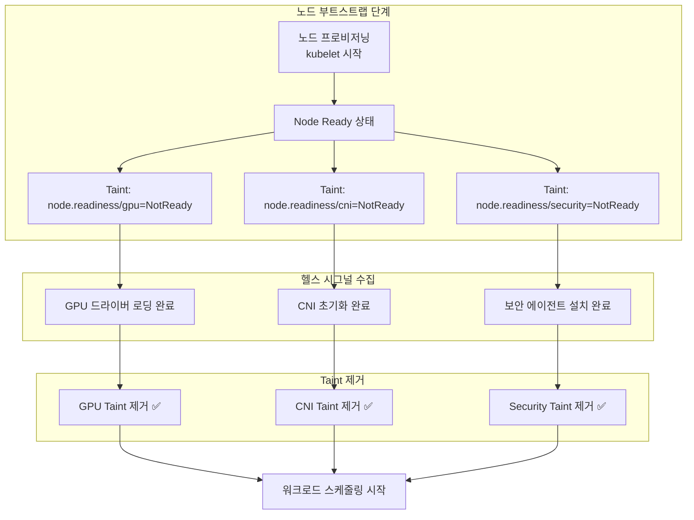
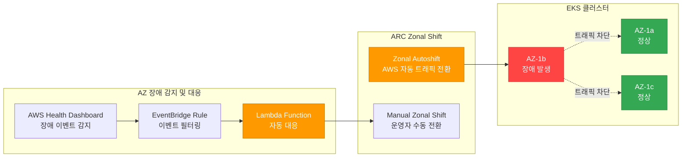
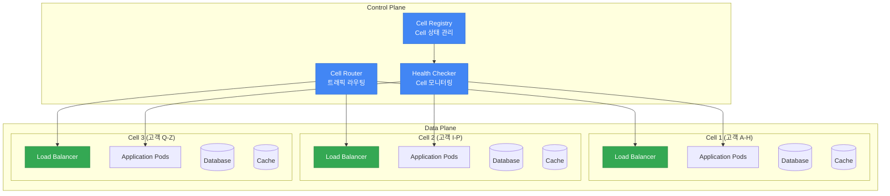
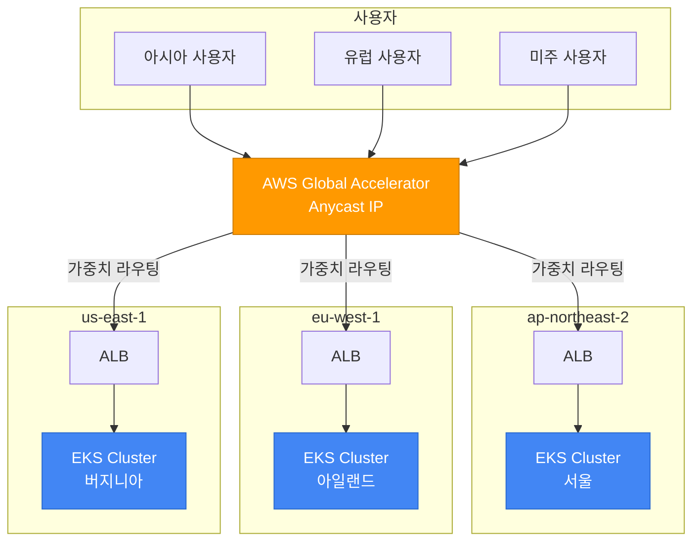
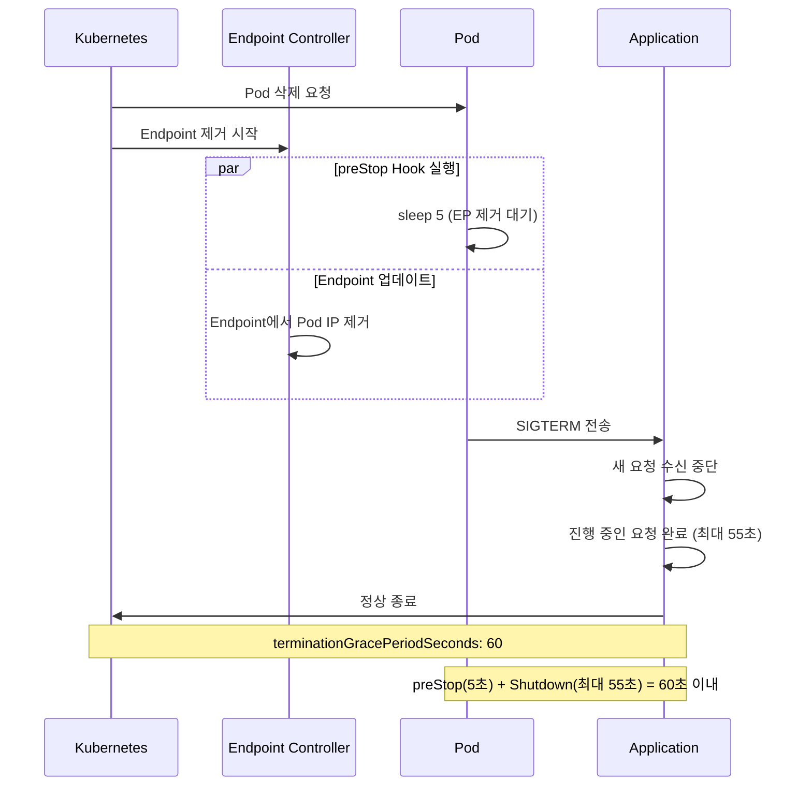

# EKS 고가용성 아키텍처 가이드

> 📅 **작성일**: 2026-02-10 | ⏱️ **읽는 시간**: 약 20분

> **📌 기준 환경**: EKS 1.30+, Karpenter v1.x, Istio 1.22+

## 1. 개요

레질리언시(Resiliency)는 시스템이 장애에 직면했을 때 정상 상태로 복구하거나, 장애 영향을 최소화하면서 서비스를 유지하는 능력입니다. 클라우드 네이티브 환경에서 레질리언시의 핵심 원칙은 단순합니다: **장애는 반드시 발생한다 — 설계로 대비한다.**

단일 Pod 장애부터 리전 전체 장애까지, 각 계층에서 발생할 수 있는 Failure Domain을 이해하고 그에 맞는 방어 전략을 수립하는 것이 EKS 운영의 핵심입니다.

### Failure Domain 계층 구조



### 레질리언시 성숙도 모델

조직의 레질리언시 수준을 4단계로 분류하고, 현재 위치에서 점진적으로 발전시켜 나갈 수 있습니다.

| Level | 단계 | 핵심 역량 | 구현 항목 | 복잡성 | 비용 영향 |
|-------|------|-----------|-----------|--------|-----------|
| **1** | 기본 (Basic) | Pod 수준 복원력 | Probe 설정, PDB, Graceful Shutdown, 리소스 Limits | 낮음 | 최소 |
| **2** | Multi-AZ | AZ 장애 내성 | Topology Spread, Multi-AZ NodePool, ARC Zonal Shift | 중간 | Cross-AZ 트래픽 비용 |
| **3** | Cell-Based | Blast Radius 격리 | Cell Architecture, Shuffle Sharding, 독립 배포 | 높음 | Cell 별 오버헤드 |
| **4** | Multi-Region | 리전 장애 내성 | Active-Active 아키텍처, Global Accelerator, 데이터 복제 | 매우 높음 | 리전 별 인프라 비용 |

:::info 장애 진단 및 대응 가이드 참조
운영 중 장애 진단 및 해결은 [EKS 장애 진단 및 대응 가이드](./eks-debugging-guide.md)를 참조하세요. 본 문서는 장애 **예방**과 **설계**에 초점을 맞추고 있으며, 실시간 트러블슈팅은 장애 진단 및 대응 가이드에서 다룹니다.
:::

---

## 2. Multi-AZ 전략

Multi-AZ 배포는 EKS 레질리언시의 가장 기본적이면서도 강력한 전략입니다. 단일 AZ 장애가 서비스 전체를 중단시키지 않도록 워크로드를 여러 가용 영역에 분산합니다.

### Pod Topology Spread Constraints

Topology Spread Constraints는 Pod를 AZ, 노드, 커스텀 토폴로지 도메인에 걸쳐 균등하게 분산시킵니다. K8s 1.30+에서는 `minDomains` 파라미터를 통해 최소 분산 도메인 수를 지정할 수 있습니다.

| 파라미터 | 설명 | 권장값 |
|----------|------|--------|
| `maxSkew` | 도메인 간 Pod 수 최대 차이 | AZ: 1, 노드: 2 |
| `topologyKey` | 분산 기준 레이블 | `topology.kubernetes.io/zone` |
| `whenUnsatisfiable` | 조건 불충족 시 동작 | `DoNotSchedule` (hard) 또는 `ScheduleAnyway` (soft) |
| `minDomains` | 최소 분산 도메인 수 | AZ 수와 동일 (예: 3) |
| `labelSelector` | 대상 Pod 선택 | Deployment의 matchLabels와 동일 |

**Hard + Soft 조합 전략** (권장):

```yaml
apiVersion: apps/v1
kind: Deployment
metadata:
  name: critical-app
spec:
  replicas: 6
  selector:
    matchLabels:
      app: critical-app
  template:
    metadata:
      labels:
        app: critical-app
    spec:
      topologySpreadConstraints:
      # Hard: AZ 간 균등 분산 (반드시 보장)
      - maxSkew: 1
        topologyKey: topology.kubernetes.io/zone
        whenUnsatisfiable: DoNotSchedule
        labelSelector:
          matchLabels:
            app: critical-app
        minDomains: 3
      # Soft: 노드 간 분산 (가능한 한 보장)
      - maxSkew: 2
        topologyKey: kubernetes.io/hostname
        whenUnsatisfiable: ScheduleAnyway
        labelSelector:
          matchLabels:
            app: critical-app
```

:::tip maxSkew 설정 팁
`maxSkew: 1`은 가장 엄격한 균등 분산을 보장합니다. 6개 replica를 3 AZ에 배포하면 각 AZ에 정확히 2개씩 배치됩니다. 스케일링 속도가 중요한 경우 `maxSkew: 2`로 느슨하게 설정하여 스케줄링 유연성을 확보할 수 있습니다.
:::

### AZ-aware Karpenter 설정

Karpenter v1 GA에서는 NodePool 단위로 Multi-AZ 분산, Disruption budget, Spot + On-Demand 혼합 전략을 선언적으로 구성합니다.

```yaml
apiVersion: karpenter.sh/v1
kind: NodePool
metadata:
  name: multi-az-pool
spec:
  disruption:
    consolidationPolicy: WhenEmptyOrUnderutilized
    consolidateAfter: 5m
    # Disruption budget: 동시에 20% 이상의 노드가 중단되지 않도록 제한
    budgets:
    - nodes: "20%"
  template:
    spec:
      requirements:
      # 3개 AZ에 걸쳐 노드 프로비저닝
      - key: topology.kubernetes.io/zone
        operator: In
        values: ["us-east-1a", "us-east-1b", "us-east-1c"]
      # Spot + On-Demand 혼합으로 비용 최적화 + 안정성 확보
      - key: karpenter.sh/capacity-type
        operator: In
        values: ["on-demand", "spot"]
      - key: node.kubernetes.io/instance-type
        operator: In
        values:
          - c6i.xlarge
          - c6i.2xlarge
          - c6i.4xlarge
          - c7i.xlarge
          - c7i.2xlarge
          - c7i.4xlarge
          - m6i.xlarge
          - m6i.2xlarge
      nodeClassRef:
        group: karpenter.k8s.aws
        kind: EC2NodeClass
        name: multi-az
  limits:
    cpu: "1000"
    memory: 2000Gi
```

:::warning Spot 인스턴스와 Multi-AZ
Spot 인스턴스는 AZ별로 가용 풀이 다릅니다. 15개 이상의 다양한 인스턴스 유형을 지정하면 Spot 용량 부족으로 인한 프로비저닝 실패를 최소화할 수 있습니다. 미션 크리티컬 워크로드의 base capacity는 반드시 On-Demand로 운영하세요.
:::

### Node Readiness 기반 안전한 워크로드 배치

Multi-AZ 환경에서 새 노드가 프로비저닝될 때, 노드가 `Ready` 상태가 되더라도 실제로 워크로드를 수용할 준비가 완료되지 않았을 수 있습니다. 이를 방지하기 위한 Kubernetes readiness 메커니즘들을 활용합니다.

#### Node Readiness Controller (2026년 2월 발표)

[Node Readiness Controller](https://github.com/kubernetes-sigs/node-readiness-controller)는 노드 부트스트랩 과정에서 커스텀 taint를 선언적으로 관리하여, GPU 드라이버, CNI 플러그인, CSI 드라이버, 보안 에이전트 등 모든 인프라 요구사항이 충족될 때까지 워크로드 스케줄링을 지연시킵니다.



**레질리언시 관점의 이점:**

- **AZ 장애 복구 시**: Karpenter가 새 AZ에 노드를 프로비저닝할 때, 노드가 완전히 준비된 후에만 트래픽을 수용
- **Scale-out 이벤트**: 급격한 확장 시에도 미완성 노드에 워크로드가 배치되지 않음
- **GPU/ML 워크로드**: 드라이버 로딩 완료 전 스케줄링을 방지하여 `CrashLoopBackOff` 방지

#### Pod Scheduling Readiness (K8s 1.30 GA)

`schedulingGates`를 사용하면 Pod 측에서 스케줄링 타이밍을 제어할 수 있습니다. 외부 시스템이 준비 상태를 확인한 후 gate를 제거하여 스케줄링을 허용합니다:

```yaml
apiVersion: v1
kind: Pod
metadata:
  name: validated-pod
spec:
  schedulingGates:
    - name: "example.com/capacity-validation"
    - name: "example.com/security-clearance"
  containers:
    - name: app
      image: app:latest
      resources:
        requests:
          cpu: "4"
          memory: "8Gi"
```

**활용 사례:**

- 리소스 쿼터 사전 검증 후 스케줄링 허용
- 보안 승인 완료 후 스케줄링 허용
- 커스텀 어드미션 체크 통과 후 스케줄링 허용

#### Pod Readiness Gates (AWS LB Controller)

AWS Load Balancer Controller의 Pod Readiness Gates는 롤링 업데이트 시 **무중단 배포**를 보장합니다:

```yaml
apiVersion: v1
kind: Namespace
metadata:
  name: production
  labels:
    elbv2.k8s.aws/pod-readiness-gate-inject: enabled  # 자동 주입 활성화
```

새 Pod가 ALB/NLB 타겟으로 등록되고 헬스 체크를 통과할 때까지 이전 Pod가 종료되지 않으므로, 트래픽 유실 없는 배포가 가능합니다.

:::tip Readiness 기능 선택 가이드

| 요구사항 | 추천 기능 | 적용 레벨 |
|----------|-----------|-----------|
| 노드 부트스트랩 완료 보장 | Node Readiness Controller | Node |
| Pod 스케줄링 전 외부 검증 | Pod Scheduling Readiness | Pod |
| LB 등록 완료 후 트래픽 수신 | Pod Readiness Gates | Pod |
| GPU/특수 하드웨어 준비 보장 | Node Readiness Controller | Node |
| 무중단 롤링 배포 | Pod Readiness Gates | Pod |
:::

### AZ 회피 배포 전략 (ARC Zonal Shift)

AWS Application Recovery Controller(ARC) Zonal Shift는 특정 AZ에 문제가 감지되었을 때 해당 AZ로의 트래픽을 자동 또는 수동으로 전환하는 기능입니다. EKS는 2024년 11월부터 ARC Zonal Shift를 지원합니다.



**ARC Zonal Shift 활성화 및 사용:**

```bash
# EKS 클러스터에 Zonal Shift 활성화
aws eks update-cluster-config \
  --name my-cluster \
  --zonal-shift-config enabled=true

# 수동 Zonal Shift 시작 (특정 AZ에서 트래픽 우회)
aws arc-zonal-shift start-zonal-shift \
  --resource-identifier arn:aws:eks:us-east-1:123456789012:cluster/my-cluster \
  --away-from us-east-1b \
  --expires-in 3h \
  --comment "AZ-b impairment detected via Health Dashboard"

# Zonal Shift 상태 확인
aws arc-zonal-shift list-zonal-shifts \
  --resource-identifier arn:aws:eks:us-east-1:123456789012:cluster/my-cluster
```

:::info Zonal Shift 제한사항
Zonal Shift의 최대 지속 시간은 **3일**이며, 필요 시 연장할 수 있습니다. Zonal Autoshift를 활성화하면 AWS가 AZ 수준의 장애를 감지하여 자동으로 트래픽을 전환합니다.
:::

**긴급 AZ Evacuation 스크립트:**

```bash
#!/bin/bash
# az-evacuation.sh - 장애 AZ의 모든 워크로드를 안전하게 대피
IMPAIRED_AZ=$1

if [ -z "$IMPAIRED_AZ" ]; then
  echo "Usage: $0 <az-name>"
  echo "Example: $0 us-east-1b"
  exit 1
fi

echo "=== AZ Evacuation: ${IMPAIRED_AZ} ==="

# 1. 해당 AZ의 노드 Cordon (새 Pod 스케줄링 차단)
echo "[Step 1] Cordoning nodes in ${IMPAIRED_AZ}..."
kubectl get nodes -l topology.kubernetes.io/zone=${IMPAIRED_AZ} -o name | \
  xargs -I {} kubectl cordon {}

# 2. 해당 AZ의 노드 Drain (기존 Pod 안전하게 이동)
echo "[Step 2] Draining nodes in ${IMPAIRED_AZ}..."
kubectl get nodes -l topology.kubernetes.io/zone=${IMPAIRED_AZ} -o name | \
  xargs -I {} kubectl drain {} \
    --ignore-daemonsets \
    --delete-emptydir-data \
    --grace-period=30 \
    --timeout=120s

# 3. 대피 결과 확인
echo "[Step 3] Verifying evacuation..."
echo "Remaining pods in ${IMPAIRED_AZ}:"
kubectl get pods --all-namespaces -o wide | grep ${IMPAIRED_AZ} | grep -v DaemonSet

echo "=== Evacuation complete ==="
```

### EBS AZ-Pinning 대응

EBS 볼륨은 특정 AZ에 고정(pinned)됩니다. 해당 AZ에 장애가 발생하면 볼륨을 사용하는 Pod가 다른 AZ로 이동할 수 없습니다.

**WaitForFirstConsumer StorageClass** (권장):

```yaml
apiVersion: storage.k8s.io/v1
kind: StorageClass
metadata:
  name: topology-aware-ebs
provisioner: ebs.csi.aws.com
parameters:
  type: gp3
  encrypted: "true"
volumeBindingMode: WaitForFirstConsumer
allowVolumeExpansion: true
```

`WaitForFirstConsumer`는 Pod가 스케줄링될 때까지 볼륨 생성을 지연시켜, Pod와 같은 AZ에 볼륨이 생성되도록 보장합니다.

**EFS Cross-AZ 대안**: AZ 장애 시에도 스토리지 접근이 필요한 워크로드에는 Amazon EFS를 사용합니다. EFS는 모든 AZ에서 동시 접근이 가능하므로 AZ-Pinning 문제가 없습니다.

| 스토리지 | AZ 종속성 | 장애 시 동작 | 적합한 워크로드 |
|----------|-----------|-------------|----------------|
| EBS (gp3) | 단일 AZ 고정 | AZ 장애 시 접근 불가 | 데이터베이스, 상태 저장 앱 |
| EFS | Cross-AZ | AZ 장애에도 접근 가능 | 공유 파일, CMS, 로그 |
| Instance Store | 노드 종속 | 노드 종료 시 데이터 소실 | 임시 캐시, 스크래치 |

### Cross-AZ 비용 최적화

Multi-AZ 배포의 주요 비용 요인은 Cross-AZ 네트워크 트래픽입니다. AWS에서 같은 리전 내 AZ 간 데이터 전송은 양방향 각 $0.01/GB가 부과됩니다.

**Istio Locality-Aware 라우팅**으로 Cross-AZ 트래픽을 최소화할 수 있습니다:

```yaml
apiVersion: networking.istio.io/v1
kind: DestinationRule
metadata:
  name: locality-aware-routing
spec:
  host: backend-service
  trafficPolicy:
    connectionPool:
      http:
        http2MaxRequests: 1000
    outlierDetection:
      consecutive5xxErrors: 5
      interval: 10s
      baseEjectionTime: 30s
    loadBalancer:
      localityLbSetting:
        enabled: true
        # 같은 AZ 우선, 장애 시 다른 AZ로 failover
        distribute:
        - from: "us-east-1/us-east-1a/*"
          to:
            "us-east-1/us-east-1a/*": 80
            "us-east-1/us-east-1b/*": 10
            "us-east-1/us-east-1c/*": 10
        - from: "us-east-1/us-east-1b/*"
          to:
            "us-east-1/us-east-1b/*": 80
            "us-east-1/us-east-1a/*": 10
            "us-east-1/us-east-1c/*": 10
```

:::tip Cross-AZ 비용 절감 효과
Locality-Aware 라우팅을 적용하면 같은 AZ 내 트래픽을 80% 이상 유지하여 Cross-AZ 데이터 전송 비용을 크게 절감할 수 있습니다. 대용량 트래픽 서비스에서는 월 수천 달러의 비용 절감이 가능합니다.
:::

---

## 3. Cell-Based Architecture

Cell-Based Architecture는 AWS Well-Architected Framework에서 권장하는 고급 레질리언시 패턴으로, 시스템을 독립적인 Cell로 분할하여 장애 영향 범위(Blast Radius)를 격리합니다.

### Cell 개념과 설계 원칙

Cell은 독립적으로 동작할 수 있는 자기 완결적(self-contained) 서비스 단위입니다. 하나의 Cell이 장애를 겪어도 다른 Cell은 영향을 받지 않습니다.



**Cell 설계 핵심 원칙:**

1. **독립성(Independence)**: 각 Cell은 자체 데이터 스토어, 캐시, 큐를 보유
2. **격리(Isolation)**: Cell 간 직접 통신 없음 — Control Plane을 통해서만 조율
3. **균일성(Homogeneity)**: 모든 Cell은 동일한 코드와 구성을 실행
4. **확장성(Scalability)**: 수요 증가 시 기존 Cell 확장이 아닌 새 Cell 추가

### EKS에서의 Cell 구현

| 구현 방식 | Namespace 기반 Cell | Cluster 기반 Cell |
|-----------|-------------------|------------------|
| **격리 수준** | 논리적 격리 (soft) | 물리적 격리 (hard) |
| **리소스 격리** | ResourceQuota, LimitRange | 완전한 클러스터 격리 |
| **네트워크 격리** | NetworkPolicy | VPC/Subnet 수준 |
| **Blast Radius** | 같은 클러스터 내 잠재적 영향 | Cell 간 완전한 격리 |
| **운영 복잡성** | 낮음 (단일 클러스터) | 높음 (멀티 클러스터) |
| **비용** | 낮음 | 높음 (Control Plane 비용 × Cell 수) |
| **적합한 환경** | 소~중규모, 내부 서비스 | 대규모, 규제 준수 필요 |

**Namespace 기반 Cell 구현 예시:**

```yaml
# Cell-1 Namespace 및 ResourceQuota
apiVersion: v1
kind: Namespace
metadata:
  name: cell-1
  labels:
    cell-id: "cell-1"
    partition: "customers-a-h"
---
apiVersion: v1
kind: ResourceQuota
metadata:
  name: cell-1-quota
  namespace: cell-1
spec:
  hard:
    requests.cpu: "20"
    requests.memory: 40Gi
    limits.cpu: "40"
    limits.memory: 80Gi
    pods: "100"
---
# Cell-aware Deployment
apiVersion: apps/v1
kind: Deployment
metadata:
  name: api-server
  namespace: cell-1
  labels:
    cell-id: "cell-1"
spec:
  replicas: 4
  selector:
    matchLabels:
      app: api-server
      cell-id: "cell-1"
  template:
    metadata:
      labels:
        app: api-server
        cell-id: "cell-1"
    spec:
      topologySpreadConstraints:
      - maxSkew: 1
        topologyKey: topology.kubernetes.io/zone
        whenUnsatisfiable: DoNotSchedule
        labelSelector:
          matchLabels:
            app: api-server
            cell-id: "cell-1"
      containers:
      - name: api-server
        image: myapp/api-server:v2.1
        env:
        - name: CELL_ID
          value: "cell-1"
        - name: PARTITION_RANGE
          value: "A-H"
        resources:
          requests:
            cpu: "500m"
            memory: 1Gi
          limits:
            cpu: "1"
            memory: 2Gi
```

### Cell Router 구현

Cell Router는 들어오는 요청을 적절한 Cell로 라우팅하는 핵심 컴포넌트입니다. 세 가지 구현 방식이 있습니다.

**1. Route 53 ARC Routing Control 기반:**

DNS 수준에서 Cell 라우팅을 제어합니다. 각 Cell에 대한 Health Check와 Routing Control을 설정하여, Cell 장애 시 DNS 레벨에서 트래픽을 차단합니다.

**2. ALB Target Group 기반:**

ALB의 Weighted Target Group을 활용하여 Cell별 트래픽을 분배합니다. 헤더 기반 라우팅 규칙으로 고객별 Cell 매핑을 구현합니다.

**3. Service Mesh 기반 (Istio):**

Istio VirtualService의 header-based 라우팅을 사용하여 Cell 라우팅을 구현합니다. 가장 유연하지만 Istio 운영 복잡성이 추가됩니다.

### Blast Radius 격리 전략

| 전략 | 설명 | 격리 기준 | 사용 사례 |
|------|------|-----------|-----------|
| **Customer Partitioning** | 고객 ID 해시 기반 Cell 배정 | 고객 그룹 | SaaS 플랫폼 |
| **Geographic** | 지리적 위치 기반 Cell 배정 | 리전/국가 | 글로벌 서비스 |
| **Capacity-Based** | Cell 용량 기반 동적 배정 | 가용 리소스 | 트래픽 변동 큰 서비스 |
| **Tier-Based** | 고객 등급 기반 Cell 배정 | 서비스 레벨 | 프리미엄/스탠다드 분리 |

### Shuffle Sharding 패턴

Shuffle Sharding은 각 고객(또는 테넌트)을 전체 Cell 풀에서 랜덤하게 선택한 소수의 Cell에 할당하는 패턴입니다. 이를 통해 하나의 Cell 장애가 소수의 고객에게만 영향을 미치도록 합니다.

**원리**: 8개의 Cell이 있고, 각 고객에게 2개의 Cell을 할당하면, 가능한 조합은 C(8,2) = 28개입니다. 특정 Cell 하나가 장애를 겪어도 해당 Cell을 사용하는 고객만 영향을 받으며, 나머지 Cell로 자동 failover됩니다.

```yaml
# Shuffle Sharding ConfigMap 예시
apiVersion: v1
kind: ConfigMap
metadata:
  name: shuffle-sharding-config
data:
  sharding-config.yaml: |
    totalCells: 8
    shardsPerTenant: 2
    tenantAssignments:
      tenant-acme:
        cells: ["cell-1", "cell-5"]
        primary: "cell-1"
      tenant-globex:
        cells: ["cell-3", "cell-7"]
        primary: "cell-3"
      tenant-initech:
        cells: ["cell-2", "cell-6"]
        primary: "cell-2"
```

:::warning Cell Architecture의 Trade-off
Cell Architecture는 강력한 격리를 제공하지만, 운영 복잡성과 비용이 증가합니다. 각 Cell이 독립적인 데이터 스토어를 가지므로 데이터 마이그레이션, Cross-Cell 쿼리, Cell 간 일관성 유지에 추가적인 설계가 필요합니다. SLA 99.99% 이상이 요구되는 서비스부터 도입을 검토하세요.
:::

---

## 4. Multi-Cluster / Multi-Region

리전 수준의 장애에 대비하기 위한 Multi-Cluster 및 Multi-Region 전략입니다.

### 아키텍처 패턴 비교

| 패턴 | 설명 | RTO | RPO | 비용 | 복잡성 | 적합한 환경 |
|------|------|-----|-----|------|--------|------------|
| **Active-Active** | 모든 리전에서 동시에 트래픽 처리 | ~0 | ~0 | 매우 높음 | 매우 높음 | 글로벌 서비스, 극한 SLA |
| **Active-Passive** | 하나의 리전만 활성, 나머지 대기 | 분~시간 | 분 | 높음 | 높음 | 대부분의 비즈니스 앱 |
| **Regional Isolation** | 리전별 독립 운영, 데이터 격리 | 리전별 독립 | N/A | 중간 | 중간 | 규제 준수, 데이터 주권 |
| **Hub-Spoke** | 중앙 Hub에서 관리, Spoke에서 서빙 | 분 | 초~분 | 중간~높음 | 중간 | 관리 효율 중시 |

### Global Accelerator + EKS

AWS Global Accelerator는 AWS 글로벌 네트워크를 활용하여 사용자에게 가장 가까운 리전의 EKS 클러스터로 트래픽을 라우팅합니다.



### ArgoCD Multi-Cluster GitOps

ArgoCD ApplicationSet Generator를 사용하여 여러 클러스터에 일관된 배포를 자동화합니다.

```yaml
apiVersion: argoproj.io/v1alpha1
kind: ApplicationSet
metadata:
  name: multi-cluster-app
  namespace: argocd
spec:
  generators:
  # 클러스터 레이블 기반 동적 배포
  - clusters:
      selector:
        matchLabels:
          environment: production
          resiliency-tier: "high"
  template:
    metadata:
      name: 'myapp-{{name}}'
    spec:
      project: default
      source:
        repoURL: https://github.com/myorg/k8s-manifests.git
        targetRevision: main
        path: 'overlays/{{metadata.labels.region}}'
      destination:
        server: '{{server}}'
        namespace: production
      syncPolicy:
        automated:
          prune: true
          selfHeal: true
        syncOptions:
        - CreateNamespace=true
        retry:
          limit: 5
          backoff:
            duration: 5s
            factor: 2
            maxDuration: 3m
```

### Istio Multi-Cluster Federation

Istio Multi-Primary 설정은 각 클러스터에 독립적인 Istio Control Plane을 운영하면서, 클러스터 간 서비스 디스커버리와 로드 밸런싱을 제공합니다.

```yaml
# Istio Locality-Aware 라우팅 (Multi-Region)
apiVersion: networking.istio.io/v1
kind: DestinationRule
metadata:
  name: multi-region-routing
spec:
  host: backend-service
  trafficPolicy:
    loadBalancer:
      localityLbSetting:
        enabled: true
        # 같은 리전 우선, 장애 시 다른 리전으로 failover
        failover:
        - from: us-east-1
          to: eu-west-1
        - from: eu-west-1
          to: us-east-1
        - from: ap-northeast-2
          to: ap-southeast-1
    outlierDetection:
      consecutive5xxErrors: 3
      interval: 10s
      baseEjectionTime: 30s
      maxEjectionPercent: 50
```

:::info Istio API Version 참고
Istio 1.22+에서는 `networking.istio.io/v1`과 `networking.istio.io/v1beta1` 모두 사용 가능합니다. 신규 배포에서는 `v1`을 권장하며, 기존 `v1beta1` 설정도 여전히 유효합니다.
:::

---

## 5. 애플리케이션 레질리언시 패턴

인프라 수준의 레질리언시와 함께, 애플리케이션 레벨의 장애 내성 패턴을 구현해야 합니다.

### PodDisruptionBudgets (PDB)

PDB는 자발적 중단(Voluntary Disruption) 시 — 노드 Drain, 클러스터 업그레이드, Karpenter 통합 등 — 최소한의 Pod 가용성을 보장합니다.

| 설정 | 동작 | 적합한 상황 |
|------|------|------------|
| `minAvailable: 2` | 항상 최소 2개 Pod 유지 | replica 수가 적은 서비스 (3-5개) |
| `minAvailable: "50%"` | 전체의 50% 이상 유지 | replica 수가 많은 서비스 |
| `maxUnavailable: 1` | 동시에 최대 1개만 중단 | 롤링 업데이트 중 안정성 |
| `maxUnavailable: "25%"` | 전체의 25%까지 동시 중단 허용 | 빠른 배포가 필요한 경우 |

```yaml
apiVersion: policy/v1
kind: PodDisruptionBudget
metadata:
  name: api-pdb
spec:
  minAvailable: 2
  selector:
    matchLabels:
      app: api-server
---
# 대규모 Deployment에 적합한 비율 기반 PDB
apiVersion: policy/v1
kind: PodDisruptionBudget
metadata:
  name: worker-pdb
spec:
  maxUnavailable: "25%"
  selector:
    matchLabels:
      app: worker
```

:::warning PDB와 Karpenter 상호작용
Karpenter의 Disruption budget(`budgets: - nodes: "20%"`)과 PDB는 함께 동작합니다. Karpenter는 노드 통합(consolidation) 시 PDB를 존중합니다. PDB가 너무 엄격하면 (예: minAvailable이 replica 수와 같음) 노드 드레인이 영구적으로 차단될 수 있으므로 주의하세요.
:::

### Graceful Shutdown

Pod 종료 시 진행 중인 요청을 안전하게 완료하고, 새로운 요청 수신을 중단하는 Graceful Shutdown 패턴입니다.

```yaml
apiVersion: apps/v1
kind: Deployment
metadata:
  name: web-server
spec:
  template:
    spec:
      terminationGracePeriodSeconds: 60
      containers:
      - name: web
        image: myapp/web:v2.0
        ports:
        - containerPort: 8080
        lifecycle:
          preStop:
            exec:
              # 1. sleep으로 Endpoint 제거 대기 (Kubelet과 Endpoint Controller 경합 방지)
              # 2. SIGTERM 전송으로 애플리케이션 Graceful Shutdown 시작
              command: ["/bin/sh", "-c", "sleep 5 && kill -TERM 1"]
        readinessProbe:
          httpGet:
            path: /ready
            port: 8080
          periodSeconds: 5
          failureThreshold: 1
```

**Graceful Shutdown 타이밍 설계:**



:::tip preStop sleep이 필요한 이유
Kubernetes에서 Pod 삭제 시 preStop Hook 실행과 Endpoint 제거가 **비동기적으로** 발생합니다. preStop에 5초 sleep을 추가하면, Endpoint Controller가 서비스에서 Pod IP를 제거할 시간을 확보하여 종료 중인 Pod로의 트래픽 유입을 방지합니다.
:::

### Circuit Breaker (Istio DestinationRule)

Circuit Breaker는 장애가 발생한 서비스로의 요청을 차단하여 연쇄 장애(Cascading Failure)를 방지합니다. Istio의 DestinationRule을 사용하여 구현합니다.

```yaml
# Istio 1.22+: v1과 v1beta1 모두 사용 가능
apiVersion: networking.istio.io/v1
kind: DestinationRule
metadata:
  name: backend-circuit-breaker
spec:
  host: backend-service
  trafficPolicy:
    connectionPool:
      tcp:
        maxConnections: 100
        connectTimeout: 5s
      http:
        http1MaxPendingRequests: 50
        http2MaxRequests: 100
        maxRequestsPerConnection: 10
        maxRetries: 3
    outlierDetection:
      # 5회 연속 5xx 에러 시 인스턴스를 풀에서 제거
      consecutive5xxErrors: 5
      # 30초마다 인스턴스 상태 점검
      interval: 30s
      # 제거된 인스턴스의 최소 격리 시간
      baseEjectionTime: 30s
      # 전체 인스턴스의 최대 50%까지 제거 허용
      maxEjectionPercent: 50
```

### Retry / Timeout (Istio VirtualService)

```yaml
apiVersion: networking.istio.io/v1
kind: VirtualService
metadata:
  name: backend-retry
spec:
  hosts:
  - backend-service
  http:
  - route:
    - destination:
        host: backend-service
    timeout: 10s
    retries:
      attempts: 3
      perTryTimeout: 3s
      retryOn: "5xx,reset,connect-failure,retriable-4xx"
      retryRemoteLocalities: true
```

**Retry Best Practices:**

| 설정 | 권장값 | 이유 |
|------|--------|------|
| `attempts` | 2-3 | 너무 많은 retry는 부하를 증폭시킴 |
| `perTryTimeout` | 전체 timeout의 1/3 | 3회 retry가 전체 timeout 내에 완료 |
| `retryOn` | `5xx,connect-failure` | 일시적 장애만 retry |
| `retryRemoteLocalities` | `true` | 다른 AZ의 인스턴스에도 retry |

:::warning Rate Limiting 도입 시 주의
Rate Limiting은 Circuit Breaker, Retry와 함께 레질리언시의 핵심 요소이지만, 잘못된 설정은 정상 트래픽을 차단할 수 있습니다. Istio의 EnvoyFilter 또는 외부 Rate Limiter(예: Redis 기반)를 사용하여 구현하되, **반드시 단계적으로 도입**하세요: 모니터링 모드 → 경고 모드 → 차단 모드 순서로 진행하는 것을 권장합니다.
:::

---

## 6. Chaos Engineering

Chaos Engineering은 프로덕션 환경에서 시스템의 레질리언시를 검증하는 실천적 방법론입니다. "모든 것이 정상일 때" 테스트하여 "장애가 발생했을 때" 대비합니다.

### AWS Fault Injection Service (FIS)

AWS FIS는 관리형 Chaos Engineering 서비스로, EC2, EKS, RDS 등 AWS 서비스에 대한 장애를 주입합니다.

**시나리오 1: Pod 삭제 (애플리케이션 복원력 테스트)**

```json
{
  "description": "EKS Pod termination test",
  "targets": {
    "eks-pods": {
      "resourceType": "aws:eks:pod",
      "resourceTags": {
        "app": "critical-api"
      },
      "selectionMode": "COUNT(3)",
      "parameters": {
        "clusterIdentifier": "arn:aws:eks:us-east-1:123456789012:cluster/prod-cluster",
        "namespace": "production"
      }
    }
  },
  "actions": {
    "terminate-pods": {
      "actionId": "aws:eks:pod-delete",
      "targets": {
        "Pods": "eks-pods"
      }
    }
  },
  "stopConditions": [
    {
      "source": "aws:cloudwatch:alarm",
      "value": "arn:aws:cloudwatch:us-east-1:123456789012:alarm:HighErrorRate"
    }
  ]
}
```

**시나리오 2: AZ 장애 시뮬레이션**

```json
{
  "description": "Simulate AZ failure for EKS",
  "targets": {
    "eks-nodes-az1a": {
      "resourceType": "aws:ec2:instance",
      "resourceTags": {
        "kubernetes.io/cluster/my-cluster": "owned"
      },
      "filters": [
        {
          "path": "Placement.AvailabilityZone",
          "values": ["us-east-1a"]
        }
      ],
      "selectionMode": "ALL"
    }
  },
  "actions": {
    "stop-instances": {
      "actionId": "aws:ec2:stop-instances",
      "parameters": {
        "startInstancesAfterDuration": "PT10M"
      },
      "targets": {
        "Instances": "eks-nodes-az1a"
      }
    }
  },
  "stopConditions": [
    {
      "source": "aws:cloudwatch:alarm",
      "value": "arn:aws:cloudwatch:us-east-1:123456789012:alarm:CriticalServiceDown"
    }
  ]
}
```

**시나리오 3: 네트워크 지연 주입**

```json
{
  "description": "Inject network latency to EKS nodes",
  "targets": {
    "eks-nodes": {
      "resourceType": "aws:ec2:instance",
      "resourceTags": {
        "kubernetes.io/cluster/my-cluster": "owned",
        "app-tier": "backend"
      },
      "selectionMode": "PERCENT(50)"
    }
  },
  "actions": {
    "inject-latency": {
      "actionId": "aws:ssm:send-command",
      "parameters": {
        "documentArn": "arn:aws:ssm:us-east-1::document/AWSFIS-Run-Network-Latency",
        "documentParameters": "{\"DurationSeconds\":\"300\",\"DelayMilliseconds\":\"200\",\"Interface\":\"eth0\"}",
        "duration": "PT5M"
      },
      "targets": {
        "Instances": "eks-nodes"
      }
    }
  }
}
```

### Litmus Chaos on EKS

Litmus는 CNCF 인큐베이팅 프로젝트로, Kubernetes 네이티브 Chaos Engineering 프레임워크입니다.

**설치:**

```bash
# Litmus ChaosCenter 설치
helm repo add litmuschaos https://litmuschaos.github.io/litmus-helm/
helm repo update

helm install litmus litmuschaos/litmus \
  --namespace litmus --create-namespace \
  --set portal.frontend.service.type=LoadBalancer
```

**ChaosEngine 예시 (Pod Delete):**

```yaml
apiVersion: litmuschaos.io/v1alpha1
kind: ChaosEngine
metadata:
  name: pod-delete-chaos
  namespace: production
spec:
  appinfo:
    appns: production
    applabel: "app=api-server"
    appkind: deployment
  engineState: active
  chaosServiceAccount: litmus-admin
  experiments:
  - name: pod-delete
    spec:
      components:
        env:
        - name: TOTAL_CHAOS_DURATION
          value: "60"
        - name: CHAOS_INTERVAL
          value: "10"
        - name: FORCE
          value: "false"
        - name: PODS_AFFECTED_PERC
          value: "50"
```

### Chaos Mesh

Chaos Mesh는 CNCF 인큐베이팅 프로젝트로, 다양한 장애 유형을 지원하는 Kubernetes 전용 Chaos Engineering 플랫폼입니다.

**설치:**

```bash
# Chaos Mesh 설치
helm repo add chaos-mesh https://charts.chaos-mesh.org
helm repo update

helm install chaos-mesh chaos-mesh/chaos-mesh \
  --namespace chaos-mesh --create-namespace \
  --set chaosDaemon.runtime=containerd \
  --set chaosDaemon.socketPath=/run/containerd/containerd.sock
```

**NetworkChaos 예시 (네트워크 파티션):**

```yaml
apiVersion: chaos-mesh.org/v1alpha1
kind: NetworkChaos
metadata:
  name: network-partition
  namespace: chaos-mesh
spec:
  action: partition
  mode: all
  selector:
    namespaces:
    - production
    labelSelectors:
      "app": "frontend"
  direction: both
  target:
    selector:
      namespaces:
      - production
      labelSelectors:
        "app": "backend"
    mode: all
  duration: "5m"
  scheduler:
    cron: "@every 24h"
```

**PodChaos 예시 (Pod Kill):**

```yaml
apiVersion: chaos-mesh.org/v1alpha1
kind: PodChaos
metadata:
  name: pod-kill-test
  namespace: chaos-mesh
spec:
  action: pod-kill
  mode: fixed-percent
  value: "30"
  selector:
    namespaces:
    - production
    labelSelectors:
      "app": "api-server"
  duration: "1m"
  gracePeriod: 0
```

### Chaos Engineering 도구 비교

| 특성 | AWS FIS | Litmus Chaos | Chaos Mesh |
|------|---------|-------------|------------|
| **유형** | 관리형 서비스 | 오픈소스 (CNCF) | 오픈소스 (CNCF) |
| **범위** | AWS 인프라 + K8s | Kubernetes 전용 | Kubernetes 전용 |
| **장애 유형** | EC2, EKS, RDS, 네트워크 | Pod, Node, 네트워크, DNS | Pod, 네트워크, I/O, 시간, JVM |
| **AZ 장애 시뮬레이션** | 네이티브 지원 | 제한적 (Pod/Node 레벨) | 제한적 (Pod/Node 레벨) |
| **대시보드** | AWS Console | Litmus Portal (웹 UI) | Chaos Dashboard (웹 UI) |
| **비용** | 실행 당 과금 | 무료 (인프라 비용만) | 무료 (인프라 비용만) |
| **Stop Condition** | CloudWatch Alarm 연동 | 수동 / API | 수동 / API |
| **운영 복잡성** | 낮음 | 중간 | 중간 |
| **GitOps 통합** | CloudFormation / CDK | CRD 기반 (ArgoCD 호환) | CRD 기반 (ArgoCD 호환) |
| **추천 시나리오** | 인프라 수준 장애 테스트 | K8s 네이티브 테스트 | 세밀한 장애 주입 필요 시 |

:::tip 도구 선택 가이드
AWS FIS로 시작하여 인프라 수준의 장애(AZ, 네트워크)를 테스트하고, Litmus 또는 Chaos Mesh로 애플리케이션 수준의 세밀한 장애를 테스트하는 **하이브리드 접근**을 권장합니다. AWS FIS의 Stop Condition(CloudWatch Alarm 기반)은 프로덕션 환경에서의 안전한 테스트에 핵심적인 기능입니다.
:::

### Game Day 런북 템플릿

Game Day는 팀이 함께 모여 계획된 장애 시나리오를 실행하고, 시스템과 프로세스의 취약점을 발견하는 연습입니다.

**5단계 Game Day 실행 프레임워크:**

```mermaid
flowchart LR
    subgraph "Phase 1: 준비"
        P1[가설 수립<br/>예: AZ 장애 시 자동 복구]
        P2[성공 기준 정의<br/>예: 5분 내 복구]
        P3[중단 기준 설정<br/>CloudWatch Alarm]
    end

    subgraph "Phase 2: 실행"
        E1[Steady State 확인<br/>현재 메트릭 기록]
        E2[장애 주입<br/>FIS 실험 시작]
        E3[관찰 및 기록<br/>실시간 모니터링]
    end

    subgraph "Phase 3: 분석"
        A1[복구 시간 측정<br/>RTO 실측]
        A2[데이터 손실 평가<br/>RPO 실측]
        A3[사용자 영향 분석]
    end

    subgraph "Phase 4: 개선"
        I1[발견된 취약점 목록화]
        I2[개선 작업 티켓 생성]
        I3[런북 업데이트]
    end

    subgraph "Phase 5: 반복"
        R1[다음 Game Day 일정]
        R2[시나리오 확대]
        R3[자동화 확대]
    end

    P1 --> P2 --> P3
    P3 --> E1 --> E2 --> E3
    E3 --> A1 --> A2 --> A3
    A3 --> I1 --> I2 --> I3
    I3 --> R1 --> R2 --> R3

    style P1 fill:#4286f4,stroke:#2a6acf,color:#fff
    style E2 fill:#ff4444,stroke:#cc3636,color:#fff
    style A1 fill:#fbbc04,stroke:#c99603,color:#000
    style I1 fill:#34a853,stroke:#2a8642,color:#fff
    style R1 fill:#4286f4,stroke:#2a6acf,color:#fff
```



**Game Day 자동화 스크립트:**

```bash
#!/bin/bash
# game-day.sh - Game Day 실행 자동화
set -euo pipefail

CLUSTER_NAME=$1
SCENARIO=$2
NAMESPACE=${3:-production}

echo "============================================"
echo " Game Day: ${SCENARIO}"
echo " Cluster: ${CLUSTER_NAME}"
echo " Namespace: ${NAMESPACE}"
echo " Time: $(date -u '+%Y-%m-%d %H:%M:%S UTC')"
echo "============================================"

# Phase 1: Steady State 기록
echo ""
echo "[Phase 1] Recording Steady State..."
echo "--- Pod Status ---"
kubectl get pods -n ${NAMESPACE} -o wide | head -20

echo "--- Node Status ---"
kubectl get nodes -o custom-columns=\
NAME:.metadata.name,\
STATUS:.status.conditions[-1].type,\
AZ:.metadata.labels.topology\\.kubernetes\\.io/zone

echo "--- Service Endpoints ---"
kubectl get endpoints -n ${NAMESPACE}

# Phase 2: 장애 주입 (시나리오별)
echo ""
echo "[Phase 2] Injecting failure: ${SCENARIO}..."

case ${SCENARIO} in
  "az-failure")
    echo "Simulating AZ failure with ARC Zonal Shift..."
    # ARC Zonal Shift 실행 (1시간)
    aws arc-zonal-shift start-zonal-shift \
      --resource-identifier arn:aws:eks:us-east-1:$(aws sts get-caller-identity --query Account --output text):cluster/${CLUSTER_NAME} \
      --away-from us-east-1a \
      --expires-in 1h \
      --comment "Game Day: AZ failure simulation"
    ;;

  "pod-delete")
    echo "Deleting 30% of pods in ${NAMESPACE}..."
    TOTAL=$(kubectl get pods -n ${NAMESPACE} -l app=api-server --no-headers | wc -l)
    DELETE_COUNT=$(( TOTAL * 30 / 100 ))
    DELETE_COUNT=$(( DELETE_COUNT < 1 ? 1 : DELETE_COUNT ))
    kubectl get pods -n ${NAMESPACE} -l app=api-server -o name | \
      shuf | head -n ${DELETE_COUNT} | \
      xargs kubectl delete -n ${NAMESPACE}
    ;;

  "node-drain")
    echo "Draining a random node..."
    NODE=$(kubectl get nodes --no-headers | shuf -n 1 | awk '{print $1}')
    kubectl cordon ${NODE}
    kubectl drain ${NODE} --ignore-daemonsets --delete-emptydir-data --timeout=120s
    ;;

  *)
    echo "Unknown scenario: ${SCENARIO}"
    echo "Available: az-failure, pod-delete, node-drain"
    exit 1
    ;;
esac

# Phase 3: 복구 관찰
echo ""
echo "[Phase 3] Observing recovery..."
echo "Waiting 60 seconds for recovery..."
sleep 60

echo "--- Post-Failure Pod Status ---"
kubectl get pods -n ${NAMESPACE} -o wide | head -20

echo "--- Pod Restart Counts ---"
kubectl get pods -n ${NAMESPACE} -o custom-columns=\
NAME:.metadata.name,\
RESTARTS:.status.containerStatuses[0].restartCount,\
STATUS:.status.phase

echo ""
echo "============================================"
echo " Game Day Phase 3 Complete"
echo " Review results and proceed to analysis"
echo "============================================"
```

---

## 7. 레질리언시 체크리스트 & 참고 자료

### 레질리언시 구현 체크리스트

아래 체크리스트를 활용하여 현재 레질리언시 수준을 평가하고, 다음 단계의 구현 항목을 확인하세요.

**Level 1 — 기본 (Basic)**

| 항목 | 설명 | 확인 |
|------|------|------|
| Liveness/Readiness Probe 설정 | 모든 Deployment에 적절한 Probe 구성 | [ ] |
| Resource Requests/Limits 설정 | CPU, Memory 리소스 제한 명시 | [ ] |
| PodDisruptionBudget 설정 | 최소 가용 Pod 수 보장 | [ ] |
| Graceful Shutdown 구현 | preStop Hook + terminationGracePeriodSeconds | [ ] |
| Startup Probe 설정 | 느린 시작 애플리케이션의 초기화 보호 | [ ] |
| 자동 재시작 정책 | restartPolicy: Always 확인 | [ ] |

**Level 2 — Multi-AZ**

| 항목 | 설명 | 확인 |
|------|------|------|
| Topology Spread Constraints | AZ 간 Pod 균등 분산 | [ ] |
| Multi-AZ Karpenter NodePool | 3개 이상 AZ에 걸친 노드 프로비저닝 | [ ] |
| WaitForFirstConsumer StorageClass | EBS AZ-Pinning 방지 | [ ] |
| ARC Zonal Shift 활성화 | AZ 장애 시 자동 트래픽 전환 | [ ] |
| Cross-AZ 트래픽 최적화 | Locality-Aware 라우팅 구성 | [ ] |
| AZ Evacuation 런북 준비 | 긴급 AZ 대피 절차 문서화 | [ ] |

**Level 3 — Cell-Based**

| 항목 | 설명 | 확인 |
|------|------|------|
| Cell 경계 정의 | Namespace 또는 Cluster 기반 Cell 구성 | [ ] |
| Cell Router 구현 | 요청을 적절한 Cell로 라우팅 | [ ] |
| Cell 간 격리 확인 | NetworkPolicy 또는 VPC 수준 격리 | [ ] |
| Shuffle Sharding 적용 | 테넌트별 Cell 할당 다양화 | [ ] |
| Cell Health Monitoring | 개별 Cell 상태 모니터링 대시보드 | [ ] |
| Cell Failover 테스트 | Chaos Engineering으로 Cell 장애 검증 | [ ] |

**Level 4 — Multi-Region**

| 항목 | 설명 | 확인 |
|------|------|------|
| Multi-Region 아키텍처 설계 | Active-Active 또는 Active-Passive 결정 | [ ] |
| Global Accelerator 구성 | 리전 간 트래픽 라우팅 | [ ] |
| 데이터 복제 전략 | Cross-Region 데이터 동기화 | [ ] |
| ArgoCD Multi-Cluster GitOps | ApplicationSet 기반 멀티 클러스터 배포 | [ ] |
| Multi-Region Chaos Test | 리전 장애 시뮬레이션 Game Day | [ ] |
| RTO/RPO 실측 및 검증 | 목표 대비 실제 복구 시간/데이터 손실 검증 | [ ] |

### 비용 최적화 팁

| 최적화 영역 | 전략 | 예상 절감 |
|-------------|------|-----------|
| **Cross-AZ 트래픽** | Istio Locality-Aware 라우팅으로 동일 AZ 트래픽 80%+ 유지 | AZ간 전송 비용 60-80% 절감 |
| **Spot 인스턴스** | Non-critical 워크로드에 Spot 활용 (Karpenter capacity-type 혼합) | 컴퓨팅 비용 60-90% 절감 |
| **Cell 활용률** | Cell 크기를 적절히 설계하여 리소스 낭비 최소화 | 오버프로비저닝 20-40% 절감 |
| **Multi-Region** | Active-Passive에서 Passive 리전은 최소 용량으로 운영 | Passive 리전 비용 50-70% 절감 |
| **Karpenter 통합** | WhenEmptyOrUnderutilized 정책으로 미사용 노드 자동 제거 | 유휴 리소스 비용 제거 |
| **EFS 선택적 사용** | 반드시 Cross-AZ 필요 시만 EFS, 그 외 EBS gp3 사용 | 스토리지 비용 절감 |

:::danger 비용 vs 레질리언시 Trade-off
레질리언시 수준이 높아질수록 비용이 증가합니다. Multi-Region Active-Active는 단일 리전 대비 2배 이상의 인프라 비용이 필요합니다. 비즈니스 요구사항(SLA, 규제)과 비용을 균형 있게 고려하여 적절한 레질리언시 수준을 선택하세요. 모든 서비스가 Level 4일 필요는 없습니다.
:::

### 관련 문서

- [EKS 장애 진단 및 대응 가이드](./eks-debugging-guide.md) — 운영 중 장애 진단 및 트러블슈팅
- [GitOps 기반 EKS 클러스터 운영](./gitops-cluster-operation.md) — ArgoCD, KRO 기반 클러스터 관리
- [Karpenter를 활용한 초고속 오토스케일링](/docs/infrastructure-optimization/karpenter-autoscaling.md) — Karpenter 심층 설정 및 HPA 최적화

### 외부 참조

- [AWS Well-Architected — Cell-Based Architecture](https://docs.aws.amazon.com/wellarchitected/latest/reducing-scope-of-impact-with-cell-based-architecture/reducing-scope-of-impact-with-cell-based-architecture.html)
- [AWS Cell-Based Architecture Guidance](https://aws.amazon.com/solutions/guidance/cell-based-architecture-on-aws/)
- [AWS Shuffle Sharding](https://aws.amazon.com/blogs/architecture/shuffle-sharding-massive-and-magical-fault-isolation/)
- [EKS Reliability Best Practices](https://docs.aws.amazon.com/eks/latest/best-practices/reliability.html)
- [EKS + ARC Zonal Shift](https://docs.aws.amazon.com/eks/latest/userguide/zone-shift.html)
- [Kubernetes PDB](https://kubernetes.io/docs/concepts/workloads/pods/disruptions/)
- [Kubernetes Topology Spread Constraints](https://kubernetes.io/docs/concepts/scheduling-eviction/topology-spread-constraints/)
- [Istio Circuit Breaking](https://istio.io/latest/docs/tasks/traffic-management/circuit-breaking/)
- [Karpenter 공식 문서](https://karpenter.sh/docs/)
- [AWS FIS](https://aws.amazon.com/fis/)
- [Litmus Chaos](https://litmuschaos.io/)
- [Chaos Mesh](https://chaos-mesh.org/)
- [Route 53 ARC](https://docs.aws.amazon.com/r53recovery/latest/dg/routing-control.html)
