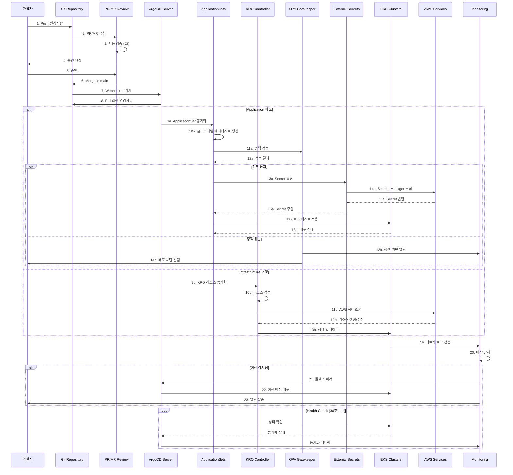

# GitOps 기반 EKS 클러스터 운영

> 📅 **작성일**: 2025-02-09 | **수정일**: 2026-02-18 | ⏱️ **읽는 시간**: 약 6분

> **📌 기준 버전**: ArgoCD v2.13+ / v3 (프리릴리즈), EKS Capability for Argo CD (GA), Kubernetes 1.32


## 개요

대규모 EKS 클러스터를 안정적이고 확장 가능하게 운영하기 위해서는 GitOps 원칙을 따른 자동화된 배포 및 관리 전략이 필수입니다. 이 문서는 ArgoCD, KRO/ACK, 그리고 Infrastructure as Code 패턴을 활용하여 프로덕션급 클러스터 운영 환경을 구축하는 방법을 설명합니다.

### 문제 해결

전통적인 EKS 클러스터 운영에서는 다음의 문제들이 있었습니다:

- 수동 설정으로 인한 환경 간 불일치
- 인프라 변경 이력 추적 어려움
- 대규모 멀티클러스터 관리의 복잡성
- 배포 검증 및 롤백 프로세스의 부재
- 정책 준수 자동화 부족

이 아키텍처는 이러한 문제들을 해결하기 위해 설계되었습니다.

## 기술적 고려사항 및 아키텍처 요약

### 핵심 제안 사항

**1. GitOps 플랫폼 선택**

- ArgoCD ApplicationSets를 활용한 멀티 클러스터 관리
- Progressive Delivery를 위한 Flagger 통합

:::tip ArgoCD as EKS Capability (re:Invent 2025)
ArgoCD는 **EKS Capability**로 제공됩니다. 기존 EKS Add-on과 달리, EKS Capability는 워커 노드 **외부**의 AWS 관리 계정에서 실행되며, 설치·업그레이드·스케일링·HA를 AWS가 완전 관리합니다. EKS 콘솔의 **Capabilities** 탭에서 활성화하거나 AWS CLI/API로 생성할 수 있습니다.

```bash
# EKS Capability로 ArgoCD 생성
aws eks create-capability \
  --cluster-name my-cluster \
  --capability-type ARGOCD \
  --role-arn arn:aws:iam::123456789012:role/eks-argocd-capability-role
```

**주요 차이점 (Add-on vs Capability):**
- **Add-on**: 클러스터 내부에서 실행, 사용자가 리소스 관리
- **Capability**: AWS 관리 계정에서 실행, 제로 운영 오버헤드
- AWS Identity Center 통합 SSO, Secrets Manager·ECR·CodeConnections 네이티브 연동
:::

**2. Infrastructure as Code 전략**

- **ACK/KRO (Kubernetes Resource Orchestrator)** 채택 권장
  - 기존 Terraform 상태와의 점진적 마이그레이션 가능
  - Kubernetes 네이티브 접근 방식으로 운영 일관성 확보
  - Helm 대비 더 유연한 리소스 오케스트레이션

**3. 자동화 핵심 요소**

- Blue/Green 방식의 EKS 업그레이드 자동화
- Addon 버전 관리를 위한 자동화된 테스트 파이프라인
- Policy as Code (OPA/Gatekeeper) 기반 거버넌스

**4. 보안 및 규정 준수**

- External Secrets Operator + AWS Secrets Manager 조합
- Git 서명 및 RBAC 기반 승인 워크플로우
- 실시간 규정 준수 모니터링 대시보드

### 예상 ROI

| 효과 | 개선 |
|------|------|
| 운영 부담 | 수동 작업 자동화로 감소 |
| 업그레이드 빈도 | 연 1회 → 분기별 가능 |
| 장애 복구 | 자동 롤백으로 시간 개선 |

## 아키텍처 개요

GitOps 기반 EKS 클러스터 운영은 Git을 단일 진실 공급원으로 삼고, 선언적 구성 관리를 통해 클러스터 상태를 자동으로 동기화합니다.

### GitOps 워크플로우



## 멀티클러스터 관리 전략

### ApplicationSets 기반 클러스터 관리

ArgoCD ApplicationSets는 멀티클러스터 환경에서 일관된 배포를 관리하는 핵심 도구입니다.

**핵심 전략:**

#### 1. Cluster Generator

- 클러스터 레지스트리 기반 동적 애플리케이션 생성
- 레이블 기반 클러스터 그룹핑 (환경, 리전, 목적별)

#### 2. Git Directory Generator

- 환경별 구성 관리 (dev/staging/prod)
- 클러스터별 오버라이드 설정

#### 3. Matrix Generator

- 클러스터 × 애플리케이션 조합 관리
- 조건부 배포 규칙 적용

## 멀티클러스터 자동화

### EKS 클러스터 업그레이드 자동화

Blue/Green 배포 패턴을 사용하여 무중단 클러스터 업그레이드를 구현합니다.

**준비 단계**

- 새 클러스터 프로비저닝 (KRO)
- Addon 호환성 검증
- 보안 정책 동기화

**마이그레이션 단계**

- 워크로드 점진적 이동
- 트래픽 가중치 조정 (0% → 100%)
- 실시간 모니터링

**검증 및 완료**

- 자동화된 smoke test
- 성능 메트릭 비교
- 구 클러스터 제거

## 보안 및 거버넌스

### Git Repository 구조 설계

효과적인 GitOps 구현을 위해서는 적절한 저장소 구조가 필수입니다.

**Monorepo vs Polyrepo 권장사항:**

| 대상 | 권장 방식 | 이유 |
|------|---------|------|
| 애플리케이션 코드 | Polyrepo | 팀별 독립성 보장 |
| 인프라 구성 | Monorepo | 중앙 관리 및 일관성 확보 |
| 정책 정의 | Monorepo | 전사 표준화 강제 |

### Secret 관리 아키텍처

:::info External Secrets Operator (ESO) 권장

**주요 특징:**

- 중앙집중식 Secret 저장소
- 자동 로테이션 지원
- 세밀한 접근 제어 (IRSA)
- 암호화된 Git 저장 불필요

AWS Secrets Manager와 함께 사용하면 조직의 보안 정책을 효과적으로 구현할 수 있습니다.

:::

## Terraform에서 KRO로의 마이그레이션 전략

기존 Terraform 환경에서 KRO로 점진적으로 전환합니다. 이 접근 방식은 위험을 최소화하면서 가치를 지속적으로 제공합니다.

### Phase 1: 파일럿 (2개월)

- Dev 환경 1개 클러스터 대상
- 기본 리소스만 마이그레이션 (VPC, Subnets, Security Groups)
- Terraform 상태 임포트 및 검증

### Phase 2: 확대 적용 (3개월)

- Staging 환경 포함
- EKS 클러스터 및 Addon 관리 추가
- 자동화 파이프라인 구축

### Phase 3: 전체 마이그레이션 (4개월)

- Production 환경 순차 적용
- 모든 AWS 리소스 KRO 관리
- Terraform 완전 제거

### KRO 리소스 정의 예시

다음은 KRO를 사용한 EKS 클러스터 및 노드 그룹 정의의 예시입니다.

```yaml
apiVersion: kro.run/v1alpha1
kind: ResourceGroup
metadata:
  name: eks-cluster-us-east-1-prod
spec:
  schema:
    apiVersion: v1alpha1
    kind: EKSClusterStack
    spec:
      clusterName: string
      region: string | default="us-east-1"
      version: string | default="1.32"
  resources:
    # EKS 클러스터 정의 (ACK EKS Controller)
    - id: cluster
      template:
        apiVersion: eks.services.k8s.aws/v1alpha1
        kind: Cluster
        metadata:
          name: ${schema.spec.clusterName}
        spec:
          name: ${schema.spec.clusterName}
          version: ${schema.spec.version}
          roleARN: arn:aws:iam::123456789012:role/eks-cluster-role
          resourcesVPCConfig:
            subnetIDs:
              - subnet-0a1b2c3d4e5f00001
              - subnet-0a1b2c3d4e5f00002
            endpointPrivateAccess: true
            endpointPublicAccess: false

    # 노드 그룹 정의 (ACK EKS Controller)
    - id: nodegroup
      template:
        apiVersion: eks.services.k8s.aws/v1alpha1
        kind: Nodegroup
        metadata:
          name: ${schema.spec.clusterName}-nodegroup
        spec:
          clusterName: ${schema.spec.clusterName}
          nodegroupName: ${schema.spec.clusterName}-ng-01
          instanceTypes:
            - c7i.8xlarge
          scalingConfig:
            minSize: 3
            maxSize: 50
            desiredSize: 10
          amiType: AL2023_x86_64_STANDARD
```

## EKS Capabilities: 완전 관리형 플랫폼 기능 (re:Invent 2025)

AWS re:Invent 2025에서 발표된 **EKS Capabilities**는 Kubernetes 네이티브 플랫폼 기능을 AWS가 완전 관리하는 새로운 접근 방식입니다. 기존 EKS Add-on이 클러스터 내부에서 실행되는 것과 달리, EKS Capabilities는 **AWS 관리 계정에서 워커 노드 외부에서 실행**됩니다.

### 출시 시점의 3가지 핵심 Capability

| Capability | 기반 프로젝트 | 역할 |
|-----------|------------|------|
| **Argo CD** | CNCF Argo CD | 선언적 GitOps 기반 지속적 배포 |
| **ACK** | AWS Controllers for Kubernetes | Kubernetes 네이티브 AWS 리소스 관리 |
| **kro** | Kube Resource Orchestrator | 상위 수준 Kubernetes/AWS 리소스 구성 |

### EKS Capability for Argo CD 주요 특징

**운영 오버헤드 제로:**
- AWS가 설치, 업그레이드, 패치, HA, 스케일링을 모두 관리
- Argo CD 컨트롤러, Redis, Application Controller 관리 불필요
- 자동 백업 및 재해 복구

**Hub-and-Spoke 아키텍처:**
- 전용 허브 클러스터에서 Argo CD Capability 생성
- 여러 스포크 클러스터를 중앙에서 관리
- 크로스클러스터 통신을 AWS가 처리

**AWS 서비스 네이티브 통합:**
- **AWS Identity Center**: SSO 기반 인증, RBAC 역할 매핑
- **AWS Secrets Manager**: 시크릿 자동 동기화
- **Amazon ECR**: 프라이빗 레지스트리 네이티브 접근
- **AWS CodeConnections**: Git 리포지토리 연결

### Self-managed vs EKS Capability 비교

| 항목 | Self-managed ArgoCD | EKS Capability for ArgoCD |
|------|-------------------|--------------------------|
| 설치 및 업그레이드 | 직접 관리 (Helm/Kustomize) | AWS 완전 관리 |
| 실행 위치 | 클러스터 내부 (워커 노드) | AWS 관리 계정 (외부) |
| HA 구성 | 직접 설정 (Redis HA 등) | 자동 (Multi-AZ) |
| 인증 | 직접 구성 (Dex, OIDC 등) | AWS Identity Center 통합 |
| 멀티클러스터 | kubeconfig 직접 관리 | AWS 네이티브 크로스클러스터 |
| 시크릿 관리 | ESO 별도 설치 | Secrets Manager 네이티브 연동 |
| 비용 | EC2 리소스 소비 | 별도 Capability 요금 |

:::warning Self-managed에서 마이그레이션
기존 Self-managed ArgoCD에서 EKS Capability로 마이그레이션할 때, 기존 Application/ApplicationSet 리소스는 호환됩니다. 단, Custom Resource Definition 확장이나 커스텀 플러그인을 사용하는 경우 호환성을 사전에 확인하세요.
:::

### EKS Capability 활성화 방법

**콘솔:**
1. EKS 콘솔 → 클러스터 → **Capabilities** 탭
2. **Create capabilities** 클릭
3. Argo CD 체크박스 선택 → Capability Role 지정
4. AWS Identity Center 인증 설정

**CLI:**
```bash
# Argo CD Capability 생성
aws eks create-capability \
  --cluster-name prod-hub-cluster \
  --capability-type ARGOCD \
  --role-arn arn:aws:iam::123456789012:role/eks-argocd-role \
  --configuration '{
    "identityCenterConfig": {
      "instanceArn": "arn:aws:sso:::instance/ssoins-xxxxxxxxx"
    }
  }'

# ACK Capability 생성
aws eks create-capability \
  --cluster-name prod-hub-cluster \
  --capability-type ACK \
  --role-arn arn:aws:iam::123456789012:role/eks-ack-role

# kro Capability 생성
aws eks create-capability \
  --cluster-name prod-hub-cluster \
  --capability-type KRO \
  --role-arn arn:aws:iam::123456789012:role/eks-kro-role
```

## ArgoCD v3 업데이트 (2025)

ArgoCD v3가 KubeCon EU 2025에서 프리릴리즈되었으며, 주요 개선 사항은 다음과 같습니다:

### 확장성 개선

- **대규모 클러스터 지원**: 수천 개의 Application 리소스 관리 성능 향상
- **Sharding 개선**: Application Controller의 수평 확장 강화
- **메모리 최적화**: 대규모 매니페스트 처리 시 메모리 사용량 감소

### 보안 강화

- **RBAC 개선**: 더 세밀한 권한 제어
- **Audit Logging**: 모든 작업에 대한 감사 로그 강화
- **시크릿 관리**: External Secrets Operator와의 통합 개선

### 마이그레이션 가이드

ArgoCD v2.x에서 v3로의 마이그레이션:

1. v2.13으로 먼저 업그레이드 (호환성 확인)
2. 사용 중단 API 확인 및 업데이트
3. v3 프리릴리즈에서 기능 테스트
4. 프로덕션 업그레이드 실행

:::warning 주의사항
ArgoCD v3는 2025년 상반기 프리릴리즈 상태입니다. 프로덕션 환경에서는 안정 버전(v2.13+)을 사용하고, v3 GA 릴리즈를 확인한 후 마이그레이션하세요.
:::

## 결론

GitOps 기반 대규모 EKS 클러스터 운영 전략은 수동 관리 부담을 획기적으로 줄이고, 안정성과 확장성을 크게 향상시킬 수 있습니다.

:::tip 핵심 권장사항

**1. EKS Capabilities 활용 (ArgoCD + ACK + kro)**

- ArgoCD를 EKS Capability로 운영하여 운영 오버헤드 제거
- ACK/kro를 통한 Kubernetes 네이티브 인프라 관리
- AWS Identity Center 통합으로 SSO 기반 접근 제어

**2. ArgoCD ApplicationSets를 활용한 멀티클러스터 관리**

- Hub-and-Spoke 아키텍처로 중앙 관리
- 클러스터 간 일관된 배포 및 환경별 커스터마이징

**3. 자동화된 Blue/Green 업그레이드 전략 활용**

- 무중단 클러스터 업그레이드
- 자동 롤백 기능

**4. Policy as Code 기반 거버넌스**

- OPA/Gatekeeper를 통한 정책 강제
- 규정 준수 자동화

:::

단계적 마이그레이션 접근을 통해 리스크를 최소화하면서도 빠르게 가치를 실현할 수 있습니다.
