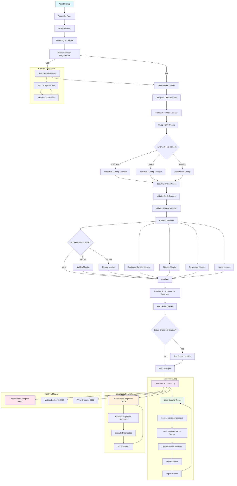

# EKS Node Monitoring Agent

> 📅 **작성일**: 2025-08-26 | ⏱️ **읽는 시간**: 약 9분


## 개요

EKS Node Monitoring Agent(NMA)는 AWS가 제공하는 노드 상태 모니터링 도구입니다. EKS 클러스터의 노드에서 발생하는 하드웨어 및 시스템 레벨 문제를 자동으로 감지하고 보고합니다. 2024년에 정식 출시된 이 서비스는 노드 자동 복구(Node Auto Repair) 기능과 함께 작동하여 클러스터의 안정성을 향상시킵니다.

### 문제 해결

전통적인 EKS 클러스터 운영에서는 다음의 문제들이 있었습니다:

- 하드웨어 장애의 조기 감지 부족
- 시스템 레벨 문제의 수동 모니터링 필요
- 노드 상태 변화에 대한 지연된 대응
- 문제 감지와 자동 복구의 통합 부재

NMA는 이러한 문제들을 해결하기 위해 설계되었습니다.

### EKS Node Monitoring Agent란?

### 주요 특징

- **로그 기반 문제 감지**: 시스템 로그를 실시간으로 분석하여 패턴 매칭
- **자동 이벤트 생성**: 문제 감지 시 Kubernetes Events 및 Node Conditions 자동 생성
- **CloudWatch 통합**: 감지된 문제를 CloudWatch로 전송하여 중앙 집중식 모니터링
- **EKS Add-on 지원**: 간편한 설치 및 관리

:::warning 중요

NMA는 노드 상태 문제를 자동으로 감지하는 유용한 도구이지만, 단독으로는 완전한 모니터링 솔루션이 될 수 없습니다. 다음의 제한 사항을 고려한 적절한 기대치 설정과 보완 도구 활용이 필요합니다.

:::

:::tip 핵심 권장사항

**✅ 권장하는 사용법**

- NMA를 노드 상태 감지 레이어로 활용
- Container Insights나 Prometheus로 메트릭 수집 보완
- Node Auto Repair와 함께 사용하여 자동 복구 구현
- 환경별 특성에 맞게 임계값 조정

**❌ 피해야 할 사용법**

- NMA만으로 전체 모니터링 의존 불가
- 급격한 하드웨어 장애 대응 불가

:::

## 1. 설계 목표

### 1.1 포괄적인 노드 상태 모니터링

NMA는 EKS 노드의 다양한 시스템 컴포넌트를 모니터링합니다:

- **Container Runtime**: Docker/containerd의 상태 확인
- **Storage System**: 디스크 공간 및 I/O 성능 모니터링
- **Networking**: 네트워크 연결성 및 구성 검증
- **Kernel**: 커널 모듈 및 시스템 상태 점검
- **Accelerated Hardware**: GPU(NVIDIA) 및 Neuron 칩 상태 (하드웨어 감지 시)

### 1.2 Kubernetes 네이티브 통합

NMA는 controller-runtime을 사용하여 Kubernetes와 긴밀하게 통합됩니다:

```go
mgr, err := controllerruntime.NewManager(controllerruntime.GetConfigOrDie(), controllerruntime.Options{
    Logger:                 log.FromContext(ctx),
    Scheme:                 scheme.Scheme,
    HealthProbeBindAddress: controllerHealthProbeAddress,
    BaseContext:            func() context.Context { return ctx },
    Metrics:                server.Options{BindAddress: controllerMetricsAddress},
})
```

### 1.3 다양한 EKS 환경 지원

REST 설정 로직에서 확인할 수 있듯이, NMA는 다양한 EKS 환경을 지원합니다:

- **EKS Auto**: 특별한 사용자 impersonation 플로우 사용
- **Legacy RBAC**: 기존 권한 모델 지원
- **Standard**: 표준 Pod 기반 인증

## 2. 아키텍처 및 동작 원리

### 2.1 Agent Startup 및 초기화 흐름

다음 다이어그램은 NMA의 시작 과정과 모니터링 루프의 전체 흐름을 보여줍니다.



### 2.2 모니터 등록 및 관리

NMA는 모니터 구성을 통해 각 서브시스템을 관리합니다. 다음은 모니터 등록의 구조를 보여줍니다.

```go
var monitorConfigs = []monitorConfig{
    {
        Monitor:       &runtime.RuntimeMonitor{},
        ConditionType: rules.ContainerRuntimeReady,
    },
    {
        Monitor:       storage.NewStorageMonitor(),
        ConditionType: rules.StorageReady,
    },
    // ... 추가 모니터들
}
```

각 모니터는 해당하는 Node Condition과 연결되어 상태를 보고합니다.

### 2.3 Node Condition 기반 상태 보고

NMA는 Kubernetes의 Node Condition 메커니즘을 활용하여 각 서브시스템의 상태를 보고합니다:

- `ContainerRuntimeReady`: 컨테이너 런타임 상태
- `StorageReady`: 스토리지 시스템 상태
- `NetworkingReady`: 네트워킹 상태
- `KernelReady`: 커널 상태
- `AcceleratedHardwareReady`: GPU/Neuron 하드웨어 상태 (조건부)

### 2.4 실시간 진단 기능

NodeDiagnostic CRD를 통한 온디맨드 진단 실행:

```go
diagnosticController := controllers.NewNodeDiagnosticController(mgr.GetClient(), hostname, runtimeContext)
```

이를 통해 운영자는 특정 노드에서 실시간으로 진단 명령을 실행할 수 있습니다.

### 2.5 관찰 가능성 (Observability)

NMA는 다양한 엔드포인트를 통해 관찰 가능성을 제공합니다:

- **Health Probe** (`:8081`): Kubernetes 헬스 체크
- **Metrics** (`:8080`): Prometheus 메트릭 노출
- **PProf** (`:8082`): Go 프로파일링 (선택적)

### 2.6 콘솔 진단 로깅

`-console-diagnostics` 플래그 활성화 시, 시스템 정보를 `/dev/console`에 주기적으로 기록:

```go
if enableConsoleDiagnostics {
    startConsoleDiagnostics(ctx)
}
```

이는 인스턴스 레벨에서의 가시성을 제공합니다.

### 2.7 배포 및 운영 특징

#### 2.7.1 DaemonSet 기반 배포

`agent.tpl.yaml`에서 확인할 수 있듯이, NMA는 DaemonSet으로 배포되어 모든 워커 노드에서 실행됩니다:

```yaml
kind: DaemonSet
apiVersion: apps/v1
metadata:
  name: eks-node-monitoring-agent
  namespace: kube-system
```

#### 2.7.2 노드 선택 및 제약사항

`values.yaml`의 affinity 설정을 통해 특정 노드 타입에서만 실행되도록 제한:

- Fargate 노드 제외
- EKS Auto 컴퓨트 타입 제외
- HyperPod 노드 제외
- AMD64/ARM64 아키텍처만 지원

#### 2.7.3 권한 관리

`agent.tpl.yaml`의 RBAC 설정을 통한 최소 권한 원칙 적용:

```yaml
rules:
  # monitoring permissions
  - apiGroups: [""]
    resources: ["events"]
    verbs: ["create", "patch"]
  # nodediagnostic permissions
  - apiGroups: ["eks.amazonaws.com"]
    resources: ["nodediagnostics"]
    verbs: ["get", "watch", "list"]
```

#### 2.7.4 리소스 효율성

`values.yaml`에 정의된 리소스 제한으로 경량 운영:

```yaml
resources:
  requests:
    cpu: 10m
    memory: 30Mi
  limits:
    cpu: 250m
    memory: 100Mi
```

### 2.8 감지 가능한 문제 유형

#### 2.8.1 Conditions (자동 복구 대상)

- `DiskPressure`: 디스크 공간 부족
- `MemoryPressure`: 메모리 부족
- `PIDPressure`: 프로세스 ID 고갈
- `NetworkUnavailable`: 네트워크 인터페이스 문제
- `KubeletUnhealthy`: Kubelet 서비스 이상
- `ContainerRuntimeUnhealthy`: Docker/containerd 문제

#### 2.8.2 Events (경고 용도)

- 커널 소프트 락업
- I/O 지연
- 파일시스템 에러
- 네트워크 패킷 손실
- 하드웨어 에러 징후 (Network, Storage, GPU, CPU, Memory)

## 3. 배포 방식별 차이점

### 3.1 Manual Mode (DaemonSet)

**장점:**

- 유연한 버전 관리
- ConfigMap 기반 설정 변경
- 커스텀 설정 가능

**단점:**

- kubelet 의존성 높음
- 노드 부트스트랩 시 지연
- kubelet 장애 시 영향 받음

### 3.2 EKS Auto Mode

**장점:**

- AMI에 직접 내장
- kubelet과 독립적 실행
- 더 높은 가용성
- 빠른 문제 감지

**단점:**

- 업데이트 시 AMI 교체 필요
- 커스터마이징 제한적

## 4. 기술적 제한사항

### 4.1 메트릭 수집 한계

- **NMA는 메트릭 수집 도구가 아님**: 성능 메트릭(CPU, 메모리 사용률 등) 수집 불가
- **로그 파싱 방식**: cAdvisor를 사용하지 않으며, 순수 로그 분석 기반
- **Prometheus 엔드포인트**: 제한적인 건강 상태 메트릭만 노출 (포트 8080)

### 4.2 대체 백엔드 사용 시 제약

:::warning CloudWatch 외 백엔드 사용 시

- 네이티브 ADOT 통합 없음
- Prometheus 메트릭 범위 매우 제한적
- 설정 변경 옵션 부재
- 공식 문서 및 지원 부족

:::

### 4.3 하드웨어 장애 감지 한계

**감지 가능:**

- ✅ 점진적 성능 저하
- ✅ I/O 에러 증가
- ✅ 메모리 ECC 에러

**감지 불가능:**

- ❌ 급작스런 전원 차단
- ❌ 즉각적인 하드웨어 고장
- ❌ 네트워크 완전 단절

## 5. 권장 구현 전략

### 5.1 다층 모니터링 아키텍처

```
통합 모니터링 스택:
├── L1: 상태 감지 (NMA)
│   └── 노드 문제 조기 감지
├── L2: 메트릭 수집 (Container Insights/Prometheus)
│   └── 상세 성능 데이터
├── L3: 자동 대응 (Node Auto Repair)
│   └── 문제 노드 자동 교체
└── L4: 통합 대시보드 (CloudWatch/Grafana)
    └── 종합 모니터링 뷰
```

### 5.2 Prometheus 사용 시 권장 구성

NMA와 Node Exporter를 함께 사용할 때는 다음 구성을 권장합니다.

```yaml
apiVersion: v1
kind: Service
metadata:
  name: monitoring-stack
spec:
  components:
    - name: nma
      purpose: "노드 상태 이벤트"
      port: 8080
    - name: node-exporter
      purpose: "상세 시스템 메트릭"
      port: 9100
    - name: kube-state-metrics
      purpose: "클러스터 상태 메트릭"
      port: 8080
```

## 6. 비용 및 성능 고려사항

### 6.1 리소스 사용량

NMA는 매우 가벼운 구성 요소입니다.

| 리소스 | 요구사항 |
|--------|---------|
| CPU | 100m-200m (평상시) |
| Memory | 200Mi-400Mi |
| Network | 1-2MB/min (CloudWatch 전송) |
| 로그 저장 | 최대 100MB |

### 6.2 CloudWatch 비용

| 항목 | 비용 |
|------|------|
| 커스텀 메트릭 | $0.30/metric/month |
| 이벤트 | $1.00/million events |
| 로그 | $0.50/GB ingested |

## 7. 모범 사례

### 7.1 프로덕션 배포

1. **단계적 롤아웃**: Dev → Staging → Production
2. **알림 임계값 조정**: 환경별 특성 고려
3. **자동 복구 신중히 활성화**: 초기에는 모니터링만
4. **정기적인 테스트**: 월별 장애 시뮬레이션

### 7.2 다른 도구와의 통합

| 조합 | 설명 |
|------|------|
| NMA + Container Insights | 완전한 AWS 네이티브 가시성 |
| NMA + Prometheus + Grafana | 오픈소스 기반 모니터링 스택 |
| NMA + Datadog/New Relic | 엔터프라이즈급 모니터링 솔루션 |
