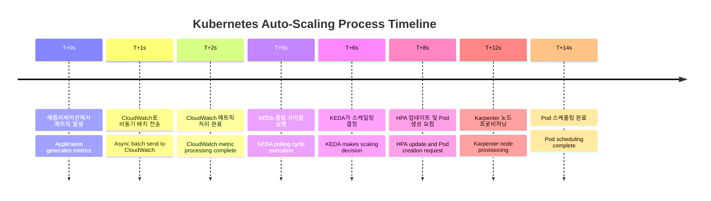
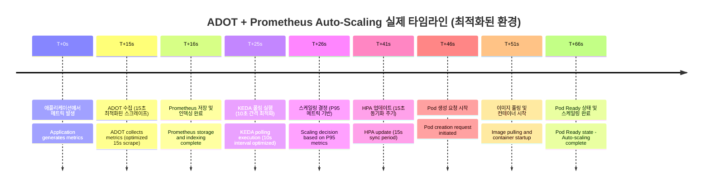

# 고속 스케일링 아키텍처: 15초 미만 Pod 스케일링

> 📅 **작성일**: 2025-06-30 | ⏱️ **읽는 시간**: 약 7분

## 개요

클라우드 네이티브 애플리케이션은 급격한 트래픽 변화에 빠르게 대응할 수 있어야 합니다. 특히 대규모 Amazon EKS(Elastic Kubernetes Service) 환경에서는 수초 내에 스케일링이 완료되어야 하는 요구사항이 점점 증가하고 있습니다. 이 글에서는 15,000개 이상의 Pod를 운영하는 글로벌 규모의 EKS 환경에서 15초 미만의 고속 스케일링을 달성하기 위한 두 가지 아키텍처 접근 방식을 상세히 비교 분석합니다.

## 현재 환경의 도전 과제

주요 도전 과제는 다음과 같습니다:

- **글로벌 규모**: 3개 리전, 28개 EKS 클러스터, 15,000개 Pod 운영
- **대용량 트래픽**: 일일 773.4K 리퀘스트 처리
- **지연 시간 문제**: 현재 HPA + Karpenter 조합으로 1-3분의 스케일링 지연 발생
- **메트릭 수집 지연**: CloudWatch 메트릭의 1-3분 지연으로 실시간 대응 불가

## 솔루션 아키텍처: 두 가지 접근 방식

### 방식 1: CloudWatch High-Resolution Integration

CloudWatch의 고해상도 메트릭을 직접 활용하여 AWS 네이티브 환경에서 최적화된 스케일링을 구현합니다.

### 주요 구성 요소

- **Application Layer**: CloudWatch PutMetricData API를 통한 1초 해상도 메트릭 전송
- **CloudWatch Container Insights**: 컨테이너 수준의 상세 메트릭 수집
- **KEDA CloudWatch Scaler**: 5초 간격의 직접 폴링
- **HPA v2**: External Metrics를 통한 스케일링 결정
- **Karpenter**: 사전 준비된 노드 풀을 통한 빠른 노드 프로비저닝

### 스케일링 타임라인 (15초)

### 방식 2: ADOT + Prometheus 기반 아키텍처

AWS Distro for OpenTelemetry(ADOT)와 Prometheus를 결합한 오픈소스 기반의 고성능 메트릭 파이프라인을 구축합니다.

### 주요 구성 요소

- **ADOT Collector**: DaemonSet과 Sidecar 하이브리드 배포
- **Prometheus**: HA 구성 및 Remote Storage 연동
- **Thanos Query Layer**: 멀티 클러스터 글로벌 뷰 제공
- **KEDA Prometheus Scaler**: 2초 간격의 고속 폴링
- **Grafana Mimir**: 장기 저장 및 고속 쿼리 엔진

### 스케일링 타임라인 (70초)

## 상세 비교 분석

### CloudWatch High Res vs ADOT + Prometheus 비교

## 주요 특징 분석

### CloudWatch High Resolution Metric

- ✅ **빠른 메트릭 수집**: 1-2초의 낮은 지연시간
- ✅ **간단한 설정**: AWS 네이티브 통합
- ❌ **제한된 처리량**: 계정당 1,000 TPS
- ❌ **Pod 한계**: 클러스터당 최대 5,000개

### ADOT + Prometheus

- ✅ **높은 처리량**: 100,000+ TPS 지원
- ✅ **확장성**: 클러스터당 20,000+ Pod 지원
- ✅ **빠른 스케일링**: 전체 과정 65-70초
- ❌ **복잡한 설정**: 추가 컴포넌트 관리 필요

### 권장 사용 사례

**CloudWatch High Resolution Metric 적합한 경우:**

- 소규모 애플리케이션 (Pod 5,000개 이하)
- 간단한 모니터링 요구사항
- AWS 네이티브 솔루션 선호

**ADOT + Prometheus 적합한 경우:**

- 대규모 클러스터 (Pod 20,000개 이상)
- 높은 메트릭 처리량 요구
- 세밀한 모니터링 및 커스터마이징 필요

## CloudWatch High Res vs ADOT + Prometheus 비용 비교

### CloudWatch High Resolution Metric

- ❌ **높은 메트릭 비용**: AWS CloudWatch 메트릭 요금
- ❌ **API 호출 비용**: 대량 메트릭 전송 시 추가 비용
- ✅ **관리 오버헤드 없음**: 별도 인프라 관리 불필요

### 🏗️ AMP (Amazon Managed Service for Prometheus)

**장점:**

- ✅ **운영 부담 없음**: AWS가 완전 관리
- ✅ **자동 스케일링**: 트래픽에 따른 자동 확장
- ✅ **보안 통합**: IAM, VPC 등 AWS 보안 모델 통합

**단점:**

- ❌ **높은 메트릭 비용**:
  - 수집: $0.90/million samples
  - 저장: $0.03/GB-month
  - 쿼리: $0.01/1000 query samples
- ❌ **vendor lock-in**: AWS 종속성

### 🔧 Self-managed Prometheus

**장점:**

- ✅ **낮은 메트릭 비용**: 스토리지 비용만 발생
- ✅ **완전한 제어**: 설정 및 최적화 자유도
- ✅ **벤더 중립성**: 클라우드 이식성

**단점:**

- ❌ **높은 운영 복잡성**:
  - HA 구성 관리
  - 백업/복구 전략
  - 성능 튜닝
  - 보안 패치 관리
- ❌ **전문 인력 필요**: Prometheus 운영 경험 필수

## 💡 CloudWatch Direct vs Prometheus 솔루션 비용 비교

## 🎯 결론 및 권장사항

## ⚖️ 핵심 트레이드오프

**비용 효율성**: Self-managed > AMP > CloudWatch High Res

**운영 편의성**: CloudWatch High Res > AMP > Self-managed

**확장성**: Self-managed ≥ AMP > CloudWatch High Res

**구현 베스트 프랙티스**

## 하이브리드 접근 방식 (권장)

실제 프로덕션 환경에서는 두 가지 방식을 혼합한 하이브리드 접근을 권장합니다:

1. **Mission Critical 서비스**: ADOT + Prometheus로 10-13초 스케일링 달성
2. **일반 서비스**: CloudWatch Direct로 12-14초 스케일링 및 운영 단순화
3. **점진적 마이그레이션**: CloudWatch에서 시작하여 필요에 따라 ADOT로 전환

## 결론

15초 미만의 고속 스케일링은 불가능한 목표가 아닙니다. CloudWatch High Resolution Metric 방식은 AWS 네이티브 환경에서 빠른 구축과 안정적인 운영을 제공하며, ADOT + Prometheus 방식은 최고 수준의 성능과 확장성을 제공합니다.

상황에 맞는 적절한 선택을 통해, 대규모 EKS 환경에서도 빠른 스케일링과 높은 가용성을 동시에 달성할 수 있습니다. 하이브리드 접근 방식을 통해 리스크를 최소화하면서 점진적으로 최적의 아키텍처로 진화시켜 나가는 것을 권장합니다.
