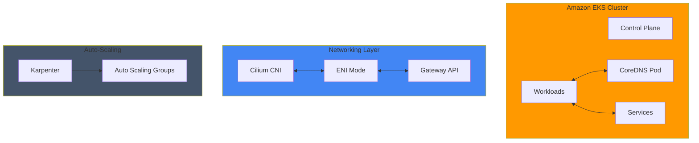

# Performance & Networking

이 섹션에서는 Amazon EKS 클러스터의 성능 최적화와 네트워킹 관련 심화 기술 문서들을 다룹니다. DNS 성능 튜닝, 네트워크 성능 최적화, 비용 관리, 자동 스케일링 등 프로덕션 환경에서 필수적인 주제들을 다룹니다.

## 📚 주요 문서

### DNS 성능 최적화
- **[Supercharging EKS DNS Performance: A Deep Dive into CoreDNS Optimization](./coredns-monitoring-optimization.md)**
  - CoreDNS 설정 최적화 방법
  - DNS 쿼리 성능 튜닝 전략
  - 모니터링 및 메트릭 수집
  - 실제 성능 개선 사례

### 네트워크 성능 최적화
- **[Unleashing Network Performance: Mastering Cilium ENI Mode on Amazon EKS](./cilium-eni-gateway-api.md)**
  - Cilium ENI 모드 구성 및 최적화
  - Gateway API 통합
  - 네트워크 처리량 향상 기법
  - 실제 벤치마크 결과

### 트래픽 관리
- **[East-West Traffic Best Practices for EKS](./east-west-traffic-best-practice.md)**
  - 클러스터 내부 트래픽 최적화
  - 서비스 간 통신 패턴
  - 네트워크 정책 구현

### 자동 스케일링
- **[Karpenter Auto-Scaling for EKS](./karpenter-autoscaling.md)**
  - Karpenter를 통한 노드 자동 스케일링
  - 비용 최적화 전략
  - 프로비저닝 최적화

- **[Fast Scaling Architecture for EKS](./fast-scaling-architecture.md)**
  - 빠른 스케일 아웃 아키텍처 설계
  - 워크로드 배치 최적화

### 비용 관리
- **[Cost Management for EKS](./cost-management.md)**
  - EKS 클러스터 비용 최적화
  - 리소스 효율화 전략

## 🎯 학습 목표

이 섹션을 통해 다음을 학습할 수 있습니다:

- EKS 클러스터의 DNS 성능 튜닝 기법
- 네트워크 처리량 최적화 방법
- 효율적인 트래픽 라우팅 및 관리
- 자동 스케일링을 통한 탄력적 리소스 관리
- 네트워크 비용 최적화 전략
- 프로덕션 환경에서의 성능 모니터링

## 🏗️ 아키텍처 패턴

## 🔧 주요 기술 및 도구

| 기술 | 설명 | 사용 사례 |
|------|------|----------|
| **CoreDNS** | Kubernetes 기본 DNS 서버 | DNS 해상도 성능 최적화 |
| **Cilium** | eBPF 기반 네트워킹 플러그인 | 고성능 네트워크 처리 |
| **Gateway API** | 차세대 인그레스 API | 유연한 트래픽 라우팅 |
| **Karpenter** | 자동 스케일링 플랫폼 | 비용 효율적 노드 관리 |
| **Prometheus** | 메트릭 수집 및 저장 | 성능 모니터링 |

## 💡 핵심 개념

### DNS 성능 최적화
- **클러스터 DNS 이해**: CoreDNS가 EKS에서 어떻게 작동하는지
- **캐싱 전략**: DNS 응답 시간 단축
- **부하 분산**: DNS 쿼리 분산

### 네트워크 최적화
- **ENI 모드**: AWS 네이티브 네트워킹
- **eBPF 기술**: 고성능 패킷 처리
- **대역폭 활용**: 네트워크 처리량 극대화

### 비용 효율화
- **Spot 인스턴스**: 낮은 비용의 노드
- **자동 스케일링**: 필요에 따른 리소스 조정
- **리소스 요청**: 적절한 CPU/메모리 설정

## 🔗 관련 카테고리

- [Observability & Monitoring](/docs/observability-monitoring) - 성능 메트릭 모니터링
- [Security & Compliance](/docs/security-compliance) - 네트워크 보안 정책
- [Hybrid & Multi-Cloud](/docs/hybrid-multicloud) - 하이브리드 환경 네트워킹

---

:::tip 팁
성능 최적화 작업을 시작하기 전에, 현재 상태의 베이스라인 메트릭을 반드시 수집하세요. 이를 통해 최적화의 효과를 정량적으로 측정할 수 있습니다.
:::

:::info 권장 순서
처음 학습하시는 분들께는 다음 순서로 진행하기를 권장합니다:
1. CoreDNS 모니터링 및 최적화 (DNS 기초)
2. Cilium ENI 모드 (네트워크 기초)
3. Karpenter 자동 스케일링 (비용 최적화)
4. 전체 아키텍처 통합
:::
