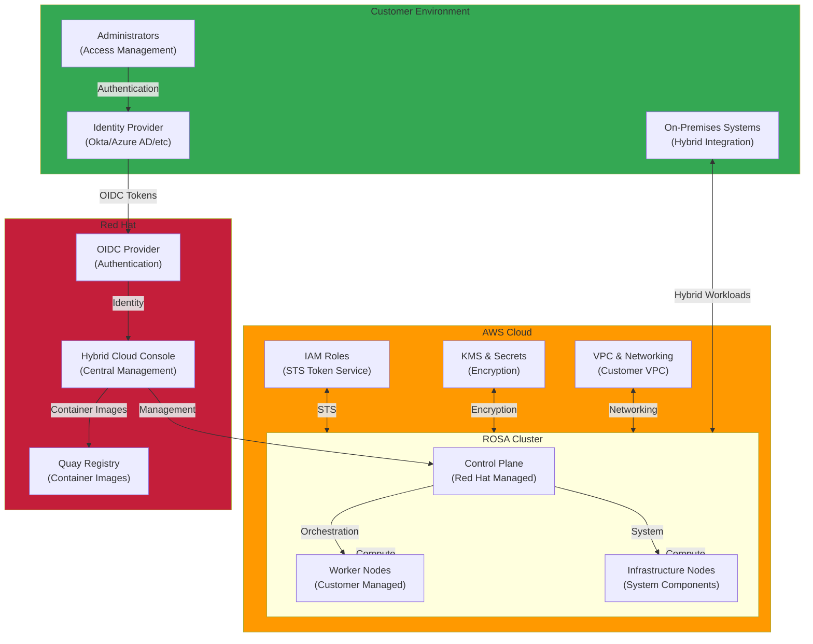

# ROSA (Red Hat OpenShift on AWS)

이 섹션에서는 Red Hat OpenShift Service on AWS (ROSA) 구축 및 운영에 대한 기술 문서들을 다룹니다. ROSA는 AWS와 Red Hat이 함께 관리하는 완전 관리형 OpenShift 서비스로, 엔터프라이즈급 Kubernetes 플랫폼을 쉽게 구축할 수 있습니다.

## 📚 주요 문서

### 보안 및 컴플라이언스
- **[ROSA Security Compliance Console Access Control](./rosa-security-compliance.md)**
  - Red Hat Hybrid Cloud Console 접근 제어 구성
  - 금융권 보안 요구사항 충족을 위한 접근 제어 전략
  - IdP (Identity Provider) 통합 및 MFA 구성
  - 역할 기반 접근 제어 (RBAC) 구성
  - 감사 및 로깅 설정

### 클러스터 설치 및 구성
- **[ROSA Demo Installation Guide](./rosa-demo-installation.md)**
  - STS (Security Token Service) 기반 클러스터 생성
  - ROSA CLI를 이용한 단계별 설치
  - 자동 스케일링 구성
  - 네트워크 및 IAM 역할 설정
  - 초기 클러스터 검증
  - 실습 환경 구성 및 테스트

## 🎯 학습 목표

이 섹션을 통해 다음을 학습할 수 있습니다:

- ROSA 클러스터 설치 및 초기 구성 방법
- STS 기반 IAM 역할 구성 및 보안 모범 사례
- Red Hat Hybrid Cloud Console을 통한 중앙 관리
- 금융권 보안 요구사항 충족 전략
- IdP 통합 및 사용자 인증 관리
- 클러스터 자동 스케일링 및 리소스 관리
- ROSA 클러스터의 운영 및 모니터링
- 온프레미스 OpenShift에서 ROSA로의 마이그레이션

## 🏗️ 아키텍처 패턴



## 🔧 주요 기술 및 도구

| 기술 | 설명 | 용도 |
|------|------|------|
| **ROSA CLI** | OpenShift 클러스터 관리 명령줄 도구 | 클러스터 생성, 관리, 삭제 |
| **STS (Security Token Service)** | 임시 보안 자격증명 | 보안이 강화된 IAM 역할 관리 |
| **OIDC** | OpenID Connect 프로토콜 | 외부 ID 제공자 통합 |
| **OVNKubernetes** | OpenShift 네트워크 플러그인 | 고성능 네트워킹 |
| **Cluster Autoscaler** | 자동 스케일링 | 워크로드에 따른 노드 자동 조정 |
| **Hybrid Cloud Console** | Red Hat 중앙 관리 포털 | 다중 클러스터 중앙 관리 |
| **Quay Registry** | 컨테이너 이미지 저장소 | 빌드 및 배포 자동화 |

## 💡 핵심 개념

### ROSA의 특징
- **완전 관리형 서비스**: AWS와 Red Hat이 공동으로 컨트롤 플레인 운영
- **고가용성**: 자동 패치 및 업데이트
- **보안**: STS 기반 임시 자격증명, OIDC 프로바이더 통합
- **유연성**: 고객이 워커 노드 완전 제어

### STS 기반 인증의 장점
- **임시 자격증명**: 영구 액세스 키 불필요
- **자동 토큰 갱신**: 토큰 만료 전 자동 갱신
- **최소 권한**: 필요한 최소한의 권한만 부여
- **감사 추적**: 모든 접근 기록 CloudTrail에 저장

### Red Hat Hybrid Cloud Console의 역할
- **중앙 집중식 관리**: 여러 클러스터를 한 곳에서 관리
- **다중 클라우드 지원**: AWS, Azure, GCP, 온프레미스 OpenShift 통합 관리
- **정책 기반 관리**: 보안 정책 중앙 시행
- **비용 추적**: 클러스터별 비용 모니터링

### 네트워크 구성
- **OVNKubernetes**: OpenVSwitch 기반 고성능 네트워킹
- **Network Policy**: Kubernetes 네트워크 정책 완벽 지원
- **Ingress Controller**: 기본 제공 인그레스 컨트롤러
- **Service Mesh Ready**: Istio/Kiali 통합 지원

## 💼 사용 사례

### 엔터프라이즈 마이그레이션
- **온프레미스 OpenShift → ROSA**: 기존 OpenShift에서 ROSA로 마이그레이션
- **관리 부담 감소**: 컨트롤 플레인 운영 자동화
- **비용 절감**: 운영 비용 감소
- **글로벌 확장**: 멀티 리전 배포

### 금융권 컴플라이언스
- **보안 요구사항 충족**: STS, OIDC, MFA 등 고급 보안
- **접근 제어**: 세밀한 권한 관리
- **감사 로깅**: 모든 활동 기록 및 추적
- **데이터 보호**: KMS 기반 암호화

### 하이브리드 클라우드 전략
- **온프레미스 + AWS**: 단일 플랫폼에서 관리
- **멀티 클라우드**: AWS, Azure, GCP 동시 관리
- **클라우드 버스팅**: 피크 시 클라우드로 확장
- **재해 복구**: 다중 리전 재해 복구 전략

## 📊 ROSA vs EKS vs 온프레미스 OpenShift

| 항목 | ROSA | EKS | 온프레미스 OpenShift |
|------|------|-----|----------------|
| **컨트롤 플레인 관리** | Red Hat/AWS | AWS | 고객 책임 |
| **보안** | 최고 수준 | 높음 | 구성 필요 |
| **비용** | 중간~높음 | 낮음~중간 | 초기 투자 큼 |
| **운영 복잡도** | 낮음 | 낮음 | 높음 |
| **개발자 경험** | 최고 | 높음 | 매우 높음 |
| **배포 속도** | 빠름 | 빠름 | 느림 |
| **하이브리드 지원** | 우수 | 보통 | 우수 |
| **멀티 클라우드** | 우수 | AWS만 | 우수 |

## 🚀 배포 패턴

### 1. 단일 클러스터 배포
```
ROSA Cluster
├── Development 네임스페이스
├── Staging 네임스페이스
└── Production 네임스페이스
```

### 2. 멀티 클러스터 배포
```
Hybrid Cloud Console (중앙 관리)
├── AWS Region 1 (ROSA)
├── AWS Region 2 (ROSA)
├── On-Premises (OpenShift)
└── Multi-Cloud (Azure/GCP)
```

### 3. 고가용성 배포
```
Primary Region (ROSA)
├── Active Cluster
├── Replication to DR
└── Auto-failover
    └── Secondary Region (ROSA)
```

## 🔗 관련 카테고리

- [Hybrid & Multi-Cloud](/docs/hybrid-multicloud) - 하이브리드 환경 관리
- [Security & Compliance](/docs/security-compliance) - ROSA 보안 아키텍처
- [Performance & Networking](/docs/performance-networking) - 네트워킹 최적화
- [Observability & Monitoring](/docs/observability-monitoring) - 클러스터 모니터링

---

:::tip 팁
ROSA는 AWS와 Red Hat이 공동 관리하는 서비스로, 컨트롤 플레인 운영 부담을 크게 줄일 수 있습니다. 특히 금융권이나 엔터프라이즈 환경에서는 ROSA의 보안 및 규정 준수 기능이 매우 유용합니다.
:::

:::info 추천 학습 경로
1. ROSA 기본 개념 이해
2. STS 기반 클러스터 생성
3. IdP 통합 및 사용자 관리
4. Hybrid Cloud Console 활용
5. 고급 배포 패턴 (멀티 클러스터, 하이브리드)
:::

:::warning 주의 - 라이선싱
ROSA는 OpenShift 라이선싱이 별도로 필요합니다. 비용 계산 시 ROSA 서비스 비용과 OpenShift 라이선싱 비용을 모두 고려하세요.
:::

:::success 마이그레이션 팁
기존 온프레미스 OpenShift 환경에서 ROSA로 마이그레이션할 계획이라면, **단계적 마이그레이션 전략**을 수립하세요:
1. 개발/테스트 환경부터 시작
2. 비즈니스 크리티컬하지 않은 워크로드 이전
3. 운영 경험 축적 후 프로덕션 워크로드 이전
:::
