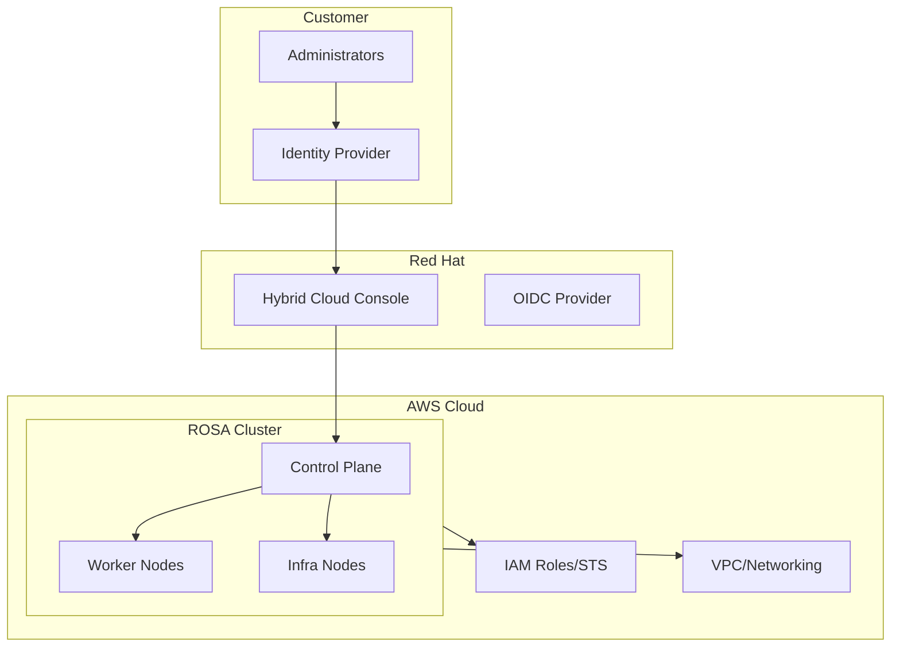

# ROSA (Red Hat OpenShift on AWS)

이 섹션에서는 Red Hat OpenShift Service on AWS (ROSA) 구축 및 운영에 대한 기술 문서들을 다룹니다.

## 📚 주요 문서

### 보안 및 컴플라이언스
- **ROSA Security Compliance Console Access Control**
  - 금융권 보안 요구사항 충족을 위한 접근 제어
  - Red Hat Hybrid Cloud Console 접근 관리
  - IdP 통합 및 MFA 구성

### 클러스터 설치 및 구성
- **ROSA Demo Installation Guide**
  - STS(Service Token Service) 기반 클러스터 생성
  - Auto Scaling 구성
  - 네트워크 및 IAM 역할 설정

## 🎯 학습 목표

이 섹션을 통해 다음을 학습할 수 있습니다:

- ROSA 클러스터 설치 및 구성 방법
- 금융권 보안 요구사항 충족 전략
- Red Hat Hybrid Cloud Console 접근 제어
- STS 기반 IAM 역할 구성

## 🏗️ 아키텍처 패턴

## 🔧 주요 기술 및 도구

- **ROSA CLI**: 클러스터 관리 명령줄 도구
- **STS (Security Token Service)**: IAM 역할 기반 인증
- **OIDC**: OpenID Connect 통합
- **OVNKubernetes**: 네트워크 플러그인
- **Cluster Autoscaler**: 자동 스케일링

## 💼 사용 사례

### 엔터프라이즈 마이그레이션
- 온프레미스 OpenShift에서 ROSA로 마이그레이션
- 하이브리드 클라우드 전략 구현
- 관리형 서비스로 운영 부담 감소

### 금융권 컴플라이언스
- 엄격한 보안 요구사항 충족
- 접근 제어 및 감사 로깅
- MFA 및 IP 기반 접근 제한

## 🔗 관련 자료

- [Hybrid & Multi-Cloud](/docs/hybrid-multicloud)
- [Security & Compliance](/docs/security-compliance)
- [Performance & Networking](/docs/performance-networking)

---

:::tip 팁
ROSA는 AWS와 Red Hat이 공동 관리하는 서비스로, 컨트롤 플레인 운영 부담을 크게 줄일 수 있습니다!
:::
