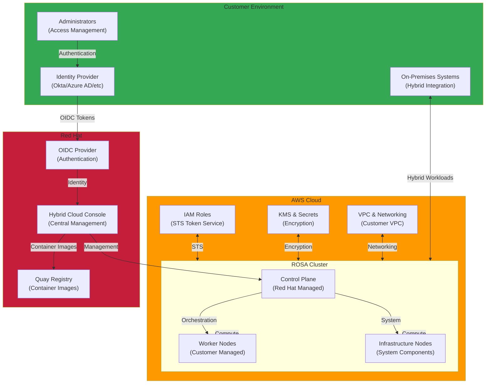

이 섹션에서는 Red Hat OpenShift Service on AWS (ROSA) 구축 및 운영에 대한 기술 문서들을 다룹니다. ROSA는 AWS와 Red Hat이 함께 관리하는 완전 관리형 OpenShift 서비스로, 엔터프라이즈급 Kubernetes 플랫폼을 쉽게 구축할 수 있습니다.

## 📚 주요 문서 (구현 순서)

### 1단계: 클러스터 설치 및 구성

- **[1. ROSA 데모 설치](./rosa-demo-installation.md)**
  - STS (Security Token Service) 기반 클러스터 생성
  - ROSA CLI를 이용한 단계별 설치
  - 자동 스케일링 구성
  - 네트워크 및 IAM 역할 설정
  - 초기 클러스터 검증
  - 실습 환경 구성 및 테스트

### 2단계: 보안 및 접근 제어

- **[2. ROSA 보안 규정 준수](./rosa-security-compliance.md)**
  - Red Hat Hybrid Cloud Console 접근 제어 구성
  - 금융권 보안 요구사항 충족을 위한 접근 제어 전략
  - IdP (Identity Provider) 통합 및 MFA 구성
  - 역할 기반 접근 제어 (RBAC) 구성
  - 감사 및 로깅 설정

## 🎯 학습 목표

이 섹션을 통해 다음을 학습할 수 있습니다:

- ROSA 클러스터 설치 및 초기 구성 방법
- STS 기반 IAM 역할 구성 및 보안 모범 사례
- Red Hat Hybrid Cloud Console을 통한 중앙 관리
- 금융권 보안 요구사항 충족 전략
- IdP 통합 및 사용자 인증 관리
- 클러스터 자동 스케일링 및 리소스 관리
- ROSA 클러스터의 운영 및 모니터링
- 온프레미스 OpenShift에서 ROSA로의 마이그레이션

## 🏗️ 아키텍처 패턴


```mermaid
graph TB
    subgraph AWS["AWS Cloud"]
        subgraph ROSA["ROSA Cluster"]
            CP["Control Plane<br/>(Red Hat Managed)"]
            WN["Worker Nodes<br/>(Customer Managed)"]
            IN["Infrastructure Nodes<br/>(System Components)"]
        end
        IAM["IAM Roles<br/>(STS Token Service)"]
        VPC["VPC & Networking<br/>(Customer VPC)"]
        KMS["KMS & Secrets<br/>(Encryption)"]
    end

    subgraph RedHat["Red Hat"]
        HCC["Hybrid Cloud Console<br/>(Central Management)"]
        Registry["Quay Registry<br/>(Container Images)"]
        OIDC["OIDC Provider<br/>(Authentication)"]
    end

    subgraph Customer["Customer Environment"]
        IdP["Identity Provider<br/>(Okta/Azure AD/etc)"]
        Admin["Administrators<br/>(Access Management)"]
        OnPrem["On-Premises Systems<br/>(Hybrid Integration)"]
    end

    Admin -->|Authentication| IdP
    IdP -->|OIDC Tokens| OIDC
    OIDC -->|Identity| HCC
    HCC -->|Management| CP
    CP -->|Orchestration| WN
    CP -->|System| IN
    WN & IN -->|Compute| AWS
    IAM <-->|STS| ROSA
    KMS <-->|Encryption| ROSA
    VPC <-->|Networking| ROSA
    HCC -->|Container Images| Registry
    OnPrem <-->|Hybrid Workloads| ROSA

    style AWS fill:#ff9900
    style RedHat fill:#c41e3a
    style Customer fill:#34a853
```

## 🔧 주요 기술 및 도구

| 기술 | 설명 | 용도 |
|------|------|------|
| **ROSA CLI** | OpenShift 클러스터 관리 명령줄 도구 | 클러스터 생성, 관리, 삭제 |
| **STS (Security Token Service)** | 임시 보안 자격증명 | 보안이 강화된 IAM 역할 관리 |
| **OIDC** | OpenID Connect 프로토콜 | 외부 ID 제공자 통합 |
| **OVNKubernetes** | OpenShift 네트워크 플러그인 | 고성능 네트워킹 |
| **Cluster Autoscaler** | 자동 스케일링 | 워크로드에 따른 노드 자동 조정 |
| **Hybrid Cloud Console** | Red Hat 중앙 관리 포털 | 다중 클러스터 중앙 관리 |
| **Quay Registry** | 컨테이너 이미지 저장소 | 빌드 및 배포 자동화 |

## 💡 핵심 개념

### ROSA의 특징

- **완전 관리형 서비스**: AWS와 Red Hat이 공동으로 컨트롤 플레인 운영
- **고가용성**: 자동 패치 및 업데이트
- **보안**: STS 기반 임시 자격증명, OIDC 프로바이더 통합
- **유연성**: 고객이 워커 노드 완전 제어

### STS 기반 인증의 장점

- **임시 자격증명**: 영구 액세스 키 불필요
- **자동 토큰 갱신**: 토큰 만료 전 자동 갱신
- **최소 권한**: 필요한 최소한의 권한만 부여
- **감사 추적**: 모든 접근 기록 CloudTrail에 저장

### Red Hat Hybrid Cloud Console의 역할

- **중앙 집중식 관리**: 여러 클러스터를 한 곳에서 관리
- **다중 클라우드 지원**: AWS, Azure, GCP, 온프레미스 OpenShift 통합 관리
- **정책 기반 관리**: 보안 정책 중앙 시행
- **비용 추적**: 클러스터별 비용 모니터링

### 네트워크 구성

- **OVNKubernetes**: OpenVSwitch 기반 고성능 네트워킹
- **Network Policy**: Kubernetes 네트워크 정책 완벽 지원
- **Ingress Controller**: 기본 제공 인그레스 컨트롤러
- **Service Mesh Ready**: Istio/Kiali 통합 지원

## 💼 사용 사례

### 엔터프라이즈 마이그레이션

- **온프레미스 OpenShift → ROSA**: 기존 OpenShift에서 ROSA로 마이그레이션
- **관리 부담 감소**: 컨트롤 플레인 운영 자동화
- **비용 절감**: 운영 비용 감소
- **글로벌 확장**: 멀티 리전 배포

### 금융권 컴플라이언스

- **보안 요구사항 충족**: STS, OIDC, MFA 등 고급 보안
- **접근 제어**: 세밀한 권한 관리
- **감사 로깅**: 모든 활동 기록 및 추적
- **데이터 보호**: KMS 기반 암호화

### 하이브리드 클라우드 전략

- **온프레미스 + AWS**: 단일 플랫폼에서 관리
- **멀티 클라우드**: AWS, Azure, GCP 동시 관리
- **클라우드 버스팅**: 피크 시 클라우드로 확장
- **재해 복구**: 다중 리전 재해 복구 전략

## 📊 ROSA vs EKS vs 온프레미스 OpenShift

선택 시 아래 기준을 같은 워크로드·가용성·지원 요구사항에 적용합니다. 보안 수준, 총비용, 배포 속도는 서비스 이름만으로 순위를 정할 수 없습니다. 관리 범위는 [ROSA 아키텍처](https://docs.aws.amazon.com/rosa/latest/userguide/rosa-architecture-models.html), [Amazon EKS 개요](https://docs.aws.amazon.com/eks/latest/userguide/what-is-eks.html), [자체 관리 OpenShift 가이드](https://www.redhat.com/en/resources/self-managed-openshift-subscription-guide)를 기준으로 확인합니다.

| 확인 기준 | ROSA | EKS | 온프레미스 OpenShift |
|------|------|-----|----------------|
| **컨트롤 플레인 관리** | Red Hat 관리; HCP 는 Red Hat AWS 계정, Classic 은 고객 AWS 계정에 배치 | AWS 관리 | 고객이 설치·업그레이드·복구 운영 |
| **보안 책임** | [공동 책임 범위](https://docs.aws.amazon.com/rosa/latest/userguide/security.html)와 고객의 접근·워크로드·데이터 설정 확인 | 공동 책임 범위와 선택한 노드 방식의 패치·접근 책임 확인 | 인프라부터 클러스터·워크로드까지 고객 통제·운영 범위 확인 |
| **비용 산정** | OpenShift 를 포함한 ROSA 서비스 요금 + AWS 인프라; HCP/Classic 구분 | 클러스터 + 컴퓨팅·스토리지·네트워크 + 선택 기능 요금 | OpenShift 구독 + 하드웨어·가상화·시설·운영 비용 |
| **운영 범위** | 관리 서비스 범위와 고객의 애플리케이션·노드 용량 관리 확인 | Standard/Auto Mode/Hybrid Nodes 에 따라 데이터 플레인 관리 범위 확인 | 고객의 인프라·플랫폼 운영 인력과 자동화 확인 |
| **개발 도구 적합성** | 기존 OpenShift API·도구·Operator 와의 호환성 확인 | Kubernetes API·추가 기능과 기존 CI/CD 도구의 통합 확인 | 선택한 OpenShift 에디션의 기능과 자체 운영 도구 확인 |
| **배포 준비 조건** | HCP/Classic 토폴로지, AWS 할당량·네트워크 준비 | 노드 방식, AWS 할당량·네트워크 준비 | 서버·스토리지·네트워크 확보와 설치 자동화 준비 |
| **하이브리드 배치** | AWS 에서 운영되는 ROSA 와 외부 OpenShift 환경의 연동 설계 | [EKS Hybrid Nodes](https://docs.aws.amazon.com/eks/latest/userguide/hybrid-nodes-overview.html)는 온프레미스·엣지 노드를 AWS 컨트롤 플레인에 연결; 안정적인 연결 필요 | 온프레미스 클러스터와 외부 환경의 연결·운영 설계 |
| **다른 클라우드 배치** | ROSA 는 AWS 서비스; 다른 클라우드의 OpenShift 는 별도 배치·지원 범위 확인 | Hybrid Nodes 를 다른 클라우드 인프라에서 실행하는 것은 지원하지 않음 | 대상 클라우드의 OpenShift 지원 플랫폼·구독·관리 도구 확인 |

## 🚀 배포 패턴

### 1. 단일 클러스터 배포

```
ROSA Cluster
├── Development 네임스페이스
├── Staging 네임스페이스
└── Production 네임스페이스
```

### 2. 멀티 클러스터 배포

```
Hybrid Cloud Console (중앙 관리)
├── AWS Region 1 (ROSA)
├── AWS Region 2 (ROSA)
├── On-Premises (OpenShift)
└── Multi-Cloud (Azure/GCP)
```

### 3. 고가용성 배포

```
Primary Region (ROSA)
├── Active Cluster
├── Replication to DR
└── Auto-failover
    └── Secondary Region (ROSA)
```

## 🔗 관련 카테고리

- [EKS Hybrid Nodes](/docs/eks-hybrid-nodes) - 하이브리드 환경 관리
- [보안 & 거버넌스](/docs/eks-best-practices/security-authn) - EKS 보안 거버넌스 베스트 프랙티스
- [EKS Best Practices](/docs/eks-best-practices) - 네트워킹 최적화 및 클러스터 모니터링

---

:::tip 팁
ROSA는 AWS와 Red Hat이 공동 관리하는 서비스로, 컨트롤 플레인 운영 부담을 크게 줄일 수 있습니다. 특히 금융권이나 엔터프라이즈 환경에서는 ROSA의 보안 및 규정 준수 기능이 매우 유용합니다.
:::

:::info 추천 학습 경로

1. ROSA 기본 개념 이해
2. STS 기반 클러스터 생성
3. IdP 통합 및 사용자 관리
4. Hybrid Cloud Console 활용
5. 고급 배포 패턴 (멀티 클러스터, 하이브리드)
:::

:::warning 주의 - 라이선싱
ROSA 서비스 요금에는 OpenShift 소프트웨어 사용과 Red Hat SRE의 클러스터 관리가 포함됩니다. 여기에 기반 AWS 인프라 요금을 더하며, 같은 OpenShift 사용 권한을 별도 라이선스 비용으로 중복 계산하지 않습니다. HCP와 Classic의 과금 항목 및 별도 추가 제품·계약 범위는 [공식 Marketplace 청구 안내](https://docs.aws.amazon.com/rosa/latest/userguide/integration-marketplace.html)와 실제 계약에서 확인하세요. 이 설명은 ROSA에 대한 것이며, 온프레미스 OpenShift의 자체 관리 구독과는 구분됩니다.
:::

:::success 마이그레이션 팁
기존 온프레미스 OpenShift 환경에서 ROSA로 마이그레이션할 계획이라면, **단계적 마이그레이션 전략**을 수립하세요:

1. 개발/테스트 환경부터 시작
2. 비즈니스 크리티컬하지 않은 워크로드 이전
3. 운영 경험 축적 후 프로덕션 워크로드 이전
:::
