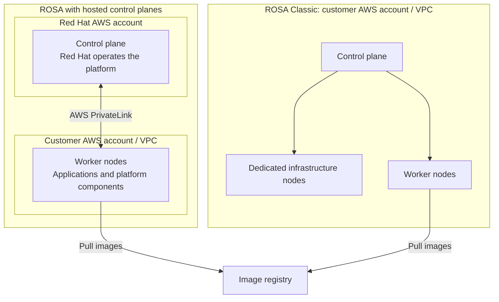

ROSA는 AWS에서 실행되는 관리형 OpenShift 서비스입니다. AWS는 기반 클라우드 인프라를, Red Hat은 OpenShift 플랫폼과 노드 운영체제의 수명주기를 관리합니다. 고객은 애플리케이션, 데이터, 접근 권한과 워커 용량을 관리합니다. 이 섹션은 Classic 데모 설치 기록과 관리자 접근 제어 설계를 다룹니다.

## 📚 주요 문서 (구현 순서)

### 1단계: 클러스터 설치 및 구성

[ROSA 데모 설치](./rosa-demo-installation.md)에서 Classic 단일 AZ 클러스터의 과거 구성, STS 역할, 고정된 워커 수와 확인 절차를 살펴봅니다. 기록된 버전을 그대로 새로 설치하는 절차가 아니므로, 재현 전 현재 지원 버전과 계정 준비 조건을 확인하세요.

### 2단계: 보안 및 접근 제어

[ROSA 콘솔 접근 제어](./rosa-security-compliance.md)에서 기업 IdP 연동, MFA, 로그인 위치 제한과 권한 검증을 설계합니다. 구현 및 심사 완료 사례가 아니라, 검증할 통제 항목을 정리한 설계 문서입니다.

## 🎯 학습 목표

두 문서를 읽으면 관리형 서비스가 담당하는 작업과 고객이 준비해야 할 작업을 구분할 수 있습니다. 설치 문서에서는 계정·네트워크·역할을 확인하고, 접근 제어 문서에서는 AWS, Red Hat 관리 콘솔, OpenShift 클러스터의 인증과 권한을 각각 검증합니다. 마이그레이션 및 다중 리전 복구는 아래의 설계 고려사항이며, 이 섹션에서 실행한 결과는 아닙니다.

## 🏗️ 아키텍처 패턴

[ROSA 아키텍처 문서](https://docs.aws.amazon.com/rosa/latest/userguide/rosa-architecture-models.html)는 HCP와 Classic을 구분합니다. HCP는 Red Hat AWS 계정에 컨트롤 플레인을 두고 고객 VPC의 워커와 PrivateLink로 통신합니다. 전용 인프라 노드 없이 워커에서 플랫폼 구성요소도 실행합니다. Classic은 컨트롤 플레인·인프라·워커 노드를 고객 AWS 계정에 둡니다.


```mermaid
flowchart TB
    subgraph HCP["ROSA with hosted control planes"]
        subgraph RH["Red Hat AWS account"]
            HC["Control plane<br/>Red Hat operates the platform"]
        end
        subgraph CustomerH["Customer AWS account / VPC"]
            HW["Worker nodes<br/>Applications and platform components"]
        end
        HC <-->|AWS PrivateLink| HW
    end
    subgraph Classic["ROSA Classic: customer AWS account / VPC"]
        CC["Control plane"]
        CI["Dedicated infrastructure nodes"]
        CW["Worker nodes"]
        CC --> CI
        CC --> CW
    end
    Registry["Image registry"]
    HW -->|Pull images| Registry
    CW -->|Pull images| Registry
```

두 방식 모두 노드가 어느 계정에 있는지와 누가 노드 운영체제를 관리하는지는 다른 질문입니다. 고객은 ROSA CLI나 OpenShift Cluster Manager의 지원되는 인터페이스로 machine pool의 용량을 조절합니다. 노드 운영체제를 임의로 변경하는 자체 관리 EC2 방식으로 해석하지 마세요.

## 🔧 주요 기술 및 도구

| 도구 또는 구성요소 | 역할 | 구분할 점 |
| --- | --- | --- |
| ROSA CLI | 클러스터와 machine pool 관리 | OpenShift 리소스 관리는 `oc` 사용 |
| AWS STS와 IAM 역할 | 서비스 구성요소의 AWS API 접근 | 사용자 콘솔 로그인 권한과 별도 |
| OIDC | 연동 대상에 따라 사용자 또는 워크로드 ID 전달 | 기업 SSO와 Operator용 AWS 연동을 별도로 설정 |
| OVN-Kubernetes | 클러스터 네트워킹 | 정책 및 네트워크 기능은 선택한 OpenShift 버전에서 확인 |
| Cluster Autoscaler | 배치할 수 없는 Pod에 맞춰 적격 machine pool 용량 조정 | pool 최소·최대값, Pod requests, 배치 조건의 제약을 받음 |
| Hybrid Cloud Console / OpenShift Cluster Manager | 조직과 클러스터 관리 | 클러스터 API의 RBAC를 대신하지 않음 |
| 이미지 레지스트리 | 노드 런타임에 컨테이너 이미지 제공 | Quay는 선택지이며, HCC가 이미지 소비자가 아님 |

## 💡 핵심 개념

### ROSA의 특징

[공동 책임 문서](https://docs.aws.amazon.com/rosa/latest/userguide/rosa-responsibilities.html)에 따르면 Red Hat은 플랫폼과 노드 버전을 유지하고 업그레이드를 실행합니다. 고객은 유지보수 일정을 선택하고 minor 버전 업그레이드를 승인·예약하며, 애플리케이션 호환성을 시험하고 지원 버전을 유지해야 합니다.

고가용성은 패치 자동화만으로 확보되지 않습니다. AZ 배치, 애플리케이션 복제본, 스토리지와 데이터 복구 방식을 함께 설계해야 합니다.

### STS 기반 인증의 장점

STS는 IAM 역할을 통해 유효기간이 있는 자격증명을 발급합니다. 역할의 trust policy와 권한 policy를 검토하고, 서비스 구성요소가 자격증명을 갱신할 수 있는지 확인해야 합니다. STS를 사용했다는 사실만으로 최소 권한이 입증되지는 않습니다.

AWS API 감사에는 [CloudTrail](https://docs.aws.amazon.com/awscloudtrail/latest/userguide/cloudtrail-concepts.html)을 사용하되, 필요한 데이터 이벤트와 보존 설정을 확인합니다. OpenShift 플랫폼 감사, HCC·IdP 로그인, 애플리케이션 접근은 각각의 로그 수집 경로와 보존·열람 권한을 별도로 관리합니다.

### Red Hat Hybrid Cloud Console의 역할

Hybrid Cloud Console의 OpenShift Cluster Manager는 조직의 클러스터 목록과 관리 작업을 제공합니다. HCC 로그인, OCM의 조직·클러스터 관리 권한, OpenShift API 로그인과 RBAC를 별도로 설정합니다. 비용 관리나 다중 클러스터 정책 적용은 해당 서비스·제품의 연결, 구독 및 권한 조건을 확인한 뒤 사용합니다.

### 네트워크 구성

애플리케이션의 외부 접근에는 OpenShift Ingress와 Route, Pod 간 접근 제한에는 NetworkPolicy를 검토합니다. 프라이빗 API 접근, 온프레미스 연결, DNS와 egress도 별도로 설계합니다. Service Mesh는 선택적인 추가 구성으로, 설치만으로 인증·암호화 정책이 애플리케이션에 적용되었다고 판단하지 않습니다.

## 💼 사용 사례

### 엔터프라이즈 마이그레이션

기존 OpenShift 워크로드를 이전할 때 API·Operator·스토리지 호환성과 데이터 이동을 먼저 검증합니다. 관리 서비스는 플랫폼 운영 작업의 일부를 맡지만, 비용 절감 여부는 서비스 요금, AWS 자원, 이전 비용과 실제 운영 인력을 함께 비교해야 알 수 있습니다.

### 금융권 컴플라이언스

STS, IdP, MFA, 암호화와 감사 로그를 요구 통제에 연결하고 설정 및 시험 결과를 남깁니다. ROSA를 선택하거나 프라이빗 네트워크를 구성했다는 사실만으로 특정 금융 규정 준수를 판정할 수는 없습니다. 적용 규정, 심사 범위와 고객 책임은 [ROSA 보안 안내](https://docs.aws.amazon.com/rosa/latest/userguide/security.html)를 바탕으로 별도 검토합니다.

### 하이브리드 클라우드 전략

ROSA는 AWS에서 실행됩니다. 온프레미스나 다른 클라우드의 OpenShift와 연결하려면 네트워크·ID·배포·데이터 운영을 함께 설계합니다. 클라우드 버스팅이나 리전 간 복구에는 별도의 용량 확보, 상태 복제와 트래픽 전환이 필요합니다.

## 📊 ROSA vs EKS vs 온프레미스 OpenShift

선택 시 아래 기준을 같은 워크로드·가용성·지원 요구사항에 적용합니다. 보안 수준, 총비용, 배포 속도는 서비스 이름만으로 순위를 정할 수 없습니다. 관리 범위는 [ROSA 아키텍처](https://docs.aws.amazon.com/rosa/latest/userguide/rosa-architecture-models.html), [Amazon EKS 개요](https://docs.aws.amazon.com/eks/latest/userguide/what-is-eks.html), [자체 관리 OpenShift 가이드](https://www.redhat.com/en/resources/self-managed-openshift-subscription-guide)를 기준으로 확인합니다.

| 확인 기준 | ROSA | EKS | 온프레미스 OpenShift |
|------|------|-----|----------------|
| **컨트롤 플레인 관리** | Red Hat 관리; HCP 는 Red Hat AWS 계정, Classic 은 고객 AWS 계정에 배치 | AWS 관리 | 고객이 설치·업그레이드·복구 운영 |
| **보안 책임** | [공동 책임 범위](https://docs.aws.amazon.com/rosa/latest/userguide/security.html)와 고객의 접근·워크로드·데이터 설정 확인 | 공동 책임 범위와 선택한 노드 방식의 패치·접근 책임 확인 | 인프라부터 클러스터·워크로드까지 고객 통제·운영 범위 확인 |
| **비용 산정** | OpenShift 를 포함한 ROSA 서비스 요금 + AWS 인프라; HCP/Classic 구분 | 클러스터 + 컴퓨팅·스토리지·네트워크 + 선택 기능 요금 | OpenShift 구독 + 하드웨어·가상화·시설·운영 비용 |
| **운영 범위** | 관리 서비스 범위와 고객의 애플리케이션·노드 용량 관리 확인 | Standard/Auto Mode/Hybrid Nodes 에 따라 데이터 플레인 관리 범위 확인 | 고객의 인프라·플랫폼 운영 인력과 자동화 확인 |
| **개발 도구 적합성** | 기존 OpenShift API·도구·Operator 와의 호환성 확인 | Kubernetes API·추가 기능과 기존 CI/CD 도구의 통합 확인 | 선택한 OpenShift 에디션의 기능과 자체 운영 도구 확인 |
| **배포 준비 조건** | HCP/Classic 토폴로지, AWS 할당량·네트워크 준비 | 노드 방식, AWS 할당량·네트워크 준비 | 서버·스토리지·네트워크 확보와 설치 자동화 준비 |
| **하이브리드 배치** | AWS 에서 운영되는 ROSA 와 외부 OpenShift 환경의 연동 설계 | [EKS Hybrid Nodes](https://docs.aws.amazon.com/eks/latest/userguide/hybrid-nodes-overview.html)는 온프레미스·엣지 노드를 AWS 컨트롤 플레인에 연결; 안정적인 연결 필요 | 온프레미스 클러스터와 외부 환경의 연결·운영 설계 |
| **다른 클라우드 배치** | ROSA 는 AWS 서비스; 다른 클라우드의 OpenShift 는 별도 배치·지원 범위 확인 | Hybrid Nodes 를 다른 클라우드 인프라에서 실행하는 것은 지원하지 않음 | 대상 클라우드의 OpenShift 지원 플랫폼·구독·관리 도구 확인 |

## 🚀 배포 패턴

### 1. 단일 클러스터 배포

하나의 클러스터에서 개발·검증·운영 namespace를 나누는 구성입니다. namespace만으로 장애나 보안 경계가 완성되지는 않으므로 RBAC, NetworkPolicy, ResourceQuota와 공유 컨트롤 플레인의 영향을 검토합니다. 운영 격리 요건이 높다면 별도 클러스터를 선택합니다.

### 2. 멀티 클러스터 배포

리전이나 운영 목적별로 클러스터를 나누고 클러스터 목록과 권한을 관리합니다. ROSA 외 OpenShift 클러스터를 등록하거나 일괄 정책을 배포하는 기능은 사용 중인 관리 제품의 지원 범위를 확인합니다. 클러스터 등록은 애플리케이션·데이터의 자동 동기화를 의미하지 않습니다.

### 3. 고가용성 배포

다음은 고객이 설계할 수 있는 다중 리전 복구 흐름입니다. ROSA가 애플리케이션의 리전 간 자동 장애 조치를 제공한다는 뜻은 아닙니다.

```text
Primary-region application and data
    -> Selected replication / backup mechanism
    -> Secondary-region application and data
    -> Health decision, traffic switch, and failback procedure
```

복제 지연과 일관성, RPO·RTO, 장애 판정, 쓰기 충돌 방지와 되돌리기 절차를 정한 뒤 복구 시험으로 확인합니다. [공동 책임 문서](https://docs.aws.amazon.com/rosa/latest/userguide/rosa-responsibilities.html)는 애플리케이션·데이터 백업과 여러 클러스터의 DNS·로드 밸런싱 관리를 고객 책임으로 설명합니다.

## 🔗 관련 카테고리

- [EKS Hybrid Nodes](/docs/eks-hybrid-nodes) - 하이브리드 환경 관리
- [보안 & 거버넌스](/docs/eks-best-practices/security-authn) - EKS 보안 거버넌스 베스트 프랙티스
- [EKS Best Practices](/docs/eks-best-practices) - 네트워킹 최적화 및 클러스터 모니터링

---

:::tip 팁
플랫폼 운영을 맡기는 범위와 고객의 애플리케이션·데이터 책임을 먼저 확인하세요. 접근 제어, 복구와 규정 준수의 검증 결과는 고객 환경에 맞게 확보해야 합니다.
:::

:::info 추천 학습 경로

1. ROSA 기본 개념 이해
2. STS 기반 클러스터 생성
3. IdP 통합 및 사용자 관리
4. Hybrid Cloud Console 활용
5. 고급 배포 패턴 (멀티 클러스터, 하이브리드)
:::

:::warning 주의 - 라이선싱
ROSA 서비스 요금에는 OpenShift 소프트웨어 사용과 Red Hat SRE의 클러스터 관리가 포함됩니다. 여기에 기반 AWS 인프라 요금을 더하며, 같은 OpenShift 사용 권한을 별도 라이선스 비용으로 중복 계산하지 않습니다. HCP와 Classic의 과금 항목 및 별도 추가 제품·계약 범위는 [공식 Marketplace 청구 안내](https://docs.aws.amazon.com/rosa/latest/userguide/integration-marketplace.html)와 실제 계약에서 확인하세요. 이 설명은 ROSA에 대한 것이며, 온프레미스 OpenShift의 자체 관리 구독과는 구분됩니다.
:::

:::success 마이그레이션 팁
기존 온프레미스 OpenShift 환경에서 ROSA로 마이그레이션할 계획이라면, **단계적 마이그레이션 전략**을 수립하세요:

1. 개발/테스트 환경부터 시작
2. 비즈니스 크리티컬하지 않은 워크로드 이전
3. 운영 경험 축적 후 프로덕션 워크로드 이전
:::
