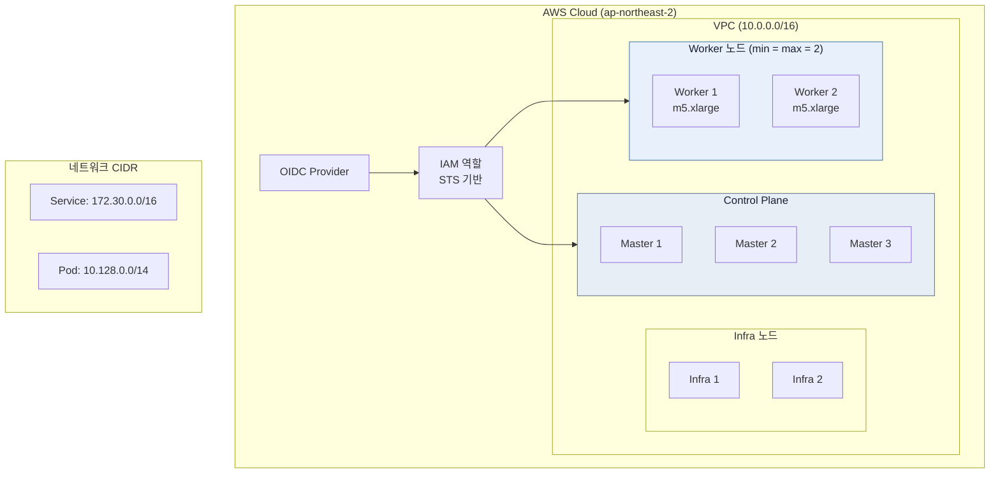

이 문서는 ROSA Classic 단일 AZ 데모의 과거 설정 기록을 설명합니다. 컨트롤 플레인과 노드가 고객 AWS 계정에 있으며, 워커는 최소·최대 모두 2대로 고정된 구성입니다. 원래 실행 로그나 당시 CLI 버전은 저장소에 없으므로 설치 성공과 관측값을 독립적으로 재검증하지 못했습니다. 이번 문서 검토에서도 클러스터를 생성하지 않았습니다.

---

## 클러스터 생성

### 생성 명령어

아래는 원문에 남아 있는 과거 명령 기록입니다. `I:` 줄은 출력이며 실행할 명령이 아닙니다. 영어 원문에 기록된 `4.13.34`를 양쪽 언어에 동일하게 보존했습니다. 이전 한국어판의 `4.21.x`와 줄 끝 주석은 실제 패치 버전도 올바른 연속행도 아니었습니다. 이 기록은 현재 설치 권장 명령으로 사용하지 마세요.

새 실습은 [계정 준비](https://docs.aws.amazon.com/rosa/latest/userguide/set-up.html)와 [Classic CLI 설치 절차](https://docs.aws.amazon.com/rosa/latest/userguide/getting-started-classic-cli.html)를 먼저 완료합니다. ROSA 활성화·Marketplace 권한, AWS/ROSA/`oc` CLI 로그인과 버전, IAM 및 SCP 권한, EC2·VPC·EBS·ELB 할당량, 사용할 CIDR와 인터넷 접근을 확인합니다. Classic 계정 역할과 클러스터별 Operator 역할·OIDC 구성을 준비하고 각 ARN과 ID를 확인해야 합니다.

대상은 운영과 분리된 실습 AWS 계정, `ap-northeast-2`, 새 Classic 클러스터입니다. 공개·단일 AZ 구성에는 가용성과 노출 범위의 제약이 있으며 AWS 자원 및 ROSA 요금이 발생합니다. 아래 확인 명령에서 나온 계정·사용자·지원 버전을 기록한 후 현재 설치 절차에서 하나의 구체적인 지원 패치 버전을 선택합니다.

```bash
aws sts get-caller-identity
rosa whoami
rosa version
rosa list versions
```

다음 과거 기록의 `optional`은 IMDSv1을 허용합니다. 새로운 IMDSv2 전용 구성은 워크로드 호환성을 확인한 후 `--ec2-metadata-http-tokens required`를 선택합니다. STS 사용 여부와 별도 설정입니다.

```text
I: Creating cluster 'rosa-demo-icn'
I: To create this cluster again in the future, you can run:
rosa create cluster --cluster-name rosa-demo-icn \
  --sts \
  --create-admin-user \
  --role-arn arn:aws:iam::XXXXXXXXXXXX:role/ManagedOpenShift-Installer-Role \
  --support-role-arn arn:aws:iam::XXXXXXXXXXXX:role/ManagedOpenShift-Support-Role \
  --controlplane-iam-role arn:aws:iam::XXXXXXXXXXXX:role/ManagedOpenShift-ControlPlane-Role \
  --worker-iam-role arn:aws:iam::XXXXXXXXXXXX:role/ManagedOpenShift-Worker-Role \
  --operator-roles-prefix rosa-oidc \
  --oidc-config-id XXXXXXXXXXXXXXXXXXXXXXXXXXXXXXXX \
  --region ap-northeast-2 \
  --version 4.13.34 \
  --ec2-metadata-http-tokens optional \
  --enable-autoscaling \
  --min-replicas 2 \
  --max-replicas 2 \
  --compute-machine-type m5.xlarge \
  --machine-cidr 10.0.0.0/16 \
  --service-cidr 172.30.0.0/16 \
  --pod-cidr 10.128.0.0/14 \
  --host-prefix 23 \
  --autoscaler-balance-similar-node-groups \
  --autoscaler-log-verbosity 1 \
  --autoscaler-max-pod-grace-period 600 \
  --autoscaler-pod-priority-threshold -10 \
  --autoscaler-ignore-daemonsets-utilization \
  --autoscaler-max-nodes-total 180 \
  --autoscaler-min-cores 0 \
  --autoscaler-max-cores 11520 \
  --autoscaler-min-memory 0 \
  --autoscaler-max-memory 230400 \
  --autoscaler-scale-down-utilization-threshold 0.500000
```

---

## 클러스터 정보

아래 값은 원문에 기록된 구성입니다. 현재 실행 중인 클러스터를 조회한 결과가 아닙니다. `Customer Hosted`는 Classic의 계정 배치를 뜻하며, 고객이 컨트롤 플레인 운영을 맡는다는 의미가 아닙니다.

| 항목 | 값 |
|------|-----|
| **Name** | rosa-demo-icn |
| **Control Plane** | Customer Hosted |
| **Channel Group** | stable |
| **Region** | ap-northeast-2 |
| **Multi-AZ** | false |

### 노드 구성

| 노드 타입 | 수량 |
|----------|------|
| Control Plane | 3 |
| Infra | 2 |
| Compute | 2 |

### 네트워크 구성

| 설정 | 값 |
|------|-----|
| **Type** | OVNKubernetes |
| **Service CIDR** | 172.30.0.0/16 |
| **Machine CIDR** | 10.0.0.0/16 |
| **Pod CIDR** | 10.128.0.0/14 |
| **Host Prefix** | /23 |

### IAM 역할 (STS)

```yaml
STS Role ARN: arn:aws:iam::XXXXXXXXXXXX:role/ManagedOpenShift-Installer-Role
Support Role ARN: arn:aws:iam::XXXXXXXXXXXX:role/ManagedOpenShift-Support-Role
인스턴스 IAM 역할:
  - Control Plane: arn:aws:iam::XXXXXXXXXXXX:role/ManagedOpenShift-ControlPlane-Role
  - Worker: arn:aws:iam::XXXXXXXXXXXX:role/ManagedOpenShift-Worker-Role
Operator IAM 역할:
  - rosa-oidc-openshift-cluster-csi-drivers-ebs-cloud-credentials
  - rosa-oidc-openshift-cloud-network-config-controller-cloud-credentials
  - rosa-oidc-openshift-machine-api-aws-cloud-credentials
  - rosa-oidc-openshift-cloud-credential-operator-cloud-credential-operator
  - rosa-oidc-openshift-image-registry-installer-cloud-credentials
  - rosa-oidc-openshift-ingress-operator-cloud-credentials
```

### 추가 설정

| 설정 | 값 |
|------|-----|
| **EC2 Metadata Http Tokens** | optional |
| **Managed Policies** | No |
| **Private** | No |
| **User Workload Monitoring** | Enabled |

---

## 오토스케일러 구성

원문에 기록된 autoscaler 설정입니다. machine pool의 `min-replicas`와 `max-replicas`가 모두 2이므로 이 pool은 확장·축소하지 않습니다. 아래 180노드·CPU·메모리 값은 비자동 확장 노드도 포함하는 클러스터 전체 상한이며, 할당량이나 실제로 확보된 용량이 아닙니다. 메모리 단위는 GiB입니다. 실제 확장 실습에는 서로 다른 최소·최대값과 적절한 Pod requests·배치 조건을 정하고, Pending Pod에 대한 확장 및 안전한 축소를 별도로 시험해야 합니다.

```yaml
autoscaler:
  balanceSimilarNodeGroups: true
  logVerbosity: 1
  maxPodGracePeriod: 600
  podPriorityThreshold: -10
  ignoreDaemonsetsUtilization: true
  maxNodesTotal: 180
  resourceLimits:
    minCores: 0
    maxCores: 11520
    minMemory: 0
    maxMemory: 230400  # GiB
  scaleDownUtilizationThreshold: 0.5
```

---

## 관리자 사용자 설정

원문에는 bootstrap `cluster-admin` 계정 생성 메시지가 기록되어 있습니다. 이 계정은 정상적인 조직 사용자 접근 설정을 대신하지 않습니다. 비밀번호를 명령행 인수나 문서에 남기지 말고, 확인한 클러스터 API 주소로 로그인할 때 프롬프트에서 입력합니다.

```bash
oc login 'https://REPLACE_WITH_CLUSTER_API:6443' --username cluster-admin
```

별도 IdP 사용자와 필요한 관리자·복구 접근을 검증한 뒤 bootstrap 계정의 유지·제거를 결정합니다. 접근을 잃었을 때는 해당 클러스터의 계정 복구 절차를 사용하며, 대체 접근을 확인하기 전에 유일한 관리자 계정을 삭제하지 않습니다.

## 설치 후 단계

설치 완료 후 다음 단계를 진행하세요:

### 1. Identity Provider 설정

`--help`는 옵션을 보여줄 뿐 IdP를 구성하지 않습니다. [공식 IdP 설정 절차](https://docs.aws.amazon.com/rosa/latest/userguide/getting-started-classic-cli.html)에 따라 지원되는 제공자를 선택하고, 클러스터의 callback URL과 client 설정을 맞춥니다. 다음은 대상 클러스터를 확인한 후 실행하는 대화형 설정입니다.

```bash
rosa create idp --cluster rosa-demo-icn --interactive
rosa list idps --cluster rosa-demo-icn
```

일반 사용자로 로그인하고 필요한 project 역할만 부여한 상태에서 허용·거부 작업을 시험합니다. 관리자는 필요한 경우에만 별도의 cluster 관리 역할을 받습니다. HCC 기업 SSO와 클러스터 IdP가 별도임을 확인합니다.

### 2. 클러스터 상태 확인

```bash
rosa describe cluster -c rosa-demo-icn
```

계정·리전·클러스터 ID, 상태, 실제 패치 버전, machine pool과 API·console 주소를 확인합니다. `ready`는 설치 상태이며, 애플리케이션 가용성이나 접근 제어 검증 결과가 아닙니다.

### 3. 설치 로그 모니터링

```bash
rosa logs install -c rosa-demo-icn --watch
```

실습 기록에는 CLI 버전, 적용한 설정과 설치 로그를 비밀값을 제거해 보관합니다. 종료 시 데이터와 필요한 로그를 먼저 보존하고, [공식 삭제 절차](https://docs.aws.amazon.com/rosa/latest/userguide/getting-started-classic-cli.html)에 따라 정확한 실습 클러스터를 삭제합니다. 클러스터 삭제 완료 전에는 정리에 필요한 IAM 역할·OIDC를 제거하지 않습니다. 다른 클러스터가 공유하는 계정 역할·정책·OIDC 구성은 남겨야 하며, 남은 과금 자원도 확인합니다.

## 아키텍처 다이어그램


```mermaid
graph TB
    subgraph AWS["AWS Cloud (ap-northeast-2)"]
        subgraph VPC["VPC (10.0.0.0/16)"]
            subgraph CP["Control Plane"]
                M1[Master 1]
                M2[Master 2]
                M3[Master 3]
            end
            subgraph Infra["Infra 노드"]
                I1[Infra 1]
                I2[Infra 2]
            end
            subgraph Workers["Worker 노드 (min = max = 2)"]
                W1[Worker 1<br/>m5.xlarge]
                W2[Worker 2<br/>m5.xlarge]
            end
        end
        IAM[IAM 역할<br/>STS 기반]
        OIDC[OIDC Provider]
    end

    subgraph Network["네트워크 CIDR"]
        SC["Service: 172.30.0.0/16"]
        PC["Pod: 10.128.0.0/14"]
    end

    IAM --> CP
    IAM --> Workers
    OIDC --> IAM

    style CP fill:#e8eef5,stroke:#64748b,color:#172033
    style Workers fill:#e8f1fb,stroke:#4777a8,color:#172033
```

:::tip 팁
STS는 임시 AWS 자격증명을 사용하게 합니다. 역할 권한, IMDS 설정, 사용자 IdP와 RBAC, 로그 수집은 각각 검증해야 합니다.
:::
