# ROSA 데모 설치 가이드

> 📅 **작성일**: 2025-02-05 | ⏱️ **읽는 시간**: 약 2분


이 문서는 ROSA(Red Hat OpenShift Service on AWS) 클러스터의 설치 과정과 결과를 기록한 데모 가이드입니다. STS 기반의 보안 강화 설치 방식과 오토스케일링 구성을 포함합니다.

---

## 클러스터 생성

### 생성 명령어

아래 명령어를 사용하여 ROSA 클러스터를 생성합니다:

```bash
I: Creating cluster 'rosa-demo-icn'
I: To create this cluster again in the future, you can run:
rosa create cluster --cluster-name rosa-demo-icn \
  --sts \
  --create-admin-user \
  --role-arn arn:aws:iam::XXXXXXXXXXXX:role/ManagedOpenShift-Installer-Role \
  --support-role-arn arn:aws:iam::XXXXXXXXXXXX:role/ManagedOpenShift-Support-Role \
  --controlplane-iam-role arn:aws:iam::XXXXXXXXXXXX:role/ManagedOpenShift-ControlPlane-Role \
  --worker-iam-role arn:aws:iam::XXXXXXXXXXXX:role/ManagedOpenShift-Worker-Role \
  --operator-roles-prefix rosa-oidc \
  --oidc-config-id XXXXXXXXXXXXXXXXXXXXXXXXXXXXXXXX \
  --region ap-northeast-2 \
  --version 4.13.34 \
  --ec2-metadata-http-tokens optional \
  --enable-autoscaling \
  --min-replicas 2 \
  --max-replicas 2 \
  --compute-machine-type m5.xlarge \
  --machine-cidr 10.0.0.0/16 \
  --service-cidr 172.30.0.0/16 \
  --pod-cidr 10.128.0.0/14 \
  --host-prefix 23 \
  --autoscaler-balance-similar-node-groups \
  --autoscaler-log-verbosity 1 \
  --autoscaler-max-pod-grace-period 600 \
  --autoscaler-pod-priority-threshold -10 \
  --autoscaler-ignore-daemonsets-utilization \
  --autoscaler-max-nodes-total 180 \
  --autoscaler-min-cores 0 \
  --autoscaler-max-cores 11520 \
  --autoscaler-min-memory 0 \
  --autoscaler-max-memory 230400 \
  --autoscaler-scale-down-utilization-threshold 0.500000
```

---

## 클러스터 정보

설치 완료 후 생성된 클러스터의 상세 정보는 다음과 같습니다:

| 항목 | 값 |
|------|-----|
| **Name** | rosa-demo-icn |
| **Control Plane** | Customer Hosted |
| **Channel Group** | stable |
| **Region** | ap-northeast-2 |
| **Multi-AZ** | false |

### 노드 구성

| 노드 타입 | 수량 |
|----------|------|
| Control Plane | 3 |
| Infra | 2 |
| Compute | 2 |

### 네트워크 구성

| 설정 | 값 |
|------|-----|
| **Type** | OVNKubernetes |
| **Service CIDR** | 172.30.0.0/16 |
| **Machine CIDR** | 10.0.0.0/16 |
| **Pod CIDR** | 10.128.0.0/14 |
| **Host Prefix** | /23 |

### IAM 역할 (STS)

```yaml
STS Role ARN: arn:aws:iam::XXXXXXXXXXXX:role/ManagedOpenShift-Installer-Role
Support Role ARN: arn:aws:iam::XXXXXXXXXXXX:role/ManagedOpenShift-Support-Role
인스턴스 IAM 역할:
  - Control Plane: arn:aws:iam::XXXXXXXXXXXX:role/ManagedOpenShift-ControlPlane-Role
  - Worker: arn:aws:iam::XXXXXXXXXXXX:role/ManagedOpenShift-Worker-Role
Operator IAM 역할:
  - rosa-oidc-openshift-cluster-csi-drivers-ebs-cloud-credentials
  - rosa-oidc-openshift-cloud-network-config-controller-cloud-credentials
  - rosa-oidc-openshift-machine-api-aws-cloud-credentials
  - rosa-oidc-openshift-cloud-credential-operator-cloud-credential-operator
  - rosa-oidc-openshift-image-registry-installer-cloud-credentials
  - rosa-oidc-openshift-ingress-operator-cloud-credentials
```

### 추가 설정

| 설정 | 값 |
|------|-----|
| **EC2 Metadata Http Tokens** | optional |
| **Managed Policies** | No |
| **Private** | No |
| **User Workload Monitoring** | Enabled |

---

## 오토스케일러 구성

클러스터의 자동 확장 설정은 다음과 같습니다:

```yaml
autoscaler:
  balanceSimilarNodeGroups: true
  logVerbosity: 1
  maxPodGracePeriod: 600
  podPriorityThreshold: -10
  ignoreDaemonsetsUtilization: true
  maxNodesTotal: 180
  resourceLimits:
    minCores: 0
    maxCores: 11520
    minMemory: 0
    maxMemory: 230400  # GB
  scaleDownUtilizationThreshold: 0.5
```

---

## 관리자 사용자 설정

클러스터 설치 후 관리자 계정 생성:

```bash
I: Admin account has been added to cluster 'rosa-demo-icn'.
I: Please securely store this generated password.
I: If you lose this password you can delete and recreate the cluster admin user.

# Login command
oc login https://api.rosa-demo-icn.XXXX.p1.openshiftapps.com:6443 \
  --username cluster-admin \
  --password <REDACTED>
```

:::warning 보안 주의
- 관리자 비밀번호는 안전하게 보관하세요
- 비밀번호 분실 시 관리자 계정을 삭제하고 재생성해야 합니다
- 접근이 활성화되기까지 몇 분이 소요될 수 있습니다
:::

---

## 설치 후 단계

설치 완료 후 다음 단계를 진행하세요:

### 1. Identity Provider 설정

```bash
rosa create idp --help
```

### 2. 클러스터 상태 확인

```bash
rosa describe cluster -c rosa-demo-icn
```

### 3. 설치 로그 모니터링

```bash
rosa logs install -c rosa-demo-icn --watch
```

---

## 아키텍처 다이어그램

```mermaid
graph TB
    subgraph AWS["AWS Cloud (ap-northeast-2)"]
        subgraph VPC["VPC (10.0.0.0/16)"]
            subgraph CP["Control Plane"]
                M1[Master 1]
                M2[Master 2]
                M3[Master 3]
            end
            subgraph Infra["Infra 노드"]
                I1[Infra 1]
                I2[Infra 2]
            end
            subgraph Workers["Worker 노드 (오토스케일링)"]
                W1[Worker 1<br/>m5.xlarge]
                W2[Worker 2<br/>m5.xlarge]
            end
        end
        IAM[IAM 역할<br/>STS 기반]
        OIDC[OIDC Provider]
    end

    subgraph Network["네트워크 CIDR"]
        SC["Service: 172.30.0.0/16"]
        PC["Pod: 10.128.0.0/14"]
    end

    IAM --> CP
    IAM --> Workers
    OIDC --> IAM

    style CP fill:#EE0000,stroke:#232f3e
    style Workers fill:#ff9900,stroke:#232f3e
```



:::tip 팁
ROSA 클러스터 생성 시 `--sts` 옵션을 사용하면 STS 기반의 임시 자격 증명을 사용하여 보안을 강화할 수 있습니다.
:::
