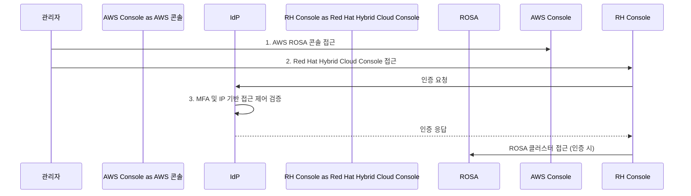
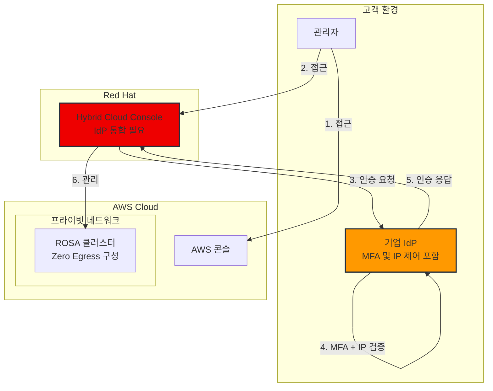

# ROSA 보안 규정 준수 콘솔 접근 제어

> 📅 **작성일**: 2025-02-05 | **수정일**: 2026-02-13 | ⏱️ **읽는 시간**: 약 3분

## 개요

ROSA(Red Hat OpenShift Service on AWS)를 금융권에 도입할 때는 Red Hat Hybrid Cloud Console에 대한 접근 제어가 중요한 보안 요구사항입니다. 이 가이드는 IdP(Identity Provider), MFA, IP 기반 접근 통제를 활용한 안전한 관리자 접근 제어 전략을 설명합니다.

:::warning 주의
이 문서는 금융권 고객의 보안 요구사항을 다루고 있습니다. 실제 구현 시 Red Hat 및 AWS와의 협의가 필요합니다.
:::

---

## 고객 상황

한국의 금융기관이 ROSA(Red Hat OpenShift Service on AWS)를 도입하면서 Red Hat Hybrid Cloud Console에 대한 접근 제어에 관한 우려사항을 제기했습니다. 이는 이미 요구사항을 충족하는 것으로 확인된 ROSA 클러스터 네트워크 아키텍처와는 별개의 문제입니다.

## 현재 이해도

- ROSA 클러스터의 프라이빗 네트워크 구성은 충분히 이해되고 있으며 구현 가능합니다.
- 보안 준수 문제는 ROSA 클러스터 자체가 아닌 Red Hat Hybrid Cloud Console 접근 패턴에 국한됩니다.
- ROSA 클러스터가 생성되면 관리자는 Red Hat Hybrid Cloud Console을 통해 클러스터에 접근하는데, 현재 보안 요구사항을 충족하지 못합니다.

## 현재 장애물

Red Hat Hybrid Cloud Console에 대한 기본 공개 접근 패턴은 금융권 규제 요구사항을 충족하지 않습니다. 비록 ROSA 클러스터 자체는 프라이빗 네트워크 구성으로 적절히 보호될 수 있지만, 콘솔 접근은 별도로 관리되어야 합니다.

## 보안 요구사항

### 콘솔 접근 제어 필요사항

고객은 다음을 요구합니다:

1. Red Hat Hybrid Cloud Console 접근을 위한 IdP(Identity Provider) 통합
2. IdP를 통한 MFA(다중 인증) 구현
3. 콘솔에 대한 IP 기반 접근 제어

### 중요 설명사항

- 이 요구사항은 Red Hat Hybrid Cloud Console 접근에만 적용됩니다.
- ROSA 클러스터 자체에 대한 OIDC/SAML 구성과는 완전히 별개입니다.
- 우려사항은 ROSA 클러스터의 네트워크 아키텍처가 아니며, 프라이빗 네트워크 구성(Zero Egress 구성 포함)으로 구현할 때 이미 준수되는 것으로 확인되었습니다.

## 제안된 접근 제어 워크플로우

고객이 제안하는 안전한 접근 워크플로우는 다음과 같습니다:

1. 관리자가 AWS ROSA 콘솔에 접근합니다.
2. Red Hat Hybrid Cloud Console에 접근할 때 AWS에 구성된 IdP를 통해 인증을 처리합니다.
3. IdP가 다음을 적용합니다:
   - 다중 인증(MFA)
   - IP 기반 접근 제어

이 워크플로우는 관리자 접근이 엄격하게 제어되고 보안 요구사항을 준수하도록 보장합니다.

### 전체 아키텍처

---

## 필요 응답 사항

1. 금융권의 유사 사례 정보
2. 관리자 접근 제어를 위해 구현된 이전 솔루션
3. 금융권 다른 구현 사례의 모범 사례

## 다음 단계

- 제안된 워크플로우가 Red Hat의 기술 역량을 충족하는지 확인
- Red Hat Hybrid Cloud Console의 IdP 통합 문서 제공
- 금융권 다른 구현 사례의 사례 연구 공유
- 구현을 위한 기술 지침 제공

:::tip 참고
실제 구현을 위해서는 Red Hat 및 AWS와의 상세한 협의가 필요합니다.
:::
