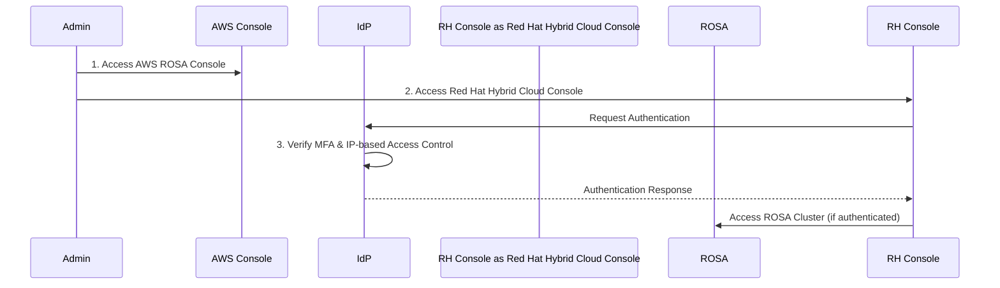
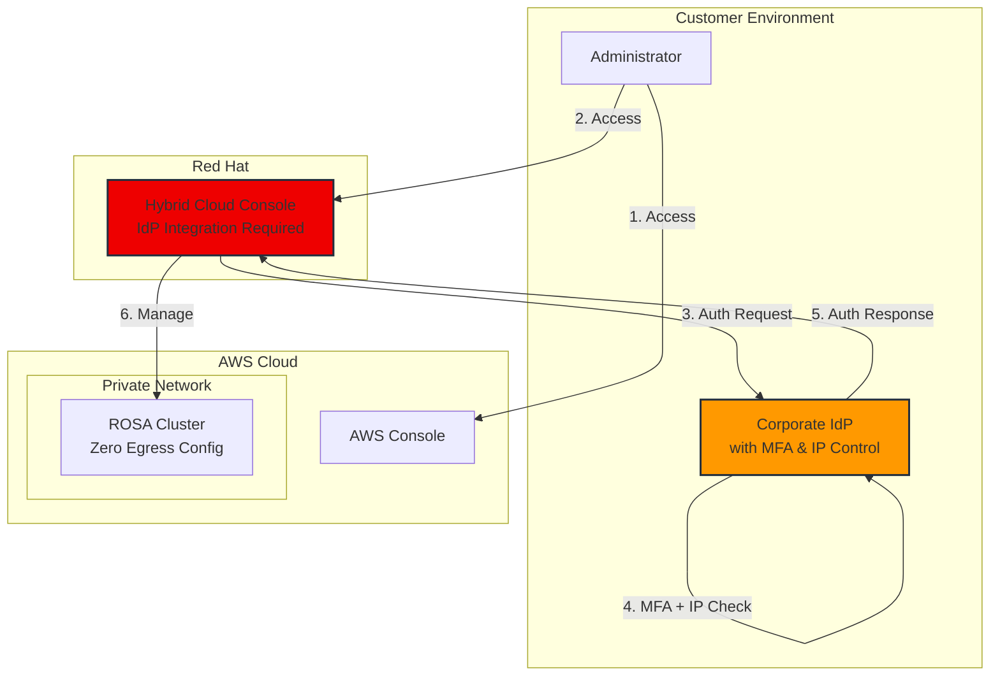

# ROSA Security Compliance Console Access Control

## Customer Situation

A financial institution in Korea is implementing ROSA (Red Hat OpenShift Service on AWS) and has raised concerns specifically regarding access control to the Red Hat Hybrid Cloud Console. This is separate from the ROSA cluster network architecture, which is already confirmed to meet their requirements.

## Current Understanding

- The private network configuration for ROSA clusters is well understood and implementable, with no concerns.
- The security compliance issue specifically relates to the Red Hat Hybrid Cloud Console access pattern, not the ROSA cluster itself.
- When a ROSA cluster is created, administrators access the cluster through the Red Hat Hybrid Cloud Console, which currently doesn't meet the security requirements.

## Current Blocker

The default public access pattern to the Red Hat Hybrid Cloud Console does not meet financial sector regulatory requirements, even though the ROSA cluster itself can be properly secured in a private network configuration.

## Security Requirements

### Specific Console Access Control Needs

The customer requires:

1. Identity Provider (IdP) integration for the Red Hat Hybrid Cloud Console access
2. MFA implementation through the IdP
3. IP-based access control for the console

### Important Clarifications

- This requirement is specifically for the Red Hat Hybrid Cloud Console access
- This is completely separate from OIDC/SAML configurations for the ROSA clusters themselves
- The concern is not about the ROSA cluster's network architecture, which is already confirmed to be compliant when implemented in a private network configuration (with Zero Egress configuration)

## Proposed Access Control Workflow

The customer is proposing the following secure access workflow:

1. Administrator accesses the AWS ROSA console
2. When accessing the Red Hat Hybrid Cloud Console, authentication is processed through an IdP configured in AWS
3. The IdP enforces:
   - Multi-Factor Authentication (MFA)
   - IP-based access control

This workflow ensures that administrative access is strictly controlled and compliant with security requirements.

### Overall Architecture

## Response Needed

1. Information about similar cases in the financial sector
2. Previous solutions implemented for admin access control
3. Best practices based on other financial sector implementations

## Next Steps

- Confirm if the proposed workflow meets Red Hat's technical capabilities
- Provide documentation on IdP integration with Red Hat Hybrid Cloud Console
- Share relevant case studies or examples from other financial sector implementations
- Provide technical guidance for implementation

:::warning 주의사항
이 문서는 금융권 고객의 보안 요구사항을 다루고 있습니다. 실제 구현 시 Red Hat 및 AWS와의 협의가 필요합니다.
:::
