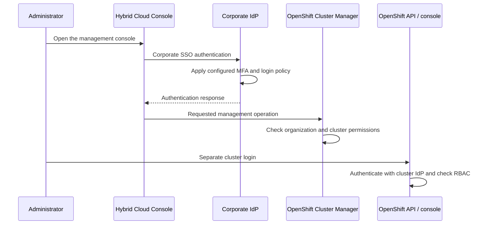
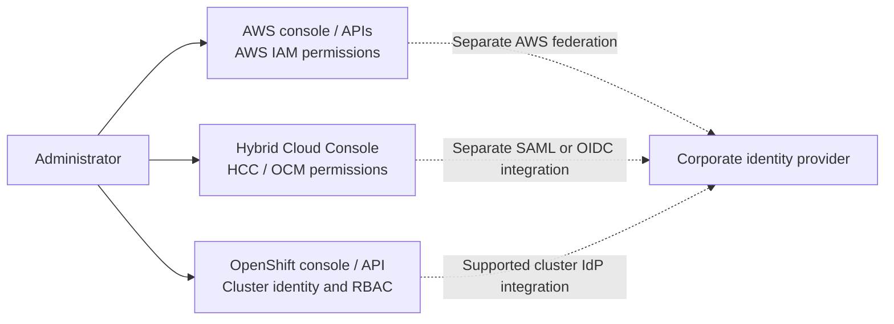

## 개요

기업 IdP로 로그인한 관리자라도 모든 ROSA 관리 작업을 수행할 수 있는 것은 아닙니다. AWS IAM, Red Hat Hybrid Cloud Console(HCC) 및 OpenShift Cluster Manager(OCM)의 권한, OpenShift 클러스터의 RBAC는 적용 대상이 다릅니다. 이 문서는 그 경계를 구분하고 MFA와 접근 위치 제한을 시험하기 위한 설계안입니다.

구현 로그나 규정 준수 심사 결과는 이 저장소에 없습니다. 아래 흐름은 검증할 제안이며, 통제 효과나 특정 금융 규정 준수를 확인한 사례로 사용하지 않습니다.

## 고객 상황

원래 문서는 국내 금융기관의 콘솔 접근 요구를 배경으로 작성되었습니다. 공개 가능한 요구사항 명세나 승인 기록이 없으므로 고객 사례의 사실관계와 승인 여부는 확인되지 않았습니다. 여기서는 '기업 IdP, MFA, 허용된 위치에서의 관리자 접근이 필요하다'는 설계 가정만 사용합니다.

## 현재 이해도

| 접근 대상 | 인증 및 권한 | 별도로 확인할 사항 |
| --- | --- | --- |
| AWS 콘솔·API | AWS의 연동 로그인과 IAM | ROSA 관련 AWS 자원에 대한 역할·정책 |
| HCC·OCM | Red Hat 기업 SSO와 조직·클러스터 관리 권한 | 계정 적격성, 조직 소속, 역할 범위 |
| OpenShift 콘솔·API | 클러스터 OAuth의 지원 IdP와 RBAC | cluster/project 역할, CLI·토큰 접근 |

AWS 콘솔을 거치는 것이 HCC나 `oc` 접근의 필수 경로는 아닙니다. 같은 기업 IdP를 사용하더라도 각 서비스에 신뢰 관계와 권한을 별도로 구성합니다.

## 현재 장애물

확인할 문제는 '공개 콘솔이므로 규정 위반인가'가 아니라, 요구하는 통제가 어느 접근 경로에서 어떻게 적용되는가입니다. 로그인 시 IP 제한이 기존 세션·API 토큰에도 계속 적용되는지, MFA를 우회하는 경로가 있는지 시험해야 합니다. 적용 규정과 승인 기준은 별도 요구사항으로 명시하고 [ROSA의 공동 책임](https://docs.aws.amazon.com/rosa/latest/userguide/security.html)에 따라 심사 범위를 정합니다.

## 보안 요구사항

### 콘솔 접근 제어 필요사항

1. HCC에 별도의 기업 SSO 연동을 구성하고 로그인 계정과 조직을 확인합니다.
2. IdP에서 요구되는 MFA와 접근 위치 정책을 설정합니다.
3. OCM 역할과 클러스터 RBAC를 업무 범위에 맞게 부여합니다.
4. 기존 세션, CLI·API·서비스 토큰, 사용자 비활성화 및 복구 접근을 시험합니다.
5. 각 서비스의 감사 로그로 성공·거부 결과와 사용자 식별을 확인합니다.

### 중요 설명사항

[HCC IdP 연동 문서](https://docs.redhat.com/en/documentation/red_hat_hybrid_cloud_console/1-latest/html-single/configuring_identity_provider_integration/index)는 SAML 2.0과 OIDC를 지원합니다. 조직 관리자가 계정 적격성을 확인하고 연동을 시험한 뒤 활성화해야 합니다. 문서상 기업 SSO를 거치지 않는 비웹 서비스가 있고 federated logout도 지원하지 않으므로, IdP 로그아웃이나 계정 차단만으로 모든 Red Hat 접근이 종료된다고 가정하지 않습니다.

ROSA 클러스터는 [지원되는 OAuth IdP](https://docs.aws.amazon.com/rosa/latest/userguide/getting-started-classic-cli.html)를 별도로 사용합니다. 이 목록의 OIDC 지원을 직접 SAML 지원으로 바꾸어 설명하면 안 됩니다. SAML 기반 기업 IdP를 사용한다면 지원되는 중개 경로와 프로토콜을 명시합니다.

[HCP egress-zero 설치](https://docs.redhat.com/en/documentation/red_hat_openshift_service_on_aws/4/html/install_rosa_with_hcp_clusters/rosa-hcp-egress-zero-install)는 네트워크 설계 선택지입니다. 해당 릴리스의 VPC endpoint, 리전 ECR, 방화벽·관리자 접근 및 기능 제한을 확인해야 합니다. 외부 연결이 전혀 없는 환경이나 규정 준수 승인을 뜻하지 않으며, 이 섹션의 Classic 공개 데모와도 다릅니다.

## 제안된 접근 제어 워크플로우

관리자는 HCC에 로그인할 때 별도로 등록한 기업 IdP를 사용합니다. IdP는 설정된 MFA·로그인 정책을 평가하고 HCC에 인증 결과를 전달합니다. 이후 요청한 관리 작업은 OCM 권한으로 판단합니다. OpenShift API에 직접 접근할 때는 클러스터의 로그인과 RBAC를 다시 적용합니다.

```mermaid
sequenceDiagram
    participant A as Administrator
    participant H as Hybrid Cloud Console
    participant I as Corporate IdP
    participant O as OpenShift Cluster Manager
    participant C as OpenShift API / console
    A->>H: Open the management console
    H->>I: Corporate SSO authentication
    I->>I: Apply configured MFA and login policy
    I-->>H: Authentication response
    H->>O: Requested management operation
    O->>O: Check organization and cluster permissions
    A->>C: Separate cluster login
    C->>C: Authenticate with cluster IdP and check RBAC
```

### 전체 아키텍처

```mermaid
flowchart LR
    A["Administrator"]
    I["Corporate identity provider"]
    AWS["AWS console / APIs<br/>AWS IAM permissions"]
    HCC["Hybrid Cloud Console<br/>HCC / OCM permissions"]
    API["OpenShift console / API<br/>Cluster identity and RBAC"]
    A --> AWS
    A --> HCC
    A --> API
    AWS -.->|Separate AWS federation| I
    HCC -.->|Separate SAML or OIDC integration| I
    API -.->|Supported cluster IdP integration| I
```

점선은 각각의 ID 연동을 나타냅니다. 하나의 연동 설정이 나머지 두 경로의 접근 제어를 자동으로 구성하지 않습니다.

## 필요 응답 사항

| 확인할 질문 | 필요한 근거 |
| --- | --- |
| 어떤 업무와 데이터가 심사 대상인가? | 적용 통제, 범위, 승인 주체가 명시된 요구사항 |
| IdP 정책이 언제 평가되는가? | 최초 로그인·세션 갱신·위치 변경 후의 허용 및 거부 결과 |
| 계정 차단으로 어떤 접근이 끝나는가? | HCC 세션, OCM/API 토큰, 서비스 계정, 클러스터 토큰별 시험 |
| 누가 무엇을 관리할 수 있는가? | 조직·클러스터 역할과 OpenShift RBAC의 긍정·부정 시험 |
| SSO 장애나 설정 오류에서 어떻게 복구하는가? | 검증된 복구 계정·담당자·Red Hat 지원 절차 |
| 누가 감사를 검토하는가? | AWS·Red Hat·IdP·클러스터·애플리케이션 로그의 수집·보존·열람 책임 |

## 다음 단계

먼저 테스트 조직·클러스터와 계정을 정하고 위 표의 허용·거부 조건을 기록합니다. HCC 연동을 활성화하기 전 복구 경로를 확인하고, 정상 로그인뿐 아니라 권한 없는 작업·허용되지 않은 위치·비활성화된 사용자·기존 토큰을 시험합니다. 결과와 남은 예외를 보안 담당자가 검토한 뒤 실제 적용 여부를 결정합니다.

이 문서 검토에서는 연동 설정이나 접근 시험을 실행하지 않았습니다. 구현 결과와 승인 근거가 확보되기 전까지 규정 준수 상태는 미확인입니다.
