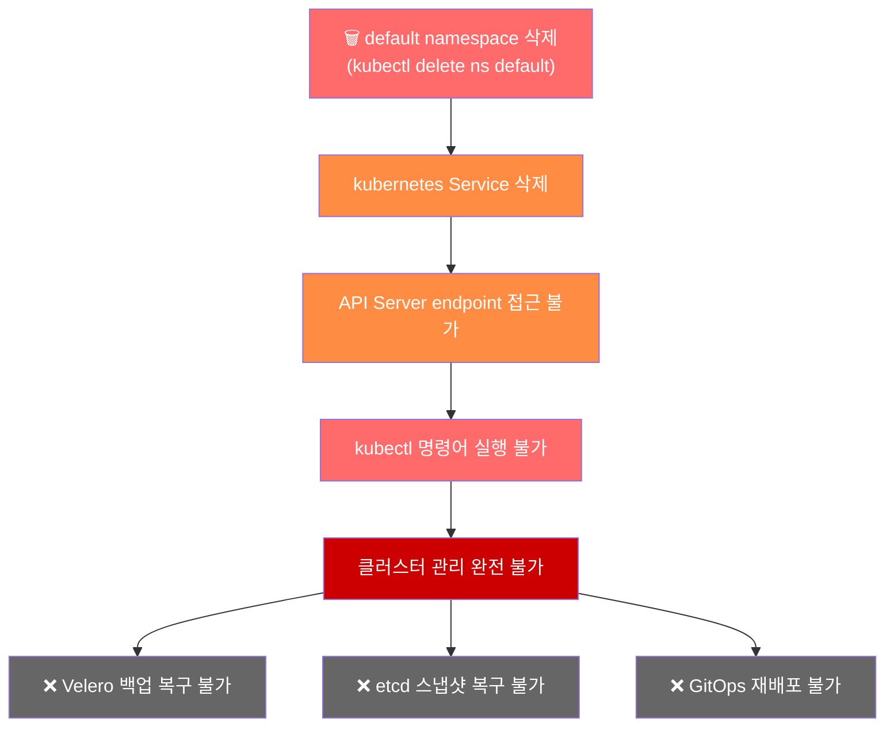
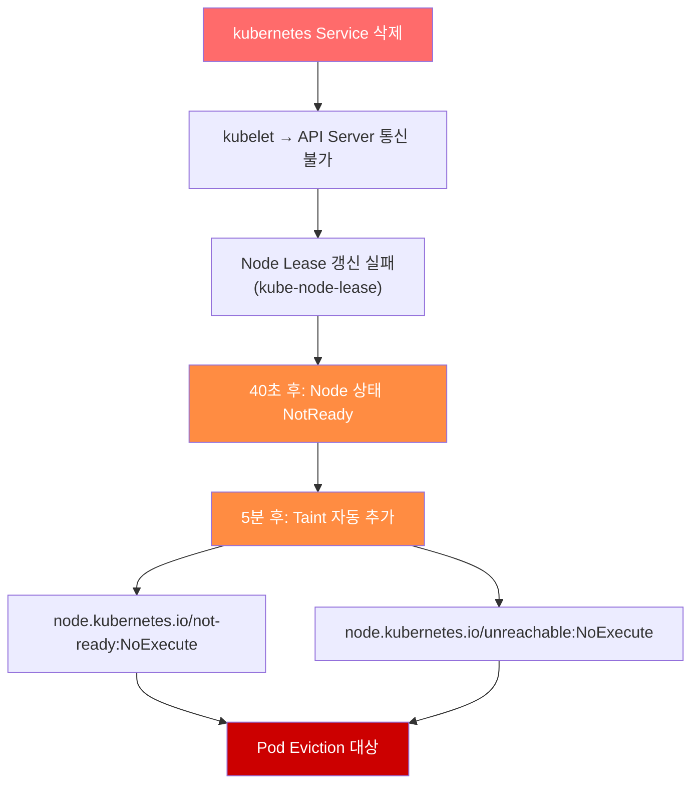

# EKS Default Namespace 삭제 시 장애 대응 가이드

> 📅 **작성일**: 2025-01-07 | ⏱️ **읽는 시간**: 약 18분


## 1. 개요 (TL;DR)

:::danger Critical Alert
EKS 클러스터에서 default namespace를 삭제하면 Control Plane에 대한 모든 접근이 차단됩니다. kubectl 명령어가 작동하지 않으며, Velero나 etcd 백업으로도 복구할 수 없습니다. Default Namespace는 삭제가 불가능하도록 관리해야하는 클러스터의 핵심 리소스입니다. 따라서 Admission Controller 혹은 다른 접근 통제 매커니즘을 활용하여 신중하게 관리하는 것을 강력하게 권장합니다.
:::

- **장애 원인**: `default` namespace 삭제 시 `kubernetes` Service가 함께 삭제됨
- **영향 범위**: API Server 접근 불가 → 클러스터 전체 관리 불가 → (장기화시)서비스 장애 유발
- **복구 방법**: **AWS Support 케이스 오픈 필수** (Severity: Critical)

:::tip 복구 방법 한 줄 요약
AWS Support에 Critical 케이스를 오픈하고, Account Team과 WWSO Specialist를 티켓에 참조로 추가하여 신속한 복구를 요청하세요.
:::

---

## 2. 장애 원인 분석

### 2.1 Default Namespace의 역할

`default` namespace는 단순히 사용자 워크로드를 배포하는 기본 공간이 아닙니다. Kubernetes 클러스터의 핵심 리소스들이 이 namespace에 존재합니다.

**default namespace에 포함된 핵심 리소스**:

:::warning 주의
kubernetes Service는 클러스터 내부에서 API Server에 접근하기 위한 유일한 경로입니다. 이 Service가 삭제되면 모든 Kubernetes 컴포넌트가 Control Plane과 통신할 수 없게 됩니다.
:::

### 2.2 장애 발생 메커니즘

`default` namespace 삭제 시 발생하는 연쇄적인 장애 과정을 다이어그램으로 살펴보겠습니다.



**장애 발생 순서**:

1. **namespace 삭제 명령 실행**: `kubectl delete namespace default`
2. **Cascading 삭제**: namespace 내 모든 리소스가 함께 삭제됨
3. **kubernetes Service 삭제**: API Server endpoint가 사라짐
4. **연결 단절**: 클러스터 내부 컴포넌트들이 API Server와 통신 불가
5. **관리 불가 상태**: 어떤 kubectl 명령어도 실행할 수 없음

### 워커 노드에 미치는 영향

API Server endpoint가 사라진 상태가 지속되면 워커 노드에도 연쇄적인 영향이 발생합니다.



**시간에 따른 노드 상태 변화**:

:::warning 중요
이 상황에서는 Control Plane 자체에 접근이 불가능하기 때문에, Node Controller도 실제로 노드 상태를 업데이트하거나 taint를 추가하는 작업을 수행할 수 없습니다. 결과적으로 클러스터 전체가 "frozen" 상태에 빠지게 되며, 기존에 실행 중인 Pod들은 계속 동작하지만 새로운 스케줄링이나 상태 변경은 불가능합니다.
:::

### Frozen 상태에서의 서비스 영향

클러스터가 frozen 상태에 빠지면 **기존 워크로드는 일정 시간 동안 계속 동작**하지만, 시간이 경과할수록 서비스에 심각한 영향이 발생합니다.

**즉시 영향받는 부분**:

- ❌ 새로운 Pod 스케줄링 불가
- ❌ Pod 재시작/재배포 불가
- ❌ ConfigMap, Secret 변경 반영 불가
- ❌ HPA(Horizontal Pod Autoscaler) 스케일링 불가

**시간 경과에 따른 서비스 영향**:

:::danger 특히 위험한 시나리오
- DNS 캐시가 만료되거나 TLS 인증서 만료시 서비스 디스커버리 실패로 인한 통신 불가
- Pod가 OOMKilled 되거나 crash 되면 **재시작 불가**
- 노드가 장애나면 해당 노드의 **모든 워크로드 손실**
- ALB/NLB Target Group 업데이트 불가로 **트래픽 라우팅 실패**

시간이 지날수록 장애 범위가 확대되므로, **가능한 빨리 AWS Support에 연락**하는 것이 중요합니다.
:::

---

## 3. 장애 대응 절차

### Step 1: 장애 상황 확인

`default` namespace 삭제로 인한 장애가 의심되면, 먼저 클러스터 상태를 확인해야 합니다.

### 1-1. kubectl 접근 테스트

가장 먼저 kubectl 명령어가 정상 작동하는지 확인합니다.

```bash
# 클러스터 정보 조회 시도
kubectl cluster-info

# 예상되는 에러 메시지
# Unable to connect to the server: dial tcp: lookup kubernetes on 10.100.0.10:53: no such host
# 또는
# The connection to the server <cluster-endpoint> was refused
```

:::warning 주의
위와 같은 에러가 발생하면 kubernetes Service가 삭제되어 API Server에 접근할 수 없는 상태입니다.
:::

### 1-2. AWS CLI로 클러스터 상태 확인

kubectl이 작동하지 않더라도 AWS CLI를 통해 EKS 클러스터의 상태를 확인할 수 있습니다.

```bash
# 클러스터 상태 확인
aws eks describe-cluster \
  --name <cluster-name> \
  --query 'cluster.{Name:name,Status:status,Endpoint:endpoint,Version:version}' \
  --output table

# 예상 출력 (클러스터 자체는 ACTIVE 상태)
# -------------------------------------------------------------------
# |                        DescribeCluster                          |
# +----------+------------------------------------------------------+
# |  Name    |  my-eks-cluster                                      |
# |  Status  |  ACTIVE                                              |
# |  Endpoint|  https://XXXXX.gr7.ap-northeast-2.eks.amazonaws.com  |
# |  Version |  1.31                                                |
# +----------+------------------------------------------------------+
```

```bash
# 노드 그룹 상태 확인
aws eks list-nodegroups --cluster-name <cluster-name>

aws eks describe-nodegroup \
  --cluster-name <cluster-name> \
  --nodegroup-name <nodegroup-name> \
  --query 'nodegroup.{Name:nodegroupName,Status:status,DesiredSize:scalingConfig.desiredSize}' \
  --output table
```

### 1-3. 장애 상황 판단 기준

:::tip 핵심 포인트
AWS 콘솔이나 CLI에서 클러스터는 ACTIVE 상태로 보이지만, kubectl 명령어가 전혀 작동하지 않는다면 default namespace 삭제를 의심해야 합니다.
:::

✅ **체크포인트**: 위 증상이 확인되면 즉시 **Step 2: AWS Support 케이스 오픈**으로 진행하세요.

### Step 2: AWS Support 케이스 오픈

`default` namespace 삭제로 인한 장애는 **AWS Support를 통해서만 복구**할 수 있습니다. 즉시 케이스를 오픈하세요.

### 2-1. 케이스 오픈 정보

### 2-2. 케이스 본문 템플릿

아래 템플릿을 복사하여 케이스 본문에 붙여넣으세요.

```text
[긴급] EKS 클러스터 default namespace 삭제로 인한 Control Plane 접근 불가

■ 클러스터 정보
- Cluster Name: <클러스터 이름>
- Region: <리전>
- Account ID: <AWS 계정 ID>
- Cluster Version: <Kubernetes 버전>

■ 장애 상황
- 발생 시각: <YYYY-MM-DD HH:MM KST>
- 증상: default namespace 삭제 후 kubectl 명령어 실행 불가
- 영향 범위: 클러스터 전체 관리 불가

■ 확인된 사항
- AWS CLI로 클러스터 상태 확인: ACTIVE
- kubectl cluster-info 실행 결과: 연결 실패
- kubectl get ns default 실행 결과: 연결 실패

■ 요청 사항
default namespace 및 kubernetes Service 복구를 요청드립니다.
프로덕션 환경으로 긴급 복구가 필요합니다.

■ 연락처
- 담당자: <이름>
- 전화번호: <연락처>
- 이메일: <이메일>
```

### 2-3. AWS 콘솔에서 케이스 오픈 방법

1. AWS Support Center 접속
2. **Create case** 클릭
3. **Technical** 선택
4. Service: **Elastic Kubernetes Service (EKS)** 선택
5. Category: **Cluster Issue** 선택
6. Severity: **Critical - Business-critical system down** 선택 (Enterprise Support 플랜에서만 가능)
7. 위 템플릿을 본문에 붙여넣기
8. Contact options에서 **Phone** 선택 (빠른 응답)
9. **Submit** 클릭

:::warning 중요
케이스 오픈 후 케이스 ID를 반드시 기록해두세요. Account Team과 WWSO Specialist에게 연락할 때 필요합니다.
:::

### Step 3: Account Team/WWSO Specialist 연락

AWS Support 케이스 오픈과 동시에 Account Team과 WWSO(Worldwide Specialist Organization) Specialist에게 연락하여 복구 속도를 높이세요.

### 3-1. 티켓에 참조 추가

AWS Support 케이스에 Account Team과 WWSO Specialist를 참조로 추가합니다.

1. 오픈한 케이스의 **Correspondence** 섹션으로 이동
2. **Reply** 버튼 클릭
3. 아래 내용을 추가하여 참조 요청

```text
CC 요청:
- AWS Account Team: <Account Manager 이름/이메일>
- WWSO EKS Specialist: <Specialist 이름/이메일 (알고 있는 경우)>

긴급 복구가 필요한 프로덕션 환경입니다.
Account Team과 EKS Specialist의 지원을 요청드립니다.
```

### 3-2. Account Team 직접 연락

AWS Support 케이스와 별도로 Account Team에게 직접 연락합니다.

**이메일 템플릿**:

```text
제목: [긴급] EKS 클러스터 장애 - Support Case #<케이스 ID>

안녕하세요,

프로덕션 EKS 클러스터에서 긴급 장애가 발생하여 연락드립니다.

■ 장애 요약
- 클러스터: <클러스터 이름>
- 증상: default namespace 삭제로 인한 Control Plane 접근 불가
- Support Case ID: <케이스 ID>

■ 요청 사항
해당 케이스의 우선순위 상향 및 EKS Specialist 연결을 요청드립니다.

감사합니다.
<이름>
<연락처>
```

**Slack/SMS 메시지** (Account Team 채널이 있는 경우):

```text
🚨 [긴급] EKS 클러스터 장애 발생

- Account: <계정 ID>
- Cluster: <클러스터 이름>
- Issue: default namespace 삭제로 Control Plane 접근 불가
- Support Case: #<케이스 ID>

프로덕션 환경으로 긴급 지원 요청드립니다.
```

### 3-3. WWSO Specialist 연락

WWSO EKS Specialist를 알고 있다면 직접 연락합니다. 스페셜리스트에게 연락을 하게 되면 내부 티켓을 활용하여 티켓의 중요도를 상승 시키고, 인터널 파이프라인을 통해서 할당된 엔지니어에게 직접 작업 요청을 전달 합니다.

### 3-4. 연락 체크리스트

### Step 4: 복구 후 검증

AWS Support를 통해 `default` namespace가 복구되면, 클러스터가 정상적으로 작동하는지 검증합니다.

### 4-1. 기본 연결 검증

```bash
# 1. 클러스터 연결 확인
kubectl cluster-info

# 예상 출력:
# Kubernetes control plane is running at https://XXXXX.gr7.ap-northeast-2.eks.amazonaws.com
# CoreDNS is running at https://XXXXX.gr7.ap-northeast-2.eks.amazonaws.com/api/v1/namespaces/kube-system/services/kube-dns:dns/proxy
```

```bash
# 2. default namespace 존재 확인
kubectl get namespace default

# 예상 출력:
# NAME      STATUS   AGE
# default   Active   <시간>
```

```bash
# 3. kubernetes Service 확인
kubectl get svc kubernetes -n default

# 예상 출력:
# NAME         TYPE        CLUSTER-IP   EXTERNAL-IP   PORT(S)   AGE
# kubernetes   ClusterIP   10.100.0.1   <none>        443/TCP   <시간>
```

### 4-2. 핵심 컴포넌트 상태 검증

```bash
# 4. 노드 상태 확인
kubectl get nodes

# 모든 노드가 Ready 상태인지 확인
```

```bash
# 5. 시스템 Pod 상태 확인
kubectl get pods -n kube-system

# 모든 Pod이 Running 상태인지 확인
# 특히 coredns, kube-proxy, aws-node 확인
```

```bash
# 6. 모든 namespace 확인
kubectl get namespaces

# default, kube-system, kube-public, kube-node-lease 존재 확인
```

### 4-3. API Server 기능 검증

```bash
# 7. API 리소스 조회 테스트
kubectl api-resources | head -20

# 8. 간단한 리소스 생성/삭제 테스트 (선택사항)
kubectl run test-pod --image=nginx --restart=Never -n default
kubectl get pod test-pod -n default
kubectl delete pod test-pod -n default
```

✅ **검증 체크리스트**:

### Step 5: 워크로드 점검

복구 후 기존 워크로드들이 정상적으로 동작하는지 점검합니다.

### 5-1. 워크로드 상태 점검

```bash
# 1. 모든 namespace의 Pod 상태 확인
kubectl get pods --all-namespaces | grep -v Running | grep -v Completed

# Running, Completed 상태가 아닌 Pod 확인
```

```bash
# 2. Deployment 상태 확인
kubectl get deployments --all-namespaces

# READY 컬럼에서 원하는 replica 수와 실제 수가 일치하는지 확인
```

```bash
# 3. StatefulSet 상태 확인
kubectl get statefulsets --all-namespaces
```

```bash
# 4. DaemonSet 상태 확인
kubectl get daemonsets --all-namespaces

# DESIRED와 READY 수가 일치하는지 확인
```

### 5-2. 서비스 연결 점검

```bash
# 5. Service 및 Endpoints 확인
kubectl get svc --all-namespaces
kubectl get endpoints --all-namespaces

# Endpoints에 IP가 정상적으로 할당되어 있는지 확인
```

```bash
# 6. Ingress 상태 확인 (사용하는 경우)
kubectl get ingress --all-namespaces
```

### 5-3. 스토리지 점검

```bash
# 7. PersistentVolumeClaim 상태 확인
kubectl get pvc --all-namespaces

# 모든 PVC가 Bound 상태인지 확인
```

```bash
# 8. PersistentVolume 상태 확인
kubectl get pv

# 모든 PV가 Bound 상태인지 확인
```

### 5-4. 이벤트 및 로그 확인

```bash
# 9. 최근 Warning 이벤트 확인
kubectl get events --all-namespaces --field-selector type=Warning --sort-by='.lastTimestamp' | tail -20
```

```bash
# 10. 문제가 있는 Pod의 로그 확인
kubectl logs <pod-name> -n <namespace> --tail=100
```

### 5-5. 워크로드 점검 체크리스트

:::tip
장애 발생 시간 동안 실패한 Job이나 CronJob이 있을 수 있습니다. 필요한 경우 수동으로 재실행하세요.
:::

```bash
# 실패한 Job 확인
kubectl get jobs --all-namespaces --field-selector status.successful=0
```

✅ **최종 체크포인트**: 모든 워크로드가 정상 상태로 확인되면 장애 대응이 완료됩니다. 이후 **재발 방지 대책**을 검토하세요.

---

## 4. Critical 리소스 목록

### 4.1 Critical Namespaces

`default` namespace 외에도 삭제 시 클러스터에 치명적인 영향을 주는 시스템 namespace들이 있습니다. 이러한 namespace들은 절대로 삭제해서는 안 됩니다.

:::danger Critical Warning
default와 kube-system namespace는 삭제 시 kubectl 접근 자체가 불가능해지므로 수동 복구가 불가능합니다. 반드시 AWS Support를 통해 복구해야 합니다.
:::

**각 Namespace의 상세 역할**:

**default**:

- `kubernetes` Service: 클러스터 내부에서 API Server에 접근하기 위한 endpoint
- `default` ServiceAccount: namespace에 ServiceAccount가 지정되지 않은 Pod의 기본 인증 주체

**kube-system**:

- 클러스터 운영에 필수적인 모든 시스템 컴포넌트가 배포되는 namespace
- EKS Add-on (CoreDNS, kube-proxy, VPC CNI) 및 컨트롤러들이 위치

**kube-public**:

- 인증되지 않은 사용자도 읽을 수 있는 공개 정보 저장
- `cluster-info` ConfigMap에 클러스터 CA 인증서와 API Server 주소 포함

**kube-node-lease**:

- 각 노드의 Lease 객체가 저장되어 heartbeat 역할 수행
- Node Controller가 이 정보를 기반으로 노드 상태를 판단

### 4.2 kube-system 핵심 컴포넌트

`kube-system` namespace에는 클러스터 운영에 필수적인 컴포넌트들이 배포되어 있습니다. 이 컴포넌트들을 개별적으로 삭제하거나 수정하면 심각한 장애가 발생할 수 있습니다.

### EKS 핵심 Add-on

### EKS 스토리지 컴포넌트

### 네트워킹 및 로드밸런싱 컴포넌트

:::tip
EKS Add-on으로 관리되는 컴포넌트(CoreDNS, kube-proxy, VPC CNI, EBS CSI Driver)는 AWS 콘솔이나 CLI에서 Add-on을 재설치하여 복구할 수 있습니다.
:::

```bash
# EKS Add-on 상태 확인
aws eks list-addons --cluster-name <cluster-name>

# Add-on 재설치 예시 (CoreDNS)
aws eks create-addon \
  --cluster-name <cluster-name> \
  --addon-name coredns \
  --resolve-conflicts OVERWRITE
```

:::warning 주의
위 복구 방법은 kube-system namespace가 존재하고 kubectl 접근이 가능한 경우에만 사용할 수 있습니다. namespace 자체가 삭제된 경우에는 AWS Support가 필요합니다.
:::

### 4.3 Cluster-Scoped 리소스

Namespace에 속하지 않는 Cluster-Scoped 리소스들도 삭제나 수정 시 클러스터 전체에 영향을 줄 수 있습니다.

### RBAC 관련 리소스

:::warning 특히 위험한 ClusterRole/ClusterRoleBinding
- `system:node` / `system:node` binding: 삭제 시 **모든 노드가 API Server와 통신 불가**
- `system:kube-controller-manager`: 삭제 시 **컨트롤러 매니저 동작 중단**
- `system:kube-scheduler`: 삭제 시 **Pod 스케줄링 중단**
:::

### CRD (Custom Resource Definition)

:::warning CRD 삭제 주의
CRD를 삭제하면 해당 CRD로 생성된 모든 Custom Resource가 cascading 삭제됩니다. 예를 들어, Cert-Manager의 Certificate CRD를 삭제하면 클러스터의 모든 Certificate 리소스가 삭제됩니다.
:::

### 스토리지 관련 리소스

### 노드 및 네트워크 관련 리소스

### EKS 특화 리소스

:::tip Best Practice
Cluster-Scoped 리소스를 수정하거나 삭제하기 전에 항상 백업을 생성하세요.
:::

```bash
# ClusterRole 백업 예시
kubectl get clusterrole <role-name> -o yaml > clusterrole-backup.yaml

# 모든 ClusterRole 백업
kubectl get clusterroles -o yaml > all-clusterroles-backup.yaml

# CRD 백업 (CR 포함하지 않음)
kubectl get crd <crd-name> -o yaml > crd-backup.yaml
```

---

## 5. 재발 방지 방향성

### 5.1 Admission Controller를 통한 리소스 보호

Kubernetes Admission Controller를 활용하면 Critical 리소스의 삭제를 사전에 차단할 수 있습니다. 여기서는 Kyverno를 사용한 예시를 소개합니다.

### Kyverno를 이용한 Critical Namespace 삭제 방지

```yaml
apiVersion: kyverno.io/v1
kind: ClusterPolicy
metadata:
  name: protect-critical-namespaces
spec:
  validationFailureAction: Enforce
  background: false
  rules:
    - name: block-critical-namespace-deletion
      match:
        any:
          - resources:
              kinds:
                - Namespace
              names:
                - default
                - kube-system
                - kube-public
                - kube-node-lease
      exclude:
        any:
          - clusterRoles:
              - cluster-admin
      validate:
        message: "Critical namespace '{{request.object.metadata.name}}' 삭제가 차단되었습니다."
        deny:
          conditions:
            all:
              - key: "{{request.operation}}"
                operator: Equals
                value: DELETE
```

위 정책을 적용하면 `cluster-admin` 역할이 아닌 사용자가 Critical Namespace를 삭제하려 할 때 요청이 거부됩니다.

### 다른 Admission Controller 옵션

Kyverno 외에도 다양한 Admission Controller를 사용할 수 있습니다.

:::tip 권장
팀의 기술 스택과 정책 복잡도에 따라 선택하세요. 간단한 리소스 보호 정책이라면 Kyverno가 빠르게 적용할 수 있습니다.
:::

### 5.2 GitOps 및 KRMOps 기반 운영

GitOps와 KRMOps(Kubernetes Resource Model Operations) 기반 운영 방식을 도입하면 클러스터 리소스를 선언적으로 관리하고, 의도치 않은 변경으로부터 빠르게 복구할 수 있습니다.

### EKS Auto Mode의 ArgoCD Capability

EKS Auto Mode는 ArgoCD를 기본 제공하여 GitOps 기반 운영을 쉽게 시작할 수 있습니다.

```yaml
# ArgoCD Application 예시 - Critical 리소스 관리
apiVersion: argoproj.io/v1alpha1
kind: Application
metadata:
  name: cluster-critical-resources
  namespace: argocd
spec:
  project: default
  source:
    repoURL: https://github.com/your-org/k8s-manifests.git
    targetRevision: main
    path: cluster-critical
  destination:
    server: https://kubernetes.default.svc
    namespace: default
  syncPolicy:
    automated:
      prune: false      # Critical 리소스 자동 삭제 방지
      selfHeal: true    # Drift 발생 시 자동 복구
    syncOptions:
      - CreateNamespace=false
```

**GitOps의 재발 방지 효과**:

:::tip
Critical Namespace와 리소스는 별도의 ArgoCD Application으로 분리하고, prune: false와 selfHeal: true를 설정하여 보호하세요.
:::

### ACK와 KRO를 활용한 KRMOps 전략

**ACK (AWS Controllers for Kubernetes)**와 **KRO (Kube Resource Orchestrator)**를 활용하면 AWS 인프라까지 Kubernetes Resource Model로 관리할 수 있습니다.

**ACK를 통한 AWS 리소스 관리**:

```yaml
# ACK를 사용한 S3 버킷 선언적 관리 예시
apiVersion: s3.services.k8s.aws/v1alpha1
kind: Bucket
metadata:
  name: my-app-bucket
  namespace: default
spec:
  name: my-app-bucket-12345
  tagging:
    tagSet:
      - key: Environment
        value: Production
```

**KRO를 통한 복합 리소스 오케스트레이션**:

```yaml
# KRO ResourceGroup 예시 - 애플리케이션 스택 정의
apiVersion: kro.run/v1alpha1
kind: ResourceGroup
metadata:
  name: web-application
spec:
  schema:
    apiVersion: v1alpha1
    kind: WebApplication
    spec:
      name: string
      replicas: integer | default=2
  resources:
    - id: deployment
      template:
        apiVersion: apps/v1
        kind: Deployment
        metadata:
          name: ${schema.spec.name}
        spec:
          replicas: ${schema.spec.replicas}
          # ... 생략
    - id: service
      template:
        apiVersion: v1
        kind: Service
        # ... 생략
```

**KRMOps의 장점**:

:::tip 권장
ACK와 KRO를 함께 사용하면 EKS 클러스터뿐만 아니라 연관된 AWS 리소스(VPC, IAM, RDS 등)까지 Kubernetes 방식으로 통합 관리할 수 있습니다.
:::

**참고 자료**:

- AWS Controllers for Kubernetes (ACK)
- Kube Resource Orchestrator (KRO)
- EKS Auto Mode 문서

### 5.3 EKS Access Entry 기반 접근 통제

EKS Access Entry는 `aws-auth` ConfigMap의 한계를 극복하고 더 안전한 클러스터 접근 관리를 제공합니다.

### aws-auth ConfigMap의 문제점

기존 `aws-auth` ConfigMap 방식은 다음과 같은 위험이 있습니다:

:::warning 주의
aws-auth ConfigMap이 삭제되거나 손상되면 IAM 기반 인증이 모두 실패하여 클러스터에 접근할 수 없게 됩니다. 이 경우에도 AWS Support를 통해 복구해야 합니다.
:::

### EKS Access Entry로 전환

EKS Access Entry는 AWS API를 통해 클러스터 접근을 관리하므로 `aws-auth` ConfigMap의 위험을 제거합니다.

**Access Entry 생성 예시**:

```bash
# 관리자 Access Entry 생성
aws eks create-access-entry \
  --cluster-name my-cluster \
  --principal-arn arn:aws:iam::XXXXXXXXXXXX:role/EKSAdminRole \
  --type STANDARD

# 클러스터 관리자 권한 연결
aws eks associate-access-policy \
  --cluster-name my-cluster \
  --principal-arn arn:aws:iam::XXXXXXXXXXXX:role/EKSAdminRole \
  --policy-arn arn:aws:eks::aws:cluster-access-policy/AmazonEKSClusterAdminPolicy \
  --access-scope type=cluster
```

**Namespace 레벨 접근 통제**:

```bash
# 특정 namespace에만 접근 가능한 개발자 권한 설정
aws eks create-access-entry \
  --cluster-name my-cluster \
  --principal-arn arn:aws:iam::XXXXXXXXXXXX:role/DevTeamRole \
  --type STANDARD

aws eks associate-access-policy \
  --cluster-name my-cluster \
  --principal-arn arn:aws:iam::XXXXXXXXXXXX:role/DevTeamRole \
  --policy-arn arn:aws:eks::aws:cluster-access-policy/AmazonEKSEditPolicy \
  --access-scope type=namespace,namespaces=dev,staging
```

**EKS Access Entry의 장점**:

**사전 정의된 Access Policy**:

:::tip 권장 사항
1. **신규 클러스터**: 처음부터 EKS Access Entry만 사용하세요 (`-bootstrap-cluster-creator-admin-permissions` 옵션 활용)
2. **기존 클러스터**: Access Entry로 점진적 마이그레이션 후 `aws-auth` ConfigMap 의존성 제거
3. **최소 권한 원칙**: 클러스터 전체 권한 대신 namespace 스코프 권한 사용
4. **긴급 복구 계정**: 별도의 IAM Role에 클러스터 관리자 권한을 Access Entry로 설정해두어 lockout 상황 대비
:::

**마이그레이션 체크리스트**:

**참고 자료**:

- EKS Cluster Access Management
- Migrating from aws-auth ConfigMap

---

## 6. 요약

### 6.1 핵심 내용 요약

:::danger 핵심 메시지
default, kube-system namespace는 삭제 시 kubectl 접근 자체가 불가능해지므로 수동 복구가 불가능합니다. 반드시 AWS Support를 통해서만 복구할 수 있습니다.
:::

### 6.2 참고 자료

### EKS 공식 문서

- Amazon EKS Best Practices Guide
- EKS Cluster Access Management
- Migrating from aws-auth ConfigMap to Access Entries
- EKS Add-ons
- EKS Auto Mode

### Kubernetes 공식 문서

- Kubernetes RBAC Authorization
- Kubernetes Namespaces
- Admission Controllers Reference

### Admission Controller 도구

- Kyverno - Kubernetes Native Policy Management
- OPA Gatekeeper - Policy Controller for Kubernetes

### GitOps 및 KRMOps 도구

- ArgoCD - Declarative GitOps CD for Kubernetes
- AWS Controllers for Kubernetes (ACK)
- Kube Resource Orchestrator (KRO)
