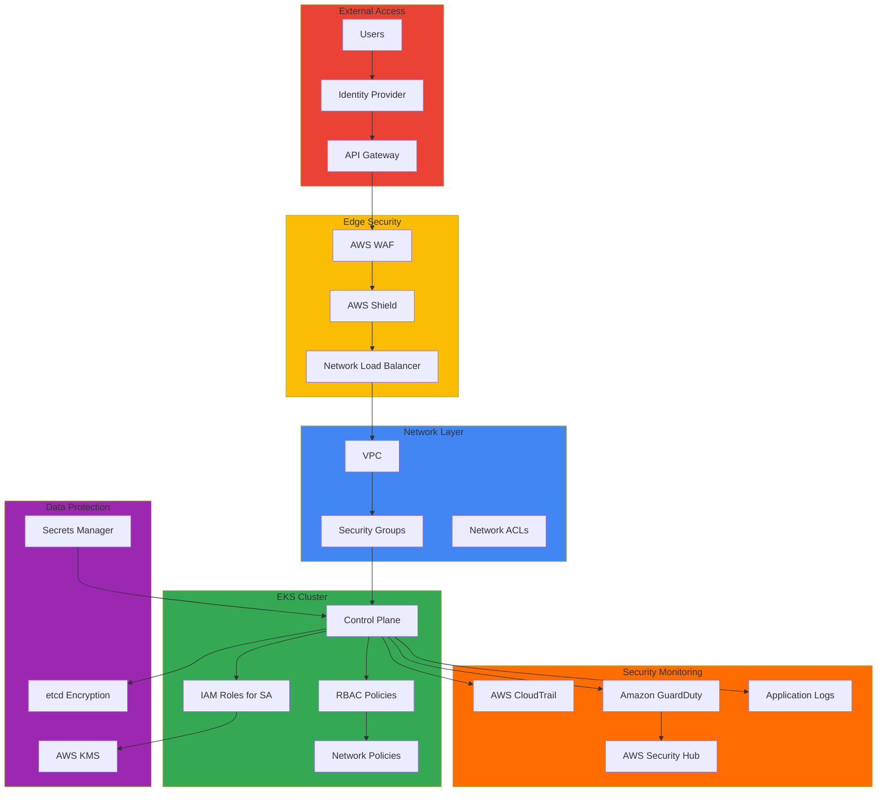

# Security & Governance

현대 클라우드 환경에서 보안은 단순한 방어벽 구축을 넘어 다층 방어 전략과 지속적인 보안 태세 평가를 요구합니다. Amazon EKS 환경에서의 보안 강화는 클러스터 레벨의 접근 제어부터 네트워크 격리, 데이터 암호화, 런타임 보안 모니터링에 이르기까지 포괄적인 접근이 필요합니다. 이 섹션에서는 방어 심층화(Defense in Depth) 원칙에 기반한 보안 아키텍처 설계와 구현 방법을 다룹니다.

보안 거버넌스는 기술적 통제를 넘어 조직의 정책, 프로세스, 컴플라이언스 요구사항을 코드와 인프라에 내재화하는 과정입니다. 금융권을 비롯한 규제 산업에서는 PCI-DSS, SOC 2, ISO 27001과 같은 컴플라이언스 프레임워크 준수가 필수적이며, 이를 위해서는 자동화된 정책 시행, 지속적인 감사 로깅, 실시간 위협 탐지 체계가 구축되어야 합니다. Kubernetes 기반 환경에서는 RBAC, Network Policy, Pod Security Standards와 같은 네이티브 보안 기능과 AWS의 IAM, KMS, GuardDuty 같은 클라우드 네이티브 서비스를 통합하여 강력한 보안 태세를 구축할 수 있습니다.

인시던트 대응 능력은 보안 전략의 핵심 요소입니다. 완벽한 방어는 불가능하다는 전제 하에, 보안 사고 발생 시 신속한 탐지, 정확한 분석, 효과적인 격리, 체계적인 복구 프로세스를 갖추는 것이 중요합니다. CloudTrail을 통한 API 감사 로그, VPC Flow Logs를 통한 네트워크 트래픽 분석, Falco와 같은 런타임 보안 도구를 통한 이상 행위 탐지는 인시던트 대응의 기반이 됩니다. 더 나아가 사후 분석을 통해 근본 원인을 파악하고 재발 방지 조치를 자동화함으로써 보안 태세를 지속적으로 개선해야 합니다.

보안은 한 번의 설정으로 완결되는 것이 아니라 지속적인 평가와 개선이 필요한 영역입니다. 정기적인 취약점 스캐닝, CIS 벤치마크 기반 보안 평가, 침투 테스트를 통해 보안 취약점을 선제적으로 발견하고 보완해야 합니다. Zero Trust 원칙을 적용하여 모든 접근을 기본적으로 거부하고 명시적으로 검증된 요청만 허용하는 것이 현대 보안 아키텍처의 기본입니다.

## 주요 문서

**운영 보안 및 인시던트 관리**

[Default Namespace Incident Response](./default-namespace-incident.md) - 기본 네임스페이스 보안 위협 분석, 인시던트 탐지 및 대응 절차, 사후 분석 및 개선 방안, 보안 모니터링 자동화

## 아키텍처 패턴

## 보안 영역

보안 아키텍처는 클러스터 레벨, 워크로드 레벨, 데이터 레벨의 세 가지 계층으로 구성됩니다. 클러스터 보안은 인증 및 권한 관리를 중심으로 AWS IAM과 Kubernetes RBAC의 통합을 통해 구현됩니다. IRSA(IAM Roles for Service Accounts)를 활용하면 Pod 단위로 세밀한 AWS 리소스 접근 권한을 부여할 수 있으며, 최소 권한 원칙을 적용하여 공격 표면을 최소화합니다. OIDC 프로바이더 통합을 통해 기업의 기존 SSO 시스템과 연동하고 MFA를 적용함으로써 사용자 인증 보안을 강화할 수 있습니다.

네트워크 보안은 다층 방어의 핵심 요소로, Kubernetes Network Policy를 통해 Pod 간 통신을 제어하고 네임스페이스 간 격리를 구현합니다. 서비스 메시(Istio, Linkerd)를 도입하면 mTLS를 자동으로 구성하여 모든 서비스 간 통신을 암호화하고 인증서 관리를 자동화할 수 있습니다. VPC 레벨에서는 퍼블릭 서브넷과 프라이빗 서브넷을 분리하고 NAT Gateway를 통해 아웃바운드 트래픽을 제어하며, VPC Flow Logs를 통해 네트워크 트래픽을 지속적으로 모니터링합니다.

워크로드 보안은 Pod Security Standards를 통해 컨테이너 실행 환경의 보안을 강화합니다. Restricted 레벨을 적용하면 루트 권한 실행을 차단하고 호스트 네트워크 접근을 제한하며 위험한 Capabilities를 제거합니다. Security Context 설정을 통해 읽기 전용 파일시스템을 강제하고 실행 권한을 최소화합니다. 컨테이너 이미지는 Trivy와 같은 도구로 CI/CD 파이프라인에서 스캔하여 취약점을 사전에 차단하고, 승인된 레지스트리의 서명된 이미지만 사용하도록 정책을 시행합니다.

시크릿 관리는 AWS Secrets Manager와 External Secrets Operator를 통합하여 중앙 집중식으로 관리합니다. 시크릿을 Kubernetes Secret으로 직접 저장하지 않고 외부 시크릿 스토어에 보관하며, 자동 로테이션과 주기적 동기화를 통해 시크릿 노출 위험을 최소화합니다. KMS를 활용한 Envelope 암호화로 데이터 암호화 키를 보호하고 키 로테이션 정책을 적용하여 장기 키 노출 위험을 관리합니다.

데이터 보안은 저장 데이터와 전송 데이터 모두에 대한 암호화를 포함합니다. EBS 볼륨은 KMS 기반 암호화를 통해 블록 레벨에서 보호되며, etcd는 AWS KMS와 통합하여 Kubernetes 설정 데이터베이스를 투명하게 암호화합니다. 애플리케이션 레벨에서는 민감 데이터에 대한 엔드-투-엔드 암호화를 구현하여 다층 보호를 제공합니다. 전송 데이터는 TLS/mTLS를 통해 암호화되며, API 서버는 TLS로 보호되고 서비스 메시를 통해 Pod 간 통신에 mTLS가 자동 적용됩니다. 인그레스 레벨에서는 HTTPS를 강제하고 Let's Encrypt와 Cert Manager를 통해 인증서를 자동으로 갱신합니다.

## 컴플라이언스 프레임워크

컴플라이언스 준수는 기술적 구현과 조직적 프로세스의 통합을 요구합니다. SOC 2는 데이터 보안, 가용성, 처리 무결성을 다루며, 이는 EKS 환경에서 고가용성 아키텍처, 데이터 암호화, 접근 제어를 통해 구현됩니다. PCI-DSS는 결제 카드 데이터 처리에 필수적인 표준으로, 네트워크 격리, 데이터 암호화, 접근 제어, 정기적인 보안 평가를 요구합니다. HIPAA는 의료 정보 보호를 위한 규제로, 데이터 암호화와 감사 로깅이 핵심입니다. GDPR은 개인정보 보호를 위해 데이터 최소화, 사용자 권리 보장, 데이터 처리 투명성을 요구하며, ISO 27001은 정보보안 관리 시스템의 전반적인 프레임워크를 제공합니다.

EKS 환경에서 컴플라이언스 요구사항은 기술적 통제로 매핑됩니다. 접근 제어 요구사항은 AWS IAM과 Kubernetes RBAC의 조합으로 구현되며, 암호화 요구사항은 TLS/mTLS와 AWS KMS를 통해 충족됩니다. 감사 요구사항은 CloudTrail을 통한 API 호출 로깅과 애플리케이션 로그 수집으로 구현되며, 모니터링 요구사항은 GuardDuty와 Security Hub를 통한 실시간 위협 탐지로 충족됩니다. 정책 시행은 OPA Gatekeeper를 통해 admission control 단계에서 자동화되어 정책 위반을 사전에 차단합니다.

컴플라이언스 도구는 자동화된 평가와 지속적인 모니터링을 가능하게 합니다. AWS Config는 리소스 구성을 지속적으로 모니터링하고 정책 위반을 탐지하며, Security Hub는 여러 보안 서비스의 결과를 통합하여 중앙 대시보드를 제공합니다. GuardDuty는 머신러닝 기반 위협 탐지를 통해 이상 행위를 식별하고, CloudTrail은 모든 API 호출을 기록하여 감사 추적을 제공합니다. Inspector는 EC2 인스턴스와 컨테이너 이미지의 취약점을 평가하고 보안 권장사항을 제공합니다.

## 보안 도구 및 기술

오픈소스 보안 도구는 Kubernetes 환경의 보안을 강화하는 핵심 요소입니다. Falco는 시스템 콜 레벨에서 런타임 보안을 모니터링하여 비정상 행위를 실시간으로 탐지합니다. 예상치 못한 프로세스 실행, 민감한 파일 접근, 네트워크 연결 시도 등을 탐지하고 알림을 발생시킵니다. OPA Gatekeeper는 정책 기반 제어를 제공하여 admission webhook으로 작동하며, Pod 생성 시점에 보안 정책을 검증하고 위반 시 배포를 차단합니다. Trivy는 컨테이너 이미지와 파일시스템을 스캔하여 알려진 취약점을 탐지하며, CI/CD 파이프라인에 통합하여 취약한 이미지가 프로덕션 환경에 배포되는 것을 방지합니다. Kube-bench는 CIS Kubernetes 벤치마크를 기준으로 클러스터 보안 설정을 평가하고 권장사항을 제공하며, kube-hunter는 클러스터에 대한 침투 테스트를 수행하여 잠재적인 보안 취약점을 발견합니다.

AWS 네이티브 보안 서비스는 클라우드 환경에 최적화된 보안 기능을 제공합니다. AWS WAF는 웹 애플리케이션 방화벽으로 SQL 인젝션, XSS와 같은 일반적인 웹 공격을 차단하고 사용자 정의 규칙을 통해 애플리케이션별 보안 정책을 구현합니다. AWS Shield는 기본 DDoS 보호를 모든 AWS 서비스에 자동으로 제공하며, Shield Advanced는 대규모 DDoS 공격에 대한 고급 보호와 24/7 DDoS 대응팀 지원을 제공합니다. Amazon Inspector는 EC2 인스턴스와 컨테이너 이미지의 취약점을 지속적으로 평가하고 CVE 기반 보안 권장사항을 제공하며, AWS Systems Manager는 운영 체제와 애플리케이션 패치를 자동화하여 취약점을 신속하게 해결합니다.

## 보안 모니터링 및 대응

실시간 보안 모니터링은 위협을 조기에 탐지하고 신속하게 대응하기 위한 필수 요소입니다. 보안 이벤트 로그는 CloudTrail, VPC Flow Logs, 애플리케이션 로그, 컨테이너 로그 등 여러 소스에서 수집되어 중앙 집중식 로그 저장소로 통합됩니다. 이상 행위 탐지는 머신러닝 기반 분석과 규칙 기반 알림을 통해 구현되며, GuardDuty는 비정상적인 API 호출 패턴, 의심스러운 네트워크 활동, 손상된 인스턴스 행위를 자동으로 탐지합니다. 자동화된 보안 대응 워크플로우는 EventBridge와 Lambda를 통해 구현되어 특정 보안 이벤트 발생 시 자동으로 격리, 알림, 복구 작업을 수행합니다.

사고 대응 프로세스는 체계적이고 반복 가능한 절차를 통해 보안 사고의 영향을 최소화합니다. 탐지 단계에서는 보안 모니터링 도구가 이상 징후를 자동으로 식별하고 알림을 발생시킵니다. 분석 단계에서는 보안팀이 사고의 심각도, 영향 범위, 공격 벡터를 평가하고 대응 우선순위를 결정합니다. 격리 단계에서는 영향을 받은 리소스를 네트워크에서 분리하고 추가 피해 확산을 방지합니다. 복구 단계에서는 손상된 시스템을 정상 상태로 복원하고 서비스를 재개합니다. 사후 분석 단계에서는 근본 원인을 파악하고 공격 경로를 재구성하며, 개선 단계에서는 학습된 교훈을 바탕으로 보안 정책과 기술 통제를 강화하여 재발을 방지합니다.

포렌식 분석은 보안 사고의 전체 맥락을 이해하고 증거를 수집하는 과정입니다. CloudTrail 로그 분석을 통해 공격자의 API 호출 패턴과 권한 상승 시도를 추적하고, VPC Flow Logs를 검토하여 비정상적인 네트워크 트래픽과 데이터 유출 시도를 식별합니다. 컨테이너 로그를 수집하여 애플리케이션 레벨의 공격 흔적을 분석하고, 네트워크 트래픽 분석을 통해 C&C 서버와의 통신이나 내부 정찰 활동을 탐지합니다. 이러한 포렌식 데이터는 법적 대응이 필요한 경우 증거로 활용될 수 있으며, 보안 태세 개선을 위한 인사이트를 제공합니다.

## 관련 카테고리

[Hybrid Infrastructure](/docs/hybrid-multicloud) - 하이브리드 환경 보안

[Operations & Observability](/docs/observability-monitoring) - 보안 모니터링

[Infrastructure Optimization](/docs/performance-networking) - 네트워크 보안
