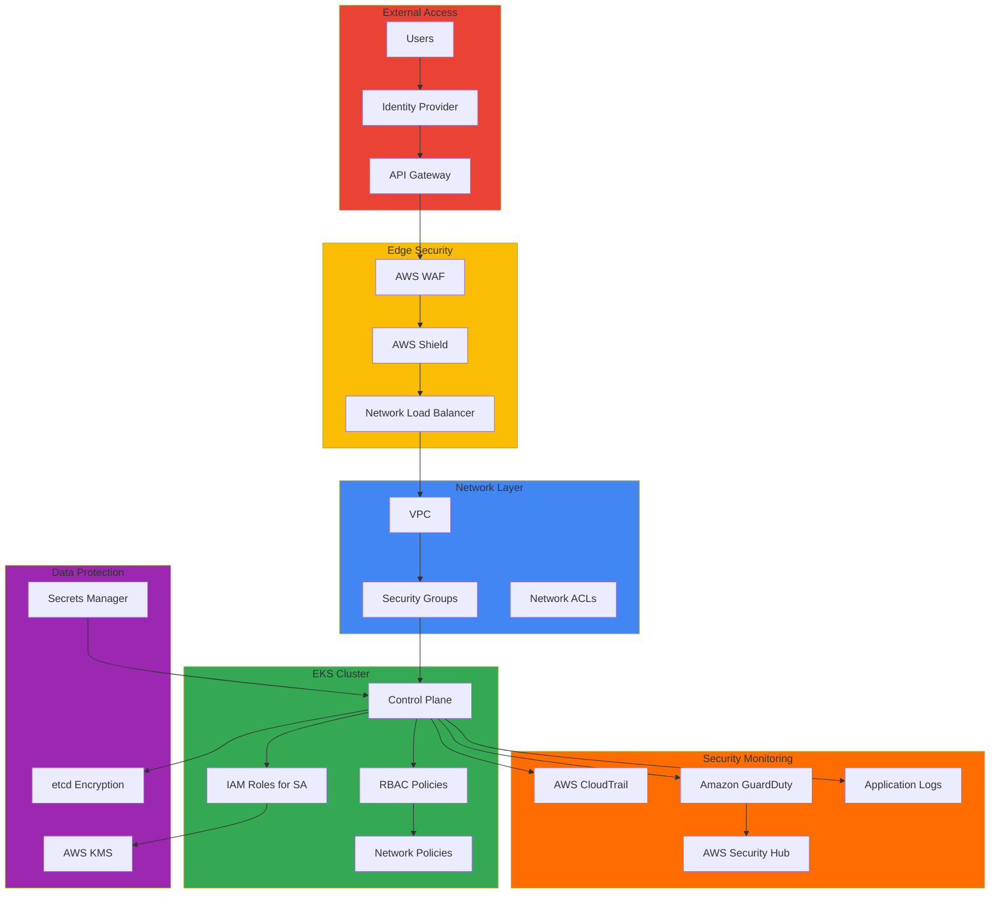

# Security & Compliance

이 섹션에서는 Amazon EKS 환경에서의 보안 강화 및 컴플라이언스 준수에 대한 심화 기술 문서들을 다룹니다. 네트워크 보안, 접근 제어, 데이터 보호, 감사 및 모니터링 등을 통해 금융권을 포함한 엄격한 규제 환경의 요구사항을 충족할 수 있습니다.

## 📚 주요 문서

### 네트워크 보안 및 컴플라이언스
- **[ROSA Network Security Compliance Architecture: Best Practices and Implementation](./rosa-network-security-compliance.md)**
  - Red Hat OpenShift Service on AWS (ROSA) 네트워크 보안 아키텍처
  - 금융권 보안 요구사항 충족 방법
  - 컴플라이언스 정책 구현 및 모니터링
  - 네트워크 보안 정책 설계 및 운영

### 운영 보안 및 인시던트 관리
- **[Default Namespace Incident Response](./default-namespace-incident.md)**
  - 기본 네임스페이스 보안 위협 분석
  - 인시던트 탐지 및 대응 절차
  - 사후 분석 및 개선 방안
  - 보안 모니터링 자동화

## 🎯 학습 목표

이 섹션을 통해 다음을 학습할 수 있습니다:

- EKS 클러스터의 종합적인 보안 강화 방법
- 네트워크 보안 정책 설계 및 구현
- 금융권을 포함한 컴플라이언스 요구사항 준수 전략
- 접근 제어 및 권한 관리
- 데이터 보호 및 암호화 전략
- 보안 모니터링 및 감사
- 사고 대응 및 포렌식
- 지속적인 보안 평가 및 개선

## 🏗️ 아키텍처 패턴

## 🛡️ 보안 영역

### 1. 클러스터 보안

#### 인증 및 권한 관리
- **IAM 역할 및 정책**: AWS IAM을 통한 세밀한 권한 관리
  - IRSA (IAM Roles for Service Accounts)
  - Pod 기반 IAM 정책
  - 최소 권한 원칙 적용

- **RBAC (Role-Based Access Control)**: Kubernetes 기본 권한 관리
  - 역할 정의 (Role, ClusterRole)
  - 바인딩 구성 (RoleBinding, ClusterRoleBinding)
  - 사용자 및 서비스 계정 관리

- **OIDC 프로바이더 통합**: 외부 ID 제공자 연동
  - 싱글 사인온 (SSO)
  - 다중 인증 (MFA)
  - 사용자 속성 기반 접근 제어

#### 네트워크 보안
- **네트워크 정책 (Network Policies)**: 트래픽 제어
  - Pod 간 통신 제한
  - 인그레스/이그레스 정책
  - 네임스페이스 간 격리

- **서비스 메시 보안** (Istio/Linkerd)
  - mTLS (Mutual TLS) 자동 구성
  - 트래픽 암호화
  - 인증서 자동 관리

- **VPC 및 서브넷 보안**
  - 퍼블릭/프라이빗 서브넷 분리
  - NAT Gateway를 통한 아웃바운드 트래픽 제어
  - VPC Flow Logs 모니터링

### 2. 워크로드 보안

#### Pod 보안
- **Pod Security Standards** 적용
  - Restricted: 최대 보안
  - Baseline: 기본 보안
  - Unrestricted: 제한 없음

- **Security Context** 설정
  - 실행 권한 제한
  - 읽기 전용 파일시스템
  - Capabilities 제거

- **컨테이너 이미지 스캐닝**
  - 취약점 평가
  - 승인된 이미지 사용
  - 이미지 서명 검증

#### 시크릿 관리
- **AWS Secrets Manager** 통합
  - 중앙 집중식 시크릿 관리
  - 자동 로테이션
  - 감사 기록

- **External Secrets Operator** 활용
  - 여러 시크릿 백엔드 지원
  - 자동 동기화
  - 주기적 새로고침

- **암호화 키 관리** (KMS)
  - Envelope 암호화
  - 키 로테이션 정책
  - 접근 권한 제어

### 3. 데이터 보안

#### 저장 데이터 암호화
- **EBS 볼륨 암호화**: 블록 스토리지 암호화
  - KMS 기반 암호화
  - 정책 기반 강제화

- **etcd 암호화**: Kubernetes 설정 데이터베이스 암호화
  - AWS KMS 통합
  - 투명한 암호화

- **애플리케이션 레벨 암호화**: 애플리케이션 데이터 암호화
  - 엔드-투-엔드 암호화
  - 사용자 정의 암호화 정책

#### 전송 데이터 암호화
- **TLS/mTLS 구성**: 프로토콜 기반 암호화
  - API 서버 TLS
  - Pod 간 mTLS
  - 인증서 관리

- **서비스 간 통신 암호화**: 내부 트래픽 보호
  - 서비스 메시 mTLS
  - 자동 인증서 관리

- **인그레스 TLS 설정**: 외부 트래픽 보호
  - HTTPS 강제
  - 인증서 갱신 자동화

## 📋 컴플라이언스 프레임워크

### 주요 표준 및 규제
| 표준 | 적용 영역 | 핵심 요구사항 |
|------|----------|-------------|
| **SOC 2** | 데이터 보안 | 보안, 가용성, 처리 무결성 |
| **PCI DSS** | 결제 카드 | 데이터 암호화, 접근 제어 |
| **HIPAA** | 의료 정보 | 데이터 보호, 감사 기록 |
| **GDPR** | 개인정보 | 데이터 보호, 우리 권리 |
| **ISO 27001** | 정보보안 | 정보보안 관리 시스템 |
| **PCI-DSS** | 결제 시스템 | 암호화, 접근 제어, 모니터링 |

### 컴플라이언스 매핑
| 요구사항 | EKS 구현 | 도구 |
|----------|---------|------|
| 접근 제어 | RBAC + IAM | AWS IAM + K8s RBAC |
| 암호화 | TLS + KMS | AWS KMS + Cert Manager |
| 감사 | CloudTrail + 로깅 | AWS CloudTrail |
| 모니터링 | 실시간 감시 | GuardDuty + Security Hub |
| 정책 시행 | 정책 기반 제어 | OPA Gatekeeper |

### 컴플라이언스 도구
- **AWS Config**: 리소스 구성 모니터링 및 정책 시행
- **AWS Security Hub**: 보안 상태 중앙 관리 대시보드
- **Amazon GuardDuty**: 위협 탐지 및 분석
- **AWS CloudTrail**: API 호출 감사 및 기록
- **AWS Inspector**: 취약점 평가 및 모니터링

## 🔧 보안 도구 및 기술

### 오픈소스 보안 도구
| 도구 | 기능 | 사용 시점 |
|------|------|----------|
| **Falco** | 런타임 보안 모니터링 | 비정상 행위 탐지 |
| **OPA Gatekeeper** | 정책 기반 제어 | 정책 시행 |
| **Trivy** | 취약점 스캐닝 | CI/CD 파이프라인 |
| **Kube-bench** | CIS 벤치마크 | 보안 평가 |
| **kube-hunter** | 침투 테스트 | 보안 테스트 |

### AWS 네이티브 보안 서비스
- **AWS WAF**: 웹 애플리케이션 방화벽
- **AWS Shield**: DDoS 보호 (기본/고급)
- **Amazon Inspector**: 취약점 평가
- **AWS Systems Manager**: 패치 관리

## 🚨 보안 모니터링 및 대응

### 실시간 모니터링
- 보안 이벤트 로그 수집 및 분석
- 이상 행위 탐지 및 알림
- 자동화된 보안 대응 워크플로우
- 중앙집중식 보안 이벤트 대시보드

### 사고 대응 프로세스
1. **탐지**: 보안 이벤트 자동 탐지
2. **분석**: 사고 심각도 및 영향도 평가
3. **격리**: 영향을 받은 리소스 격리
4. **복구**: 정상 상태로 복구
5. **분석**: 근본 원인 분석
6. **개선**: 재발 방지 조치

### 포렌식 및 분석
- AWS CloudTrail 로그 분석
- VPC Flow Logs 검토
- 컨테이너 로그 수집
- 네트워크 트래픽 분석

## 🔗 관련 카테고리

- [Hybrid & Multi-Cloud](/docs/hybrid-multicloud) - 하이브리드 환경 보안
- [Observability & Monitoring](/docs/observability-monitoring) - 보안 모니터링
- [Performance & Networking](/docs/performance-networking) - 네트워크 보안

---

:::warning 중요
보안은 한 번 설정하고 끝나는 것이 아닙니다. **지속적인 모니터링과 정기적인 보안 평가가 필수**입니다. 최소한 분기별로 보안 상태를 평가하고, 월별로 로그를 검토하세요.
:::

:::tip 팁
**Zero Trust 원칙 적용**: 모든 접근을 기본적으로 거부하고, 명시적으로 허용된 트래픽만 수용하세요. 이는 보안을 크게 강화할 수 있습니다.
:::

:::info 추천 학습 경로
1. 기본 RBAC 및 IAM 설정
2. 네트워크 정책 구현
3. 데이터 암호화 (TLS + KMS)
4. 보안 모니터링 (GuardDuty + CloudTrail)
5. 고급 기능 (서비스 메시, OPA Gatekeeper)
6. 컴플라이언스 검증
:::

:::warning 주의 - 금융권 요구사항
금융권의 경우 추가적인 규제 요구사항(PCI-DSS, HIPAA 등)이 있을 수 있습니다. 프로젝트 시작 전에 규제 담당팀과 협의하여 요구사항을 명확히 하세요.
:::
