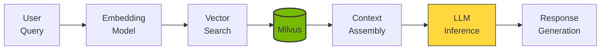
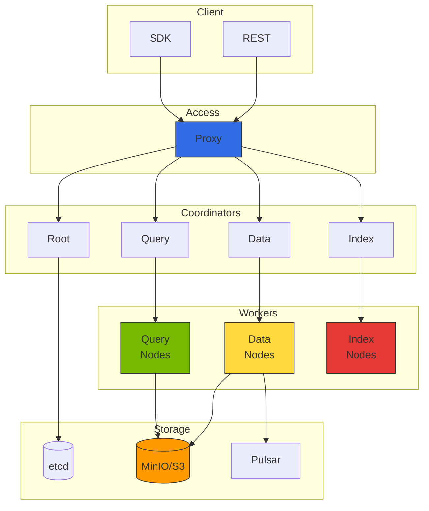

import {
  ComponentRolesTable,
  IndexComparisonTable,
  MonitoringMetricsTable,
  GPUInstanceTable,
  GPUIndexingPerformanceTable,
  StorageCostComparisonTable
} from '@site/src/components/MilvusTables';

# Milvus Vector Database Integration

> 📅 **Created**: 2026-02-13 | **Updated**: 2026-02-14 | ⏱️ **Reading time**: Approximately 4 minutes

Milvus v2.4.x is an open-source vector database for large-scale vector similarity search. It serves as a core component of RAG (Retrieval-Augmented Generation) pipelines in the Agentic AI platform.

## Overview

### Why Milvus is Needed

In Agentic AI systems, vector databases perform the following roles:

- **Knowledge Repository**: Store documents, FAQs, product information as embedding vectors
- **Semantic Search**: Search based on semantic similarity rather than keywords
- **Context Provider**: Provide relevant information to LLMs to reduce hallucination
- **Long-term Memory**: Store agent conversation history and learned content



## Milvus Cluster Architecture

### Distributed Architecture Components



### Component Roles

<ComponentRolesTable />

## EKS Deployment Guide

### Installation via Helm Chart

```bash
# Add Milvus Helm repository
helm repo add milvus https://zilliztech.github.io/milvus-helm/
helm repo update

# Create namespace
kubectl create namespace ai-data

# Install with production configuration
helm install milvus milvus/milvus \
  --namespace ai-data \
  --version 4.1.x \
  --set cluster.enabled=true \
  --set etcd.replicaCount=3 \
  --set minio.mode=distributed \
  --set pulsar.enabled=true \
  -f milvus-values.yaml
```

### Production values.yaml Configuration

```yaml
# milvus-values.yaml
cluster:
  enabled: true

# Proxy configuration
proxy:
  replicas: 2
  resources:
    requests:
      cpu: "1"
      memory: "2Gi"
    limits:
      cpu: "2"
      memory: "4Gi"

# Query Node configuration - directly impacts search performance
queryNode:
  replicas: 3
  resources:
    requests:
      cpu: "2"
      memory: "8Gi"
    limits:
      cpu: "4"
      memory: "16Gi"
  # Enable GPU acceleration (optional)
  # gpu:
  #   enabled: true

# Data Node configuration
dataNode:
  replicas: 2
  resources:
    requests:
      cpu: "1"
      memory: "4Gi"
    limits:
      cpu: "2"
      memory: "8Gi"

# Index Node configuration
indexNode:
  replicas: 2
  resources:
    requests:
      cpu: "2"
      memory: "8Gi"
    limits:
      cpu: "4"
      memory: "16Gi"

# etcd cluster configuration
etcd:
  replicaCount: 3
  persistence:
    enabled: true
    storageClass: "gp3"
    size: 20Gi

# MinIO distributed mode configuration
minio:
  mode: distributed
  replicas: 4
  persistence:
    enabled: true
    storageClass: "gp3"
    size: 100Gi

# Pulsar message queue configuration
pulsar:
  enabled: true
  components:
    autorecovery: true
  bookkeeper:
    replicaCount: 3
  broker:
    replicaCount: 2
```

### Using Amazon S3 as Storage

Using Amazon S3 directly instead of MinIO reduces operational burden. Using S3 Express One Zone provides faster performance and lower latency:

```yaml
# milvus-s3-values.yaml
externalS3:
  enabled: true
  host: "s3.ap-northeast-2.amazonaws.com"
  port: "443"
  useSSL: true
  bucketName: "milvus-data-bucket"
  useIAM: true  # Use IRSA
  cloudProvider: "aws"

# Use S3 Express One Zone (optional - faster performance)
# externalS3:
#   enabled: true
#   host: "s3express-ap-northeast-2.amazonaws.com"
#   bucketName: "milvus-data-bucket--apne2-az1--x-s3"  # S3 Express bucket name format
#   useIAM: true
#   cloudProvider: "aws"

minio:
  enabled: false  # Disable MinIO

# ServiceAccount configuration for IRSA
serviceAccount:
  create: true
  annotations:
    eks.amazonaws.com/role-arn: "arn:aws:iam::XXXXXXXXXXXX:role/MilvusS3Role"
```

:::tip S3 Express One Zone Advantages

- **10x Faster Performance**: 10x faster data access compared to standard S3
- **Consistent Millisecond Latency**: Single-digit millisecond latency
- **Cost Efficient**: 50% reduction in request costs
- **Single AZ**: Optimal when used with compute resources in the same AZ

:::

:::tip S3 IAM Policy

```json
{
  "Version": "2012-10-17",
  "Statement": [
    {
      "Effect": "Allow",
      "Action": [
        "s3:GetObject",
        "s3:PutObject",
        "s3:DeleteObject",
        "s3:ListBucket"
      ],
      "Resource": [
        "arn:aws:s3:::milvus-data-bucket",
        "arn:aws:s3:::milvus-data-bucket/*"
      ]
    }
  ]
}
```

:::

## Index Type Selection Guide

### Major Index Type Comparison

<IndexComparisonTable />

### SCANN Index (Milvus 2.4+)

Google's Scalable Nearest Neighbors (SCANN) index is a high-performance index added in Milvus 2.4:

```python
# Create SCANN index
index_params = {
    "metric_type": "COSINE",
    "index_type": "SCANN",
    "params": {
        "nlist": 1024,  # Number of clusters
        "with_raw_data": True,  # Whether to store raw data
    }
}

collection.create_index(field_name="embedding", index_params=index_params)
collection.load()
```

**SCANN Advantages:**
- Similar search speed to HNSW
- Higher accuracy than IVF series
- Lower memory usage than HNSW
- Excellent performance on large-scale datasets

### Index Creation Example

```python
from pymilvus import Collection, CollectionSchema, FieldSchema, DataType

# Define collection schema
fields = [
    FieldSchema(name="id", dtype=DataType.INT64, is_primary=True, auto_id=True),
    FieldSchema(name="text", dtype=DataType.VARCHAR, max_length=65535),
    FieldSchema(name="embedding", dtype=DataType.FLOAT_VECTOR, dim=1536),
    FieldSchema(name="metadata", dtype=DataType.JSON),
]

schema = CollectionSchema(fields=fields, description="Document embeddings")
collection = Collection(name="documents", schema=schema)

# Create HNSW index (for high-performance search)
index_params = {
    "metric_type": "COSINE",
    "index_type": "HNSW",
    "params": {
        "M": 16,           # Graph connections (higher = more accurate, more memory)
        "efConstruction": 256  # Index build quality (higher = more accurate, longer build time)
    }
}

collection.create_index(field_name="embedding", index_params=index_params)
collection.load()
```

## LangChain/LlamaIndex Integration

### LangChain Integration Example

```python
from langchain_community.vectorstores import Milvus
from langchain_openai import OpenAIEmbeddings
from langchain.text_splitter import RecursiveCharacterTextSplitter
from langchain_community.document_loaders import DirectoryLoader

# Load and split documents
loader = DirectoryLoader("./documents", glob="**/*.md")
documents = loader.load()

text_splitter = RecursiveCharacterTextSplitter(
    chunk_size=1000,
    chunk_overlap=200,
    length_function=len,
)
splits = text_splitter.split_documents(documents)

# Configure embedding model
embeddings = OpenAIEmbeddings(model="text-embedding-3-small")

# Create Milvus vector store
vectorstore = Milvus.from_documents(
    documents=splits,
    embedding=embeddings,
    connection_args={
        "host": "milvus-proxy.ai-data.svc.cluster.local",
        "port": "19530",
    },
    collection_name="langchain_docs",
    drop_old=True,
)

# Similarity search
query = "How to schedule GPUs in Kubernetes"
docs = vectorstore.similarity_search(query, k=5)

for doc in docs:
    print(f"Content: {doc.page_content[:200]}...")
    print(f"Metadata: {doc.metadata}")
    print("---")
```

### LlamaIndex Integration Example

```python
from llama_index.core import VectorStoreIndex, SimpleDirectoryReader, Settings
from llama_index.vector_stores.milvus import MilvusVectorStore
from llama_index.embeddings.openai import OpenAIEmbedding

# Configure embedding model
Settings.embed_model = OpenAIEmbedding(model="text-embedding-3-small")

# Configure Milvus vector store
vector_store = MilvusVectorStore(
    uri="http://milvus-proxy.ai-data.svc.cluster.local:19530",
    collection_name="llamaindex_docs",
    dim=1536,
    overwrite=True,
)

# Load and index documents
documents = SimpleDirectoryReader("./documents").load_data()
index = VectorStoreIndex.from_documents(
    documents,
    vector_store=vector_store,
)

# Create query engine
query_engine = index.as_query_engine(similarity_top_k=5)

# Execute query
response = query_engine.query("Explain Agentic AI platform architecture")
print(response)
```

### Complete RAG Pipeline Configuration

```python
from langchain_openai import ChatOpenAI
from langchain.chains import RetrievalQA
from langchain.prompts import PromptTemplate

# Configure LLM
llm = ChatOpenAI(
    model="gpt-4o",
    temperature=0,
)

# Prompt template
prompt_template = """Answer the question using the following context.
If there is no answer in the context, say "No information available."

Context:
{context}

Question: {question}

Answer:"""

PROMPT = PromptTemplate(
    template=prompt_template,
    input_variables=["context", "question"]
)

# Configure RAG chain
qa_chain = RetrievalQA.from_chain_type(
    llm=llm,
    chain_type="stuff",
    retriever=vectorstore.as_retriever(
        search_type="mmr",  # Maximum Marginal Relevance
        search_kwargs={"k": 5, "fetch_k": 10}
    ),
    chain_type_kwargs={"prompt": PROMPT},
    return_source_documents=True,
)

# Execute query
result = qa_chain.invoke({"query": "How to manage GPU resources?"})
print(f"Answer: {result['result']}")
print(f"Sources: {[doc.metadata for doc in result['source_documents']]}")
```

## Query Optimization

### Tuning Search Parameters

```python
# Configure search parameters
search_params = {
    "metric_type": "COSINE",
    "params": {
        "ef": 128,  # HNSW search range (higher = more accurate, slower)
    }
}

# Search with filtering
results = collection.search(
    data=[query_embedding],
    anns_field="embedding",
    param=search_params,
    limit=10,
    expr='metadata["category"] == "kubernetes"',  # Metadata filter
    output_fields=["text", "metadata"],
)
```

### Hybrid Search (Vector + Keyword)

```python
from pymilvus import AnnSearchRequest, RRFRanker

# Vector search request
vector_search = AnnSearchRequest(
    data=[query_embedding],
    anns_field="embedding",
    param={"metric_type": "COSINE", "params": {"ef": 64}},
    limit=20
)

# BM25 score for keyword search (requires separate field)
# Supported in Milvus 2.4+

# Merge results with RRF (Reciprocal Rank Fusion)
results = collection.hybrid_search(
    reqs=[vector_search],
    ranker=RRFRanker(k=60),
    limit=10,
    output_fields=["text", "metadata"]
)
```

## High Availability and Backup

### Data Backup Strategy

```bash
# Install Milvus backup tool
pip install milvus-backup

# Backup configuration file
cat > backup_config.yaml << EOF
milvus:
  address: milvus-proxy.ai-data.svc.cluster.local
  port: 19530

minio:
  address: minio.ai-data.svc.cluster.local
  port: 9000
  accessKeyID: minioadmin
  secretAccessKey: minioadmin
  bucketName: milvus-backup
  useSSL: false

backup:
  maxSegmentGroupSize: 2G
EOF

# Execute backup
milvus-backup create -n daily_backup -c backup_config.yaml
```

### Disaster Recovery Configuration

```yaml
# Configuration for cross-region replication
apiVersion: batch/v1
kind: CronJob
metadata:
  name: milvus-backup-sync
  namespace: ai-data
spec:
  schedule: "0 */6 * * *"  # Every 6 hours
  jobTemplate:
    spec:
      template:
        spec:
          containers:
          - name: backup-sync
            image: amazon/aws-cli:latest
            command:
            - /bin/sh
            - -c
            - |
              # Replicate backup to another region's S3
              aws s3 sync s3://milvus-backup-primary s3://milvus-backup-dr \
                --source-region ap-northeast-2 \
                --region us-west-2
          restartPolicy: OnFailure
          serviceAccountName: milvus-backup-sa
```

## Monitoring and Metrics

### Prometheus Metrics Collection

```yaml
apiVersion: monitoring.coreos.com/v1
kind: ServiceMonitor
metadata:
  name: milvus-monitor
  namespace: ai-data
spec:
  selector:
    matchLabels:
      app.kubernetes.io/name: milvus
  endpoints:
  - port: metrics
    interval: 30s
    path: /metrics
```

### Key Monitoring Metrics

<MonitoringMetricsTable />

### Grafana Dashboard

```json
{
  "dashboard": {
    "title": "Milvus Performance",
    "panels": [
      {
        "title": "Search Latency P99",
        "type": "graph",
        "targets": [
          {
            "expr": "histogram_quantile(0.99, rate(milvus_proxy_search_latency_bucket[5m]))",
            "legendFormat": "P99 Latency"
          }
        ]
      },
      {
        "title": "Query Throughput",
        "type": "graph",
        "targets": [
          {
            "expr": "sum(rate(milvus_proxy_search_vectors_count[5m]))",
            "legendFormat": "Vectors/sec"
          }
        ]
      }
    ]
  }
}
```

---

## Kubernetes Operator-Based Deployment

Using Milvus Operator allows declarative management of complex distributed architectures.

### Install Milvus Operator

```bash
# Install Milvus Operator
helm repo add milvus-operator https://milvus-io.github.io/milvus-operator/
helm repo update
helm install milvus-operator milvus-operator/milvus-operator -n milvus-operator --create-namespace
```

### Deploy Milvus Cluster CRD

```yaml
apiVersion: milvus.io/v1beta1
kind: Milvus
metadata:
  name: milvus-cluster
  namespace: ai-data
spec:
  mode: cluster
  dependencies:
    etcd:
      inCluster:
        values:
          replicaCount: 3
    storage:
      inCluster:
        values:
          mode: distributed
    pulsar:
      inCluster:
        values:
          components:
            autorecovery: false
  components:
    proxy:
      replicas: 2
      resources:
        requests:
          cpu: "1"
          memory: "2Gi"
    queryNode:
      replicas: 3
      resources:
        requests:
          cpu: "2"
          memory: "8Gi"
    dataNode:
      replicas: 2
    indexNode:
      replicas: 2
      resources:
        requests:
          nvidia.com/gpu: 1  # GPU-accelerated indexing
```

### GPU-Accelerated Indexing

Allocating GPUs to Index Nodes can significantly improve index build speed:

```yaml
# Index Node configuration with GPU enabled
spec:
  components:
    indexNode:
      replicas: 2
      resources:
        requests:
          nvidia.com/gpu: 1
          cpu: "4"
          memory: "16Gi"
        limits:
          nvidia.com/gpu: 1
          cpu: "8"
          memory: "32Gi"
      # Schedule on GPU-dedicated nodes
      nodeSelector:
        workload: gpu-indexing
      tolerations:
        - key: nvidia.com/gpu
          operator: Exists
          effect: NoSchedule
```

**Recommended GPU Instances:**

<GPUInstanceTable />

**GPU Indexing Performance Comparison:**

<GPUIndexingPerformanceTable />

---

## Related Documents

- [Agentic AI Platform Architecture](../design-architecture/agentic-platform-architecture.md)
- [Agentic AI Technical Challenges](../design-architecture/agentic-ai-challenges.md)
- [Ragas RAG Evaluation Framework](../operations-mlops/ragas-evaluation.md)
- [Agent Monitoring](../operations-mlops/agent-monitoring.md)

:::info Recommendations

- Operate at least 3 Query Nodes in production environments
- Consider DISKANN index for large-scale datasets (100M+ vectors)
- Using S3 as storage can significantly reduce operational complexity
- Using S3 Express One Zone provides 10x faster performance and 50% cheaper request costs
- GPU-accelerated indexing can significantly reduce build time (g5.xlarge recommended)
- Milvus v2.4.x provides advanced features including SCANN index, hybrid search, scalar filtering, and dynamic schema
- Deploy Milvus 2.4.x using Helm chart version 4.1.x
:::

### Storage Cost Comparison

<StorageCostComparisonTable />

**Recommendations:**
- **Dev/Test**: MinIO (easy setup)
- **Production (General)**: S3 Standard (cost-efficient)
- **Production (High-Performance)**: S3 Express One Zone (10x faster performance)

:::warning Precautions

- Index building is CPU/memory intensive, so perform it during off-peak hours
- Data is permanently deleted when collections are deleted, so check backups first
- GPU Index Nodes are expensive, so only enable when necessary
- S3 Express One Zone is limited to a single AZ, so consider high availability requirements
:::
