import Tabs from '@theme/Tabs';
import TabItem from '@theme/TabItem';

> **Written**: 2025-02-05 | **Last modified**: 2026-02-04 | **Reading time**: ~25 min

## Introduction

When building and operating an Agentic AI Platform, platform engineers and architects face unique technical challenges that differ fundamentally from traditional web applications. This document analyzes **4 key challenges** and explores the **Kubernetes-based open source ecosystem** designed to address them.

## 4 Key Technical Challenges of Agentic AI Platform

Agentic AI systems leveraging Frontier Models (latest large language models) have **fundamentally different infrastructure requirements** from traditional web applications.


### Challenge Summary

| Challenge | Core Problem | Limitations of Traditional Infrastructure |
| --- | --- | --- |
| **GPU Monitoring & Scheduling** | Lack of multi-cluster GPU visibility, generation-specific workload matching | Manual monitoring, static allocation |
| **Dynamic Routing & Scaling** | Unpredictable traffic, multi-model serving complexity | Slow provisioning, fixed capacity |
| **Cost Control** | GPU idle costs, difficulty tracking at token level | No cost visibility, no optimization |
| **FM Fine-tuning** | Distributed training infrastructure complexity, resource provisioning delays | Manual cluster management, low utilization |

:::warning Limitations of Traditional Infrastructure Approach
Traditional VM-based infrastructure or manual management approaches cannot effectively respond to Agentic AI's **dynamic and unpredictable workload patterns**. The high cost of GPU resources and complex distributed system requirements make **automated infrastructure management** essential.
:::

---

## The Key to Resolution: Integration of Cloud Infrastructure Automation and AI Platform

The key to solving Agentic AI Platform challenges is the **organic integration of cloud infrastructure automation and AI workloads**. Here's why this integration matters:


## Why Kubernetes?

Kubernetes is the **ideal foundational platform** to solve all challenges of Agentic AI Platform:

| Kubernetes Core Feature | AI Platform Application | Solved Challenge |
| --- | --- | --- |
| **Declarative Resource Management** | Define GPU resources as code with version control | Challenge 1, 4 |
| **Auto Scaling (HPA/VPA)** | Automatic Pod expansion/contraction based on traffic patterns | Challenge 2 |
| **Namespace-based Isolation** | Resource quota management by team/project | Challenge 3 |
| **Operator Pattern** | Automation of complex distributed learning workflows | Challenge 4 |
| **Service Mesh Integration** | Multi-model routing and traffic management | Challenge 2 |
| **Metrics-based Orchestration** | GPU utilization-based scheduling decisions | Challenge 1, 3 |


:::info Kubernetes Support for AI Workloads
Kubernetes provides rich integration with AI/ML ecosystems including NVIDIA GPU Operator, Kubeflow, and KEDA. Through these integrations, GPU resource management, distributed learning, and model serving can be **integrated and managed on a single platform**.
:::

---

Now that we understand why Kubernetes is ideal for AI workloads, let's look at the **specific open source solutions that address each challenge**.

## Bird's Eye View of Kubernetes Agentic AI Solutions

The Kubernetes ecosystem has **specialized open-source solutions** to solve each challenge of the Agentic AI Platform. These solutions are designed to be Kubernetes-native, allowing you to leverage the benefits of **declarative management, automatic scaling, and high availability**.

### Solution Mapping Overview

```mermaid
graph TB
    subgraph "4 Key Technical Challenges"
        C1["🖥️ GPU Monitoring &<br/>Resource Scheduling"]
        C2["🔀 Dynamic Routing &<br/>Scaling"]
        C3["📊 Token/Session Monitoring<br/>& Cost Control"]
        C4["🔧 FM Fine-tuning &<br/>Automation Pipeline"]
    end

    subgraph "Kubernetes Native Solutions"
        S1["Karpenter<br/>GPU Node Auto Provisioning"]
        S2["Kgateway + LiteLLM<br/>Inference Gateway"]
        S3["LangFuse / LangSmith<br/>LLM Observability"]
        S4["NeMo + Kubeflow<br/>Distributed Training Pipeline"]
    end

    subgraph "Model Serving Layer"
        VLLM["vLLM<br/>High-Performance Inference Engine"]
        LLMD["llm-d<br/>Distributed Inference Scheduler"]
    end

    subgraph "Agent Orchestration"
        KAGENT["KAgent<br/>Kubernetes Agent Framework"]
    end

    C1 --> S1
    C2 --> S2
    C3 --> S3
    C4 --> S4

    S2 --> VLLM
    S2 --> LLMD
    KAGENT --> S2
    KAGENT --> S3

    style C1 fill:#ff6b6b
    style C2 fill:#4ecdc4
    style C3 fill:#45b7d1
    style C4 fill:#96ceb4
    style S1 fill:#ffd93d
    style S2 fill:#4286f4
    style S3 fill:#9b59b6
    style S4 fill:#76b900
    style VLLM fill:#e74c3c
    style LLMD fill:#e74c3c
    style KAGENT fill:#2ecc71
```



### Challenge-specific Solution Detailed Mapping

| Challenge | Core Solution | Supporting Solutions | Solves |
| --- | --- | --- | --- |
| **GPU Monitoring & Scheduling** | Karpenter | DCGM Exporter, NVIDIA GPU Operator | GPU node auto provisioning, generation-specific workload matching |
| **Dynamic Routing & Scaling** | Kgateway, LiteLLM | KEDA, vLLM, llm-d | Multi-model routing, traffic-based auto scaling |
| **Token/Cost Monitoring** | LangFuse, LangSmith | OpenTelemetry, Prometheus | Token-level tracking, cost visibility, quality evaluation |
| **FM Fine-tuning** | NeMo, Kubeflow | MLflow, Ray | Distributed learning orchestration, pipeline automation |

---

So far, we've surveyed the various solutions in the Kubernetes ecosystem. Now let's take a closer look at **how these solutions actually integrate and work together** from an open source architecture perspective.

## Open Source Ecosystem and Kubernetes Integration Architecture

The Agentic AI Platform is composed of various open source projects that integrate organically around Kubernetes. This section explains how the core open source projects in **LLM Observability, Model Serving, Vector Databases, and GPU Infrastructure** collaborate to form a complete Agentic AI Platform.

### 1. Model Serving: vLLM + llm-d

**vLLM** is a high-performance serving engine for LLM inference that **maximizes memory efficiency** through PagedAttention.

**llm-d** is a scheduler that **intelligently distributes** LLM inference requests in Kubernetes environments.


| Solution | Role | Core Features |
| --- | --- | --- |
| **vLLM** | Inference Engine | PagedAttention, Continuous Batching, Speculative Decoding |
| **llm-d** | Distributed Scheduler | Load balancing, Prefix Caching-aware routing, Failure recovery |

**Kubernetes Integration:**
- Deployed as Kubernetes Deployments
- Exposed via Services
- Scaled via HPA based on queue depth metrics
- GPU allocation through resource requests/limits

### 2. Inference Gateway: Kgateway + LiteLLM

**Kgateway** is a Kubernetes Gateway API-based AI inference gateway that provides **multi-model routing and traffic management**.

**LiteLLM** **abstracts various LLM providers** with a unified API, making model switching easy.


| Solution | Role | Core Features |
| --- | --- | --- |
| **Kgateway** | Traffic Management | Header-based routing, weight distribution, Rate Limiting, Canary deployment |
| **LiteLLM** | API Abstraction | 100+ LLM provider support, unified API, fallback settings, cost tracking |

**Kubernetes Integration:**
- Implements Kubernetes Gateway API (standard)
- HTTPRoute resources for declarative routing
- Native integration with Kubernetes Services
- Supports cross-namespace routing

### 3. LLM Observability: LangFuse + LangSmith

**LangFuse** and **LangSmith** are observability platforms that **track the entire lifecycle of LLM applications**.


| Solution | Deployment | Core Features |
| --- | --- | --- |
| **LangFuse** | Self-hosted (K8s) | Token tracking, cost analysis, prompt management, A/B testing |
| **LangSmith** | Managed SaaS | Tracing, evaluation, dataset management, collaboration features |

**Kubernetes Integration (LangFuse):**
- Deployed as StatefulSet or Deployment
- Requires PostgreSQL backend (can use managed RDS or in-cluster)
- Exposes metrics in Prometheus format
- SDK integration via environment variables in Pods

### 4. Agent Orchestration: KAgent

**KAgent** is a Kubernetes-native AI Agent framework that **defines and manages Agent workflows as CRDs**.


| Feature | Description |
| --- | --- |
| **Declarative Agent Definition** | Define Agent configuration, tools, memory in YAML |
| **Automatic Scaling** | Auto-expand Agent instances based on request volume |
| **Integrated Observability** | Automatic integration with LangFuse/LangSmith |
| **Tool Management** | Tool integration based on MCP (Model Context Protocol) |

**Kubernetes Integration:**
- Extends Kubernetes with Custom Resource Definitions (CRDs)
- Controller pattern for state reconciliation
- Native integration with Kubernetes RBAC
- Leverages Kubernetes Secrets for API keys

### Solution Stack Integration Architecture


---

### Full Open Source Integration Architecture


### Layer-by-Layer Open Source Roles and Integration

#### LLM Observability Layer: LangFuse, LangSmith, RAGAS

Core tools for **tracking the entire lifecycle and evaluating the quality** of LLM applications.

| Solution | Role | Kubernetes Integration | Core Features |
| --- | --- | --- | --- |
| **LangFuse** | LLM Tracing (Self-hosted) | Helm Chart, StatefulSet | Token tracking, cost analysis, prompt version management |
| **LangSmith** | LLM Tracing (Managed) | SDK integration | Tracing, evaluation, dataset management, collaboration |
| **RAGAS** | RAG Quality Evaluation | Job/CronJob | Faithfulness, Relevancy, Context Precision evaluation |


**LangFuse Kubernetes Deployment Example:**

```yaml
apiVersion: apps/v1
kind: Deployment
metadata:
  name: langfuse-web
  namespace: observability
spec:
  replicas: 2
  selector:
    matchLabels:
      app: langfuse-web
  template:
    spec:
      containers:
        - name: langfuse
          image: langfuse/langfuse:latest
          env:
            - name: DATABASE_URL
              valueFrom:
                secretKeyRef:
                  name: langfuse-secrets
                  key: database-url
            - name: NEXTAUTH_SECRET
              valueFrom:
                secretKeyRef:
                  name: langfuse-secrets
                  key: nextauth-secret
          resources:
            requests:
              memory: "512Mi"
              cpu: "250m"
---
apiVersion: batch/v1
kind: CronJob
metadata:
  name: ragas-evaluation
  namespace: observability
spec:
  schedule: "0 */6 * * *"  # Runs every 6 hours
  jobTemplate:
    spec:
      template:
        spec:
          containers:
            - name: ragas
              image: ragas/ragas:latest
              command: ["python", "-m", "ragas.evaluate"]
              env:
                - name: LANGFUSE_HOST
                  value: "http://langfuse-web:3000"
          restartPolicy: OnFailure
```

#### Inference Gateway Layer: LiteLLM

**LiteLLM** abstracts 100+ LLM providers into a **unified OpenAI-compatible API**.


**LiteLLM Kubernetes Deployment Example:**

```yaml
apiVersion: apps/v1
kind: Deployment
metadata:
  name: litellm-proxy
  namespace: ai-gateway
spec:
  replicas: 3
  selector:
    matchLabels:
      app: litellm
  template:
    spec:
      containers:
        - name: litellm
          image: ghcr.io/berriai/litellm:main-latest
          ports:
            - containerPort: 4000
          env:
            - name: LITELLM_MASTER_KEY
              valueFrom:
                secretKeyRef:
                  name: litellm-secrets
                  key: master-key
            - name: REDIS_HOST
              value: "redis-cache"
          volumeMounts:
            - name: config
              mountPath: /app/config.yaml
              subPath: config.yaml
      volumes:
        - name: config
          configMap:
            name: litellm-config
---
apiVersion: v1
kind: ConfigMap
metadata:
  name: litellm-config
  namespace: ai-gateway
data:
  config.yaml: |
    model_list:
      - model_name: gpt-4
        litellm_params:
          model: openai/gpt-4
          api_key: os.environ/OPENAI_API_KEY
      - model_name: claude-3
        litellm_params:
          model: anthropic/claude-3-opus
          api_key: os.environ/ANTHROPIC_API_KEY
      - model_name: llama-70b
        litellm_params:
          model: openai/llama-70b
          api_base: http://vllm-llama:8000/v1

    router_settings:
      routing_strategy: least-busy
      enable_fallbacks: true

    general_settings:
      master_key: os.environ/LITELLM_MASTER_KEY
```

#### Distributed Inference Layer: llm-d

**llm-d** is a scheduler that **intelligently distributes** LLM inference requests in Kubernetes environments.

| Feature | Description | Kubernetes Integration |
| --- | --- | --- |
| **Prefix Caching Awareness** | Routes requests with the same prompt prefix to the same instance | Leverages Service Discovery |
| **Load Balancing** | Intelligent distribution based on GPU utilization | Prometheus metrics integration |
| **Failure Recovery** | Automatic re-routing on instance failure | Health Check + Endpoint Slice |
| **Dynamic Scaling** | Backend expansion based on request volume | KEDA integration |


**llm-d Kubernetes Deployment Example:**

```yaml
apiVersion: apps/v1
kind: Deployment
metadata:
  name: llm-d-router
  namespace: ai-inference
spec:
  replicas: 2
  selector:
    matchLabels:
      app: llm-d
  template:
    spec:
      containers:
        - name: llm-d
          image: ghcr.io/llm-d/llm-d:latest
          ports:
            - containerPort: 8080
          env:
            - name: BACKENDS
              value: "vllm-0.vllm:8000,vllm-1.vllm:8000,vllm-2.vllm:8000"
            - name: ROUTING_STRATEGY
              value: "prefix-aware"
            - name: PROMETHEUS_ENDPOINT
              value: "http://prometheus:9090"
          resources:
            requests:
              memory: "256Mi"
              cpu: "500m"
---
apiVersion: v1
kind: Service
metadata:
  name: llm-d
  namespace: ai-inference
spec:
  selector:
    app: llm-d
  ports:
    - port: 8080
      targetPort: 8080
```

### 5. Vector Database Layer: Milvus

Milvus, a core component of RAG pipelines, operates with a distributed architecture on Kubernetes.

For detailed information, see **[Milvus Vector Database](./milvus-vector-database.md)**.

**Key features of Milvus:**
- **Distributed Architecture**: Separates access, coordination, worker, and storage layers for independent scaling
- **Kubernetes Operator**: CRD-based declarative management
- **GPU Acceleration**: GPU-accelerated index building on Index Nodes
- **S3 Integration**: Amazon S3 as persistent storage

### 6. Distributed Training: NeMo + Kubeflow

**NVIDIA NeMo** and **Kubeflow** provide **automated distributed training pipelines** for large-scale models.

| Solution | Role | Core Features |
| --- | --- | --- |
| **NeMo** | Training Framework | LLM/multimodal training, model parallelism, optimization techniques |
| **Kubeflow** | ML Orchestration | Pipeline management, experiment tracking, hyperparameter tuning |


**Kubernetes Integration:**
- Kubeflow Training Operators (PyTorchJob, MPIJob, etc.)
- Gang scheduling for distributed workloads
- Topology-aware scheduling (node affinity, anti-affinity)
- Integration with CSI drivers for shared storage (FSx for Lustre)

---

## GPU Infrastructure and Resource Management

GPU resource management is at the core of Agentic AI platforms. For detailed information, see:

- **[GPU Resource Management](./gpu-resource-management.md)**: Device Plugin, DRA (Dynamic Resource Allocation), GPU topology-aware scheduling
- **[NeMo Framework](./nemo-framework.md)**: Distributed training and NCCL optimization

:::tip Key GPU Management Concepts
- **Device Plugin**: Kubernetes' basic GPU allocation mechanism
- **DRA (Dynamic Resource Allocation)**: Flexible resource management in Kubernetes 1.26+
- **NCCL**: High-performance communication library for distributed GPU training
:::

### GPU Infrastructure Stack Overview


| Component | Role | Detailed Documentation |
| --- | --- | --- |
| **DRA (Dynamic Resource Allocation)** | Dynamic GPU resource allocation | [GPU Resource Management](./gpu-resource-management.md) |
| **DCGM (Data Center GPU Manager)** | GPU metrics collection | [GPU Resource Management](./gpu-resource-management.md) |
| **NCCL (NVIDIA Collective Communication Library)** | Multi-GPU communication optimization | [NeMo Framework](./nemo-framework.md) |

---

## Conclusion: Why Kubernetes for Agentic AI?

Kubernetes provides the **foundational infrastructure layer** that makes modern Agentic AI platforms possible:

### Key Advantages

1. **Unified Platform**: Single platform for inference, training, and orchestration
2. **Declarative Management**: Infrastructure as code with version control
3. **Rich Ecosystem**: Extensive open-source solutions for AI workloads
4. **Cloud Portability**: Run anywhere (on-premises, AWS, GCP, Azure)
5. **Mature Tooling**: kubectl, Helm, operators, monitoring stack
6. **Active Community**: Kubernetes AI/ML SIG driving innovations

### The Path Forward


For organizations building Agentic AI platforms:

1. **Start with Kubernetes**: Establish Kubernetes expertise in your team
2. **Adopt Open Source**: Leverage proven solutions (vLLM, LangFuse, etc.)
3. **Integrate with Cloud**: Combine open source with managed services
4. **Automate Infrastructure**: Implement auto-scaling and provisioning
5. **Instrument Everything**: Comprehensive observability from day one

:::info Next Step: EKS-Based Solutions
For detailed solutions using **Amazon EKS and AWS services** to address these challenges, see [EKS-Based Agentic AI Solutions](./agentic-ai-solutions-eks.md).
:::

---

## Next Steps

This document explored the 4 core challenges of Agentic AI workloads and the Kubernetes-based open source ecosystem.

:::info Next Step: EKS-Based Solutions
For specific methods to solve the challenges introduced in this document using **Amazon EKS and AWS services**, see [EKS-Based Agentic AI Solutions](./agentic-ai-solutions-eks.md).

Topics covered in the next document:
- Building fully automated clusters with EKS Auto Mode
- GPU node auto provisioning with Karpenter
- Integration with AWS services (Bedrock, S3, CloudWatch)
- Security and operational strategies for production environments
- Hands-on deployment guides and troubleshooting
:::

---

## References

### Kubernetes and Infrastructure
- [Kubernetes Official Documentation](https://kubernetes.io/docs/)
- [Karpenter Official Documentation](https://karpenter.sh/docs/)
- [Amazon EKS Best Practices Guide](https://aws.github.io/aws-eks-best-practices/)
- [NVIDIA GPU Operator Documentation](https://docs.nvidia.com/datacenter/cloud-native/gpu-operator/overview.html)
- [KEDA - Kubernetes Event-driven Autoscaling](https://keda.sh/)

### Model Serving and Inference
- [vLLM Documentation](https://docs.vllm.ai/)
- [llm-d Project](https://github.com/llm-d/llm-d)
- [Kgateway Documentation](https://kgateway.io/docs/)
- [LiteLLM Documentation](https://docs.litellm.ai/)

### LLM Observability
- [LangFuse Documentation](https://langfuse.com/docs)
- [LangSmith Documentation](https://docs.smith.langchain.com/)
- [RAGAS Documentation](https://docs.ragas.io/)

### Vector Database
- [Milvus Documentation](https://milvus.io/docs)
- [Milvus Operator](https://github.com/milvus-io/milvus-operator)

### GPU Infrastructure
- [NVIDIA DRA Documentation](https://docs.nvidia.com/datacenter/cloud-native/kubernetes/latest/dra.html)
- [DCGM Exporter](https://github.com/NVIDIA/dcgm-exporter)
- [NCCL Documentation](https://docs.nvidia.com/deeplearning/nccl/user-guide/docs/index.html)
- [AWS EFA Documentation](https://docs.aws.amazon.com/AWSEC2/latest/UserGuide/efa.html)

### Agent Framework and Training
- [KAgent - Kubernetes Agent Framework](https://github.com/kagent-dev/kagent)
- [NVIDIA NeMo Framework](https://docs.nvidia.com/nemo-framework/user-guide/latest/overview.html)
- [Kubeflow Documentation](https://www.kubeflow.org/docs/)
