import Tabs from '@theme/Tabs';
import TabItem from '@theme/TabItem';

> **Written**: 2025-02-05 | **Reading time**: ~20 min

## Introduction

When building and operating an Agentic AI Platform, platform engineers and architects face unique technical challenges that differ fundamentally from traditional web applications. This document analyzes **4 key challenges** and explores the **Kubernetes-based open source ecosystem** designed to address them.

## 4 Key Technical Challenges of Agentic AI Platform

Agentic AI systems leveraging Frontier Models (latest large language models) have **fundamentally different infrastructure requirements** from traditional web applications.


### Challenge Summary

| Challenge | Core Problem | Limitations of Traditional Infrastructure |
| --- | --- | --- |
| **GPU Monitoring & Scheduling** | Lack of multi-cluster GPU visibility, generation-specific workload matching | Manual monitoring, static allocation |
| **Dynamic Routing & Scaling** | Unpredictable traffic, multi-model serving complexity | Slow provisioning, fixed capacity |
| **Cost Control** | GPU idle costs, difficulty tracking at token level | No cost visibility, no optimization |
| **FM Fine-tuning** | Distributed training infrastructure complexity, resource provisioning delays | Manual cluster management, low utilization |

:::warning Limitations of Traditional Infrastructure Approach
Traditional VM-based infrastructure or manual management approaches cannot effectively respond to Agentic AI's **dynamic and unpredictable workload patterns**. The high cost of GPU resources and complex distributed system requirements make **automated infrastructure management** essential.
:::

---

## The Key to Resolution: Integration of Cloud Infrastructure Automation and AI Platform

The key to solving Agentic AI Platform challenges is **organic integration of cloud infrastructure automation and AI workloads**. This integration is important because:


---

## Why Kubernetes?

Kubernetes is the **ideal foundational platform** to solve all challenges of Agentic AI Platform:

| Kubernetes Core Feature | AI Platform Application | Solved Challenge |
| --- | --- | --- |
| **Declarative Resource Management** | Define GPU resources as code with version control | Challenge 1, 4 |
| **Auto Scaling (HPA/VPA)** | Automatic Pod expansion/contraction based on traffic patterns | Challenge 2 |
| **Namespace-based Isolation** | Resource quota management by team/project | Challenge 3 |
| **Operator Pattern** | Automation of complex distributed learning workflows | Challenge 4 |
| **Service Mesh Integration** | Multi-model routing and traffic management | Challenge 2 |
| **Metrics-based Orchestration** | GPU utilization-based scheduling decisions | Challenge 1, 3 |


:::info Kubernetes Support for AI Workloads
Kubernetes provides rich integration with AI/ML ecosystems including NVIDIA GPU Operator, Kubeflow, and KEDA. Through these integrations, GPU resource management, distributed learning, and model serving can be **integrated and managed on a single platform**.
:::

---

## Bird's Eye View of Kubernetes Agentic AI Solutions

The Kubernetes ecosystem has **specialized open-source solutions** to solve each challenge of Agentic AI Platform. These solutions are designed to be Kubernetes-native, allowing you to leverage the benefits of **declarative management, automatic scaling, and high availability**.

### Solution Mapping Overview

```mermaid
graph TB
    subgraph "4 Key Technical Challenges"
        C1["🖥️ GPU Monitoring &<br/>Resource Scheduling"]
        C2["🔀 Dynamic Routing &<br/>Scaling"]
        C3["📊 Token/Session Monitoring<br/>& Cost Control"]
        C4["🔧 FM Fine-tuning &<br/>Automation Pipeline"]
    end

    subgraph "Kubernetes Native Solutions"
        S1["Auto Node Provisioning<br/>GPU-aware Scheduling"]
        S2["Kgateway + LiteLLM<br/>Inference Gateway"]
        S3["LangFuse / LangSmith<br/>LLM Observability"]
        S4["NeMo + Kubeflow<br/>Distributed Training Pipeline"]
    end

    subgraph "Model Serving Layer"
        VLLM["vLLM<br/>High-Performance Inference Engine"]
        LLMD["llm-d<br/>Distributed Inference Scheduler"]
    end

    subgraph "Agent Orchestration"
        KAGENT["KAgent<br/>Kubernetes Agent Framework"]
    end

    C1 --> S1
    C2 --> S2
    C3 --> S3
    C4 --> S4

    S2 --> VLLM
    S2 --> LLMD
    KAGENT --> S2
    KAGENT --> S3

    style C1 fill:#ff6b6b
    style C2 fill:#4ecdc4
    style C3 fill:#45b7d1
    style C4 fill:#96ceb4
    style S1 fill:#ffd93d
    style S2 fill:#4286f4
    style S3 fill:#9b59b6
    style S4 fill:#76b900
    style VLLM fill:#e74c3c
    style LLMD fill:#e74c3c
    style KAGENT fill:#2ecc71
```



### Challenge-specific Solution Detailed Mapping

| Challenge | Core Solution | Supporting Solutions | Solves |
| --- | --- | --- | --- |
| **GPU Monitoring & Scheduling** | Kubernetes Scheduler + Device Plugins | DCGM Exporter, NVIDIA GPU Operator | GPU visibility, generation-specific workload matching |
| **Dynamic Routing & Scaling** | Kgateway, LiteLLM | KEDA, vLLM, llm-d | Multi-model routing, traffic-based auto scaling |
| **Token/Cost Monitoring** | LangFuse, LangSmith | OpenTelemetry, Prometheus | Token-level tracking, cost visibility, quality evaluation |
| **FM Fine-tuning** | NeMo, Kubeflow | MLflow, Ray | Distributed learning orchestration, pipeline automation |

---

## Open Source Ecosystem and Kubernetes Integration Architecture

Now that we understand the landscape, let's explore the **detailed open source solutions** and how they integrate with Kubernetes.

### 1. Model Serving: vLLM + llm-d

**vLLM** is a high-performance serving engine for LLM inference that **maximizes memory efficiency** through PagedAttention.

**llm-d** is a scheduler that **intelligently distributes** LLM inference requests in Kubernetes environments.


| Solution | Role | Core Features |
| --- | --- | --- |
| **vLLM** | Inference Engine | PagedAttention, Continuous Batching, Speculative Decoding |
| **llm-d** | Distributed Scheduler | Load balancing, Prefix Caching-aware routing, Failure recovery |

**Kubernetes Integration:**
- Deployed as Kubernetes Deployments
- Exposed via Services
- Scaled via HPA based on queue depth metrics
- GPU allocation through resource requests/limits

### 2. Inference Gateway: Kgateway + LiteLLM

**Kgateway** is a Kubernetes Gateway API-based AI inference gateway that provides **multi-model routing and traffic management**.

**LiteLLM** **abstracts various LLM providers** with a unified API, making model switching easy.


| Solution | Role | Core Features |
| --- | --- | --- |
| **Kgateway** | Traffic Management | Header-based routing, weight distribution, Rate Limiting, Canary deployment |
| **LiteLLM** | API Abstraction | 100+ LLM provider support, unified API, fallback settings, cost tracking |

**Kubernetes Integration:**
- Implements Kubernetes Gateway API (standard)
- HTTPRoute resources for declarative routing
- Native integration with Kubernetes Services
- Supports cross-namespace routing

### 3. LLM Observability: LangFuse + LangSmith

**LangFuse** and **LangSmith** are observability platforms that **track the entire lifecycle of LLM applications**.


| Solution | Deployment | Core Features |
| --- | --- | --- |
| **LangFuse** | Self-hosted (K8s) | Token tracking, cost analysis, prompt management, A/B testing |
| **LangSmith** | Managed SaaS | Tracing, evaluation, dataset management, collaboration features |

**Kubernetes Integration (LangFuse):**
- Deployed as StatefulSet or Deployment
- Requires PostgreSQL backend (can use managed RDS or in-cluster)
- Exposes metrics in Prometheus format
- SDK integration via environment variables in Pods

### 4. Agent Orchestration: KAgent

**KAgent** is a Kubernetes-native AI Agent framework that **defines and manages Agent workflows as CRDs**.


| Feature | Description |
| --- | --- |
| **Declarative Agent Definition** | Define Agent configuration, tools, memory in YAML |
| **Automatic Scaling** | Auto-expand Agent instances based on request volume |
| **Integrated Observability** | Automatic integration with LangFuse/LangSmith |
| **Tool Management** | Tool integration based on MCP (Model Context Protocol) |

**Kubernetes Integration:**
- Extends Kubernetes with Custom Resource Definitions (CRDs)
- Controller pattern for state reconciliation
- Native integration with Kubernetes RBAC
- Leverages Kubernetes Secrets for API keys

### 5. Distributed Training: NeMo + Kubeflow

**NeMo** is NVIDIA's framework for large-scale model training with built-in support for various parallelism strategies.

**Kubeflow** provides ML workflow orchestration on Kubernetes.


**Kubernetes Integration:**
- Kubeflow Training Operators (PyTorchJob, MPIJob, etc.)
- Gang scheduling for distributed workloads
- Topology-aware scheduling (node affinity, anti-affinity)
- Integration with CSI drivers for shared storage (FSx for Lustre)

### Solution Stack Integration Architecture


---

## Deep Dive: Kubernetes GPU Scheduling and Resource Management

### GPU Device Plugin Architecture

Kubernetes supports GPU resources through the **Device Plugin** framework, which extends the kubelet to support vendor-specific devices.


**How it works:**
1. **Device Plugin Registration**: NVIDIA Device Plugin discovers GPUs on the node and registers them with kubelet
2. **Resource Advertisement**: kubelet advertises available GPU resources to the API server
3. **Scheduling**: Scheduler considers GPU availability when placing Pods
4. **Allocation**: Device Plugin allocates specific GPU devices to containers
5. **Isolation**: Container runtime ensures GPU isolation between containers

### Dynamic Resource Allocation (DRA)

**DRA** is a newer Kubernetes feature (beta in 1.26+) that enables more flexible resource management beyond simple counting.

**Benefits for AI Workloads:**
- **GPU Partitioning**: MIG (Multi-Instance GPU) support for sharing single GPU
- **Topology-Aware Scheduling**: Consider GPU-GPU interconnects (NVLink, NVSwitch)
- **Time-Slicing**: Share GPUs across multiple workloads
- **Custom Resource Claims**: Request specific GPU characteristics (memory, compute capability)

```yaml
# Example: DRA ResourceClaim for specific GPU requirements
apiVersion: resource.k8s.io/v1alpha2
kind: ResourceClaim
metadata:
  name: high-memory-gpu
spec:
  resourceClassName: nvidia-gpu
  parametersRef:
    apiGroup: gpu.nvidia.com
    kind: GpuClaimParameters
    name: high-memory-gpu-params
---
apiVersion: gpu.nvidia.com/v1alpha1
kind: GpuClaimParameters
metadata:
  name: high-memory-gpu-params
spec:
  count: 2
  memory: "80Gi"  # Requires 80GB VRAM
  computeCapability: "8.0"  # A100 or newer
  topology:
    nvlink: required  # Must be NVLink connected
```

### GPU Topology-Aware Scheduling

For distributed training, **GPU topology** (how GPUs are connected) is critical for performance.


**Scheduling Considerations:**
- **Affinity Rules**: Co-locate training Pods on same node when possible
- **Anti-Affinity**: Spread inference replicas across nodes for HA
- **Node Labels**: Label nodes with GPU topology information
- **Pod Topology Spread**: Use `topologySpreadConstraints` for intelligent placement

### NCCL Integration for Distributed Training

**NCCL** (NVIDIA Collective Communications Library) is crucial for multi-GPU communication in distributed training.

**Kubernetes Integration Points:**

<Tabs>
<TabItem value="config" label="NCCL Configuration" default>

```yaml
apiVersion: v1
kind: Pod
metadata:
  name: distributed-training
spec:
  containers:
  - name: trainer
    image: nvcr.io/nvidia/pytorch:24.01-py3
    env:
    # NCCL Core Settings
    - name: NCCL_DEBUG
      value: "INFO"  # Enable NCCL logging
    - name: NCCL_DEBUG_SUBSYS
      value: "INIT,GRAPH,ENV"

    # Network Interface Selection
    - name: NCCL_SOCKET_IFNAME
      value: "eth0"  # Primary network interface
    - name: NCCL_IB_DISABLE
      value: "0"  # Enable InfiniBand if available

    # Performance Tuning
    - name: NCCL_NET_GDR_LEVEL
      value: "5"  # GPUDirect RDMA level
    - name: NCCL_P2P_LEVEL
      value: "NVL"  # Use NVLink for P2P
    - name: NCCL_CROSS_NIC
      value: "1"  # Use multiple NICs

    # EFA-specific (AWS)
    - name: FI_PROVIDER
      value: "efa"
    - name: FI_EFA_USE_DEVICE_RDMA
      value: "1"
    - name: NCCL_PROTO
      value: "simple"

    resources:
      limits:
        nvidia.com/gpu: 8
```

</TabItem>
<TabItem value="topology" label="Topology Detection">

```yaml
# ConfigMap with NCCL topology information
apiVersion: v1
kind: ConfigMap
metadata:
  name: nccl-topology
data:
  topology.xml: |
    <?xml version="1.0" encoding="UTF-8"?>
    <system version="1">
      <gpu dev="0" numa="0" pci="0000:10:1c.0">
        <nvlink target="1" count="12"/>
        <nvlink target="2" count="12"/>
        <nvlink target="3" count="12"/>
      </gpu>
      <gpu dev="1" numa="0" pci="0000:10:1d.0">
        <nvlink target="0" count="12"/>
        <nvlink target="2" count="12"/>
        <nvlink target="3" count="12"/>
      </gpu>
      <!-- Additional GPUs... -->
    </system>
---
apiVersion: v1
kind: Pod
metadata:
  name: training-with-topology
spec:
  containers:
  - name: trainer
    volumeMounts:
    - name: nccl-topology
      mountPath: /etc/nccl
    env:
    - name: NCCL_TOPO_FILE
      value: /etc/nccl/topology.xml
  volumes:
  - name: nccl-topology
    configMap:
      name: nccl-topology
```

</TabItem>
<TabItem value="benchmark" label="NCCL Benchmark">

```yaml
# NCCL Tests DaemonSet for network validation
apiVersion: apps/v1
kind: DaemonSet
metadata:
  name: nccl-tests
  namespace: gpu-testing
spec:
  selector:
    matchLabels:
      app: nccl-tests
  template:
    metadata:
      labels:
        app: nccl-tests
    spec:
      hostNetwork: true  # Access host network
      containers:
      - name: nccl-test
        image: nvcr.io/nvidia/pytorch:24.01-py3
        command:
        - /bin/bash
        - -c
        - |
          # Install NCCL tests
          git clone https://github.com/NVIDIA/nccl-tests.git
          cd nccl-tests
          make MPI=1

          # Run all-reduce benchmark
          mpirun --allow-run-as-root \
            -np 8 \
            --hostfile /etc/mpi/hostfile \
            --bind-to none \
            -x NCCL_DEBUG=INFO \
            -x NCCL_SOCKET_IFNAME=eth0 \
            ./build/all_reduce_perf -b 8 -e 4G -f 2 -g 1
        resources:
          limits:
            nvidia.com/gpu: 8
        volumeMounts:
        - name: dshm
          mountPath: /dev/shm
      volumes:
      - name: dshm
        emptyDir:
          medium: Memory
          sizeLimit: 64Gi
```

</TabItem>
</Tabs>

**NCCL Performance Factors:**
1. **Network Bandwidth**: InfiniBand (200-400 Gbps) > EFA (100 Gbps) > Ethernet (25-100 Gbps)
2. **GPU Interconnect**: NVLink (600 GB/s) > PCIe 5.0 (128 GB/s)
3. **Topology Awareness**: Direct connections reduce latency
4. **Protocol Selection**: `simple` for small messages, `LL128` for large

---

## Conclusion: Why Kubernetes for Agentic AI?

Kubernetes provides the **foundational infrastructure layer** that makes modern Agentic AI platforms possible:

### Key Advantages

1. **Unified Platform**: Single platform for inference, training, and orchestration
2. **Declarative Management**: Infrastructure as code with version control
3. **Rich Ecosystem**: Extensive open-source solutions for AI workloads
4. **Cloud Portability**: Run anywhere (on-premises, AWS, GCP, Azure)
5. **Mature Tooling**: kubectl, Helm, operators, monitoring stack
6. **Active Community**: Kubernetes AI/ML SIG driving innovations

### The Path Forward


For organizations building Agentic AI platforms:

1. **Start with Kubernetes**: Establish Kubernetes expertise in your team
2. **Adopt Open Source**: Leverage proven solutions (vLLM, LangFuse, etc.)
3. **Integrate with Cloud**: Combine open source with managed services
4. **Automate Infrastructure**: Implement auto-scaling and provisioning
5. **Instrument Everything**: Comprehensive observability from day one

:::info Next Step: EKS-Based Solutions
For detailed solutions using **Amazon EKS and AWS services** to address these challenges, see [EKS-Based Agentic AI Solutions](./agentic-ai-solutions-eks.md).

The EKS solutions document covers:
- **Karpenter** for intelligent GPU node provisioning
- **EKS Auto Mode** for fully managed Kubernetes
- **AWS service integrations** (S3, FSx, EFA, Secrets Manager)
- **Production-ready configurations** and best practices
:::

---

## References

### Kubernetes and GPU
- [Kubernetes Device Plugin Framework](https://kubernetes.io/docs/concepts/extend-kubernetes/compute-storage-net/device-plugins/)
- [Dynamic Resource Allocation (DRA)](https://kubernetes.io/docs/concepts/scheduling-eviction/dynamic-resource-allocation/)
- [NVIDIA GPU Operator Documentation](https://docs.nvidia.com/datacenter/cloud-native/gpu-operator/overview.html)
- [GPU Operator Architecture](https://docs.nvidia.com/datacenter/cloud-native/gpu-operator/latest/platform-support.html)

### Open Source Solutions
- [vLLM Documentation](https://docs.vllm.ai/)
- [LiteLLM Documentation](https://docs.litellm.ai/)
- [LangFuse Documentation](https://langfuse.com/docs)
- [LangSmith Documentation](https://docs.smith.langchain.com/)
- [NVIDIA NeMo Framework](https://docs.nvidia.com/nemo-framework/user-guide/latest/overview.html)
- [Kubeflow Documentation](https://www.kubeflow.org/docs/)
- [KEDA - Kubernetes Event-driven Autoscaling](https://keda.sh/)

### NCCL and Distributed Training
- [NCCL Documentation](https://docs.nvidia.com/deeplearning/nccl/user-guide/docs/index.html)
- [NCCL Tests Repository](https://github.com/NVIDIA/nccl-tests)
- [PyTorch Distributed Training](https://pytorch.org/tutorials/beginner/dist_overview.html)
- [EFA Best Practices](https://docs.aws.amazon.com/AWSEC2/latest/UserGuide/efa-start.html)
