import Tabs from '@theme/Tabs';
import TabItem from '@theme/TabItem';

> **Written**: 2025-02-05 | **Reading time**: ~25 min

:::tip TL;DR (Key Summary)
**4 Challenges of Agentic AI Platform and Solutions:**

| Challenge | Key Solution |
|-----------|--------------|
| 1. GPU Monitoring & Resource Scheduling | **Karpenter + DCGM Exporter** |
| 2. Dynamic Routing & Scaling | **Kgateway + KEDA + vLLM** |
| 3. Token/Session Cost Monitoring | **LangFuse / LangSmith** |
| 4. FM Fine-tuning Automation | **NeMo + Kubeflow** |

**Recommended Starting Point:** Create EKS Auto Mode cluster → Automatic Karpenter configuration → Add GPU NodePool → Deploy AI workloads

**Key Message:** Achieve complete GPU infrastructure automation with Kubernetes + EKS Auto Mode + Karpenter combination
:::

When building and operating an Agentic AI Platform, platform engineers and architects face various technical challenges. This document analyzes 4 key challenges and explains why **cloud infrastructure automation and organic integration of AI platform** is the core solution.

## 4 Key Technical Challenges of Agentic AI Platform

Agentic AI systems leveraging Frontier Models (latest large language models) have **fundamentally different infrastructure requirements** from traditional web applications.


### Challenge Summary

| Challenge | Core Problem | Limitations of Traditional Infrastructure |
| --- | --- | --- |
| **GPU Monitoring & Scheduling** | Lack of multi-cluster GPU visibility, generation-specific workload matching | Manual monitoring, static allocation |
| **Dynamic Routing & Scaling** | Unpredictable traffic, multi-model serving complexity | Slow provisioning, fixed capacity |
| **Cost Control** | GPU idle costs, difficulty tracking at token level | No cost visibility, no optimization |
| **FM Fine-tuning** | Distributed training infrastructure complexity, resource provisioning delays | Manual cluster management, low utilization |

:::warning Limitations of Traditional Infrastructure Approach
Traditional VM-based infrastructure or manual management approaches cannot effectively respond to Agentic AI's **dynamic and unpredictable workload patterns**. The high cost of GPU resources and complex distributed system requirements make **automated infrastructure management** essential.
:::

---

## Core Solution: Cloud Infrastructure Automation and AI Platform Integration

The key to solving Agentic AI Platform challenges is **organic integration of cloud infrastructure automation and AI workloads**. This integration is important because:


### Why Kubernetes?

Kubernetes is the **ideal foundational platform** to solve all challenges of Agentic AI Platform:

| Kubernetes Core Feature | AI Platform Application | Solved Challenge |
| --- | --- | --- |
| **Declarative Resource Management** | Define GPU resources as code with version control | Challenge 1, 4 |
| **Auto Scaling (HPA/VPA)** | Automatic Pod expansion/contraction based on traffic patterns | Challenge 2 |
| **Namespace-based Isolation** | Resource quota management by team/project | Challenge 3 |
| **Operator Pattern** | Automation of complex distributed learning workflows | Challenge 4 |
| **Service Mesh Integration** | Multi-model routing and traffic management | Challenge 2 |
| **Metrics-based Orchestration** | GPU utilization-based scheduling decisions | Challenge 1, 3 |


:::info Kubernetes Support for AI Workloads
Kubernetes provides rich integration with AI/ML ecosystems including NVIDIA GPU Operator, Kubeflow, and KEDA. Through these integrations, GPU resource management, distributed learning, and model serving can be **integrated and managed on a single platform**.
:::

---

Now that we understand why Kubernetes is suitable for AI workloads, let's look at the **specific open-source solutions that solve each challenge**.

## Kubernetes Ecosystem Solutions for Agentic AI - Bird's Eye View

The Kubernetes ecosystem has **specialized open-source solutions** to solve each challenge of Agentic AI Platform. These solutions are designed to be Kubernetes-native, allowing you to leverage the benefits of **declarative management, automatic scaling, and high availability**.

### Solution Mapping Overview

```mermaid
graph TB
    subgraph "4 Key Technical Challenges"
        C1["🖥️ GPU Monitoring &<br/>Resource Scheduling"]
        C2["🔀 Dynamic Routing &<br/>Scaling"]
        C3["📊 Token/Session Monitoring<br/>& Cost Control"]
        C4["🔧 FM Fine-tuning &<br/>Automation Pipeline"]
    end

    subgraph "Kubernetes Native Solutions"
        S1["Karpenter<br/>GPU Node Auto Provisioning"]
        S2["Kgateway + LiteLLM<br/>Inference Gateway"]
        S3["LangFuse / LangSmith<br/>LLM Observability"]
        S4["NeMo + Kubeflow<br/>Distributed Training Pipeline"]
    end

    subgraph "Model Serving Layer"
        VLLM["vLLM<br/>High-Performance Inference Engine"]
        LLMD["llm-d<br/>Distributed Inference Scheduler"]
    end

    subgraph "Agent Orchestration"
        KAGENT["KAgent<br/>Kubernetes Agent Framework"]
    end

    C1 --> S1
    C2 --> S2
    C3 --> S3
    C4 --> S4

    S2 --> VLLM
    S2 --> LLMD
    KAGENT --> S2
    KAGENT --> S3

    style C1 fill:#ff6b6b
    style C2 fill:#4ecdc4
    style C3 fill:#45b7d1
    style C4 fill:#96ceb4
    style S1 fill:#ffd93d
    style S2 fill:#4286f4
    style S3 fill:#9b59b6
    style S4 fill:#76b900
    style VLLM fill:#e74c3c
    style LLMD fill:#e74c3c
    style KAGENT fill:#2ecc71
```



### Challenge-specific Solution Detailed Mapping

| Challenge | Core Solution | Supporting Solutions | Solves |
| --- | --- | --- | --- |
| **GPU Monitoring & Scheduling** | Karpenter | DCGM Exporter, NVIDIA GPU Operator | GPU node auto provisioning, generation-specific workload matching |
| **Dynamic Routing & Scaling** | Kgateway, LiteLLM | KEDA, vLLM, llm-d | Multi-model routing, traffic-based auto scaling |
| **Token/Cost Monitoring** | LangFuse, LangSmith | OpenTelemetry, Prometheus | Token-level tracking, cost visibility, quality evaluation |
| **FM Fine-tuning** | NeMo, Kubeflow | MLflow, Ray | Distributed learning orchestration, pipeline automation |

### Core Solutions Introduction

#### 1. Model Serving: vLLM + llm-d

**vLLM** is a high-performance serving engine for LLM inference that **maximizes memory efficiency** through PagedAttention.

**llm-d** is a scheduler that **intelligently distributes** LLM inference requests in Kubernetes environments.


| Solution | Role | Core Features |
| --- | --- | --- |
| **vLLM** | Inference Engine | PagedAttention, Continuous Batching, Speculative Decoding |
| **llm-d** | Distributed Scheduler | Load balancing, Prefix Caching-aware routing, Failure recovery |

#### 2. Inference Gateway: Kgateway + LiteLLM

**Kgateway** is a Kubernetes Gateway API-based AI inference gateway that provides **multi-model routing and traffic management**.

**LiteLLM** **abstracts various LLM providers** with a unified API, making model switching easy.


| Solution | Role | Core Features |
| --- | --- | --- |
| **Kgateway** | Traffic Management | Header-based routing, weight distribution, Rate Limiting, Canary deployment |
| **LiteLLM** | API Abstraction | 100+ LLM provider support, unified API, fallback settings, cost tracking |

#### 3. LLM Observability: LangFuse + LangSmith

**LangFuse** and **LangSmith** are observability platforms that **track the entire lifecycle of LLM applications**.


| Solution | Deployment | Core Features |
| --- | --- | --- |
| **LangFuse** | Self-hosted (K8s) | Token tracking, cost analysis, prompt management, A/B testing |
| **LangSmith** | Managed SaaS | Tracing, evaluation, dataset management, collaboration features |

#### 4. Agent Orchestration: KAgent

**KAgent** is a Kubernetes-native AI Agent framework that **defines and manages Agent workflows as CRDs**.


| Feature | Description |
| --- | --- |
| **Declarative Agent Definition** | Define Agent configuration, tools, memory in YAML |
| **Automatic Scaling** | Auto-expand Agent instances based on request volume |
| **Integrated Observability** | Automatic integration with LangFuse/LangSmith |
| **Tool Management** | Tool integration based on MCP (Model Context Protocol) |

### Solution Stack Integration Architecture


---

Now that we've explored the various solutions in the Kubernetes ecosystem, let's look at the **infrastructure automation strategies for operating these solutions in real production environments**.

## Amazon EKS and Karpenter: Maximizing Kubernetes Advantages

### EKS + Karpenter + AWS Infrastructure Integration Architecture


### Why EKS + Karpenter?

| Aspect | EKS Standard + Karpenter | EKS Auto Mode |
| --- | --- | --- |
| **Karpenter Installation** | Manual installation required | ✅ Automatically configured |
| **NodePool Management** | Define manually | ✅ Provided by default + customizable |
| **Upgrades** | Manual management | ✅ Automatic upgrades |
| **Monitoring** | Separate configuration | ✅ Integrated provisioning |
| **GPU Support** | Full support with manual tuning | ✅ Automatic GPU optimization |

### AWS Service Integration

| AWS Service | Purpose | Karpenter Integration |
| --- | --- | --- |
| Amazon S3 | Store model artifacts | CSI Driver, IRSA |
| FSx for Lustre | High-performance training data | CSI Driver |
| CloudWatch | Metrics, logs | Container Insights |
| EC2 Spot | Cost optimization | Karpenter capacity-type |
| EFA | High-performance networking | NodeClass configuration |

### Karpenter: The Core of AI Infrastructure Automation

Karpenter overcomes the limitations of traditional Cluster Autoscaler and provides **node provisioning optimized for AI workloads**:

```mermaid
flowchart LR
    subgraph "Traditional Approach (Cluster Autoscaler)"
        CA1[Pod Pending] --> CA2[Check Node Group]
        CA2 --> CA3[Scale Out ASG]
        CA3 --> CA4[Node Ready]
        CA4 --> CA5[Schedule Pod]
        CA5 --> CA6["⏱️ 5-10 min required"]
    end

    subgraph "Karpenter Approach"
        K1[Pod Pending] --> K2[Analyze Workload]
        K2 --> K3[Select Optimal Instance]
        K3 --> K4[Provision Immediately]
        K4 --> K5["⚡ 2-3 min required"]
    end

    style CA6 fill:#ff6b6b
    style K5 fill:#4ecdc4
    style K2 fill:#ffd93d
    style K3 fill:#ffd93d
    style K4 fill:#ffd93d
```



### Core Value Provided by Karpenter

| Feature | Description | Agentic AI Application |
| --- | --- | --- |
| **Just-in-Time Provisioning** | Create nodes immediately based on workload requirements | Minimize GPU node wait time |
| **Spot Instance Support** | Cost savings up to 90% | Optimize inference workload costs |
| **Consolidation** | Automatic cleanup of idle nodes | Maximize GPU resource efficiency |
| **Diverse Instance Types** | Automatically select instances optimized for workload | Optimal GPU matching by model size |
| **Disruption Budgets** | Manage node updates while minimizing service impact | Stable scale-down operations |

:::tip Karpenter vs Cluster Autoscaler
Karpenter selects optimal instances by directly analyzing workload requirements without Node Groups. For GPU workloads, provisioning time is **shortened by over 50%**, and costs are **reduced by 20-30%** through consolidation.
:::

### EKS Auto Mode: Completing Full Automation

**EKS Auto Mode** automatically configures and manages core components including Karpenter, completing the final puzzle of AI infrastructure automation.


#### EKS Auto Mode vs Manual Configuration Comparison

| Component | Manual Configuration (EKS Standard) | EKS Auto Mode |
| --- | --- | --- |
| **Karpenter Installation** | Manual Helm chart installation, IAM role configuration | ✅ Automatic installation and configuration |
| **NodePool Management** | Define manually | Default provided + customizable |
| **VPC CNI** | Manual installation and upgrade | ✅ Automatic management |
| **EBS CSI Driver** | Manual installation, IRSA configuration | ✅ Automatic management |
| **CoreDNS** | Manual scaling | ✅ Automatic scaling |
| **Security Patches** | Manual application | ✅ Automatic application |
| **Version Upgrades** | Manual planning and execution | ✅ Automatic upgrades |

#### EKS Auto Mode Advantages for AI Workloads


#### EKS Auto Mode GPU Workload Configuration

You can add custom NodePool for GPU workloads in EKS Auto Mode:

```yaml
# Add GPU NodePool to EKS Auto Mode
apiVersion: karpenter.sh/v1
kind: NodePool
metadata:
  name: gpu-inference-pool
spec:
  template:
    metadata:
      labels:
        node-type: gpu-inference
        eks-auto-mode: "true"
    spec:
      requirements:
        - key: karpenter.sh/capacity-type
          operator: In
          values: ["spot", "on-demand"]
        - key: node.kubernetes.io/instance-type
          operator: In
          values:
            - g5.xlarge
            - g5.2xlarge
            - g5.4xlarge
            - g5.12xlarge
            - p4d.24xlarge
        - key: karpenter.k8s.aws/instance-gpu-count
          operator: Gt
          values: ["0"]
      nodeClassRef:
        group: karpenter.k8s.aws
        kind: EC2NodeClass
        name: default  # Use EKS Auto Mode default NodeClass
  limits:
    nvidia.com/gpu: 50
  disruption:
    consolidationPolicy: WhenEmptyOrUnderutilized
    consolidateAfter: 30s
```

:::tip EKS Auto Mode Recommendations
EKS Auto Mode is the **recommended option for new AI platform construction**:
- Karpenter installation and configuration automation **reduces initial build time by 80%**
- Automatic upgrades of core components **significantly reduce operational burden**
- Define only GPU NodePool, then **immediately deploy AI workloads**
:::

:::info EKS Auto Mode and GPU Support
EKS Auto Mode fully supports NVIDIA GPUs and accelerated computing instances. GPU drivers are automatically included in the selected AMI, and advanced configurations such as EFA networking can be added through custom NodeClass when needed.
:::

### Karpenter vs Cluster Autoscaler Detailed Comparison

:::tip Karpenter vs Cluster Autoscaler
Karpenter selects optimal instances by directly analyzing workload requirements without Node Groups. For GPU workloads, **provisioning time is reduced by 50%+**, and **costs are reduced by 20-30%** through consolidation.
:::

### Challenge-specific Karpenter Solutions Mapping

```mermaid
graph TB
    subgraph "4 Key Technical Challenges"
        C1["🖥️ GPU Monitoring &<br/>Resource Scheduling"]
        C2["🔀 Agentic AI Request<br/>Dynamic Routing & Scaling"]
        C3["📊 Token/Session Level<br/>Monitoring & Cost Control"]
        C4["🔧 FM Fine-tuning &<br/>Automation Pipeline"]
    end

    subgraph "Karpenter-centered Solutions"
        S1["⭐ Karpenter NodePool<br/>GPU Instance Auto Selection"]
        S2["Karpenter + KEDA<br/>End-to-End Auto Scaling"]
        S3["Spot + Consolidation<br/>50-70% Cost Reduction"]
        S4["Training NodePool<br/>EFA Network Optimization"]
    end

    subgraph "Supporting Solutions"
        A1["DCGM Exporter<br/>GPU Metrics Collection"]
        A2["Gateway API<br/>Dynamic Routing"]
        A3["LangFuse<br/>Token Tracking"]
        A4["NeMo + Kubeflow<br/>Training Pipeline"]
    end

    C1 --> S1
    C2 --> S2
    C3 --> S3
    C4 --> S4

## Intermediate Summary

We've identified the core infrastructure automation pattern that solves Agentic AI challenges. Now let's examine **detailed implementation patterns for each challenge**.

---

## 4 Key Technical Challenges in Detail

### Challenge 1: GPU Monitoring and Resource Scheduling

Agentic AI workloads heavily depend on GPU resources. When operating multiple GPU clusters, you face the following difficulties:

#### Key Issues

- Need for unified monitoring of GPU resources distributed across multiple clusters
- Complexity of understanding real-time GPU allocation status
- Difficulty detecting resource imbalance between clusters
- Need to collect diverse metrics: GPU utilization, memory, temperature, power consumption, etc.
- Workload placement optimization when mixing different GPU generations (A100, H100, H200, etc.)

```mermaid
graph LR
    subgraph "GPU Cluster Environment"
        subgraph "Cluster A"
            A100_1["A100 x 8"]
            A100_2["A100 x 8"]
        end
        subgraph "Cluster B"
            H100_1["H100 x 8"]
            H100_2["H100 x 8"]
        end
        subgraph "Cluster C"
            H200_1["H200 x 8"]
        end
    end

    subgraph "Karpenter + Monitoring"
        KARP["Karpenter<br/>NodePool"]
        DCGM["DCGM Exporter"]
        PROM["Prometheus"]
    end

    A100_1 --> DCGM
    H100_1 --> DCGM
    H200_1 --> DCGM
    DCGM --> PROM
    PROM --> KARP

    style KARP fill:#ffd93d
```

#### Karpenter-Based Solution (Recommended)

Using **Karpenter NodePool** allows automatic provisioning and management of GPU-optimized nodes.

<Tabs>
<TabItem value="nodepool" label="GPU NodePool Configuration" default>

```yaml
apiVersion: karpenter.sh/v1
kind: NodePool
metadata:
  name: gpu-inference-pool
spec:
  template:
    metadata:
      labels:
        node-type: gpu-inference
        workload: genai
    spec:
      requirements:
        - key: kubernetes.io/arch
          operator: In
          values: ["amd64"]
        - key: karpenter.sh/capacity-type
          operator: In
          values: ["on-demand", "spot"]
        - key: node.kubernetes.io/instance-type
          operator: In
          values:
            - p4d.24xlarge    # 8x A100 40GB
            - p5.48xlarge     # 8x H100 80GB
            - g5.48xlarge     # 8x A10G 24GB
        - key: karpenter.k8s.aws/instance-gpu-count
          operator: Gt
          values: ["0"]
      nodeClassRef:
        group: karpenter.k8s.aws
        kind: EC2NodeClass
        name: gpu-nodeclass
      taints:
        - key: nvidia.com/gpu
          value: "true"
          effect: NoSchedule
  limits:
    nvidia.com/gpu: 100
  disruption:
    consolidationPolicy: WhenEmptyOrUnderutilized
    consolidateAfter: 30s
  weight: 100
```

</TabItem>
<TabItem value="nodeclass" label="EC2NodeClass Configuration">

```yaml
apiVersion: karpenter.k8s.aws/v1
kind: EC2NodeClass
metadata:
  name: gpu-nodeclass
spec:
  role: KarpenterNodeRole-${CLUSTER_NAME}
  amiSelectorTerms:
    - alias: al2023@latest
  subnetSelectorTerms:
    - tags:
        karpenter.sh/discovery: ${CLUSTER_NAME}
  securityGroupSelectorTerms:
    - tags:
        karpenter.sh/discovery: ${CLUSTER_NAME}
  blockDeviceMappings:
    - deviceName: /dev/xvda
      ebs:
        volumeSize: 500Gi
        volumeType: gp3
        iops: 10000
        throughput: 500
        encrypted: true
  instanceStorePolicy: RAID0
  userData: |
    #!/bin/bash
    nvidia-smi -pm 1
    modprobe efa
```

</TabItem>
</Tabs>

#### GPU Workload Optimization Features of Karpenter

| Feature | Description | Effect |
| --- | --- | --- |
| Automatic Instance Type Selection | Select GPU instances matching workload requirements | Prevent resource waste |
| Spot Instance Fallback | Automatically switch to On-Demand when Spot unavailable | Guarantee availability |
| Consolidation | Automatic cleanup of idle GPU nodes | Cost reduction by 30% |
| Fast Provisioning | Direct EC2 API calls without Node Groups | 50% shorter provisioning time |

#### Complementary Solution: NVIDIA GPU Operator

Use NVIDIA GPU Operator with Karpenter to automate GPU driver and monitoring stack.

```yaml
apiVersion: nvidia.com/v1
kind: ClusterPolicy
metadata:
  name: cluster-policy
spec:
  operator:
    defaultRuntime: containerd
  driver:
    enabled: true
    version: "535.104.05"
  toolkit:
    enabled: true
  devicePlugin:
    enabled: true
  dcgmExporter:
    enabled: true
  migManager:
    enabled: true
```

### Challenge 2: Agentic AI Request Dynamic Routing and Scaling

Agentic AI systems serve multiple Foundation Models simultaneously and must respond dynamically to traffic patterns.

#### Key Issues

- Operating multiple models (GPT-4, Claude, Llama) simultaneously
- Need for logic to select optimal model based on request characteristics
- Real-time model performance metric-based routing decisions
- Respond to unpredictable traffic spikes
- Minimize GPU node provisioning time


#### Karpenter + KEDA Integration Solution (Recommended)

Integrating Karpenter with KEDA enables **automatic linkage of workload scaling and node provisioning**.


<Tabs>
<TabItem value="keda" label="KEDA ScaledObject" default>

```yaml
apiVersion: keda.sh/v1alpha1
kind: ScaledObject
metadata:
  name: vllm-gpu-scaler
  namespace: ai-inference
spec:
  scaleTargetRef:
    name: vllm-deployment
  minReplicaCount: 2
  maxReplicaCount: 20
  triggers:
    - type: prometheus
      metadata:
        serverAddress: http://prometheus.observability:9090
        metricName: vllm_pending_requests
        threshold: "50"
        query: |
          sum(vllm_pending_requests{namespace="ai-inference"})
    - type: prometheus
      metadata:
        serverAddress: http://prometheus.observability:9090
        metricName: gpu_utilization
        threshold: "70"
        query: |
          avg(DCGM_FI_DEV_GPU_UTIL{namespace="ai-inference"})
  advanced:
    horizontalPodAutoscalerConfig:
      behavior:
        scaleUp:
          stabilizationWindowSeconds: 0
          policies:
            - type: Percent
              value: 100
              periodSeconds: 15
        scaleDown:
          stabilizationWindowSeconds: 300
```

</TabItem>
<TabItem value="httproute" label="Gateway API HTTPRoute">

```yaml
apiVersion: gateway.networking.k8s.io/v1
kind: HTTPRoute
metadata:
  name: ai-model-routing
  namespace: ai-inference
spec:
  parentRefs:
    - name: ai-gateway
      namespace: ai-gateway
  rules:
    - matches:
        - path:
            type: PathPrefix
            value: /v1/chat/completions
          headers:
            - name: x-model-id
              value: "gpt-4"
      backendRefs:
        - name: vllm-gpt4
          port: 8000
          weight: 80
        - name: vllm-gpt4-canary
          port: 8000
          weight: 20
    - matches:
        - path:
            type: PathPrefix
            value: /v1/chat/completions
          headers:
            - name: x-model-id
              value: "claude-3"
      backendRefs:
        - name: vllm-claude
          port: 8000
```

</TabItem>
</Tabs>

#### Ensure Stability with Karpenter Disruption Policy

Configuration for Karpenter to maintain service stability even during traffic spikes.

```yaml
apiVersion: karpenter.sh/v1
kind: NodePool
metadata:
  name: gpu-inference-stable
spec:
  disruption:
    consolidationPolicy: WhenEmptyOrUnderutilized
    consolidateAfter: 30s
    budgets:
      # Limit number of nodes that can be disrupted simultaneously
      - nodes: "20%"
      # Prevent disruption during business hours
      - nodes: "0"
        schedule: "0 9 * * 1-5"
        duration: 10h
```

:::warning Scaling Precautions
GPU node provisioning takes longer than regular CPU nodes. Set Karpenter's `consolidationPolicy` appropriately to prevent unnecessary scale-down.
:::

### Challenge 3: Token/Session Level Monitoring and Cost Control

In LLM-based systems, fine-grained monitoring and cost management at the token level are essential. In particular, since GPU infrastructure costs represent 70-80% of total operational costs, **infrastructure-level cost optimization** is critical.

#### Detailed Technical Problem Analysis

**1. Complexity of Token-Level Cost Tracking**

The cost structure of LLM services is multilayered:

```
Total Cost = GPU Infrastructure Cost + API Call Cost + Storage Cost + Network Cost
```

| Cost Element | Measurement Difficulty | Share | Issues |
| --- | --- | --- | --- |
| GPU Infrastructure | Medium | 70-80% | Idle time costs, price differences by instance type |
| Token Usage | High | 10-15% | Difficulty predicting input/output token ratio |
| Storage | Low | 5-10% | Model artifact size growth |
| Network | Low | 3-5% | Cross-AZ traffic costs |

**2. GPU Idle Cost Problem**


**3. Difficulty of Multi-Tenant Cost Separation**

- Need accurate measurement of GPU usage by team/project
- Complex cost allocation logic for shared GPU nodes
- Real-time quota management and overage prevention

**4. Unpredictable Cost Surge**

- Automatic scaling causing cost surge during traffic spikes
- Cost increase due to On-Demand fallback when Spot instances terminate
- Temporary duplicate resource usage during model updates


#### Karpenter-Based Cost Optimization Strategy (Recommended)

Karpenter is the **key lever** for GPU infrastructure cost optimization. Combining the following 4 strategies achieves maximum effect.

**Strategy 1: Prioritize Spot Instances**

Using Karpenter's Spot instance support can reduce GPU costs by **up to 90%**.

```yaml
apiVersion: karpenter.sh/v1
kind: NodePool
metadata:
  name: gpu-spot-inference
spec:
  template:
    metadata:
      labels:
        cost-tier: spot
        workload: inference
    spec:
      requirements:
        - key: karpenter.sh/capacity-type
          operator: In
          values: ["spot"]
        - key: node.kubernetes.io/instance-type
          operator: In
          values:
            - g5.12xlarge
            - g5.24xlarge
            - g5.48xlarge
            - p4d.24xlarge
      nodeClassRef:
        group: karpenter.k8s.aws
        kind: EC2NodeClass
        name: gpu-spot-nodeclass
      taints:
        - key: nvidia.com/gpu
          value: "true"
          effect: NoSchedule
        - key: karpenter.sh/capacity-type
          value: "spot"
          effect: NoSchedule
  limits:
    nvidia.com/gpu: 32
  disruption:
    consolidationPolicy: WhenEmpty
    consolidateAfter: 30s
  weight: 50  # Prioritize over On-Demand
```

**Strategy 2: Schedule-Based Cost Management by Time Period**

Apply differentiated resource policies based on business and non-business hours.

```yaml
apiVersion: karpenter.sh/v1
kind: NodePool
metadata:
  name: gpu-scheduled-pool
spec:
  template:
    spec:
      requirements:
        - key: karpenter.sh/capacity-type
          operator: In
          values: ["on-demand", "spot"]
        - key: node.kubernetes.io/instance-type
          operator: In
          values:
            - g5.12xlarge
            - g5.24xlarge
      nodeClassRef:
        group: karpenter.k8s.aws
        kind: EC2NodeClass
        name: gpu-nodeclass
  limits:
    nvidia.com/gpu: 16
  disruption:
    consolidationPolicy: WhenEmptyOrUnderutilized
    consolidateAfter: 30s
    budgets:
      # Business hours: Prioritize stability (minimize node disruption)
      - nodes: "10%"
        schedule: "0 9 * * 1-5"
        duration: 9h
      # Non-business hours: Prioritize cost (aggressive consolidation)
      - nodes: "50%"
        schedule: "0 18 * * 1-5"
        duration: 15h
      # Weekends: Maintain minimal resources
      - nodes: "80%"
        schedule: "0 0 * * 0,6"
        duration: 24h
```

**Strategy 3: Remove Idle Resources through Consolidation**

```yaml
apiVersion: karpenter.sh/v1
kind: NodePool
metadata:
  name: gpu-consolidation-pool
spec:
  disruption:
    # Consolidate when nodes are empty or underutilized
    consolidationPolicy: WhenEmptyOrUnderutilized
    # Fast consolidation for cost savings (consolidate after 30 seconds)
    consolidateAfter: 30s
```

**Strategy 4: Instance Optimization by Workload**

```yaml
# Small models (7B and below) - Cost efficient
apiVersion: karpenter.sh/v1
kind: NodePool
metadata:
  name: gpu-small-models
spec:
  template:
    spec:
      requirements:
        - key: node.kubernetes.io/instance-type
          operator: In
          values:
            - g5.xlarge      # 1x A10G - $1.01/hr
            - g5.2xlarge     # 1x A10G - $1.21/hr
  weight: 100  # Highest priority

---
# Large models (70B+) - Performance priority
apiVersion: karpenter.sh/v1
kind: NodePool
metadata:
  name: gpu-large-models
spec:
  template:
    spec:
      requirements:
        - key: node.kubernetes.io/instance-type
          operator: In
          values:
            - p4d.24xlarge   # 8x A100 - $32.77/hr
            - p5.48xlarge    # 8x H100 - $98.32/hr
  weight: 10   # Select only when needed
```

#### Cost Optimization Strategy Comparison

| Strategy | Implementation | Expected Savings | Applied Workload | Risk |
| --- | --- | --- | --- | --- |
| Spot Instances | Karpenter NodePool | 60-90% | Inference, batch processing | Medium (can be interrupted) |
| Consolidation | Karpenter disruption | 20-30% | All workloads | Low |
| Right-sizing | Karpenter automatic instance selection | 15-25% | All workloads | Low |
| Schedule-Based | Karpenter budgets | 30-40% | Non-business hours | Low |
| Combined Approach | Combination of above strategies | 50-70% | Overall | Medium |

#### Complementary Solution: LangFuse-Based Token Tracking

Complete cost visibility requires tracking both infrastructure costs and token-level costs.

```yaml
apiVersion: apps/v1
kind: Deployment
metadata:
  name: langfuse
  namespace: observability
spec:
  replicas: 2
  selector:
    matchLabels:
      app: langfuse
  template:
    metadata:
      labels:
        app: langfuse
    spec:
      containers:
        - name: langfuse
          image: langfuse/langfuse:latest
          ports:
            - containerPort: 3000
          env:
            - name: DATABASE_URL
              valueFrom:
                secretKeyRef:
                  name: langfuse-secrets
                  key: database-url
            - name: NEXTAUTH_SECRET
              valueFrom:
                secretKeyRef:
                  name: langfuse-secrets
                  key: nextauth-secret
          resources:
            requests:
              memory: "512Mi"
              cpu: "250m"
            limits:
              memory: "1Gi"
              cpu: "500m"
```

#### Cost Monitoring Dashboard Configuration

```yaml
# Prometheus cost-related metric collection rules
apiVersion: monitoring.coreos.com/v1
kind: PrometheusRule
metadata:
  name: gpu-cost-rules
  namespace: monitoring
spec:
  groups:
    - name: gpu-cost
      rules:
        - record: gpu:hourly_cost:sum
          expr: |
            sum(
              karpenter_nodes_total_pod_requests{resource_type="nvidia.com/gpu"}
              * on(instance_type) group_left()
              aws_ec2_instance_hourly_cost
            )
        - alert: HighGPUCostAlert
          expr: gpu:hourly_cost:sum > 100
          for: 1h
          labels:
            severity: warning
          annotations:
            summary: "Hourly GPU cost exceeded $100"
```

:::tip Cost Optimization Checklist
1. **Spot Instance Ratio**: Operate 70%+ of inference workloads on Spot
2. **Enable Consolidation**: Clean up idle nodes within 30 seconds
3. **Schedule-Based Policy**: Reduce resources by 50%+ during non-business hours
4. **Right-sizing**: Automatically match instance types to model size
:::

:::warning Cost Optimization Precautions
- Implement graceful shutdown to minimize service impact when Spot instances terminate
- Excessive consolidation can cause scale-out delays
- Balance cost savings with SLA compliance
:::

### Challenge 4: FM Fine-tuning and Automation Pipeline

Fine-tuning Foundation Models for specific domains and continuously improving them is a complex process. In particular, **GPU resource management in large-scale distributed training environments** is a key challenge.

#### Detailed Technical Problem Analysis

**1. Complexity of Distributed Training Environments**

Large-scale LLM fine-tuning is impossible with a single GPU and requires multi-node distributed training:


| Parallelization Strategy | Description | Application Scenario | Complexity |
| --- | --- | --- | --- |
| Data Parallelism | Split data and train same model on each GPU | Small models, large data | Low |
| Tensor Parallelism | Split model tensors across GPUs | When single layer exceeds GPU memory | High |
| Pipeline Parallelism | Split model layers across GPUs | Very deep models | Medium |
| FSDP | Split model parameters, gradients, optimizer state | Efficiently train large models | Medium |

**2. GPU Resource Provisioning Delay**

Training jobs typically run in **batch form**, and resource acquisition time directly impacts pipeline efficiency:


**3. Difficulty of Failure Recovery During Training**

- Need checkpoint save/restore strategy
- Prevent full training restart on node failure
- Handle Spot instance termination

**4. Resource Utilization Efficiency**

- GPU nodes remain idle after training completes
- Resource waste during hyperparameter tuning
- Resource contention between experiments and production training

```mermaid
graph LR
    subgraph "Data Pipeline"
        DATA["Training Data"]
        PREP["Data Preprocessing"]
    end

    subgraph "Karpenter Managed Training Cluster"
        KARP["Karpenter<br/>Training NodePool"]
        NEMO["NeMo Framework"]
        DIST["Distributed Training"]
    end

    subgraph "Model Registry"
        CKPT["Checkpoint Storage"]
        MLFLOW["MLflow Registry"]
    end

    subgraph "Deployment"
        SERVE["Model Serving"]
        CANARY["Canary Deployment"]
    end

    DATA --> PREP
    PREP --> NEMO
    KARP --> NEMO
    NEMO --> DIST
    DIST --> CKPT
    CKPT --> MLFLOW
    MLFLOW --> SERVE
    SERVE --> CANARY

    style KARP fill:#ffd93d
    style NEMO fill:#76b900
```

#### Karpenter-Based Training Infrastructure Configuration (Recommended)

**Strategy 1: Separate Training-Dedicated NodePool**

Since training workloads have different characteristics from inference, manage them in a separate NodePool.

```yaml
apiVersion: karpenter.sh/v1
kind: NodePool
metadata:
  name: gpu-training-pool
spec:
  template:
    metadata:
      labels:
        node-type: gpu-training
        workload: ml-training
    spec:
      requirements:
        - key: kubernetes.io/arch
          operator: In
          values: ["amd64"]
        - key: karpenter.sh/capacity-type
          operator: In
          values: ["on-demand"]  # On-Demand recommended for training (stability)
        - key: node.kubernetes.io/instance-type
          operator: In
          values:
            - p5.48xlarge     # 8x H100 80GB - Large-scale training
            - p4d.24xlarge    # 8x A100 40GB - Medium-scale training
            - p4de.24xlarge   # 8x A100 80GB - Memory-intensive training
        - key: karpenter.k8s.aws/instance-gpu-count
          operator: Gt
          values: ["0"]
      nodeClassRef:
        group: karpenter.k8s.aws
        kind: EC2NodeClass
        name: gpu-training-nodeclass
      taints:
        - key: nvidia.com/gpu
          value: "true"
          effect: NoSchedule
        - key: workload-type
          value: "training"
          effect: NoSchedule
  limits:
    nvidia.com/gpu: 64
  disruption:
    # Prevent node disruption during training
    consolidationPolicy: WhenEmpty
    consolidateAfter: 1h  # Wait 1 hour after training completes
    budgets:
      # Completely prevent node disruption during training
      - nodes: "0"
```

**Strategy 2: EFA Network Optimization NodeClass**

Distributed training performance heavily depends on inter-GPU communication speed. Leverage EFA (Elastic Fabric Adapter) for maximum performance.

```yaml
apiVersion: karpenter.k8s.aws/v1
kind: EC2NodeClass
metadata:
  name: gpu-training-nodeclass
spec:
  role: KarpenterNodeRole-${CLUSTER_NAME}
  amiSelectorTerms:
    - alias: al2023@latest
  subnetSelectorTerms:
    - tags:
        karpenter.sh/discovery: ${CLUSTER_NAME}
        network-type: efa-enabled  # EFA-enabled subnets
  securityGroupSelectorTerms:
    - tags:
        karpenter.sh/discovery: ${CLUSTER_NAME}
  blockDeviceMappings:
    - deviceName: /dev/xvda
      ebs:
        volumeSize: 1000Gi  # Large volume for checkpoint storage
        volumeType: gp3
        iops: 16000
        throughput: 1000
        encrypted: true
        deleteOnTermination: true
  instanceStorePolicy: RAID0  # Leverage NVMe instance store
  userData: |
    #!/bin/bash
    set -e

    # NVIDIA driver setup
    nvidia-smi -pm 1
    nvidia-smi -ac 1593,1410  # H100 optimal clock setting

    # Load EFA driver
    modprobe efa

    # Set NCCL environment variables
    echo 'export NCCL_DEBUG=INFO' >> /etc/profile.d/nccl.sh
    echo 'export NCCL_SOCKET_IFNAME=eth0' >> /etc/profile.d/nccl.sh
    echo 'export FI_EFA_USE_DEVICE_RDMA=1' >> /etc/profile.d/nccl.sh
    echo 'export FI_PROVIDER=efa' >> /etc/profile.d/nccl.sh

    # Configure huge pages (improve training performance)
    echo 'vm.nr_hugepages=5120' >> /etc/sysctl.conf
    sysctl -p
  tags:
    Environment: production
    Workload: ml-training
    CostCenter: ml-platform
```

**Strategy 3: Spot-Based Experiment NodePool**

Use Spot instances for hyperparameter tuning or experimental training to reduce costs.

```yaml
apiVersion: karpenter.sh/v1
kind: NodePool
metadata:
  name: gpu-experiment-pool
spec:
  template:
    metadata:
      labels:
        node-type: gpu-experiment
        workload: ml-experiment
    spec:
      requirements:
        - key: karpenter.sh/capacity-type
          operator: In
          values: ["spot"]
        - key: node.kubernetes.io/instance-type
          operator: In
          values:
            - p4d.24xlarge
            - g5.48xlarge
      nodeClassRef:
        group: karpenter.k8s.aws
        kind: EC2NodeClass
        name: gpu-experiment-nodeclass
      taints:
        - key: nvidia.com/gpu
          value: "true"
          effect: NoSchedule
        - key: workload-type
          value: "experiment"
          effect: NoSchedule
  limits:
    nvidia.com/gpu: 32
  disruption:
    consolidationPolicy: WhenEmpty
    consolidateAfter: 10m  # Fast cleanup after experiment completes
  weight: 30  # Lower priority than production training
```

#### NeMo Distributed Training Job Example

NeMo distributed training Job running on nodes provisioned by Karpenter.

```yaml
apiVersion: batch/v1
kind: Job
metadata:
  name: nemo-finetune-llama-70b
  namespace: ai-training
spec:
  parallelism: 4  # Run 4 nodes in parallel
  completions: 4
  completionMode: Indexed
  template:
    metadata:
      labels:
        app: nemo-training
        model: llama-70b
    spec:
      restartPolicy: OnFailure
      containers:
        - name: nemo
          image: nvcr.io/nvidia/nemo:24.01
          command:
            - /bin/bash
            - -c
            - |
              # Configure distributed training environment
              export MASTER_ADDR=$(hostname -i)
              export MASTER_PORT=29500
              export WORLD_SIZE=32  # 4 nodes x 8 GPUs
              export RANK=$JOB_COMPLETION_INDEX

              python -m torch.distributed.launch \
                --nproc_per_node=8 \
                --nnodes=4 \
                --node_rank=$RANK \
                --master_addr=$MASTER_ADDR \
                --master_port=$MASTER_PORT \
                /opt/NeMo/examples/nlp/language_modeling/megatron_gpt_finetuning.py \
                --config-path=/config \
                --config-name=llama_70b_finetune
          args:
            - model.data.train_ds.file_path=/data/train.jsonl
            - model.data.validation_ds.file_path=/data/val.jsonl
            - trainer.devices=8
            - trainer.num_nodes=4
            - trainer.max_epochs=3
            - trainer.precision=bf16-mixed
            - model.tensor_model_parallel_size=4
            - model.pipeline_model_parallel_size=2
            - exp_manager.checkpoint_callback_params.save_top_k=3
          resources:
            requests:
              nvidia.com/gpu: 8
              memory: "900Gi"
              cpu: "90"
            limits:
              nvidia.com/gpu: 8
              memory: "1100Gi"
              cpu: "96"
          volumeMounts:
            - name: training-data
              mountPath: /data
            - name: checkpoints
              mountPath: /checkpoints
            - name: config
              mountPath: /config
            - name: shm
              mountPath: /dev/shm
      nodeSelector:
        node-type: gpu-training
      tolerations:
        - key: nvidia.com/gpu
          operator: Exists
          effect: NoSchedule
        - key: workload-type
          operator: Equal
          value: "training"
          effect: NoSchedule
      volumes:
        - name: training-data
          persistentVolumeClaim:
            claimName: training-data-pvc
        - name: checkpoints
          persistentVolumeClaim:
            claimName: checkpoints-pvc
        - name: config
          configMap:
            name: nemo-training-config
        - name: shm
          emptyDir:
            medium: Memory
            sizeLimit: 256Gi  # Large shared memory
```

#### Training Pipeline Automation

Automate End-to-End training pipeline by integrating Kubeflow Pipelines with Karpenter.

```yaml
apiVersion: argoproj.io/v1alpha1
kind: Workflow
metadata:
  name: llm-finetune-pipeline
  namespace: ai-training
spec:
  entrypoint: finetune-pipeline
  templates:
    - name: finetune-pipeline
      dag:
        tasks:
          - name: data-preparation
            template: prepare-data
          - name: training
            template: distributed-training
            dependencies: [data-preparation]
          - name: evaluation
            template: evaluate-model
            dependencies: [training]
          - name: deployment
            template: deploy-model
            dependencies: [evaluation]

    - name: distributed-training
      resource:
        action: create
        manifest: |
          apiVersion: batch/v1
          kind: Job
          metadata:
            name: nemo-finetune-{{workflow.uid}}
          spec:
            # ... (Job spec as above)
      # Karpenter automatically provisions required GPU nodes
```

#### Training Infrastructure Cost Optimization Strategy

| Strategy | Applied To | Expected Savings | Implementation |
| --- | --- | --- | --- |
| Spot Experiment Cluster | Hyperparameter tuning | 60-80% | Separate NodePool |
| Automatic Node Cleanup | After training completes | 20-30% | Consolidation |
| Checkpoint-Based Restart | Respond to Spot interruption | 10-20% | NeMo checkpoint |
| Schedule-Based Scheduling | Train during non-business hours | 15-25% | CronJob + Karpenter |

:::tip Training Infrastructure Best Practices
1. **Production Training**: Ensure stability with On-Demand instances
2. **Experiment/Tuning**: Reduce costs with Spot instances
3. **Checkpoints**: Save periodically to FSx for Lustre
4. **Monitoring**: Track training progress with TensorBoard + Prometheus
:::

:::warning Distributed Training Precautions
- Achieve optimal performance only in subnets supporting EFA networking
- NCCL environment variables significantly impact performance
- Balance checkpoint save frequency with storage costs
:::

## Conclusion: Complete GPU Infrastructure Automation with Kubernetes + EKS Auto Mode

The 4 key challenges of Agentic AI Platform can be effectively solved through **organic integration of cloud infrastructure automation and AI platform**. In particular, **EKS Auto Mode** completes the final puzzle of full automation by automatically managing core components including Karpenter.

```mermaid
graph TB
    subgraph "Problem Recognition"
        P["Agentic AI Platform<br/>4 Key Challenges"]
    end

    subgraph "Solution Framework"
        K8S["Kubernetes<br/>Container Orchestration"]
        AUTO["EKS Auto Mode<br/>Fully Managed + Karpenter Automation"]
        AWS["AWS Infrastructure<br/>GPU, Network, Storage"]
    end

    subgraph "Achievement Goals"
        G1["✅ Fully Automated GPU Management"]
        G2["✅ 50-70% Cost Reduction"]
        G3["✅ 50% Provisioning Time Reduction"]
        G4["✅ 80% Operational Burden Reduction"]
    end

    P --> K8S
    K8S --> AUTO
    AUTO --> AWS
    AWS --> G1 & G2 & G3 & G4

    style P fill:#ff6b6b
    style K8S fill:#326ce5
    style AUTO fill:#ff9900
    style G1 fill:#4ecdc4
    style G2 fill:#4ecdc4
    style G3 fill:#4ecdc4
    style G4 fill:#4ecdc4
```

### Key Messages

1. **Kubernetes is the Essential Foundation for AI Infrastructure**: Through declarative resource management, automatic scaling, and the Operator pattern, Kubernetes effectively manages complex AI workloads
2. **EKS Auto Mode Realizes Complete Automation**: Automatic management of core components like Karpenter, VPC CNI, and EBS CSI Driver significantly reduces operational burden
3. **Karpenter is the Core of GPU Infrastructure Automation**: Just-in-Time provisioning, Spot instances, and Consolidation optimize both cost and performance
4. **AWS Infrastructure Integration Maximizes Synergy**: Tight integration with EFA networking, diverse GPU instances, and FSx storage

### EKS Auto Mode: Recommended Starting Point

For building a new Agentic AI Platform, it is recommended to **start with EKS Auto Mode**:

| Benefit | Description |
| --- | --- |
| **Immediate Start** | Deploy GPU workloads immediately after cluster creation without Karpenter installation |
| **Automatic Upgrades** | Core components like Karpenter, CNI, CSI automatically updated |
| **Security Patch Automation** | Security patches automatically applied |
| **Customization Possible** | Add custom GPU NodePool, EFA NodeClass when needed |

### Challenge-specific Final Resolution Summary

| Challenge | Kubernetes-based | EKS Auto Mode + Karpenter | Expected Effect |
| --- | --- | --- | --- |
| **GPU Monitoring** | DCGM + Prometheus | NodePool-based integrated management | 40% improved resource utilization |
| **Dynamic Scaling** | HPA + KEDA | Just-in-Time provisioning (auto-configured) | 50% shorter provisioning time |
| **Cost Control** | Namespace Quota | Spot + Consolidation (auto-enabled) | 50-70% cost reduction |
| **FM Fine-tuning** | Kubeflow Operator | Training NodePool + EFA | 30% improved training efficiency |

### Core Recommendations

1. **Start with EKS Auto Mode**: Create new clusters with Auto Mode to leverage Karpenter automatic configuration
2. **Custom GPU NodePool Definition**: Add GPU NodePool matching workload characteristics (inference/training/experiment separation)
3. **Aggressive Spot Instance Utilization**: Operate 70%+ of inference workloads on Spot
4. **Enable Consolidation by Default**: Leverage automatically enabled Consolidation in EKS Auto Mode
5. **Integrate KEDA**: Link metrics-based Pod scaling with Karpenter node provisioning
6. **Add EFA NodeClass**: High-performance networking configuration for distributed training workloads

---

## Quantitative Improvements with Karpenter

| Metric | Traditional | After Karpenter | Improvement |
| --- | --- | --- | --- |
| GPU Node Provisioning Time | 5-10 min | 2-3 min | 50-70% shorter |
| GPU Resource Utilization | 40-50% | 70-80% | 40-60% improvement |
| Monthly GPU Cost | Baseline | Spot usage | 60-90% savings |
| Idle Node Cost | Occurs | Consolidation | 20-30% savings |

## Qualitative Improvements

- **Reduced Operational Complexity**: No need to manage Node Groups
- **Improved Automation**: Automatic provisioning based on workload requirements
- **Better Cost Visibility**: Easier cost tracking by workload
- **Scalability**: Immediately respond to traffic surges

## References

- [Karpenter Official Documentation](https://karpenter.sh/docs/)
- [Amazon EKS Best Practices Guide](https://aws.github.io/aws-eks-best-practices/)
- [NVIDIA GPU Operator Documentation](https://docs.nvidia.com/datacenter/cloud-native/gpu-operator/overview.html)
- [KEDA - Kubernetes Event-driven Autoscaling](https://keda.sh/)
- [LangFuse Documentation](https://langfuse.com/docs)
- [NVIDIA NeMo Framework](https://docs.nvidia.com/nemo-framework/user-guide/latest/overview.html)
