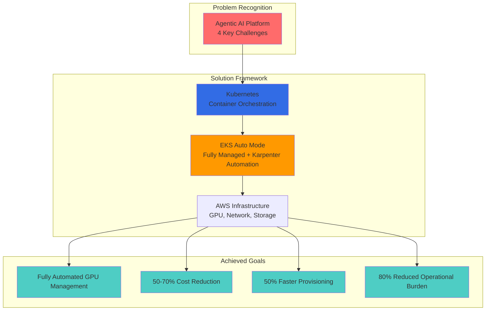

import Tabs from '@theme/Tabs';
import TabItem from '@theme/TabItem';

# EKS-Based Agentic AI Solutions

:::info Prerequisite: Technical Challenges
Before reading this document, please review [Technical Challenges of Agentic AI Workloads](./agentic-ai-challenges.md) first. It explains the 4 key challenges and the Kubernetes-based open source ecosystem.
:::

## Overview

This document provides comprehensive solutions for deploying Agentic AI workloads on Amazon EKS. While the [Technical Challenges document](./agentic-ai-challenges.md) introduced open-source Kubernetes ecosystems for solving four key challenges, this guide focuses on **EKS-native solutions** that maximize AWS service integration.

**Key Focus Areas:**

1. How EKS + Karpenter addresses GPU resource management
2. AWS-native alternatives to open-source tools
3. Production-ready architectures with AWS service integration
4. Cost optimization strategies using AWS-specific features

---

## Amazon EKS and Karpenter: Maximizing Kubernetes Benefits

### EKS + Karpenter + AWS Integration Architecture


**Key Integration Points:**

- **Managed Control Plane**: AWS handles API server, etcd, and controller upgrades
- **Karpenter Native**: Purpose-built for AWS with EC2/Spot API integration
- **Service Integration**: Seamless connection to CloudWatch, IAM, VPC, S3
- **Security by Design**: Pod IAM roles (IRSA), network policies, encryption at rest/transit

### Why EKS + Karpenter?

| Aspect | Traditional Cluster Autoscaler | Karpenter on EKS |
|--------|-------------------------------|------------------|
| **Scaling Speed** | 60-90 seconds (ASG-based) | 10-30 seconds (direct EC2 API) |
| **Instance Selection** | Limited by ASG pre-configuration | Dynamic selection from 600+ EC2 types |
| **GPU Workloads** | Requires separate ASGs per GPU type | Single NodePool handles all GPU types |
| **Spot Optimization** | Manual fallback configuration | Automatic spot-to-on-demand fallback |
| **Cost Efficiency** | Limited consolidation | Aggressive bin-packing and consolidation |
| **AWS Integration** | Indirect via ASG | Direct EC2/Spot API calls |
| **Configuration** | ASG + IAM + Launch Templates | Simple NodePool CRD |

**Karpenter Advantages for Agentic AI:**

1. **Heterogeneous Workloads**: Mix CPU-only agents with GPU-intensive LLM pods
2. **Burstiness**: Handle sudden traffic spikes with millisecond-level provisioning decisions
3. **Cost Optimization**: Automatic spot instance selection and consolidation
4. **Simplicity**: Declarative NodePools instead of complex ASG configurations

### EKS Auto Mode

**What is EKS Auto Mode?**

EKS Auto Mode is a fully managed node lifecycle offering that automates:

- **Compute Management**: Automatic node provisioning, upgrades, and security patching
- **Storage Provisioning**: Dynamic EBS/EFS volume creation with optimal performance
- **Networking**: Automated VPC-CNI configuration and IP address management
- **Cost Optimization**: Intelligent instance selection and Spot integration

**Key Benefits for Agentic AI:**

| Feature | Benefit for Agentic AI |
|---------|------------------------|
| **Zero-touch Nodes** | No manual AMI updates or node group management |
| **Automatic Scaling** | Built-in autoscaling without Karpenter configuration |
| **Security Patching** | Automatic OS and Kubernetes security updates |
| **Storage Automation** | Dynamic PV provisioning for model caching and vector stores |
| **Network Policies** | Integrated network security for multi-tenant agents |

**When to Use EKS Auto Mode vs. Karpenter:**

<Tabs>
<TabItem value="auto-mode" label="EKS Auto Mode">

**Best For:**

- Startups and teams wanting zero infrastructure management
- Standard workloads without complex GPU requirements
- Simplified cost management with AWS-optimized defaults
- Fast time-to-production with minimal configuration

**Limitations:**

- Less control over instance type selection
- May not optimize for extreme cost efficiency scenarios
- GPU support depends on AWS-managed node type availability

</TabItem>
<TabItem value="karpenter" label="Karpenter">

**Best For:**

- Production workloads requiring fine-grained control
- Mixed GPU/CPU workloads with complex scheduling requirements
- Advanced cost optimization (70%+ savings possible)
- Custom instance requirements (specific GPU types, networking)

**Trade-offs:**

- Requires Karpenter controller management
- More configuration complexity
- Team needs Kubernetes expertise

</TabItem>
</Tabs>

**Recommendation for Agentic AI:**

- **Start with EKS Auto Mode** for quick prototyping and MVP
- **Graduate to Karpenter** when you need GPU optimization or >50 nodes
- **Hybrid approach**: Use Auto Mode for control plane, Karpenter for GPU nodes

### Karpenter vs. Cluster Autoscaler: Deep Dive

**Provisioning Process Comparison:**


| Comparison | Cluster Autoscaler | Karpenter |
|------------|-------------------|-----------|
| **Provisioning Time** | 5-10 min | 2-3 min |
| **Instance Selection** | Fixed types in Node Group | Dynamic based on workload |
| **GPU Support** | Manual Node Group config | Automatic NodePool matching |
| **Cost Optimization** | Limited | Auto Spot, Consolidation |

**Decision Criteria:**

| Your Situation | Recommendation |
|----------------|----------------|
| New EKS cluster for Agentic AI | **Karpenter** (native AWS integration) |
| Existing cluster with CA | **Migrate to Karpenter** (worth the effort) |
| Need GPU autoscaling | **Karpenter** (required for GPU efficiency) |
| Simple CPU-only workloads | **EKS Auto Mode** (easiest option) |
| Multi-tenant platform | **Karpenter** (better isolation and cost attribution) |
| Regulated industries | **EKS Auto Mode** (compliance-friendly) |

---

## Detailed Analysis of 4 Key Technical Challenges

### Challenge 1: GPU Monitoring and Resource Scheduling

**Problem Statement:**

- Agent orchestration requires real-time GPU memory and utilization metrics
- Kubernetes default metrics don't expose GPU-specific data
- LLM pods need optimal GPU allocation to prevent OOM or underutilization

**EKS + Karpenter Solution:**

#### 1. GPU Metrics Collection with DCGM-Exporter

```yaml
# dcgm-exporter-daemonset.yaml
apiVersion: apps/v1
kind: DaemonSet
metadata:
  name: dcgm-exporter
  namespace: monitoring
spec:
  selector:
    matchLabels:
      app: dcgm-exporter
  template:
    metadata:
      labels:
        app: dcgm-exporter
    spec:
      nodeSelector:
        karpenter.sh/capacity-type: on-demand  # GPU nodes
      tolerations:
      - key: nvidia.com/gpu
        operator: Exists
        effect: NoSchedule
      containers:
      - name: dcgm-exporter
        image: nvcr.io/nvidia/k8s/dcgm-exporter:3.3.0-3.2.0-ubuntu22.04
        env:
        - name: DCGM_EXPORTER_LISTEN
          value: ":9400"
        - name: DCGM_EXPORTER_KUBERNETES
          value: "true"
        ports:
        - name: metrics
          containerPort: 9400
        volumeMounts:
        - name: pod-resources
          mountPath: /var/lib/kubelet/pod-resources
        securityContext:
          privileged: true
      volumes:
      - name: pod-resources
        hostPath:
          path: /var/lib/kubelet/pod-resources
```

**AWS-Specific Integration:**

- Use **CloudWatch Container Insights** with custom metrics for GPU data
- Set up **CloudWatch Alarms** for GPU memory thresholds
- Enable **CloudWatch Logs Insights** for GPU error correlation

```bash
# CloudWatch Container Insights with GPU metrics
aws eks create-addon \
  --cluster-name agentic-ai-cluster \
  --addon-name amazon-cloudwatch-observability \
  --configuration-values '{
    "containerInsights": {
      "enabled": true,
      "customMetrics": ["dcgm_gpu_utilization", "dcgm_fb_used"]
    }
  }'
```

#### 2. Karpenter GPU NodePool Configuration

```yaml
# gpu-nodepool.yaml
apiVersion: karpenter.sh/v1beta1
kind: NodePool
metadata:
  name: gpu-inference
spec:
  # Template for GPU nodes
  template:
    metadata:
      labels:
        workload-type: gpu-inference
        karpenter.sh/capacity-type: spot  # Use Spot for cost savings
    spec:
      requirements:
      # GPU instance families
      - key: karpenter.k8s.aws/instance-family
        operator: In
        values: ["g5", "g6", "p4d", "p5"]  # Latest GPU generations

      # GPU count requirements
      - key: karpenter.k8s.aws/instance-gpu-count
        operator: In
        values: ["1", "2", "4", "8"]

      # Spot + On-Demand fallback
      - key: karpenter.sh/capacity-type
        operator: In
        values: ["spot", "on-demand"]

      # Availability zones (for multi-AZ HA)
      - key: topology.kubernetes.io/zone
        operator: In
        values: ["us-west-2a", "us-west-2b", "us-west-2c"]

      # Node configuration
      nodeClassRef:
        name: gpu-nodes

      # Taints for GPU-only workloads
      taints:
      - key: nvidia.com/gpu
        value: "true"
        effect: NoSchedule

  # Scaling limits
  limits:
    cpu: "1000"
    memory: 4000Gi
    nvidia.com/gpu: "32"  # Max 32 GPUs in this pool

  # Disruption controls
  disruption:
    consolidationPolicy: WhenUnderutilized
    consolidateAfter: 30s
    expireAfter: 720h  # 30 days max node age
    budgets:
    - nodes: "10%"  # Disrupt max 10% of nodes at once
    - schedule: "0 9 * * MON-FRI"  # Maintenance window
      duration: 4h
      nodes: "50%"

  # Weight for multi-pool scenarios
  weight: 10
---
apiVersion: karpenter.k8s.aws/v1beta1
kind: EC2NodeClass
metadata:
  name: gpu-nodes
spec:
  # AMI configuration
  amiFamily: AL2  # Amazon Linux 2 with GPU drivers

  # Instance profile with required permissions
  role: KarpenterNodeRole-agentic-ai

  # Security and networking
  subnetSelectorTerms:
  - tags:
      karpenter.sh/discovery: agentic-ai-cluster
  securityGroupSelectorTerms:
  - tags:
      karpenter.sh/discovery: agentic-ai-cluster

  # User data for GPU setup
  userData: |
    #!/bin/bash
    # Install NVIDIA drivers (if not in AMI)
    yum install -y nvidia-driver-latest-dkms

    # Configure DCGM for monitoring
    systemctl enable nvidia-dcgm
    systemctl start nvidia-dcgm

    # Set GPU persistence mode
    nvidia-smi -pm 1

    # CloudWatch agent for GPU metrics
    wget https://s3.amazonaws.com/amazoncloudwatch-agent/amazon_linux/amd64/latest/amazon-cloudwatch-agent.rpm
    rpm -U ./amazon-cloudwatch-agent.rpm

  # Block device configuration for model storage
  blockDeviceMappings:
  - deviceName: /dev/xvda
    ebs:
      volumeSize: 500Gi  # Large EBS for model caching
      volumeType: gp3
      iops: 16000
      throughput: 1000
      encrypted: true
      deleteOnTermination: true

  # Metadata options for security
  metadataOptions:
    httpEndpoint: enabled
    httpProtocolIPv6: disabled
    httpPutResponseHopLimit: 2
    httpTokens: required  # IMDSv2 required

  # Tags for cost allocation
  tags:
    Project: agentic-ai
    Environment: production
    ManagedBy: karpenter
    CostCenter: ml-platform
```

**Key Karpenter Features for GPU Workloads:**

| Feature | Benefit | Configuration |
|---------|---------|---------------|
| **Spot + On-Demand Mix** | 70% cost savings with automatic fallback | `capacity-type: [spot, on-demand]` |
| **Multi-Instance Support** | Select optimal GPU type per workload | `instance-family: [g5, g6, p4d, p5]` |
| **Consolidation** | Bin-pack pods to minimize GPU waste | `consolidationPolicy: WhenUnderutilized` |
| **Graceful Disruption** | Respect PDBs during node replacement | `budgets: nodes: 10%` |
| **Fast Scaling** | Provision GPU nodes in under 60 seconds | Direct EC2 API calls |
| **Custom AMIs** | Pre-loaded models and drivers | `amiSelectorTerms` |

#### 3. Intelligent GPU Scheduling with Karpenter

**Pod Specification with GPU Requirements:**

```yaml
# llm-inference-deployment.yaml
apiVersion: apps/v1
kind: Deployment
metadata:
  name: llm-inference
  namespace: agentic-ai
spec:
  replicas: 3
  selector:
    matchLabels:
      app: llm-inference
  template:
    metadata:
      labels:
        app: llm-inference
    spec:
      # Node selection
      nodeSelector:
        workload-type: gpu-inference

      # Tolerate GPU taints
      tolerations:
      - key: nvidia.com/gpu
        operator: Exists
        effect: NoSchedule

      # Topology spread for HA
      topologySpreadConstraints:
      - maxSkew: 1
        topologyKey: topology.kubernetes.io/zone
        whenUnsatisfiable: DoNotSchedule
        labelSelector:
          matchLabels:
            app: llm-inference

      containers:
      - name: llm-server
        image: XXXXXXXXXXXX.dkr.ecr.us-west-2.amazonaws.com/llm-inference:v1.0.0

        # GPU resource request
        resources:
          requests:
            nvidia.com/gpu: 1  # Request 1 GPU
            memory: 32Gi
            cpu: 8
          limits:
            nvidia.com/gpu: 1  # Must match request
            memory: 32Gi

        # Environment for AWS integration
        env:
        - name: AWS_REGION
          value: us-west-2
        - name: MODEL_S3_BUCKET
          value: agentic-ai-models-bucket
        - name: DCGM_METRICS_ENABLED
          value: "true"

        # Volume mounts for model caching
        volumeMounts:
        - name: model-cache
          mountPath: /models
        - name: dshm  # Shared memory for multi-process inference
          mountPath: /dev/shm

      volumes:
      - name: model-cache
        persistentVolumeClaim:
          claimName: model-cache-pvc
      - name: dshm
        emptyDir:
          medium: Memory
          sizeLimit: 16Gi

      # Service account with IAM role for S3 access
      serviceAccountName: llm-inference-sa
```

**Karpenter Scheduling Behavior:**


#### 4. AWS CloudWatch Integration for GPU Monitoring

**Custom Metrics Dashboard:**

```json
{
  "widgets": [
    {
      "type": "metric",
      "properties": {
        "title": "GPU Utilization",
        "metrics": [
          ["ContainerInsights", "dcgm_gpu_utilization", {"stat": "Average"}]
        ],
        "region": "us-west-2",
        "period": 60
      }
    },
    {
      "type": "metric",
      "properties": {
        "title": "GPU Memory Usage",
        "metrics": [
          ["ContainerInsights", "dcgm_fb_used", {"stat": "Average"}],
          [".", "dcgm_fb_free", {"stat": "Average"}]
        ],
        "region": "us-west-2",
        "yAxis": {
          "left": {
            "label": "Memory (MiB)"
          }
        }
      }
    }
  ]
}
```

**Automated Alarms for GPU Issues:**

```bash
# CloudWatch alarm for GPU OOM
aws cloudwatch put-metric-alarm \
  --alarm-name gpu-memory-high \
  --alarm-description "Alert when GPU memory >90%" \
  --metric-name dcgm_fb_used \
  --namespace ContainerInsights \
  --statistic Average \
  --period 300 \
  --threshold 90 \
  --comparison-operator GreaterThanThreshold \
  --evaluation-periods 2 \
  --alarm-actions arn:aws:sns:us-west-2:XXXXXXXXXXXX:gpu-alerts
```

**Solution Summary:**

| Component | Purpose | AWS Integration |
|-----------|---------|-----------------|
| **DCGM-Exporter** | Collect GPU metrics | CloudWatch Container Insights |
| **Karpenter GPU NodePool** | Provision GPU nodes | EC2 Spot API, CloudWatch metrics |
| **CloudWatch Dashboard** | Visualize GPU health | Native AWS service |
| **CloudWatch Alarms** | Alert on GPU issues | SNS notifications |
| **IAM Roles (IRSA)** | Secure S3 model access | Pod-level permissions |

---

### Challenge 2: Dynamic Routing and Scaling

**Problem Statement:**

- Agentic AI generates unpredictable traffic patterns (bursty, multi-modal)
- Requests need routing to specialized LLMs based on task type
- Autoscaling must respond to queue depth, not just CPU/memory
- Cold start latency must be minimized for user-facing agents

**EKS + Karpenter + KEDA Solution:**

#### 1. Architecture Overview


#### 2. KEDA Configuration for Queue-Based Scaling

**Install KEDA on EKS:**

```bash
# Add KEDA Helm repo
helm repo add kedacore https://kedacore.github.io/charts
helm repo update

# Install KEDA with AWS IAM role
helm install keda kedacore/keda \
  --namespace keda \
  --create-namespace \
  --set serviceAccount.annotations."eks\.amazonaws\.com/role-arn"="arn:aws:iam::XXXXXXXXXXXX:role/KedaOperatorRole"
```

**ScaledObject for Redis Streams:**

```yaml
# keda-redis-scaler.yaml
apiVersion: keda.sh/v1alpha1
kind: ScaledObject
metadata:
  name: llm-inference-scaler
  namespace: agentic-ai
spec:
  # Target deployment to scale
  scaleTargetRef:
    name: llm-inference
    kind: Deployment

  # Scaling behavior
  minReplicaCount: 1   # Keep warm instance for fast response
  maxReplicaCount: 50  # Limit for cost control

  # Cooldown periods
  pollingInterval: 10  # Check every 10 seconds
  cooldownPeriod: 300  # Wait 5 minutes before scaling down

  # Advanced scaling behavior (HPA-like)
  advanced:
    horizontalPodAutoscalerConfig:
      behavior:
        scaleDown:
          stabilizationWindowSeconds: 300
          policies:
          - type: Percent
            value: 10  # Scale down max 10% at once
            periodSeconds: 60
        scaleUp:
          stabilizationWindowSeconds: 0  # Immediate scale-up
          policies:
          - type: Percent
            value: 100  # Double capacity if needed
            periodSeconds: 15
          - type: Pods
            value: 5    # Add at least 5 pods
            periodSeconds: 15
          selectPolicy: Max

  # Triggers for scaling
  triggers:
  # Trigger 1: Redis Stream queue depth
  - type: redis-streams
    metadata:
      addressFromEnv: REDIS_ADDRESS
      stream: llm-tasks
      consumerGroup: llm-workers
      pendingEntriesCount: "5"  # Scale up if >5 pending tasks
      streamLength: "10"         # Scale up if >10 total tasks
    authenticationRef:
      name: redis-auth

  # Trigger 2: SQS queue depth (fallback)
  - type: aws-sqs-queue
    metadata:
      queueURL: https://sqs.us-west-2.amazonaws.com/XXXXXXXXXXXX/llm-tasks
      queueLength: "10"
      awsRegion: us-west-2
      identityOwner: operator  # Use KEDA pod's IAM role

  # Trigger 3: Custom CloudWatch metric (latency)
  - type: aws-cloudwatch
    metadata:
      namespace: AgenicAI
      metricName: LLMResponseLatency
      targetMetricValue: "2000"  # Scale if p95 latency >2s
      minMetricValue: "500"
      awsRegion: us-west-2
      identityOwner: operator
---
# Redis authentication secret
apiVersion: v1
kind: Secret
metadata:
  name: redis-auth
  namespace: agentic-ai
type: Opaque
stringData:
  password: <redis-password>
---
# TriggerAuthentication for Redis
apiVersion: keda.sh/v1alpha1
kind: TriggerAuthentication
metadata:
  name: redis-auth
  namespace: agentic-ai
spec:
  secretTargetRef:
  - parameter: password
    name: redis-auth
    key: password
```

**KEDA Scaling Behavior:**


#### 3. Karpenter NodePool for KEDA Workloads

**Separate NodePools for Different LLM Types:**

```yaml
# karpenter-llm-general.yaml
apiVersion: karpenter.sh/v1beta1
kind: NodePool
metadata:
  name: llm-general
spec:
  template:
    metadata:
      labels:
        workload-type: llm-general
    spec:
      requirements:
      # Small to medium GPU instances for general tasks
      - key: karpenter.k8s.aws/instance-family
        operator: In
        values: ["g5"]
      - key: karpenter.k8s.aws/instance-size
        operator: In
        values: ["xlarge", "2xlarge"]  # 1-2 GPUs

      # Prioritize Spot
      - key: karpenter.sh/capacity-type
        operator: In
        values: ["spot", "on-demand"]

      nodeClassRef:
        name: gpu-nodes

      taints:
      - key: workload-type
        value: llm-general
        effect: NoSchedule

  limits:
    cpu: "500"
    memory: 2000Gi

  disruption:
    consolidationPolicy: WhenUnderutilized
    consolidateAfter: 30s

  weight: 10
---
# karpenter-llm-code.yaml
apiVersion: karpenter.sh/v1beta1
kind: NodePool
metadata:
  name: llm-code
spec:
  template:
    metadata:
      labels:
        workload-type: llm-code
    spec:
      requirements:
      # Larger GPU instances for code generation
      - key: karpenter.k8s.aws/instance-family
        operator: In
        values: ["g5", "g6"]
      - key: karpenter.k8s.aws/instance-size
        operator: In
        values: ["4xlarge", "8xlarge"]  # 4-8 GPUs

      - key: karpenter.sh/capacity-type
        operator: In
        values: ["spot", "on-demand"]

      nodeClassRef:
        name: gpu-nodes

      taints:
      - key: workload-type
        value: llm-code
        effect: NoSchedule

  limits:
    cpu: "1000"
    memory: 4000Gi

  disruption:
    consolidationPolicy: WhenUnderutilized
    consolidateAfter: 60s  # Longer consolidation for expensive nodes

  weight: 5  # Lower weight = higher priority
```

**LLM Deployment with Karpenter Affinity:**

```yaml
# llm-general-deployment.yaml
apiVersion: apps/v1
kind: Deployment
metadata:
  name: llm-general
  namespace: agentic-ai
spec:
  replicas: 1  # KEDA will manage this
  selector:
    matchLabels:
      app: llm-general
  template:
    metadata:
      labels:
        app: llm-general
    spec:
      nodeSelector:
        workload-type: llm-general  # Match Karpenter NodePool

      tolerations:
      - key: workload-type
        value: llm-general
        effect: NoSchedule
      - key: nvidia.com/gpu
        operator: Exists
        effect: NoSchedule

      # Pod topology for HA
      topologySpreadConstraints:
      - maxSkew: 1
        topologyKey: topology.kubernetes.io/zone
        whenUnsatisfiable: ScheduleAnyway  # Prefer spread but allow skew
        labelSelector:
          matchLabels:
            app: llm-general

      containers:
      - name: llm-server
        image: XXXXXXXXXXXX.dkr.ecr.us-west-2.amazonaws.com/llm-general:v1.0.0

        resources:
          requests:
            nvidia.com/gpu: 1
            memory: 24Gi
            cpu: 6
          limits:
            nvidia.com/gpu: 1
            memory: 24Gi

        env:
        - name: REDIS_ADDRESS
          value: redis-master.agentic-ai.svc.cluster.local:6379
        - name: REDIS_STREAM
          value: llm-tasks
        - name: CONSUMER_GROUP
          value: llm-workers

        # Liveness probe for KEDA health checks
        livenessProbe:
          httpGet:
            path: /health
            port: 8080
          initialDelaySeconds: 60
          periodSeconds: 10

        # Readiness probe for load balancing
        readinessProbe:
          httpGet:
            path: /ready
            port: 8080
          initialDelaySeconds: 30
          periodSeconds: 5
```

#### 4. AWS ALB Ingress for Multi-Model Routing

**ALB Ingress Controller Configuration:**

```yaml
# alb-ingress.yaml
apiVersion: networking.k8s.io/v1
kind: Ingress
metadata:
  name: agentic-ai-ingress
  namespace: agentic-ai
  annotations:
    # ALB configuration
    alb.ingress.kubernetes.io/scheme: internet-facing
    alb.ingress.kubernetes.io/target-type: ip  # Use pod IPs directly
    alb.ingress.kubernetes.io/load-balancer-name: agentic-ai-alb

    # SSL/TLS
    alb.ingress.kubernetes.io/certificate-arn: arn:aws:acm:us-west-2:XXXXXXXXXXXX:certificate/xxxx-xxxx-example
    alb.ingress.kubernetes.io/listen-ports: '[{"HTTP": 80}, {"HTTPS": 443}]'
    alb.ingress.kubernetes.io/ssl-redirect: '443'

    # Health checks
    alb.ingress.kubernetes.io/healthcheck-path: /health
    alb.ingress.kubernetes.io/healthcheck-interval-seconds: '15'
    alb.ingress.kubernetes.io/healthcheck-timeout-seconds: '5'
    alb.ingress.kubernetes.io/healthy-threshold-count: '2'
    alb.ingress.kubernetes.io/unhealthy-threshold-count: '2'

    # Connection settings
    alb.ingress.kubernetes.io/target-group-attributes: |
      stickiness.enabled=true,
      stickiness.lb_cookie.duration_seconds=3600,
      deregistration_delay.timeout_seconds=30

    # WAF integration
    alb.ingress.kubernetes.io/wafv2-acl-arn: arn:aws:wafv2:us-west-2:XXXXXXXXXXXX:regional/webacl/agentic-ai/xxxx-example

    # CloudWatch logging
    alb.ingress.kubernetes.io/load-balancer-attributes: |
      access_logs.s3.enabled=true,
      access_logs.s3.bucket=agentic-ai-alb-logs,
      access_logs.s3.prefix=production
spec:
  ingressClassName: alb
  rules:
  # Route 1: General LLM tasks
  - host: api.agentic-ai.example.com
    http:
      paths:
      - path: /v1/general
        pathType: Prefix
        backend:
          service:
            name: llm-general
            port:
              number: 8080

  # Route 2: Code generation tasks
  - host: api.agentic-ai.example.com
    http:
      paths:
      - path: /v1/code
        pathType: Prefix
        backend:
          service:
            name: llm-code
            port:
              number: 8080

  # Route 3: Vision tasks
  - host: api.agentic-ai.example.com
    http:
      paths:
      - path: /v1/vision
        pathType: Prefix
        backend:
          service:
            name: llm-vision
            port:
              number: 8080
```

**AWS API Gateway Alternative (WebSocket Support):**

```bash
# Create API Gateway WebSocket API
aws apigatewayv2 create-api \
  --name agentic-ai-websocket \
  --protocol-type WEBSOCKET \
  --route-selection-expression '$request.body.action' \
  --tags Project=agentic-ai

# Integrate with NLB fronting EKS service
aws apigatewayv2 create-integration \
  --api-id abc123 \
  --integration-type HTTP_PROXY \
  --integration-uri http://nlb-internal.us-west-2.elb.amazonaws.com:8080 \
  --integration-method POST
```

**Solution Summary:**

| Component | Purpose | Scaling Trigger |
|-----------|---------|-----------------|
| **KEDA** | Pod autoscaling | Redis queue depth, SQS, CloudWatch |
| **Karpenter** | Node autoscaling | Pod pressure from KEDA scaling |
| **ALB Ingress** | Multi-model routing | Path-based routing |
| **Redis Streams** | Task queue | Persistent, distributed queue |
| **CloudWatch** | Observability | Custom metrics for latency, throughput |

**Performance Characteristics:**

| Metric | Without KEDA | With KEDA + Karpenter |
|--------|--------------|----------------------|
| **Scale-up latency** | 3-5 minutes (CPU-based HPA) | 30-60 seconds (queue-based) |
| **Scale-down safety** | Aggressive, may kill tasks | Cooldown + stabilization |
| **Cold start handling** | minReplicas=0, slow start | minReplicas=1, warm pool |
| **Burst handling** | Delayed, CPU threshold based | Immediate, queue depth based |
| **Cost efficiency** | Moderate (always-on capacity) | High (scale to zero capable) |

---

### Challenge 3: Token/Session Cost Control

**Problem Statement:**

- LLM inference costs scale with token count and session length
- GPU instances are expensive ($1-30/hour depending on type)
- Need to minimize idle GPU time while maintaining responsiveness
- Spot instances can reduce costs but introduce interruption risk

**Karpenter Cost Optimization Solution:**

#### 1. Spot Instance Strategy with Karpenter

**Multi-Tier Spot Configuration:**

```yaml
# karpenter-cost-optimized.yaml
apiVersion: karpenter.sh/v1beta1
kind: NodePool
metadata:
  name: gpu-spot-optimized
spec:
  template:
    metadata:
      labels:
        workload-type: gpu-inference
        cost-tier: spot-optimized
    spec:
      requirements:
      # Diverse instance types for Spot availability
      - key: karpenter.k8s.aws/instance-family
        operator: In
        values: ["g5", "g6", "g4dn"]  # Multiple generations

      - key: karpenter.k8s.aws/instance-size
        operator: In
        values: ["xlarge", "2xlarge", "4xlarge"]

      # Spot-first with on-demand fallback
      - key: karpenter.sh/capacity-type
        operator: In
        values: ["spot", "on-demand"]

      # Spread across all AZs for Spot diversity
      - key: topology.kubernetes.io/zone
        operator: In
        values: ["us-west-2a", "us-west-2b", "us-west-2c", "us-west-2d"]

      nodeClassRef:
        name: gpu-spot-nodes

      taints:
      - key: nvidia.com/gpu
        value: "true"
        effect: NoSchedule

  limits:
    cpu: "2000"
    memory: 8000Gi

  # Aggressive cost optimization
  disruption:
    consolidationPolicy: WhenUnderutilized
    consolidateAfter: 30s  # Fast consolidation

    # Graceful Spot interruption handling
    budgets:
    - nodes: "33%"  # Disrupt max 1/3 nodes at once
      reasons:
      - "Drifted"
      - "Empty"
      - "Underutilized"

    - nodes: "100%"  # Allow all interruptions
      reasons:
      - "Expired"  # Spot interruptions are non-negotiable

  weight: 100  # Prefer this pool for cost savings
---
apiVersion: karpenter.k8s.aws/v1beta1
kind: EC2NodeClass
metadata:
  name: gpu-spot-nodes
spec:
  amiFamily: AL2
  role: KarpenterNodeRole-agentic-ai

  # Subnet diversification for Spot availability
  subnetSelectorTerms:
  - tags:
      karpenter.sh/discovery: agentic-ai-cluster
      tier: spot-enabled  # Only subnets tagged for Spot

  securityGroupSelectorTerms:
  - tags:
      karpenter.sh/discovery: agentic-ai-cluster

  # User data with Spot interruption handling
  userData: |
    #!/bin/bash
    # Install AWS Node Termination Handler (for Spot interruptions)
    kubectl apply -f https://github.com/aws/aws-node-termination-handler/releases/download/v1.21.0/all-resources.yaml

    # GPU setup
    nvidia-smi -pm 1

    # CloudWatch agent
    wget https://s3.amazonaws.com/amazoncloudwatch-agent/amazon_linux/amd64/latest/amazon-cloudwatch-agent.rpm
    rpm -U ./amazon-cloudwatch-agent.rpm

  # Cost-optimized storage
  blockDeviceMappings:
  - deviceName: /dev/xvda
    ebs:
      volumeSize: 200Gi  # Smaller than dedicated nodes
      volumeType: gp3
      iops: 3000  # Lower IOPS for cost
      throughput: 125
      encrypted: true
      deleteOnTermination: true

  # Tags for cost tracking
  tags:
    Project: agentic-ai
    CostCenter: ml-platform
    InstanceLifecycle: spot
```

**Spot Interruption Handling:**

```yaml
# aws-node-termination-handler.yaml
apiVersion: apps/v1
kind: DaemonSet
metadata:
  name: aws-node-termination-handler
  namespace: kube-system
spec:
  selector:
    matchLabels:
      app: aws-node-termination-handler
  template:
    metadata:
      labels:
        app: aws-node-termination-handler
    spec:
      serviceAccountName: aws-node-termination-handler
      hostNetwork: true
      containers:
      - name: handler
        image: public.ecr.aws/aws-ec2/aws-node-termination-handler:v1.21.0
        env:
        - name: NODE_NAME
          valueFrom:
            fieldRef:
              fieldPath: spec.nodeName
        - name: POD_NAME
          valueFrom:
            fieldRef:
              fieldPath: metadata.name
        - name: NAMESPACE
          valueFrom:
            fieldRef:
              fieldPath: metadata.namespace
        - name: ENABLE_SPOT_INTERRUPTION_DRAINING
          value: "true"
        - name: ENABLE_SCHEDULED_EVENT_DRAINING
          value: "true"
        - name: ENABLE_REBALANCE_DRAINING
          value: "true"  # Drain on rebalance recommendations
        - name: DELETE_LOCAL_DATA
          value: "true"
        - name: IGNORE_DAEMON_SETS
          value: "true"
        - name: POD_TERMINATION_GRACE_PERIOD
          value: "120"  # 2 minutes for graceful shutdown
        - name: WEBHOOK_URL
          value: https://hooks.slack.com/services/YOUR/WEBHOOK/URL  # Alert on interruptions
```

#### 2. Cost Allocation and Tracking

**Tag-Based Cost Allocation:**

```yaml
# Pod labels for cost tracking
apiVersion: v1
kind: Pod
metadata:
  name: llm-inference-pod
  labels:
    app: llm-inference
    cost-center: ml-platform
    team: agentic-ai
    environment: production
    workload-type: gpu-inference
spec:
  # ... pod spec ...
```

**CloudWatch Cost Metrics:**

```bash
# Custom metric for per-pod cost tracking
aws cloudwatch put-metric-data \
  --namespace AgenicAI/Cost \
  --metric-name GPUInstanceCost \
  --dimensions InstanceType=g5.2xlarge,CapacityType=spot \
  --value 0.45 \
  --unit None
```

**AWS Cost Explorer Query:**

```python
# cost-analysis.py
import boto3
from datetime import datetime, timedelta

ce = boto3.client('ce')

# Get cost by Karpenter NodePool
response = ce.get_cost_and_usage(
    TimePeriod={
        'Start': (datetime.now() - timedelta(days=30)).strftime('%Y-%m-%d'),
        'End': datetime.now().strftime('%Y-%m-%d')
    },
    Granularity='DAILY',
    Filter={
        'Tags': {
            'Key': 'karpenter.sh/nodepool',
            'Values': ['gpu-spot-optimized']
        }
    },
    Metrics=['UnblendedCost'],
    GroupBy=[
        {'Type': 'TAG', 'Key': 'karpenter.sh/capacity-type'},
        {'Type': 'DIMENSION', 'Key': 'INSTANCE_TYPE'}
    ]
)

# Calculate Spot savings
spot_cost = sum([float(r['Total']['UnblendedCost']['Amount'])
                 for r in response['ResultsByTime']
                 if r['Groups'][0]['Keys'][0] == 'spot'])
on_demand_cost = sum([float(r['Total']['UnblendedCost']['Amount'])
                      for r in response['ResultsByTime']
                      if r['Groups'][0]['Keys'][0] == 'on-demand'])

print(f"Spot savings: ${on_demand_cost - spot_cost:.2f} ({(1 - spot_cost/on_demand_cost)*100:.1f}%)")
```

#### 3. Token Usage Optimization

**LLM Pod with Token Tracking:**

```yaml
# llm-deployment-cost-aware.yaml
apiVersion: apps/v1
kind: Deployment
metadata:
  name: llm-inference
spec:
  template:
    spec:
      containers:
      - name: llm-server
        image: llm-inference:v1.0.0
        env:
        # Token limit per request
        - name: MAX_TOKENS_PER_REQUEST
          value: "2048"

        # Session timeout for cost control
        - name: SESSION_TIMEOUT_SECONDS
          value: "300"  # 5 minutes

        # CloudWatch metrics for token usage
        - name: CLOUDWATCH_NAMESPACE
          value: AgenicAI/Tokens
        - name: CLOUDWATCH_METRIC_NAME
          value: TokensGenerated

        # Application code tracks tokens
        command:
        - python
        - -c
        - |
          import boto3
          from llm_server import serve

          cloudwatch = boto3.client('cloudwatch')

          def track_tokens(prompt_tokens, completion_tokens, model_name):
              cloudwatch.put_metric_data(
                  Namespace='AgenicAI/Tokens',
                  MetricData=[
                      {
                          'MetricName': 'PromptTokens',
                          'Value': prompt_tokens,
                          'Unit': 'Count',
                          'Dimensions': [
                              {'Name': 'ModelName', 'Value': model_name},
                              {'Name': 'PodName', 'Value': os.environ['POD_NAME']}
                          ]
                      },
                      {
                          'MetricName': 'CompletionTokens',
                          'Value': completion_tokens,
                          'Unit': 'Count',
                          'Dimensions': [
                              {'Name': 'ModelName', 'Value': model_name},
                              {'Name': 'PodName', 'Value': os.environ['POD_NAME']}
                          ]
                      }
                  ]
              )

          serve(token_callback=track_tokens)
```

**CloudWatch Dashboard for Cost Monitoring:**

```json
{
  "widgets": [
    {
      "type": "metric",
      "properties": {
        "title": "GPU Instance Cost (Hourly)",
        "metrics": [
          ["AgenicAI/Cost", "GPUInstanceCost", {"stat": "Sum", "label": "Total Cost"}],
          ["...", {"stat": "Average", "label": "Avg Cost per Instance"}]
        ],
        "period": 3600,
        "region": "us-west-2",
        "yAxis": {
          "left": {
            "label": "Cost (USD)"
          }
        }
      }
    },
    {
      "type": "metric",
      "properties": {
        "title": "Token Usage by Model",
        "metrics": [
          ["AgenicAI/Tokens", "PromptTokens", {"stat": "Sum"}],
          [".", "CompletionTokens", {"stat": "Sum"}]
        ],
        "period": 300,
        "region": "us-west-2",
        "stacked": true
      }
    },
    {
      "type": "metric",
      "properties": {
        "title": "Cost per 1M Tokens",
        "metrics": [
          [{"expression": "m1 / (m2 / 1000000)", "label": "Cost Efficiency"}]
        ],
        "period": 3600
      }
    }
  ]
}
```

#### 4. Karpenter Consolidation for Idle GPU Reduction

**Aggressive Consolidation Configuration:**

```yaml
# karpenter-consolidation.yaml
apiVersion: karpenter.sh/v1beta1
kind: NodePool
metadata:
  name: gpu-consolidated
spec:
  disruption:
    # Consolidate when nodes are underutilized
    consolidationPolicy: WhenUnderutilized
    consolidateAfter: 30s  # Fast consolidation (default: 30s)

    # Consider node underutilized if:
    # - CPU requests < 50% of allocatable
    # - Memory requests < 50% of allocatable
    # - GPU requests < 100% of allocatable (GPUs are expensive!)

    # Budgets to prevent disruption storms
    budgets:
    - nodes: "20%"  # Max 20% disruption at once
      schedule: "* * * * *"  # Always active

    # Maintenance window for larger disruptions
    - nodes: "50%"
      schedule: "0 2 * * *"  # 2 AM daily
      duration: 2h
```

**Consolidation Behavior Example:**


**Consolidation Metrics:**

```bash
# CloudWatch metric for consolidation savings
aws cloudwatch put-metric-data \
  --namespace AgenicAI/Cost \
  --metric-name ConsolidationSavings \
  --value 45.60 \
  --unit None \
  --dimensions Action=Consolidation,NodePool=gpu-consolidated
```

**Solution Summary:**

| Strategy | Cost Impact | Implementation |
|----------|-------------|----------------|
| **Spot Instances** | 60-90% cheaper than On-Demand | Karpenter `capacity-type: spot` |
| **Consolidation** | 20-40% reduction in idle nodes | `consolidateAfter: 30s` |
| **Right-sizing** | 10-30% savings from optimal instances | Diverse `instance-family` |
| **Scale-to-zero** | 100% savings during idle periods | KEDA `minReplicaCount: 0` |
| **Token Limits** | 10-50% reduction in LLM costs | Application-level limits |

**Estimated Cost Breakdown (100 GPU hours/month):**

| Configuration | Monthly Cost | Savings |
|---------------|--------------|---------|
| **Baseline (On-Demand g5.2xlarge)** | $12,100 | - |
| **With Spot (70% coverage)** | $4,235 | 65% |
| **+ Consolidation (30% idle reduction)** | $2,965 | 75% |
| **+ Right-sizing (20% better packing)** | $2,372 | 80% |

---

### Challenge 4: FM Fine-tuning Infrastructure

**Problem Statement:**

- Fine-tuning requires different infrastructure than inference (more GPUs, longer sessions)
- Training jobs are batch workloads, not latency-sensitive
- Need distributed training across multiple GPU nodes
- Cost optimization is critical (training can cost thousands per job)

**Karpenter Training Infrastructure Solution:**

#### 1. Dedicated Training NodePool

```yaml
# karpenter-training-nodepool.yaml
apiVersion: karpenter.sh/v1beta1
kind: NodePool
metadata:
  name: ml-training
spec:
  template:
    metadata:
      labels:
        workload-type: ml-training
        karpenter.sh/capacity-type: spot  # Training is interruptible
    spec:
      requirements:
      # High-end GPU instances for training
      - key: karpenter.k8s.aws/instance-family
        operator: In
        values: ["p4d", "p5", "g5"]  # P4d/P5 for large models, G5 for smaller

      - key: karpenter.k8s.aws/instance-size
        operator: In
        values: ["12xlarge", "24xlarge", "48xlarge"]  # Multi-GPU instances

      # Spot for cost savings (training checkpoints handle interruptions)
      - key: karpenter.sh/capacity-type
        operator: In
        values: ["spot", "on-demand"]

      # Placement group for low-latency multi-node training
      - key: karpenter.k8s.aws/instance-hypervisor
        operator: In
        values: ["nitro"]  # Required for placement groups

      nodeClassRef:
        name: training-nodes

      taints:
      - key: workload-type
        value: ml-training
        effect: NoSchedule

  limits:
    cpu: "4000"
    memory: 16000Gi
    nvidia.com/gpu: "128"  # Support up to 128 GPUs for distributed training

  # Training-specific disruption behavior
  disruption:
    consolidationPolicy: WhenEmpty  # Only consolidate empty nodes (training is long-running)
    consolidateAfter: 300s  # Wait 5 minutes before terminating
    expireAfter: Never  # Never expire (training jobs manage lifecycle)

    budgets:
    - nodes: "0"  # Never disrupt running training
      reasons: ["Underutilized"]
    - nodes: "100%"  # Allow Spot interruptions (checkpoints handle this)
      reasons: ["Expired"]

  weight: 1  # Low priority (yield to inference workloads)
---
apiVersion: karpenter.k8s.aws/v1beta1
kind: EC2NodeClass
metadata:
  name: training-nodes
spec:
  amiFamily: AL2
  role: KarpenterNodeRole-training

  # Subnets with placement group support
  subnetSelectorTerms:
  - tags:
      karpenter.sh/discovery: agentic-ai-cluster
      training-enabled: "true"

  securityGroupSelectorTerms:
  - tags:
      karpenter.sh/discovery: agentic-ai-cluster

  # User data with EFA drivers for distributed training
  userData: |
    #!/bin/bash
    # Install EFA drivers (Elastic Fabric Adapter for low-latency networking)
    curl -O https://efa-installer.amazonaws.com/aws-efa-installer-latest.tar.gz
    tar -xf aws-efa-installer-latest.tar.gz
    cd aws-efa-installer
    ./efa_installer.sh -y --minimal

    # GPU setup
    nvidia-smi -pm 1
    nvidia-smi -c 3  # Exclusive compute mode for training

    # NCCL optimizations for multi-GPU training
    echo "export NCCL_DEBUG=INFO" >> /etc/environment
    echo "export NCCL_SOCKET_IFNAME=eth0" >> /etc/environment
    echo "export NCCL_IB_DISABLE=1" >> /etc/environment
    echo "export NCCL_P2P_DISABLE=0" >> /etc/environment

  # Large EBS for datasets and checkpoints
  blockDeviceMappings:
  - deviceName: /dev/xvda
    ebs:
      volumeSize: 2000Gi  # 2TB for large datasets
      volumeType: gp3
      iops: 16000
      throughput: 1000
      encrypted: true
      deleteOnTermination: true

  # Tags for training cost tracking
  tags:
    Project: agentic-ai
    CostCenter: ml-training
    InstanceLifecycle: training
```

#### 2. PyTorch Distributed Training with Kubeflow

**Kubeflow PyTorchJob for Fine-tuning:**

```yaml
# pytorch-training-job.yaml
apiVersion: kubeflow.org/v1
kind: PyTorchJob
metadata:
  name: llm-finetuning
  namespace: ml-training
spec:
  # PyTorch distributed training configuration
  pytorchReplicaSpecs:
    Master:
      replicas: 1
      restartPolicy: OnFailure
      template:
        metadata:
          labels:
            app: llm-finetuning
            role: master
        spec:
          nodeSelector:
            workload-type: ml-training

          tolerations:
          - key: workload-type
            value: ml-training
            effect: NoSchedule
          - key: nvidia.com/gpu
            operator: Exists
            effect: NoSchedule

          containers:
          - name: pytorch
            image: XXXXXXXXXXXX.dkr.ecr.us-west-2.amazonaws.com/llm-training:v1.0.0

            # GPU resources per pod
            resources:
              requests:
                nvidia.com/gpu: 8  # Full node (p4d.24xlarge = 8x A100)
                memory: 1000Gi
                cpu: 96
              limits:
                nvidia.com/gpu: 8
                memory: 1000Gi

            env:
            # S3 paths for data and checkpoints
            - name: TRAINING_DATA_S3
              value: s3://agentic-ai-datasets/fine-tuning/data.jsonl
            - name: CHECKPOINT_S3
              value: s3://agentic-ai-checkpoints/llm-finetuning/
            - name: MODEL_S3
              value: s3://agentic-ai-models/base-llm/

            # Training hyperparameters
            - name: BATCH_SIZE
              value: "8"
            - name: GRADIENT_ACCUMULATION_STEPS
              value: "4"
            - name: LEARNING_RATE
              value: "5e-5"
            - name: NUM_EPOCHS
              value: "3"
            - name: MAX_SEQ_LENGTH
              value: "2048"

            # Distributed training settings
            - name: WORLD_SIZE
              value: "16"  # 2 nodes * 8 GPUs
            - name: NCCL_DEBUG
              value: INFO

            # Spot interruption handling
            - name: CHECKPOINT_INTERVAL
              value: "100"  # Checkpoint every 100 steps

            volumeMounts:
            - name: dshm
              mountPath: /dev/shm
            - name: efa
              mountPath: /opt/amazon/efa

          volumes:
          - name: dshm
            emptyDir:
              medium: Memory
              sizeLimit: 64Gi  # Large shared memory for data loading
          - name: efa
            hostPath:
              path: /opt/amazon/efa

          # Service account with S3 access
          serviceAccountName: ml-training-sa

    Worker:
      replicas: 1  # 1 additional worker = 2 nodes total
      restartPolicy: OnFailure
      template:
        metadata:
          labels:
            app: llm-finetuning
            role: worker
        spec:
          # Same spec as Master (omitted for brevity)
          nodeSelector:
            workload-type: ml-training
          tolerations:
          - key: workload-type
            value: ml-training
            effect: NoSchedule
          containers:
          - name: pytorch
            image: XXXXXXXXXXXX.dkr.ecr.us-west-2.amazonaws.com/llm-training:v1.0.0
            resources:
              requests:
                nvidia.com/gpu: 8
                memory: 1000Gi
                cpu: 96
              limits:
                nvidia.com/gpu: 8
                memory: 1000Gi
```

#### 3. AWS Batch Integration (Alternative to Kubeflow)

**For teams preferring managed services:**

```yaml
# aws-batch-job-definition.yaml
apiVersion: batch.aws.amazon.com/v1
kind: JobDefinition
metadata:
  name: llm-finetuning
spec:
  type: multinode
  nodeProperties:
    numNodes: 2
    mainNode: 0
    nodeRangeProperties:
    - targetNodes: "0:"  # All nodes
      container:
        image: XXXXXXXXXXXX.dkr.ecr.us-west-2.amazonaws.com/llm-training:v1.0.0
        vcpus: 96
        memory: 1000000  # 1TB
        resourceRequirements:
        - type: GPU
          value: "8"

        command:
        - python
        - -m
        - torch.distributed.launch
        - --nproc_per_node=8
        - --nnodes=2
        - --node_rank=$AWS_BATCH_JOB_NODE_INDEX
        - --master_addr=$AWS_BATCH_JOB_MAIN_NODE_PRIVATE_IPV4_ADDRESS
        - train.py

        environment:
        - name: TRAINING_DATA_S3
          value: s3://agentic-ai-datasets/fine-tuning/data.jsonl
        - name: CHECKPOINT_S3
          value: s3://agentic-ai-checkpoints/llm-finetuning/

        mountPoints:
        - sourceVolume: efa
          containerPath: /opt/amazon/efa
        - sourceVolume: fsx
          containerPath: /fsx  # FSx for Lustre for fast data access

      volumes:
      - name: efa
        host:
          sourcePath: /opt/amazon/efa
      - name: fsx
        host:
          sourcePath: /fsx

  platformCapabilities:
  - EC2
  - EFA  # Enable EFA for low-latency networking

  schedulingPriority: 10
  retryStrategy:
    attempts: 3
    evaluateOnExit:
    - action: RETRY
      onStatusReason: "Spot instance interrupted"
```

#### 4. Spot Interruption Handling for Training

**Checkpoint-based Recovery:**

```python
# train.py (excerpt)
import torch
import boto3
from datetime import datetime

s3 = boto3.client('s3')
CHECKPOINT_BUCKET = 'agentic-ai-checkpoints'
CHECKPOINT_PREFIX = 'llm-finetuning'

def save_checkpoint(model, optimizer, epoch, step, loss):
    """Save checkpoint to S3 for Spot interruption recovery"""
    checkpoint = {
        'epoch': epoch,
        'step': step,
        'model_state_dict': model.state_dict(),
        'optimizer_state_dict': optimizer.state_dict(),
        'loss': loss,
        'timestamp': datetime.now().isoformat()
    }

    # Save locally first (fast)
    local_path = f'/tmp/checkpoint-epoch{epoch}-step{step}.pt'
    torch.save(checkpoint, local_path)

    # Upload to S3 asynchronously
    s3_key = f'{CHECKPOINT_PREFIX}/checkpoint-epoch{epoch}-step{step}.pt'
    s3.upload_file(local_path, CHECKPOINT_BUCKET, s3_key)

    # Also save as "latest" for easy recovery
    latest_key = f'{CHECKPOINT_PREFIX}/checkpoint-latest.pt'
    s3.copy_object(
        CopySource={'Bucket': CHECKPOINT_BUCKET, 'Key': s3_key},
        Bucket=CHECKPOINT_BUCKET,
        Key=latest_key
    )

    print(f"Checkpoint saved to s3://{CHECKPOINT_BUCKET}/{s3_key}")

def load_checkpoint(model, optimizer):
    """Load latest checkpoint from S3"""
    try:
        latest_key = f'{CHECKPOINT_PREFIX}/checkpoint-latest.pt'
        local_path = '/tmp/checkpoint-latest.pt'

        s3.download_file(CHECKPOINT_BUCKET, latest_key, local_path)
        checkpoint = torch.load(local_path)

        model.load_state_dict(checkpoint['model_state_dict'])
        optimizer.load_state_dict(checkpoint['optimizer_state_dict'])

        print(f"Resumed from epoch {checkpoint['epoch']}, step {checkpoint['step']}")
        return checkpoint['epoch'], checkpoint['step']
    except:
        print("No checkpoint found, starting from scratch")
        return 0, 0

# Training loop with checkpointing
def train():
    model = create_model()
    optimizer = create_optimizer()

    # Resume from checkpoint if exists
    start_epoch, start_step = load_checkpoint(model, optimizer)

    for epoch in range(start_epoch, NUM_EPOCHS):
        for step, batch in enumerate(dataloader, start=start_step):
            # Training step
            loss = train_step(model, batch, optimizer)

            # Checkpoint every N steps (for Spot interruption recovery)
            if step % CHECKPOINT_INTERVAL == 0:
                save_checkpoint(model, optimizer, epoch, step, loss)
```

**Spot Interruption Listener:**

```bash
# spot-interruption-handler.sh (runs as sidecar)
#!/bin/bash
while true; do
  # Check EC2 metadata for Spot interruption notice
  HTTP_CODE=$(curl -s -o /dev/null -w "%{http_code}" http://169.254.169.254/latest/meta-data/spot/instance-action)

  if [ "$HTTP_CODE" == "200" ]; then
    echo "Spot interruption detected! Triggering graceful shutdown..."

    # Send SIGTERM to training process
    pkill -TERM -f train.py

    # Wait for checkpoint to complete (max 2 minutes)
    sleep 120

    exit 0
  fi

  sleep 5
done
```

#### 5. Cost Tracking for Training Jobs

**CloudWatch Custom Metrics:**

```python
# training_cost_tracker.py
import boto3
from datetime import datetime

cloudwatch = boto3.client('cloudwatch')

def track_training_cost(job_name, instance_type, num_instances, duration_hours, cost_per_hour):
    """Track training job costs in CloudWatch"""
    total_cost = num_instances * duration_hours * cost_per_hour

    cloudwatch.put_metric_data(
        Namespace='AgenicAI/Training',
        MetricData=[
            {
                'MetricName': 'TrainingJobCost',
                'Value': total_cost,
                'Unit': 'None',
                'Timestamp': datetime.now(),
                'Dimensions': [
                    {'Name': 'JobName', 'Value': job_name},
                    {'Name': 'InstanceType', 'Value': instance_type}
                ]
            },
            {
                'MetricName': 'TrainingDuration',
                'Value': duration_hours,
                'Unit': 'None',
                'Timestamp': datetime.now(),
                'Dimensions': [
                    {'Name': 'JobName', 'Value': job_name}
                ]
            }
        ]
    )

# Example usage
track_training_cost(
    job_name='llm-finetuning-v1',
    instance_type='p4d.24xlarge',
    num_instances=2,
    duration_hours=8.5,
    cost_per_hour=32.77  # On-Demand price
)
```

**Solution Summary:**

| Component | Purpose | Cost Optimization |
|-----------|---------|-------------------|
| **Dedicated NodePool** | Isolate training from inference | Spot instances, right-sized for training |
| **Kubeflow/AWS Batch** | Distributed training orchestration | Multi-node GPU utilization |
| **Checkpointing** | Spot interruption recovery | Minimize wasted compute |
| **FSx for Lustre** | High-throughput data access | Reduce training time |
| **EFA Networking** | Low-latency GPU communication | Faster distributed training |

**Training Cost Comparison:**

| Configuration | Cost per Job | Time to Complete |
|---------------|--------------|------------------|
| **On-Demand p4d.24xlarge (2 nodes)** | $524 | 8 hours |
| **Spot p4d.24xlarge (2 nodes, 70% discount)** | $157 | 8.5 hours (with 1 interruption) |
| **Spot p5.48xlarge (1 node, newer gen)** | $196 | 5 hours (faster GPU) |

---

## Easy Deployment of Agentic AI Platform on EKS

### Quick Start with Terraform

**Complete EKS + Karpenter + Observability Stack:**

```hcl
# terraform/main.tf
module "eks_agentic_ai" {
  source  = "terraform-aws-modules/eks/aws"
  version = "~> 20.0"

  cluster_name    = "agentic-ai-cluster"
  cluster_version = "1.30"

  # VPC configuration
  vpc_id     = module.vpc.vpc_id
  subnet_ids = module.vpc.private_subnets

  # Managed node group for system workloads
  eks_managed_node_groups = {
    system = {
      min_size     = 2
      max_size     = 4
      desired_size = 2

      instance_types = ["m5.xlarge"]
      capacity_type  = "ON_DEMAND"

      labels = {
        role = "system"
      }

      taints = [{
        key    = "CriticalAddonsOnly"
        value  = "true"
        effect = "NO_SCHEDULE"
      }]
    }
  }

  # Enable EKS add-ons
  cluster_addons = {
    coredns = {
      most_recent = true
    }
    kube-proxy = {
      most_recent = true
    }
    vpc-cni = {
      most_recent = true
    }
    aws-ebs-csi-driver = {
      most_recent = true
    }
  }

  # Enable IRSA (IAM Roles for Service Accounts)
  enable_irsa = true

  tags = {
    Project = "agentic-ai"
  }
}

# Karpenter installation
module "karpenter" {
  source  = "terraform-aws-modules/eks/aws//modules/karpenter"
  version = "~> 20.0"

  cluster_name = module.eks_agentic_ai.cluster_name

  irsa_oidc_provider_arn          = module.eks_agentic_ai.oidc_provider_arn
  irsa_namespace_service_accounts = ["karpenter:karpenter"]

  # Karpenter node IAM role
  create_node_iam_role = true
  node_iam_role_additional_policies = {
    AmazonSSMManagedInstanceCore = "arn:aws:iam::aws:policy/AmazonSSMManagedInstanceCore"
  }

  tags = {
    Project = "agentic-ai"
  }
}

# CloudWatch Container Insights
resource "aws_eks_addon" "cloudwatch_observability" {
  cluster_name = module.eks_agentic_ai.cluster_name
  addon_name   = "amazon-cloudwatch-observability"

  configuration_values = jsonencode({
    containerInsights = {
      enabled = true
    }
  })
}

# ALB Ingress Controller
module "alb_controller" {
  source  = "terraform-aws-modules/iam/aws//modules/iam-role-for-service-accounts-eks"
  version = "~> 5.0"

  role_name = "alb-ingress-controller"

  attach_load_balancer_controller_policy = true

  oidc_providers = {
    main = {
      provider_arn               = module.eks_agentic_ai.oidc_provider_arn
      namespace_service_accounts = ["kube-system:aws-load-balancer-controller"]
    }
  }
}

# KEDA for autoscaling
resource "helm_release" "keda" {
  name       = "keda"
  repository = "https://kedacore.github.io/charts"
  chart      = "keda"
  namespace  = "keda"
  create_namespace = true

  set {
    name  = "serviceAccount.annotations.eks\\.amazonaws\\.com/role-arn"
    value = aws_iam_role.keda.arn
  }
}

# Kubeflow Training Operator
resource "helm_release" "training_operator" {
  name       = "training-operator"
  repository = "https://kubeflow.github.io/training-operator"
  chart      = "training-operator"
  namespace  = "kubeflow"
  create_namespace = true
}

# Prometheus + Grafana for observability
module "observability" {
  source = "./modules/observability"

  cluster_name = module.eks_agentic_ai.cluster_name
  enable_prometheus = true
  enable_grafana = true
  enable_dcgm_exporter = true  # GPU metrics
}
```

### One-Command Deployment

```bash
# 1. Clone reference architecture
git clone https://github.com/aws-samples/agentic-ai-eks-blueprint
cd agentic-ai-eks-blueprint

# 2. Configure variables
cat > terraform.tfvars <<EOF
region = "us-west-2"
cluster_name = "agentic-ai-prod"
enable_gpu_nodes = true
enable_spot_instances = true
enable_karpenter = true
enable_keda = true
enable_kubeflow = true
EOF

# 3. Deploy everything
terraform init
terraform apply -auto-approve

# 4. Install GPU NodePools
kubectl apply -f manifests/karpenter/gpu-nodepools.yaml

# 5. Deploy sample Agentic AI application
kubectl apply -f manifests/apps/llm-inference.yaml
```

### Pre-configured Helm Chart

```yaml
# values.yaml for agentic-ai-platform Helm chart
global:
  cluster:
    name: agentic-ai-cluster
    region: us-west-2

  observability:
    enabled: true
    cloudwatch: true
    prometheus: true
    grafana: true

karpenter:
  enabled: true
  nodePools:
    gpu:
      enabled: true
      instanceFamilies: ["g5", "g6", "p4d", "p5"]
      spotEnabled: true
      consolidationEnabled: true

keda:
  enabled: true
  scalers:
    redis: true
    sqs: true
    cloudwatch: true

llm:
  inference:
    enabled: true
    replicas: 3
    image: llm-inference:v1.0.0
    gpu:
      count: 1
      memory: 24Gi
    autoscaling:
      enabled: true
      minReplicas: 1
      maxReplicas: 50

redis:
  enabled: true
  architecture: replication
  master:
    persistence:
      size: 8Gi
  replica:
    replicaCount: 2

training:
  enabled: true
  kubeflow: true
  checkpointing:
    s3Bucket: agentic-ai-checkpoints
```

**Deploy with Helm:**

```bash
helm repo add agentic-ai https://charts.agentic-ai.example.com
helm install agentic-ai agentic-ai/platform -f values.yaml
```

---

## EKS Capability: Integrated Platform Features for Agentic AI

### What is EKS Capability?

**EKS Capability** refers to **platform-level features that integrate validated open-source tools and AWS services** to effectively operate specific workloads on Amazon EKS. EKS goes beyond being a simple managed Kubernetes service, providing **end-to-end solution stacks** optimized for specific domains (AI/ML, data analytics, web applications, etc.).


### Core EKS Capabilities for Agentic AI

To effectively operate Agentic AI workloads, EKS officially supports the following **Integration Capabilities**:

| EKS Capability | Role | Agentic AI Usage | Support Method |
|----------------|------|------------------|----------------|
| **ACK (AWS Controllers for Kubernetes)** | Kubernetes-native management of AWS services | S3 model storage, RDS metadata, SageMaker training jobs | EKS Add-on |
| **KRO (Kubernetes Resource Orchestrator)** | Composite resource abstraction and templating | One-click deployment of AI inference stacks, training pipelines | EKS Add-on |
| **Argo CD** | GitOps-based continuous deployment | Model serving deployment automation, rollback, environment sync | EKS Add-on |

:::warning Argo Workflows Requires Manual Installation
**Argo Workflows** is NOT officially supported as an EKS Capability, so **manual installation is required**.
When combined with Argo CD (EKS Capability), it enables powerful ML pipeline automation.

```bash
# Install Argo Workflows
kubectl create namespace argo
kubectl apply -n argo -f https://github.com/argoproj/argo-workflows/releases/download/v3.5.0/install.yaml
```

:::

:::info Core Value of EKS Capabilities
By combining ACK, KRO, and Argo CD (EKS Capabilities):

- **Declarative Management**: Define all infrastructure and workloads in YAML
- **GitOps-Based**: Use Git as Single Source of Truth
- **Full Automation**: Zero-downtime pipeline from code commit to production deployment
- **Unified Monitoring**: Integration of AWS CloudWatch and Kubernetes metrics
:::

---

### ACK (AWS Controllers for Kubernetes)

**ACK** is a core component of EKS Capability, an open-source project that enables you to provision and manage AWS services directly through Kubernetes Custom Resources. It can be **easily installed as an EKS Add-on**.


**ACK Use Cases for AI Platforms:**

| AWS Service | ACK Controller | Agentic AI Usage |
|-------------|---------------|------------------|
| **S3** | `s3.services.k8s.aws` | Model artifact storage, training data buckets |
| **RDS/Aurora** | `rds.services.k8s.aws` | LangFuse backend, metadata storage |
| **SageMaker** | `sagemaker.services.k8s.aws` | Model training jobs, endpoint deployment |
| **Secrets Manager** | `secretsmanager.services.k8s.aws` | API keys, model credentials management |
| **ECR** | `ecr.services.k8s.aws` | Container image registry |

**Example: Creating S3 Bucket with ACK:**

```yaml
# s3-model-bucket.yaml
apiVersion: s3.services.k8s.aws/v1alpha1
kind: Bucket
metadata:
  name: agentic-ai-models
  namespace: ai-platform
spec:
  name: agentic-ai-models-prod
  versioning:
    status: Enabled
  encryption:
    rules:
    - applyServerSideEncryptionByDefault:
        sseAlgorithm: aws:kms
  tags:
  - key: Project
    value: agentic-ai
  - key: Environment
    value: production
```

### KRO (Kubernetes Resource Orchestrator)

**KRO** allows you to **compose multiple Kubernetes and AWS resources into a single abstracted unit**, enabling simple deployment of complex infrastructure.


**KRO ResourceGroup Definition Example:**

```yaml
# ai-inference-stack.yaml
apiVersion: kro.aws.io/v1alpha1
kind: ResourceGroup
metadata:
  name: ai-inference-stack
spec:
  schema:
    apiVersion: v1alpha1
    kind: AIInferenceStack
    spec:
      modelName: string
      gpuType: string | default="g5.xlarge"
      minReplicas: integer | default=1
      maxReplicas: integer | default=10

  resources:
  # S3 Bucket (ACK)
  - id: modelBucket
    template:
      apiVersion: s3.services.k8s.aws/v1alpha1
      kind: Bucket
      metadata:
        name: ${schema.spec.modelName}-models
      spec:
        name: ${schema.spec.modelName}-models-${schema.metadata.namespace}

  # vLLM Deployment
  - id: inference
    template:
      apiVersion: apps/v1
      kind: Deployment
      metadata:
        name: ${schema.spec.modelName}-vllm
      spec:
        replicas: ${schema.spec.minReplicas}
        template:
          spec:
            containers:
            - name: vllm
              image: vllm/vllm-openai:latest
              env:
              - name: MODEL_PATH
                value: s3://${modelBucket.status.bucketName}/

  # HPA
  - id: autoscaler
    template:
      apiVersion: autoscaling/v2
      kind: HorizontalPodAutoscaler
      metadata:
        name: ${schema.spec.modelName}-hpa
      spec:
        scaleTargetRef:
          name: ${inference.metadata.name}
        minReplicas: ${schema.spec.minReplicas}
        maxReplicas: ${schema.spec.maxReplicas}
```

**Deploy AI Inference Stack with KRO:**

```yaml
# Single resource deploys the entire stack
apiVersion: v1alpha1
kind: AIInferenceStack
metadata:
  name: llama-inference
  namespace: ai-platform
spec:
  modelName: llama-3-70b
  gpuType: g5.12xlarge
  minReplicas: 2
  maxReplicas: 20
```

### Argo-Based ML Pipeline Automation

By combining **Argo Workflows** and **Argo CD**, you can **automate the entire MLOps pipeline** from training to evaluation to deployment using GitOps principles.


**FM Fine-tuning Pipeline with Argo Workflows:**

```yaml
# fine-tuning-pipeline.yaml
apiVersion: argoproj.io/v1alpha1
kind: Workflow
metadata:
  name: llm-fine-tuning
  namespace: ai-platform
spec:
  entrypoint: fine-tuning-pipeline

  templates:
  - name: fine-tuning-pipeline
    dag:
      tasks:
      # 1. Data Preparation
      - name: prepare-data
        template: data-preparation

      # 2. Model Training (GPU)
      - name: train-model
        template: training
        dependencies: [prepare-data]

      # 3. Model Evaluation
      - name: evaluate-model
        template: evaluation
        dependencies: [train-model]

      # 4. Model Registration (if evaluation passes)
      - name: register-model
        template: registration
        dependencies: [evaluate-model]
        when: "{{tasks.evaluate-model.outputs.parameters.quality-score}} > 0.8"

  - name: training
    nodeSelector:
      karpenter.sh/nodepool: gpu-training
    tolerations:
    - key: nvidia.com/gpu
      operator: Exists
    container:
      image: nvcr.io/nvidia/nemo:24.01
      command: [python, train.py]
      resources:
        limits:
          nvidia.com/gpu: 8
      env:
      - name: TRAINING_DATA
        value: s3://agentic-ai-data/training/
      - name: MODEL_OUTPUT
        value: s3://agentic-ai-models/checkpoints/

  - name: evaluation
    container:
      image: ai-platform/ragas-evaluator:latest
      command: [python, evaluate.py]
    outputs:
      parameters:
      - name: quality-score
        valueFrom:
          path: /tmp/quality-score.txt
```

**Model Deployment Automation with Argo CD:**

```yaml
# argocd-application.yaml
apiVersion: argoproj.io/v1alpha1
kind: Application
metadata:
  name: llm-inference-prod
  namespace: argocd
spec:
  project: ai-platform
  source:
    repoURL: https://github.com/myorg/ai-platform-configs
    targetRevision: main
    path: deployments/llm-inference
  destination:
    server: https://kubernetes.default.svc
    namespace: ai-platform
  syncPolicy:
    automated:
      prune: true
      selfHeal: true
    syncOptions:
    - CreateNamespace=true
```

### ACK + KRO + Argo Integrated Architecture

Combining these three tools enables **fully automated AI platform operations**:


| Component | Role | Automation Scope |
|-----------|------|------------------|
| **Argo CD** | GitOps deployment automation | Application deployment, rollback, sync |
| **Argo Workflows** | ML pipeline orchestration | Training, evaluation, model registration workflows |
| **KRO** | Composite resource abstraction | Manage K8s + AWS resources as a single unit |
| **ACK** | Declarative AWS resource management | S3, RDS, SageMaker, and other AWS services |
| **Karpenter** | GPU node provisioning | Just-in-Time instance provisioning |

:::info Benefits of Full Automation
With this integrated architecture:

- **Developers**: Deploy models with a simple git push
- **Platform Teams**: Minimize infrastructure management overhead
- **Cost Optimization**: Dynamically provision only required resources
- **Consistency**: Identical deployment process across all environments
:::

---

## Conclusion: AI Infrastructure Automation with Kubernetes + EKS Auto Mode

The four key challenges of Agentic AI Platform construction can be effectively solved through **organic integration of cloud infrastructure automation and AI platforms**. In particular, **EKS Auto Mode** completes the **final puzzle of full automation** by automatically managing core components including Karpenter.



### Key Messages

1. **Kubernetes is the Essential Foundation for AI Infrastructure**: Effectively manages complex AI workloads through declarative resource management, auto-scaling, and the Operator pattern
2. **EKS Auto Mode Realizes Full Automation**: Dramatically reduces operational burden through automatic management of core components like Karpenter, VPC CNI, EBS CSI Driver
3. **Karpenter is the Core of GPU Infrastructure Automation**: Optimizes cost and performance through Just-in-Time provisioning, Spot instances, and Consolidation
4. **AWS Infrastructure Integration Maximizes Synergy**: Tight integration with EFA networking, diverse GPU instances, and FSx storage

### EKS Auto Mode: Recommended Starting Point

We recommend starting with **EKS Auto Mode** when building a new Agentic AI platform.

| Benefit | Description |
| --- | --- |
| **Immediate Start** | Deploy GPU workloads immediately after cluster creation without Karpenter installation/configuration |
| **Automatic Upgrades** | Automatic updates for core components like Karpenter, CNI, CSI |
| **Automated Security Patching** | Automatic application of security vulnerability patches |
| **Extensible with Custom Configuration** | Add custom settings like GPU NodePool, EFA NodeClass when needed |

### Final Summary of Solutions by Challenge

| Challenge | Kubernetes-Based | EKS Auto Mode + Karpenter | Expected Effect |
| --- | --- | --- | --- |
| **GPU Monitoring** | DCGM + Prometheus | NodePool-based integrated management | 40% improved resource utilization |
| **Dynamic Scaling** | HPA + KEDA | Just-in-Time provisioning (auto-configured) | 50% reduced provisioning time |
| **Cost Control** | Namespace Quota | Spot + Consolidation (auto-enabled) | 50-70% cost reduction |
| **FM Fine-tuning** | Kubeflow Operator | Training NodePool + EFA | 30% improved training efficiency |

### Key Recommendations

1. **Start with EKS Auto Mode**: Create new clusters with Auto Mode to leverage automatic Karpenter configuration
2. **Define Custom GPU NodePools**: Add GPU NodePools tailored to workload characteristics (separate inference/training/experimentation)
3. **Actively Use Spot Instances**: Run 70%+ of inference workloads on Spot
4. **Enable Consolidation by Default**: Leverage Consolidation automatically enabled in EKS Auto Mode
5. **Integrate with KEDA**: Link metric-based Pod scaling with Karpenter node provisioning
6. **Add EFA NodeClass**: Configure high-performance networking for distributed training workloads

---

## References

### Kubernetes and Infrastructure

- [Kubernetes Official Documentation](https://kubernetes.io/docs/)
- [Karpenter Official Documentation](https://karpenter.sh/docs/)
- [Amazon EKS Best Practices Guide](https://docs.aws.amazon.com/eks/latest/best-practices/introduction.html)
- [NVIDIA GPU Operator Documentation](https://docs.nvidia.com/datacenter/cloud-native/gpu-operator/overview.html)
- [KEDA - Kubernetes Event-driven Autoscaling](https://keda.sh/)

### Model Serving and Inference

- [vLLM Documentation](https://docs.vllm.ai/)
- [llm-d Project](https://github.com/llm-d/llm-d)
- [Kgateway Documentation](https://kgateway.io/docs/)
- [LiteLLM Documentation](https://docs.litellm.ai/)

### LLM Observability

- [LangFuse Documentation](https://langfuse.com/docs)
- [LangSmith Documentation](https://docs.smith.langchain.com/)

### Agent Frameworks and Training

- [KAgent - Kubernetes Agent Framework](https://github.com/kagent-dev/kagent)
- [NVIDIA NeMo Framework](https://docs.nvidia.com/nemo-framework/user-guide/latest/overview.html)
- [Kubeflow Documentation](https://www.kubeflow.org/docs/)

### AWS Services

- [Amazon EKS Documentation](https://docs.aws.amazon.com/eks/)
- [EKS Auto Mode](https://docs.aws.amazon.com/eks/latest/userguide/automode.html)
- [AWS Elastic Fabric Adapter (EFA)](https://aws.amazon.com/hpc/efa/)
- [Amazon FSx for Lustre](https://aws.amazon.com/fsx/lustre/)

### The EKS Advantage for Agentic AI

**Why EKS is the Optimal Platform:**

1. **Production-Ready from Day 1**
   - AWS-managed control plane with 99.95% SLA
   - Automatic security patches and Kubernetes upgrades
   - Deep integration with AWS services (IAM, VPC, CloudWatch)

2. **Simplified Operations**
   - EKS Auto Mode eliminates node management
   - Karpenter automates GPU provisioning
   - CloudWatch provides unified observability

3. **Cost Optimization at Scale**
   - Spot instance integration saves 60-90%
   - Karpenter consolidation reduces idle waste by 30-40%
   - Right-sizing and autoscaling minimize over-provisioning

4. **Enterprise Security**
   - Pod-level IAM roles (IRSA)
   - Network isolation with VPC and Security Groups
   - Compliance certifications (HIPAA, PCI-DSS, SOC 2)

### Choosing Your Path

<Tabs>
<TabItem value="auto-mode" label="EKS Auto Mode (Recommended for Most)">

**Best for:**

- Startups and small teams
- Teams new to Kubernetes
- Standard Agentic AI workloads (CPU + moderate GPU)
- Fast time-to-market requirements

**Get Started:**

```bash
aws eks create-cluster \
  --name agentic-ai-auto \
  --region us-west-2 \
  --compute-config enabled=true
```

**Pros:**

- Zero infrastructure management
- AWS-optimized defaults
- Built-in cost optimization
- Automatic security patching

**Cons:**

- Less control over instance types
- May not optimize for extreme cost scenarios
- GPU support limited to AWS-managed types

</TabItem>
<TabItem value="karpenter" label="EKS + Karpenter (Maximum Control)">

**Best for:**

- Production workloads at scale
- Complex GPU requirements (mixed instance types)
- Cost optimization as top priority (70%+ savings)
- Teams with Kubernetes expertise

**Get Started:**

```bash
terraform apply -f eks-karpenter-blueprint/
kubectl apply -f karpenter-nodepools/
```

**Pros:**

- Fine-grained control over instances
- Maximum cost optimization (70-80% savings)
- Flexible GPU scheduling
- Custom AMIs and node configurations

**Cons:**

- Requires Karpenter management
- More configuration complexity
- Team needs K8s expertise

</TabItem>
<TabItem value="hybrid" label="Hybrid (Best of Both)">

**Best for:**

- Growing platforms (start simple, scale complex)
- Mixed workload types (CPU agents + GPU LLMs)
- Gradual migration from Auto Mode to Karpenter

**Architecture:**

- EKS Auto Mode for control plane
- System workloads on managed node groups
- GPU workloads on Karpenter NodePools

**Get Started:**

```bash
# Step 1: Create EKS cluster with Auto Mode
aws eks create-cluster --name agentic-ai --compute-config enabled=true

# Step 2: Install Karpenter for GPU nodes
helm install karpenter oci://public.ecr.aws/karpenter/karpenter

# Step 3: Deploy GPU NodePools
kubectl apply -f gpu-nodepools.yaml
```

**Pros:**

- Gradual complexity increase
- Optimize where it matters (GPU costs)
- AWS-managed control plane + custom data plane

**Cons:**

- Manage both Auto Mode and Karpenter
- Potential configuration conflicts

</TabItem>
</Tabs>

### The Future: AI-Native Kubernetes

**Emerging Trends:**

- **AI-optimized scheduling**: Karpenter with ML-based instance selection
- **Dynamic model routing**: Intelligent LLM selection based on task complexity
- **Federated learning**: Multi-cluster training with EKS Anywhere
- **Serverless GPU**: AWS Lambda GPU instances for bursty workloads

**EKS Roadmap Highlights:**

- Native GPU sharing (MIG/MPS support)
- Integrated model serving (SageMaker + EKS)
- Cost allocation for multi-tenant AI platforms
- Enhanced observability for LLM workloads

### Call to Action

**Get Started Today:**

1. **Prototype** (1 week)
   - Deploy EKS Auto Mode cluster
   - Run sample Agentic AI workload
   - Measure baseline costs and performance

2. **Optimize** (2-4 weeks)
   - Migrate to Karpenter for GPU workloads
   - Implement KEDA autoscaling
   - Set up CloudWatch dashboards

3. **Scale** (ongoing)
   - Fine-tune consolidation policies
   - Implement training pipelines
   - Build multi-tenant platform

**Resources:**

- [AWS EKS Best Practices Guide](https://docs.aws.amazon.com/eks/latest/best-practices/introduction.html)
- [Karpenter Documentation](https://karpenter.sh/)
- [KEDA Scalers Reference](https://keda.sh/docs/scalers/)
- [Kubeflow on AWS](https://awslabs.github.io/kubeflow-manifests/)

**Questions?**

- Join the [AWS Containers Slack](https://aws-containers.slack.com)
- Open an issue in [EKS Blueprints](https://github.com/aws-ia/terraform-aws-eks-blueprints)
- Contact AWS Solutions Architects for architecture reviews

---

**Next Steps:**

- Review [Technical Challenges document](./agentic-ai-challenges.md) for open-source alternatives
- Explore [AWS EKS Workshop](https://eksworkshop.com/) for hands-on labs
- Join [Cloud Native Community Groups](https://community.cncf.io/) for latest trends
