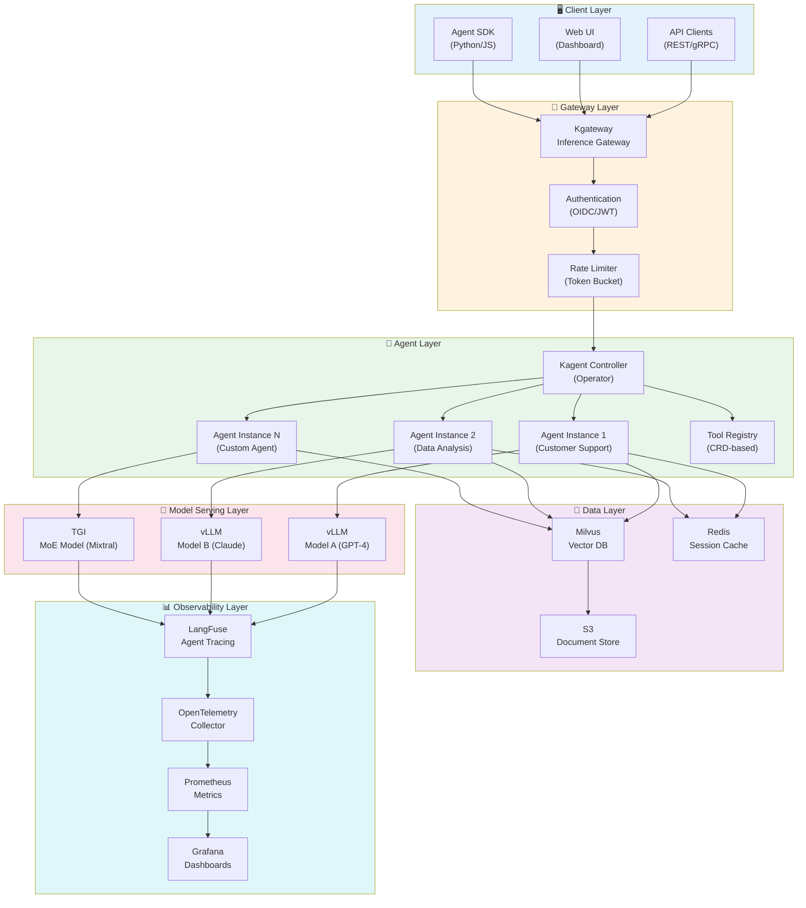
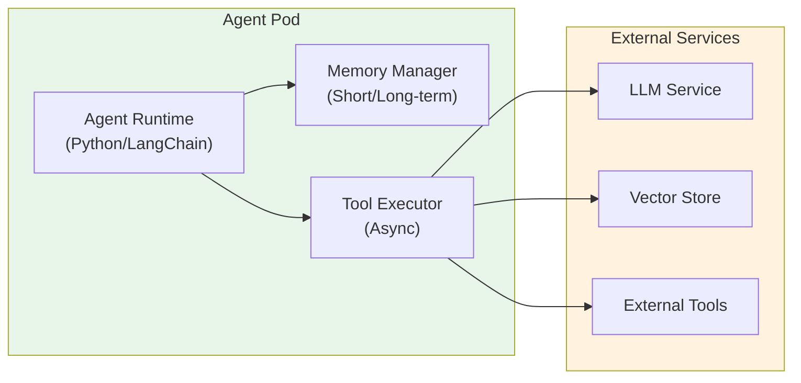
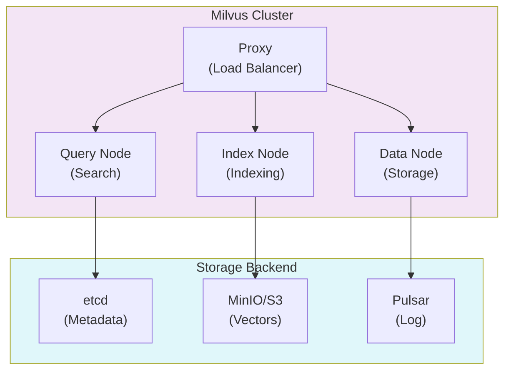
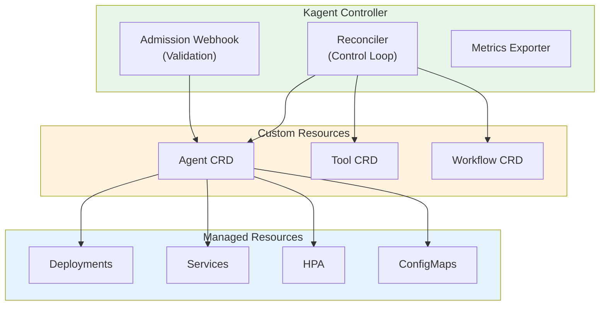
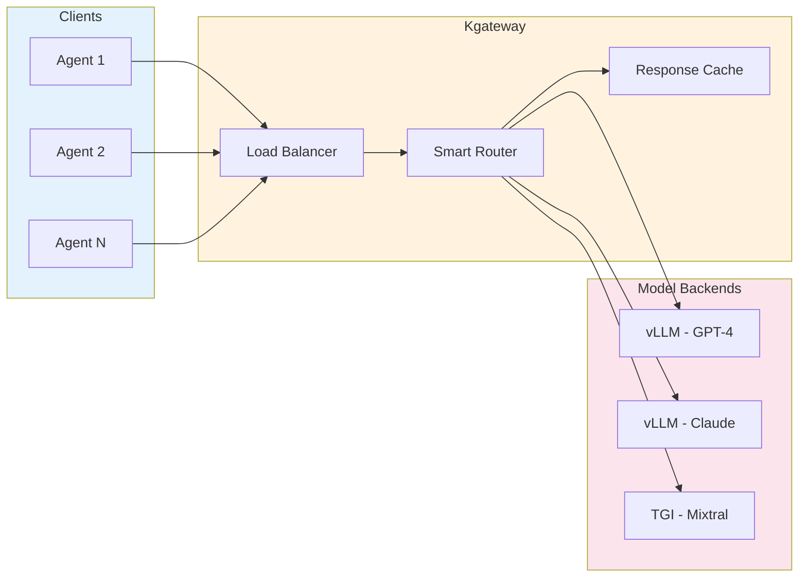
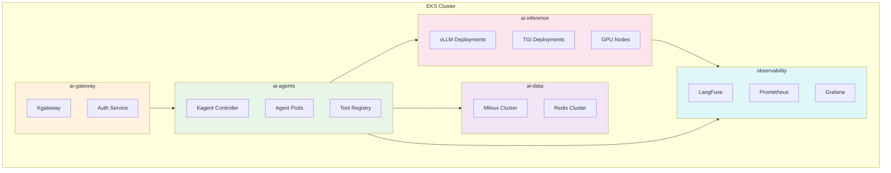
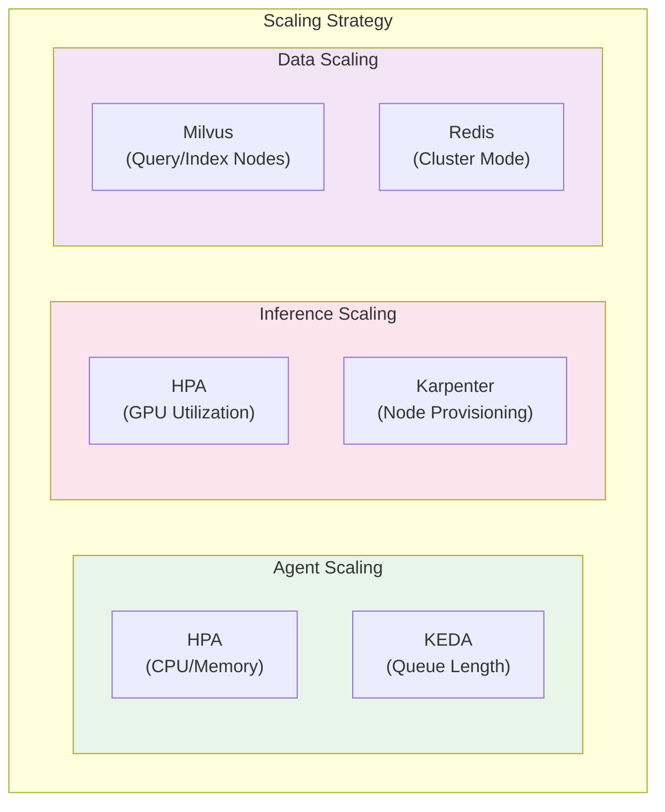
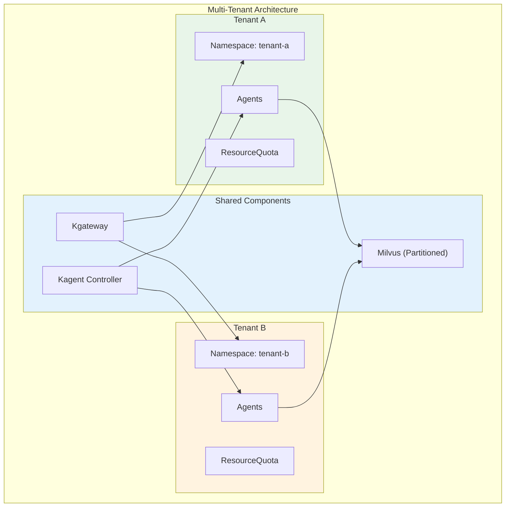
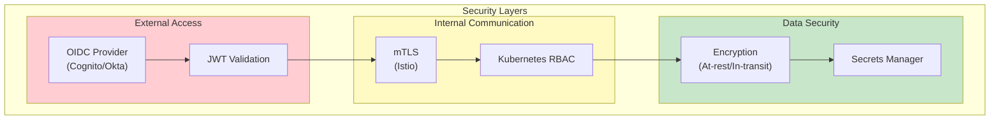
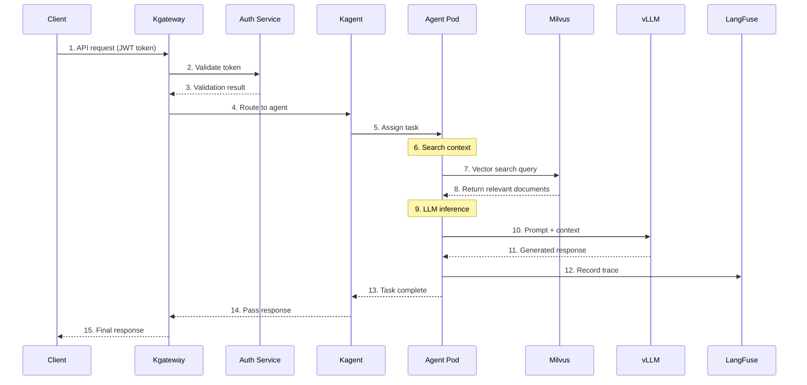

import { CoreCapabilities, LayerRoles, ToolTypes, K8sFeatures, RoutingStrategies, TenantIsolation, RequestProcessing, TechnologyStack } from '@site/src/components/ArchitectureTables';

# Agentic AI Platform Architecture

> 📅 **Date**: 2025-02-05 | ⏱️ **Reading Time**: ~15 minutes

This document covers the complete system architecture and key component design of a production-grade Agentic AI Platform based on Amazon EKS. It presents a platform architecture to efficiently build and operate autonomous AI agents that can perform complex tasks.

## Overview

Agentic AI Platform is an integrated platform that enables autonomous AI agents to perform complex tasks. It provides stable and scalable GenAI services by integrating the latest AI/ML technology, container orchestration, and cloud-native architecture.

### Problem Statement

Challenges in existing GenAI service implementation:

- **Complexity of AI Model Serving**: Difficulty in deploying and managing resources for various models
- **Lack of Integration**: Absence of integration of various ML frameworks and tools
- **Scaling Issues**: Difficulty in performance optimization and auto-scaling
- **MLOps Automation**: Absence of deployment pipeline and automation
- **Cost Efficiency**: Lack of resource utilization optimization strategies

This guide presents practical strategies to systematically address these challenges.

### Core Capabilities

<CoreCapabilities />

:::info Target Audience
This document is intended for solution architects, platform engineers, and DevOps engineers. Basic understanding of Kubernetes and AI/ML workloads is required.
:::

## Complete System Architecture

Agentic AI Platform consists of 6 major layers. Each layer has clear responsibilities and enables independent scaling and operation through loose coupling.



### Role by Layer

<LayerRoles />

## Core Components

### Agent Runtime Layer

The Agent Runtime Layer provides the environment where AI agents run. Each agent runs as an independent Pod managed by Kagent Controller.



#### Key Features

- **State Management**: Maintain agent conversation context and task state
- **Tool Execution**: Execute registered tools asynchronously
- **Memory Management**: Maintain context through short/long-term memory
- **Error Recovery**: Automatic retry and fallback for failed tasks

### Tool Registry

Tool Registry centrally manages tools available to agents. Tools are defined declaratively through Kubernetes CRD (Custom Resource Definition).

```yaml
apiVersion: kagent.dev/v1alpha1
kind: Tool
metadata:
  name: web-search
  namespace: ai-agents
spec:
  type: api
  description: "Perform web search to retrieve latest information"
  config:
    endpoint: http://search-service/api/search
    method: POST
    timeout: 30s
  parameters:
    - name: query
      type: string
      required: true
      description: "Search query"
    - name: max_results
      type: integer
      default: 10
      description: "Maximum number of results"
  authentication:
    type: bearer
    secretRef:
      name: search-api-token
      key: token
```

#### Tool Types

<ToolTypes />

### Memory Store (Milvus)

Milvus serves as the vector store, which is critical for RAG systems. Agents search for related documents through Milvus and augment context.



#### Collection Design Example

```python
from pymilvus import Collection, FieldSchema, CollectionSchema, DataType

# Define collection schema
fields = [
    FieldSchema(name="id", dtype=DataType.VARCHAR, max_length=64, is_primary=True),
    FieldSchema(name="content", dtype=DataType.VARCHAR, max_length=65535),
    FieldSchema(name="embedding", dtype=DataType.FLOAT_VECTOR, dim=1536),
    FieldSchema(name="metadata", dtype=DataType.JSON),
    FieldSchema(name="tenant_id", dtype=DataType.VARCHAR, max_length=64),
]

schema = CollectionSchema(fields, description="Knowledge base for agents")
collection = Collection(name="agent_knowledge", schema=schema)

# Create HNSW index (high-performance search)
index_params = {
    "metric_type": "COSINE",
    "index_type": "HNSW",
    "params": {"M": 16, "efConstruction": 256}
}
collection.create_index(field_name="embedding", index_params=index_params)
```

### Orchestrator (Kagent)

Kagent manages the complete lifecycle of AI agents using the Kubernetes Operator pattern.



#### Agent CRD Example

```yaml
apiVersion: kagent.dev/v1alpha1
kind: Agent
metadata:
  name: customer-support-agent
  namespace: ai-agents
spec:
  # Model configuration
  model:
    provider: openai
    name: gpt-4-turbo
    temperature: 0.7
    maxTokens: 4096

  # System prompt
  systemPrompt: |
    You are a friendly and professional customer support agent.
    Always provide accurate information, and honestly admit when you don't know something.

  # Tools to use
  tools:
    - name: search-knowledge-base
      type: retrieval
      config:
        vectorStore: milvus
        collection: support-docs
        topK: 5
    - name: create-ticket
      type: api
      config:
        endpoint: http://ticketing-service/api/tickets
        method: POST

  # Memory configuration
  memory:
    type: redis
    config:
      host: redis-master.ai-data.svc.cluster.local
      port: 6379
      ttl: 3600
      maxHistory: 50

  # Scaling configuration
  scaling:
    minReplicas: 2
    maxReplicas: 10
    targetCPUUtilization: 70
    targetMemoryUtilization: 80

  # Resource limits
  resources:
    requests:
      memory: "512Mi"
      cpu: "250m"
    limits:
      memory: "1Gi"
      cpu: "500m"
```

### Inference Gateway (Kgateway)

Kgateway intelligently routes AI model inference requests based on the Kubernetes Gateway API.



#### HTTPRoute Configuration Example

```yaml
apiVersion: gateway.networking.k8s.io/v1
kind: HTTPRoute
metadata:
  name: inference-routing
  namespace: ai-gateway
spec:
  parentRefs:
    - name: ai-gateway
      namespace: ai-gateway
  rules:
    # GPT-4 model routing (weight-based)
    - matches:
        - path:
            type: PathPrefix
            value: /v1/chat/completions
          headers:
            - name: x-model-id
              value: "gpt-4"
      backendRefs:
        - name: vllm-gpt4-primary
          port: 8000
          weight: 80
        - name: vllm-gpt4-canary
          port: 8000
          weight: 20

    # Claude model routing
    - matches:
        - path:
            type: PathPrefix
            value: /v1/chat/completions
          headers:
            - name: x-model-id
              value: "claude-3"
      backendRefs:
        - name: vllm-claude3
          port: 8000

    # MoE model routing (for complex tasks)
    - matches:
        - path:
            type: PathPrefix
            value: /v1/chat/completions
          headers:
            - name: x-model-id
              value: "mixtral-8x7b"
      backendRefs:
        - name: tgi-mixtral
          port: 8080
```

#### Routing Strategies

<RoutingStrategies />

## Kubernetes Deployment Architecture

### Namespace Organization Strategy

Agentic AI Platform separates namespaces by function for separation of concerns and security.



#### Namespace Configuration

```yaml
# ai-gateway namespace
apiVersion: v1
kind: Namespace
metadata:
  name: ai-gateway
  labels:
    istio-injection: enabled
    pod-security.kubernetes.io/enforce: restricted
---
# ai-agents namespace
apiVersion: v1
kind: Namespace
metadata:
  name: ai-agents
  labels:
    istio-injection: enabled
    pod-security.kubernetes.io/enforce: baseline
---
# ai-inference namespace (GPU workloads)
apiVersion: v1
kind: Namespace
metadata:
  name: ai-inference
  labels:
    pod-security.kubernetes.io/enforce: privileged
  annotations:
    scheduler.alpha.kubernetes.io/defaultTolerations: '[{"key":"nvidia.com/gpu","operator":"Exists"}]'
---
# ai-data namespace
apiVersion: v1
kind: Namespace
metadata:
  name: ai-data
  labels:
    pod-security.kubernetes.io/enforce: baseline
---
# observability namespace
apiVersion: v1
kind: Namespace
metadata:
  name: observability
  labels:
    pod-security.kubernetes.io/enforce: baseline
```

### Resource Allocation Strategy

Set ResourceQuota on each namespace to limit resource usage and ensure fair distribution.

```yaml
apiVersion: v1
kind: ResourceQuota
metadata:
  name: ai-inference-quota
  namespace: ai-inference
spec:
  hard:
    requests.cpu: "100"
    requests.memory: "500Gi"
    limits.cpu: "200"
    limits.memory: "1Ti"
    requests.nvidia.com/gpu: "32"
    persistentvolumeclaims: "50"
---
apiVersion: v1
kind: ResourceQuota
metadata:
  name: ai-agents-quota
  namespace: ai-agents
spec:
  hard:
    requests.cpu: "50"
    requests.memory: "100Gi"
    limits.cpu: "100"
    limits.memory: "200Gi"
    pods: "200"
```

:::warning Resource Planning
GPU resources are expensive and require careful planning. Start conservatively initially and adjust gradually through monitoring.
:::

## Scalability Design

### Horizontal Scaling Strategy

Each component of Agentic AI Platform can scale horizontally independently.



#### Agent Auto-Scaling (KEDA)

```yaml
apiVersion: keda.sh/v1alpha1
kind: ScaledObject
metadata:
  name: agent-scaler
  namespace: ai-agents
spec:
  scaleTargetRef:
    name: customer-support-agent
  minReplicaCount: 2
  maxReplicaCount: 20
  pollingInterval: 15
  cooldownPeriod: 300
  triggers:
    # Scale based on Redis queue length
    - type: redis
      metadata:
        address: redis-master.ai-data.svc:6379
        listName: agent-task-queue
        listLength: "10"
    # Scale based on Prometheus metrics
    - type: prometheus
      metadata:
        serverAddress: http://prometheus.observability.svc:9090
        metricName: agent_active_sessions
        threshold: "50"
        query: |
          sum(agent_active_sessions{agent="customer-support"})
```

#### GPU Node Auto-Provisioning (Karpenter)

```yaml
apiVersion: karpenter.sh/v1
kind: NodePool
metadata:
  name: gpu-inference-pool
spec:
  template:
    spec:
      requirements:
        - key: "node.kubernetes.io/instance-type"
          operator: In
          values:
            - "p4d.24xlarge"   # 8x A100 40GB
            - "p5.48xlarge"   # 8x H100 80GB
            - "g5.48xlarge"   # 8x A10G 24GB
        - key: "karpenter.sh/capacity-type"
          operator: In
          values: ["on-demand", "spot"]
        - key: "kubernetes.io/arch"
          operator: In
          values: ["amd64"]
      nodeClassRef:
        group: karpenter.k8s.aws
        kind: EC2NodeClass
        name: gpu-nodeclass
  limits:
    nvidia.com/gpu: 64
  disruption:
    consolidationPolicy: WhenEmptyOrUnderutilized
    consolidateAfter: 30s
    budgets:
      - nodes: "20%"
---
apiVersion: karpenter.k8s.aws/v1
kind: EC2NodeClass
metadata:
  name: gpu-nodeclass
spec:
  amiFamily: AL2
  subnetSelectorTerms:
    - tags:
        karpenter.sh/discovery: "ai-cluster"
  securityGroupSelectorTerms:
    - tags:
        karpenter.sh/discovery: "ai-cluster"
  blockDeviceMappings:
    - deviceName: /dev/xvda
      ebs:
        volumeSize: 500Gi
        volumeType: gp3
        iops: 10000
        throughput: 500
  tags:
    Environment: production
    Workload: ai-inference
```

### Multi-Tenant Support

Agentic AI Platform supports multi-tenancy, enabling multiple teams or projects to share the same platform.



#### Tenant Isolation Strategy

<TenantIsolation />

#### Resource Allocation per Tenant

```yaml
apiVersion: v1
kind: ResourceQuota
metadata:
  name: tenant-a-quota
  namespace: tenant-a
spec:
  hard:
    requests.cpu: "20"
    requests.memory: "40Gi"
    limits.cpu: "40"
    limits.memory: "80Gi"
    requests.nvidia.com/gpu: "4"
    pods: "50"
    services: "10"
---
apiVersion: networking.k8s.io/v1
kind: NetworkPolicy
metadata:
  name: tenant-isolation
  namespace: tenant-a
spec:
  podSelector: {}
  policyTypes:
    - Ingress
    - Egress
  ingress:
    - from:
        - namespaceSelector:
            matchLabels:
              name: tenant-a
        - namespaceSelector:
            matchLabels:
              name: ai-gateway
  egress:
    - to:
        - namespaceSelector:
            matchLabels:
              name: tenant-a
        - namespaceSelector:
            matchLabels:
              name: ai-inference
        - namespaceSelector:
            matchLabels:
              name: ai-data
```

## Security Architecture

### Authentication/Authorization

Agentic AI Platform applies a multi-layered security model.



#### RBAC Configuration Example

```yaml
# Agent operator role
apiVersion: rbac.authorization.k8s.io/v1
kind: Role
metadata:
  name: agent-operator
  namespace: ai-agents
rules:
  - apiGroups: ["kagent.dev"]
    resources: ["agents", "tools", "workflows"]
    verbs: ["get", "list", "watch", "create", "update", "patch", "delete"]
  - apiGroups: [""]
    resources: ["pods", "pods/log", "services", "configmaps"]
    verbs: ["get", "list", "watch"]
  - apiGroups: [""]
    resources: ["secrets"]
    verbs: ["get", "list"]
    resourceNames: ["agent-*"]
---
# Agent viewer role
apiVersion: rbac.authorization.k8s.io/v1
kind: Role
metadata:
  name: agent-viewer
  namespace: ai-agents
rules:
  - apiGroups: ["kagent.dev"]
    resources: ["agents", "tools", "workflows"]
    verbs: ["get", "list", "watch"]
  - apiGroups: [""]
    resources: ["pods", "pods/log"]
    verbs: ["get", "list", "watch"]
```

### Network Policy

```yaml
# Network policy for ai-inference namespace
apiVersion: networking.k8s.io/v1
kind: NetworkPolicy
metadata:
  name: inference-network-policy
  namespace: ai-inference
spec:
  podSelector: {}
  policyTypes:
    - Ingress
    - Egress
  ingress:
    # Allow access only from ai-agents
    - from:
        - namespaceSelector:
            matchLabels:
              name: ai-agents
        - namespaceSelector:
            matchLabels:
              name: ai-gateway
      ports:
        - protocol: TCP
          port: 8000
        - protocol: TCP
          port: 8080
  egress:
    # Allow external model API access (if needed)
    - to:
        - ipBlock:
            cidr: 0.0.0.0/0
            except:
              - 10.0.0.0/8
              - 172.16.0.0/12
              - 192.168.0.0/16
      ports:
        - protocol: TCP
          port: 443
    # Send metrics to observability
    - to:
        - namespaceSelector:
            matchLabels:
              name: observability
      ports:
        - protocol: TCP
          port: 9090
```

:::danger Security Precautions

- Always enable mTLS in production environments
- Store API keys and tokens in Kubernetes Secrets or AWS Secrets Manager
- Perform regular security audits and patch vulnerabilities

:::

## Data Flow

The following diagram shows how user requests are processed through the platform.



### Request Processing Steps

<RequestProcessing />

## Monitoring and Observability

### Core Metrics

```yaml
# Prometheus ServiceMonitor
apiVersion: monitoring.coreos.com/v1
kind: ServiceMonitor
metadata:
  name: agent-metrics
  namespace: observability
spec:
  selector:
    matchLabels:
      app: kagent
  namespaceSelector:
    matchNames:
      - ai-agents
  endpoints:
    - port: metrics
      interval: 15s
      path: /metrics
---
# PrometheusRule for Alerts
apiVersion: monitoring.coreos.com/v1
kind: PrometheusRule
metadata:
  name: agent-alerts
  namespace: observability
spec:
  groups:
    - name: agent-alerts
      rules:
        - alert: AgentHighLatency
          expr: |
            histogram_quantile(0.99,
              rate(agent_request_duration_seconds_bucket[5m])
            ) > 10
          for: 5m
          labels:
            severity: warning
          annotations:
            summary: "Agent response latency increased"
            description: "P99 latency exceeded 10 seconds"

        - alert: AgentHighErrorRate
          expr: |
            rate(agent_request_errors_total[5m]) /
            rate(agent_request_total[5m]) > 0.05
          for: 5m
          labels:
            severity: critical
          annotations:
            summary: "Agent error rate increased"
            description: "Error rate exceeded 5%"
```

### Grafana Dashboard Configuration

Key monitoring dashboards:

- **Agent Overview**: Request count, latency, error rate by agent
- **LLM Performance**: Token throughput, inference time by model
- **Resource Usage**: CPU, memory, GPU utilization
- **Cost Tracking**: Cost tracking by tenant and model

## Technology Stack

<TechnologyStack />

## Conclusion

Agentic AI Platform architecture follows these core principles:

1. **Modularity**: Each component can be independently deployed, scaled, and updated
2. **Scalability**: Respond flexibly to traffic changes with Kubernetes-native scaling
3. **Observability**: Track and analyze the complete request flow with integrated monitoring
4. **Security**: Protect data and services with multi-layered security model
5. **Multi-Tenancy**: Support multiple teams with resource isolation and fair distribution

:::tip Next Steps

- [GPU Resource Management](./gpu-resource-management.md) - Detailed guide for dynamic resource allocation
- [Kagent Agent Management](./kagent-kubernetes-agents.md) - Agent deployment and operation
- [Agent Monitoring](./agent-monitoring.md) - LangFuse integration guide

:::

## References

- [Kagent GitHub Repository](https://github.com/kagent-dev/kagent)
- [Kgateway Documentation](https://kgateway.dev/)
- [Milvus Documentation](https://milvus.io/docs)
- [LangFuse Documentation](https://langfuse.com/docs)
- [Kubernetes Gateway API](https://gateway-api.sigs.k8s.io/)
- [Karpenter Documentation](https://karpenter.sh/docs/)
