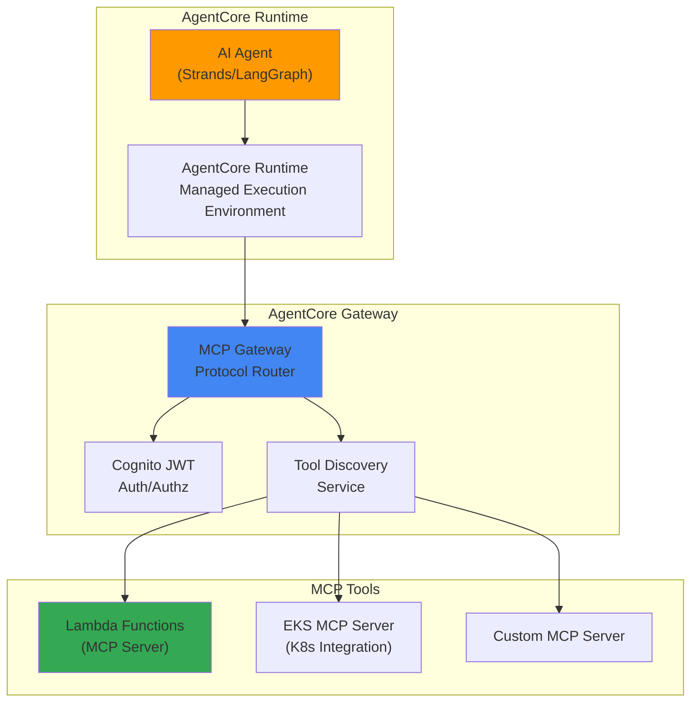

import { EKSMCPFeatures, KagentVsAgentCore, MultiAgentPatterns, MCPServerEcosystem } from '@site/src/components/BedrockMcpTables';

# Bedrock AgentCore and MCP Integration

> 📅 **Written**: 2025-02-09 | ⏱️ **Reading Time**: About 15 minutes

## Overview

Amazon Bedrock AgentCore is a fully managed AI agent production runtime announced as GA at AWS re:Invent 2025. It natively supports Model Context Protocol (MCP) to standardize agent-to-agent communication, tool discovery, and invocation.

This document covers how to operate production-grade AI agents using Bedrock AgentCore on an EKS-based Agentic AI platform.

## Core Architecture

### AgentCore 3-Tier Structure



### MCP Protocol

MCP (Model Context Protocol) is a standard communication protocol between AI agents and tools:

- **Tool Discovery**: Agents dynamically discover available tools
- **Context Passing**: Execution context and state are passed in standardized format
- **Result Return**: Tool execution results are returned in structured format
- **Agent-to-Agent Communication**: Multi-agent collaboration via MCP

## EKS MCP Server Integration

### EKS MCP Server Overview

AWS provides a hosted MCP server dedicated to EKS to support integration between Kubernetes clusters and AI agents:

<EKSMCPFeatures />

### SRE Agent Example

```yaml
# SRE agent definition using AgentCore
apiVersion: agentcore.aws/v1
kind: AgentDefinition
metadata:
  name: sre-agent
spec:
  runtime:
    model: anthropic.claude-sonnet-4-20250514
    maxTokens: 4096
  tools:
    - type: mcp
      server: eks-mcp-server
      capabilities:
        - pod-logs
        - k8s-events
        - cloudwatch-metrics
    - type: mcp
      server: custom-runbook-server
      capabilities:
        - execute-runbook
        - create-incident
  policies:
    - name: read-only-production
      effect: allow
      actions: ["read"]
      resources: ["pods", "services", "deployments"]
```

### Kagent and AgentCore Integration

You can use existing Kagent-based agents together with Bedrock AgentCore:

<KagentVsAgentCore />

**Hybrid Approach**: An effective strategy is to route cost-sensitive high-frequency calls to Kagent + vLLM, and low-frequency calls requiring complex reasoning to Bedrock AgentCore.

## Security and Access Control

### Cognito JWT Authentication

AgentCore Gateway provides JWT-based authentication through Amazon Cognito:

```yaml
# MCP Gateway authentication configuration
apiVersion: v1
kind: ConfigMap
metadata:
  name: agentcore-auth-config
data:
  auth.yaml: |
    provider: cognito
    userPoolId: ap-northeast-2_xxxxx
    clientId: your-client-id
    scopes:
      - agents/invoke
      - tools/read
      - tools/execute
```

### IAM Policy

```json
{
  "Version": "2012-10-17",
  "Statement": [
    {
      "Effect": "Allow",
      "Action": [
        "bedrock:InvokeAgent",
        "bedrock:ListAgents",
        "bedrock:GetAgent"
      ],
      "Resource": "arn:aws:bedrock:ap-northeast-2:*:agent/*"
    }
  ]
}
```

## Monitoring and Observability

### AgentCore Metrics

Bedrock AgentCore automatically publishes agent execution metrics to CloudWatch:

- `AgentInvocations`: Number of agent invocations
- `AgentLatency`: Agent response time
- `ToolInvocations`: Number of tool invocations
- `ToolErrors`: Tool execution errors
- `TokenUsage`: Token usage

### LangFuse Integration

You can integrate existing LangFuse monitoring with AgentCore to implement unified observability:

```python
from langfuse import Langfuse
import boto3

langfuse = Langfuse()
bedrock = boto3.client('bedrock-agent-runtime')

# Track AgentCore invocation with LangFuse
trace = langfuse.trace(name="sre-agent-invocation")
span = trace.span(name="bedrock-agentcore")

response = bedrock.invoke_agent(
    agentId="your-agent-id",
    sessionId="session-123",
    inputText="Please diagnose unhealthy Pods in the production namespace"
)

span.end(output=response)
```

## AWS MCP Server Ecosystem

AWS provides official MCP servers as open source ([github.com/awslabs/mcp](https://github.com/awslabs/mcp)):

<MCPServerEcosystem />

## Related Documents

- [Agentic AI Platform Architecture](./agentic-platform-architecture.md)
- [Kagent Kubernetes Agents](./kagent-kubernetes-agents.md)
- [Agent Monitoring](./agent-monitoring.md)
- [Inference Gateway Routing](./inference-gateway-routing.md)
