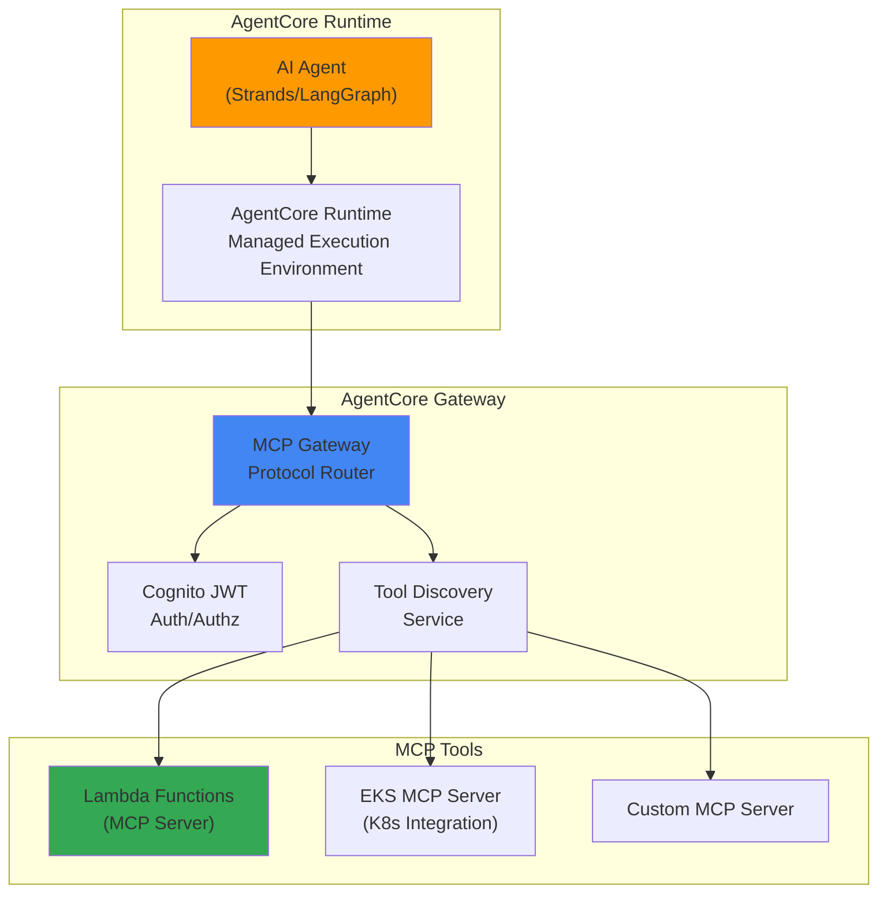
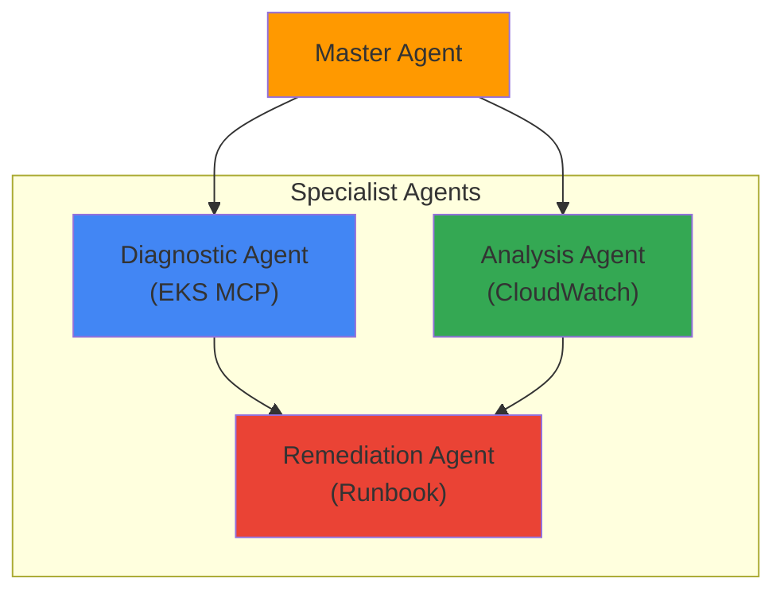

import { EKSMCPFeatures, KagentVsAgentCore, MultiAgentPatterns, MCPServerEcosystem } from '@site/src/components/BedrockMcpTables';

# Bedrock AgentCore and MCP Integration

> 📅 **Written**: 2026-02-13 | **Last Modified**: 2026-02-14 | ⏱️ **Reading Time**: ~3 min

## Overview

:::caution Bedrock AgentCore Status
Amazon Bedrock AgentCore was announced at AWS re:Invent 2025 and is currently in Preview. Please check AWS official announcements for GA (General Availability) schedule. Sufficient testing is required before production deployment.
:::

Amazon Bedrock AgentCore is a fully managed AI agent production runtime. It natively supports Model Context Protocol (MCP) to standardize agent-to-agent communication, tool discovery, and invocation.

This document covers how to operate production-level AI agents using Bedrock AgentCore on an EKS-based Agentic AI platform.

## Core Architecture

### AgentCore 3-Tier Structure



### MCP Protocol

MCP (Model Context Protocol) is a standard communication protocol between AI agents and tools:

- **Tool Discovery**: Agents dynamically discover available tools
- **Context Passing**: Pass execution context and state in standardized format
- **Result Return**: Return tool execution results in structured format
- **Agent-to-Agent Communication**: Multi-agent collaboration via MCP

## EKS MCP Server Integration

### EKS MCP Server Overview

AWS provides a dedicated hosted MCP server for EKS to support integration between Kubernetes clusters and AI agents:

<EKSMCPFeatures />

### SRE Agent Example

:::info Note
The `AgentDefinition` CRD below is an example showing the concept of AgentCore's declarative agent definition. For actual deployment, configure agents through AWS Console, Bedrock Agent API (boto3), or CloudFormation.
:::

**Actual Deployment Method (using boto3):**

```python
import boto3

bedrock_agent = boto3.client('bedrock-agent')

# Create agent
response = bedrock_agent.create_agent(
    agentName='sre-agent',
    foundationModel='anthropic.claude-sonnet-4-20250514',
    instruction='You are an SRE agent that helps troubleshoot Kubernetes clusters.',
    agentResourceRoleArn='arn:aws:iam::ACCOUNT:role/BedrockAgentRole',
)

agent_id = response['agent']['agentId']

# Connect MCP tools (Action Group)
bedrock_agent.create_agent_action_group(
    agentId=agent_id,
    agentVersion='DRAFT',
    actionGroupName='eks-mcp-tools',
    actionGroupExecutor={
        'customControl': 'RETURN_CONTROL'  # Route to MCP server
    },
    apiSchema={
        'payload': json.dumps({
            'openapi': '3.0.0',
            'info': {'title': 'EKS MCP Tools', 'version': '1.0'},
            'paths': {
                '/pod-logs': {'post': {'description': 'Get pod logs'}},
                '/k8s-events': {'post': {'description': 'Get K8s events'}},
            }
        })
    }
)
```

**Conceptual CRD Example (not for actual use):**

```yaml
# SRE agent definition using AgentCore (conceptual example)
apiVersion: agentcore.aws/v1
kind: AgentDefinition
metadata:
  name: sre-agent
spec:
  runtime:
    model: anthropic.claude-sonnet-4-20250514
    maxTokens: 4096
  tools:
    - type: mcp
      server: eks-mcp-server
      capabilities:
        - pod-logs
        - k8s-events
        - cloudwatch-metrics
    - type: mcp
      server: custom-runbook-server
      capabilities:
        - execute-runbook
        - create-incident
  policies:
    - name: read-only-production
      effect: allow
      actions: ["read"]
      resources: ["pods", "services", "deployments"]
```

### Kagent and AgentCore Integration

You can use existing Kagent-based agents together with Bedrock AgentCore:

<KagentVsAgentCore />

**Hybrid Approach**: An effective strategy is to route cost-sensitive high-frequency calls to Kagent + vLLM, and low-frequency calls requiring complex reasoning to Bedrock AgentCore.

### Multi-Agent Orchestration

AgentCore supports agent-to-agent collaboration via MCP:

```python
import boto3

bedrock_runtime = boto3.client('bedrock-agent-runtime')

# Invoke master agent
response = bedrock_runtime.invoke_agent(
    agentId='master-agent-id',
    sessionId='session-123',
    inputText='Please diagnose and suggest solutions for unhealthy Pods in the production cluster'
)

# Master agent internally invokes the following agents:
# 1. Diagnostic Agent (using EKS MCP server)
# 2. Analysis Agent (CloudWatch metrics analysis)
# 3. Remediation Agent (Runbook execution)
```

**Multi-Agent Patterns:**

<MultiAgentPatterns />



## Security and Access Control

### Cognito JWT Authentication

AgentCore Gateway provides JWT-based authentication through Amazon Cognito:

```yaml
# MCP Gateway authentication configuration
apiVersion: v1
kind: ConfigMap
metadata:
  name: agentcore-auth-config
data:
  auth.yaml: |
    provider: cognito
    userPoolId: ap-northeast-2_xxxxx
    clientId: your-client-id
    scopes:
      - agents/invoke
      - tools/read
      - tools/execute
```

### IAM Policy

```json
{
  "Version": "2012-10-17",
  "Statement": [
    {
      "Effect": "Allow",
      "Action": [
        "bedrock:InvokeAgent",
        "bedrock:GetAgent"
      ],
      "Resource": "arn:aws:bedrock:ap-northeast-2:123456789012:agent/your-agent-id"
    },
    {
      "Effect": "Allow",
      "Action": [
        "bedrock:InvokeModel"
      ],
      "Resource": "arn:aws:bedrock:ap-northeast-2::foundation-model/anthropic.claude-*"
    }
  ]
}
```

## Monitoring and Observability

### AgentCore Metrics

Bedrock AgentCore automatically publishes agent execution metrics to CloudWatch:

- `AgentInvocations`: Number of agent invocations
- `AgentLatency`: Agent response time
- `ToolInvocations`: Number of tool invocations
- `ToolErrors`: Tool execution errors
- `TokenUsage`: Token usage

### LangFuse Integration

You can integrate existing LangFuse monitoring with AgentCore for unified observability:

```python
from langfuse import Langfuse
import boto3

langfuse = Langfuse()
bedrock = boto3.client('bedrock-agent-runtime')

# Track AgentCore invocation with LangFuse
trace = langfuse.trace(name="sre-agent-invocation")
span = trace.span(name="bedrock-agentcore")

response = bedrock.invoke_agent(
    agentId="your-agent-id",
    sessionId="session-123",
    inputText="Please diagnose unhealthy Pods in the production namespace"
)

span.end(output=response)
```

### CloudWatch Generative AI Observability Integration

:::tip CloudWatch Gen AI Observability GA
CloudWatch Generative AI Observability became **GA in October 2025**. It natively integrates with AgentCore, automatically logging agent invocations, tool executions, and token usage to CloudWatch without additional configuration.
:::

AgentCore natively integrates with **CloudWatch Generative AI Observability**:

- **Agent Execution Tracing**: End-to-end tracing visualizes the entire inference flow
- **Tool Invocation Monitoring**: Track invocation count, latency, and error rate per MCP server
- **Token Consumption Analysis**: Track input/output token usage and costs by model
- **Anomaly Detection**: Automatically detect abnormal patterns with CloudWatch Anomaly Detection

**Viewing in CloudWatch Console:**

1. CloudWatch Console → "AgentCore" tab
2. Automatic agent-specific metric dashboard generation
3. View entire execution flow with prompt tracing
4. Detailed log analysis with Logs Insights

Using LangFuse (self-hosted detailed tracing) together with CloudWatch Gen AI Observability (AWS native integration) provides the most comprehensive observability.

## AWS MCP Server Deployment

AWS provides official MCP servers as open source ([github.com/awslabs/mcp](https://github.com/awslabs/mcp)):

### EKS MCP Server Deployment

```bash
# Clone AWS MCP server repository
git clone https://github.com/awslabs/mcp.git
cd mcp/servers/eks

# Build Docker image
docker build -t eks-mcp-server:latest .

# Deploy to EKS
kubectl apply -f k8s/deployment.yaml
```

**EKS MCP Server Deployment:**

```yaml
apiVersion: apps/v1
kind: Deployment
metadata:
  name: eks-mcp-server
  namespace: mcp-servers
spec:
  replicas: 2
  selector:
    matchLabels:
      app: eks-mcp-server
  template:
    metadata:
      labels:
        app: eks-mcp-server
    spec:
      serviceAccountName: eks-mcp-server
      containers:
      - name: server
        image: eks-mcp-server:latest
        ports:
        - containerPort: 8080
          name: http
        env:
        - name: CLUSTER_NAME
          value: "production-cluster"
        - name: AWS_REGION
          value: "ap-northeast-2"
        resources:
          requests:
            cpu: "500m"
            memory: "512Mi"
          limits:
            cpu: "1"
            memory: "1Gi"
---
apiVersion: v1
kind: Service
metadata:
  name: eks-mcp-server
  namespace: mcp-servers
spec:
  selector:
    app: eks-mcp-server
  ports:
  - port: 80
    targetPort: 8080
  type: ClusterIP
```

**IAM Permission Setup (IRSA):**

```json
{
  "Version": "2012-10-17",
  "Statement": [
    {
      "Effect": "Allow",
      "Action": [
        "eks:DescribeCluster",
        "eks:ListClusters"
      ],
      "Resource": "arn:aws:eks:ap-northeast-2:*:cluster/*"
    },
    {
      "Effect": "Allow",
      "Action": [
        "logs:GetLogEvents",
        "logs:FilterLogEvents"
      ],
      "Resource": "arn:aws:logs:ap-northeast-2:*:log-group:/aws/eks/*"
    },
    {
      "Effect": "Allow",
      "Action": [
        "cloudwatch:GetMetricData",
        "cloudwatch:GetMetricStatistics"
      ],
      "Resource": "*"
    }
  ]
}
```

## AWS MCP Server Ecosystem

AWS provides official MCP servers as open source ([github.com/awslabs/mcp](https://github.com/awslabs/mcp)):

<MCPServerEcosystem />

## Related Documents

- [Agentic AI Platform Architecture](./agentic-platform-architecture.md)
- [Kagent Kubernetes Agents](./kagent-kubernetes-agents.md)
- [Agent Monitoring](./agent-monitoring.md)
- [Inference Gateway Routing](./inference-gateway-routing.md)

## References

- [Amazon Bedrock AgentCore Documentation](https://docs.aws.amazon.com/bedrock/latest/userguide/agents.html)
- [AWS MCP Servers (GitHub)](https://github.com/awslabs/mcp)
- [Model Context Protocol Specification](https://modelcontextprotocol.io/)
- [CloudWatch Generative AI Observability](https://aws.amazon.com/blogs/mt/launching-amazon-cloudwatch-generative-ai-observability-preview/)
- [CNS421: Streamline EKS Operations with Agentic AI (re:Invent 2025)](https://www.youtube.com/watch?v=4s-a0jY4kSE)