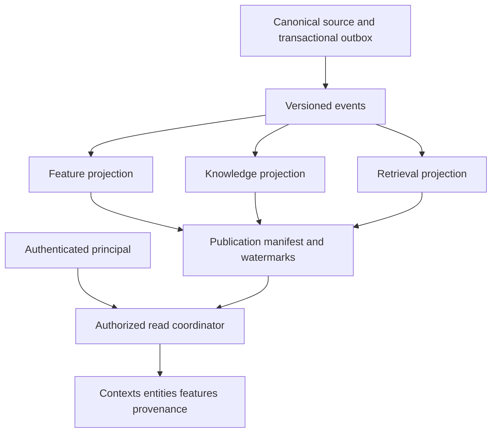
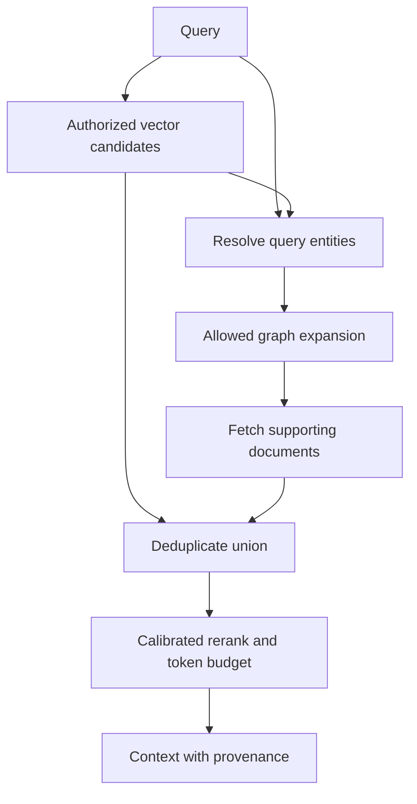
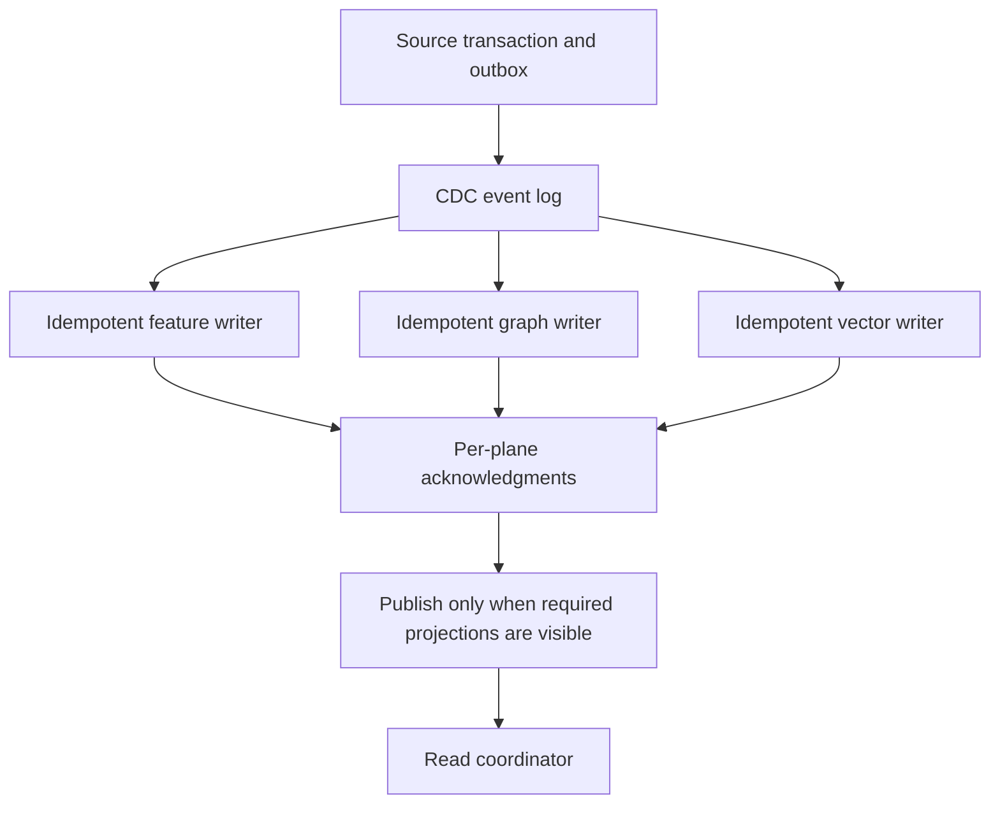

:::caution Forward-looking design / Verification pending
KFS is the composed architecture proposed in this document, not a standard product or a drop-in superset of Feast/SageMaker APIs. Completion/acceptance evidence for the planned 2026-Q2 session was not established. The concept, schema, and consistency contract remain proposals pending operator/domain-owner approval. This review performed no data-store mutations or model evaluation. [Issue #4](https://github.com/devfloor9/engineering-playbook/issues/4)
:::

## Problem Definition: Why Feature Store Alone Is Insufficient

Feature stores and knowledge graphs serve different roles. The earlier claim that feature stores provide no provenance or temporal correctness was inaccurate. Distinguish Feast historical point-in-time joins from online serving. KFS proposes an application contract combining relationship retrieval and feature access.

### Traditional Feature Store Limitations

Feature stores focus on feature serving by entity key. Relationship traversal, terminology, and result fusion may need additional design. Using a feature store alone does not inherently cause hallucinations or compliance failure.

Customer → Contract → Device → Usage is a **synthetic example**. Domain owners must decide Premium/VIP meanings, post-termination relationships, shared devices, and temporal validity.

## Knowledge Feature Store Conceptual Model

The three planes divide responsibilities. A coordinator and adapters must implement unified reads, authorization, and write publication; the backends’ consistency guarantees do not automatically compose.

### 3-Plane Architecture

This is a logical data flow. Each store has its own commit boundary.


```mermaid
flowchart TB
    SOURCE[Canonical source and transactional outbox] --> EVENTS[Versioned events]
    EVENTS --> FP[Feature projection]
    EVENTS --> KP[Knowledge projection]
    EVENTS --> RP[Retrieval projection]
    FP --> GATE[Publication manifest and watermarks]
    KP --> GATE
    RP --> GATE
    PRINCIPAL[Authenticated principal] --> READ[Authorized read coordinator]
    GATE --> READ
    READ --> ANSWER[Contexts entities features provenance]
```

### Role of Each Plane

| Plane | Responsibility | Separate verification |
|---|---|---|
| Feature | Feature values/definitions by entity key | Online latest values versus offline history and timestamp semantics |
| Knowledge | Relations, terminology, entity resolution | Ontology version and RDF/property-graph mapping |
| Retrieval | Embeddings, document retrieval, reranking | Model/chunk/index versions and search visibility |
| Coordinator | Authorization, publication, provenance composition | Cross-plane generation selection and partial failure |

### Unified Read API

kfs.retrieve names a facade contract to implement. It does not imply an installable kfs SDK or unified feast:// and neptune:// protocols. The server supplies the authenticated principal; callers cannot choose their own role.

```text
retrieve(query, authenticated_principal, requested_generation):
  authorize tenant, entity types, attributes, relationships, and purpose
  choose a published generation supported by ALL required stores
  search only authorized, visible documents at that generation
  expand allowed relationships and fetch version-compatible features
  return contexts, entities, features, provenance, generation,
         source_watermarks, freshness, and completeness
  if the contract cannot be met: fail explicitly or apply approved stale policy
```

## Ontology Schema and Entity Interpretation

Schema semantics, entity resolution, and store mapping are distinct contracts. Syntactically valid Turtle does not establish domain suitability.

### Domain Ontology Definition

The example separates RDF/OWL classes/properties from SKOS concepts. It fixes missing rdfs/xsd prefixes and defines customerGrade as a relation to a concept rather than a string. SKOS broader is not OWL subClassOf; exactMatch is not identity-resolution evidence or proof that VIP equals Premium. Domain/range have inference semantics; closed-world input validation needs SHACL/application rules.

```turtle
@prefix kfs: <https://example.org/kfs/> .
@prefix skos: <http://www.w3.org/2004/02/skos/core#> .
@prefix owl: <http://www.w3.org/2002/07/owl#> .
@prefix rdfs: <http://www.w3.org/2000/01/rdf-schema#> .
@prefix xsd: <http://www.w3.org/2001/XMLSchema#> .

kfs:Customer a owl:Class ; rdfs:label "Customer"@en .
kfs:Contract a owl:Class ; rdfs:label "Contract"@en .
kfs:Device a owl:Class ; rdfs:label "Device"@en .
kfs:Usage a owl:Class ; rdfs:label "Usage"@en .

kfs:hasContract a owl:ObjectProperty ;
    rdfs:domain kfs:Customer ; rdfs:range kfs:Contract .
kfs:usesDevice a owl:ObjectProperty ;
    rdfs:domain kfs:Contract ; rdfs:range kfs:Device .
kfs:recordedUsage a owl:ObjectProperty ;
    rdfs:domain kfs:Device ; rdfs:range kfs:Usage .
kfs:customerGrade a owl:ObjectProperty ;
    rdfs:domain kfs:Customer ; rdfs:range skos:Concept .
kfs:churnRisk a owl:DatatypeProperty ;
    rdfs:domain kfs:Customer ; rdfs:range xsd:decimal .

kfs:CustomerGradeScheme a skos:ConceptScheme .
kfs:HighValue a skos:Concept ;
    skos:inScheme kfs:CustomerGradeScheme ; skos:prefLabel "High value"@en .
kfs:Premium a skos:Concept ;
    skos:inScheme kfs:CustomerGradeScheme ; skos:prefLabel "Premium"@en ;
    skos:broader kfs:HighValue .
kfs:VIP a skos:Concept ;
    skos:inScheme kfs:CustomerGradeScheme ; skos:prefLabel "VIP"@en .
# No equivalence is asserted between VIP and Premium.
```

Version the property-graph mapping: HAS_CONTRACT → kfs:hasContract, USES_DEVICE → kfs:usesDevice, RECORDED_USAGE → kfs:recordedUsage, and grade_id → concept IRI. Scope entity keys by tenant/source namespace. Preserve separate resolution decisions and evidence for namesakes, shared devices, contract renewal, and alias conflicts.

### Managed vs Open Source Options

| Role | Options | Distinction |
|---|---|---|
| Transactional graph/RDF | Neptune Database or suitable self-hosted store | Distinguish Neptune Database RDF/SPARQL from property-graph APIs |
| Graph analytics | Neptune Analytics | Managed analytics with selected graph memory in m-NCUs and openCypher |
| Vector retrieval | Milvus and alternatives | Independent consistency/visibility and index lifecycle |

Neptune Analytics is not a capacity-free RDF store and is distinct from Neptune Database Serverless. Latency/pricing depend on data, query, capacity, and region; do not present fixed milliseconds or hourly prices as measured design performance.

## KG-aware RAG Pattern

Graph expansion may improve recall, but incorrect edges and excessive context can reduce quality. Improvement is a hypothesis to evaluate.

### Vector Search + Graph Expansion

Apply retrieval, entity resolution, authorization filters, graph expansion, evidence-document fusion, and reranking. Expanding entities alone does not add answer evidence unless their authorized supporting context reaches the final result.


```mermaid
flowchart TB
    Q[Query] --> V[Authorized vector candidates]
    Q --> E[Resolve query entities]
    V --> E
    E --> G[Allowed graph expansion]
    G --> D[Fetch supporting documents]
    V --> U[Deduplicate union]
    D --> U
    U --> R[Calibrated rerank and token budget]
    R --> C[Context with provenance]
```

### Implementation Example

This pseudocode defines adapter interfaces; it is not an SDK API or executable evaluation script. Do not add cosine scores and graph distances with uncalibrated 0.7/0.3 weights.

```text
query_entities = resolve_entities(query, ontology_version, principal)
vector_docs = vector_search(query, principal, published_generation)
seed_entities = union(query_entities, linked_entities(vector_docs))
expanded = graph_expand(seed_entities, allowed_relations, max_depth,
                        principal, published_generation)
graph_docs = supporting_documents(expanded, principal, published_generation)
candidates = deduplicate_by_document_version(vector_docs + graph_docs)
ranked = calibrated_rerank(query, candidates, principal)
contexts = select_with_token_budget(ranked)
return contexts, source_ids, document_versions, retrieval_generation
```

### Quality Hypothesis and Evaluation Contract {#expected-improvements}

No improvements are accepted for this platform. The former faithfulness 0.72→0.89 and recall 0.68→0.85 numbers lacked linked measurements and have been removed. The GraphRAG paper and survey do not validate those specific figures. Do not average different papers’ datasets/metrics into a target improvement.

Compare vector-only and graph-augmented retrieval with the same corpus snapshot, QA split, generator, embedding, token budget, and judge/version. Define faithfulness, context recall, answer relevance, human judgments, latency, and cost; report sample counts, paired confidence intervals, entity-linking failures, and denied-access cases. Keep baseline/candidate/results pending before evaluation.

## Write Path and Consistency Model

This proposal defaults to eventual consistency across asynchronous projections. Sequentially writing one event to three stores does not create an atomic commit or strong consistency.

### CDC-based Event Flow

Design the source transaction and outbox to commit together, then deliver versioned events through CDC. Preserve source commit/partition ordering without assuming a global order across sources. Distinguish successful persistence from searchable visibility in each writer.


```mermaid
flowchart TB
    DB[Source transaction and outbox] --> CDC[CDC event log]
    CDC --> F[Idempotent feature writer]
    CDC --> K[Idempotent graph writer]
    CDC --> V[Idempotent vector writer]
    F --> M[Per-plane acknowledgments]
    K --> M
    V --> M
    M --> P[Publish only when required projections are visible]
    P --> R[Read coordinator]
```

### Offline Batch vs Online Stream

| Mode | Benefit | Risk to verify |
|---|---|---|
| Batch | Snapshot replay and reconciliation | Snapshot boundaries, late data, recomputation cost |
| Stream | Lower propagation delay | Duplicates, reordering, partial failure, DLQ |
| Combined | Stream plus periodic reconciliation | Version checks prevent batch overwriting newer stream data |

There is no fixed Batch=100%, Stream=99% accuracy guarantee.

### Eventual Consistency Model

Feast online stores retain the latest features per entity key, not arbitrary historical values. Offline point-in-time joins differ from a common snapshot across three stores. Timestamp filters alone do not guarantee cross-plane point-in-time consistency.

To read a generation of data published together across the three stores, each store must retain immutable version history and allow queries to select a version. The coordinator checks each store's visibility watermark to confirm that the required version can be queried. Once all required stores are ready, it exposes the publication manifest: the list of versions that a query should read.

If a store keeps only the latest values, reject this query mode or use a versioned store. Distinguish event time from ingestion time, and define how to handle late events and deletions. Promise strong consistency or read-your-writes only within a backend and coordinator boundary where that behavior has been demonstrated.

### Write Pipeline Example

The following pseudocode defines the contract each storage adapter must implement. Within each backend transaction, combine event-version checks, mutation, and deduplication markers. A committed Kafka offset alone does not establish completion in all three stores.

```text
event = {tenant, source, entity_id, event_id, source_version,
         schema_version, event_time, ingestion_time, operation, payload}
validate_schema_and_authority(event)
for plane in required_planes(event):
  begin plane transaction or equivalent conditional write
    marker = read marker for (tenant, source, event_id)
    if marker exists:
      verify the stored payload digest matches this event
      version_to_ack = marker.version
    else:
      if source_version is older: reject stale mutation
      apply parameterized upsert or versioned tombstone
      persist event_id/source_version, payload digest and provenance with mutation
      version_to_ack = source_version
  commit plane write
  wait for version_to_ack to be visible to that plane's read path
  upsert durable acknowledgment for this event, plane and version_to_ack
  continue to the next required plane
if every required plane acknowledges this exact generation:
  conditionally publish its manifest without replacing a newer generation
commit/advance source progress only under the durable replay contract
on failure: retry idempotently; quarantine poison events; reconcile gaps
```

Graph adapters use bound parameters and unique entity/edge keys. Vector adapters implement upsert/delete without duplicate document versions. Replay after partial failure must preserve completed planes. Propagate deletion tombstones across every plane and prevent old retries from resurrecting data. Do not directly compare version numbers from different sources; apply an explicit conflict policy.

Run these fixtures for synthetic tenant test-a and entity customer-001. Each row starts from an independent initial state. v1 upserts Premium, v2 upserts VIP, and v3 deletes the entity. The test assumes version history in all three planes; adapters without it must reject consistent-generation mode. These are expected outcomes, not observed results.

| Fixture | Input/failure sequence | Expected result |
|---|---|---|
| Duplicate | v1, redelivery of v1 with the same event_id | No duplicate entity/edge/document; one v1 publication |
| Out of order | v2 followed by v1 | Retain v2; no regression to v1 |
| Partial failure | Publish v1, fail the vector writer for v2 | Keep v1 published; no mixed-v2 read; publish v2 after successful replay |
| Crash before acknowledgment | Persist v2 mutation and marker, then stop the process | Replay reuses the marker, rechecks visibility, records the acknowledgment, and continues through remaining planes |
| Visibility delay | Persist v2 but delay vector search visibility | Do not publish v2 before visibility is established |
| Replay after deletion | Publish v3, then redeliver v2 | Retain tombstone v3; no resurrected entity/document |
| Late data | Deliver old-event-time v2 after v3 | Reject stale source version; retain deletion |
| Poison event | New event with invalid schema | Quarantine/audit; retain previous published generation |

At each step, record event_id/source_version, persisted and visible versions per plane, manifest generation, and read output. Check reads during failure, not only eventual convergence after replay.

## Governance, Security, and Roadmap

Authorization, sensitive-data handling, lineage, and audit are implementation requirements at both read and write boundaries. Declaring an example configuration does not enable them.

### Row/Attribute-level Authorization

Derive tenant, scope, and purpose from the authenticated principal on the server. Enforce policy on vector candidates, graph nodes/edges, feature fields, and final context. A caller-supplied role="external_analyst" is not authorization. Test cross-tenant ID collisions, unauthorized graph expansion, and cache reuse.

### PII Masking On-Read

Display-string masking does not remove exposure in retrieval, embeddings, logs, or graph relationships. Combine minimization, appropriate tokenization/redaction, store authorization, and output review. Verify deletion propagation to summaries, caches, and indexes, plus deny behavior on policy failure.

### Lineage (OpenLineage)

OpenLineage describes job/run/dataset lineage; it does not automatically prove row-level provenance or a distributed transaction. The synthetic RunEvent below includes UUID, producer, and schemaURL. Validate the integration against a pinned schema and dataset/custom facets; emit COMPLETE according to the defined job completion semantics.

```json
{
  "eventType": "COMPLETE",
  "eventTime": "2026-09-18T00:00:00Z",
  "run": {"runId": "a9067eb1-12ca-4cfa-a5e1-623b8bbf72ed"},
  "job": {"namespace": "example-kfs", "name": "materialize-projections"},
  "inputs": [{"namespace": "example-source", "name": "synthetic-entities"}],
  "outputs": [{"namespace": "example-kfs", "name": "published-generation"}],
  "producer": "https://example.org/kfs/materializer",
  "schemaURL": "https://openlineage.io/spec/2-0-2/OpenLineage.json#/$defs/RunEvent"
}
```

### Audit Log

Record request/event IDs, pseudonymous principal, tenant scope, policy version, accessed generation, allow/deny, provenance references, and outcome. Do not store full queries, PII, tokens, or secrets as default audit fields. Include denials, partial failures, deletion, and replay in coverage.

### Pilot Roadmap

Completion of the planned 2026-Q2 work remains unverified. Record new acceptance in this order.

1. **Concept/domain acceptance:** State in an ADR whether the three planes replace or compose with existing feature stores, including ownership and API compatibility. Domain owners adjudicate synthetic Customer/Contract/Device/Usage, Premium/VIP, namesakes, shared devices, and validity periods.
2. **Schema/mapping acceptance:** Check Turtle parsing, SHACL/application constraints, namespaces, entity keys, RDF/property-graph mappings, and migration versions.
3. **Write-failure fixtures:** Reproduce duplicates, out-of-order/late events, one-plane failure, visibility lag, deletion followed by stale replay, and DLQ recovery. Reconcile event logs, plane versions, acknowledgments, and publication manifests. Unpublished or unauthorized generations must not be returned.
4. **Read consistency:** Approve latest-read freshness bounds, stale/partial behavior, availability of historical reads, and event-time versus ingestion-time boundaries. Preregister lag limits and sample sizes.
5. **Quality/security:** Evaluate baseline/candidate on the same QA/corpus versions and verify cross-tenant denials, PII handling, and deletion propagation.
6. **Evidence:** Preserve configuration/source/data hashes, UTC timestamps, expected/observed results, owner/approver, and residual items. Keep verification pending until measurements, domain semantics, and consistency are accepted.

## Conclusion

KFS proposes composing feature, graph, and retrieval capabilities. It requires implemented ontology mappings, authorization, asynchronous writes, publication, and evaluation contracts. Adding a graph alone guarantees neither hallucination reduction, compliance, nor strong consistency. Domain/operator acceptance and measurements remain outstanding.

## References

### Official Documentation

- [Feast online store](https://docs.feast.dev/getting-started/components/online-store) — latest-value serving
- [Feast point-in-time joins](https://docs.feast.dev/getting-started/concepts/point-in-time-joins) — historical feature retrieval
- [Neptune Analytics guide](https://docs.aws.amazon.com/neptune-analytics/latest/userguide/what-is-neptune-analytics.html) — graph analytics and capacity
- [SKOS Reference](https://www.w3.org/TR/skos-reference/) — concepts, relations, mapping semantics
- [OWL Web Ontology Language](https://www.w3.org/OWL/) — ontology language
- [SHACL](https://www.w3.org/TR/shacl/) — RDF graph validation
- [OpenLineage object model](https://openlineage.io/docs/spec/object-model/) — run/job/dataset contracts

### Papers / Technical Blogs

- [From Local to Global: A Graph RAG Approach to Query-Focused Summarization](https://arxiv.org/abs/2404.16130) — task-specific graph retrieval evaluation
- [Graph Retrieval-Augmented Generation: A Survey](https://arxiv.org/abs/2408.08921) — research overview, not platform measurements

### Related Documents (Internal)

- [Platform architecture](../foundations/agentic-platform-architecture.md) — data layer
- [Milvus vector database](../../operations-mlops/data-infrastructure/milvus-vector-database.md) — vector retrieval
- [Ragas evaluation](../../operations-mlops/governance/ragas-evaluation.md) — RAG quality evaluation
- [Domain customization](../../operations-mlops/governance/domain-customization.md) — domain adaptation
