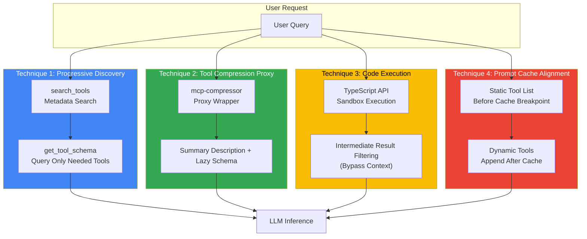

## Overview

Model Context Protocol (MCP) servers perform upfront loading of all tool definitions upon connection. Each tool consumes 300–1,000+ tokens in JSON Schema, and a configuration with 10 servers × 20 tools occupies **100,000 tokens** in the context window before user input. This document quantifies token overhead and presents four optimization techniques: Progressive Discovery, tool compression, Code Execution, and prompt cache alignment.

:::info Document Location
- This Document: MCP token optimization techniques (design perspective)
- [Tiered Gateway Architecture](../../model-serving/inference-routing/tiered-gateway-architecture.md): Agent Data Plane architecture context
- [AI Gateway Guardrails](../../operations-mlops/governance/ai-gateway-guardrails.md): MCP server Tool Allow-list and security policies
:::

---

## Background: Quantifying the Problem

### Upfront Loading Cost

MCP servers return all tool metadata (name, description, JSON Schema) when `list_tools` is called. Clients include this in the system prompt sent to the LLM, so **the more tools, the higher the initial context window occupancy**.

#### Measured Cases (Sources Cited)

- **StackOne Analysis**: 10 MCP servers × 20 tools × average 500 tokens = **100,000 tokens** preempted before user input ([Source](https://www.stackone.com/blog/mcp-token-optimization/))
- **Atlassian Measurement**: GitHub MCP server (94-tool) without compression = **17,600 tokens** ([Source](https://www.atlassian.com/blog/developer/mcp-compression-preventing-tool-bloat-in-ai-agents))
- **Anthropic Case**: 10,000-row spreadsheet exposed as 5 rows via code execution = **150,000 → 2,000 tokens (98.7% reduction)** ([Source](https://www.anthropic.com/engineering/code-execution-with-mcp))

### Compound Cost

Token overhead increases costs across three dimensions.

| Dimension | Impact | Quantitative Example |
|------|------|----------|
| **Input Token Cost** | Tool definitions transmitted per request | Claude Sonnet 4.5: $3/M tokens → 100k tool definitions = $0.30/request |
| **Context Window Exhaustion** | User conversation length constraint | 100k preemption out of 200k window → 50% effective availability |
| **Prompt Cache Hit Rate Degradation** | Cache invalidation on tool list changes | Retransmission on every dynamic tool addition/removal |

---

## Architecture: 4 Optimization Techniques



---

## Technique 1: Progressive Discovery

### Concept

Tool definitions are **lazy loaded** as needed. On initial connection, only tool names and one-line descriptions are transmitted; detailed schemas are retrieved when the LLM selects a specific tool.

### 3-Step Flow

MCP official client best practices recommend the following steps.

1. **Catalog (Search)**: `search_tools(query="file operations")` → Returns tool name list
2. **Inspect (Schema Retrieval)**: `get_tool_schema(tool_name="read_file")` → Returns JSON Schema
3. **Execute (Invocation)**: `invoke_tool(tool_name="read_file", args={...})` → Actual execution

### Hybrid Threshold

MCP official documentation suggests a **1–5% of context window threshold**. A hybrid approach that switches to Progressive Discovery when tool definition tokens exceed the threshold is practical.

```python
# pseudo-code: Threshold-based loading strategy
def load_tools(mcp_servers: list, context_window: int):
    threshold = context_window * 0.05  # 5%
    total_tokens = 0
    loaded_tools = []

    for server in mcp_servers:
        tools = server.list_tools()
        for tool in tools:
            tool_tokens = estimate_tokens(tool.schema)
            if total_tokens + tool_tokens < threshold:
                loaded_tools.append(tool)  # Upfront loading
                total_tokens += tool_tokens
            else:
                loaded_tools.append({
                    "name": tool.name,
                    "description": tool.description,
                    "schema": "lazy"  # Lazy loading
                })
    return loaded_tools
```

### Trade-offs

| Advantages | Disadvantages |
|------|------|
| Removes detailed schemas from initial context (reduction magnitude varies by tool set composition) | Added round-trip for schema retrieval per tool call increases latency |
| Frees context window space | LLM cannot see the full tool list at a glance |
| Improves prompt cache stability | Repeated retrieval possible in multi-step reasoning |

---

## Technique 2: Tool Compression Proxy

### Atlassian mcp-compressor

Atlassian Labs open-sourced a proxy that wraps existing MCP servers to compress tool descriptions. It provides three APIs.

1. **list_tools**: Compressed tool list (name + minimal description)
2. **get_tool_schema**: Detailed schema for specific tool
3. **invoke_tool**: Delegates invocation to original server

### Performance by Compression Strength

Atlassian measurement for GitHub MCP server (94-tool):

| Compression Strength | Token Count | Reduction Rate | Note |
|----------|--------|-------|------|
| No Compression | 17,600 | 0% | Original |
| Low | 3,900 | 78% | Main parameters retained |
| Medium | 3,300 | 81% | Optional parameters removed |
| High | 2,200 | 87% | Only required parameters |
| Extreme | 500 | 97% | Name + one-line description |

The proxy approach allows adoption without modifying original MCP servers or agent code; compression strength is controlled via proxy settings.

### Suitable Scenarios

- **Large Tool Sets**: Agents using 50+ tools
- **Static Tool Configuration**: Environments where tool lists rarely change
- **Token Cost Optimization Priority**: When cost is more important than latency

---

## Technique 3: Code Execution / Programmatic Tool Calling

### Concept

Tools are exposed as **programming APIs** (e.g., TypeScript file tree) instead of JSON Schemas, and the LLM writes and executes code in a sandbox to invoke tools. Intermediate results are filtered within the execution environment, so they **do not pass through the model context**.

### Anthropic Case

Anthropic published the following results for a 10,000-row spreadsheet processing scenario.

- **Conventional Approach**: Entire data passed to context → **150,000 tokens**
- **Code Execution**: Filtered via Python code → Only final 5 rows to context → **2,000 tokens (98.7% reduction)**

([Source](https://www.anthropic.com/engineering/code-execution-with-mcp))

### Cloudflare Code Mode

Cloudflare introduced "Code Mode," which runs MCP servers in Workers sandboxes. Instead of tool definitions, it provides TypeScript APIs, and LLM-generated code executes in an isolated V8 runtime.

([Source](https://blog.cloudflare.com/code-mode-mcp/))

### Trade-offs

| Advantages | Disadvantages |
|------|------|
| **Up to 98.7% token reduction** (Anthropic measurement) | Requires sandbox infrastructure (Cloudflare Workers, Lambda, etc.) |
| Intermediate result filtering enables large data processing | Security and resource isolation costs |
| Converts tool definition tokens → code execution tokens | Depends on LLM code generation capability |

### Security Considerations

Code Execution permits arbitrary code execution, so **sandbox isolation** is mandatory. Refer to the Tool Allow-list and Scoped Token sections in [AI Gateway Guardrails](../../operations-mlops/governance/ai-gateway-guardrails.md) to restrict executable API scope.

---

## Technique 4: Prompt Cache Alignment

### Problem

When MCP servers dynamically add/remove tools, the `tools` array changes, **invalidating the prompt cache**. Entire tool definitions are retransmitted per request, losing cache benefits.

### Placement Strategy

Fix the **static tool list** before the cache breakpoint, and append **dynamic tools** after the cache.

```python
# pseudo-code: Cache-friendly tool placement
system_prompt = f"""
You are a customer support agent.

# Static Tools (cacheable)
{json.dumps(static_tools)}

<cache_breakpoint />

# Dynamic Tools (per-session variation)
{json.dumps(dynamic_tools)}

User Request: {user_query}
"""
```

### Static vs. Dynamic Classification Criteria

| Tool Type | Example | Placement Position |
|---------|------|----------|
| **Static** | `search_kb`, `create_ticket`, `get_weather` | **Before** cache breakpoint |
| **Dynamic** | User-specific custom actions, session temporary tools | **After** cache breakpoint |

### Effect

Anthropic Prompt Caching reduces input token cost by **90%** on cache hits (regular $3/M → cached $0.30/M). Caching 100k static tool tokens saves **$0.27 per request**.

---

## Deep Dive: Gateway-Level Integration

### Relationship with Agent Data Plane

The [Tiered Gateway Architecture](../../model-serving/inference-routing/tiered-gateway-architecture.md) document defines the Agent Data Plane as an **orthogonal axis**. The agentgateway handling MCP/A2A protocols and stateful sessions operates separately from HTTP routing in Tier 1-2.

Token optimization applies at the following layers.

| Layer | Optimization Responsibility | Implementation Method |
|------|------------|----------|
| **Agent Data Plane (agentgateway)** | MCP server discovery and schema retrieval (Progressive Discovery) | Provides `search_tools` / `get_tool_schema` APIs |
| **Tier 2 ② LLM API Gateway (Bifrost/LiteLLM)** | Prompt cache alignment, tool compression proxy integration | Separate static/dynamic tool placement, mcp-compressor wrapping |
| **Client SDK** | Code Execution sandbox invocation | Exposes TypeScript/Python APIs, filters execution results |

### Governance Integration

Tool Allow-list, MCP server Fingerprint, and Scoped Token policies refer to the "§5.2 Tool Allow-list + Scoped Token" section in [AI Gateway Guardrails](../../operations-mlops/governance/ai-gateway-guardrails.md). Token optimization addresses **efficiency**, while Guardrails addresses **security**. Both perspectives are independent and should be applied simultaneously.

---

## Conclusion

Token overhead in MCP-based agents can be **reduced by 70-98% with four techniques**. Progressive Discovery has low initial implementation cost, tool compression proxy leverages existing MCP servers as-is, and Code Execution provides maximum reduction but requires sandbox infrastructure. Prompt cache alignment provides additional benefits orthogonal to all techniques. In practice, **techniques are combined** based on tool count, dynamic change frequency, and cost sensitivity.

---

## References

### Official Documentation

- [MCP Client Best Practices](https://modelcontextprotocol.io/docs/develop/clients/client-best-practices) — Progressive Discovery, 1-5% threshold, Catalog→Inspect→Execute flow
- [Anthropic Engineering: Code Execution with MCP](https://www.anthropic.com/engineering/code-execution-with-mcp) — 98.7% token reduction case, sandbox architecture
- [Anthropic Engineering: Advanced Tool Use](https://www.anthropic.com/engineering/advanced-tool-use) — Tool-use optimization patterns

### Technical Blogs

- [StackOne: MCP Token Optimization](https://www.stackone.com/blog/mcp-token-optimization/) — Analysis of 100,000 token upfront loading problem
- [Atlassian Labs: MCP Compression](https://www.atlassian.com/blog/developer/mcp-compression-preventing-tool-bloat-in-ai-agents) — mcp-compressor, 94-tool server measurement (17,600 → 500 tokens)
- [Cloudflare: Code Mode with MCP](https://blog.cloudflare.com/code-mode-mcp/) — Workers sandbox-based Code Execution

### Related Documentation (Internal)

- [Tiered Gateway Architecture](../../model-serving/inference-routing/tiered-gateway-architecture.md) — Agent Data Plane (agentgateway), MCP/A2A protocol layer
- [AI Gateway Guardrails](../../operations-mlops/governance/ai-gateway-guardrails.md) — Tool Allow-list, MCP server Fingerprint, Scoped Token
- [AWS Native Agentic Platform](../platform-selection/aws-native-agentic-platform.md) — MCP integration context with Bedrock AgentCore and Strands
