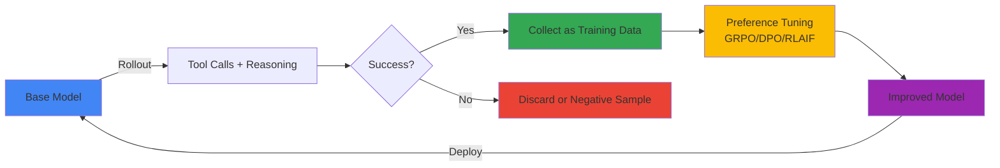
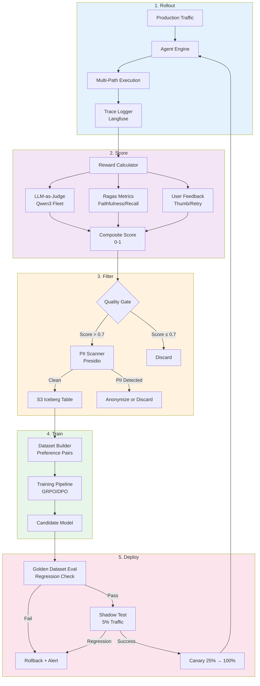
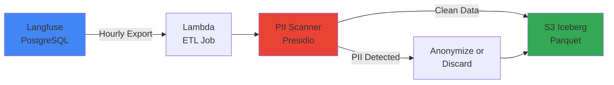

:::warning Self-Hosted SLM Only
This loop is exclusively for self-hosted open-weight models (Qwen3, Llama 4, GLM-5, etc.). AgentCore's managed closed models like Claude/Nova cannot self-learn and are excluded from scope.
:::

:::info ADR Required
Before production deployment, consensus on scope, automation boundaries, data governance, and rollback criteria is needed. See [ADR — Self-Improving Agent Loop Decision](./adr-self-improving-loop.md) for detailed consensus items.
:::

# Self-Improving Agent Loop (Autosearch)

## Autosearch Discourse and Enterprise Interpretation

### Karpathy's Core Argument

Andrej Karpathy argued that LLMs will evolve beyond simple "next token prediction" machines into **autosearch systems**. Core mechanisms:

1. **Tool-use Rollout**: LLM explores multiple reasoning paths using tools (code execution, web search, calculator, etc.)
2. **Success as Signal**: Successful paths (reaching correct answer, completing tasks) become signals for next learning
3. **Self-Supervised Loop**: Accumulate own success/failure data without human labeling and retrain with reinforcement learning
4. **Compound Growth**: Stronger models generate more success traces → stronger models (virtuous cycle)



**Example**: Math problem-solving Agent
- **Rollout**: "53 × 47 = ?" with 5 approaches (direct calculation, Python execution, Wolfram Alpha, approximation, decomposition)
- **Success**: Python execution and decomposition reach correct answer 2491
- **Training**: DPO learning with success paths as preferred samples, failure paths as rejected
- **Next Iteration**: Model bias increases to try Python execution first for complex calculations

### Enterprise Environment Constraints

Applying Karpathy's idealism to enterprise environments requires considering these constraints:

| Constraint | Description | Solution Direction |
|------|------|----------|
| **Data Governance** | Production traces may contain PII, confidential information | Presidio PII scanner, k-anonymity, consent tracking |
| **Cost** | LLM calls increase N-fold per rollout (N=number of exploration paths) | Optimize cost-quality trade-off, prioritize low-cost models |
| **Reward Modeling** | Definition of "success" is ambiguous (customer satisfaction? accuracy? latency?) | Composite reward: LLM-as-judge + Ragas + user feedback |
| **Mode Collapse** | Generate only specific patterns repeatedly (diversity loss) | Entropy regularization, diverse sampling |
| **Regulatory** | Audit log and model card update required for each model change | Version control, audit trail, [Agent Versioning](../../../aidlc/enterprise/agent-versioning/index.md) integration |

:::tip Enterprise Insight
Self-improving loop should be interpreted as **"automated reinforcement under human supervision"**, not **"full automation"**. Quality gates and human-in-the-loop verification are essential at each iteration.
:::

---

## 5-Stage Loop Architecture

### Overall Architecture Diagram



### Stage 1: Rollout — Production Traffic Collection

**Goal**: Collect Agent execution traces for actual user requests.

**Execution Cycle**: Continuous (Real-time)

**Input**: User request, context, Agent state  
**Output**: Trace (prompt, tool calls, intermediate reasoning, final response, latency, token count)

**Collection Mechanism**:

```python
from langfuse import Langfuse

langfuse = Langfuse()

@trace_agent_call  # Automatic trace with decorator
def execute_agent(user_query: str, context: dict):
    trace = langfuse.trace(name="agent-execution", metadata={"user_id": context["user_id"]})
    
    with trace.span(name="retrieval"):
        docs = vector_db.search(user_query)
    
    with trace.span(name="reasoning"):
        response = llm.generate(prompt=build_prompt(user_query, docs))
    
    with trace.span(name="tool-execution"):
        if response.requires_tool:
            tool_result = execute_tool(response.tool_name, response.tool_args)
    
    trace.event(name="completion", metadata={"tokens": response.token_count})
    return response
```

**Diversity Assurance**: Generate 3 responses with temperature variations (0.7/0.9/1.1) for same request to increase diversity

**Failure Recovery**: User response returned normally even if trace collection fails (async logging)

---

### Stage 2: Score — Reward Calculation

**Goal**: Quantify "how good each response is" by assigning 0-1 score to each trace.

**Execution Cycle**: Hourly batch

**Input**: Langfuse trace ID batch  
**Output**: `{trace_id: reward_score}` table

**Composite Reward Formula**:

```python
reward_score = (
    w1 * llm_judge_score +      # LLM-as-Judge (0-1)
    w2 * ragas_faithfulness +   # Ragas faithfulness (0-1)
    w3 * ragas_context_recall + # Ragas context recall (0-1)
    w4 * user_feedback_score +  # Thumbs up=1, down=0, neutral=0.5
    w5 * latency_penalty        # Penalty if P99 exceeds
)

# Default weights (adjust with experiments)
w1, w2, w3, w4, w5 = 0.3, 0.25, 0.2, 0.2, 0.05
```

**LLM-as-Judge Prompt**:

```python
judge_prompt = f"""
Evaluate the following Agent response:

**Question**: {question}
**Context**: {context}
**Answer**: {answer}

Evaluation Criteria:
1. Accuracy: Factual accuracy based on context
2. Completeness: Covers all aspects of the question
3. Clarity: Easy for user to understand
4. Conciseness: Delivers only core without unnecessary information

Return score between 0-1 and reasoning in JSON.
{{"score": 0.85, "reasoning": "Accurate and complete but slightly verbose"}}
"""

judge_response = cheap_llm.generate(judge_prompt)  # Use Qwen3-7B (cost reduction)
```

**Ragas Evaluation**:

```python
from ragas.metrics import faithfulness, context_recall

eval_data = {
    "question": [question],
    "answer": [answer],
    "contexts": [contexts],
    "ground_truth": [ground_truth] if available else None
}

ragas_result = evaluate(Dataset.from_dict(eval_data), metrics=[faithfulness, context_recall])
```

**User Feedback Integration**:

```python
# Query user feedback from Langfuse
feedback = langfuse.get_scores(trace_id=trace_id, name="user-feedback")
user_score = 1.0 if feedback.value == "positive" else 0.0 if feedback.value == "negative" else 0.5
```

**Cost Optimization**:
- LLM-as-Judge uses low-cost model (Qwen3-7B, Llama 4 Scout)
- Ragas with caching (reuse same question+context combinations)
- Prioritize user feedback — skip LLM-as-Judge if feedback exists

---

### Stage 3: Filter — Data Curation & PII Gate

**Goal**: Select only high-quality traces as training data and remove sensitive information.

**Execution Cycle**: Hourly batch

**Input**: Scored traces  
**Output**: Clean training dataset (S3 Iceberg table)

**Quality Gates**:

```python
def filter_traces(scored_traces):
    filtered = []
    for trace in scored_traces:
        # 1. Minimum score threshold
        if trace.reward_score < 0.7:
            continue
        
        # 2. Remove latency outliers (P99 > 30 seconds)
        if trace.latency > 30:
            continue
        
        # 3. Exclude traces with errors
        if trace.error_count > 0:
            continue
        
        # 4. Remove duplicates (same question+answer combination)
        if is_duplicate(trace):
            continue
        
        filtered.append(trace)
    
    return filtered
```

**PII Scanning (Presidio)**:

```python
from presidio_analyzer import AnalyzerEngine
from presidio_anonymizer import AnonymizerEngine

analyzer = AnalyzerEngine()
anonymizer = AnonymizerEngine()

def scan_and_anonymize(text: str) -> tuple[str, bool]:
    """Detect PII then anonymize. Returns (anonymized text, PII found)."""
    results = analyzer.analyze(text=text, language='ko')
    
    if not results:
        return text, False  # No PII
    
    # PII found → anonymize
    anonymized = anonymizer.anonymize(text=text, analyzer_results=results)
    return anonymized.text, True

# Process trace
for trace in filtered_traces:
    trace.question, q_has_pii = scan_and_anonymize(trace.question)
    trace.answer, a_has_pii = scan_and_anonymize(trace.answer)
    
    if q_has_pii or a_has_pii:
        trace.metadata["pii_detected"] = True
```

**k-Anonymity Check** (Must have k+ people with same query pattern to use as training data):

```python
def check_k_anonymity(traces, k=5):
    """Remove if same pattern has less than k instances"""
    query_counts = defaultdict(int)
    for trace in traces:
        query_pattern = extract_pattern(trace.question)  # Extract pattern after entity removal
        query_counts[query_pattern] += 1
    
    return [t for t in traces if query_counts[extract_pattern(t.question)] >= k]
```

**Storage — S3 + Iceberg**:

```python
import pyiceberg

catalog = pyiceberg.catalog.load_catalog("training_data")
table = catalog.load_table("agent_traces")

# Append to Iceberg table
table.append([
    {"trace_id": t.id, "question": t.question, "answer": t.answer, 
     "reward": t.reward_score, "timestamp": t.timestamp}
    for t in filtered_traces
])
```

**Regulatory Compliance**:
- **GDPR/PIPA**: Opt-out mechanism required when using training data without user consent
- **Data Retention Period**: Delete within 90 days after training (policy setting)
- **Audit Log**: Record all PII detection/anonymization events in CloudTrail/Audit DB

---

### Stage 4: Train — Preference Tuning

**Goal**: Retrain model with reinforcement learning using high-quality traces.

**Execution Cycle**: Weekly or Monthly

**Input**: S3 Iceberg table (preference pairs)  
**Output**: Candidate model checkpoint

**Preference Pair Construction**:

Self-improving loop uses high-reward as preferred, low-reward as rejected among multiple responses to same question.

```python
def build_preference_pairs(traces):
    """Group traces for same question to generate pairs"""
    grouped = defaultdict(list)
    for trace in traces:
        grouped[trace.question].append(trace)
    
    pairs = []
    for question, trace_list in grouped.items():
        if len(trace_list) < 2:
            continue  # Cannot pair
        
        # Sort by reward
        sorted_traces = sorted(trace_list, key=lambda t: t.reward_score, reverse=True)
        
        # Top 1 vs Bottom 1 pair
        preferred = sorted_traces[0]
        rejected = sorted_traces[-1]
        
        # Reward difference must be large enough for meaningful pair
        if preferred.reward_score - rejected.reward_score < 0.2:
            continue
        
        pairs.append({
            "prompt": question,
            "chosen": preferred.answer,
            "rejected": rejected.answer,
            "reward_diff": preferred.reward_score - rejected.reward_score
        })
    
    return pairs
```

**Training Method Selection Guide**:

| Method | Data Requirement | GPU-hours (7B model) | Convergence Stability | Suitable Scenario |
|------|-------------|---------------------|------------|-------------|
| **GRPO** | 1k+ pairs | ~50 (4×H100) | ⭐⭐⭐ | Initial self-improvement, fast iteration |
| **DPO** | 5k+ pairs | ~200 (8×H100) | ⭐⭐⭐⭐ | Stable learning after sufficient data |
| **RLAIF** | 10k+ pairs + reward model | ~500 (8×H100) | ⭐⭐ | When complex reward modeling needed |
| **RFT** | 10k+ high-quality traces | ~300 (8×H100) | ⭐⭐⭐⭐⭐ | When golden dataset for supervised learning available |

:::tip Selection Guide
- **Initial (data &lt;2k pairs)**: GRPO — Fastest and effective with minimal data
- **Mid-stage (data 5k-10k pairs)**: DPO — Balance of stability and effectiveness
- **Maturity (data &gt;10k)**: RLAIF or RFT — Complex reward modeling
:::

**GRPO Training Example (NeMo-RL)**:

```python
from nemo.collections.nlp.models.language_modeling import MegatronGPTSFTModel
from nemo_aligner.algorithms.grpo import GRPOTrainer

# Load base model
model = MegatronGPTSFTModel.restore_from("qwen3-7b-base.nemo")

# GRPO configuration
grpo_config = {
    "num_rollouts": 4,  # Generate 4 responses per question
    "kl_coef": 0.05,    # KL divergence penalty (prevent policy drift)
    "clip_range": 0.2,
    "learning_rate": 1e-6,
    "batch_size": 16,
    "gradient_accumulation": 4,
}

trainer = GRPOTrainer(model=model, config=grpo_config)

# Execute training
trainer.fit(train_dataset=preference_pairs, val_dataset=golden_dataset)

# Save checkpoint
model.save_to("qwen3-7b-grpo-2026-04-18.nemo")
```

**DPO Training Example (TRL)**:

```python
from transformers import AutoModelForCausalLM, AutoTokenizer
from trl import DPOTrainer, DPOConfig

model = AutoModelForCausalLM.from_pretrained("Qwen/Qwen3-7B-Instruct")
tokenizer = AutoTokenizer.from_pretrained("Qwen/Qwen3-7B-Instruct")

dpo_config = DPOConfig(
    beta=0.1,  # Temperature for DPO loss
    learning_rate=5e-7,
    per_device_train_batch_size=2,
    gradient_accumulation_steps=8,
    max_length=2048,
    num_train_epochs=1,
)

trainer = DPOTrainer(
    model=model,
    args=dpo_config,
    train_dataset=preference_dataset,
    tokenizer=tokenizer,
)

trainer.train()
model.save_pretrained("qwen3-7b-dpo-2026-04-18")
```

**Training Monitoring**:

```python
# Track real-time metrics with Wandb integration
import wandb

wandb.init(project="self-improving-agent", name="grpo-2026-04-18")

# Tracked Metrics
- Reward mean/std (per batch)
- KL divergence (policy drift vs base model)
- Loss curve
- Validation accuracy (golden dataset)
- Training time per epoch
```

**Cost Estimate (Qwen3-7B, 5k pairs, DPO)**:
- GPU: 8× H100 × 25 hours = 200 GPU-hours
- Cloud cost (p5.48xlarge, $98.32/hr): ~$2,458
- Comparison: Weekly training $10k/month, Monthly training $2.5k/month

---

### Stage 5: Deploy — Regression Verification & Gradual Deployment

**Goal**: Verify new trained model has not regressed vs baseline before deploying to production.

**Execution Cycle**: Once after training completion

**Input**: Candidate model checkpoint  
**Output**: Production deployment or rollback

**Golden Dataset Evaluation**:

```python
from ragas import evaluate
from datasets import Dataset

# Golden Dataset (100-200 QA validated by domain experts)
golden_data = load_golden_dataset("s3://golden-eval/agent-qa-v2.jsonl")

# Evaluate baseline model
baseline_results = evaluate_model(baseline_model, golden_data)

# Evaluate candidate model
candidate_results = evaluate_model(candidate_model, golden_data)

# Statistical comparison
from scipy.stats import ttest_rel

t_stat, p_value = ttest_rel(baseline_results, candidate_results)

if p_value < 0.05 and mean(candidate_results) > mean(baseline_results):
    print("✅ Candidate model is statistically significantly better")
    decision = "PROCEED_TO_SHADOW"
elif mean(candidate_results) < mean(baseline_results) * 0.95:
    print("❌ 5%+ regression detected → rollback")
    decision = "ROLLBACK"
else:
    print("⚠️ No significant difference → additional verification needed")
    decision = "MANUAL_REVIEW"
```

**Shadow Test (5% Traffic)**:

```python
# Inference Gateway configuration (LiteLLM + Feature Flag)
from ldclient import LDClient, Context

ld_client = LDClient(sdk_key="sdk-key")

def select_model(user_id: str) -> str:
    context = Context.builder(user_id).kind("user").build()
    variant = ld_client.get_variant("agent-model-shadow-test", context)
    
    # 95% baseline, 5% candidate (shadow)
    return "qwen3-7b-baseline" if variant.name == "control" else "qwen3-7b-candidate"

# Shadow response logged only, baseline returned to user
async def execute_with_shadow(query: str, user_id: str):
    baseline_task = agent_call(model="qwen3-7b-baseline", query=query)
    candidate_task = agent_call(model="qwen3-7b-candidate", query=query, shadow=True)
    
    baseline_resp, candidate_resp = await asyncio.gather(baseline_task, candidate_task)
    
    # Comparison logging
    log_shadow_comparison(query, baseline_resp, candidate_resp)
    
    return baseline_resp  # Only baseline to user
```

**Regression Monitoring (24 hours)**:

```promql
# Prometheus query: Candidate vs Baseline error rate
rate(agent_errors_total{model="candidate"}[1h]) / rate(agent_requests_total{model="candidate"}[1h])
vs
rate(agent_errors_total{model="baseline"}[1h]) / rate(agent_requests_total{model="baseline"}[1h])

# Latency P99
histogram_quantile(0.99, rate(agent_latency_bucket{model="candidate"}[1h]))
vs
histogram_quantile(0.99, rate(agent_latency_bucket{model="baseline"}[1h]))

# User Feedback ratio
sum(rate(user_feedback_positive{model="candidate"}[1h])) / sum(rate(user_feedback_total{model="candidate"}[1h]))
```

**Auto-rollback Triggers**:

```yaml
# Prometheus AlertManager
- alert: CandidateModelRegression
  expr: |
    (rate(agent_errors_total{model="candidate"}[30m]) 
     / rate(agent_requests_total{model="candidate"}[30m]))
    > 1.5 * 
    (rate(agent_errors_total{model="baseline"}[30m]) 
     / rate(agent_requests_total{model="baseline"}[30m]))
  for: 30m
  annotations:
    summary: "Candidate model error rate 1.5x increase → automatic rollback"
  # Webhook → Lambda → LaunchDarkly API (change variant weight to 0%)
```

**Canary Deployment (on Shadow success)**:

```python
# Gradually increase ratio in LaunchDarkly console
# Day 1: 5% (shadow) → 5% (live)
# Day 2: 25%
# Day 3: 50%
# Day 4: 100%

# 24-hour monitoring at each stage → proceed to next if no regression
```

---

## Reward Design

### LLM-as-Judge + Ragas + User Feedback Weights

**Default weights (adjust with experiments)**:

```python
REWARD_WEIGHTS = {
    "llm_judge": 0.30,        # LLM-as-Judge evaluation
    "faithfulness": 0.25,     # Ragas faithfulness (prevent hallucination)
    "context_recall": 0.20,   # Ragas context recall (retrieval quality)
    "user_feedback": 0.20,    # Thumbs up/down
    "latency_penalty": 0.05,  # Penalty if P99 exceeds
}

def compute_reward(trace):
    score = 0.0
    
    # 1. LLM-as-Judge
    judge_score = llm_judge_evaluate(trace.question, trace.answer, trace.context)
    score += REWARD_WEIGHTS["llm_judge"] * judge_score
    
    # 2. Ragas faithfulness
    faith_score = ragas.faithfulness.score(trace.answer, trace.context)
    score += REWARD_WEIGHTS["faithfulness"] * faith_score
    
    # 3. Ragas context recall
    recall_score = ragas.context_recall.score(trace.context, trace.ground_truth)
    score += REWARD_WEIGHTS["context_recall"] * recall_score
    
    # 4. User feedback
    feedback_score = 1.0 if trace.user_feedback == "positive" else \
                     0.0 if trace.user_feedback == "negative" else 0.5
    score += REWARD_WEIGHTS["user_feedback"] * feedback_score
    
    # 5. Latency penalty (deduct if P99 > 10 seconds)
    if trace.latency > 10:
        penalty = min(0.05, (trace.latency - 10) / 100)  # Maximum 5% penalty
        score -= penalty
    
    return max(0.0, min(1.0, score))  # Clamp to 0-1 range
```

### Weight Tuning Experiment

**Optimal Weight Search with A/B Test**:

```python
# Define experiment groups
experiments = [
    {"name": "baseline", "weights": {"llm_judge": 0.3, "faithfulness": 0.25, ...}},
    {"name": "user-first", "weights": {"llm_judge": 0.2, "user_feedback": 0.4, ...}},
    {"name": "quality-first", "weights": {"faithfulness": 0.4, "context_recall": 0.3, ...}},
]

# Run separate training pipeline for each experiment group
for exp in experiments:
    model = train_with_rewards(base_model, preference_pairs, reward_weights=exp["weights"])
    
    # Golden dataset evaluation
    results = evaluate(model, golden_dataset)
    
    # Production test (Canary 5%)
    production_metrics = deploy_canary(model, traffic_pct=0.05, duration_hours=24)
    
    # Track business metrics
    print(f"{exp['name']}: Accuracy={results.accuracy}, User Satisfaction={production_metrics.satisfaction}")
```

**Iterative Optimization**:
1. Train model with initial weights
2. Collect business metrics after production deployment (user satisfaction, task completion rate)
3. Retrain after weight adjustment
4. Finalize optimal combination after 2-3 iterations

---

## Data Curation & PII Gate

### Langfuse Trace → S3 Iceberg Table

**Data Flow**:



**Lambda ETL Job**:

```python
import boto3
import psycopg2
from presidio_analyzer import AnalyzerEngine
from pyiceberg.catalog import load_catalog

def lambda_handler(event, context):
    # 1. Query traces from last hour in Langfuse DB
    conn = psycopg2.connect(os.environ["LANGFUSE_DB_URL"])
    cursor = conn.execute("""
        SELECT id, input, output, metadata, score
        FROM traces
        WHERE created_at > NOW() - INTERVAL '1 hour'
          AND score > 0.7
    """)
    traces = cursor.fetchall()
    
    # 2. PII scanning
    analyzer = AnalyzerEngine()
    clean_traces = []
    
    for trace in traces:
        input_results = analyzer.analyze(text=trace["input"], language="ko")
        output_results = analyzer.analyze(text=trace["output"], language="ko")
        
        if input_results or output_results:
            # PII found → anonymize or discard
            if should_anonymize(trace):
                trace = anonymize_trace(trace, input_results, output_results)
            else:
                continue  # Discard
        
        clean_traces.append(trace)
    
    # 3. Save to Iceberg table
    catalog = load_catalog("glue", **{"s3.endpoint": "https://s3.amazonaws.com"})
    table = catalog.load_table("training_data.agent_traces")
    table.append(clean_traces)
    
    return {"status": "success", "traces_processed": len(clean_traces)}
```

### Presidio PII Scanner

**Supported Entities (Korean)**:
- Name, email, phone number, SSN, credit card number, address, IP address

**Add Custom Recognizers**:

```python
from presidio_analyzer import Pattern, PatternRecognizer

# Korean account number pattern
account_number_recognizer = PatternRecognizer(
    supported_entity="KR_ACCOUNT_NUMBER",
    patterns=[Pattern("account", r"\d{3}-\d{2}-\d{6}", 0.8)],
)

analyzer.registry.add_recognizer(account_number_recognizer)
```

### k-Anonymity

**Concept**: Same pattern query must exist for at least k people to be considered low risk for individual identification.

**Implementation**:

```python
from collections import defaultdict

def apply_k_anonymity(traces, k=5):
    """Remove traces failing k-anonymity criteria"""
    
    # 1. Extract query pattern (remove named entities)
    pattern_groups = defaultdict(list)
    for trace in traces:
        pattern = extract_pattern(trace.question)  # "John Doe" → "[NAME]", "2026-04-18" → "[DATE]"
        pattern_groups[pattern].append(trace)
    
    # 2. Remove groups with less than k
    filtered = []
    for pattern, group in pattern_groups.items():
        if len(group) >= k:
            filtered.extend(group)
        else:
            print(f"⚠️ Pattern '{pattern}' removed (k={len(group)} < {k})")
    
    return filtered

def extract_pattern(text: str) -> str:
    """Replace named entities with placeholders"""
    # Extract entities with NER model and replace
    entities = ner_model.predict(text)
    for entity in entities:
        text = text.replace(entity.text, f"[{entity.label}]")
    return text
```

### Terms & Regional Storage Requirements

**Korean PIPA (Personal Information Protection Act, 개인정보보호법)**:
- Prohibits automated profile-based decisions without user consent → **opt-in consent required**
- Separate consent required for overseas transfer → **storage in domestic region (ap-northeast-2)**

**GDPR**:
- Right to be forgotten → **Delete within 7 days upon user request**
- Data minimization → **Delete original traces within 90 days after training**

**Consent Tracking**:

```python
# User consent table
consent_table = {
    "user_id": "u123",
    "consent_to_training": True,
    "consent_date": "2026-04-01",
    "withdraw_date": None,
}

# Verify consent when collecting trace
if not user_consents[trace.user_id].consent_to_training:
    continue  # Cannot use as training data
```

---

## Preference Tuning Selection Guide

### GRPO (Group Relative Policy Optimization)

**Principle**: Update policy based on relative rewards of multiple responses (rollouts) to same prompt. Variant of PPO but no reference model required.

**Advantages**:
- Effective even with small data (starting from 1k pairs)
- Fast convergence (50 GPU-hours)
- No reference model required → save memory

**Disadvantages**:
- Unstable convergence (sensitive to learning rate adjustment)
- Difficult to handle complex reward functions

**Usage Example**:

```python
# NeMo-Aligner GRPO
from nemo_aligner.algorithms.grpo import GRPOTrainer

trainer = GRPOTrainer(
    model=base_model,
    num_rollouts=4,           # Generate 4 responses per question
    kl_coef=0.05,             # KL penalty
    learning_rate=1e-6,
    batch_size=16,
)

trainer.fit(train_dataset)
```

**Suitable Scenario**: Initial self-improvement when fast iteration required

---

### DPO (Direct Preference Optimization)

**Principle**: Learn implicit reward using preferred/rejected pairs directly. Directly optimize policy without reward model.

**Advantages**:
- Stable convergence
- Automatic KL divergence control with reference model
- Simple implementation (TRL library)

**Disadvantages**:
- Requires sufficient data (5k+ pairs)
- Long training time (200 GPU-hours)

**Usage Example**:

```python
from trl import DPOTrainer, DPOConfig

config = DPOConfig(
    beta=0.1,                 # DPO temperature
    learning_rate=5e-7,
    max_length=2048,
    num_train_epochs=1,
)

trainer = DPOTrainer(
    model=base_model,
    args=config,
    train_dataset=preference_dataset,  # {"prompt", "chosen", "rejected"} format
    tokenizer=tokenizer,
)

trainer.train()
```

**Suitable Scenario**: Stable learning after sufficient data

---

### RLAIF (Reinforcement Learning from AI Feedback)

**Principle**: Learn reward model from AI-generated feedback and optimize policy with PPO. RLHF variant replacing "Human" with "AI".

**Advantages**:
- Can express complex reward functions
- Advantageous for large-scale training

**Disadvantages**:
- Reward model training overhead (additional GPU-hours)
- Unstable convergence (sensitive to hyperparameters)
- High implementation complexity

**Usage Example**:

```python
# 1. Train reward model
from transformers import AutoModelForSequenceClassification

reward_model = AutoModelForSequenceClassification.from_pretrained("Qwen/Qwen3-7B", num_labels=1)

reward_trainer = Trainer(
    model=reward_model,
    train_dataset=labeled_comparisons,  # (prompt, response_a, response_b, preference)
)
reward_trainer.train()

# 2. Optimize policy with PPO
from trl import PPOTrainer

ppo_trainer = PPOTrainer(
    model=base_model,
    ref_model=reference_model,
    reward_model=reward_model,
    config=ppo_config,
)

ppo_trainer.train()
```

**Suitable Scenario**: When complex reward modeling needed (e.g., multi-step reasoning, creativity evaluation)

---

### RFT (Rejection Sampling Fine-Tuning)

**Principle**: Select only high-reward responses from multiple rollouts for supervised fine-tuning. Reinforce with SFT without RL.

**Advantages**:
- Most stable convergence
- Simple implementation (same as SFT)
- Best efficiency when high-quality dataset available

**Disadvantages**:
- Requires golden dataset (10k+ high-quality traces)
- Lack of exploration (only selected responses learned)

**Usage Example**:

```python
# 1. Select high-reward traces
high_quality_traces = [t for t in traces if t.reward_score > 0.9]

# 2. Construct SFT dataset
sft_dataset = [
    {"prompt": t.question, "completion": t.answer}
    for t in high_quality_traces
]

# 3. SFT training
from transformers import Trainer

trainer = Trainer(
    model=base_model,
    train_dataset=sft_dataset,
    args=TrainingArguments(learning_rate=2e-5, num_train_epochs=3),
)

trainer.train()
```

**Suitable Scenario**: When golden dataset validated by domain experts available

---

### Practical Comparison (Qwen3-7B, 5k pairs baseline)

| Metric | GRPO | DPO | RLAIF | RFT |
|--------|------|-----|-------|-----|
| **GPU-hours** | 50 | 200 | 500 | 300 |
| **Minimum Data** | 1k | 5k | 10k | 10k |
| **Convergence Stability** | ⭐⭐⭐ | ⭐⭐⭐⭐ | ⭐⭐ | ⭐⭐⭐⭐⭐ |
| **Implementation Complexity** | Medium | Low | High | Low |
| **Reward Flexibility** | Low | Medium | High | Low |
| **Cloud Cost** | $500 | $2,000 | $5,000 | $3,000 |

**Recommended Roadmap**:
1. **Phase 1 (1-2 months)**: Fast proof-of-concept with GRPO
2. **Phase 2 (3-6 months)**: Switch to DPO after data accumulation
3. **Phase 3 (6+ months)**: Introduce RLAIF when complex reward needed, or parallel RFT when golden dataset available

---

## Safety — Reward Hacking Detection and Defense

### What is Reward Hacking?

Phenomenon where model learns only "responses that get high rewards" rather than "truly good responses".

**Examples**:
- **Excessive verbosity**: Write long to increase completeness score → unnecessarily long answers
- **Template repetition**: "Follow these steps: 1) ... 2) ..." pattern scores high → all answers follow same format
- **Overconfidence**: "Absolutely certain" assertive expressions get high LLM-as-Judge scores → confident hallucinations

### Diverse Rollout Sampling

**Strategy**: Generate diverse responses to same question to ensure diversity.

```python
def diverse_rollout(prompt: str, n=4):
    """Sampling for diversity"""
    responses = []
    
    for i in range(n):
        # Temperature, top_p variation
        temp = 0.7 + i * 0.1  # 0.7, 0.8, 0.9, 1.0
        top_p = 0.9 - i * 0.05  # 0.9, 0.85, 0.8, 0.75
        
        response = llm.generate(
            prompt=prompt,
            temperature=temp,
            top_p=top_p,
            max_tokens=512,
        )
        responses.append(response)
    
    return responses
```

**Diversity Metric Monitoring**:

```python
from sentence_transformers import SentenceTransformer
from sklearn.metrics.pairwise import cosine_similarity

embedder = SentenceTransformer("sentence-transformers/paraphrase-multilingual-mpnet-base-v2")

def measure_diversity(responses: list[str]) -> float:
    """Average cosine similarity between responses (lower is more diverse)"""
    embeddings = embedder.encode(responses)
    similarities = cosine_similarity(embeddings)
    
    # Exclude diagonal (similarity with self)
    avg_sim = (similarities.sum() - len(responses)) / (len(responses) * (len(responses) - 1))
    
    return 1 - avg_sim  # Diversity score (higher is more diverse)

# Alert configuration
if measure_diversity(batch_responses) < 0.3:
    alert("⚠️ Insufficient response diversity → possibility of mode collapse")
```

### Entropy Regularization

**Purpose**: Maintain entropy of output distribution to prevent model from being excessively biased toward specific patterns.

```python
import torch
import torch.nn.functional as F

def entropy_regularized_loss(logits, labels, entropy_coef=0.01):
    """Cross-entropy loss + entropy regularization"""
    
    # 1. Base loss
    ce_loss = F.cross_entropy(logits, labels)
    
    # 2. Calculate entropy of output distribution
    probs = F.softmax(logits, dim=-1)
    entropy = -torch.sum(probs * torch.log(probs + 1e-10), dim=-1).mean()
    
    # 3. Subtract entropy from loss to prefer high-entropy
    total_loss = ce_loss - entropy_coef * entropy
    
    return total_loss
```

**Entropy Monitoring**:

```python
# Track batch entropy during training
wandb.log({"output_entropy": entropy.item()})

# Alert mode collapse if entropy drops sharply
if entropy < 2.0:  # Adjust threshold based on vocab size
    alert("⚠️ Low entropy detected → possible mode collapse")
```

### Policy Drift Monitoring (KL Divergence)

**Purpose**: Track KL divergence to prevent model from drifting too far from base model after retraining.

```python
import torch.nn.functional as F

def compute_kl_divergence(base_model, new_model, test_prompts):
    """Calculate KL divergence between base model and new model"""
    
    kl_divs = []
    for prompt in test_prompts:
        # Base model logits
        with torch.no_grad():
            base_logits = base_model(prompt).logits
            base_probs = F.softmax(base_logits, dim=-1)
        
        # New model logits
        new_logits = new_model(prompt).logits
        new_probs = F.softmax(new_logits, dim=-1)
        
        # KL(new || base)
        kl = F.kl_div(new_probs.log(), base_probs, reduction='batchmean')
        kl_divs.append(kl.item())
    
    return sum(kl_divs) / len(kl_divs)

# Pre-deployment check
kl_threshold = 0.5  # Empirically adjust
avg_kl = compute_kl_divergence(base_model, candidate_model, golden_prompts)

if avg_kl > kl_threshold:
    alert(f"⚠️ KL divergence {avg_kl:.3f} > {kl_threshold} → excessive policy drift")
    decision = "ROLLBACK"
```

### Human-in-the-Loop Verification

**Strategy**: Verify quality with weekly human review of 1-2% of total training data.

```python
def sample_for_human_review(traces, sample_rate=0.02):
    """Random sampling + prioritize edge cases"""
    
    # 1. Random sample
    random_sample = random.sample(traces, int(len(traces) * sample_rate * 0.5))
    
    # 2. Edge case priority sample (high reward + low user feedback)
    edge_cases = sorted(
        traces,
        key=lambda t: abs(t.reward_score - t.user_feedback_score),
        reverse=True
    )[:int(len(traces) * sample_rate * 0.5)]
    
    return random_sample + edge_cases

# Weekly review
review_batch = sample_for_human_review(last_week_traces)

# Send to labeling UI
for trace in review_batch:
    send_to_labeling_ui(trace, reviewer="domain_expert")
```

**Review Result Feedback**:

```python
# Human review results
human_labels = load_human_reviews("s3://reviews/week-2026-04-18.json")

# Calculate correlation coefficient between reward function and human evaluation
from scipy.stats import spearmanr

corr, p_value = spearmanr(
    [h.reward_score for h in human_labels],
    [h.human_score for h in human_labels]
)

if corr < 0.7:
    alert(f"⚠️ Reward-human correlation {corr:.2f} < 0.7 → need reward function readjustment")
```

---

## Organizational Decision Checklist

### Cost-Benefit Analysis

**Investment Cost (Monthly)**:

| Item | Cost (USD) | Note |
|------|-----------|------|
| **GPU Training** | $2,500 | Weekly DPO training, 8×H100 × 25h |
| **Trace Storage** | $300 | S3 + Iceberg (1TB) |
| **LLM-as-Judge Inference** | $500 | Qwen3-7B, 10k evaluations per hour |
| **Ragas Evaluation** | $200 | With caching |
| **Infrastructure Operations** | $500 | Lambda, Glue, Athena |
| **Total** | **$4,000** | Monthly operational cost |

**Expected Effect (3 months baseline)**:

| Metric | Before | After | Improvement |
|--------|--------|-------|--------|
| **Exact Match** | 0.78 | 0.85 | +9%p |
| **User Satisfaction** | 3.5/5 | 4.2/5 | +20% |
| **Task Completion** | 72% | 83% | +11%p |
| **Escalation Rate** | 15% | 9% | -40% |

**ROI Calculation**:
- Monthly cost: $4,000
- Save 1 human agent (annual salary $60k) → monthly $5,000 savings
- **Payback Period**: 0.8 months

### Governance

**Model Card Update**:

```yaml
# model-card.yaml
model_name: "qwen3-7b-agent-v2"
version: "2.0"
training_date: "2026-04-18"
base_model: "Qwen/Qwen3-7B-Instruct"

training_data:
  source: "Production traces (2026-01 ~ 2026-03)"
  size: "5,247 preference pairs"
  pii_filtered: true
  consent_verified: true

training_method:
  algorithm: "DPO"
  hyperparameters:
    beta: 0.1
    learning_rate: 5e-7
    epochs: 1

evaluation:
  golden_dataset: "agent-qa-v2 (150 samples)"
  exact_match: 0.85
  faithfulness: 0.88
  user_satisfaction: 4.2/5

safety:
  pii_scanning: "Presidio v2.2"
  k_anonymity: 5
  human_review_rate: 0.02

approval:
  approved_by: "Jane Doe (Lead ML Engineer)"
  approval_date: "2026-04-18"
  deployment_stage: "Canary 5%"
```

**Audit Log**:

```sql
-- Record all training events
CREATE TABLE training_audit_log (
    id UUID PRIMARY KEY,
    event_type VARCHAR(50),  -- 'training_started', 'model_deployed', 'rollback'
    model_version VARCHAR(50),
    triggered_by VARCHAR(100),
    timestamp TIMESTAMP,
    metadata JSONB
);

-- Example query: "Who deployed models in April 2026?"
SELECT * FROM training_audit_log
WHERE event_type = 'model_deployed'
  AND timestamp BETWEEN '2026-04-01' AND '2026-04-30';
```

### Team Capability Check

**Required Capabilities**:

| Capability | Necessity | Current Level | Gap Closure Plan |
|------|--------|----------|--------------|
| **RL Expertise** | ⭐⭐⭐ | - | External consulting or hiring |
| **MLOps Maturity** | ⭐⭐⭐⭐ | - | Build CI/CD pipeline |
| **LLM Evaluation Experience** | ⭐⭐⭐ | - | Ragas/Langfuse training |
| **Production Operations** | ⭐⭐⭐⭐⭐ | - | SRE team collaboration |
| **Data Governance** | ⭐⭐⭐⭐ | - | Link with Legal/Compliance team |

**Minimum Team Composition**:
- ML Engineer (RL experience) × 1
- MLOps Engineer × 1
- Data Engineer × 1
- SRE × 0.5 (part-time)
- Domain Expert (labeling) × 1

### Go/No-Go Criteria

**Go (Proceed) Conditions**:
- ✅ $4k monthly budget secured
- ✅ Minimum 3 months production trace accumulation (&gt;2k traces)
- ✅ Golden dataset prepared (&gt;100 samples)
- ✅ MLOps pipeline established (CI/CD, monitoring)
- ✅ Legal/Compliance approval (PII handling, consent)
- ✅ Secure RL/MLOps expertise (internal or external)

**No-Go (Stop) Conditions**:
- ❌ Insufficient data (&lt;1k traces)
- ❌ Insufficient team capability (no RL expertise)
- ❌ Unresolved compliance (no PII handling plan)
- ❌ Negative ROI (cost &gt; expected effect)

**Phase-by-Phase Decision**:

1. **Phase 0 (Pilot, 1 month)**: Small-scale experiment with GRPO, 500 traces, $500 budget
   - **Go Criteria**: Exact Match +3%p improvement or more
2. **Phase 1 (PoC, 3 months)**: Expand with DPO, 5k traces, $12k budget
   - **Go Criteria**: User Satisfaction +10% or more, no regression
3. **Phase 2 (Production, 6+ months)**: Establish regular learning loop
   - **Go Criteria**: ROI &gt; 1.5, quality gate pass rate &gt;95%

---

## References

### Official Documentation

- [TRL (Transformer Reinforcement Learning)](https://github.com/huggingface/trl) — HuggingFace RL library
- [NeMo-Aligner](https://github.com/NVIDIA/NeMo-Aligner) — NVIDIA reinforcement learning toolkit
- [Presidio PII Scanner](https://microsoft.github.io/presidio/) — Microsoft PII detection
- [Ragas Documentation](https://docs.ragas.io/) — RAG evaluation framework

### Papers / Technical Blogs

- [DPO: Direct Preference Optimization (NeurIPS 2023)](https://arxiv.org/abs/2305.18290) — DPO paper
- [DeepSeek-R1: GRPO for Reasoning (2024)](https://arxiv.org/abs/2401.02954) — GRPO paper
- [Constitutional AI: RLAIF (Anthropic 2022)](https://arxiv.org/abs/2212.08073) — RLAIF paper
- [Andrej Karpathy on Autosearch](https://karpathy.github.io/) — Autosearch concept

### Related Documents (Internal)

- [Agent Versioning](../../../aidlc/enterprise/agent-versioning/index.md) — Model version management
- [Agent Monitoring](../../operations-mlops/observability/agent-monitoring.md) — Langfuse tracing
- [Ragas Evaluation](../../operations-mlops/governance/ragas-evaluation.md) — RAG quality evaluation
- [Cascade Routing Tuning](../../reference-architecture/inference-gateway/cascade-routing-tuning.md) — Routing optimization

:::danger Reward Hacking Disclaimer
Self-improving loop **cannot be fully automated**. Reward hacking, mode collapse, and policy drift can occur anytime. Human-in-the-loop verification and statistical monitoring are **essential**. Blind automation can lead to model quality degradation.
:::

---

## Next Steps

If considering Self-improving loop adoption:

1. **[Cascade Routing Tuning](../../reference-architecture/inference-gateway/cascade-routing-tuning.md)** — Ensure training data diversity by prioritizing low-cost models first
2. **[Continuous Training Pipeline](../../reference-architecture/model-lifecycle/continuous-training/index.md)** — Design automated regular training pipeline
3. **[Agent Versioning](../../../aidlc/enterprise/agent-versioning/index.md)** — Model version management and progressive deployment strategy
4. **[Agent Monitoring](../../operations-mlops/observability/agent-monitoring.md)** — Langfuse-based trace collection and cost tracking
