import Tabs from '@theme/Tabs';
import TabItem from '@theme/TabItem';
import { ChallengeSummary, K8sCoreFeatures, SolutionMapping, ModelServingComparison, InferenceGatewayComparison, ObservabilityComparison, KAgentFeatures, ObservabilityLayerStack, LlmdFeatures, DistributedTrainingStack, GpuInfraStack } from '@site/src/components/AgenticChallengesTables';

> 📅 **Written**: 2025-02-05 | **Updated**: 2026-03-18 | ⏱️ **Reading Time**: About 12 minutes

## Introduction

When building and operating an Agentic AI platform, platform engineers and architects face fundamentally different technical challenges than traditional web applications. This document analyzes **five core challenges** and explores the **Kubernetes-based open source ecosystem** to address them.

## Five Core Challenges of Agentic AI Platforms

Agentic AI systems leveraging Frontier Models (latest large-scale language models) have **fundamentally different infrastructure requirements** than traditional web applications.


### Challenge Summary

<ChallengeSummary />

:::warning Limitations of Traditional Infrastructure Approaches
Traditional VM-based infrastructure or manual management cannot effectively respond to the **dynamic and unpredictable workload patterns** of Agentic AI. The high cost of GPU resources and complex distributed system requirements make **automated infrastructure management** essential.
:::

---

## The Solution Core: Integration of Cloud Infrastructure Automation and AI Platform

The key to solving Agentic AI platform challenges is the **organic integration of cloud infrastructure automation and AI workloads**. This integration is important for the following reasons:

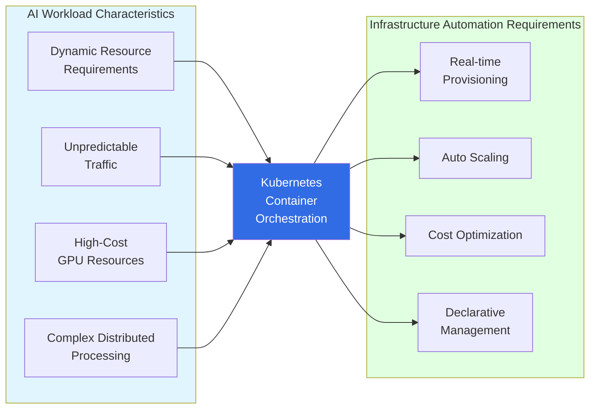

## Why Kubernetes?

Kubernetes is the **ideal foundational platform** that can solve all challenges of Agentic AI platforms:

<K8sCoreFeatures />

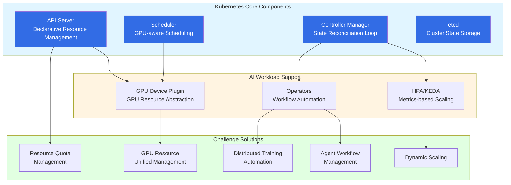

:::info Kubernetes AI Workload Support
Kubernetes provides rich integration with the AI/ML ecosystem including NVIDIA GPU Operator, Kubeflow, and KEDA. This enables **unified management of GPU resource management, distributed training, and model serving on a single platform**.
:::

---

Now that we understand why Kubernetes is suitable for AI workloads, let's examine **specific open source solutions that solve each challenge**.

## Bird's Eye View of Kubernetes Ecosystem Agentic AI Solutions

The Kubernetes ecosystem has **specialized open source solutions** to address each challenge of Agentic AI platforms. These solutions are designed Kubernetes-native to fully leverage the benefits of **declarative management, auto-scaling, and high availability**.

### Solution Mapping Overview

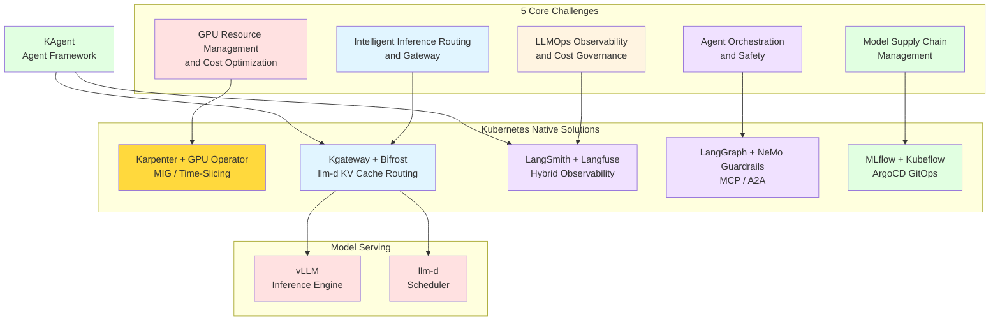

### Detailed Solution Mapping by Challenge

<SolutionMapping />

---

We've now examined various solutions in the Kubernetes ecosystem. Let's delve into **how these solutions actually integrate and operate** from an open source architecture perspective.

## Open Source Ecosystem and Kubernetes Integration Architecture

Agentic AI platforms are composed of various open source projects organically integrated around Kubernetes. This section explains how core open source tools in **GPU resource management, inference routing, LLMOps observability, agent orchestration, and model supply chain** areas cooperate to form a complete Agentic AI platform.

### 1. GPU Resource Management and Cost Optimization

GPUs are the most expensive resource in Agentic AI platforms. **MIG (Multi-Instance GPU) and Time-Slicing** strategies must be appropriately combined based on model size and workload characteristics.

**GPU Allocation Strategy:**

| Model Size | GPU Strategy | Example |
|-----------|----------|------|
| 70B+ parameters | Full GPU (H100/A100) | Llama 3.1 70B, Mixtral 8x22B |
| 7B~30B parameters | MIG (Multi-Instance GPU) | Llama 3.1 8B, Mistral 7B |
| 3B or less parameters | Time-Slicing | Phi-3 Mini, Gemma 2B |

**Node Management Selection Criteria:**

| Criteria | EKS Auto Mode | Karpenter + GPU Operator |
|------|---------------|--------------------------|
| Operational Complexity | Low (managed) | High (self-managed) |
| GPU Fine Control | Limited | Complete MIG/Time-Slicing control |
| Cost Optimization | Basic level | Spot instances, custom NodePool |
| Recommended Scenario | Quick start, small scale | Large scale, fine GPU management needed |

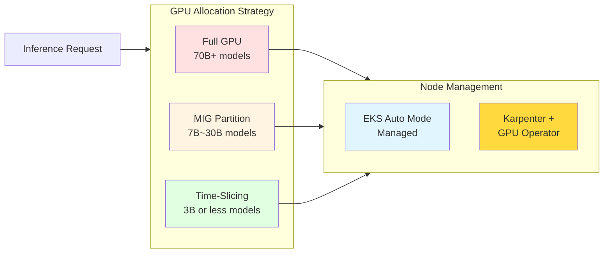

<ModelServingComparison />

**Kubernetes Integration:**

- Deploy as Kubernetes Deployment
- Expose through Service
- Scale with HPA based on queue depth metrics
- GPU allocation through resource requests/limits
- **K8s 1.33+**: In-place resource resizing enables GPU memory adjustment without Pod restart

### 2. Intelligent Inference Routing and Gateway

Agentic AI workloads utilize various models and providers. Combining **2-Tier Gateway Architecture** (kgateway + Bifrost) with **KV Cache-aware routing** (llm-d) achieves optimal performance and cost efficiency.

**2-Tier Gateway Architecture:**

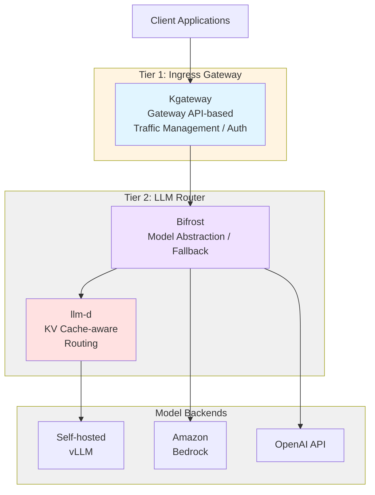

**Key Routing Patterns:**

- **KV Cache-aware Routing (llm-d)**: Maximize prefix cache hit rate to reduce TTFT (Time To First Token)
- **Cascade Routing**: Try low-cost models first, auto-switch to high-performance models on failure (cheap → premium)
- **Semantic Caching**: Return cached responses for semantically similar requests to reduce costs

**Bifrost vs LiteLLM Comparison:**

| Item | Bifrost (Default Recommended) | LiteLLM (Python Ecosystem Alternative) |
|------|---------------------|------------------------------|
| Language | Rust | Python |
| Provider Count | Focus on major providers | 100+ |
| Performance | ~50x faster routing | Standard |
| Feature Scope | Specialized for high-throughput routing | Fallback, Cost tracking, Rate limiting |
| Recommended Scenario | Production, ultra-low latency, large-scale traffic | Python ecosystem integration, many providers needed |

:::tip Bifrost: Production Default Recommendation
**Bifrost** is a high-performance LLM gateway written in Rust, providing about 50x faster routing performance and low latency. It is the default recommended solution for production environments. However, if tight Python ecosystem integration or support for 100+ providers is needed, **LiteLLM** can be considered as an alternative.
:::

> See **[LLM Gateway Architecture](../gateway-agents/inference-gateway-routing.md)** for detailed gateway architecture.

<InferenceGatewayComparison />

**Kubernetes Integration:**

- Kubernetes Gateway API v1.2.0+ standard implementation
- Declarative routing through HTTPRoute resources
- Native integration with Kubernetes Service
- Cross-namespace routing support
- **K8s 1.33+**: Topology-aware routing reduces cross-AZ traffic costs and improves latency

### 3. LLMOps Observability and Cost Governance

#### LangSmith + Langfuse Hybrid Strategy

LLM application observability is difficult to solve with a single tool. A hybrid strategy using **LangSmith in dev/staging environments** and **Langfuse in production environments** is effective.

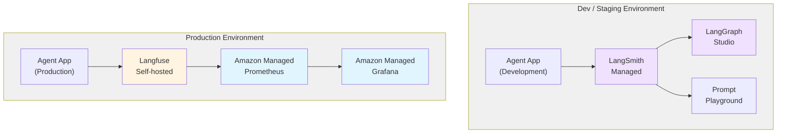

**LangSmith vs Langfuse Comparison:**

| Item | LangSmith | Langfuse |
|------|-----------|----------|
| Environment | Dev / Staging | Production |
| Purpose | Development debugging, prompt experimentation | Production monitoring, cost tracking |
| License | Commercial (free tier available) | MIT (open source) |
| Data Location | LangChain cloud | Self-hosted (data sovereignty) |
| LangGraph Integration | Studio, real-time trace debugging | Basic trace support |
| Infrastructure Monitoring | - | AMP/AMG integration |

**LangSmith Core Strengths:**

- **LangGraph Studio Integration**: Agent graph visualization, step-by-step real-time debugging
- **Prompt Playground**: Prompt A/B testing and version management
- **Real-time Trace Debugging**: Immediate tracking of LLM call chains during development

**Langfuse Core Strengths:**

- **Self-hosted (Data Sovereignty)**: Sensitive production data doesn't leak externally
- **MIT License**: Free for customization and extension
- **Custom Dashboards**: Customized production KPI monitoring for cost, quality, latency
- **AMP/AMG Integration**: Integration with infrastructure monitoring through Prometheus metrics exposure

<ObservabilityComparison />

#### 2-Tier Cost Tracking Architecture

LLM application cost tracking must be managed at both **infrastructure level** and **application level**.

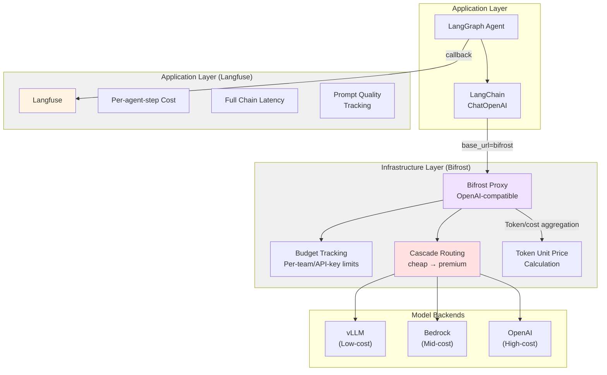

**2-Tier Cost Tracking Components:**

| Layer | Tool | Tracking Target | Purpose |
|------|------|----------|------|
| Infrastructure | Bifrost | Per-model token unit price, per-team/API-key budget, Cascade Routing cost | Infrastructure-level cost control and optimization |
| Application | Langfuse | Per-agent-step cost, full chain latency, prompt quality | Application-level quality and cost tracking |

**Integration Pattern:**

- **LangChain → Bifrost Connection**: Call OpenAI-compatible endpoint with `ChatOpenAI(base_url="http://bifrost:4000/v1")`
- **Langfuse Callback**: Application-level tracking via LangGraph/LangChain callbacks
- **Bifrost Metrics**: Expose infrastructure-level costs as Prometheus metrics

**Kubernetes Integration (Langfuse):**

- Deploy as StatefulSet or Deployment
- Requires PostgreSQL backend (can use managed RDS or cluster configuration)
- Expose Prometheus-format metrics
- SDK integration through Pod environment variables
- **K8s 1.33+**: Stable sidecar containers for stabilized logging and metrics collection sidecars

### 4. Agent Orchestration and Safety

In Agentic AI systems, agents autonomously call tools and interact with external systems. This autonomy creates new challenges in terms of **safety and controllability**.

#### LangGraph Workflow

**LangGraph** manages complex multi-step workflows safely by defining agent execution flow as a **directed graph (DAG)**.

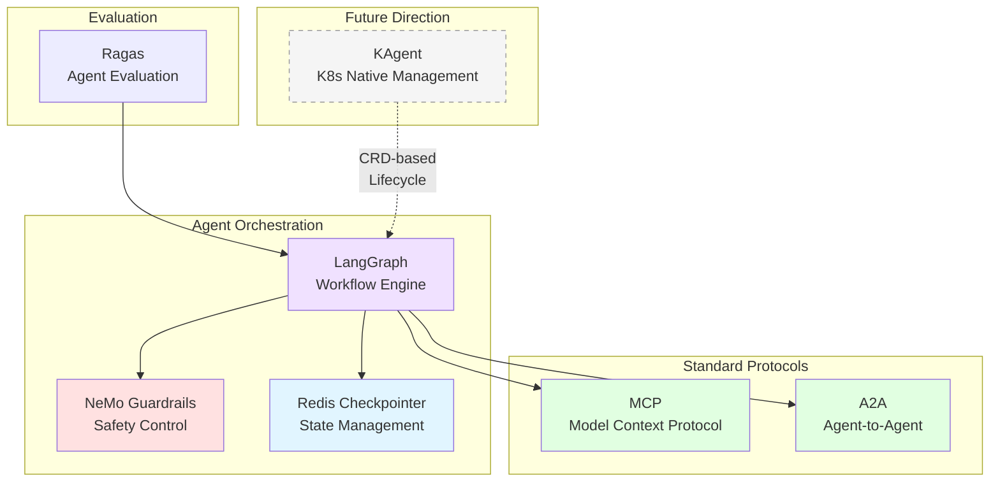

**Core Components:**

- **LangGraph**: Multi-step agent workflow definition, conditional branching, parallel execution
- **NeMo Guardrails**: Prompt injection defense, topic restrictions, output validation
- **MCP (Model Context Protocol)**: Standard protocol for tool connections
  - Provides standardized way for agents to access external systems (DB, API, file system)
  - Agent Ready applications (sales, legal, billing, AICC, etc.) expose tools through MCP
  - Each system operates as MCP server, agents call tools as MCP clients
- **A2A (Agent-to-Agent)**: Standard protocol for inter-agent communication
  - Standardizes task delegation and result delivery between agents in multi-agent systems
  - Ensures interoperability of distributed agent systems
- **Redis Checkpointer**: State storage and recovery for long-running agents
- **Ragas**: Agent response quality evaluation (Faithfulness, Relevance, Correctness)

**Current Deployment Method:** Deploy LangGraph-based agents with standard Kubernetes Deployment + KEDA + ArgoCD GitOps.

<KAgentFeatures />

**Kubernetes Integration:**

- Deploy agent Pods as standard Deployment/StatefulSet
- KEDA-based metric-driven auto-scaling
- Declarative deployment management through ArgoCD GitOps
- Native integration with Kubernetes RBAC
- API key management using Kubernetes Secrets

:::tip Future Direction: Kagent (K8s Native Agent Management)
Currently agents are deployed as standard K8s resources, but the **Kagent pattern** is an advanced approach that declaratively manages agent lifecycles through dedicated CRDs and Operators. As projects mature, defining tool connections, scaling, and health checks in a single YAML with `Agent` CRD can greatly simplify large-scale multi-agent system management. See **[Kagent Agent Management](../gateway-agents/kagent-kubernetes-agents.md)** for detailed design patterns.
:::

> For AWS managed alternatives, see **[Bedrock AgentCore & MCP](../gateway-agents/bedrock-agentcore-mcp.md)**.

### 5. Model Supply Chain Management

Not just model fine-tuning, but **the entire model lifecycle** (training → registry → deployment → feedback) must be systematically managed.

#### MLflow + Kubeflow + ArgoCD GitOps Deployment Pattern

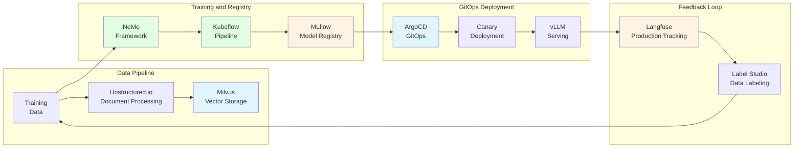

<DistributedTrainingStack />

**Model Supply Chain Core Patterns:**

- **Training**: NeMo Framework + Kubeflow Training Operators (PyTorchJob, MPIJob)
- **Registry**: MLflow Model Registry — Model version management, experiment tracking
- **Deployment**: ArgoCD GitOps — Declarative model deployment, Canary/Blue-Green strategies
- **Hybrid Transfer**: Model transfer between On-Prem ↔ Cloud (S3 Sync, Harbor Registry)
- **RAG Data Pipeline**:
  - Document Processing: Parse various formats (PDF, Word, HTML) with Unstructured.io
  - Embedding Generation: Run embedding models like BGE-M3, E5 in **Triton Inference Server** (dedicated non-LLM inference)
  - Vector Storage: Store and search embeddings in Milvus
  - Triton specializes in serving lightweight models like Embedding and Reranking
- **Feedback Loop**: Langfuse production tracking → Label Studio labeling → Retraining

**Kubernetes Integration:**

- Kubeflow Training Operators (PyTorchJob, MPIJob, etc.)
- Gang scheduling for distributed workloads
- Topology-aware scheduling (node affinity, anti-affinity)
- CSI driver integration for shared storage (FSx for Lustre)

---

### Solution Stack Integration Architecture

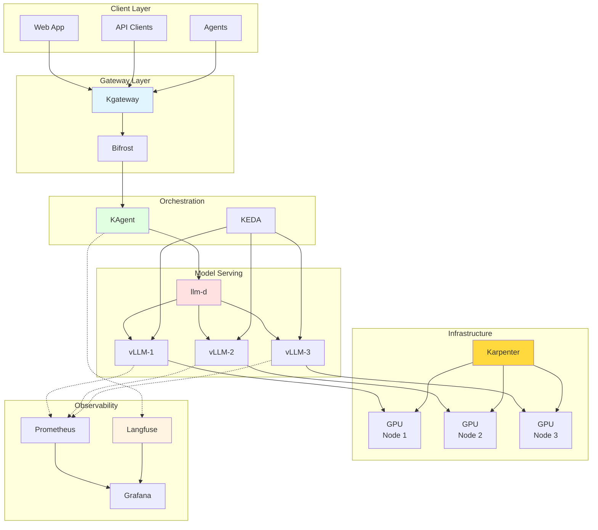

---

### Open Source Integration Complete Architecture

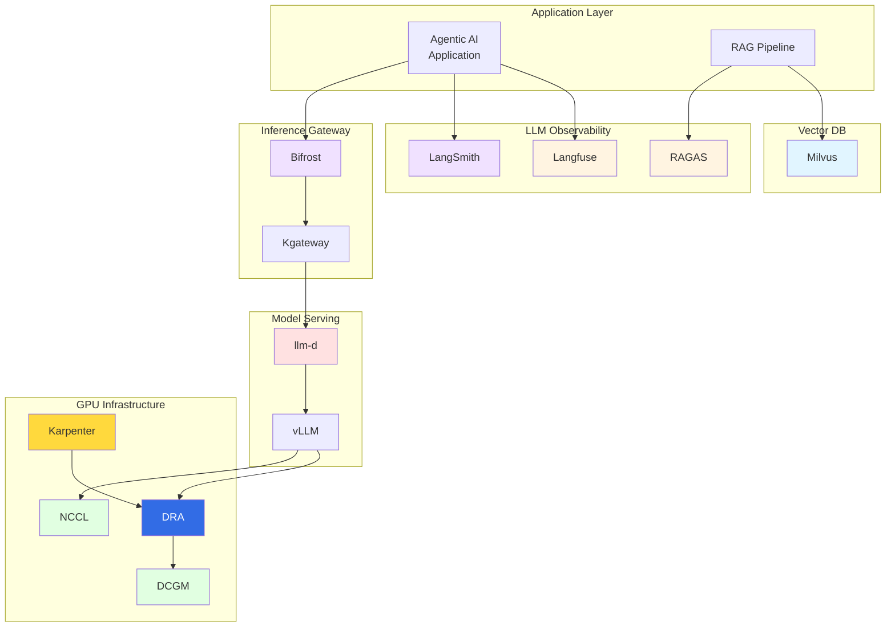

### Layer-by-Layer Open Source Roles and Integration

#### LLM Observability Layer: Langfuse, LangSmith, RAGAS

Core tools for **tracking and evaluating the entire lifecycle** of LLM applications.

<ObservabilityLayerStack />

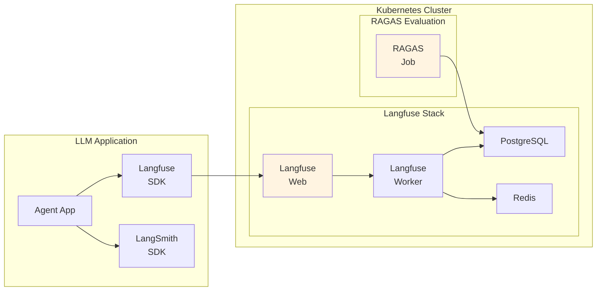

**Langfuse Kubernetes Deployment Example:**

```yaml
apiVersion: apps/v1
kind: Deployment
metadata:
  name: langfuse-web
  namespace: observability
spec:
  replicas: 2
  selector:
    matchLabels:
      app: langfuse-web
  template:
    spec:
      containers:
        - name: langfuse
          image: langfuse/langfuse:latest
          env:
            - name: DATABASE_URL
              valueFrom:
                secretKeyRef:
                  name: langfuse-secrets
                  key: database-url
            - name: NEXTAUTH_SECRET
              valueFrom:
                secretKeyRef:
                  name: langfuse-secrets
                  key: nextauth-secret
          resources:
            requests:
              memory: "512Mi"
              cpu: "250m"
---
apiVersion: batch/v1
kind: CronJob
metadata:
  name: ragas-evaluation
  namespace: observability
spec:
  schedule: "0 */6 * * *"  # Run every 6 hours
  jobTemplate:
    spec:
      template:
        spec:
          containers:
            - name: ragas
              image: ragas/ragas:latest
              command: ["python", "-m", "ragas.evaluate"]
              env:
                - name: LANGFUSE_HOST
                  value: "http://langfuse-web:3000"
          restartPolicy: OnFailure
```

#### Inference Gateway Layer: Bifrost

**Bifrost** abstracts major LLM providers into a **high-performance OpenAI-compatible API**.

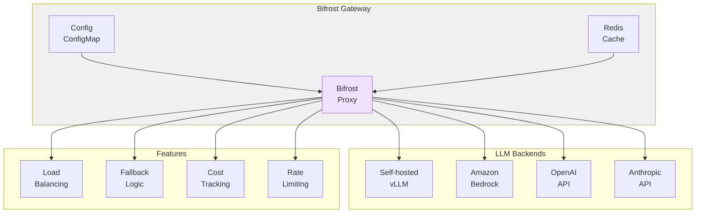

**Bifrost Kubernetes Deployment Example:**

```yaml
apiVersion: apps/v1
kind: Deployment
metadata:
  name: bifrost-proxy
  namespace: ai-gateway
spec:
  replicas: 3
  selector:
    matchLabels:
      app: bifrost
  template:
    spec:
      containers:
        - name: bifrost
          image: ghcr.io/maximhq/bifrost:latest
          ports:
            - containerPort: 4000
          env:
            - name: BIFROST_MASTER_KEY
              valueFrom:
                secretKeyRef:
                  name: bifrost-secrets
                  key: master-key
            - name: REDIS_HOST
              value: "redis-cache"
          volumeMounts:
            - name: config
              mountPath: /app/config.yaml
              subPath: config.yaml
      volumes:
        - name: config
          configMap:
            name: bifrost-config
---
apiVersion: v1
kind: ConfigMap
metadata:
  name: bifrost-config
  namespace: ai-gateway
data:
  config.yaml: |
    model_list:
      - model_name: gpt-4
        bifrost_params:
          model: openai/gpt-4
          api_key: os.environ/OPENAI_API_KEY
      - model_name: claude-3
        bifrost_params:
          model: anthropic/claude-3-opus
          api_key: os.environ/ANTHROPIC_API_KEY
      - model_name: llama-70b
        bifrost_params:
          model: openai/llama-70b
          api_base: http://vllm-llama:8000/v1

    router_settings:
      routing_strategy: least-busy
      enable_fallbacks: true

    general_settings:
      master_key: os.environ/BIFROST_MASTER_KEY
```

#### Distributed Inference Layer: llm-d

**llm-d** is a scheduler that **intelligently distributes** LLM inference requests in Kubernetes environments.

<LlmdFeatures />

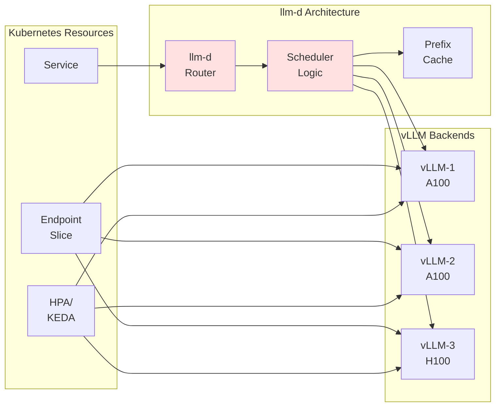

**llm-d Kubernetes Deployment Example:**

```yaml
apiVersion: apps/v1
kind: Deployment
metadata:
  name: llm-d-router
  namespace: ai-inference
spec:
  replicas: 2
  selector:
    matchLabels:
      app: llm-d
  template:
    spec:
      containers:
        - name: llm-d
          image: ghcr.io/llm-d/llm-d:latest
          ports:
            - containerPort: 8080
          env:
            - name: BACKENDS
              value: "vllm-0.vllm:8000,vllm-1.vllm:8000,vllm-2.vllm:8000"
            - name: ROUTING_STRATEGY
              value: "prefix-aware"
            - name: PROMETHEUS_ENDPOINT
              value: "http://prometheus:9090"
          resources:
            requests:
              memory: "256Mi"
              cpu: "500m"
---
apiVersion: v1
kind: Service
metadata:
  name: llm-d
  namespace: ai-inference
spec:
  selector:
    app: llm-d
  ports:
    - port: 8080
      targetPort: 8080
```

#### Vector Database Layer: Milvus

Milvus, the core component of RAG pipelines, operates with a distributed architecture on Kubernetes.

See **[Milvus Vector Database](../gateway-agents/milvus-vector-database.md)** for details.

**Key Features of Milvus:**

- **Distributed Architecture**: Independently scale Query/Data/Index Nodes
- **Kubernetes Operator**: CRD-based declarative management
- **GPU Acceleration**: Fast index building with GPUs in Index Nodes
- **S3 Integration**: Can use Amazon S3 as persistent storage

---

## GPU Infrastructure and Resource Management

GPU resource management is the core of Agentic AI platforms. See the following documents for details:

- **[GPU Resource Management](../model-serving/gpu-resource-management.md)**: Device Plugin, DRA (Dynamic Resource Allocation), GPU topology-aware scheduling
- **[NeMo Framework](../model-serving/nemo-framework.md)**: Distributed training and NCCL optimization

:::tip Key Concepts in GPU Management

- **Device Plugin**: Kubernetes' basic GPU allocation mechanism
- **DRA (Dynamic Resource Allocation)**: Flexible resource management in Kubernetes 1.26+
- **NCCL**: High-performance communication library for distributed GPU training
:::

### GPU Infrastructure Stack Overview

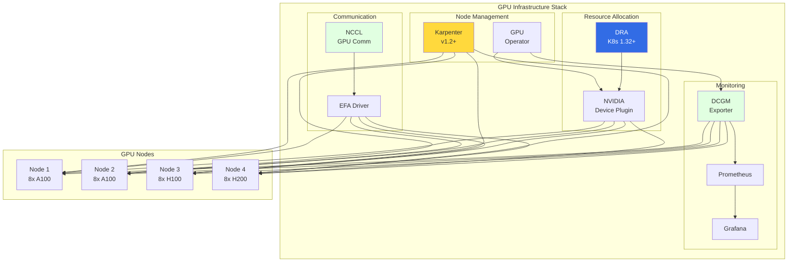

<GpuInfraStack />

---

## Conclusion: Why Kubernetes for Agentic AI?

Kubernetes provides the **fundamental infrastructure layer** that makes modern Agentic AI platforms possible:

### Key Advantages

1. **Unified Platform**: Single platform for inference, training, and orchestration
2. **Declarative Management**: Version-controlled Infrastructure as Code
3. **Rich Ecosystem**: Extensive open source solutions for AI workloads
4. **Cloud Portability**: Runs anywhere (on-premises, AWS, GCP, Azure)
5. **Mature Tooling**: kubectl, Helm, operators, monitoring stacks
6. **Active Community**: Kubernetes AI/ML SIG drives innovation

### Future Direction

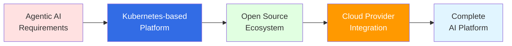

Recommendations for organizations building Agentic AI platforms:

1. **Start with Kubernetes**: Establish Kubernetes expertise within the team
2. **Leverage Open Source**: Adopt proven solutions (vLLM, Langfuse, etc.)
3. **Cloud Integration**: Combine open source and managed services
4. **Infrastructure Automation**: Implement auto-scaling and provisioning
5. **Comprehensive Observability**: Ensure comprehensive observability from day one

## Next Steps

This document examined five core challenges of Agentic AI workloads and the Kubernetes-based open source ecosystem.

:::info Next Steps: Two Approach Paths

Compare and choose between two approaches to solving the challenges:

**Path A: [AWS Native Platform](./aws-native-agentic-platform.md)** — Managed service-centric
- Focus on agent development and business logic instead of infrastructure operations
- Leverage AWS services like Bedrock, AgentCore, Step Functions
- Suitable when small team, fast launch is priority

**Path B: [EKS-Based Solutions](./agentic-ai-solutions-eks.md)** — Open source-based complete control
- Fine control with open source tools like vLLM, LangGraph, Bifrost
- Directly optimize GPU resources, inference engines, routing
- Suitable when dedicated platform team, complete infrastructure control needed
:::

---

## References

### Kubernetes and Infrastructure

- [Kubernetes Official Documentation](https://kubernetes.io/docs/)
- [Karpenter Official Documentation](https://karpenter.sh/docs/)
- [Amazon EKS Best Practices Guide](https://docs.aws.amazon.com/eks/latest/best-practices/introduction.html)
- [NVIDIA GPU Operator Documentation](https://docs.nvidia.com/datacenter/cloud-native/gpu-operator/overview.html)
- [KEDA - Kubernetes Event-driven Autoscaling](https://keda.sh/)

### Model Serving and Inference

- [vLLM Documentation](https://docs.vllm.ai/)
- [llm-d Project](https://github.com/llm-d/llm-d)
- [Kgateway Documentation](https://kgateway.io/docs/)
- [Bifrost - High-performance LLM Gateway](https://github.com/maximhq/bifrost)
- [LiteLLM Documentation](https://docs.litellm.ai/)

### LLM Observability

- [Langfuse Documentation](https://langfuse.com/docs)
- [Langfuse v3 Release](https://langfuse.com/blog/langfuse-v3)
- [LangSmith Documentation](https://docs.smith.langchain.com/)
- [RAGAS Documentation](https://docs.ragas.io/)

### Agent Orchestration

- [LangGraph Documentation](https://langchain-ai.github.io/langgraph/)
- [NeMo Guardrails](https://github.com/NVIDIA/NeMo-Guardrails)
- [Model Context Protocol (MCP)](https://modelcontextprotocol.io/)

### Vector Database

- [Milvus Documentation](https://milvus.io/docs)
- [Milvus Operator](https://github.com/milvus-io/milvus-operator)

### GPU Infrastructure

- [NVIDIA GPU Operator Documentation](https://docs.nvidia.com/datacenter/cloud-native/gpu-operator/latest/)
- [DCGM Exporter](https://github.com/NVIDIA/dcgm-exporter)
- [NCCL Documentation](https://docs.nvidia.com/deeplearning/nccl/user-guide/docs/index.html)
- [AWS EFA Documentation](https://docs.aws.amazon.com/AWSEC2/latest/UserGuide/efa.html)

### Agent Framework and Training

- [KAgent - Kubernetes Agent Framework](https://github.com/kagent-dev/kagent)
- [NVIDIA NeMo Framework](https://docs.nvidia.com/nemo-framework/user-guide/latest/overview.html)
- [Kubeflow Documentation](https://www.kubeflow.org/docs/)
