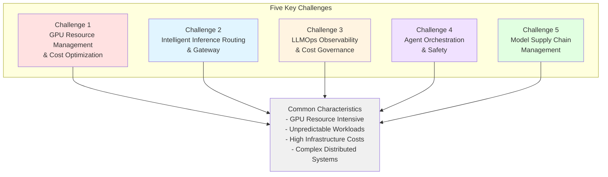
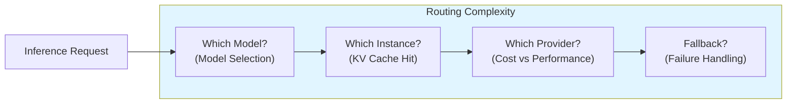
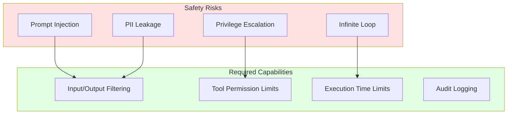
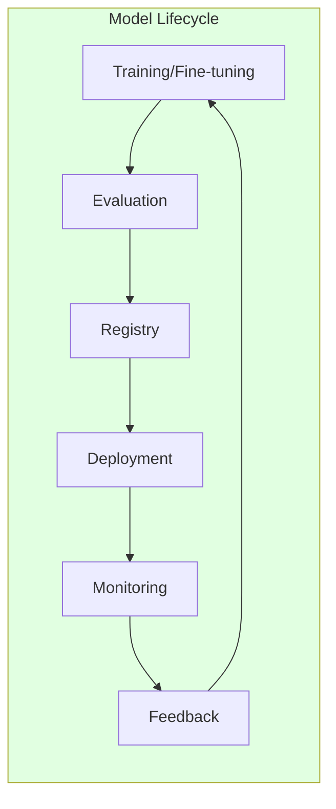

import { ChallengeSummary } from '@site/src/components/AgenticChallengesTables';

> 📅 **Created**: 2025-02-05 | **Updated**: 2026-03-20 | ⏱️ **Reading Time**: ~5 minutes

## Introduction

When building and operating Agentic AI platforms, platform engineers and architects face technical challenges fundamentally different from traditional web applications. This document analyzes **5 key challenges**.

:::info Prerequisites
Before reading this document, review the overall structure of the Agentic AI Platform in [Platform Architecture](./agentic-platform-architecture.md).
:::

## Five Key Challenges of Agentic AI Platform

Agentic AI systems leveraging Frontier Models (cutting-edge large language models) have **fundamentally different infrastructure requirements** compared to traditional web applications.

### Challenge Summary

<ChallengeSummary />

:::warning Limitations of Traditional Infrastructure Approaches
Traditional VM-based infrastructure or manual management approaches cannot effectively respond to Agentic AI's **dynamic and unpredictable workload patterns**. The high cost of GPU resources and complex distributed system requirements make **automated infrastructure management** essential.
:::

---

## Challenge 1: GPU Resource Management and Cost Optimization

GPUs are the **most expensive resource** in Agentic AI platforms. Appropriate GPU allocation strategies are needed based on model size and workload characteristics.

**Why is it difficult:**

- **High Cost**: GPU instances are 10~100x more expensive than CPU (H100 8-GPU ~$98/hour)
- **Diverse Model Sizes**: GPU memory requirements vary drastically from 3B parameter models to 70B+ models
- **Dynamic Workloads**: Inference traffic fluctuates by 10x or more depending on time of day
- **Idle Waste**: Provisioned GPUs with low utilization result in massive cost waste
- **Multi-tenancy**: Multiple models and teams must share limited GPUs

| Model Size | GPU Requirements | Cost Pressure |
|-----------|-------------|----------|
| 70B+ parameters | Full GPU (H100/A100) 8 cards | $30~$98/hour |
| 7B~30B parameters | 1~2 GPUs or MIG partitions | $1~$10/hour |
| 3B or less parameters | Time-Slicing or shared GPU | $0.5~$2/hour |

---

## Challenge 2: Intelligent Inference Routing and Gateway

Agentic AI workloads utilize **multiple models and providers** simultaneously. Intelligent routing that understands model characteristics is needed, not just simple load balancing.

**Why is it difficult:**

- **Multi-model Operations**: Operating diverse models (Llama, Qwen, Claude, GPT) on a single platform simultaneously
- **KV Cache Efficiency**: Routing without considering LLM KV Cache state significantly degrades performance
- **Cost-Performance Tradeoff**: Dynamically selecting between low-cost and high-performance models based on task complexity
- **Provider Diversification**: Unified management of self-hosted models and external APIs (Bedrock, OpenAI)
- **Canary/A-B Deployment**: Safe traffic shifting for new model versions

---

## Challenge 3: LLMOps Observability and Cost Governance

LLM-based systems have **fundamentally different observability requirements** compared to traditional applications. Token-level cost tracking, Agent workflow debugging, and prompt quality monitoring are necessary.

**Why is it difficult:**

- **Non-deterministic Output**: Same input produces different outputs, making traditional testing/monitoring insufficient
- **Token Cost Tracking**: Dual tracking of infrastructure costs (GPU) and application costs (tokens) required
- **Multi-step Debugging**: Difficult to identify bottlenecks in complex chains where Agents call multiple tools
- **Prompt Quality**: Real-time detection of prompt performance degradation in production
- **Team Budgets**: Per-team cost allocation and limit management in shared AI infrastructure

| Observability Area | Traditional Apps | LLM Applications |
|------------|----------------|----------------|
| Cost Tracking | Infrastructure only | Dual: Infrastructure + Token costs |
| Debugging | Request-response logs | Multi-step Agent Traces |
| Quality Monitoring | Error rate, latency | Faithfulness, Relevance, Hallucination |
| Budget Management | Resource-based | Model/Team token budgets |

---

## Challenge 4: Agent Orchestration and Safety

In Agentic AI systems, Agents **autonomously call tools and interact with external systems**. This autonomy creates new challenges in terms of safety and controllability.

**Why is it difficult:**

- **Autonomous Behavior**: Agents make autonomous decisions to call tools, potentially leading to unexpected actions
- **Prompt Injection**: Risk of malicious input causing Agents to perform unintended tasks
- **Tool Connection Standardization**: Need for standards to safely connect diverse external systems (DB, API, files) to Agents
- **Multi-Agent Communication**: Safe and efficient communication protocols needed when multiple Agents collaborate
- **State Management**: Long-running Agents need state persistence, recovery, and checkpointing
- **Scaling**: Agent workloads are CPU-based but irregular traffic patterns make efficient scaling difficult

---

## Challenge 5: Model Supply Chain Management

Beyond simply deploying models, the **entire model lifecycle** (training → evaluation → registry → deployment → feedback) must be systematically managed.

**Why is it difficult:**

- **Model Version Management**: Managing diverse artifacts including foundation models, fine-tuned models, adapters (LoRA)
- **Distributed Training Infrastructure**: Large-scale model fine-tuning requires multi-node GPU clusters and high-speed networks (EFA)
- **Evaluation Pipeline**: Automatically evaluating model quality and setting deployment gates
- **Safe Deployment**: Minimizing service impact during model updates with Canary/Blue-Green deployments
- **Hybrid Environments**: Model transfer and synchronization between on-premises and cloud GPUs
- **RAG Data Pipeline**: Continuous update pipeline for document processing, embedding generation, vector storage
- **Feedback Loop**: Continuous improvement system reflecting production trace data in retraining

---

## Next Steps: Approaches to Solving Challenges

Two approaches to solving these 5 challenges are presented:

1. **[AWS Native Platform](./aws-native-agentic-platform.md)**: Minimize infrastructure operational burden and focus on Agent development using AWS managed services (Bedrock, AgentCore)
2. **[EKS-Based Open Architecture](./agentic-ai-solutions-eks.md)**: Achieve granular control and cost optimization using Amazon EKS and the open-source ecosystem

The two approaches are **complementary** and can be combined based on workload characteristics.

| Criteria | AWS Native | EKS-Based Open Architecture |
|------|-----------|----------------------|
| GPU Management | Not required (serverless) | Karpenter auto-provisioning |
| Model Selection | Bedrock-supported models | All Open Weight models |
| Operational Burden | Minimal | Medium (reduced with Auto Mode) |
| Cost Optimization | Usage-based pricing | Granular control: Spot, Consolidation, etc. |
| Customization | Limited | Full flexibility |

:::tip Which Approach to Choose?
- **Quick start and focus on Agent logic**: AWS Native Platform
- **Open Weight models + hybrid + cost optimization**: EKS-Based Open Architecture
- **Realistic optimal solution**: Combination of both (start with AWS Native, expand to EKS as needed)
:::
