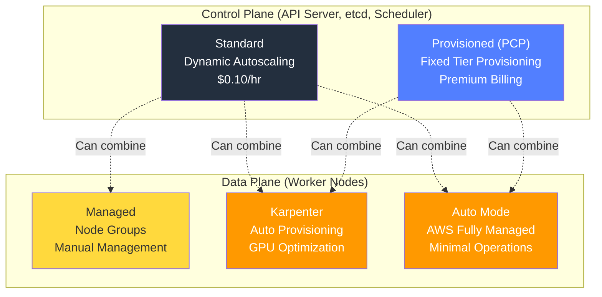
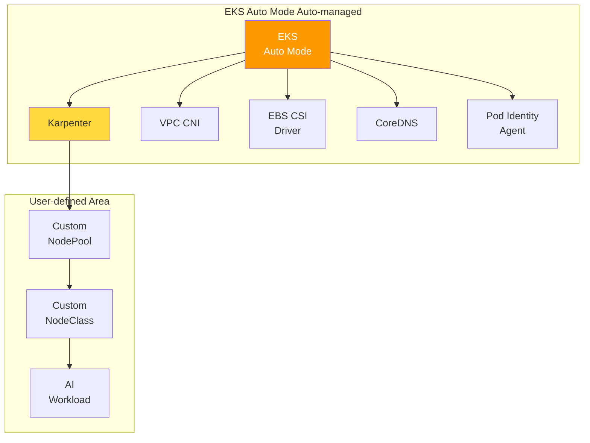
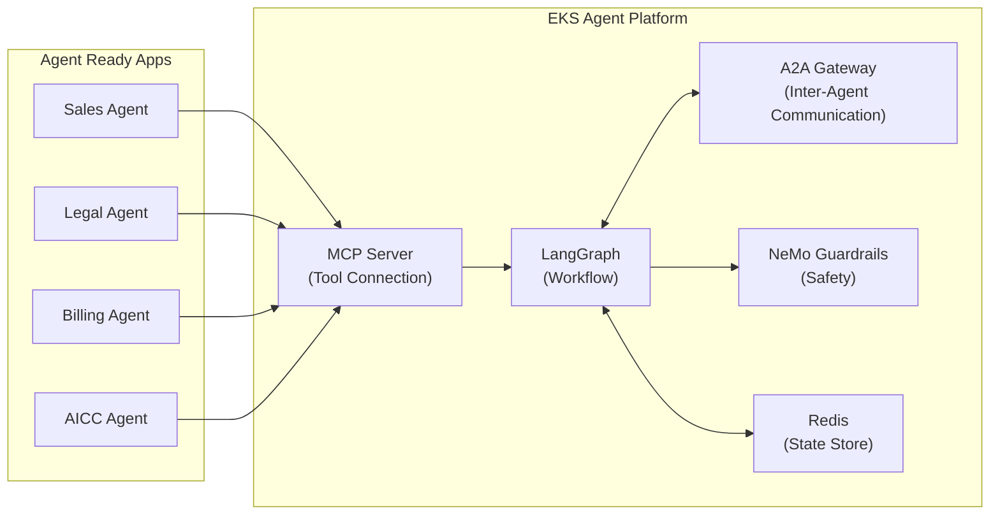
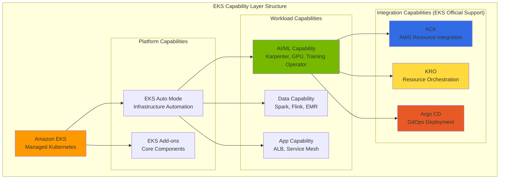
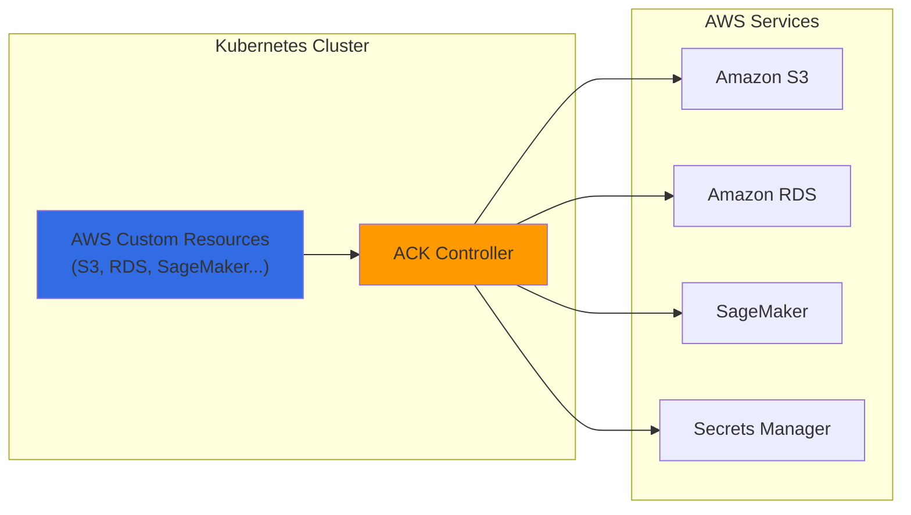
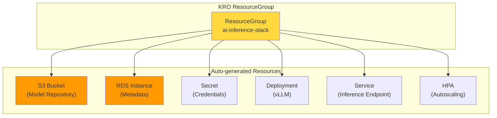
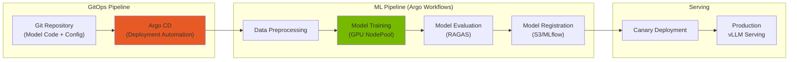
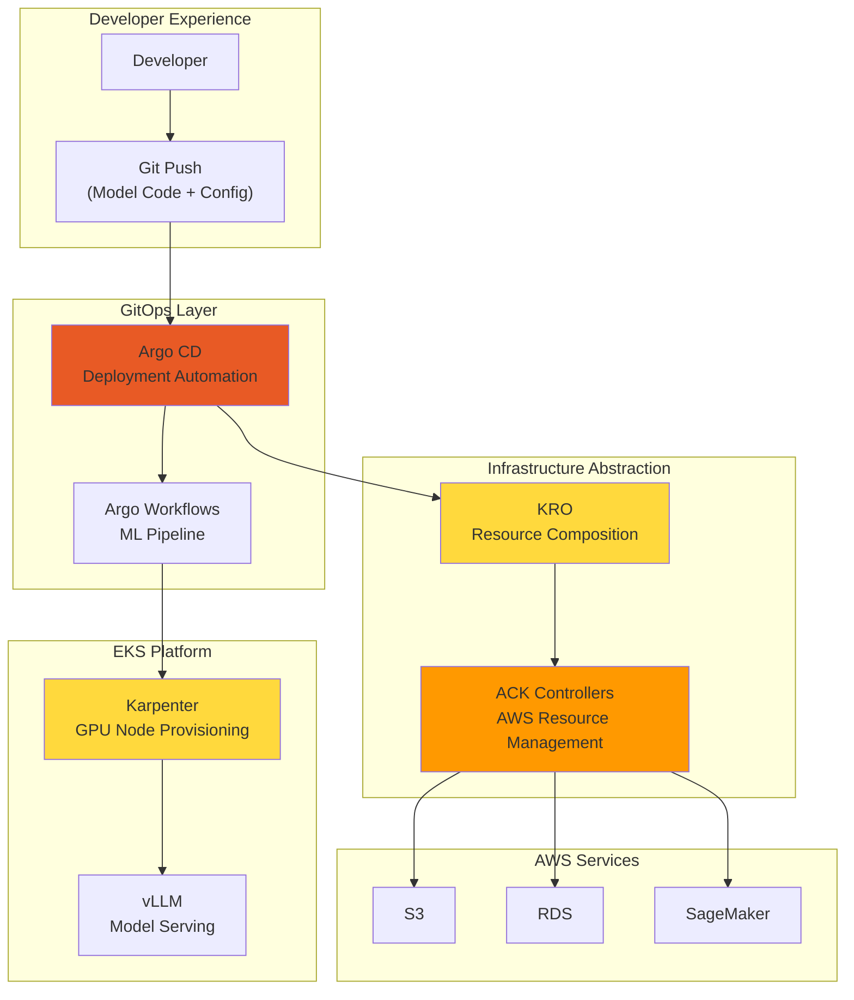
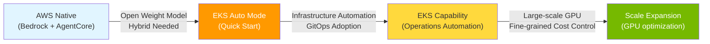

import Tabs from '@theme/Tabs';
import TabItem from '@theme/TabItem';
import {
  EksKarpenterLayers,
  ClusterAutoscalerVsKarpenter,
  KarpenterKeyFeatures,
  EksAutoModeVsStandard,
  DeploymentTimeComparison,
  EksIntegrationBenefits,
  EksCapabilities,
  AckControllers,
  AutomationComponents,
  EksAutoModeBenefits,
  ChallengeSolutionsSummary,
  EksClusterConfiguration
} from '@site/src/components/AgenticSolutionsTables';

> 📅 **Created**: 2025-02-05 | **Updated**: 2026-04-17 | ⏱️ **Reading Time**: ~12 minutes

:::info Prerequisite Documents
Before reading this document, refer to the following documents first:
- [Platform Architecture](./agentic-platform-architecture.md) — Structure and core layers of Agentic AI Platform
- [Technical Challenges](./agentic-ai-challenges.md) — 5 core challenges
- [AI Platform Selection Guide](./ai-platform-decision-framework.md) — Managed vs open-source decision
- [AWS Native Platform](./aws-native-agentic-platform.md) — Managed service-based alternative approach (for comparison)
:::

---

## Part 1: Why EKS-based Open Architecture?

[AWS Native Platform](./aws-native-agentic-platform.md) is a powerful approach for quick start. However, when the following requirements arise, **EKS-based open architecture** is needed:

- **Self-hosted Open Weight Models** (Llama, Qwen, DeepSeek)
- **Hybrid Architecture** (on-premises GPU + cloud)
- **Custom Agent Workflows** (LangGraph, MCP/A2A)
- **Multi-provider Routing** (Bifrost 2-Tier Gateway)
- **Fine-grained GPU Cost Optimization** (Spot, MIG, Consolidation)

:::tip Platform Comparison
For 5-axis comparison of AWS Native, SageMaker Unified Studio, EKS open architecture, and hybrid, refer to [AI Platform Selection Guide](./ai-platform-decision-framework.md#platform-comparison-matrix).
:::

**Key Message: AWS Native → EKS is a complementary relationship.** A realistic approach is to **start with AWS Native and expand to EKS as needed**. Both approaches can coexist within the same VPC.

---

## Part 2: Quick Start with EKS Auto Mode

### EKS Cluster Configuration Options: Control Plane and Data Plane

EKS cluster configuration is divided into **two independent layers**.



### Provisioned Control Plane (PCP)

**PCP** is a premium option that provisions control plane capacity in advance with fixed tiers, ensuring consistent API server performance.

#### PCP Tier Specifications

| Tier | API Concurrency (seats) | Pod Scheduling | etcd DB | SLA | Cost |
|------|:-----------------:|:----------:|:------:|:---:|-----:|
| **Standard** | Dynamic (AWS auto-adjusted) | Dynamic | 8GB | 99.95% | $0.10/hr |
| **XL** | 1,700 | 167/sec | 16GB | 99.99% | - |
| **2XL** | 3,400 | 283/sec | 16GB | 99.99% | - |
| **4XL** | 6,800 | 400/sec | 16GB | 99.99% | - |
| **8XL** | 13,600 | 400/sec | 16GB | 99.99% | - |

> Source: [AWS EKS Provisioned Control Plane Official Documentation](https://docs.aws.amazon.com/eks/latest/userguide/eks-provisioned-control-plane.html) (K8s 1.30+ baseline). For PCP tier pricing, refer to AWS official pricing page.

#### Tier Selection Criteria: Metric-based Judgment

:::warning Worker Node Count Is Not PCP Tier Selection Criterion
PCP tier should be selected based on **Kubernetes control plane metrics**.
:::

**Key Monitoring Metrics:**

| Metric | Prometheus Query | Judgment Criterion |
|--------|----------------|----------|
| **API Inflight Seats** (Most important) | `apiserver_flowcontrol_current_executing_seats_total` | 1,200 seats Sustained exceeds → XL or higher |
| **Pod Scheduling Rate** | `scheduler_schedule_attempts_SCHEDULED` | 100/sec or more → XL, 200/sec or more → 2XL |
| **etcd DB Size** | `apiserver_storage_size_bytes` | 10GB Exceeds → XL or higher needed |

:::info PCP vs Auto Mode — Different Layers
**PCP** is a control plane capacity option, and **Auto Mode** is a data plane management option. Both features **can be used in combination**.
:::

### Control Plane × Data Plane Comparison and Combination

<EksClusterConfiguration />

:::tip Recommended Configuration by AI Platform Scale
- **Small-scale (PoC/demo)**: Standard + Auto Mode — Minimal operational burden, 99.95% SLA
- **Medium-scale (production inference)**: Standard + Karpenter — GPU cost optimization, 99.95% SLA
- **Large-scale (enterprise AI)**: PCP XL + Auto Mode — API seats ≤ 1,700, 99.99% SLA
- **Extra-large-scale (training cluster)**: PCP 4XL+ + Karpenter — API seats ≤ 6,800+, fine-grained GPU control
:::

---

### Amazon EKS and Karpenter: Maximizing Kubernetes Advantages

**The combination of Amazon EKS and Karpenter** maximizes Kubernetes advantages to implement fully automated optimal infrastructure. Karpenter provides node provisioning optimized for AI workloads, enabling faster scaling and finer-grained instance selection compared to existing Cluster Autoscaler.

:::info Karpenter Detailed Guide
For Karpenter v1.0+ GA features, NodePool configuration, GPU instance comparison, and cost optimization strategies, refer to [GPU Resource Management](../model-serving/gpu-infrastructure/gpu-resource-management.md).
:::

<EksKarpenterLayers />

### EKS Auto Mode: Complete Automation

**EKS Auto Mode** automatically configures and manages core components including Karpenter.



#### EKS Auto Mode vs Manual Configuration Comparison

<EksAutoModeVsStandard />

#### for GPU Workloads EKS Auto Mode Configuration

EKS Auto Mode automatically configures and manages Karpenter. GPU NodePool addition enables immediate AI workload deployment.

:::tip NodePool Configuration Details
For detailed configuration including GPU NodePool composition, Spot/On-Demand strategy, Consolidation policy, refer to [GPU Resource Management](../model-serving/gpu-infrastructure/gpu-resource-management.md#karpenter-nodepool-configuration).
:::

:::info EKS Auto Mode and GPU Support
EKS Auto Mode fully supports accelerated computing instances including NVIDIA GPU.

**re:Invent 2024/2025 New Features:**
- **EKS Hybrid Nodes (GA)**: Integrate on-premises GPU infrastructure into EKS cluster
- **Enhanced Pod Identity v2**: Cross-account IAM role support
- **Native Inferentia/Trainium Support**: Automatic Neuron SDK configuration
- **Provisioned Control Plane**: Pre-provisioning for large-scale AI training workloads
:::

---

### Agentic AI Components Deployable on Auto Mode

All core components of Agentic AI platform can be deployed on EKS Auto Mode.

#### Inference: vLLM + llm-d

**vLLM** is an LLM inference-dedicated engine, and **llm-d** provides intelligent routing considering KV Cache state.

:::info Model Serving Stack Configuration
- **vLLM**: LLM inference-dedicated (GPT, Claude, Llama, etc.) — PagedAttention-based KV Cache optimization
- **Triton Inference Server**: Handles non-LLM inference (embedding, reranking, Whisper STT)
- **llm-d**: Maximize prefix cache hit rate with KV Cache-aware routing

For detailed configuration, refer to [vLLM Model Serving](../model-serving/inference-frameworks/vllm-model-serving.md) and [llm-d Distributed Inference](../model-serving/inference-frameworks/llm-d-eks-automode.md).
:::

#### Gateway: kgateway + Bifrost (2-Tier Gateway)

Separate traffic management and model routing with 2-Tier Gateway architecture:
- **Tier 1 (kgateway)**: Gateway API-based authentication, rate limiting, traffic management
- **Tier 2 (Bifrost)**: Model abstraction, fallback, cost tracking, cascade routing

> For detailed architecture, refer to [Inference Gateway Routing](../reference-architecture/inference-gateway-routing.md).

#### Agent: LangGraph + NeMo Guardrails + MCP/A2A

Agent workflows on EKS consist of:



- **LangGraph**: Multi-step agent workflow definition, conditional branching, parallel execution
- **NeMo Guardrails**: Prompt injection defense, PII leak prevention, output validation — Tool comparison and implementation details in [AI Gateway Guardrails](../operations-mlops/ai-gateway-guardrails.md)
- **MCP**: Agent Ready apps provide tools in standardized way
- **A2A**: Safe and efficient communication between agents
- **Redis (ElastiCache)**: State management with LangGraph checkpointer

Agent pods autoscale based on Redis queue length via KEDA.

> Details in [Kagent Agent Management](../operations-mlops/kagent-kubernetes-agents.md) and [AWS Native Platform — AgentCore & MCP](./aws-native-agentic-platform.md#mcp-protocol-and-eks-integration). For Guardrails technology stack (Input/Output Guard, Tool Allow-list, kgateway/Bifrost integration), refer to [AI Gateway Guardrails](../operations-mlops/ai-gateway-guardrails.md).

#### RAG + Observability

- **Milvus**: Vector DB — Core of RAG system ([Details](../operations-mlops/milvus-vector-database.md))
- **Langfuse**: Production LLM tracing, token cost tracking ([Architecture](../operations-mlops/agent-monitoring.md), [Deployment Guide](../reference-architecture/monitoring-observability-setup.md))
- **Prometheus + Grafana**: Infrastructure metrics monitoring

---

### EKS-based Easy Deployment

<DeploymentTimeComparison />

#### EKS Deployment Methods by Solution

<EksIntegrationBenefits />

#### Easy Deployment Example

For deployment guide, refer to [Reference Architecture](../reference-architecture/).

:::info GPU Cost optimization Details
For GPU cost optimization strategies including Spot instance usage, Consolidation, and schedule-based cost management, refer to [GPU Resource Management](../model-serving/gpu-infrastructure/gpu-resource-management.md) document.
:::

:::info GPU Security and Troubleshooting
GPU Pod security policies, Network Policy, IAM, MIG isolation, and GPU troubleshooting guide, refer to [EKS GPU Node Strategy](../model-serving/gpu-infrastructure/eks-gpu-node-strategy.md) document.
:::

---

## Part 3: Minimize Infrastructure Operational Burden with EKS Capability

### What is EKS Capability?

**EKS Capability** are platform-level capabilities that integrate proven open-source tools and AWS services



### Core EKS Capabilities for Agentic AI

<EksCapabilities />

:::warning Argo Workflows Requires Separate Installation
**Argo Workflows** is not officially supported as EKS Capability, so **direct installation is required**.

For deployment guide, refer to [Argo Workflows Official Documentation](https://argoproj.github.io/argo-workflows/installation/).
:::

---

### ACK (AWS Controllers for Kubernetes)

**ACK** directly provisions and manages AWS services through Kubernetes Custom Resources. It can be **easily installed as EKS Add-on**.



**ACK Usage Examples in AI Platform:**

<AckControllers />

**S3 Bucket Creation Example with ACK:**

```yaml
apiVersion: s3.services.k8s.aws/v1alpha1
kind: Bucket
metadata:
  name: agentic-ai-models
  namespace: ai-platform
spec:
  name: agentic-ai-models-prod
  versioning:
    status: Enabled
  encryption:
    rules:
    - applyServerSideEncryptionByDefault:
        sseAlgorithm: aws:kms
  tags:
  - key: Project
    value: agentic-ai
```

### KRO (Kubernetes Resource Orchestrator)

**KRO** **combines multiple Kubernetes resources and AWS resources into one abstracted unit** to deploy complex infrastructure simply.



**Deploy AI Inference Stack as Single Resource with KRO:**

```yaml
# Deploy entire stack as single resource
apiVersion: v1alpha1
kind: AIInferenceStack
metadata:
  name: llama-inference
  namespace: ai-platform
spec:
  modelName: llama-3-70b
  gpuType: g5.12xlarge
  minReplicas: 2
  maxReplicas: 20
```

### Argo-based ML Pipeline Automation

Combining **Argo Workflows** and **Argo CD** enables **full MLOps pipeline automation in GitOps style** from AI model training, evaluation, to deployment.



### ACK + KRO + ArgoCD Integration Architecture



<AutomationComponents />

:::info Benefits of Complete Automation — Delegate Infrastructure Operations to EKS and Focus on Agent Development
- **Developer**: Git pushdeploys models with just Git push
- **Platform Team**: Minimize infrastructure management burden
- **Cost Optimization**: Dynamic provisioning of only necessary resources
- **Consistency**: Same deployment method across all environments
:::

---

## Part 4: Conclusion + Next Steps

### Progressive Journey: AWS Native → Auto Mode → EKS Capability



### EKS Auto Mode: Recommended Starting Point

<EksAutoModeBenefits />

### Solution Summary by Challenge

<ChallengeSolutionsSummary />

### EKS Auto Mode GPU Limitations and Hybrid Strategy

EKS Auto Mode is optimal for general workloads and basic GPU inference, but has limitations for advanced GPU features.

| Workload Type | Auto Mode Suitability | Reason |
|---|---|---|
| API Gateway, Agent Framework | Suitable | Non-GPU, automatic scaling sufficient |
| Observability Stack | Suitable | Non-GPU, minimize management burden |
| Basic GPU inference (full GPU) | Suitable | AWS-managed GPU stack sufficient |
| MIG partitioning needed | **Unsuitable** | Cannot partition MIG with read-only NodeClass (GPU Operator itself can be installed) |
| Run:ai GPU Scheduling | **Possible** | Disable Device Plugin label after GPU Operator installation |

**Recommended hybrid configuration**: Operate Auto Mode (general workloads) + Karpenter (advanced GPU features) in a single cluster. For detailed configuration, refer to [EKS GPU Node Strategy](../model-serving/gpu-infrastructure/eks-gpu-node-strategy.md).

### Gateway API Limitations and Workarounds

EKS Auto Mode's built-in load balancer does not directly support Kubernetes Gateway API. To use kgateway, provision NLB with separate Service (type: LoadBalancer).

```yaml
apiVersion: v1
kind: Service
metadata:
  name: kgateway-proxy
  namespace: kgateway-system
  annotations:
    service.beta.kubernetes.io/aws-load-balancer-type: "external"
    service.beta.kubernetes.io/aws-load-balancer-nlb-target-type: "ip"
    service.beta.kubernetes.io/aws-load-balancer-scheme: "internet-facing"
spec:
  type: LoadBalancer
  selector:
    app: kgateway-proxy
  ports:
    - name: https
      port: 443
      targetPort: 8443
```

> For complete 2-Tier Gateway Architecture design, refer to [LLM Gateway 2-Tier Architecture](../reference-architecture/inference-gateway-routing.md).

### Key Recommendations

1. **Start with EKS Auto Mode**: Create new clusters with Auto Mode to leverage automatic Karpenter configuration
2. **Advanced GPU features on Karpenter nodes**: Add Karpenter NodePool when GPU Operator needed for MIG, Run:ai, etc.
3. **GPU NodePool Custom Definition**: Add GPU NodePool suited to workload characteristics (separate inference/training/experimentation)
4. **Aggressive Spot Instance Use**: Operate 70%+ of inference workloads with Spot
5. **Enable Consolidation by default**: Leverage auto-enabled Consolidation in EKS Auto Mode
6. **KEDA integration**: Link metric-based pod scaling with Karpenter node provisioning

### Choose Deployment Path

<Tabs>
<TabItem value="auto-mode" label="EKS Auto Mode (Recommended for Most)">

**When Suitable:**
- Startups and small teams
- Kubernetes beginner teams
- Standard Agentic AI workloads

**Getting Started:**

For deployment guide, refer to [EKS Auto Mode Official Documentation](https://docs.aws.amazon.com/eks/latest/userguide/automode.html).

**Advantages:** Zero infrastructure management burden, AWS-optimized default settings, automatic security patches

</TabItem>
<TabItem value="karpenter" label="EKS + Karpenter (Maximum Control)">

**When Suitable:**
- Large-scale production workloads
- Complex GPU requirements (mixed instance types)
- Cost optimization as top priority

**Getting Started:**

For deployment guide, refer to [Karpenter Official Documentation](https://karpenter.sh/docs/getting-started/).

**Advantages:** Fine-grained instance control, maximum cost optimization (70-80% savings), custom AMI

</TabItem>
<TabItem value="hybrid" label="Hybrid (Combine Advantages of Both)">

**When Suitable:**
- Growing platform (start simple, expand complex)
- Mixed workload types (CPU agents + GPU LLM)

**Getting Started:**

For deployment guide, refer to [Reference Architecture](../reference-architecture/).

**Advantages:** Progressive complexity increase, GPU cost optimization, AWS-managed + custom combination

</TabItem>
</Tabs>

### Reference Documents for Scaling

| Area | Document | Content |
|------|------|------|
| GPU Node Strategy | [EKS GPU Node Strategy](../model-serving/gpu-infrastructure/eks-gpu-node-strategy.md) | Auto Mode + Karpenter + Hybrid Node + Security/Troubleshooting |
| GPU Resource Management | [GPU Resource Management](../model-serving/gpu-infrastructure/gpu-resource-management.md) | Karpenter scaling, KEDA, DRA, cost optimization |
| NVIDIA GPU Stack | [NVIDIA GPU Stack](../model-serving/gpu-infrastructure/nvidia-gpu-stack.md) | GPU Operator, DCGM, MIG, Time-Slicing |
| Model Serving | [vLLM Model Serving](../model-serving/inference-frameworks/vllm-model-serving.md) | vLLM configuration, performance optimization |
| Distributed Inference | [llm-d Distributed Inference](../model-serving/inference-frameworks/llm-d-eks-automode.md) | KV Cache-aware routing |
| Training Infrastructure | [NeMo Framework](../model-serving/inference-frameworks/nemo-framework.md) | Distributed training, EFA network |

---

## References

### Kubernetes and Infrastructure

- [Amazon EKS Documentation](https://docs.aws.amazon.com/eks/)
- [EKS Auto Mode](https://docs.aws.amazon.com/eks/latest/userguide/automode.html)
- [Karpenter Documentation](https://karpenter.sh/docs/)
- [KEDA - Kubernetes Event-driven Autoscaling](https://keda.sh/)

### Model Serving and Gateway

- [vLLM Documentation](https://docs.vllm.ai/)
- [llm-d Project](https://github.com/llm-d/llm-d)
- [Kgateway Documentation](https://kgateway.dev/docs/)
- [Bifrost Documentation](https://www.getmaxim.ai/bifrost)

### LLM Observability and Agent

- [Langfuse Documentation](https://langfuse.com/docs)
- [LangSmith Documentation](https://docs.smith.langchain.com/)
- [KAgent - Kubernetes Agent Framework](https://github.com/kagent-dev/kagent)
- [NVIDIA NeMo Framework](https://docs.nvidia.com/nemo-framework/user-guide/latest/overview.html)
