import Tabs from '@theme/Tabs';
import TabItem from '@theme/TabItem';
import {
  EksKarpenterLayers,
  ClusterAutoscalerVsKarpenter,
  KarpenterKeyFeatures,
  EksAutoModeVsStandard,
  DeploymentTimeComparison,
  EksIntegrationBenefits,
  EksCapabilities,
  AckControllers,
  AutomationComponents,
  EksAutoModeBenefits,
  ChallengeSolutionsSummary,
  EksClusterConfiguration
} from '@site/src/components/AgenticSolutionsTables';

> 📅 **Created**: 2025-02-05 | **Updated**: 2026-03-20 | ⏱️ **Reading Time**: ~12 minutes

:::info Prerequisites
Before reading this document, please refer to:
- [Platform Architecture](./agentic-platform-architecture.md) — Structure and core layers of Agentic AI Platform
- [Technical Challenges](./agentic-ai-challenges.md) — 5 key challenges
- [AWS Native Platform](./aws-native-agentic-platform.md) — Managed service-based alternative approach (for comparison)
:::

---

## Part 1: Why EKS-Based Open Architecture?

[AWS Native Platform](./aws-native-agentic-platform.md) is a powerful approach for quick starts. However, when the following requirements arise, **EKS-based open architecture** becomes necessary:

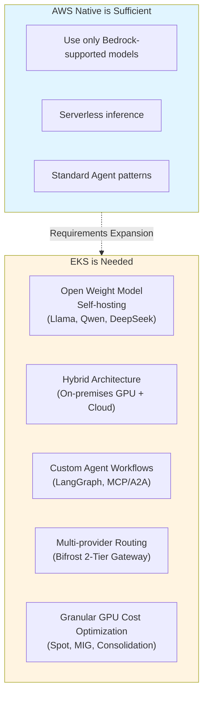

**Key Message: AWS Native → EKS is a complementary relationship.**

| Criteria | AWS Native | EKS-Based Open Architecture |
|------|-----------|----------------------|
| Model Selection | Bedrock-supported models | All Open Weight models |
| GPU Management | Not required (serverless) | Karpenter auto-provisioning |
| Cost Optimization | Usage-based pricing | Spot, MIG, Consolidation |
| Operational Burden | Minimal | Medium (reduced with Auto Mode) |
| Hybrid | Limited | EKS Hybrid Nodes |
| Customization | Limited | Full flexibility |

The realistic approach is to **start with AWS Native and expand to EKS as needed**. Both approaches can coexist within the same VPC.

---

## Part 2: Quick Start with EKS Auto Mode

### EKS Cluster Configuration Options: Control Plane and Data Plane

EKS cluster configuration is divided into **two independent layers**.

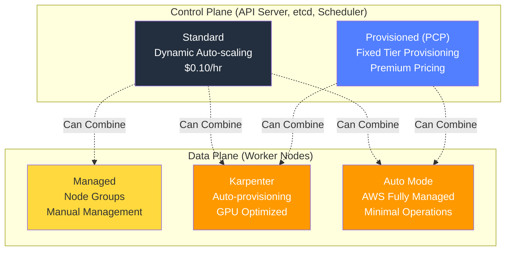

### Provisioned Control Plane (PCP)

**PCP** is a premium option that pre-provisions control plane capacity in fixed tiers to ensure consistent API server performance.

```yaml
# PCP cluster creation example
apiVersion: eks.amazonaws.com/v1
kind: Cluster
spec:
  controlPlaneScalingConfig:
    tier: tier-xl  # tier-xl / tier-2xl / tier-4xl / tier-8xl
```

#### PCP Tier Specifications

| Tier | API Concurrency (seats) | Pod Scheduling | etcd DB | SLA | Cost |
|------|:-----------------:|:----------:|:------:|:---:|-----:|
| **Standard** | Dynamic (AWS auto-adjusts) | Dynamic | 8GB | 99.95% | $0.10/hr |
| **XL** | 1,700 | 167/sec | 16GB | 99.99% | - |
| **2XL** | 3,400 | 283/sec | 16GB | 99.99% | - |
| **4XL** | 6,800 | 400/sec | 16GB | 99.99% | - |
| **8XL** | 13,600 | 400/sec | 16GB | 99.99% | - |

> Source: [AWS EKS Provisioned Control Plane Official Documentation](https://docs.aws.amazon.com/eks/latest/userguide/eks-provisioned-control-plane.html) (K8s 1.30+ basis). Refer to AWS official pricing page for PCP tier pricing.

#### Tier Selection Criteria: Metric-Based Decision

:::warning Worker node count is NOT a PCP tier selection criterion
PCP tiers should be selected based on **Kubernetes control plane metrics**.
:::

**Key Monitoring Metrics:**

| Metric | Prometheus Query | Decision Criteria |
|--------|----------------|----------|
| **API Inflight Seats** (most important) | `apiserver_flowcontrol_current_executing_seats_total` | Sustained >1,200 seats → XL or higher |
| **Pod Scheduling Rate** | `scheduler_schedule_attempts_SCHEDULED` | >100/sec → XL, >200/sec → 2XL |
| **etcd DB Size** | `apiserver_storage_size_bytes` | >10GB → XL or higher required |

:::info PCP vs Auto Mode — Different Layers
**PCP** is a control plane capacity option, and **Auto Mode** is a data plane management option. The two features **can be used in combination**.
:::

### Control Plane × Data Plane Comparison and Combinations

<EksClusterConfiguration />

:::tip Recommended Configurations by AI Platform Scale
- **Small-scale (PoC/Demo)**: Standard + Auto Mode — Minimal operational burden, 99.95% SLA
- **Medium-scale (Production Inference)**: Standard + Karpenter — GPU cost optimization, 99.95% SLA
- **Large-scale (Enterprise AI)**: PCP XL + Auto Mode — API seats ≤ 1,700, 99.99% SLA
- **Extra-large-scale (Training Cluster)**: PCP 4XL+ + Karpenter — API seats ≤ 6,800+, granular GPU control
:::

---

### Amazon EKS and Karpenter: Maximizing Kubernetes Advantages

**The combination of Amazon EKS and Karpenter** maximizes Kubernetes advantages to implement fully automated, optimal infrastructure.

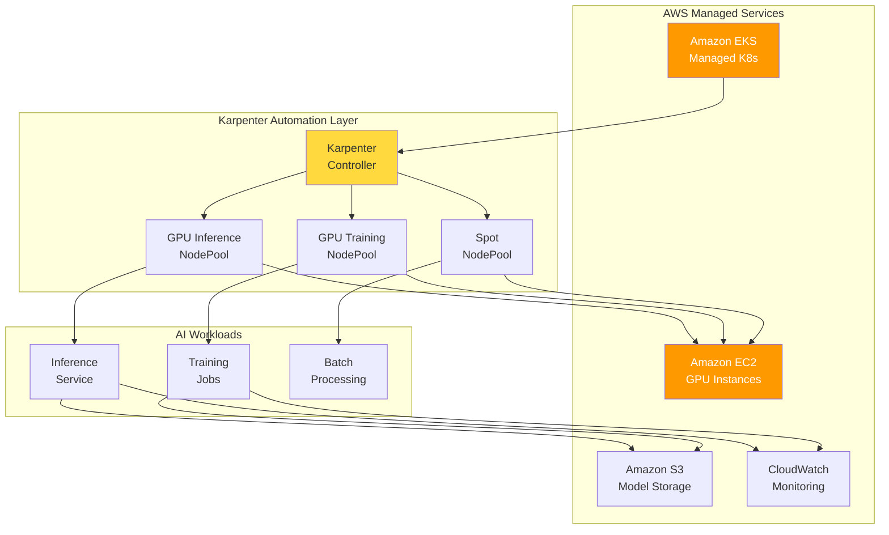

#### Why EKS + Karpenter?

<EksKarpenterLayers />

#### Karpenter: Core of AI Infrastructure Automation

Karpenter overcomes the limitations of traditional Cluster Autoscaler and provides **node provisioning optimized for AI workloads**.

:::info Karpenter v1.0+ GA
Karpenter is **GA at v1.0 and above**. Use the v1 API (`karpenter.sh/v1`).
:::

<ClusterAutoscalerVsKarpenter />

<KarpenterKeyFeatures />

### EKS Auto Mode: Completion of Full Automation

**EKS Auto Mode** automatically configures and manages core components including Karpenter.

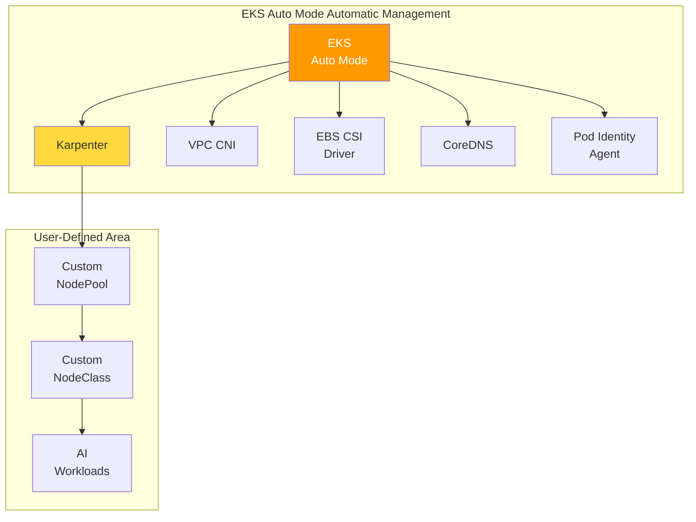

#### EKS Auto Mode vs Manual Configuration Comparison

<EksAutoModeVsStandard />

#### EKS Auto Mode Configuration for GPU Workloads

```yaml
# Add GPU NodePool in EKS Auto Mode
apiVersion: karpenter.sh/v1
kind: NodePool
metadata:
  name: gpu-inference-pool
spec:
  template:
    metadata:
      labels:
        node-type: gpu-inference
        eks-auto-mode: "true"
    spec:
      requirements:
        - key: karpenter.sh/capacity-type
          operator: In
          values: ["spot", "on-demand"]
        - key: node.kubernetes.io/instance-type
          operator: In
          values:
            - g5.xlarge
            - g5.2xlarge
            - g5.4xlarge
            - g5.12xlarge
            - p4d.24xlarge
        - key: karpenter.k8s.aws/instance-gpu-count
          operator: Gt
          values: ["0"]
      nodeClassRef:
        group: karpenter.k8s.aws
        kind: EC2NodeClass
        name: default  # Leverage EKS Auto Mode default NodeClass
  limits:
    nvidia.com/gpu: 50
  disruption:
    consolidationPolicy: WhenEmptyOrUnderutilized
    consolidateAfter: 30s
```

:::tip EKS Auto Mode Recommendations
EKS Auto Mode is the **recommended option when building new AI platforms**.
- **80% reduction in initial setup time** through automated Karpenter installation and configuration
- **Significantly reduced operational burden** through automatic core component upgrades
- **Immediate AI workload deployment** by only defining custom GPU NodePools
:::

:::info EKS Auto Mode and GPU Support
EKS Auto Mode fully supports accelerated computing instances including NVIDIA GPUs.

**New features from re:Invent 2024/2025:**
- **EKS Hybrid Nodes (GA)**: Integrate on-premises GPU infrastructure into EKS clusters
- **Enhanced Pod Identity v2**: Cross-account IAM role support
- **Native Inferentia/Trainium Support**: Automatic Neuron SDK configuration
- **Provisioned Control Plane**: Pre-provisioning for large-scale AI training workloads
:::

---

### Deployable Agentic AI Components in Auto Mode

All core components of the Agentic AI platform can be deployed on EKS Auto Mode.

#### Inference: vLLM + llm-d

**vLLM** is an LLM-dedicated inference engine, and **llm-d** provides intelligent routing that considers KV Cache state.

:::info Model Serving Stack Configuration
- **vLLM**: LLM inference only (GPT, Claude, Llama, etc.) — PagedAttention-based KV Cache optimization
- **Triton Inference Server**: Handles non-LLM inference (embedding, reranking, Whisper STT)
- **llm-d**: Maximize Prefix cache hit rate with KV Cache-aware routing

For detailed configuration, refer to [vLLM Model Serving](../model-serving/vllm-model-serving.md) and [llm-d Distributed Inference](../model-serving/llm-d-eks-automode.md).
:::

#### Gateway: kgateway + Bifrost (2-Tier Gateway)

2-Tier Gateway architecture separates traffic management and model routing:
- **Tier 1 (kgateway)**: Gateway API-based authentication, Rate Limiting, traffic management
- **Tier 2 (Bifrost)**: Model abstraction, Fallback, cost tracking, Cascade Routing

> For detailed architecture, refer to [Inference Gateway Routing](../gateway-agents/inference-gateway-routing.md).

#### Agent: LangGraph + NeMo Guardrails + MCP/A2A

Agent workflows in EKS consist of the following:

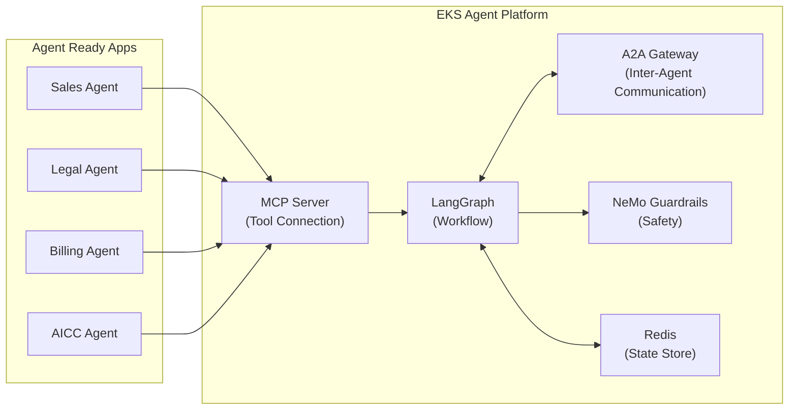

- **LangGraph**: Define multi-step Agent workflows, conditional branching, parallel execution
- **NeMo Guardrails**: Prompt injection defense, PII leakage prevention, output validation
- **MCP**: Agent Ready apps provide Tools in a standardized manner
- **A2A**: Safe and efficient communication between Agents
- **Redis (ElastiCache)**: State management as LangGraph checkpointer

Agent Pods auto-scale based on Redis queue length through KEDA.

> For details, refer to [Kagent Agent Management](../agent-data/kagent-kubernetes-agents.md) and [AWS Native Platform — AgentCore & MCP](./aws-native-agentic-platform.md#mcp-protocol-and-eks-integration).

#### RAG + Observability

- **Milvus**: Vector DB — Core of RAG system ([Details](../agent-data/milvus-vector-database.md))
- **Langfuse**: Production LLM tracing, token cost tracking (Self-hosted, MIT license)
- **Prometheus + Grafana**: Infrastructure metrics monitoring

---

### Easy EKS-Based Deployment

<DeploymentTimeComparison />

#### EKS Deployment Methods by Solution

<EksIntegrationBenefits />

#### Easy Deployment Example

```bash
# 1. Create EKS Auto Mode cluster (Karpenter automatically included)
eksctl create cluster --name ai-platform --region us-west-2 --auto-mode

# 2. Add GPU NodePool
kubectl apply -f gpu-nodepool.yaml

# 3. Deploy AI Platform solution stack
helm repo add kgateway https://kgateway.io/charts
helm repo add bifrost https://bifrost.dev/charts
helm repo add vllm https://vllm-project.github.io/helm
helm repo add langfuse https://langfuse.github.io/helm
helm repo update

# 4. Install Kgateway
helm install kgateway kgateway/kgateway \
  -n ai-gateway --create-namespace

# 5. Install Bifrost
helm install bifrost bifrost/bifrost \
  -n ai-inference --create-namespace

# 6. Install vLLM
helm install vllm vllm/vllm \
  -n ai-inference \
  --set resources.limits."nvidia\.com/gpu"=1 \
  --set model.name="meta-llama/Llama-3-8B-Instruct"

# 7. Install Langfuse
helm install langfuse langfuse/langfuse \
  -n observability --create-namespace

# 8. Install KEDA (EKS Addon)
aws eks create-addon \
  --cluster-name ai-platform \
  --addon-name keda
```

:::info GPU Cost Optimization Details
For GPU cost optimization strategies including Spot instance utilization, Consolidation, and time-based schedule cost management, refer to the [GPU Resource Management](../model-serving/gpu-resource-management.md) document.
:::

:::info GPU Security and Troubleshooting
For GPU Pod security policies, Network Policy, IAM, MIG isolation, and GPU troubleshooting guides, refer to the [EKS GPU Node Strategy](../model-serving/eks-gpu-node-strategy.md) document.
:::

---

## Part 3: Minimize Infrastructure Operational Burden with EKS Capability

### What is EKS Capability?

**EKS Capability** is a **platform-level feature that integrates validated open-source tools and AWS services** to effectively operate specific workloads on Amazon EKS.

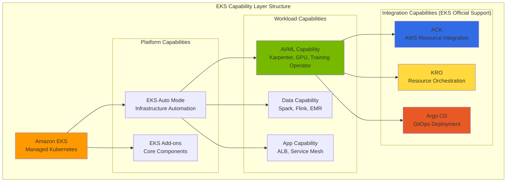

### Core EKS Capabilities for Agentic AI

<EksCapabilities />

:::warning Argo Workflows Requires Separate Installation
**Argo Workflows** is not officially supported as an EKS Capability, so **direct installation is required**.

```bash
kubectl create namespace argo
kubectl apply -n argo -f https://github.com/argoproj/argo-workflows/releases/download/v3.6.4/install.yaml
```
:::

---

### ACK (AWS Controllers for Kubernetes)

**ACK** directly provisions and manages AWS services through Kubernetes Custom Resources. It can be **easily installed as an EKS Add-on**.

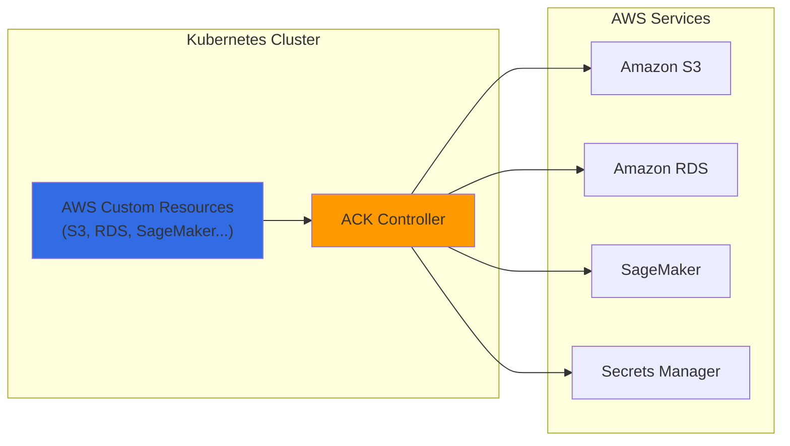

**ACK Use Cases in AI Platforms:**

<AckControllers />

**Example: Creating an S3 Bucket with ACK:**

```yaml
apiVersion: s3.services.k8s.aws/v1alpha1
kind: Bucket
metadata:
  name: agentic-ai-models
  namespace: ai-platform
spec:
  name: agentic-ai-models-prod
  versioning:
    status: Enabled
  encryption:
    rules:
    - applyServerSideEncryptionByDefault:
        sseAlgorithm: aws:kms
  tags:
  - key: Project
    value: agentic-ai
```

### KRO (Kubernetes Resource Orchestrator)

**KRO** **combines multiple Kubernetes and AWS resources into a single abstracted unit** to simply deploy complex infrastructure.

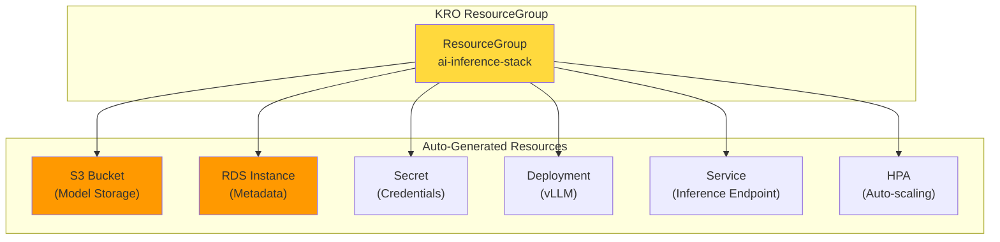

**Deploy AI Inference Stack as a Single Resource with KRO:**

```yaml
# Deploy entire stack as a single resource
apiVersion: v1alpha1
kind: AIInferenceStack
metadata:
  name: llama-inference
  namespace: ai-platform
spec:
  modelName: llama-3-70b
  gpuType: g5.12xlarge
  minReplicas: 2
  maxReplicas: 20
```

### Argo-Based ML Pipeline Automation

Combining **Argo Workflows** and **Argo CD** enables **GitOps-based automation of the entire MLOps pipeline** from AI model training, evaluation, to deployment.

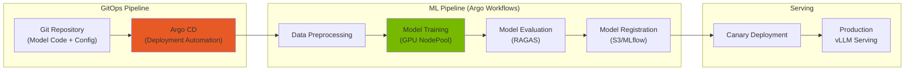

### ACK + KRO + ArgoCD Integration Architecture

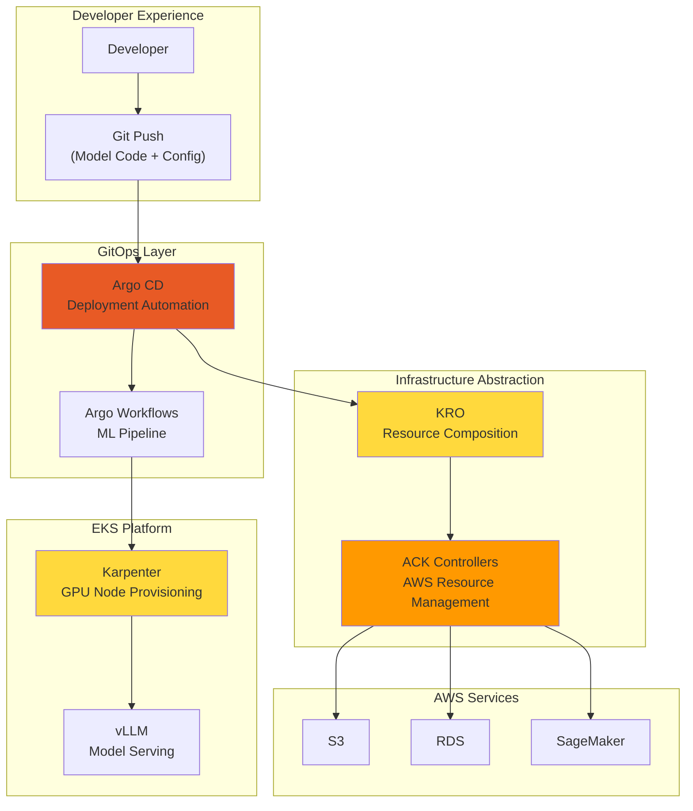

<AutomationComponents />

:::info Benefits of Full Automation — Delegate Infrastructure Operations to EKS and Focus on Agent Development
- **Developers**: Deploy models with just git push
- **Platform Team**: Minimize infrastructure management burden
- **Cost Optimization**: Dynamically provision only needed resources
- **Consistency**: Same deployment method across all environments
:::

---

## Part 4: Conclusion + Next Steps

### Progressive Journey: AWS Native → Auto Mode → EKS Capability

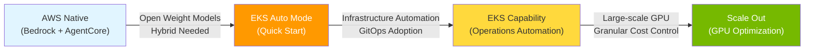

### EKS Auto Mode: Recommended Starting Point

<EksAutoModeBenefits />

### Challenge Solution Summary

<ChallengeSolutionsSummary />

### EKS Auto Mode GPU Constraints and Hybrid Strategy

EKS Auto Mode is optimal for general workloads and basic GPU inference, but has limitations with advanced GPU features.

| Workload Type | Auto Mode Suitability | Reason |
|---|---|---|
| API Gateway, Agent Framework | Suitable | Non-GPU, auto-scaling sufficient |
| Observability Stack | Suitable | Non-GPU, minimized management burden |
| Basic GPU Inference (Full GPU) | Suitable | AWS-managed GPU stack sufficient |
| MIG Partitioning Required | **Not Suitable** | Cannot install GPU Operator |
| Run:ai GPU Scheduling | **Not Suitable** | GPU Operator dependency |

**Recommended Hybrid Configuration**: Operate Auto Mode (general workloads) + Karpenter (advanced GPU features) in a single cluster. For detailed configuration, refer to [EKS GPU Node Strategy](../model-serving/eks-gpu-node-strategy.md).

### Gateway API Limitations and Workarounds

EKS Auto Mode's built-in load balancer does not directly support Kubernetes Gateway API. To use kgateway, provision an NLB with a separate Service (type: LoadBalancer).

```yaml
apiVersion: v1
kind: Service
metadata:
  name: kgateway-proxy
  namespace: kgateway-system
  annotations:
    service.beta.kubernetes.io/aws-load-balancer-type: "external"
    service.beta.kubernetes.io/aws-load-balancer-nlb-target-type: "ip"
    service.beta.kubernetes.io/aws-load-balancer-scheme: "internet-facing"
spec:
  type: LoadBalancer
  selector:
    app: kgateway-proxy
  ports:
    - name: https
      port: 443
      targetPort: 8443
```

> For the complete 2-Tier Gateway architecture design, refer to [LLM Gateway 2-Tier Architecture](../gateway-agents/inference-gateway-routing.md).

### Core Recommendations

1. **Start with EKS Auto Mode**: Create new clusters with Auto Mode to leverage automatic Karpenter configuration
2. **Karpenter Nodes for Advanced GPU Features**: Add Karpenter NodePool when GPU Operator is needed for MIG, Run:ai, etc.
3. **Custom Define GPU NodePools**: Add GPU NodePools tailored to workload characteristics (separate inference/training/experimentation)
4. **Actively Utilize Spot Instances**: Operate 70%+ of inference workloads on Spot
5. **Enable Consolidation by Default**: Leverage Consolidation automatically enabled in EKS Auto Mode
6. **Integrate KEDA**: Link metric-based Pod scaling with Karpenter node provisioning

### Choosing a Deployment Path

<Tabs>
<TabItem value="auto-mode" label="EKS Auto Mode (Recommended for Most)">

**Suitable for:**
- Startups and small teams
- Kubernetes beginner teams
- Standard Agentic AI workloads

**Getting Started:**

```bash
aws eks create-cluster \
  --name agentic-ai-auto \
  --region us-west-2 \
  --compute-config enabled=true
```

**Advantages:** Zero infrastructure management burden, AWS-optimized default settings, automatic security patches

</TabItem>
<TabItem value="karpenter" label="EKS + Karpenter (Maximum Control)">

**Suitable for:**
- Large-scale production workloads
- Complex GPU requirements (mixed instance types)
- Cost optimization as top priority

**Getting Started:**

```bash
terraform apply -f eks-karpenter-blueprint/
kubectl apply -f karpenter-nodepools/
```

**Advantages:** Granular instance control, maximum cost optimization (70-80% savings), custom AMI

</TabItem>
<TabItem value="hybrid" label="Hybrid (Combines Benefits of Both)">

**Suitable for:**
- Growing platforms (start simple, scale complex)
- Mixed workload types (CPU agents + GPU LLM)

**Getting Started:**

```bash
# Step 1: Create EKS cluster with Auto Mode
aws eks create-cluster --name agentic-ai --compute-config enabled=true

# Step 2: Deploy custom NodePool for GPU workloads
kubectl apply -f gpu-nodepools.yaml
```

**Advantages:** Gradual complexity increase, GPU cost optimization, AWS managed + custom combination

</TabItem>
</Tabs>

### Scaling Reference Documentation

| Area | Document | Content |
|------|------|------|
| GPU Node Strategy | [EKS GPU Node Strategy](../model-serving/eks-gpu-node-strategy.md) | Auto Mode + Karpenter + Hybrid Node + Security/Troubleshooting |
| GPU Resource Management | [GPU Resource Management](../model-serving/gpu-resource-management.md) | Karpenter Scaling, KEDA, DRA, Cost Optimization |
| NVIDIA GPU Stack | [NVIDIA GPU Stack](../model-serving/nvidia-gpu-stack.md) | GPU Operator, DCGM, MIG, Time-Slicing |
| Model Serving | [vLLM Model Serving](../model-serving/vllm-model-serving.md) | vLLM Configuration, Performance Optimization |
| Distributed Inference | [llm-d Distributed Inference](../model-serving/llm-d-eks-automode.md) | KV Cache-aware Routing |
| Training Infrastructure | [NeMo Framework](../model-serving/nemo-framework.md) | Distributed Training, EFA Network |

---

## References

### Kubernetes and Infrastructure

- [Amazon EKS Documentation](https://docs.aws.amazon.com/eks/)
- [EKS Auto Mode](https://docs.aws.amazon.com/eks/latest/userguide/automode.html)
- [Karpenter Documentation](https://karpenter.sh/docs/)
- [KEDA - Kubernetes Event-driven Autoscaling](https://keda.sh/)

### Model Serving and Gateway

- [vLLM Documentation](https://docs.vllm.ai/)
- [llm-d Project](https://github.com/llm-d/llm-d)
- [Kgateway Documentation](https://kgateway.io/docs/)
- [Bifrost Documentation](https://bifrost.dev/docs)

### LLM Observability and Agent

- [Langfuse Documentation](https://langfuse.com/docs)
- [LangSmith Documentation](https://docs.smith.langchain.com/)
- [KAgent - Kubernetes Agent Framework](https://github.com/kagent-dev/kagent)
- [NVIDIA NeMo Framework](https://docs.nvidia.com/nemo-framework/user-guide/latest/overview.html)
