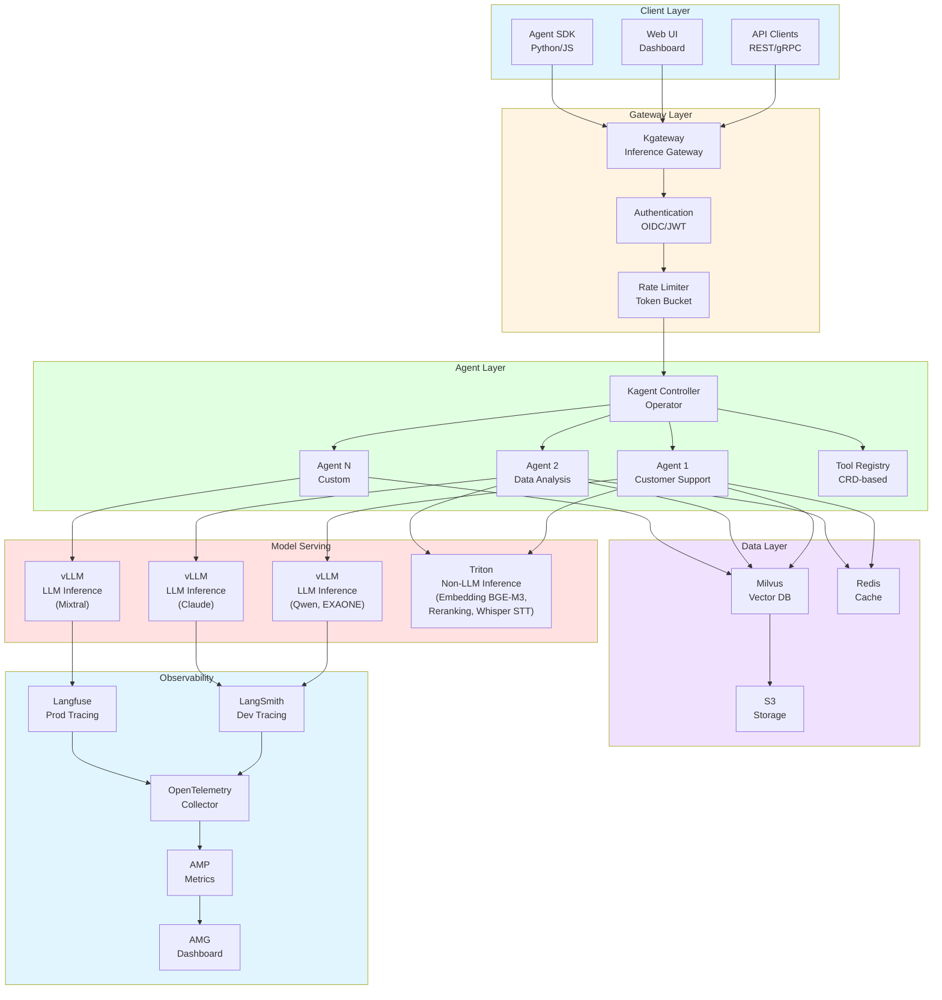
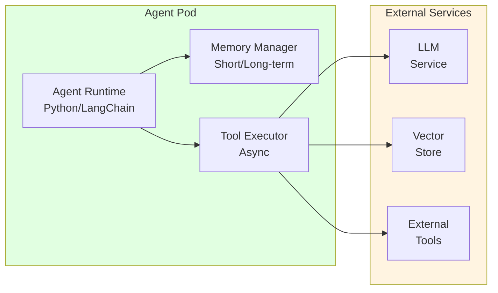
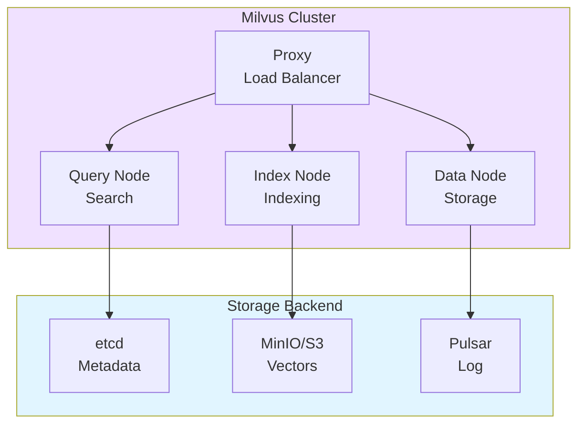
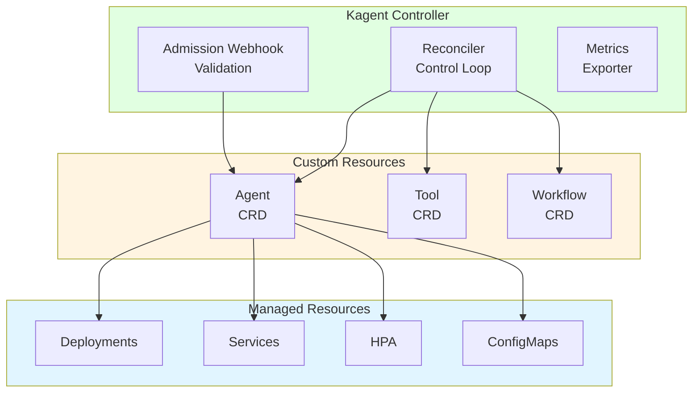
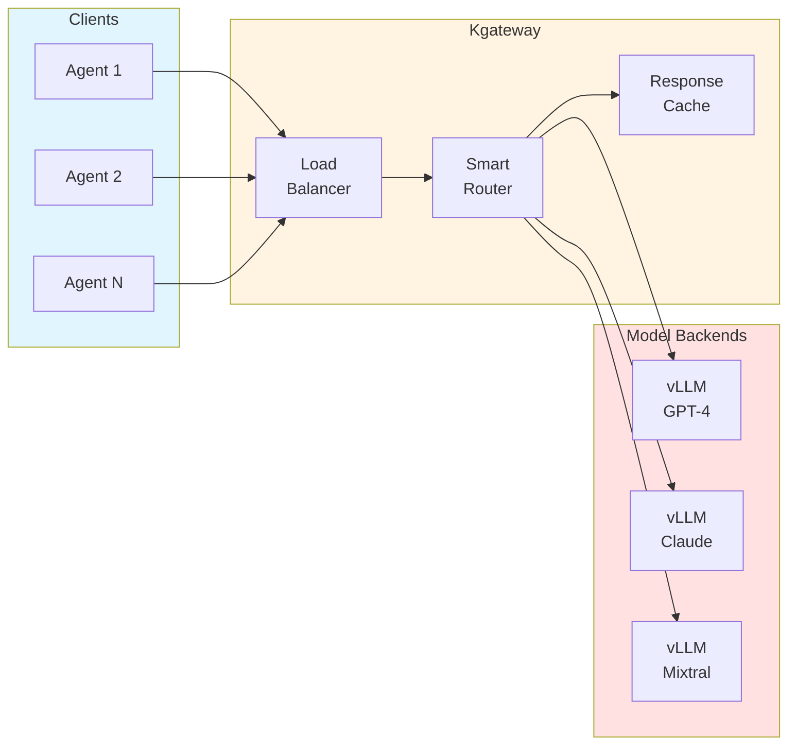
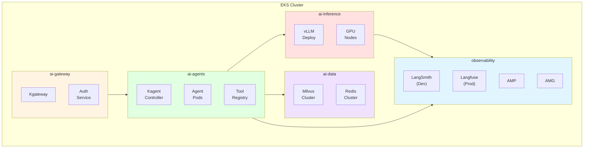
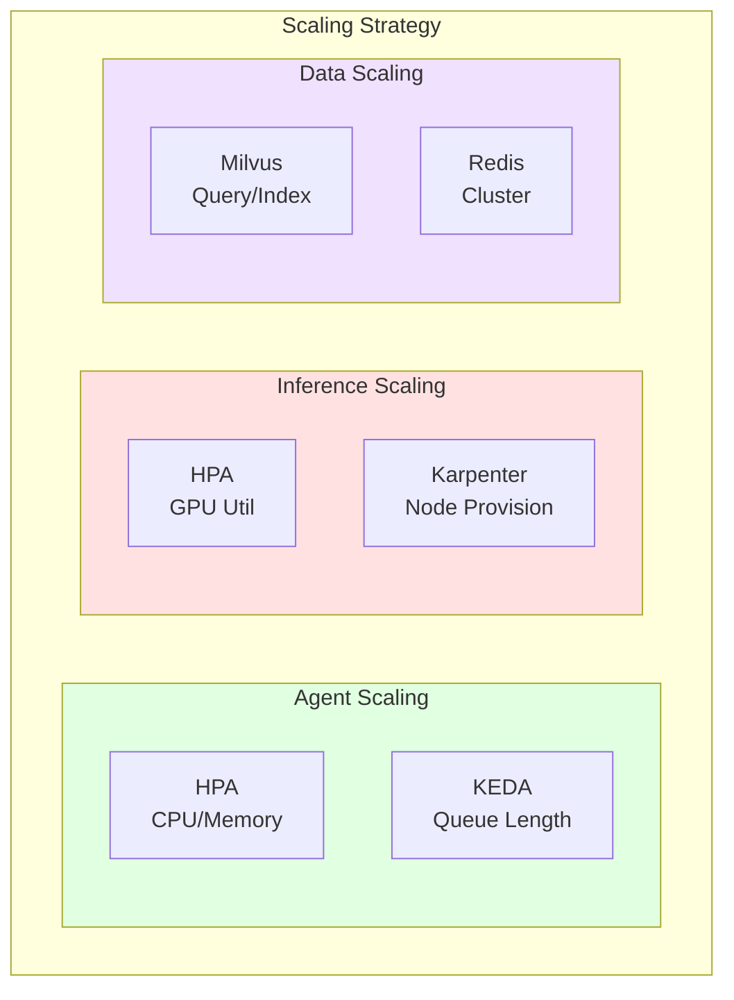
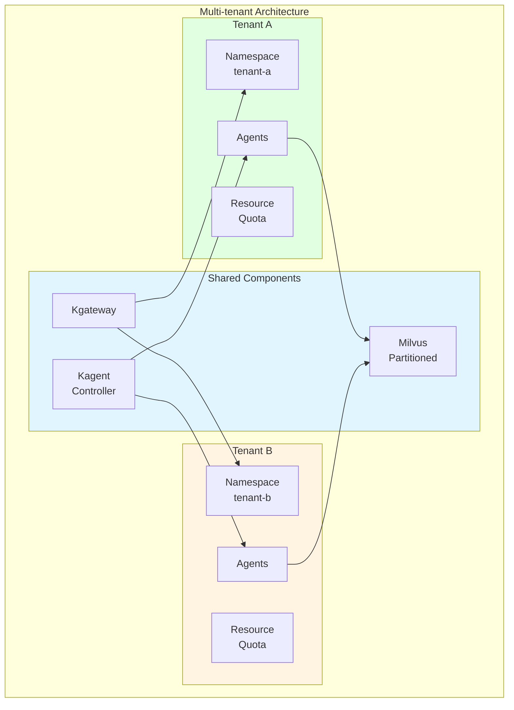
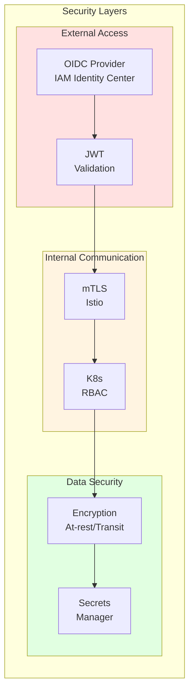
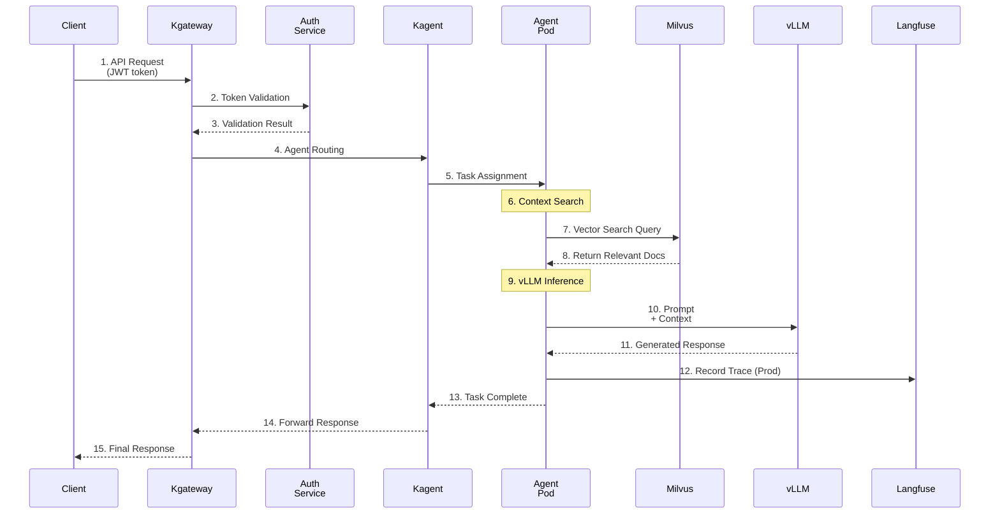

import { CoreCapabilities, LayerRoles, ToolTypes, K8sFeatures, RoutingStrategies, TenantIsolation, RequestProcessing, TechnologyStack } from '@site/src/components/ArchitectureTables';

# Agentic AI Platform Architecture

> 📅 **Written**: 2025-02-05 | **Updated**: 2026-03-17 | ⏱️ **Reading Time**: About 6 minutes

This document covers the complete system architecture and core component design of a production-grade Agentic AI Platform based on Amazon EKS. It presents a platform architecture for efficiently building and operating AI agents that autonomously perform tasks.

## Overview

The Agentic AI Platform is an integrated platform that supports autonomous AI agents in performing complex tasks. It provides stable and scalable GenAI services by integrating the latest AI/ML technologies, container orchestration, and cloud-native architecture.

### Problems It Solves

Challenges in the traditional GenAI service building process:

- **AI Model Serving Complexity**: Difficulty in deploying and managing resources for various models
- **Lack of Integration**: Absence of integration between ML frameworks and tools
- **Scaling Issues**: Difficulty in performance optimization and auto-scaling
- **MLOps Automation**: Lack of deployment pipelines and automation
- **Cost Efficiency**: Absence of resource utilization optimization solutions

This guide presents practical strategies to systematically solve these problems.

### Core Capabilities

<CoreCapabilities />

:::info Target Audience
This document is intended for solution architects, platform engineers, and DevOps engineers. Basic understanding of Kubernetes and AI/ML workloads is required.
:::

## Complete System Architecture

The Agentic AI Platform consists of 6 major layers. Each layer has clear responsibilities and enables independent scaling and operations through loose coupling.



:::info 2-Tier Cost Tracking
The platform provides two levels of cost visibility:

- **Infrastructure Level (Bifrost)**: Track model price × token usage, manage per-team budgets
- **Application Level (Langfuse)**: Per-agent-step costs, chain latency analysis

The combination of these two layers secures full cost visibility.
:::

### Roles by Layer

<LayerRoles />

## Core Components

### Agent Runtime Layer

The Agent Runtime Layer provides the environment where AI agents execute. Each agent runs as an independent Pod and is managed by the Kagent Controller.



#### Key Features

- **State Management**: Maintain agent conversation context and task state
- **Tool Execution**: Asynchronously execute registered tools (supports MCP/A2A protocols)
- **Memory Management**: Maintain context through short/long-term memory
- **Error Recovery**: Automatic retry and fallback for failed tasks

:::tip MCP/A2A Protocols
Agent Runtime supports MCP (Model Context Protocol) and A2A (Agent-to-Agent) protocols as standards. MCP simplifies integration between agents and external tools, while A2A provides a standard interface for inter-agent collaboration.
:::

### Tool Registry

The Tool Registry centrally manages tools that agents can use. Tools are declaratively defined through Kubernetes CRD (Custom Resource Definition).

```yaml
apiVersion: kagent.dev/v1alpha1
kind: Tool
metadata:
  name: web-search
  namespace: ai-agents
spec:
  type: api
  protocol: mcp  # MCP protocol support
  description: "Performs web search to retrieve latest information"
  config:
    endpoint: http://search-service/api/search
    method: POST
    timeout: 30s
  parameters:
    - name: query
      type: string
      required: true
      description: "Search query"
    - name: max_results
      type: integer
      default: 10
      description: "Maximum number of results"
  authentication:
    type: bearer
    secretRef:
      name: search-api-token
      key: token
```

#### Tool Types

<ToolTypes />

### Memory Store (Milvus)

Milvus serves as the core vector store of the RAG system. Agents search for relevant documents through Milvus and augment context.



#### Collection Design Example

```python
from pymilvus import Collection, FieldSchema, CollectionSchema, DataType

# Define collection schema
fields = [
    FieldSchema(name="id", dtype=DataType.VARCHAR, max_length=64, is_primary=True),
    FieldSchema(name="content", dtype=DataType.VARCHAR, max_length=65535),
    FieldSchema(name="embedding", dtype=DataType.FLOAT_VECTOR, dim=1536),
    FieldSchema(name="metadata", dtype=DataType.JSON),
    FieldSchema(name="tenant_id", dtype=DataType.VARCHAR, max_length=64),
]

schema = CollectionSchema(fields, description="Knowledge base for agents")
collection = Collection(name="agent_knowledge", schema=schema)

# Create HNSW index (high-performance search)
index_params = {
    "metric_type": "COSINE",
    "index_type": "HNSW",
    "params": {"M": 16, "efConstruction": 256}
}
collection.create_index(field_name="embedding", index_params=index_params)
```

### Orchestrator (Kagent)

Kagent manages the entire lifecycle of AI agents using the Kubernetes Operator pattern.



#### Agent CRD Example

```yaml
apiVersion: kagent.dev/v1alpha1
kind: Agent
metadata:
  name: customer-support-agent
  namespace: ai-agents
spec:
  # Model configuration
  model:
    provider: openai
    name: gpt-4-turbo
    temperature: 0.7
    maxTokens: 4096

  # System prompt
  systemPrompt: |
    You are a friendly and professional customer support agent.
    Always provide accurate information and admit when you don't know something.

  # Tools to use
  tools:
    - name: search-knowledge-base
      type: retrieval
      config:
        vectorStore: milvus
        collection: support-docs
        topK: 5
    - name: create-ticket
      type: api
      config:
        endpoint: http://ticketing-service/api/tickets
        method: POST

  # Memory configuration
  memory:
    type: redis
    config:
      host: redis-master.ai-data.svc.cluster.local
      port: 6379
      ttl: 3600
      maxHistory: 50

  # Scaling configuration
  scaling:
    minReplicas: 2
    maxReplicas: 10
    targetCPUUtilization: 70
    targetMemoryUtilization: 80

  # Resource limits
  resources:
    requests:
      memory: "512Mi"
      cpu: "250m"
    limits:
      memory: "1Gi"
      cpu: "500m"
```

### Inference Gateway (Kgateway)

Kgateway intelligently routes AI model inference requests based on Kubernetes Gateway API.



#### HTTPRoute Configuration Example

```yaml
apiVersion: gateway.networking.k8s.io/v1
kind: HTTPRoute
metadata:
  name: inference-routing
  namespace: ai-gateway
spec:
  parentRefs:
    - name: ai-gateway
      namespace: ai-gateway
  rules:
    # GPT-4 model routing (weight-based)
    - matches:
        - path:
            type: PathPrefix
            value: /v1/chat/completions
          headers:
            - name: x-model-id
              value: "gpt-4"
      backendRefs:
        - name: vllm-gpt4-primary
          port: 8000
          weight: 80
        - name: vllm-gpt4-canary
          port: 8000
          weight: 20

    # Claude model routing
    - matches:
        - path:
            type: PathPrefix
            value: /v1/chat/completions
          headers:
            - name: x-model-id
              value: "claude-3"
      backendRefs:
        - name: vllm-claude3
          port: 8000

    # MoE model routing (for complex tasks)
    - matches:
        - path:
            type: PathPrefix
            value: /v1/chat/completions
          headers:
            - name: x-model-id
              value: "mixtral-8x7b"
      backendRefs:
        - name: vllm-mixtral
          port: 8000
```

#### Routing Strategies

<RoutingStrategies />

## Kubernetes Deployment Architecture

### Leveraging Kubernetes 1.33/1.34 Key Features

The Agentic AI Platform maximizes performance and stability by leveraging the latest features of Kubernetes 1.33 and 1.34.

<K8sFeatures />

:::tip Leveraging Topology-Aware Routing
Kubernetes 1.33+ Topology-Aware Routing prioritizes Pod-to-Pod communication within the same AZ to reduce cross-AZ data transfer costs by up to 50%.

```yaml
apiVersion: v1
kind: Service
metadata:
  name: vllm-inference
  namespace: ai-inference
  annotations:
    service.kubernetes.io/topology-mode: "Auto"
spec:
  selector:
    app: vllm
  ports:
    - port: 8000
      targetPort: 8000
  trafficDistribution: PreferClose
```
:::

### Namespace Configuration Strategy

The Agentic AI Platform separates namespaces by function for separation of concerns and security.



#### Namespace Configuration

```yaml
# ai-gateway namespace
apiVersion: v1
kind: Namespace
metadata:
  name: ai-gateway
  labels:
    istio-injection: enabled
    pod-security.kubernetes.io/enforce: restricted
---
# ai-agents namespace
apiVersion: v1
kind: Namespace
metadata:
  name: ai-agents
  labels:
    istio-injection: enabled
    pod-security.kubernetes.io/enforce: baseline
---
# ai-inference namespace (GPU workloads)
apiVersion: v1
kind: Namespace
metadata:
  name: ai-inference
  labels:
    pod-security.kubernetes.io/enforce: privileged
---
# ai-data namespace
apiVersion: v1
kind: Namespace
metadata:
  name: ai-data
  labels:
    pod-security.kubernetes.io/enforce: baseline
---
# observability namespace
apiVersion: v1
kind: Namespace
metadata:
  name: observability
  labels:
    pod-security.kubernetes.io/enforce: baseline
```

### Resource Allocation Strategy

Set ResourceQuota in each namespace to limit resource usage and ensure fair distribution.

```yaml
apiVersion: v1
kind: ResourceQuota
metadata:
  name: ai-inference-quota
  namespace: ai-inference
spec:
  hard:
    requests.cpu: "100"
    requests.memory: "500Gi"
    limits.cpu: "200"
    limits.memory: "1Ti"
    requests.nvidia.com/gpu: "32"
    persistentvolumeclaims: "50"
---
apiVersion: v1
kind: ResourceQuota
metadata:
  name: ai-agents-quota
  namespace: ai-agents
spec:
  hard:
    requests.cpu: "50"
    requests.memory: "100Gi"
    limits.cpu: "100"
    limits.memory: "200Gi"
    pods: "200"
```

:::warning Resource Planning
GPU resources are expensive and should be planned carefully. Start with conservative settings and adjust gradually through monitoring.
:::

## Scalability Design

### Horizontal Scaling Strategy

Each component of the Agentic AI Platform can scale horizontally independently.



#### Agent Auto-scaling (KEDA)

```yaml
apiVersion: keda.sh/v1alpha1
kind: ScaledObject
metadata:
  name: agent-scaler
  namespace: ai-agents
spec:
  scaleTargetRef:
    name: customer-support-agent
  minReplicaCount: 2
  maxReplicaCount: 20
  pollingInterval: 15
  cooldownPeriod: 300
  triggers:
    # Redis queue length-based scaling
    - type: redis
      metadata:
        address: redis-master.ai-data.svc.cluster.local:6379
        listName: agent-task-queue
        listLength: "10"
    # Prometheus metrics-based scaling
    - type: prometheus
      metadata:
        serverAddress: http://prometheus.observability.svc:9090
        metricName: agent_active_sessions
        threshold: "50"
        query: |
          sum(agent_active_sessions{agent="customer-support"})
```

#### GPU Node Auto-provisioning (Karpenter)

```yaml
apiVersion: karpenter.sh/v1
kind: NodePool
metadata:
  name: gpu-inference-pool
spec:
  template:
    spec:
      requirements:
        - key: "node.kubernetes.io/instance-type"
          operator: In
          values:
            - "p4d.24xlarge"   # 8x A100 40GB
            - "p5.48xlarge"   # 8x H100 80GB
            - "g5.48xlarge"   # 8x A10G 24GB
        - key: "karpenter.sh/capacity-type"
          operator: In
          values: ["on-demand", "spot"]
        - key: "kubernetes.io/arch"
          operator: In
          values: ["amd64"]
      nodeClassRef:
        group: karpenter.k8s.aws
        kind: EC2NodeClass
        name: gpu-nodeclass
  limits:
    nvidia.com/gpu: 64
  disruption:
    consolidationPolicy: WhenEmptyOrUnderutilized
    consolidateAfter: 30s
    budgets:
      - nodes: "20%"
---
apiVersion: karpenter.k8s.aws/v1
kind: EC2NodeClass
metadata:
  name: gpu-nodeclass
spec:
  amiSelectorTerms:
    - alias: al2023@latest
  subnetSelectorTerms:
    - tags:
        karpenter.sh/discovery: "ai-cluster"
  securityGroupSelectorTerms:
    - tags:
        karpenter.sh/discovery: "ai-cluster"
  blockDeviceMappings:
    - deviceName: /dev/xvda
      ebs:
        volumeSize: 500Gi
        volumeType: gp3
        iops: 10000
        throughput: 500
  tags:
    Environment: production
    Workload: ai-inference
```

### Multi-tenant Support

The Agentic AI Platform supports multi-tenancy so multiple teams or projects can share the same platform.



#### Tenant Isolation Strategy

<TenantIsolation />

#### Per-tenant Resource Allocation

```yaml
apiVersion: v1
kind: ResourceQuota
metadata:
  name: tenant-a-quota
  namespace: tenant-a
spec:
  hard:
    requests.cpu: "20"
    requests.memory: "40Gi"
    limits.cpu: "40"
    limits.memory: "80Gi"
    requests.nvidia.com/gpu: "4"
    pods: "50"
    services: "10"
---
apiVersion: networking.k8s.io/v1
kind: NetworkPolicy
metadata:
  name: tenant-isolation
  namespace: tenant-a
spec:
  podSelector: {}
  policyTypes:
    - Ingress
    - Egress
  ingress:
    - from:
        - namespaceSelector:
            matchLabels:
              name: tenant-a
        - namespaceSelector:
            matchLabels:
              name: ai-gateway
  egress:
    - to:
        - namespaceSelector:
            matchLabels:
              name: tenant-a
        - namespaceSelector:
            matchLabels:
              name: ai-inference
        - namespaceSelector:
            matchLabels:
              name: ai-data
```

## Security Architecture

### Authentication/Authorization

The Agentic AI Platform applies a multi-layered security model.



#### RBAC Configuration Example

```yaml
# Agent operator role
apiVersion: rbac.authorization.k8s.io/v1
kind: Role
metadata:
  name: agent-operator
  namespace: ai-agents
rules:
  - apiGroups: ["kagent.dev"]
    resources: ["agents", "tools", "workflows"]
    verbs: ["get", "list", "watch", "create", "update", "patch", "delete"]
  - apiGroups: [""]
    resources: ["pods", "pods/log", "services", "configmaps"]
    verbs: ["get", "list", "watch"]
  - apiGroups: [""]
    resources: ["secrets"]
    verbs: ["get", "list"]
    resourceNames: ["agent-*"]
---
# Agent viewer role
apiVersion: rbac.authorization.k8s.io/v1
kind: Role
metadata:
  name: agent-viewer
  namespace: ai-agents
rules:
  - apiGroups: ["kagent.dev"]
    resources: ["agents", "tools", "workflows"]
    verbs: ["get", "list", "watch"]
  - apiGroups: [""]
    resources: ["pods", "pods/log"]
    verbs: ["get", "list", "watch"]
```

### Network Policies

```yaml
# ai-inference namespace network policy
apiVersion: networking.k8s.io/v1
kind: NetworkPolicy
metadata:
  name: inference-network-policy
  namespace: ai-inference
spec:
  podSelector: {}
  policyTypes:
    - Ingress
    - Egress
  ingress:
    # Allow access only from ai-agents
    - from:
        - namespaceSelector:
            matchLabels:
              name: ai-agents
        - namespaceSelector:
            matchLabels:
              name: ai-gateway
      ports:
        - protocol: TCP
          port: 8000
        - protocol: TCP
          port: 8080
  egress:
    # External model API access (if needed)
    - to:
        - ipBlock:
            cidr: 0.0.0.0/0
            except:
              - 10.0.0.0/8
              - 172.16.0.0/12
              - 192.168.0.0/16
      ports:
        - protocol: TCP
          port: 443
    # Send metrics to observability
    - to:
        - namespaceSelector:
            matchLabels:
              name: observability
      ports:
        - protocol: TCP
          port: 9090
```

:::danger Security Precautions

- Always enable mTLS in production environments
- Store API keys and tokens in Kubernetes Secrets or AWS Secrets Manager
- Perform regular security audits and patch vulnerabilities

:::

## Data Flow

The following diagram shows the complete flow of how user requests are processed through the platform.



### Request Processing Steps

<RequestProcessing />

## Monitoring and Observability

### Core Metrics

```yaml
# ServiceMonitor for AMP (Amazon Managed Prometheus)
apiVersion: monitoring.coreos.com/v1
kind: ServiceMonitor
metadata:
  name: agent-metrics
  namespace: observability
  annotations:
    # AMP compatible configuration
    prometheus.io/scrape: "true"
    prometheus.io/port: "metrics"
spec:
  selector:
    matchLabels:
      app: kagent
  namespaceSelector:
    matchNames:
      - ai-agents
  endpoints:
    - port: metrics
      interval: 15s
      path: /metrics
---
# PrometheusRule for Alerts (AMP compatible)
apiVersion: monitoring.coreos.com/v1
kind: PrometheusRule
metadata:
  name: agent-alerts
  namespace: observability
  annotations:
    # AMP alert manager configuration
    prometheus.io/rule-group: "agent-alerts"
spec:
  groups:
    - name: agent-alerts
      rules:
        - alert: AgentHighLatency
          expr: |
            histogram_quantile(0.99,
              rate(agent_request_duration_seconds_bucket[5m])
            ) > 10
          for: 5m
          labels:
            severity: warning
          annotations:
            summary: "Agent response delay detected"
            description: "P99 latency exceeded 10 seconds"

        - alert: AgentHighErrorRate
          expr: |
            rate(agent_request_errors_total[5m]) /
            rate(agent_request_total[5m]) > 0.05
          for: 5m
          labels:
            severity: critical
          annotations:
            summary: "Agent error rate increase"
            description: "Error rate exceeded 5%"
```

### AMG (Amazon Managed Grafana) Dashboard Configuration

Key monitoring dashboards:

- **Agent Overview**: Requests, latency, error rate per agent
- **LLM Performance**: Token throughput, inference time per model
- **Resource Usage**: CPU, memory, GPU utilization
- **Cost Tracking**: Cost tracking per tenant, per model

:::tip AMP/AMG Integration
Using Amazon Managed Prometheus and Amazon Managed Grafana significantly reduces operational overhead. AMP provides auto-scaling and high availability, while AMG supports native integration with AWS services.
:::

## Technology Stack

<TechnologyStack />

:::info Version Compatibility
- **Kubernetes 1.33+**: Stable sidecar containers, topology-aware routing, in-place resource resizing
- **Kubernetes 1.34+**: Projected service account tokens, improved DRA, enhanced resource quota
- **kubectl 1.33+**: Required to utilize new K8s 1.33/1.34 features
- **Gateway API v1.2.0+**: Enhanced HTTPRoute and GRPCRoute features support
- **Karpenter v1.0+**: GA status, stable use in production environments
- **vLLM v0.6+**: CUDA 12.x support, complete H100/H200 GPU support
- **DCGM Exporter 3.3+**: H100/H200 GPU metrics collection support
:::

## Conclusion

The Agentic AI Platform architecture follows these core principles:

1. **Modularity**: Each component can be independently deployed, scaled, and updated
2. **Scalability**: Flexibly respond to traffic changes with Kubernetes-native scaling
3. **Observability**: Integrated monitoring to track and analyze entire request flow
4. **Security**: Protect data and services with multi-layered security model
5. **Multi-tenancy**: Support multiple teams through resource isolation and fair distribution

:::tip Next Steps

- [GPU Resource Management](../model-serving/gpu-resource-management.md) - Detailed guide on dynamic resource allocation
- [Kagent Agent Management](../gateway-agents/kagent-kubernetes-agents.md) - Agent deployment and operations
- [Agent Monitoring](../operations-mlops/agent-monitoring.md) - LangSmith + Langfuse integration guide

:::

## References

- [Kagent GitHub Repository](https://github.com/kagent-dev/kagent)
- [Kgateway Documentation](https://kgateway.io/docs/)
- [Milvus Documentation](https://milvus.io/docs)
- [Langfuse Documentation](https://langfuse.com/docs)
- [LangSmith Documentation](https://docs.smith.langchain.com/)
- [Kubernetes Gateway API](https://gateway-api.sigs.k8s.io/)
- [Karpenter Documentation](https://karpenter.sh/docs/)
