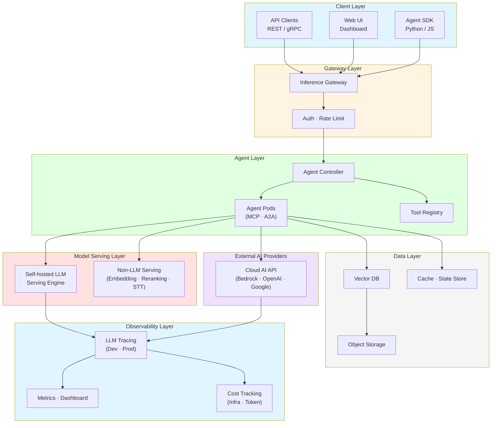
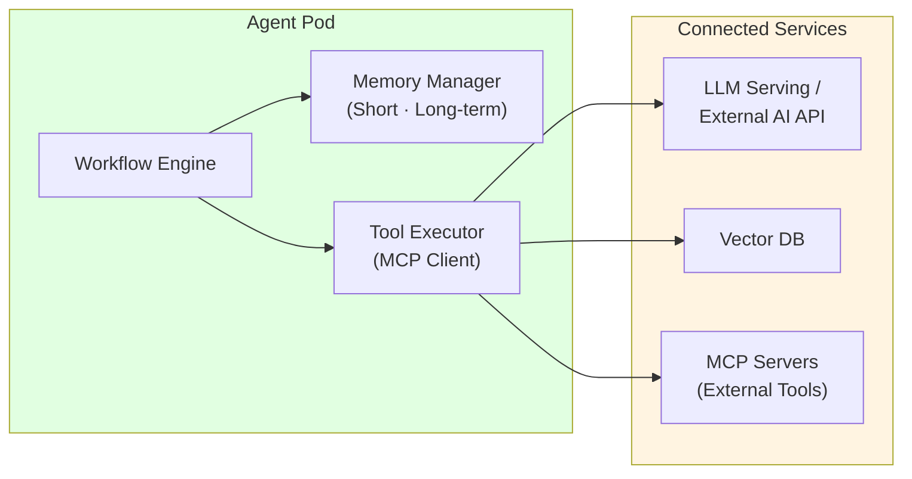
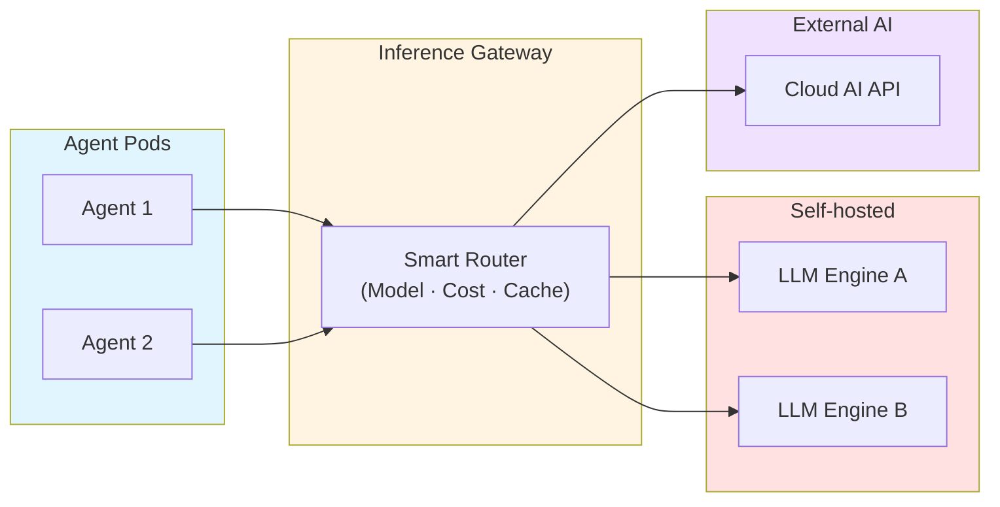
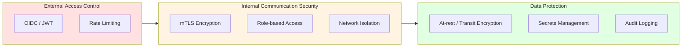
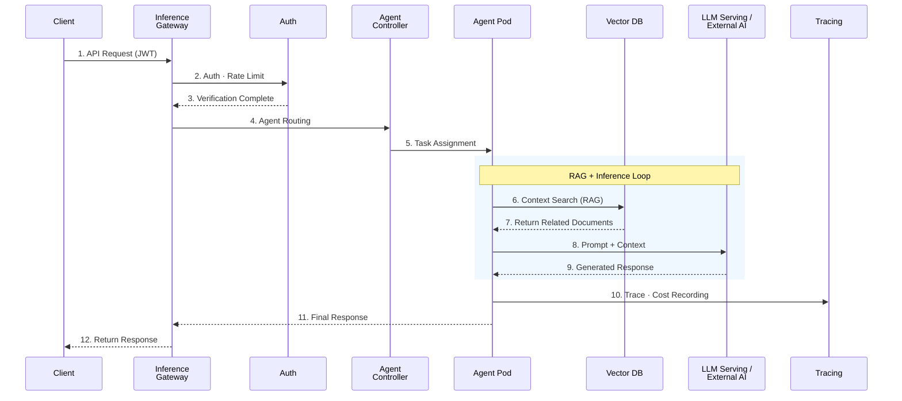

import { LayerRoles, TenantIsolation, RequestProcessing } from '@site/src/components/ArchitectureTables';

# Agentic AI Platform Architecture

> 📅 **Created**: 2025-02-05 | **Updated**: 2026-03-20 | ⏱️ **Reading Time**: ~6 minutes

## Overview

Agentic AI Platform is an integrated platform that enables autonomous AI agents to perform complex tasks. It is designed to solve challenges encountered when building GenAI services: model serving complexity, lack of framework integration, scaling difficulties, absence of MLOps automation, and cost optimization. The platform provides **agent orchestration**, **intelligent inference routing**, **vector search-based RAG**, **LLM tracing and cost analysis**, **horizontal auto-scaling**, and **multi-tenant resource isolation** as core capabilities. For detailed analysis of each challenge, refer to the [Technical Challenges](./agentic-ai-challenges.md) document.

:::info Target Audience
This document is intended for solution architects, platform engineers, and DevOps engineers. Basic understanding of Kubernetes and AI/ML workloads is required.
:::

---

## Overall System Architecture

Agentic AI Platform consists of 6 major layers. Each layer has clear responsibilities and enables independent scaling and operations through loose coupling.

**Key Design Principles:**

- **Self-hosted + External AI Hybrid**: Unified management of self-hosted LLMs and external AI Provider APIs through the same gateway
- **2-Tier Cost Tracking**: Dual tracking at infrastructure level (model cost × tokens) and application level (per-Agent step costs)
- **MCP/A2A Standard Protocols**: Standardize communication between Agents and tools (MCP) and between Agents (A2A) to ensure interoperability

### Layer Roles

<LayerRoles />

---

## Core Components

### Agent Runtime

Agent Runtime is the environment where AI agents execute. Each agent runs as an independent container, with lifecycle managed by the Agent Controller.

| Function | Description |
|------|------|
| **State Management** | Maintain conversation context and task state, checkpointing |
| **Tool Execution** | Asynchronous execution of tools registered via MCP protocol |
| **Memory Management** | Combine short-term memory (session) and long-term memory (vector DB) |
| **Inter-Agent Communication** | Multi-agent collaboration via A2A protocol |
| **Error Recovery** | Automatic retry and fallback for failed tasks |

### Tool Registry

Centrally manage tools available to agents in a declarative manner. Each tool is exposed as an MCP server that Agents call through standard protocols.

| Tool Type | Purpose | Examples |
|----------|------|------|
| **API Tools** | Call external REST/gRPC services | CRM lookup, order processing |
| **Search Tools** | Vector DB search, document search | RAG context enhancement |
| **Code Execution** | Execute code in sandbox environment | Data analysis, calculations |
| **A2A Tools** | Delegate tasks to other Agents | Specialist Agent collaboration |

### Vector DB (RAG Storage)

Vector DB is the core of RAG systems. It converts documents to embedding vectors for storage and provides relevant context through similarity search upon Agent requests.

**Design Considerations:**
- **Multi-tenant Isolation**: Separate tenant data using Partition Keys
- **Index Strategy**: High-performance Approximate Nearest Neighbor search with HNSW index
- **Hybrid Search**: Improve search quality by combining Dense Vector + Sparse Vector (BM25)

### Inference Gateway

Inference Gateway is the core component that intelligently routes model inference requests. It integrates self-hosted LLMs and external AI Providers through a single endpoint.

**Routing Strategies:**

| Strategy | Description |
|------|------|
| **Model-based Routing** | Distribute to appropriate model backends based on request headers/parameters |
| **KV Cache-aware Routing** | Minimize TTFT by considering LLM Prefix Cache state |
| **Cascade Routing** | Try low-cost model first → automatically switch to high-performance model on failure |
| **Weight-based Routing** | Split traffic by ratio for Canary/Blue-Green deployments |
| **Fallback** | Automatically switch to alternative Provider on Provider failure |

---

## Deployment Architecture

### Namespace Configuration

Separate namespaces by function for separation of concerns and security.

| Namespace | Components | Pod Security | GPU |
|-------------|---------|-------------|-----|
| **ai-gateway** | Inference Gateway, Auth | restricted | - |
| **ai-agents** | Agent Controller, Agent Pods, Tool Registry | baseline | - |
| **ai-inference** | LLM Serving Engine, GPU Nodes | privileged | Required |
| **ai-data** | Vector DB, Cache | baseline | - |
| **observability** | Tracing, Metrics, Dashboard | baseline | - |

---

## Scalability Design

### Horizontal Scaling Strategy

Each component can scale horizontally independently.

| Component | Scaling Trigger | Method |
|---------|---------------|------|
| Agent Pod | Message queue length, active session count | Event-driven Autoscaling |
| LLM Serving | GPU utilization, queue wait time | HPA + GPU Node Auto-provisioning |
| Vector DB | Query latency, index size | Independent Query/Index Node scaling |
| Cache | Memory utilization | Cluster scaling |

### Multi-tenant Support

Support multi-tenancy through a combination of namespace isolation, resource quotas, and network policies so multiple teams or projects can share the same platform.

<TenantIsolation />

---

## Security Architecture

Agentic AI Platform applies **3-layer security** for external access, internal communication, and data security.

**Agent-Specific Security Considerations:**

- **Prompt Injection Defense**: Block malicious prompts with input validation layer (Guardrails)
- **Tool Execution Permission Limits**: Declaratively define callable tools per Agent, apply least privilege principle
- **PII Leakage Prevention**: Block exposure of sensitive information through output filtering
- **Execution Time Limits**: Set timeouts and maximum step counts to prevent Agent infinite loops

:::danger Security Warnings
- Always enable mTLS in production environments
- Store API keys and tokens in Secrets Manager
- Perform regular security audits and patch vulnerabilities
:::

---

## Data Flow

The complete flow of user requests processed through the platform.

<RequestProcessing />

---

## Monitoring and Observability

### Key Monitoring Areas

| Area | Target Metrics | Purpose |
|------|-----------|------|
| **Agent Performance** | Request count, P50/P99 latency, error rate, step count | Track agent performance |
| **LLM Performance** | Token throughput, TTFT, TPS, queue wait time | Model serving performance |
| **Resource Usage** | CPU, memory, GPU utilization/temperature | Resource efficiency |
| **Cost Tracking** | Per-tenant/per-model token costs, infrastructure costs | Cost governance |

**Example Alert Rules:**
- Agent P99 latency > 10s → Warning
- Agent error rate > 5% → Critical
- GPU utilization < 20% (sustained 30min) → Cost Warning
- Token cost reaches 80% of daily budget → Budget Warning

---

## Platform Requirements

| Area | Required Capability | Description |
|------|----------|------|
| Container Orchestration | Managed Kubernetes | GPU node auto-provisioning, declarative workload management |
| Networking | Gateway API support | Intelligent model routing, mTLS, Rate Limiting |
| Model Serving | LLM inference engine | PagedAttention, KV Cache optimization, distributed inference |
| External AI Integration | API Gateway / Proxy | External AI Provider integration, Fallback, cost tracking |
| Agent Framework | Workflow engine | Multi-step execution, state management, MCP/A2A protocols |
| Data Layer | Vector DB + Cache | RAG search, session state storage, long-term memory |
| Observability | LLM tracing + Metrics | Token cost tracking, Agent Trace analysis, quality evaluation |
| Security | Multi-layer security model | OIDC/JWT, RBAC, NetworkPolicy, Guardrails |

For specific technology stacks and implementation methods, refer to [AWS Native Platform](./aws-native-agentic-platform.md) or [EKS-Based Open Architecture](./agentic-ai-solutions-eks.md).

---

## Conclusion

Core principles of Agentic AI Platform architecture:

1. **Modularity**: Each component can be independently deployed, scaled, and updated
2. **Hybrid AI**: Unified management of self-hosted LLMs and External AI Providers
3. **Standard Protocols**: Standardize tool connections and inter-Agent communication with MCP/A2A
4. **Observability**: Integrated monitoring of Trace, cost, and quality across the entire request flow
5. **Security**: Multi-layer security model + Agent-specific security (Guardrails, tool permission limits)
6. **Multi-tenancy**: Support multiple teams through namespace isolation, resource quotas, network policies

:::tip Implementation Guide
Specific methods for implementing this platform architecture are covered in the following documents:

- [Technical Challenges](./agentic-ai-challenges.md) — Key challenges faced when building the platform
- [AWS Native Platform](./aws-native-agentic-platform.md) — Managed service-based implementation
- [EKS-Based Open Architecture](./agentic-ai-solutions-eks.md) — EKS + open-source-based implementation
:::

## References

- [Kubernetes Gateway API](https://gateway-api.sigs.k8s.io/)
- [MCP (Model Context Protocol)](https://modelcontextprotocol.io/)
- [A2A (Agent-to-Agent Protocol)](https://google.github.io/A2A/)
