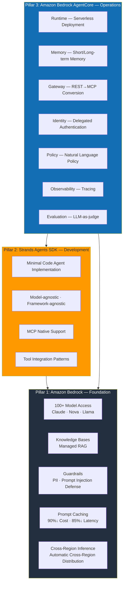
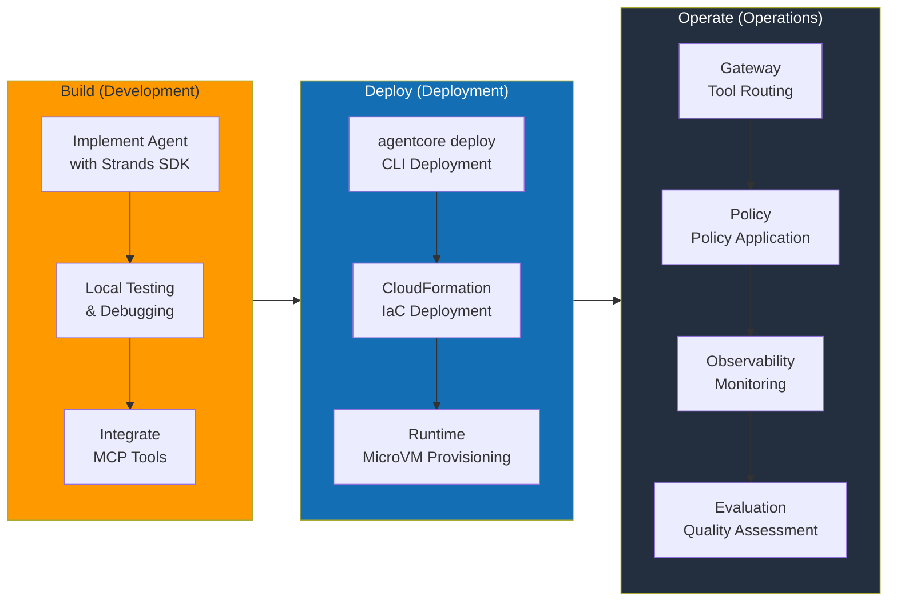
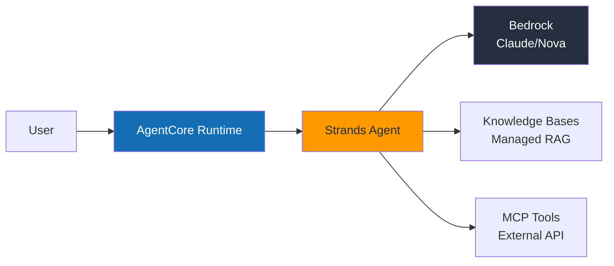
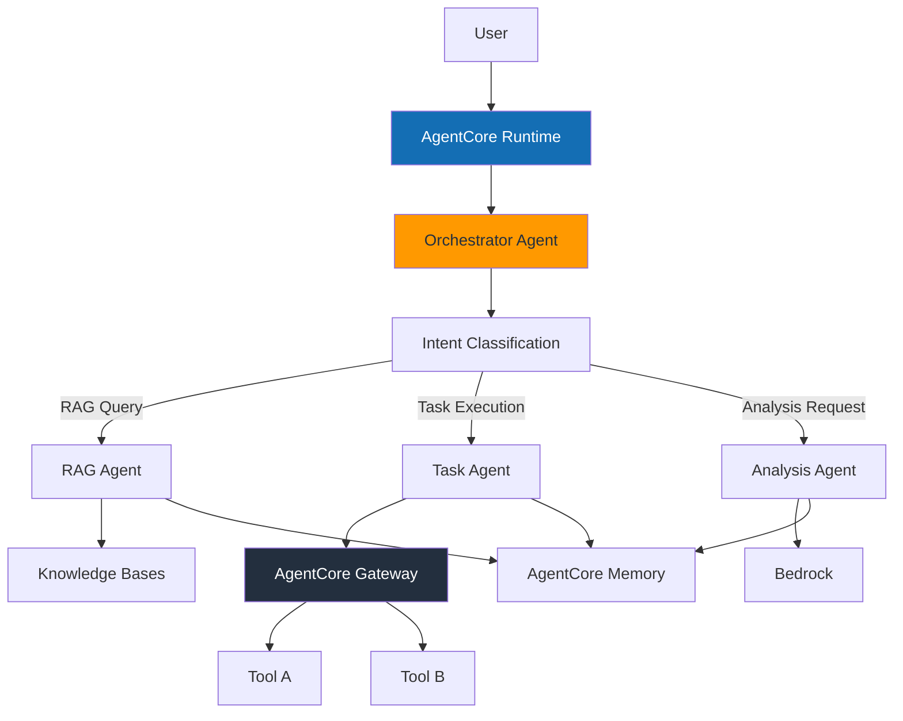

# AWS Native Agentic AI Platform

> **Written**: 2026-03-18 | **Updated**: 2026-03-20 | **Status**: Draft

## Overview

By leveraging AWS managed services, you can **focus on agent business logic instead of infrastructure operations**. AWS handles GPU management, scaling, availability, and security, allowing development teams to invest their capabilities solely in the problems agents solve.

The AWS Agentic AI stack consists of three pillars:

| Pillar | Service | Role |
|--------|---------|------|
| **Foundation** | Amazon Bedrock | Model access, RAG, guardrails, prompt caching |
| **Development** | Strands Agents SDK | Agent framework, MCP native, tool integration |
| **Operations** | Amazon Bedrock AgentCore | Serverless deployment, memory, gateway, policy, evaluation |

:::info Core Perspective
This document covers the **agent development optimization approach** provided by AWS managed services. The strategy is to delegate areas where managed services suffice to AWS and focus team capabilities on agent business logic.
:::

---

## AWS Agentic AI Service Architecture

### 3-Pillar Architecture



---

## Amazon Bedrock: Foundation Layer

Amazon Bedrock provides the **foundational infrastructure** for Agentic AI platforms. Access 100+ foundation models through a single API, with managed support for RAG, guardrails, and prompt caching.

### Core Features

| Feature | Description | Core Value |
|------|------|----------|
| **Model Access** | 100+ models including Claude, Nova, Llama, Mistral | Single API, no code changes for model switching |
| **Knowledge Bases** | Document parsing → Chunking → Embedding → Indexing → Retrieval | One-click RAG pipeline, complete with S3 upload |
| **Guardrails** | PII filtering, prompt injection defense, topic restrictions | Set policies in console, no code changes |
| **Prompt Caching** | Caching repeated context | Up to 90% cost savings, up to 85% latency reduction |
| **Cross-Region Inference** | Automatic cross-region traffic distribution | Automatic fallback on capacity limits, improved availability |
| **Prompt Management** | Prompt versioning, A/B testing | Prompt history tracking, rollback support |
| **Model Evaluation** | Automated model evaluation, batch processing | LLM-as-a-judge, human evaluation workflow |

:::tip Prompt Caching Utilization
Agents with long system prompts or repetitive tool definitions should activate Prompt Caching to significantly reduce costs and latency. Particularly effective for patterns with frequently repeated RAG context.
:::

---

## Strands Agents SDK: Development Framework

**Strands Agents SDK** is an open-source agent framework released by AWS under Apache 2.0. It implements production-grade agents with minimal code and supports various model providers beyond Bedrock with model-agnostic design.

### Minimal Code Agent Implementation

```python
from strands import Agent
from strands.models import BedrockModel

# Basic Agent — Complete in 3 lines
agent = Agent(
    model=BedrockModel(model_id="anthropic.claude-sonnet-4-20250514"),
    tools=["calculator", "web_search"],
)
result = agent("Convert Seoul's current temperature to Celsius and Fahrenheit")
```

### MCP Native Support

```python
from strands import Agent
from strands.tools.mcp import MCPClient

# Connect MCP server — Auto-discover external tools and integrate with agent
mcp_client = MCPClient(server_url="http://mcp-server:8080")

agent = Agent(
    model=BedrockModel(model_id="anthropic.claude-sonnet-4-20250514"),
    tools=[mcp_client],  # Auto-discover and register MCP tools
)
result = agent("Check recent order history and verify delivery status")
```

### Custom Tool Definition

```python
from strands import Agent, tool

@tool
def lookup_customer(customer_id: str) -> dict:
    """Retrieve customer information."""
    # Implement business logic
    return {"name": "John Doe", "tier": "GOLD", "since": "2023-01"}

@tool
def create_ticket(title: str, priority: str, description: str) -> dict:
    """Create customer inquiry ticket."""
    return {"ticket_id": "TK-2026-0042", "status": "OPEN"}

agent = Agent(
    model=BedrockModel(model_id="anthropic.claude-sonnet-4-20250514"),
    tools=[lookup_customer, create_ticket],
    system_prompt="You are a customer service agent. Look up customer information and create tickets as needed.",
)
```

### Strands SDK Core Characteristics

| Characteristic | Description |
|------|------|
| **Apache 2.0** | Free for commercial use, forkable |
| **Model-agnostic** | Supports various backends including Bedrock, OpenAI, Anthropic API, Ollama |
| **Framework-agnostic** | Runs in any runtime including FastAPI, Flask, Lambda |
| **MCP Native** | Built-in Model Context Protocol support, no separate adapter needed |
| **AgentCore Integration** | Production deployment with single line `agentcore deploy` |
| **Streaming Response** | Token-level streaming, real-time UX support |

---

## Amazon Bedrock AgentCore: Operations Platform

AgentCore is a platform that provides **everything needed for production operations of agents** as managed services. Released as GA (General Availability) in 2025, consisting of 7 core services.

### 7 Core Services

#### 1. Runtime — Serverless Agent Deployment

AgentCore Runtime provides isolated execution environments based on **Firecracker MicroVM**.

| Item | Specification |
|------|------|
| Isolation Level | Firecracker MicroVM (hardware-level isolation) |
| Session Duration | Up to 8 hours continuous session |
| Scaling | Auto-scales from 0, scales down to 0 when no requests |
| Deployment | `agentcore deploy` CLI or CloudFormation |
| Cold Start | Within seconds |

```bash
# Deploy Strands Agent to AgentCore
agentcore deploy \
  --agent-name "customer-service" \
  --entry-point "agent.py" \
  --runtime python3.12 \
  --memory 512 \
  --timeout 3600
```

#### 2. Memory — Short/Long-term Memory Management

Managed memory service enabling agents to remember conversation context and user preferences.

| Memory Type | Description | Use Case |
|------------|------|----------|
| **Short-term Memory** | In-session conversation history | Reference previous questions in multi-turn conversations |
| **Long-term Memory** | Persistent information across sessions | User preferences, past interaction patterns |
| **Auto-summarization** | Automatically summarize and save long conversations | Maintain core information when context window exceeded |
| **User Profile** | Learning personalization information | "This user prefers concise answers" |

#### 3. Gateway — Intelligent Tool Routing

AgentCore Gateway **automatically converts REST API to MCP protocol** and uses semantic tool search to select only relevant tools from hundreds.

:::info Semantic Tool Search
Even if 300 tools are registered with the agent, Gateway analyzes user requests and delivers only 4 relevant tools to the agent. This saves LLM context window and improves tool selection accuracy.
:::

| Feature | Description |
|------|------|
| **REST → MCP Conversion** | Auto-wrap existing REST APIs as MCP tools |
| **Semantic Search** | Auto-filter 300 tools → 4 relevant ones |
| **Tool Registry** | Centralized tool registration and version management |
| **Auth Propagation** | Securely pass user authentication info to tools |

#### 4. Identity — Delegated Authentication

| Feature | Description |
|------|------|
| **IdP Integration** | Okta, Amazon Cognito, OIDC-compatible providers |
| **Delegated Auth** | Agent authenticates to tools on behalf of user (OAuth 2.0 token exchange) |
| **Granular Permissions** | Per-tool, per-resource access control |
| **Audit Logs** | All authentication events recorded in CloudTrail |

#### 5. Policy — Natural Language Policy Definition

Policies defined in natural language are **compiled to deterministic runtime** ensuring consistent policy enforcement.

```text
# Natural language policy example
Policy: "Only allow refund processing for Gold tier and above customers"
→ Compiled → Runs as deterministic rule engine (without LLM calls)

Policy: "Always mask PII when calling external APIs"
→ Compiled → Auto-applied at Gateway level
```

| Characteristic | Description |
|------|------|
| **Natural Language Input** | Non-developers can define policies |
| **Deterministic Execution** | Compiled policies applied definitively without LLM |
| **Real-time Enforcement** | Policy verified on every request at runtime |
| **Audit Trail** | Full history of policy application/rejection |

#### 6. Observability — Integrated Monitoring

| Feature | Description |
|------|------|
| **CloudWatch Integration** | Auto-collect metrics, logs, alarms |
| **OpenTelemetry** | Standard instrumentation compatible with existing monitoring tools |
| **Step-by-step Tracing** | Track entire process from agent reasoning → tool call → response |
| **Cost Dashboard** | Visualize costs by model, agent, session |

#### 7. Evaluation — Continuous Quality Monitoring

| Feature | Description |
|------|------|
| **LLM-as-judge** | LLM automatically evaluates agent response quality |
| **13 Evaluation Criteria** | Accuracy, relevance, harmfulness, consistency, etc. |
| **A/B Testing** | Quantitatively measure quality impact of prompt/model changes |
| **Continuous Monitoring** | Real-time quality tracking in production traffic |
| **Human Evaluation Workflow** | Parallel automatic evaluation and expert evaluation |

---

## Architecture Patterns

### Build → Deploy → Operate Workflow



### Simple Agent Pattern

Suitable for agents performing single tasks like FAQ, billing inquiry, status check.



### Complex Agent Pattern (Multi-step)

Suitable for agents that call multiple tools sequentially/in parallel and branch based on intermediate results.



### Multi-Agent Pattern

Independent agents collaborate to handle complex business processes.

```python
from strands import Agent
from strands.models import BedrockModel
from strands.multiagent import MultiAgentOrchestrator

# Define specialized agents
research_agent = Agent(
    model=BedrockModel(model_id="anthropic.claude-sonnet-4-20250514"),
    system_prompt="You are a research specialist.",
    tools=["web_search", "document_reader"],
)

analysis_agent = Agent(
    model=BedrockModel(model_id="anthropic.claude-sonnet-4-20250514"),
    system_prompt="You are a data analysis specialist.",
    tools=["calculator", "chart_generator"],
)

writer_agent = Agent(
    model=BedrockModel(model_id="anthropic.claude-sonnet-4-20250514"),
    system_prompt="You are a report writing specialist.",
    tools=["document_writer"],
)

# Multi-agent orchestration
orchestrator = MultiAgentOrchestrator(
    agents=[research_agent, analysis_agent, writer_agent],
    strategy="sequential",  # Sequential execution: research → analysis → writing
)
result = orchestrator("Create Q1 2026 market trend report")
```

---

## Deployment Guide

### Strands + AgentCore CLI Deployment

```bash
# 1. Initialize project
mkdir my-agent && cd my-agent
pip install strands-agents strands-agents-tools

# 2. Write agent code (agent.py)
cat << 'EOF' > agent.py
from strands import Agent
from strands.models import BedrockModel

agent = Agent(
    model=BedrockModel(model_id="anthropic.claude-sonnet-4-20250514"),
    tools=["calculator"],
    system_prompt="You are a math assistant.",
)

def handler(event, context):
    return agent(event["prompt"])
EOF

# 3. Deploy to AgentCore
agentcore deploy \
  --agent-name "math-helper" \
  --entry-point "agent.py:handler" \
  --runtime python3.12

# 4. Test invocation
agentcore invoke --agent-name "math-helper" \
  --payload '{"prompt": "Calculate the 20th term of Fibonacci sequence"}'
```

### CloudFormation-based IaC Deployment

```yaml
AWSTemplateFormatVersion: '2010-09-09'
Description: AgentCore Agent Deployment

Resources:
  CustomerServiceAgent:
    Type: AWS::Bedrock::AgentCoreEndpoint
    Properties:
      AgentName: customer-service
      Runtime: python3.12
      EntryPoint: agent.py:handler
      MemorySize: 512
      Timeout: 3600
      Environment:
        Variables:
          MODEL_ID: anthropic.claude-sonnet-4-20250514
          KNOWLEDGE_BASE_ID: !Ref KnowledgeBase

  KnowledgeBase:
    Type: AWS::Bedrock::KnowledgeBase
    Properties:
      Name: customer-faq
      StorageConfiguration:
        Type: OPENSEARCH_SERVERLESS
      KnowledgeBaseConfiguration:
        Type: VECTOR
        VectorKnowledgeBaseConfiguration:
          EmbeddingModelArn: !Sub "arn:aws:bedrock:${AWS::Region}::foundation-model/amazon.titan-embed-text-v2"

  DataSource:
    Type: AWS::Bedrock::DataSource
    Properties:
      KnowledgeBaseId: !Ref KnowledgeBase
      DataSourceConfiguration:
        Type: S3
        S3Configuration:
          BucketArn: !Sub "arn:aws:s3:::${DocumentBucket}"

  DocumentBucket:
    Type: AWS::S3::Bucket
    Properties:
      BucketName: !Sub "agent-docs-${AWS::AccountId}"
```

### FAST Full-stack Template

AWS's **FAST (Full-stack Agent Starter Template)** allows you to quickly bootstrap an agent project.

```bash
# Create project with FAST template
npx create-agent-app my-agent --template fast

# Project structure
my-agent/
├── agent/           # Strands Agent code
├── api/             # FastAPI endpoint
├── frontend/        # React UI
├── infra/           # CDK/CloudFormation
├── tests/           # Tests
└── agentcore.yaml   # AgentCore deployment config
```

:::tip FAST Template Utilization
FAST is a full-stack template including agent code, API, frontend, and infrastructure code. Deploy the entire stack with a single `cdk deploy` command using the built-in CDK-based deployment pipeline.
:::

---

## Enterprise Use Cases

### Baemin: RAG-based Knowledge Agent

| Item | Content |
|------|------|
| **Challenge** | Reduce internal policy search time for customer center agents |
| **Configuration** | Strands Agent + Bedrock Knowledge Bases + Claude |
| **Results** | **30% improvement** in consultation efficiency, 90% reduction in policy search time |
| **Core Value** | Complete knowledge agent with just S3 document upload, no RAG pipeline building |

### CJ OnStyle: Multi-agent Live Commerce

| Item | Content |
|------|------|
| **Challenge** | Automate real-time customer question response during live broadcasts |
| **Configuration** | Multi-agent (Product info agent + Order agent + Recommendation agent) |
| **Results** | **3x improvement** in customer response rate, real-time processing within 2 seconds |
| **Core Value** | Handle broadcast traffic surges with AgentCore Runtime's auto-scaling |

### Amazon Devices: Manufacturing Agent

| Item | Content |
|------|------|
| **Challenge** | Automate manufacturing line quality inspection model fine-tuning |
| **Configuration** | Strands Agent + Bedrock Fine-tuning + AgentCore |
| **Results** | Reduced fine-tuning time from **days → 1 hour** |
| **Core Value** | Agent auto-orchestrates data preprocessing → fine-tuning → evaluation |

---

## Cost Structure

AgentCore-based platform costs follow a **pay-as-you-go** serverless model.

### Pricing Structure

| Service | Pricing Basis | Characteristics |
|--------|----------|------|
| **Bedrock Inference** | Input/output token count | On-demand, provisioned throughput options |
| **AgentCore Runtime** | Session time + memory usage | 0 charges when no requests, up to 8-hour sessions |
| **Knowledge Bases** | Storage + query count | OpenSearch Serverless-based |
| **Guardrails** | Processed text units | Separate charges for input/output |
| **Prompt Caching** | 90% discount on cache hits | More savings with repetitive patterns |

### Operational Cost Reduction Points

| Area | Reduction Factor |
|------|----------|
| **GPU Management** | No need for GPU instance provisioning, patching, scaling operations staff |
| **Infrastructure Operations** | Remove cluster management burden with serverless architecture |
| **Security Compliance** | Leverage AWS's SOC 2, HIPAA, ISO 27001 certifications |
| **Availability Management** | Built-in DR with automatic multi-AZ placement, Cross-Region Inference |
| **Monitoring Setup** | No separate monitoring stack needed with CloudWatch native integration |

:::info Cost Optimization Tips
- **Prompt Caching**: Must activate for agents with long system prompts
- **Provisioned Throughput**: Save up to 50% compared to on-demand with stable traffic
- **Cross-Region Inference**: Prevent throttling with automatic fallback on regional capacity limits
- **Batch Inference**: Use batch mode for non-real-time evaluation/analysis tasks to reduce costs
:::

---

## Next Steps

- If EKS-based open source architecture is needed → [EKS-Based Solutions](./agentic-ai-solutions-eks.md)
- Overall platform design → [Platform Architecture](./agentic-platform-architecture.md)
