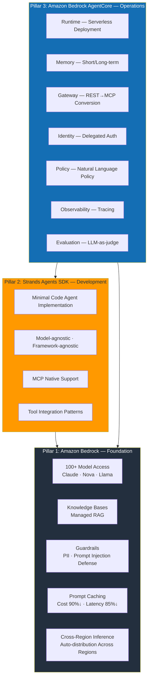
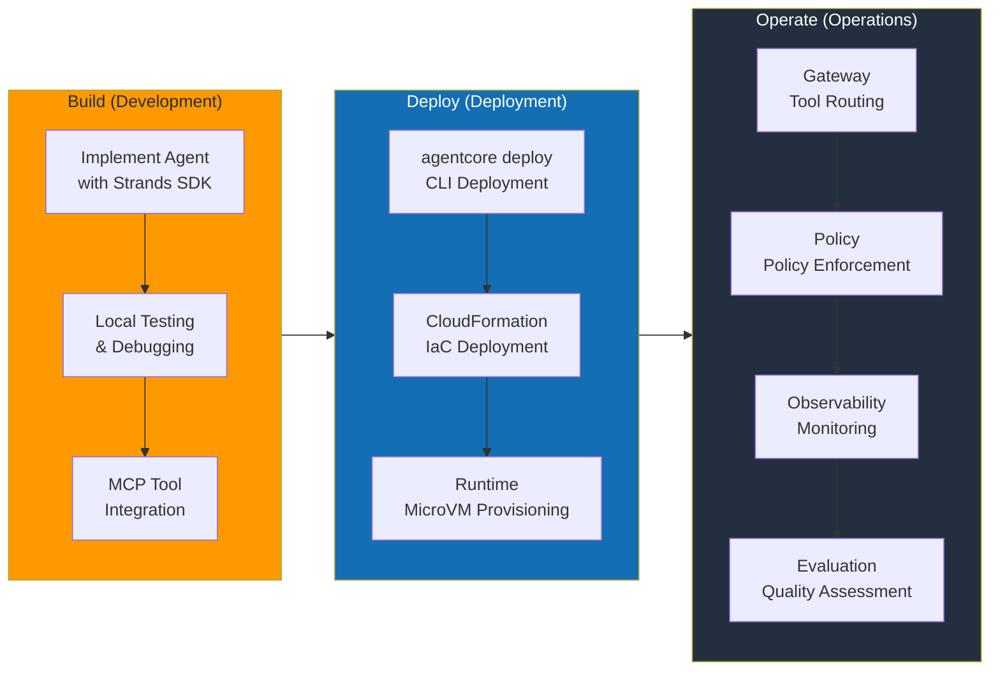
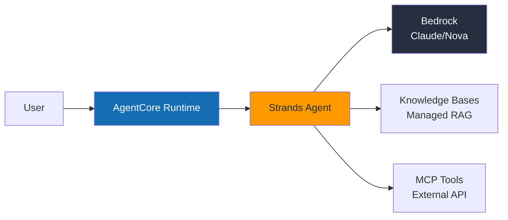
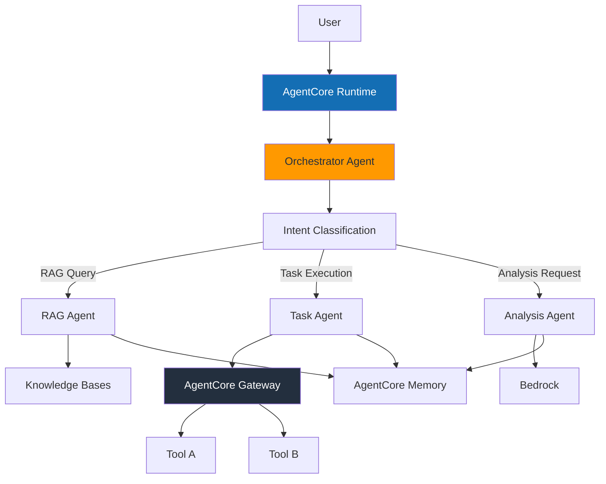
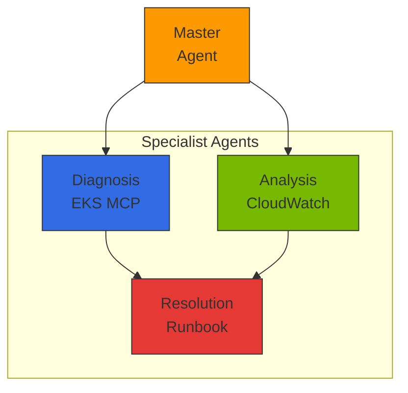

import { EKSMCPFeatures, KagentVsAgentCore, MultiAgentPatterns, MCPServerEcosystem } from '@site/src/components/BedrockMcpTables';

# AWS Native Agentic AI Platform

> **Created**: 2026-03-18 | **Updated**: 2026-03-20 | **Status**: Draft

## Overview

Using AWS managed services allows you to **focus on Agent business logic rather than infrastructure operations**. AWS handles GPU management, scaling, availability, and security, while development teams invest their capabilities solely in problems that Agents solve.

The AWS Agentic AI stack consists of three pillars.

| Pillar | Service | Role |
|--------|--------|------|
| **Foundation** | Amazon Bedrock | Model access, RAG, guardrails, prompt caching |
| **Development** | Strands Agents SDK | Agent framework, MCP native, tool integration |
| **Operations** | Amazon Bedrock AgentCore | Serverless deployment, memory, gateway, policy, evaluation |

:::info Core Perspective
This document covers the **Agent development optimization approach** provided by AWS managed services. The strategy is to delegate areas sufficient with managed services to AWS and focus team capabilities on Agent business logic.
:::

### Challenge Solution Mapping

How AWS Native approach solves the 5 key challenges covered in [Technical Challenges](./agentic-ai-challenges.md):

| Challenge | AWS Native Solution |
|---------|---------------------|
| GPU Resource Management and Cost Optimization | Bedrock serverless inference — no GPU management required |
| Intelligent Inference Routing and Gateway | Bedrock Cross-Region Inference + AgentCore Gateway |
| LLMOps Observability and Cost Governance | AgentCore Observability + CloudWatch |
| Agent Orchestration and Safety | Strands SDK + Bedrock Guardrails + AgentCore Policy |
| Model Supply Chain Management | Bedrock Model Evaluation + Prompt Management |

:::tip Core Value of AWS Native
AWS handles GPU infrastructure management, scaling, availability, and security, allowing teams to focus solely on Agent business logic. It can be combined with [EKS-Based Open Architecture](./agentic-ai-solutions-eks.md) when more granular control is needed.
:::

---

## AWS Agentic AI Service Architecture

### 3-Pillar Architecture



---

## Amazon Bedrock: Foundation Layer

Amazon Bedrock provides the **foundational infrastructure** for Agentic AI platforms. It offers single-API access to over 100 foundation models and managed support for RAG, guardrails, and prompt caching.

### Core Features

| Feature | Description | Core Value |
|------|------|----------|
| **Model Access** | 100+ models including Claude, Nova, Llama, Mistral | Single API, no code changes for model switching |
| **Knowledge Bases** | Document parsing → chunking → embedding → indexing → search | One-click RAG pipeline, complete with S3 upload only |
| **Guardrails** | PII filtering, prompt injection defense, topic restrictions | Policy configuration in console, no code changes |
| **Prompt Caching** | Repetitive context caching | Up to 90% cost reduction, up to 85% latency reduction |
| **Cross-Region Inference** | Automatic traffic distribution across regions | Auto-fallback at capacity limits, improved availability |
| **Prompt Management** | Prompt version management, A/B testing | Prompt history tracking, rollback support |
| **Model Evaluation** | Automated model evaluation, batch processing | LLM-as-a-judge, human evaluation workflows |

:::tip Leveraging Prompt Caching
Agents using long system prompts or repetitive tool definitions can significantly reduce costs and latency by enabling Prompt Caching. Particularly effective for patterns with frequently repeated RAG contexts.
:::

---

## Strands Agents SDK: Development Framework

**Strands Agents SDK** is an open-source agent framework released by AWS under Apache 2.0. It implements production-grade Agents with minimal code and supports various model providers beyond Bedrock with a Model-agnostic design.

### Minimal Code Agent Implementation

```python
from strands import Agent
from strands.models import BedrockModel

# Basic Agent — Complete in 3 lines
agent = Agent(
    model=BedrockModel(model_id="anthropic.claude-sonnet-4-20250514"),
    tools=["calculator", "web_search"],
)
result = agent("Convert Seoul's current temperature to Celsius and Fahrenheit")
```

### MCP Native Support

```python
from strands import Agent
from strands.tools.mcp import MCPClient

# Connect MCP server — Auto-discover external tools and integrate into Agent
mcp_client = MCPClient(server_url="http://mcp-server:8080")

agent = Agent(
    model=BedrockModel(model_id="anthropic.claude-sonnet-4-20250514"),
    tools=[mcp_client],  # Auto-discover and register MCP tools
)
result = agent("Check recent order history and verify delivery status")
```

### Custom Tool Definition

```python
from strands import Agent, tool

@tool
def lookup_customer(customer_id: str) -> dict:
    """Lookup customer information."""
    # Business logic implementation
    return {"name": "John Doe", "tier": "GOLD", "since": "2023-01"}

@tool
def create_ticket(title: str, priority: str, description: str) -> dict:
    """Create customer inquiry ticket."""
    return {"ticket_id": "TK-2026-0042", "status": "OPEN"}

agent = Agent(
    model=BedrockModel(model_id="anthropic.claude-sonnet-4-20250514"),
    tools=[lookup_customer, create_ticket],
    system_prompt="You are a customer service Agent. Look up customer information and create tickets as needed.",
)
```

### Strands SDK Core Features

| Feature | Description |
|------|------|
| **Apache 2.0** | Free for commercial use, forkable |
| **Model-agnostic** | Supports various backends including Bedrock, OpenAI, Anthropic API, Ollama |
| **Framework-agnostic** | Runs on any runtime such as FastAPI, Flask, Lambda |
| **MCP Native** | Built-in Model Context Protocol support, no separate adapter required |
| **AgentCore Integration** | Production deployment with a single `agentcore deploy` command |
| **Streaming Responses** | Token-level streaming, real-time UX support |

---

## Amazon Bedrock AgentCore: Operations Platform

AgentCore is a platform that provides **everything needed for production Agent operations** as a managed service. It was released as GA (General Availability) in 2025 and consists of 7 core services.

### 7 Core Services

#### 1. Runtime — Serverless Agent Deployment

AgentCore Runtime provides an isolated execution environment based on **Firecracker MicroVM**.

| Item | Specification |
|------|------|
| Isolation Level | Firecracker MicroVM (hardware-level isolation) |
| Session Persistence | Maximum 8-hour continuous sessions |
| Scaling | Auto-scale from 0, scale down to 0 when no requests |
| Deployment | `agentcore deploy` CLI or CloudFormation |
| Cold Start | Within seconds |

```bash
# Deploy Strands Agent to AgentCore
agentcore deploy \
  --agent-name "customer-service" \
  --entry-point "agent.py" \
  --runtime python3.12 \
  --memory 512 \
  --timeout 3600
```

#### 2. Memory — Short/Long-term Memory Management

A managed memory service that enables Agents to remember conversation context and user preferences.

| Memory Type | Description | Use Case |
|------------|------|----------|
| **Short-term Memory** | In-session conversation history | Reference previous questions in multi-turn conversations |
| **Long-term Memory** | Persistent information across sessions | User preferences, past interaction patterns |
| **Auto-summarization** | Automatically summarize and save long conversations | Maintain key information when context window is exceeded |
| **User Profile** | Learn personalization information | "This user prefers concise answers" |

#### 3. Gateway — Intelligent Tool Routing

AgentCore Gateway **automatically converts REST APIs to MCP protocol** and uses semantic tool search to select only relevant tools from hundreds of available tools.

:::info Semantic Tool Search
Even when 300 tools are registered with an Agent, Gateway analyzes user requests and delivers only the 4 relevant tools to the Agent. This saves LLM context window and improves tool selection accuracy.
:::

| Feature | Description |
|------|------|
| **REST → MCP Conversion** | Auto-wrap existing REST APIs as MCP tools |
| **Semantic Search** | Auto-filter 300 tools → 4 relevant ones |
| **Tool Registry** | Centralized tool registration and version management |
| **Auth Propagation** | Safely propagate user authentication to tools |

#### 4. Identity — Delegated Authentication

| Feature | Description |
|------|------|
| **IdP Integration** | Okta, Amazon Cognito, OIDC-compatible providers |
| **Delegated Auth** | Agent authenticates to tools on user's behalf (OAuth 2.0 token exchange) |
| **Granular Permissions** | Per-tool, per-resource access control |
| **Audit Logs** | CloudTrail recording of all authentication events |

#### 5. Policy — Natural Language Policy Definition

Defining policies in natural language **compiles them to deterministic runtime**, ensuring consistent policy enforcement.

```text
# Natural language policy examples
Policy: "Allow refund processing only for Gold tier or higher customers"
→ Compile → Execute with deterministic rule engine (without LLM calls)

Policy: "Always mask PII when calling external APIs"
→ Compile → Auto-apply at Gateway level
```

| Characteristic | Description |
|------|------|
| **Natural Language Input** | Non-developers can define policies |
| **Deterministic Execution** | Compiled policies apply deterministically without LLM |
| **Real-time Enforcement** | Policy verification on every request at runtime |
| **Audit Trail** | Complete recording of policy application/rejection history |

#### 6. Observability — Integrated Monitoring

| Feature | Description |
|------|------|
| **CloudWatch Integration** | Auto-collection of metrics, logs, alarms |
| **OpenTelemetry** | Standard instrumentation compatible with existing monitoring tools |
| **Step-by-step Tracing** | Track entire process: Agent reasoning → tool calls → response |
| **Cost Dashboard** | Visualize costs by model, Agent, session |

#### 7. Evaluation — Continuous Quality Monitoring

| Feature | Description |
|------|------|
| **LLM-as-judge** | LLM automatically evaluates Agent response quality |
| **13 Evaluation Criteria** | Accuracy, relevance, harmfulness, consistency, etc. |
| **A/B Testing** | Quantitatively measure quality impact of prompt/model changes |
| **Continuous Monitoring** | Real-time quality tracking in production traffic |
| **Human Evaluation Workflow** | Combine automated and expert evaluation |

---

## Architecture Patterns

### Build → Deploy → Operate Workflow



### Simple Agent Pattern

Suitable for Agents performing single tasks such as FAQ, billing inquiry, status check.



### Complex Agent Pattern (Multi-step)

Suitable for Agents that call multiple tools sequentially/in parallel and branch based on intermediate results.



### Multi-Agent Pattern

Independent Agents collaborate to handle complex business processes.

```python
from strands import Agent
from strands.models import BedrockModel
from strands.multiagent import MultiAgentOrchestrator

# Define specialist Agents
research_agent = Agent(
    model=BedrockModel(model_id="anthropic.claude-sonnet-4-20250514"),
    system_prompt="You are a research specialist.",
    tools=["web_search", "document_reader"],
)

analysis_agent = Agent(
    model=BedrockModel(model_id="anthropic.claude-sonnet-4-20250514"),
    system_prompt="You are a data analysis specialist.",
    tools=["calculator", "chart_generator"],
)

writer_agent = Agent(
    model=BedrockModel(model_id="anthropic.claude-sonnet-4-20250514"),
    system_prompt="You are a report writing specialist.",
    tools=["document_writer"],
)

# Multi-agent orchestration
orchestrator = MultiAgentOrchestrator(
    agents=[research_agent, analysis_agent, writer_agent],
    strategy="sequential",  # Sequential execution: Research → Analysis → Writing
)
result = orchestrator("Create a Q1 2026 market trends report")
```

---

## Deployment Guide

### Strands + AgentCore CLI Deployment

```bash
# 1. Initialize project
mkdir my-agent && cd my-agent
pip install strands-agents strands-agents-tools

# 2. Write Agent code (agent.py)
cat << 'EOF' > agent.py
from strands import Agent
from strands.models import BedrockModel

agent = Agent(
    model=BedrockModel(model_id="anthropic.claude-sonnet-4-20250514"),
    tools=["calculator"],
    system_prompt="You are a math assistant.",
)

def handler(event, context):
    return agent(event["prompt"])
EOF

# 3. Deploy to AgentCore
agentcore deploy \
  --agent-name "math-helper" \
  --entry-point "agent.py:handler" \
  --runtime python3.12

# 4. Test invocation
agentcore invoke --agent-name "math-helper" \
  --payload '{"prompt": "Calculate the 20th term of the Fibonacci sequence"}'
```

### CloudFormation-based IaC Deployment

```yaml
AWSTemplateFormatVersion: '2010-09-09'
Description: AgentCore Agent Deployment

Resources:
  CustomerServiceAgent:
    Type: AWS::Bedrock::AgentCoreEndpoint
    Properties:
      AgentName: customer-service
      Runtime: python3.12
      EntryPoint: agent.py:handler
      MemorySize: 512
      Timeout: 3600
      Environment:
        Variables:
          MODEL_ID: anthropic.claude-sonnet-4-20250514
          KNOWLEDGE_BASE_ID: !Ref KnowledgeBase

  KnowledgeBase:
    Type: AWS::Bedrock::KnowledgeBase
    Properties:
      Name: customer-faq
      StorageConfiguration:
        Type: OPENSEARCH_SERVERLESS
      KnowledgeBaseConfiguration:
        Type: VECTOR
        VectorKnowledgeBaseConfiguration:
          EmbeddingModelArn: !Sub "arn:aws:bedrock:${AWS::Region}::foundation-model/amazon.titan-embed-text-v2"

  DataSource:
    Type: AWS::Bedrock::DataSource
    Properties:
      KnowledgeBaseId: !Ref KnowledgeBase
      DataSourceConfiguration:
        Type: S3
        S3Configuration:
          BucketArn: !Sub "arn:aws:s3:::${DocumentBucket}"

  DocumentBucket:
    Type: AWS::S3::Bucket
    Properties:
      BucketName: !Sub "agent-docs-${AWS::AccountId}"
```

### FAST Full-stack Template

AWS provides **FAST (Full-stack Agent Starter Template)** to quickly bootstrap Agent projects.

```bash
# Create project with FAST template
npx create-agent-app my-agent --template fast

# Project structure
my-agent/
├── agent/           # Strands Agent code
├── api/             # FastAPI endpoints
├── frontend/        # React UI
├── infra/           # CDK/CloudFormation
├── tests/           # Tests
└── agentcore.yaml   # AgentCore deployment config
```

:::tip Using FAST Template
FAST is a full-stack template that includes Agent code, API, frontend, and infrastructure code. It has a built-in CDK-based deployment pipeline, allowing you to deploy the entire stack with a single `cdk deploy` command.
:::

---

## Enterprise Use Cases

### Baemin (Baemin): RAG-based Knowledge Agent

| Item | Details |
|------|------|
| **Challenge** | Reduce internal policy search time for customer service representatives |
| **Architecture** | Strands Agent + Bedrock Knowledge Bases + Claude |
| **Results** | **30% improvement** in consultation efficiency, 90% reduction in policy search time |
| **Key Value** | Complete knowledge Agent with just S3 document upload, no RAG pipeline required |

### CJ OnStyle: Multi-agent Live Commerce

| Item | Details |
|------|------|
| **Challenge** | Automate real-time customer question responses during live broadcasts |
| **Architecture** | Multi-agent (Product Info Agent + Order Agent + Recommendation Agent) |
| **Results** | **3x improvement** in customer response rate, real-time processing latency under 2 seconds |
| **Key Value** | Handle broadcast traffic spikes with AgentCore Runtime auto-scaling |

### Amazon Devices: Manufacturing Agent

| Item | Details |
|------|------|
| **Challenge** | Automate fine-tuning of manufacturing line quality inspection models |
| **Architecture** | Strands Agent + Bedrock Fine-tuning + AgentCore |
| **Results** | Fine-tuning time reduced from **days → 1 hour** |
| **Key Value** | Agent automatically orchestrates data preprocessing → fine-tuning → evaluation |

---

## Cost Structure

AgentCore-based platform costs follow a **pay-as-you-go** serverless model.

### Pricing Model

| Service | Pricing Basis | Features |
|--------|----------|------|
| **Bedrock Inference** | Input/output token count | On-demand or provisioned throughput options |
| **AgentCore Runtime** | Session time + memory usage | Zero cost when idle, max 8-hour sessions |
| **Knowledge Bases** | Storage + query count | Based on OpenSearch Serverless |
| **Guardrails** | Processed text units | Separate pricing for input/output |
| **Prompt Caching** | 90% discount on cache hits | Greater savings with more repetitive patterns |

### Operational Cost Reduction Points

| Area | Cost Reduction Elements |
|------|----------|
| **GPU Management** | No need for operational staff for GPU instance provisioning, patching, scaling |
| **Infrastructure Operations** | Eliminates cluster management burden with serverless architecture |
| **Security Compliance** | Leverage AWS SOC 2, HIPAA, ISO 27001 certifications |
| **Availability Management** | Built-in DR with automatic multi-AZ deployment and Cross-Region Inference |
| **Monitoring Setup** | No separate monitoring stack needed with native CloudWatch integration |

:::info Cost Optimization Tips
- **Prompt Caching**: Must enable for Agents with long system prompts
- **Provisioned Throughput**: Up to 50% savings compared to on-demand with steady traffic
- **Cross-Region Inference**: Prevents throttling with automatic fallback when specific region capacity limits are reached
- **Batch Inference**: Reduce costs by using batch mode for evaluation/analysis tasks that don't require real-time processing
:::

---

## MCP Protocol and EKS Integration

### MCP (Model Context Protocol) Overview

MCP is a **standard communication protocol** between AI agents and tools:

- **Tool Discovery**: Agents dynamically discover available tools
- **Context Passing**: Pass execution context and state in standardized format
- **Result Return**: Return tool execution results in structured format
- **Inter-agent Communication**: Multi-agent collaboration through A2A protocol

### EKS MCP Server Integration

AWS provides EKS-dedicated hosted MCP servers to support integration between Kubernetes clusters and AI agents:

<EKSMCPFeatures />

**Deploy EKS MCP Server:**

```bash
# Clone AWS MCP server repository
git clone https://github.com/awslabs/mcp.git
cd mcp/servers/eks

# Build Docker image and deploy to EKS
docker build -t eks-mcp-server:latest .
kubectl apply -f k8s/deployment.yaml
```

**Connect MCP Tools in AgentCore (boto3):**

```python
import boto3, json

bedrock_agent = boto3.client('bedrock-agent')

# Create agent
response = bedrock_agent.create_agent(
    agentName='sre-agent',
    foundationModel='anthropic.claude-sonnet-4-20250514',
    instruction='You are an SRE agent that helps troubleshoot Kubernetes clusters.',
    agentResourceRoleArn='arn:aws:iam::ACCOUNT:role/BedrockAgentRole',
)

# Connect MCP tools (Action Group)
bedrock_agent.create_agent_action_group(
    agentId=response['agent']['agentId'],
    agentVersion='DRAFT',
    actionGroupName='eks-mcp-tools',
    actionGroupExecutor={'customControl': 'RETURN_CONTROL'},
    apiSchema={
        'payload': json.dumps({
            'openapi': '3.0.0',
            'info': {'title': 'EKS MCP Tools', 'version': '1.0'},
            'paths': {
                '/pod-logs': {'post': {'description': 'Get pod logs'}},
                '/k8s-events': {'post': {'description': 'Get K8s events'}},
            }
        })
    }
)
```

### Hybrid Strategy with Self-hosted Agents

EKS-based Self-hosted Agents and Bedrock AgentCore can be used together:

<KagentVsAgentCore />

**Hybrid Approach**: An effective strategy is to route high-frequency calls where cost is critical to EKS Self-hosted Agents, and low-frequency calls requiring complex reasoning to Bedrock AgentCore.

### Multi-Agent Orchestration

AgentCore supports inter-agent collaboration through MCP/A2A:

<MultiAgentPatterns />



### AWS MCP Server Ecosystem

AWS provides official MCP servers as open source ([github.com/awslabs/mcp](https://github.com/awslabs/mcp)):

<MCPServerEcosystem />

### CloudWatch Gen AI Observability Integration

:::tip CloudWatch Gen AI Observability GA
CloudWatch Generative AI Observability **reached GA in October 2025**. It integrates natively with AgentCore, automatically recording agent invocations, tool executions, and token usage in CloudWatch without additional configuration.
:::

- **Agent Execution Tracking**: Visualize entire reasoning flow with end-to-end tracing
- **Tool Call Monitoring**: Track call count, latency, and error rate per MCP server
- **Token Consumption Analysis**: Track model-specific input/output token usage and costs
- **Anomaly Detection**: Automatically detect abnormal patterns through CloudWatch Anomaly Detection integration

---

## Next Steps

- If you need EKS-based open-source architecture → [EKS-Based Open Architecture](./agentic-ai-solutions-eks.md)
- Complete platform design → [Platform Architecture](./agentic-platform-architecture.md)

## References

- [Amazon Bedrock AgentCore Documentation](https://docs.aws.amazon.com/bedrock/latest/userguide/agents.html)
- [AWS MCP Servers (GitHub)](https://github.com/awslabs/mcp)
- [Model Context Protocol Specification](https://modelcontextprotocol.io/)
- [CloudWatch Generative AI Observability](https://aws.amazon.com/blogs/mt/launching-amazon-cloudwatch-generative-ai-observability-preview/)
- [CNS421: Streamline EKS Operations with Agentic AI (re:Invent 2025)](https://www.youtube.com/watch?v=4s-a0jY4kSE)
