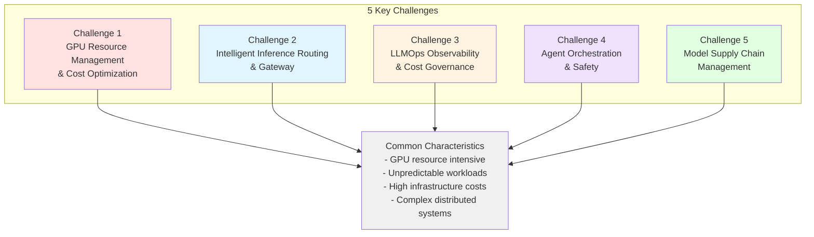
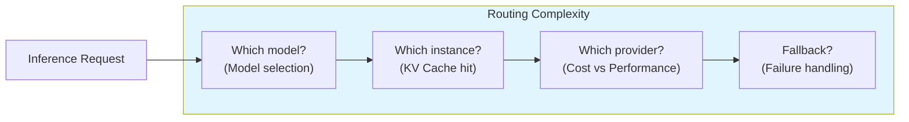
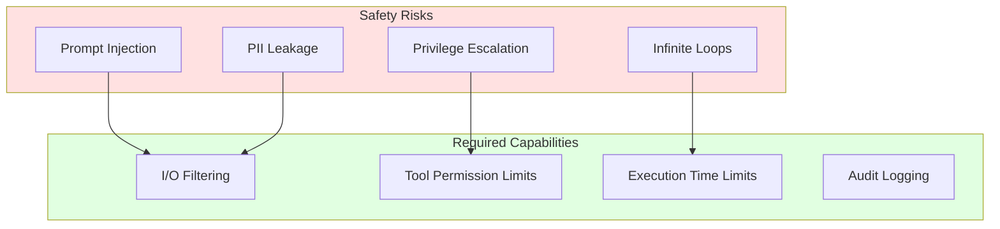
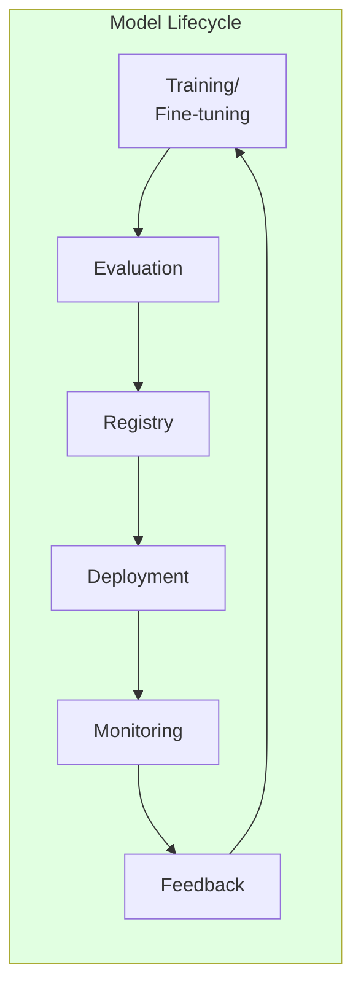

import { ChallengeSummary } from '@site/src/components/AgenticChallengesTables';

## Introduction

When building and operating an Agentic AI platform, platform engineers and architects face technical challenges that are fundamentally different from traditional web applications. This document analyzes the **5 key challenges**.

:::info Prerequisite
Before reading this document, review the overall structure of the Agentic AI Platform in [Platform Architecture](./agentic-platform-architecture.md).
:::

## Why a Single LLM Is Not Enough

In the Agentic AI era, the first question organizations face is *"Can't we just use one large, expensive LLM?"* In practice, relying entirely on a single massive LLM in enterprise environments leads to the following practical limitations.

### 4 Limitations of a Single LLM in Enterprise Practice

| Limitation Area | Problem Organizations Face | Platform Response |
|----------------|--------------------------|-------------------|
| **Cost** | Token pricing for 70B+ models can reach tens of millions of won per month at high traffic volumes, and the same cost applies to simple tasks like tool calls and formatting within agents. Research shows that **40-70% of agent LLM calls can be replaced by SLMs**. | **Bifrost 2-Tier routing** separates simple calls to self-hosted SLMs, routing only complex reasoning to LLMs |
| **Performance · Latency** | Large models have long response latency (TTFT), degrading user experience in real-time customer service (AICC) and conversational agents. Domain-specific SLMs can deliver **10x faster responses** for the same tasks. | **3-Tier Orchestration** — Tier 1 (SLM direct) is ~50ms, Tier 2 (LLM) is used only for complex reasoning |
| **Information Accuracy** | LLM hallucination is a structural characteristic, and it is critical in tasks requiring accuracy such as billing calculations and terms verification. Transformer architecture has inherent limitations in complex arithmetic and logical operations. | **Tool Delegation** — Arithmetic is delegated to rule engines, fact verification to Knowledge Graphs. LLMs focus only on natural language understanding |
| **Governance · Security** | Risks of sensitive data (PII/PHI) leaking to external LLM APIs, audit trails for autonomous agent actions, team-level access control and budget management are all required. | **NeMo Guardrails** (I/O filtering) + **LangGraph HITL** (human approval gates) + **Langfuse** (audit trails) |

### Infrastructure Optimization: Direction of Superintelligence Research Companies and K8s Ecosystem

To efficiently operate such a multi-model ecosystem, **infrastructure platformization** is essential. This is not merely a cost reduction issue — it is an area that leading AI companies universally invest in as a core priority.

**Meta** invests heavily in optimizing its own AI infrastructure alongside superintelligence (ASI) research. Grand Teton (GPU server architecture), MTIA (custom inference chip), and PyTorch ecosystem inference optimization (torch.compile, ExecuTorch) all stem from the recognition that **infrastructure efficiency is as important as model performance**.

The **CNCF Kubernetes** ecosystem is also rapidly expanding capabilities for AI workloads:

| K8s AI Feature | Version | Role | Significance for Multi-Model Ecosystem |
|---------------|---------|------|---------------------------------------|
| **DRA** (Dynamic Resource Allocation) | 1.31 Beta | Fine-grained GPU allocation at MIG level | SLMs on MIG partitions, LLMs on full GPUs — coexisting in a single cluster |
| **Gateway API + Inference Extension** | 2025 | Standardized routing for LLM inference requests | Intelligent routing based on KV Cache state, per-model traffic distribution |
| **Kueue** | GA | AI workload queuing and scheduling | Fair GPU resource distribution for training/inference, per-team quotas |
| **LeaderWorkerSet** | 1.31 | Distributed inference/training workload pattern | K8s-native management of Tensor Parallel distributed inference for 70B+ models |
| **KAI Scheduler** | 2025 | GPU-aware Pod scheduling | Optimal placement considering GPU topology (NVLink, NVSwitch) |

As such, Kubernetes is evolving beyond a simple container orchestrator to become **the foundational infrastructure for AI workloads**, and is the most mature platform for operating multi-model ecosystems.

### Conclusion: Multi-Model Ecosystem and Infrastructure Platformization

Organizations must move beyond single LLM dependency to build a **heterogeneous multi-model ecosystem**, supported by a robust **infrastructure platform**.

```
Strategic planning · Complex reasoning    Routine tasks · Domain-specific
┌──────────────────┐                     ┌──────────────────┐
│  LLM Orchestrator │        Task        │   SLM Expert Pool │
│  (Claude, GPT etc)│───Distribution────→│  (7B/14B + LoRA)  │
│  Tier 2 workflow  │                    │  Tier 1 direct    │
└──────────────────┘                     └──────────────────┘
         │                                        │
         └── External tool delegation ────────────┘
             (Arithmetic, search, knowledge graph)
                      │
         ┌────────────┴────────────┐
         │  Kubernetes Infra Platform│
         │  DRA · Gateway API · Kueue│
         │  Karpenter · vLLM · Bifrost│
         └─────────────────────────┘
```

Below, we analyze the 5 key challenges that the platform must address to **efficiently operate this ecosystem in a Kubernetes-native environment**.

---

## 5 Key Challenges of the Agentic AI Platform

Agentic AI systems leveraging Frontier Models (state-of-the-art large language models) have **fundamentally different infrastructure requirements** compared to traditional web applications.



### Challenge Summary

<ChallengeSummary />

:::warning Limitations of Traditional Infrastructure Approaches
Traditional VM-based infrastructure or manual management approaches cannot effectively handle the **dynamic and unpredictable workload patterns** of Agentic AI. The high cost of GPU resources and complex distributed system requirements make **automated infrastructure management** essential.
:::

---

## Challenge 1: GPU Resource Management and Cost Optimization

GPUs are the **most expensive resource** in the Agentic AI Platform. Appropriate GPU allocation strategies are needed based on model size and workload characteristics. This challenge is owned by **Layer 1: AI Infrastructure** of the platform architecture, which addresses it by integrating accelerated compute, orchestration, monitoring, and performance optimization into a single layer.

**Why it's difficult:**

- **High cost**: GPU instances are 10-100x more expensive than CPU (H100 x8: ~$98/hr)
- **Varied model sizes**: GPU memory requirements vary dramatically from 3B parameter models to 70B+
- **Dynamic workloads**: Inference traffic fluctuates by more than 10x depending on time of day
- **Idle waste**: Low utilization after GPU provisioning leads to massive cost waste
- **Multi-tenancy**: Multiple models and teams must share limited GPUs

| Model Size | GPU Requirements | Cost Pressure |
|-----------|-----------------|--------------|
| 70B+ parameters | Full GPU (H100/A100) x8 | $30-$98/hr |
| 7B-30B parameters | 1-2 GPUs or MIG partition | $1-$10/hr |
| Under 3B parameters | Time-Slicing or shared GPU | $0.5-$2/hr |

---

## Challenge 2: Intelligent Inference Routing and Gateway

Agentic AI workloads leverage **multiple models and providers** simultaneously. Intelligent routing that understands model characteristics is needed, beyond simple load balancing.

**Why it's difficult:**

- **Multi-model operations**: Running diverse models like Llama, Qwen, Claude, and GPT simultaneously on a single platform
- **KV Cache efficiency**: Routing that doesn't consider LLM KV Cache state significantly degrades performance
- **Cost-performance tradeoff**: Must dynamically choose between low-cost and high-performance models based on task complexity
- **Provider diversification**: Must integrate management of self-hosted models and external APIs (Bedrock, OpenAI)
- **Canary/A-B deployment**: Must safely transition traffic to new model versions



---

## Challenge 3: LLMOps Observability and Cost Governance

LLM-based systems have **fundamentally different observability requirements** compared to traditional applications. Traditional observability tells you **"what happened"** (status codes, latency, throughput), but an agent can **return `200 OK` while giving a wrong answer**. You must measure not "did it run" but **"did it do it correctly"** — which requires token-level cost tracking, multi-step Agent Trace, and output quality evaluation.

**Why it's difficult:**

- **Non-deterministic output**: Different outputs for the same input make traditional testing/monitoring insufficient, and changing a single word in a prompt can cause cascading failures
- **No visibility into "successful failures"**: Traditional o11y only tells you a request succeeded — not whether the response was correct, nor whether you are losing money per user
- **Token cost tracking**: Must dual-track infrastructure costs (GPU) and application costs (tokens), and cost attribution by model/feature/tool is hard
- **Multi-step debugging**: Identifying bottlenecks/failure points in complex chains where agents call multiple tools is challenging
- **Prompt quality drift**: Quality that was fine locally slowly degrades in production, and usually users notice first
- **Per-team budgets**: Need per-team cost allocation and limit management across shared AI infrastructure

### Token Economics — Cost Governance in the Token-Shortage Era

With GPU supply constraints and surging inference demand, **tokens are becoming an increasingly scarce and expensive resource**. Agents repeat LLM calls even for simple work (tool calls, formatting, retries), so putting them into real traffic without visibility causes **per-request cost to explode**. From a token-economics standpoint, observability is not mere monitoring but the **core control that turns cost into an asset**.

- **Per-request cost attribution**: Track per-call input/output tokens and model pricing to identify which prompts, tools, and user cohorts dominate cost
- **Model right-sizing**: Use trace data to judge "is an SLM sufficient for this task" — grounding a 2-tier routing decision (simple calls to self-hosted SLM, complex reasoning to LLM)
- **Quality-vs-cost optimization**: Verify with data whether a more expensive model or longer prompt actually produces better results (evaluation-based, not gut feel)
- **Budget guardrails**: Enforce per-model and per-team token budgets and limits at the gateway

> Observability **turns a black-box model into an auditable, optimizable asset**. Only when every prompt, response, cost, and latency is traceable can agents be run at a sustainable unit cost in the token-shortage era.

### The Observe → Evaluate → Improve Operating Loop

The key is not a dashboard but a **loop structure**. The deploy → observe → evaluate → improve cycle is applied to agent development.

- **Observe**: Complete per-call I/O and lineage, per-step latency and token cost, user/session-level journey tracking
- **Evaluate**: Build datasets from production traces and score them with LLM-as-judge and human annotation. Combine **offline evaluation** (regression prevention) and **online evaluation** (drift/quality-decay detection)
- **Improve**: Prompt version management and A/B experiments, with the eval harness wired into CI/CD to **block regression deployments**

This loop becomes progressively automated — online evaluation scores and flags traces and forms a failure queue, while humans define the rules/guardrails and intervene **only at publish time** with approve/reject.

| Observability Area | Traditional Applications | LLM Applications |
|-------------------|------------------------|-----------------|
| What is measured | "Did it run" (status, latency) | "Did it do it correctly" (output accuracy) |
| Cost tracking | Infrastructure costs only | Dual tracking: infra + token, attribution by tool/model |
| Debugging | Request-response logs | Multi-step Agent Trace + lineage |
| Quality monitoring | Error rate, latency | Faithfulness, Relevance, Hallucination, drift |
| Budget management | Resource-based | Per-model/per-team token budgets |
| Improvement method | Manual hotfix | Observe→Evaluate→Improve loop (evaluation-based) |

**Tool ecosystem**: LLM-specific observability tools that meet these requirements include **Langfuse** (OSS, OpenTelemetry-based, with built-in LLM-as-judge, prompt management, and dataset evaluation), **LangSmith**, and **Helicone**. Traditional APMs (e.g. Datadog) are weak on token/quality evaluation and costly per LLM call. For a detailed tool comparison and hybrid architecture, see [LLMOps Observability Tool Comparison](../../operations-mlops/observability/llmops-observability.md).

---

## Challenge 4: Agent Orchestration and Safety

In Agentic AI systems, agents **autonomously invoke tools and interact with external systems**. This autonomy creates new challenges in terms of safety and controllability.

**Why it's difficult:**

- **Autonomous actions**: Agents make their own decisions to call tools, enabling unexpected behavior
- **Prompt injection**: Risk of malicious inputs causing agents to perform unintended actions
- **Tool integration standardization**: Need standards for safely connecting diverse external systems (DBs, APIs, files) to agents
- **Multi-agent communication**: Safe and efficient communication protocols needed when multiple agents collaborate
- **State management**: State persistence, recovery, and checkpointing needed for long-running agents
- **Scaling**: Agent workloads are CPU-based but have irregular traffic patterns, making efficient scaling difficult



---

## Challenge 5: Model Supply Chain Management

Beyond simply deploying models, the **entire model lifecycle** (training → evaluation → registry → deployment → feedback) must be systematically managed.

**Why it's difficult:**

- **Model version management**: Managing diverse artifacts including foundation models, fine-tuned models, and adapters (LoRA)
- **Distributed training infrastructure**: Large-scale model fine-tuning requires multi-node GPU clusters and high-speed networking (EFA)
- **Evaluation pipelines**: Must automatically evaluate model quality and set deployment gates
- **Safe deployment**: Minimize service impact during model updates with Canary/Blue-Green deployment
- **Hybrid environments**: Model transfer and synchronization between on-premises and cloud GPUs
- **RAG data pipelines**: Continuous update pipelines for document processing, embedding generation, and vector storage
- **Feedback loops**: Continuous improvement systems that incorporate production tracing data into retraining



---

## Next Steps: Approaches to Solving the Challenges

We present two approaches to solving these 5 challenges:

1. **[AWS Native Platform](../platform-selection/aws-native-agentic-platform.md)**: An approach that minimizes infrastructure operational burden using AWS managed services (Bedrock, AgentCore) to focus on agent development
2. **[EKS-Based Open Architecture](../platform-selection/agentic-ai-solutions-eks.md)**: An approach that achieves fine-grained control and cost optimization using Amazon EKS and the open-source ecosystem

These two approaches are **complementary** and can be combined based on workload characteristics.

| Criteria | AWS Native | EKS-Based Open Architecture |
|----------|-----------|---------------------------|
| GPU management | Not required (serverless) | Karpenter auto-provisioning |
| Model selection | Bedrock-supported models | All open weight models |
| Operational burden | Minimal | Medium (reduced with Auto Mode) |
| Cost optimization | Usage-based pricing | Fine-grained control: Spot, Consolidation |
| Customization | Limited | Full flexibility |

:::tip Which approach to choose?
- **Quick start, focus on agent logic**: AWS Native Platform
- **Open weight models + hybrid + cost optimization**: EKS-based open architecture
- **Realistic optimum**: Combine both approaches (start with AWS Native, expand to EKS as needed)
:::

---

## References

### Official Documentation

- [Kubernetes Gateway API](https://gateway-api.sigs.k8s.io/) — K8s official gateway API specification
- [CNCF AI/ML Landscape](https://landscape.cncf.io/) — Cloud Native AI/ML ecosystem overview
- [NVIDIA GPU Operator Documentation](https://docs.nvidia.com/datacenter/cloud-native/gpu-operator/) — GPU Operator official guide
- [AWS EKS Best Practices for AI/ML](https://aws.github.io/aws-eks-best-practices/) — EKS AI/ML workload optimization

### Papers / Technical Blogs

- [vLLM: Easy, Fast, and Cheap LLM Serving](https://blog.vllm.ai/2023/06/20/vllm.html) — PagedAttention mechanism explanation
- [Efficient Memory Management for LLM Serving (OSDI 2023)](https://arxiv.org/abs/2309.06180) — KV Cache optimization research
- [Cost-Effective LLM Inference at Scale](https://aws.amazon.com/blogs/machine-learning/) — Production cost optimization cases
- [NVIDIA Blog: Optimizing AI Workloads](https://developer.nvidia.com/blog/) — GPU optimization technology blog

### Related Documents (Internal)

- [Platform Architecture](./agentic-platform-architecture.md) — Overall system design blueprint
- [AWS Native Platform](../platform-selection/aws-native-agentic-platform.md) — Managed service approach
- [EKS-Based Open Architecture](../platform-selection/agentic-ai-solutions-eks.md) — Self-hosting approach
- [GPU Resource Management](../../model-serving/gpu-infrastructure/gpu-resource-management.md) — GPU cost optimization details
