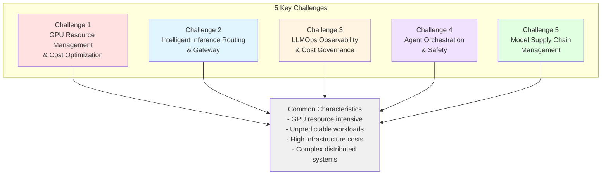
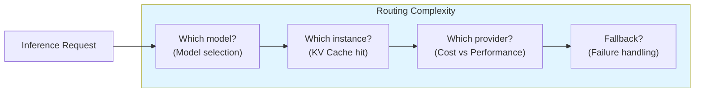
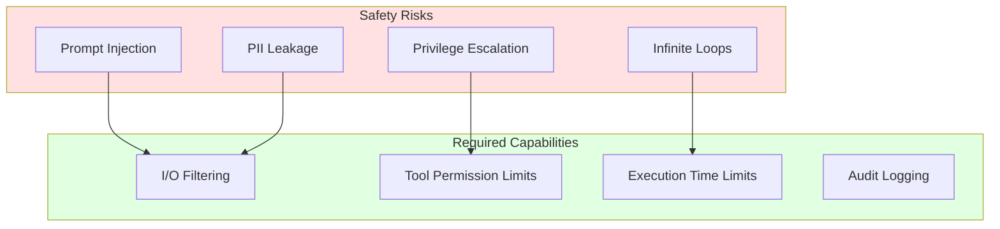
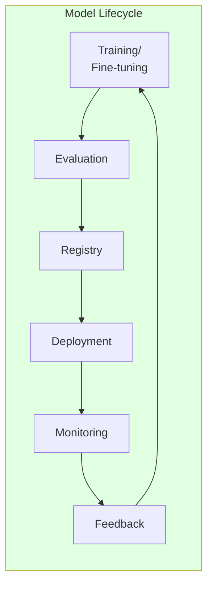

import { ChallengeSummary } from '@site/src/components/AgenticChallengesTables';

## Introduction

An agent may call a model several times and use search or external APIs while handling one user request. Understanding its latency and cost therefore requires following the whole request, as well as each individual call. This guide covers model compute resources, request routing, observability and cost, safe tool execution, and model updates.

:::info Prerequisite
Before reading this document, review the overall structure of the Agentic AI Platform in [Platform Architecture](./agentic-platform-architecture.md).
:::

## Choosing a Model for the Task {#why-a-single-llm-is-not-enough}

Using one model for every request keeps deployment and operations simpler. First measure whether that model meets your quality, latency, and cost targets. If short classification tasks and complex reasoning tasks have different requirements, compare assigning them to different models. The following criteria help make that decision.

### 4 Limitations of a Single LLM in Enterprise Practice

| Limitation Area | Problem Organizations Face | Platform Response |
|----------------|--------------------------|-------------------|
| **Cost** | Token pricing for 70B+ models can reach tens of millions of won per month at high traffic volumes, and the same cost applies to simple tasks like tool calls and formatting within agents. Research shows that **40-70% of agent LLM calls can be replaced by SLMs**. | **Bifrost 2-Tier routing** separates simple calls to self-hosted SLMs, routing only complex reasoning to LLMs |
| **Performance · Latency** | Large models have long response latency (TTFT), degrading user experience in real-time customer service (AICC) and conversational agents. Domain-specific SLMs can deliver **10x faster responses** for the same tasks. | **3-Tier Orchestration** — Tier 1 (SLM direct) is ~50ms, Tier 2 (LLM) is used only for complex reasoning |
| **Information Accuracy** | LLM hallucination is a structural characteristic, and it is critical in tasks requiring accuracy such as billing calculations and terms verification. Transformer architecture has inherent limitations in complex arithmetic and logical operations. | **Tool Delegation** — Arithmetic is delegated to rule engines, fact verification to Knowledge Graphs. LLMs focus only on natural language understanding |
| **Governance · Security** | Risks of sensitive data (PII/PHI) leaking to external LLM APIs, audit trails for autonomous agent actions, team-level access control and budget management are all required. | **NeMo Guardrails** (I/O filtering) + **LangGraph HITL** (human approval gates) + **Langfuse** (audit trails) |

### Operating Functions That Models Can Share {#infrastructure-optimization-direction-of-superintelligence-research-companies-and-k8s-ecosystem}

Operating several models requires allocating resources, choosing a destination for each request, and tracking usage by team. Implementing those functions separately for every model repeats the same operating work. A shared platform provides resource allocation, routing, and observability that multiple models can use.

For example, a cluster running both a model with large GPU memory requirements and a smaller model must allocate resources according to their memory and placement needs. Choosing a server with spare request capacity is also a different decision from choosing the node on which to place a model.

The following Kubernetes features and projects address these operating responsibilities.

| K8s AI Feature | Version | Role | Significance for Multi-Model Ecosystem |
|---------------|---------|------|---------------------------------------|
| **DRA** (Dynamic Resource Allocation) | 1.31 Beta | Fine-grained GPU allocation at MIG level | SLMs on MIG partitions, LLMs on full GPUs — coexisting in a single cluster |
| **Gateway API + Inference Extension** | 2025 | Standardized routing for LLM inference requests | Intelligent routing based on KV Cache state, per-model traffic distribution |
| **Kueue** | GA | AI workload queuing and scheduling | Fair GPU resource distribution for training/inference, per-team quotas |
| **LeaderWorkerSet** | 1.31 | Distributed inference/training workload pattern | K8s-native management of Tensor Parallel distributed inference for 70B+ models |
| **KAI Scheduler** | 2025 | GPU-aware Pod scheduling | Optimal placement considering GPU topology (NVLink, NVSwitch) |

These features solve different problems. Identify whether you need resource allocation, workload queueing, or inference request routing, then check that the cluster and serving engine support the chosen configuration.

### An Example of Dividing Work Between Models {#conclusion-multi-model-ecosystem-and-infrastructure-platformization}

The following example combines a model for complex reasoning with smaller models for repetitive tasks. Arithmetic and search can be delegated to external tools. Decide whether to use this arrangement by comparing response quality, end-to-end latency, and cost on the same request set.

```
Strategic planning · Complex reasoning    Routine tasks · Domain-specific
┌──────────────────┐                     ┌──────────────────┐
│  LLM Orchestrator │        Task        │   SLM Expert Pool │
│  (Claude, GPT etc)│───Distribution────→│  (7B/14B + LoRA)  │
│  Tier 2 workflow  │                    │  Tier 1 direct    │
└──────────────────┘                     └──────────────────┘
         │                                        │
         └── External tool delegation ────────────┘
             (Arithmetic, search, knowledge graph)
                      │
         ┌────────────┴────────────┐
         │  Kubernetes Infra Platform│
         │  DRA · Gateway API · Kueue│
         │  Karpenter · vLLM · Bifrost│
         └─────────────────────────┘
```

Once the roles of models and tools are defined, review the five areas needed to run and operate them.

---

## 5 Key Challenges of the Agentic AI Platform

The diagram connects the five areas. Consider how a choice in one area affects the others: changing a model can change GPU memory requirements, latency, call cost, and evaluation criteria.


```mermaid
flowchart TD
    subgraph Challenges["5 Key Challenges"]
        C1["Challenge 1<br/>GPU Resource Management<br/>& Cost Optimization"]
        C2["Challenge 2<br/>Intelligent Inference Routing<br/>& Gateway"]
        C3["Challenge 3<br/>LLMOps Observability<br/>& Cost Governance"]
        C4["Challenge 4<br/>Agent Orchestration<br/>& Safety"]
        C5["Challenge 5<br/>Model Supply Chain<br/>Management"]
    end

    COMMON["Common Characteristics<br/>- GPU resource intensive<br/>- Unpredictable workloads<br/>- High infrastructure costs<br/>- Complex distributed systems"]

    C1 --> COMMON
    C2 --> COMMON
    C3 --> COMMON
    C4 --> COMMON
    C5 --> COMMON

    style C1 fill:#ffe1e1
    style C2 fill:#e1f5ff
    style C3 fill:#fff4e1
    style C4 fill:#f0e1ff
    style C5 fill:#e1ffe1
    style COMMON fill:#f0f0f0
```

### Challenge Summary

<ChallengeSummary />

:::warning Define the conditions and limits for automation
Frequent changes in traffic or model configuration make manual resource adjustments harder. When introducing automatic scaling, define resource requests, capacity limits, budgets, and failure handling together. Automation alone does not determine operating cost or reliability.
:::

---

## Challenge 1: GPU Resource Management and Cost Optimization

GPUs are the **most expensive resource** in the Agentic AI Platform. Appropriate GPU allocation strategies are needed based on model size and workload characteristics. This challenge is owned by **Layer 1: AI Infrastructure** of the platform architecture, which addresses it by integrating accelerated compute, orchestration, monitoring, and performance optimization into a single layer.

**Why it's difficult:**

- **High cost**: GPU instances are 10-100x more expensive than CPU (~$55/hr for p5.48xlarge H100 x8 in us-east-1; $55-$92/hr by region)
- **Varied model sizes**: GPU memory requirements vary dramatically from 3B parameter models to 70B+
- **Dynamic workloads**: Inference traffic fluctuates by more than 10x depending on time of day
- **Idle waste**: Low utilization after GPU provisioning leads to massive cost waste
- **Multi-tenancy**: Multiple models and teams must share limited GPUs

| Model Size | GPU Requirements | Cost Pressure |
|-----------|-----------------|--------------|
| 70B+ parameters | Full GPU (H100/A100) x8 | $30-$92/hr |
| 7B-30B parameters | 1-2 GPUs or MIG partition | $1-$10/hr |
| Under 3B parameters | Time-Slicing or shared GPU | $0.5-$2/hr |

---

## Challenge 2: Intelligent Inference Routing and Gateway

Agentic AI workloads leverage **multiple models and providers** simultaneously. Intelligent routing that understands model characteristics is needed, beyond simple load balancing.

**Why it's difficult:**

- **Multi-model operations**: Running diverse models like Llama, Qwen, Claude, and GPT simultaneously on a single platform
- **KV Cache efficiency**: Routing that doesn't consider LLM KV Cache state significantly degrades performance
- **Cost-performance tradeoff**: Must dynamically choose between low-cost and high-performance models based on task complexity
- **Provider diversification**: Must integrate management of self-hosted models and external APIs (Bedrock, OpenAI)
- **Canary/A-B deployment**: Must safely transition traffic to new model versions


```mermaid
flowchart LR
    REQ["Inference Request"]

    subgraph Challenge["Routing Complexity"]
        Q1["Which model?<br/>(Model selection)"]
        Q2["Which instance?<br/>(KV Cache hit)"]
        Q3["Which provider?<br/>(Cost vs Performance)"]
        Q4["Fallback?<br/>(Failure handling)"]
    end

    REQ --> Q1 --> Q2 --> Q3 --> Q4

    style Challenge fill:#e1f5ff
```

---

## Challenge 3: LLMOps Observability and Cost Governance

An agent can return `200 OK` with an incorrect answer. In addition to status codes, latency, and throughput, evaluate the answer and trace the model and tool calls that produced it. Recording token usage for each call helps locate the steps responsible for higher latency or cost.

**Why it's difficult:**

- **Non-deterministic output**: Different outputs for the same input make traditional testing/monitoring insufficient, and changing a single word in a prompt can cause cascading failures
- **No visibility into "successful failures"**: Traditional o11y only tells you a request succeeded — not whether the response was correct, nor whether you are losing money per user
- **Token cost tracking**: Must dual-track infrastructure costs (GPU) and application costs (tokens), and cost attribution by model/feature/tool is hard
- **Multi-step debugging**: Identifying bottlenecks/failure points in complex chains where agents call multiple tools is challenging
- **Prompt quality drift**: Quality that was fine locally slowly degrades in production, and usually users notice first
- **Per-team budgets**: Need per-team cost allocation and limit management across shared AI infrastructure

### Calculating Token Cost per Request {#token-economics--cost-governance-in-the-token-shortage-era}

When one user request leads to several model calls, add up the cost of those calls. Retries and resending conversation history can also increase input tokens. Connect call records with a request ID and record input/output tokens, model pricing, and cache usage. For self-hosted models, measure GPU usage time and throughput alongside token counts to calculate cost.

- **Per-request cost attribution**: Track per-call input/output tokens and model pricing to identify which prompts, tools, and user cohorts dominate cost
- **Model right-sizing**: Use trace data to judge "is an SLM sufficient for this task" — grounding a 2-tier routing decision (simple calls to self-hosted SLM, complex reasoning to LLM)
- **Quality-vs-cost optimization**: Verify with data whether a more expensive model or longer prompt actually produces better results (evaluation-based, not gut feel)
- **Budget guardrails**: Enforce per-model and per-team token budgets and limits at the gateway

> Compare the total cost of completing one user request at the required quality. When collecting call records, also define which sensitive inputs and outputs may be stored and how long to retain them.

### The Observe → Evaluate → Improve Operating Loop

Use observed results to guide the next change. Turn failed executions into evaluation cases, then run the same cases after changing a prompt or model to check whether the result improved.

- **Observe**: Complete per-call I/O and lineage, per-step latency and token cost, user/session-level journey tracking
- **Evaluate**: Build datasets from production traces and score them with LLM-as-judge and human annotation. Combine **offline evaluation** (regression prevention) and **online evaluation** (drift/quality-decay detection)
- **Improve**: Prompt version management and A/B experiments, with the eval harness wired into CI/CD to **block regression deployments**

Evaluation runs and failure collection can be automated. The responsible team defines the criteria, interprets results, and specifies where training, deployment, or exceptions require approval. An improved score alone should not trigger an automatic production deployment.

| Observability Area | Traditional Applications | LLM Applications |
|-------------------|------------------------|-----------------|
| What is measured | "Did it run" (status, latency) | "Did it do it correctly" (output accuracy) |
| Cost tracking | Infrastructure costs only | Dual tracking: infra + token, attribution by tool/model |
| Debugging | Request-response logs | Multi-step Agent Trace + lineage |
| Quality monitoring | Error rate, latency | Faithfulness, Relevance, Hallucination, drift |
| Budget management | Resource-based | Per-model/per-team token budgets |
| Improvement method | Manual hotfix | Observe→Evaluate→Improve loop (evaluation-based) |

**Tool selection**: Before comparing Langfuse, LangSmith, Helicone, and integration with an existing APM, identify the call records, prompt management, and evaluation features you need. Compare supported features and collection costs for the intended configuration. See [LLMOps Observability Tool Comparison](../../operations-mlops/observability/llmops-observability.md) for the detailed comparison and integration options.

---

## Challenge 4: Agent Orchestration and Safety

In Agentic AI systems, agents **autonomously invoke tools and interact with external systems**. This autonomy creates new challenges in terms of safety and controllability.

**Why it's difficult:**

- **Autonomous actions**: Agents make their own decisions to call tools, enabling unexpected behavior
- **Prompt injection**: Risk of malicious inputs causing agents to perform unintended actions
- **Tool integration standardization**: Need standards for safely connecting diverse external systems (DBs, APIs, files) to agents
- **Multi-agent communication**: Safe and efficient communication protocols needed when multiple agents collaborate
- **State management**: State persistence, recovery, and checkpointing needed for long-running agents
- **Scaling**: Agent workloads are CPU-based but have irregular traffic patterns, making efficient scaling difficult


```mermaid
flowchart TD
    subgraph Risks["Safety Risks"]
        R1["Prompt Injection"]
        R2["PII Leakage"]
        R3["Infinite Loops"]
        R4["Privilege Escalation"]
    end

    subgraph Needs["Required Capabilities"]
        N1["I/O Filtering"]
        N2["Tool Permission Limits"]
        N3["Execution Time Limits"]
        N4["Audit Logging"]
    end

    R1 --> N1
    R2 --> N1
    R3 --> N3
    R4 --> N2

    style Risks fill:#ffe1e1
    style Needs fill:#e1ffe1
```

---

## Challenge 5: Model Supply Chain Management

Beyond simply deploying models, the **entire model lifecycle** (training → evaluation → registry → deployment → feedback) must be systematically managed.

**Why it's difficult:**

- **Model version management**: Managing diverse artifacts including foundation models, fine-tuned models, and adapters (LoRA)
- **Distributed training infrastructure**: Large-scale model fine-tuning requires multi-node GPU clusters and high-speed networking (EFA)
- **Evaluation pipelines**: Must automatically evaluate model quality and set deployment gates
- **Safe deployment**: Minimize service impact during model updates with Canary/Blue-Green deployment
- **Hybrid environments**: Model transfer and synchronization between on-premises and cloud GPUs
- **RAG data pipelines**: Continuous update pipelines for document processing, embedding generation, and vector storage
- **Feedback loops**: Continuous improvement systems that incorporate production tracing data into retraining


```mermaid
flowchart LR
    subgraph Lifecycle["Model Lifecycle"]
        TRAIN["Training/<br/>Fine-tuning"]
        EVAL["Evaluation"]
        REG["Registry"]
        DEPLOY["Deployment"]
        MONITOR["Monitoring"]
        FEEDBACK["Feedback"]
    end

    TRAIN --> EVAL --> REG --> DEPLOY --> MONITOR --> FEEDBACK
    FEEDBACK --> TRAIN

    style Lifecycle fill:#e1ffe1
```

---

## Next Steps: Approaches to Solving the Challenges

We present two approaches to solving these 5 challenges:

1. **[AWS Native Platform](../platform-selection/aws-native-agentic-platform.md)**: An approach that minimizes infrastructure operational burden using AWS managed services (Bedrock, AgentCore) to focus on agent development
2. **[EKS-Based Open Architecture](../platform-selection/agentic-ai-solutions-eks.md)**: An approach that achieves fine-grained control and cost optimization using Amazon EKS and the open-source ecosystem

These two approaches are **complementary** and can be combined based on workload characteristics.

| Criteria | AWS Native | EKS-Based Open Architecture |
|----------|-----------|---------------------------|
| GPU management | Not required (serverless) | Karpenter auto-provisioning |
| Model selection | Bedrock-supported models | All open weight models |
| Operational burden | Minimal | Medium (reduced with Auto Mode) |
| Cost optimization | Usage-based pricing | Fine-grained control: Spot, Consolidation |
| Customization | Limited | Full flexibility |

:::tip Which approach to choose?
- **Quick start, focus on agent logic**: AWS Native Platform
- **Open weight models + hybrid + cost optimization**: EKS-based open architecture
- **Evaluate a mixed deployment**: When combining managed services and EKS, also compare authentication, data transfer, and failure-handling responsibilities between the environments
:::

---

## References

### Official Documentation

- [Kubernetes Gateway API](https://gateway-api.sigs.k8s.io/) — K8s official gateway API specification
- [CNCF AI/ML Landscape](https://landscape.cncf.io/) — Cloud Native AI/ML ecosystem overview
- [NVIDIA GPU Operator Documentation](https://docs.nvidia.com/datacenter/cloud-native/gpu-operator/) — GPU Operator official guide
- [AWS EKS Best Practices for AI/ML](https://aws.github.io/aws-eks-best-practices/) — EKS AI/ML workload optimization

### Papers / Technical Blogs

- [vLLM: Easy, Fast, and Cheap LLM Serving](https://blog.vllm.ai/2023/06/20/vllm.html) — PagedAttention mechanism explanation
- [Efficient Memory Management for LLM Serving (OSDI 2023)](https://arxiv.org/abs/2309.06180) — KV Cache optimization research
- [Cost-Effective LLM Inference at Scale](https://aws.amazon.com/blogs/machine-learning/) — Production cost optimization cases
- [NVIDIA Blog: Optimizing AI Workloads](https://developer.nvidia.com/blog/) — GPU optimization technology blog

### Related Documents (Internal)

- [Platform Architecture](./agentic-platform-architecture.md) — Overall system design blueprint
- [AWS Native Platform](../platform-selection/aws-native-agentic-platform.md) — Managed service approach
- [EKS-Based Open Architecture](../platform-selection/agentic-ai-solutions-eks.md) — Self-hosting approach
- [GPU Resource Management](../../model-serving/gpu-infrastructure/gpu-resource-management.md) — GPU cost optimization details
