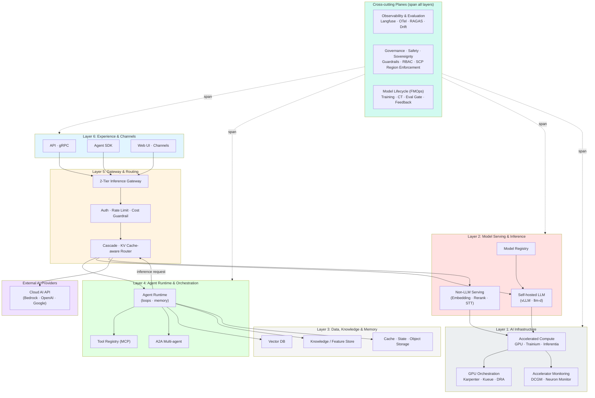
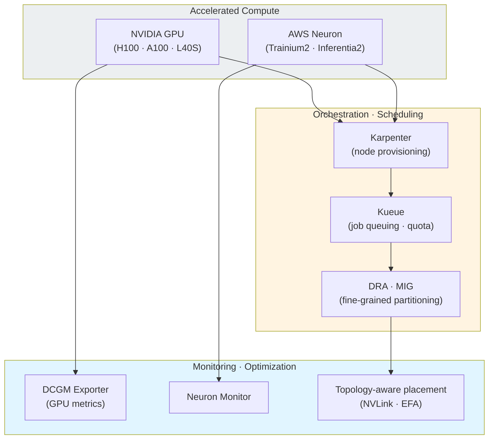
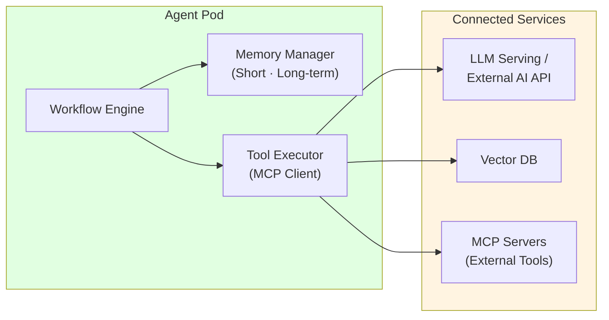
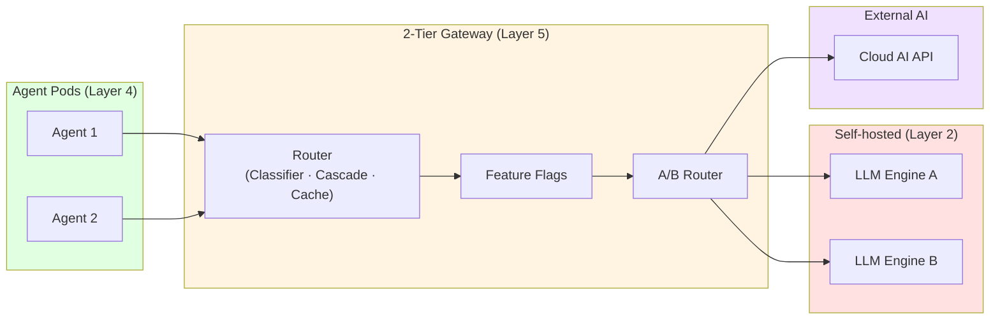
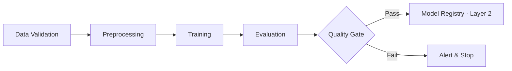
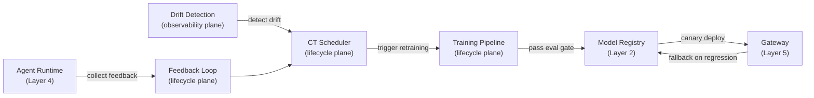
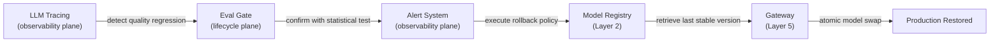
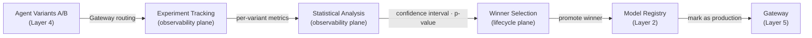
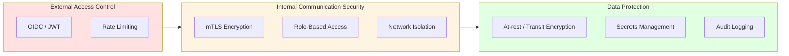
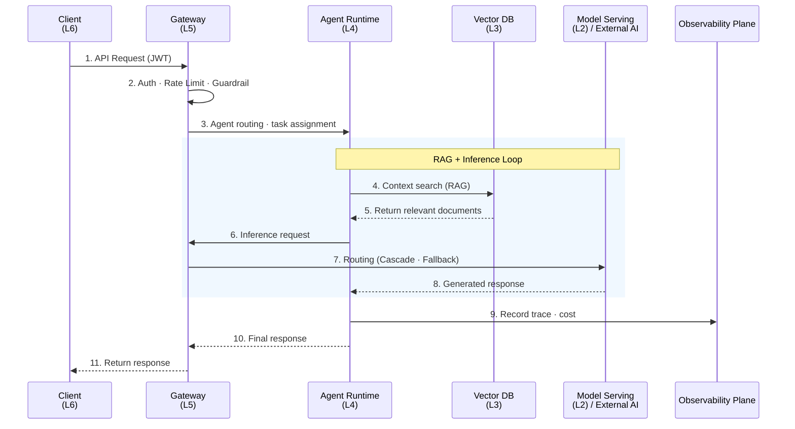

import { LayerRoles, TenantIsolation, RequestProcessing } from '@site/src/components/ArchitectureTables';

## Overview

The Agentic AI Platform is a unified platform that enables autonomous AI agents to perform complex tasks. It is designed to address challenges encountered when building GenAI services: accelerated compute operations, model serving complexity, lack of framework integration, autoscaling difficulties, absence of MLOps automation, and cost optimization. The platform organizes **accelerated compute infrastructure**, **model serving**, **data/knowledge/memory**, **agent orchestration**, **intelligent inference routing**, and **multi-channel exposure** into **6 runtime layers** stacked along the request path, and separates **observability & evaluation**, **governance/safety/sovereignty**, and **model lifecycle (FMOps)** into **3 cross-cutting planes** that span all layers. For detailed analysis of each challenge, see the [Technical Challenges](./agentic-ai-challenges.md) document.

:::info Target Audience
This document is intended for solution architects, platform engineers, and DevOps engineers. A basic understanding of Kubernetes and AI/ML workloads is required.
:::

---

## Separating Layers from Planes

Earlier layer models placed concerns such as evaluation, drift detection, and feedback across multiple layers, blurring responsibility boundaries. This architecture clearly distinguishes two kinds of building blocks.

- **Runtime Layer**: Six layers stacked bottom-up along the path a user request travels. Requests flow top-down (Layer 6 → Layer 1), and the platform is built bottom-up (Layer 1 → Layer 6).
- **Cross-cutting Plane**: Three concerns that do not belong to any single layer but **span all layers vertically**. Observability & evaluation, governance/safety/sovereignty, and model lifecycle fall into this category.

:::tip Why separate into planes
Quality evaluation (RAGAS), drift detection, feedback collection, and Guardrails are not functions of a single layer but **concerns that operate across all layers**. Placing them as separate layers causes the same function to be described redundantly in multiple layers, dispersing responsibility. Separating them into planes makes "where inference happens (layer)" and "how it is observed, controlled, and improved (plane)" orthogonal. This distinction takes the same approach as Chip Huyen's *AI Engineering* (2025) 3-tier (Infrastructure / Model / Application) model, the FTI (Feature–Training–Inference) pipeline pattern, and the cross-cutting operational perspective of the AWS Well-Architected Generative AI Lens.
:::

---

## Overall System Architecture

The Agentic AI Platform consists of **6 runtime layers** and **3 cross-cutting planes** that span them. Each layer has clear responsibilities and enables independent scaling and operation through loose coupling.



**Core Design Principles:**

- **Orthogonal separation of layers and planes**: Separate "where inference happens (6 layers)" from "how it is observed, controlled, and improved (3 planes)" to eliminate concern duplication
- **AI Infrastructure as a first-class layer**: Make accelerated compute (GPU·Trainium·Inferentia) and its orchestration, monitoring, and performance optimization an explicit bottom-most layer (Layer 1)
- **Self-hosted + External AI Hybrid**: Unified management of self-hosted models and external AI Provider APIs through the same gateway (Layer 5)
- **2-Tier Cost Tracking**: Dual tracking at infrastructure level (accelerator hours · model unit price × tokens) and application level (per-agent-step costs)
- **MCP/A2A Standard Protocols**: Standardized communication between agents and tools (MCP) and between agents (A2A) for interoperability
- **Closed-loop FMOps**: A closed loop where production feedback triggers retraining and new models must pass an evaluation gate before deployment (model lifecycle plane)
- **Sovereignty-aware**: Meet data sovereignty requirements through SCP region enforcement, in-country regions, and hybrid/on-premises self-hosting (governance plane)

### Layer & Plane Roles

<LayerRoles />

### Mapping from the Former 8-Layer Model

The previous version used 8 layers, but evaluation, drift, feedback, and Guardrails were duplicated across multiple layers. The model has been reorganized into 6 layers + 3 planes as follows.

| Former (8-layer) | Current (6 layers + 3 planes) |
|------------------|-------------------------------|
| Layer 1: Client & Feedback | Layer 6: Experience & Channels (Feedback → lifecycle plane) |
| Layer 2: Gateway & Governance | Layer 5: Gateway & Routing (Governance → governance plane) |
| Layer 3: Agent & Orchestration | Layer 4: Agent Runtime & Orchestration |
| Layer 4: Model Serving & Lifecycle | Layer 2: Model Serving (Lifecycle → lifecycle plane) |
| Layer 5: Data & Feature | Layer 3: Data, Knowledge & Memory |
| Layer 6: Observability & Insights | Observability & Evaluation plane |
| Layer 7: Training & Feedback | Model Lifecycle plane |
| Layer 8: Evaluation & Quality | Observability & Evaluation plane + Governance plane (Guardrails) |
| *(none)* | **Layer 1: AI Infrastructure (new)** |

---

## Core Components: Runtime Layers

The six layers are described in reverse request order (bottom-most infrastructure → top-most experience). The platform is built up from Layer 1. The request flow descends Layer 6 (entry) → Layer 5 (gateway) → Layer 4 (Agent); when the Agent needs inference, it goes back through the Layer 5 gateway to call Layer 2 (model serving), which runs on the Layer 1 accelerated compute.

### Layer 1: AI Infrastructure

The bottom-most layer responsible for **accelerated compute resources and their operation**. Accelerators such as GPU·Trainium·Inferentia are the most expensive resources in Agentic AI, so beyond simple provisioning, orchestration, monitoring, and performance optimization must be integrated into a single layer. This layer operates as a combination of many components and provides a stable accelerated-compute abstraction to the layer above (Layer 2, model serving).



| Functional Area | Responsibility | Key Components |
|-----------------|----------------|----------------|
| **Accelerated Compute** | Provide accelerators for LLM/non-LLM inference and training | NVIDIA GPU, AWS Trainium2/Inferentia2 |
| **Node Orchestration** | Workload-driven dynamic node provisioning, Spot usage | Karpenter, Cluster Autoscaler |
| **Job Scheduling** | GPU job queuing, per-team quota, fair sharing | Kueue, KAI Scheduler |
| **GPU Partitioning** | Fine-grained partitioning of a single GPU across workloads | DRA, MIG, Time-Slicing |
| **Accelerator Monitoring** | Real-time tracking of utilization, temperature, memory, power | DCGM Exporter, Neuron Monitor |
| **Performance Optimization** | Topology-aware placement, high-speed networking | NVLink/NVSwitch-aware scheduling, EFA |

**Why a separate layer:**

The operation of accelerated compute is separated in responsibility from model serving (Layer 2). Model serving owns "which model is served and how"; AI Infrastructure owns "on which accelerator that inference runs and how efficiently." GPU monitoring, scheduling, and partitioning evolve independently of serving engines such as vLLM and llm-d, and training workloads (lifecycle plane) share the same infrastructure layer.

:::info Detailed Guides
For GPU node strategy, Karpenter·KEDA·DRA resource management, the NVIDIA GPU stack (GPU Operator·DCGM·MIG), and the AWS Neuron stack, see the Accelerated Computing Infrastructure section of [Model Serving & Inference Infrastructure](../../model-serving/index.md).
:::

---

### Layer 2: Model Serving & Inference

The layer responsible for inference of self-hosted models and non-LLM models. It runs on the accelerated compute provided by Layer 1 and processes inference requests routed from the Layer 5 gateway.

#### Self-hosted LLM Serving

Operates high-performance LLM serving engines supporting PagedAttention, KV Cache optimization, and distributed inference. Open-source inference engines such as vLLM and llm-d are autoscaled on Kubernetes.

#### Non-LLM Serving

Non-LLM models such as embedding, reranking, and STT (Whisper) are served separately via Triton Inference Server and similar. The RAG pipeline (Layer 3) and agents (Layer 4) call these.

#### Model Registry

Centrally manages versions, metadata, and performance metrics of all deployed models. The training pipeline in the model lifecycle plane registers new models, and only models that pass the evaluation gate are served through this registry.

```
s3://model-registry/
├── llama-3-70b/
│   ├── v1.0.0/
│   │   ├── model.safetensors
│   │   ├── metadata.json
│   │   └── evaluation_metrics.json
│   ├── v1.1.0/
│   └── v1.2.0/ (current production)
└── mistral-7b/
```

:::info Detailed Guides
For vLLM model serving, llm-d distributed inference (KV Cache-aware routing), MoE serving, and the NeMo training framework, see [Model Serving & Inference Infrastructure](../../model-serving/index.md). Model transformations such as fine-tuning and distillation are covered in [Model Lifecycle](../../reference-architecture/model-lifecycle/index.md).
:::

---

### Layer 3: Data, Knowledge & Memory

The layer that provides the data, knowledge, and memory used by agents and the RAG pipeline.

#### Vector DB (RAG Store)

Converts documents into embedding vectors for storage and provides relevant context via similarity search upon agent requests.

**Design Considerations:**
- **Multi-tenant isolation**: Data separation per tenant using Partition Keys
- **Index strategy**: High-performance Approximate Nearest Neighbor search with HNSW index
- **Hybrid search**: Improved search quality by combining Dense Vector + Sparse Vector (BM25)

#### Knowledge / Feature Store

Manages input features and domain knowledge used for ML model training and inference. It guarantees identical feature definitions at training and inference time to prevent training-serving skew; combining ontology and knowledge graphs reduces RAG hallucination and enables provenance tracking.

```
Online Store (Redis/DynamoDB)
  └─ Low-latency feature lookup (< 10ms) · for real-time inference

Offline Store (S3 Parquet)
  └─ Large-scale feature storage · for batch training
```

#### Cache · State · Object Storage

Stores session state, short-term memory, and LangGraph checkpointer state. Supports checkpointing and recovery for long-running agent tasks.

:::info Detailed Guides
For the 3-plane design of the ontology-based Knowledge Feature Store, see [Knowledge Feature Store](../advanced-patterns/knowledge-feature-store.md); for Milvus vector DB operations, see [Milvus Vector DB](../../operations-mlops/data-infrastructure/milvus-vector-database.md).
:::

---

### Layer 4: Agent Runtime & Orchestration

The layer where AI agents execute. Each agent runs as an independent container, with its lifecycle managed by a workflow engine.



| Feature | Description |
|---------|-------------|
| **State Management** | Maintains conversation context and task state, checkpointing |
| **Tool Execution** | Asynchronous execution of registered tools via MCP protocol |
| **Memory Management** | Combines short-term memory (session) with long-term memory (vector DB) |
| **Inter-Agent Communication** | Multi-agent collaboration via A2A protocol |
| **Error Recovery** | Automatic retry and fallback for failed tasks |

#### Tool Registry

Centrally manages tools available to agents in a declarative manner. Each tool is exposed as an MCP server, allowing agents to invoke them via the standard protocol.

| Tool Type | Purpose | Example |
|-----------|---------|---------|
| **API Tools** | External REST/gRPC service calls | CRM lookup, order processing |
| **Search Tools** | Vector DB search, document search | RAG context augmentation |
| **Code Execution** | Code execution in sandbox environments | Data analysis, calculations |
| **A2A Tools** | Delegating tasks to other agents | Specialist agent collaboration |

:::info Detailed Guides
For Kagent-based Kubernetes agent management, see [Kagent](../../operations-mlops/observability/kagent-kubernetes-agents.md); for AWS Native AgentCore-based agent operations, see [AWS Native Platform](../platform-selection/aws-native-agentic-platform.md).
:::

---

### Layer 5: Gateway & Routing

The layer that intelligently routes model inference requests. It unifies self-hosted models (Layer 2) and external AI providers into a single endpoint.



**Routing Strategies:**

| Strategy | Description |
|----------|-------------|
| **Model-based routing** | Distributes to appropriate model backends based on request headers/parameters |
| **KV Cache-aware routing** | Minimizes TTFT by considering LLM Prefix Cache state |
| **Cascade routing** | Tries low-cost model first → automatically switches to high-performance model on failure |
| **Weight-based routing** | Traffic ratio splitting for Canary/Blue-Green deployments |
| **Fallback** | Automatic failover to alternative provider on outage (Circuit Breaker) |

#### Cost Guardrails

Sets cost limits per request, per agent, and per tenant. On exceeding the monthly budget, automatically falls back to a low-cost model or sends alerts to prevent cost spikes. (Policy enforcement itself integrates with the governance plane.)

:::info Detailed Guides
For the 2-Tier Gateway architecture (kgateway + Bifrost), Cascade Routing tuning, and Semantic Router, see [Inference Gateway](../../reference-architecture/inference-gateway/index.md).
:::

---

### Layer 6: Experience & Channels

The top-most layer where users and external systems enter the platform. It exposes agent capabilities through various channels (API, SDK, Web UI, messenger/contact channels).

| Entry Point | Description | Use |
|-------------|-------------|-----|
| **API · gRPC** | REST/gRPC endpoints | System integration, backend calls |
| **Agent SDK** | Python/JS client SDK | Application-embedded agents |
| **Web UI** | Dashboard/chat interface | Direct operator/user interaction |
| **Channels** | Messenger, contact center (AICC), voice channels | Omni-channel customer touchpoints |

Feedback collection (user ratings, corrections) begins at this layer, but the processing of collected data and its reflection into training is owned by the **model lifecycle plane**.

---

## Core Components: Cross-cutting Planes

The following 3 planes do not belong to any single layer but span the 6 runtime layers vertically.

### Observability & Evaluation Plane

Centrally collects and evaluates traces, metrics, costs, and quality arising across all layers.

#### LLM Tracing

Records the input, output, latency, and token usage of all LLM calls. Detailed traces for debugging are kept in development, sampled traces in production. Based on Langfuse and OpenTelemetry, it traces the full flow from Layer 4 (Agent) to Layer 2 (Serving).

#### 2-Tier Cost Tracking

- **Infrastructure level**: Layer 1 accelerator hours, model unit price × tokens
- **Application level**: Per-agent-step cost, per-tenant/per-model budget tracking

#### Quality Evaluation (RAGAS)

Quantitatively measures RAG/Agent quality. Rather than a single layer, it comprehensively evaluates quality spanning data (Layer 3), serving (Layer 2), and Agent (Layer 4).

**RAGAS Metrics:**
- Context Precision / Context Recall: retrieval accuracy and recall
- Faithfulness: the degree to which the generated answer is grounded in context
- Answer Relevancy: relevance between question and answer

**Agent Success Rate:**
- Task Completion Rate, Tool Execution Accuracy, Multi-step Coherence

#### Drift Detection

Detects input data distribution change (data drift) and output quality degradation (concept drift). Uses thresholds such as PSI > 0.25 and KL Divergence > 0.1, and on exceeding them triggers retraining in the model lifecycle plane.

:::info Detailed Guides
For Langfuse-based agent monitoring, see [Agent Monitoring](../../operations-mlops/observability/agent-monitoring.md); for an LLMOps tool comparison, see [LLMOps Observability](../../operations-mlops/observability/llmops-observability.md); for RAG evaluation, see [Ragas Evaluation](../../operations-mlops/governance/ragas-evaluation.md).
:::

---

### Governance, Safety & Sovereignty Plane

Enforces safety, policy, regulatory compliance, and data sovereignty across the platform.

#### Guardrails Enforcement

Validates LLM input/output with NeMo Guardrails or Guardrails AI:
- PII Leakage Detection
- Prompt Injection Detection
- Toxic Content Filtering
- Factuality Check

Guardrails apply simultaneously at Layer 5 (gateway entry) and Layer 4 (agent output), so they are defined as a plane rather than a single layer.

#### Policy · Access Control (RBAC)

Enforces OIDC/JWT authentication, role-based access control, per-tool invocation permission limits, and tenant isolation. Callable tools per agent are declaratively defined under the principle of least privilege.

#### Data Sovereignty · Region Enforcement

Organizations with data sovereignty requirements (finance, public sector, regulated industries) must confine inference, training, and data storage within specific geographic boundaries. This platform meets sovereignty through the following means.

| Means | Description | Applied At |
|-------|-------------|-----------|
| **SCP Region Enforcement** | Deny APIs in unapproved regions via AWS Organizations SCP | Account/OU boundary |
| **Bedrock Geographic CRIS** | Keep inference within a geographic boundary via Geographic cross-Region inference | Layer 5 → External AI |
| **In-country Self-hosting** | Self-host models in an in-country region or on-premises | Layer 1·2 |
| **Hybrid** | Combine on-premises/in-country + cloud via EKS Hybrid Nodes | Layer 1 |

:::info Detailed Guides
For SCP region enforcement policies, Bedrock Geographic cross-Region inference, and EKS Hybrid Nodes-based hybrid/sovereign deployment patterns, see [Sovereign & Hybrid Deployment](../platform-selection/sovereign-hybrid-deployment.md) and the [AI Platform Selection Guide](../platform-selection/ai-platform-decision-framework.md). For the Guardrails technology stack, see [AI Gateway Guardrails](../../operations-mlops/governance/ai-gateway-guardrails.md); for compliance mapping (SOC2·ISMS-P), see [Compliance Framework](../../operations-mlops/governance/compliance-framework.md).
:::

---

### Model Lifecycle (FMOps) Plane

Owns the closed loop that continuously improves models based on production feedback. Training, fine-tuning, evaluation, retraining, and feedback all belong to this plane, and the output (new models) is delivered to the Layer 2 Model Registry.

#### Training Pipeline Orchestration

Automates training workflows with Kubeflow Pipelines or Argo Workflows. Defines data validation → preprocessing → training → evaluation → registration stages as a DAG. Training workloads share the accelerated compute of Layer 1 AI Infrastructure.



#### Continuous Training (CT) Scheduler

Automatically runs retraining on drift detection (observability plane). Supports schedule-based (Cron) or event-based (drift threshold exceeded) triggers.

**Trigger conditions:**
- Schedule-based: `0 0 * * 0` (every Sunday)
- Drift-based: PSI > 0.25 or KL Divergence > 0.1
- Quality degradation: Agent Success Rate < 85% sustained for 7 days

#### Evaluation Gate

A gate that validates model quality before deployment. Automatically measures Accuracy, RAGAS metrics, and Guardrails pass rate, blocking deployment if quality thresholds are not met. New models are canary-deployed at 10%, then regression is judged via a statistical test (Mann-Whitney U test, p < 0.05), with automatic rollback on regression.

#### Feedback Loop

Recycles production feedback (user ratings, corrections, A/B test results) into training data.

```
Positive Feedback (thumbs up)
  → Add to training dataset as positive example

Negative Feedback (thumbs down)
  → If user provides correction: add as hard negative
  → If no correction: filter from training dataset
```

:::info Detailed Guides
For the MLOps pipeline (EKS), continuous training (GRPO/DPO), trace-to-dataset, and evaluation/rollout, see [Model Lifecycle](../../reference-architecture/model-lifecycle/index.md).
:::

---

## Layer & Plane Integration Flows

Shows how runtime layers and cross-cutting planes interact to form a complete FMOps pipeline. All three flows reveal a structure where **planes span layers**.

### Feedback → Training → Serving Loop

The full loop where production feedback triggers retraining and a new model is deployed. The lifecycle plane and observability plane span the runtime layers.



**Flow description:**
1. Layer 4 (Agent Runtime) collects user feedback and forwards it to the lifecycle plane's Feedback Loop
2. The observability plane's Drift Detection detects input data drift
3. The lifecycle plane's CT Scheduler receives the retraining trigger and runs the Training Pipeline (using Layer 1 accelerated compute)
4. On passing the evaluation gate, the new model is registered in the Layer 2 Model Registry
5. The Layer 5 Gateway validates the new model with a 10% canary deployment
6. On regression detection, automatic rollback to the previous version in the Model Registry

### Evaluation → Rollback Path

The path that detects quality regression and automatically rolls back. The observability plane detects and the lifecycle plane responds.



**Flow description:**
1. The observability plane detects a RAGAS score drop
2. The lifecycle plane's Eval Gate runs a Mann-Whitney U test for statistical significance
3. On p-value < 0.05, the Alert System executes the rollback policy
4. The Layer 2 Model Registry retrieves the last stable version
5. The Layer 5 Gateway performs an atomic model swap within 5 minutes
6. Production recovery complete

### A/B Testing → Production

The path that experiments with two Agent/Model variants and deploys the winner to production.



**Flow description:**
1. Layer 4 (Agent Runtime) runs the two A/B variants
2. Layer 5 (Gateway) splits requests 50:50
3. The observability plane's Experiment Tracking collects per-variant metrics (n = 1000+)
4. The observability plane's Statistical Analysis runs a Mann-Whitney U test
5. On p < 0.05 AND average metric improvement > 5%, the winner is selected
6. The lifecycle plane marks the winner variant as production in the Layer 2 Model Registry
7. Layer 5 (Gateway) routes 100% of traffic to the winner

---

## Deployment Architecture

### Namespace Structure

Namespaces are separated by function for separation of concerns and security.

| Namespace | Layer / Plane | Components | Pod Security | GPU |
|-----------|---------------|-----------|-------------|-----|
| **ai-infra** | Layer 1 | GPU Operator, Karpenter, Kueue, DCGM Exporter | privileged | Required |
| **ai-inference** | Layer 2 | LLM Serving Engine, Triton, Model Registry | privileged | Required |
| **ai-data** | Layer 3 | Vector DB, Cache, Knowledge/Feature Store | baseline | - |
| **ai-agents** | Layer 4 | Agent Runtime, Tool Registry, A2A | baseline | - |
| **ai-gateway** | Layer 5 | Inference Gateway, Auth, A/B Router | restricted | - |
| **observability** | Observability plane | Tracing, Metrics, RAGAS, Drift Detection | baseline | - |
| **ai-governance** | Governance plane | Guardrails, Policy, Regression Detection | baseline | - |
| **ai-training** | Lifecycle plane | Training Pipeline, CT Scheduler, Eval Gate | privileged | Required |

Layer 6 (Experience & Channels) is exposed via the Ingress/ALB in front of ai-gateway and external channel connectors, without a dedicated namespace.

---

## Scalability Design

### Horizontal Scaling Strategy

Each component can be horizontally scaled independently.

| Component | Layer | Scaling Trigger | Method |
|-----------|-------|----------------|--------|
| GPU Nodes | Layer 1 | Pending Pods, GPU request volume | Karpenter Node Auto-provisioning |
| LLM Serving | Layer 2 | GPU utilization, queue depth | HPA + KEDA |
| Vector DB | Layer 3 | Query latency, index size | Independent Query/Index Node scaling |
| Agent Pod | Layer 4 | Message queue length, active session count | Event-driven Autoscaling (KEDA) |
| Gateway | Layer 5 | Request count, concurrent connections | HPA |
| Training Pipeline | Lifecycle plane | Training job queue length | Spot Instance Auto-provisioning |

### Multi-Tenant Support

Supports multi-tenancy through a combination of namespace isolation, resource quotas, and network policies, enabling multiple teams or projects to share the same platform.

<TenantIsolation />

---

## Security Architecture

The Agentic AI Platform applies a **3-layer security model** covering external access, internal communication, and data protection.



**Agent-Specific Security Considerations:**

- **Prompt injection defense**: Block malicious prompts with an input validation layer (Guardrails)
- **Tool execution permission limits**: Declaratively define callable tools per agent, applying the principle of least privilege
- **PII leakage prevention**: Block sensitive information exposure through output filtering
- **Execution time limits**: Timeout and maximum step count settings to prevent agent infinite loops

:::danger Security Notice
- Always enable mTLS in production environments
- Store API keys and tokens in Secrets Manager
- Perform regular security audits and patch vulnerabilities
:::

---

## Data Flow

The complete flow of how user requests are processed through the platform.



<RequestProcessing />

---

## Monitoring and Observability

### Key Monitoring Areas

| Area | Target Metrics | Purpose |
|------|---------------|---------|
| **Agent Performance** | Request count, P50/P99 latency, error rate, step count | Agent performance tracking |
| **LLM Performance** | Token throughput, TTFT, TPS, queue wait time | Model serving performance |
| **Resource Usage** | CPU, memory, GPU utilization/temperature | Resource efficiency |
| **Cost Tracking** | Per-tenant/per-model token cost, infrastructure cost | Cost governance |
| **Quality** | RAGAS score, Agent success rate, Guardrails pass rate | Quality SLO compliance |
| **Training** | Training frequency, model promotion rate, drift detection count | MLOps pipeline health |

**Example Alert Rules:**
- Agent P99 latency > 10s → Warning
- Agent error rate > 5% → Critical
- GPU utilization < 20% (sustained 30 min) → Cost Warning
- Token cost reaches 80% of daily budget → Budget Warning
- RAGAS Faithfulness < 0.85 (sustained 1 hour) → Quality Warning
- Agent Success Rate < 90% (sustained 7 days) → Retraining Trigger

---

## Platform Requirements

| Area | Layer / Plane | Required Capability | Description |
|------|---------------|-------------------|-------------|
| AI Infrastructure | Layer 1 | Accelerated compute + GPU orchestration | GPU/Trainium/Inferentia, Karpenter·Kueue·DRA, DCGM monitoring |
| Model Serving | Layer 2 | LLM inference engine | PagedAttention, KV Cache optimization, distributed inference, Model Registry |
| Data Layer | Layer 3 | Vector DB + Cache + Knowledge Store | RAG search, session state storage, long-term memory, feature management |
| Agent Framework | Layer 4 | Workflow engine | Multi-step execution, state management, MCP/A2A protocols |
| Gateway | Layer 5 | Gateway API + routing | Intelligent model routing, mTLS, Rate Limiting, External AI integration |
| Experience·Channels | Layer 6 | API/SDK/UI/Channels | Multi-channel exposure, feedback collection |
| Observability | Observability plane | LLM tracing + evaluation | Token cost tracking, Agent Trace analysis, RAGAS, drift detection |
| Governance·Sovereignty | Governance plane | Multi-layer security + sovereignty enforcement | OIDC/JWT, RBAC, Guardrails, SCP region enforcement, compliance |
| Model Lifecycle | Lifecycle plane | Distributed training + CT + eval gate | LoRA/QLoRA fine-tuning, automatic retraining, regression detection, rollback |

For specific technology stacks and implementation methods, see [AWS Native Platform](../platform-selection/aws-native-agentic-platform.md) or [EKS-Based Open Architecture](../platform-selection/agentic-ai-solutions-eks.md).

---

## Conclusion

Core principles of the Agentic AI Platform architecture:

1. **Orthogonal separation of layers and planes**: Separate "where inference happens (6 runtime layers)" from "how it is observed, controlled, and improved (3 cross-cutting planes)" to eliminate concern duplication
2. **AI Infrastructure as a first-class layer**: Make accelerated compute and its orchestration, monitoring, and performance optimization an explicit bottom-most layer
3. **Hybrid AI**: Unified management of self-hosted models and external AI providers through a single gateway
4. **Standard Protocols**: Standardized tool connections and inter-agent communication via MCP/A2A
5. **Integrated observability & evaluation**: Monitor and evaluate traces, costs, and quality across the entire request flow in a single plane
6. **Governance & sovereignty**: Multi-layer security + agent-specific safety (Guardrails) + data sovereignty (SCP region enforcement, in-country, hybrid)
7. **Closed-loop FMOps**: Automate feedback → drift detection → retraining → evaluation gate → deployment
8. **Quality-first**: Every model change must pass the evaluation gate's statistical validation before production promotion

:::tip Implementation Guide
Specific methods for implementing this platform architecture are covered in the following documents:

- [Technical Challenges](./agentic-ai-challenges.md) — Key challenges faced when building the platform
- [AWS Native Platform](../platform-selection/aws-native-agentic-platform.md) — Managed service-based implementation
- [EKS-Based Open Architecture](../platform-selection/agentic-ai-solutions-eks.md) — EKS + open-source based implementation
:::

## References

### Industry Reference Architectures

- [AWS Well-Architected Generative AI Lens](https://docs.aws.amazon.com/wellarchitected/latest/generative-ai-lens/generative-ai-lens.html) — AWS official generative AI design principles, cross-cutting operational perspective
- [CNCF Cloud Native AI Whitepaper](https://www.cncf.io/reports/cloud-native-artificial-intelligence-whitepaper/) — CNCF cloud native AI layering and infrastructure patterns
- [a16z: Emerging Architectures for LLM Applications](https://a16z.com/emerging-architectures-for-llm-applications/) — LLM app reference architecture (orchestration/data/model separation)
- [Chip Huyen, *AI Engineering* (O'Reilly, 2025)](https://www.oreilly.com/library/view/ai-engineering/9781098166298/) — Infrastructure/Model/Application 3-tier, FTI pipeline

### Official Documentation

- [Kubernetes Gateway API](https://gateway-api.sigs.k8s.io/) — K8s official gateway API
- [MCP (Model Context Protocol)](https://modelcontextprotocol.io/) — MCP protocol specification
- [CNCF Cloud Native Architecture](https://www.cncf.io/) — Cloud native architecture patterns
- [OpenTelemetry](https://opentelemetry.io/) — Observability standard

### Papers / Technical Blogs

- [A2A (Agent-to-Agent Protocol)](https://google.github.io/A2A/) — Google multi-agent communication protocol
- [LangChain Architecture Patterns](https://blog.langchain.dev/) — Agent architecture patterns
- [Building Production-Ready LLM Applications](https://huyenchip.com/2023/04/11/llm-engineering.html) — Production LLM engineering
- [AWS Well-Architected Framework for AI/ML](https://aws.amazon.com/architecture/) — AI/ML workload design principles

### Related Documents (Internal)

- [Technical Challenges](./agentic-ai-challenges.md) — Analysis of 5 key challenges
- [Knowledge Feature Store](../advanced-patterns/knowledge-feature-store.md) — Ontology-based feature management
- [Model Serving & Inference Infrastructure](../../model-serving/index.md) — vLLM, llm-d, MoE deployment guides
- [Operations & Governance](../../operations-mlops/index.md) — Langfuse, RAGAS, Guardrails operations
- [Reference Architecture](../../reference-architecture/index.md) — Step-by-step implementation guides
