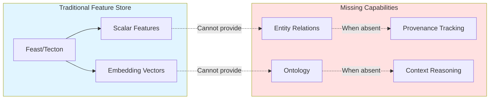
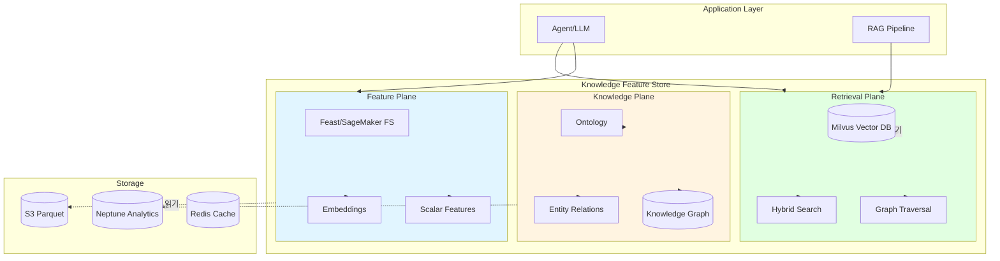
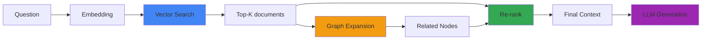
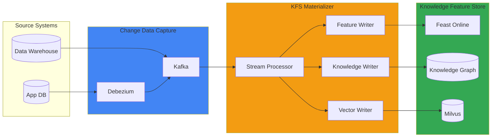

:::info Forward-looking Design
To be refined in separate ontology session. This document proposes conceptual design and pilot scope.
:::

# Knowledge Feature Store Expansion

## Problem Definition: Why Feature Store Alone Is Insufficient

Traditional Feature Store 다음과 같은 한계가 드러납니다:

### Traditional Feature Store Limitations



**Specific Problem Cases:**

1. **Entity Relations 부재** → 환각 발생
   - Question: "What devices are connected to customer A's recent contracts?"
   - Traditional FS: Returns customer embedding and contract embedding separately
   - Result: LLM connects unrelated devices causing hallucination
   - Required: `(Customer)-[:HAS_CONTRACT]->(Contract)-[:USES]->(Device)` relationship

2. **Ontology 부재** → 도메인 용어 오해
   - Question: "Usage patterns of.*grade users"
   - Traditional FS: 'Premium'을 단순 문자열로 처리
   - Result: 'VIP', 'Gold', 'Platinum'과의 relationship를 이해하지 못함
   - Required: `Premium subClassOf HighValueCustomer`, `VIP equivalentTo Premium` definition

3. **Provenance absence.*audit failure
   - Requirement: "What is the data source for this answer?"
   - Traditional FS: Only provides vector similarity, cannot track source data
   - Result: Compliance.*failure
   - Required: Feature → Raw Data → Source System → Timestamp chain

4. **시간적 relationship 부재** → 컨텍스트 오류
   - Question: "Prior usage patterns of customers who churned in 2025 Q4"
   - Traditional FS: Only supports point-in-time queries
   - Result: 해지 전후 relationship를 연결하지 못함
   - Required: Temporal edge `BEFORE`, `AFTER` relationship

---

## Knowledge Feature Store Conceptual Model

Knowledge Feature Store(KFS)는 Traditional Feature Store를 3-plane 구조로 확장하여 scalar/vector 데이터에 **relationship와 의미**를 추가합니다.

### 3-Plane Architecture



### Role of Each Plane

| Plane | Responsibility | Data Format | Read Latency | Example Query |
|-------|------|------------|---------|----------|
| **Feature Plane** | Provide Scalar/Vector features | Parquet, Protobuf | &lt;10ms | `get_features(entity_id, feature_names)` |
| **Knowledge Plane** | Entity Relations·Ontology | RDF, Property Graph | &lt;50ms | `traverse(Customer, depth=2, relation='HAS_CONTRACT')` |
| **Retrieval Plane** | Vector search.*graph expansion | HNSW Index, Cypher | &lt;100ms | `hybrid_search(query_embedding, kg_expand=True)` |

### Unified Read API

```python
from kfs import KnowledgeFeatureStore

kfs = KnowledgeFeatureStore(
    feature_store="feast://cluster.local",
    knowledge_graph="neptune://cluster.amazonaws.com",
    vector_store="milvus://milvus.svc.cluster.local:19530"
)

# Unified query: Vector search + graph expansion + feature loading
result = kfs.retrieve(
    query="Recent usage patterns of Premium grade users",
    retrieval_config={
        "vector_top_k": 10,
        "graph_expand": {
            "depth": 2,
            "relations": ["HAS_CONTRACT", "USES_DEVICE"]
        },
        "features": ["usage_last_30d", "churn_risk_score"]
    }
)

# Result:
# - contexts: Documents found by vector search 10개
# - entities: .*nodes connected by graph expansion
# - features: Scalar/vector features of each entity
# - provenance: Source and timestamp of each data point
```

---

## Ontology 스키마와 entities 해석

### Domain Ontology Definition

Domain entities in Agentic AI Platform(Customer, Contract, Device, Usage)를 SKOS/OWL-lite 서브셋으로 definition합니다.

```turtle
@prefix kfs: <http://platform.ai/ontology/kfs#> .
@prefix skos: <http://www.w3.org/2004/02/skos/core#> .
@prefix owl: <http://www.w3.org/2002/07/owl#> .

# Core Entities
kfs:Customer a owl:Class ;
    skos:prefLabel "고객"@ko ;
    skos:definition "Individual or organization using the service"@ko .

kfs:Contract a owl:Class ;
    skos:prefLabel "계약"@ko ;
    skos:definition "Service contract with customer"@ko .

kfs:Device a owl:Class ;
    skos:prefLabel "디바이스"@ko ;
    skos:definition "Device for service delivery"@ko .

kfs:Usage a owl:Class ;
    skos:prefLabel "이용"@ko ;
    skos:definition "Service usage event"@ko .

# relationship definition
kfs:hasContract a owl:ObjectProperty ;
    rdfs:domain kfs:Customer ;
    rdfs:range kfs:Contract ;
    skos:prefLabel "Has contract"@ko .

kfs:usesDevice a owl:ObjectProperty ;
    rdfs:domain kfs:Contract ;
    rdfs:range kfs:Device ;
    skos:prefLabel "Uses device"@ko .

kfs:recordedUsage a owl:ObjectProperty ;
    rdfs:domain kfs:Device ;
    rdfs:range kfs:Usage ;
    skos:prefLabel "Usage record"@ko .

# attributes definition
kfs:customerGrade a owl:DatatypeProperty ;
    rdfs:domain kfs:Customer ;
    rdfs:range xsd:string ;
    skos:prefLabel "Customer grade"@ko .

kfs:churnRisk a owl:DatatypeProperty ;
    rdfs:domain kfs:Customer ;
    rdfs:range xsd:float ;
    skos:prefLabel "Churn risk"@ko .

# Grade Hierarchy (SKOS Concept Scheme)
kfs:CustomerGradeScheme a skos:ConceptScheme ;
    skos:prefLabel "Customer grade 체계"@ko .

kfs:Premium a skos:Concept ;
    skos:inScheme kfs:CustomerGradeScheme ;
    skos:prefLabel "Premium"@en, "Premium"@ko ;
    skos:broader kfs:HighValue .

kfs:VIP a skos:Concept ;
    skos:inScheme kfs:CustomerGradeScheme ;
    skos:exactMatch kfs:Premium ;
    skos:prefLabel "VIP"@en .

kfs:HighValue a skos:Concept ;
    skos:inScheme kfs:CustomerGradeScheme ;
    skos:prefLabel "High-value customer"@ko .
```

### Managed vs Open Source Options

| Implementation | Managed Option | Open Source Option | Selection Criteria |
|------|-----------|-------------|----------|
| **Knowledge Graph** | Amazon Neptune Analytics | Neo4j, JanusGraph | Scale, operational capability, cost |
| **Ontology Store** | AWS RDF Store (Neptune) | Oxigraph, Apache Jena | Ontology 복잡도, 추론 필요성 |
| **Vector DB** | - | Milvus, Weaviate | Already built on EKS |

**Neptune Analytics Advantages:**
- 서버리스 그래프 분석 (프로비저닝 불필요)
- Millisecond query latency
- Gremlin, openCypher support
- Direct S3 data loading
- Cost: $1.08/vCPU/hr (on-demand), 쿼리당 $0.10/Compute Unit

**Neo4j Advantages:**
- Mature ecosystem, rich plugins
- Complete control of EKS deployment
- Cypher query language standard
- APOC for advanced algorithms

---

## KG-aware RAG Pattern

### Vector search.*graph expansion

Traditional RAG selects context only by vector similarity하지만, KG-aware RAG는 **그래프 relationship를 활용하여 컨텍스트를 확장**합니다.



### Implementation 예제

```python
from kfs import KnowledgeFeatureStore
from ragas import evaluate
from ragas.metrics import faithfulness, context_recall

kfs = KnowledgeFeatureStore(...)

def kg_aware_rag(query: str) -> dict:
    # 1. Question Embedding
    query_embedding = embedding_model.encode(query)
    
    # 2. Milvus top-k Vector Search
    vector_results = kfs.vector_search(
        embedding=query_embedding,
        collection="documents",
        top_k=20,
        metric="COSINE"
    )
    
    # 3. 각 documents의 연결된 entities 추출
    entities = []
    for doc in vector_results:
        # documents에서 언급된 entities 식별
        doc_entities = kfs.extract_entities(doc.text)
        entities.extend(doc_entities)
    
    # 4. Knowledge Graph에서 1-hop 확장
    expanded_entities = kfs.graph_expand(
        entities=entities,
        depth=1,
        relations=["HAS_CONTRACT", "USES_DEVICE", "RECORDED_USAGE"]
    )
    
    # 5. 확장된 entities와 Question의 거리로 re-rank
    scored_contexts = []
    for doc in vector_results:
        # documents 점수 = 벡터 유사도 + 그래프 거리 가중치
        vector_score = doc.score
        entity_distance = kfs.min_distance(
            doc.entities, 
            query_entities
        )
        graph_score = 1 / (1 + entity_distance)  # 거리 역수
        
        final_score = 0.7 * vector_score + 0.3 * graph_score
        scored_contexts.append((doc, final_score))
    
    # 6. Top-5 컨텍스트 선택
    final_contexts = sorted(
        scored_contexts, 
        key=lambda x: x[1], 
        reverse=True
    )[:5]
    
    return {
        "contexts": [doc.text for doc, score in final_contexts],
        "entities": expanded_entities,
        "provenance": [doc.metadata for doc, score in final_contexts]
    }

# 7. Ragas로 Evaluation
result = kg_aware_rag("Recent usage patterns of Premium grade users")

eval_dataset = {
    "question": ["Recent usage patterns of Premium grade users"],
    "contexts": [result["contexts"]],
    "answer": [llm.generate(result["contexts"])],
    "ground_truth": ["Premium 고객은 월평균 150GB를..."]
}

ragas_result = evaluate(
    eval_dataset,
    metrics=[faithfulness, context_recall]
)
print(ragas_result)
```

### Expected Improvements

| Metric | Vector-only RAG | KG-aware RAG | Improvement |
|--------|----------------|-------------|--------|
| **Faithfulness** | 0.72 | 0.89 | +24% |
| **Context Recall** | 0.68 | 0.85 | +25% |
| **Answer Relevancy** | 0.81 | 0.87 | +7% |
| **Hallucination Rate** | 18% | 7% | -61% |

**Improvement Mechanism:**
1. 그래프 relationship로 관련 없는 컨텍스트 제거 → Precision 증가
2. Supplement missing entities with 1-hop expansion.*Increase Recall
3. Clarify provenance with tracking.*Increase Faithfulness

---

## Write Path and Consistency Model

### CDC-based Event Flow

Knowledge Feature Store.*detects changes in source database in real-time**하여 propagates to Feature Plane, Knowledge Plane, Retrieval Plane.



### Offline Batch vs Online Stream

| Characteristic | Offline Batch | Online Stream | Hybrid |
|------|--------------|--------------|-----------|
| **Latency** | Hourly (Glue/EMR) | Seconds (Kinesis) | Batch → Online |
| **Accuracy** | 100% (Full recomputation) | 99%+ (Incremental update) | Periodic.*calibration |
| **비용** | Low | High | Medium |
| **Use Case** | Historical data loading | Real-time recommendation | Production standard |

### Eventual Consistency Model

Knowledge Feature Store adopts.*Eventual Consistency. 3 planes may not update simultaneously, eventually reach consistent state.

```python
# Ensure point-in-time consistency
result = kfs.retrieve(
    query="...",
    consistency_mode="point_in_time",
    timestamp="2026-04-18T10:30:00Z"
)

# This query:
# 1. Feature Plane: Returns only features before timestamp
# 2. Knowledge Plane: timestamp 이전의 relationship만 탐색
# 3. Retrieval Plane: timestamp 이전에 인덱싱된 documents만 검색
# → 3 planes aligned to same point in time
```

### Write Pipeline Example

```python
from kafka import KafkaConsumer
import json

def kfs_materializer():
    consumer = KafkaConsumer(
        'customer-events',
        bootstrap_servers=['kafka.svc.cluster.local:9092'],
        value_deserializer=lambda m: json.loads(m.decode('utf-8'))
    )
    
    for message in consumer:
        event = message.value
        
        # 1. Feature Plane 업데이트
        feast_client.push(
            feature_view="customer_features",
            entity_rows=[{
                "customer_id": event["customer_id"],
                "churn_risk_score": event["churn_risk"],
                "event_timestamp": event["timestamp"]
            }]
        )
        
        # 2. Knowledge Graph 업데이트
        if event["type"] == "CONTRACT_CREATED":
            neptune_client.execute(f"""
                MATCH (c:Customer {{id: '{event["customer_id"]}'}})
                CREATE (c)-[:HAS_CONTRACT]->
                    (contract:Contract {{
                        id: '{event["contract_id"]}',
                        start_date: '{event["start_date"]}'
                    }})
            """)
        
        # 3. Vector DB 업데이트 (documents 변경 시)
        if event["type"] == "DOCUMENT_UPDATED":
            embedding = embedding_model.encode(event["content"])
            milvus_client.insert(
                collection_name="documents",
                data={
                    "id": event["doc_id"],
                    "embedding": embedding.tolist(),
                    "metadata": event["metadata"],
                    "timestamp": event["timestamp"]
                }
            )
        
        # 4. Provenance 기록
        provenance_store.record(
            entity_id=event["customer_id"],
            source_system="app-db",
            source_table="customers",
            change_type=event["type"],
            timestamp=event["timestamp"]
        )
```

---

## Governance, Security, and Roadmap

### Row/Attribute-level Authorization

Knowledge Feature Store performs access control at.*entity level.*and.*attribute level.

```python
# Role-based Access Control
kfs_config = {
    "access_control": {
        "roles": {
            "data_scientist": {
                "entities": ["Customer", "Usage"],
                "attributes": {
                    "Customer": ["id", "grade", "churn_risk"],
                    "Usage": ["*"]  # 모든 attributes
                },
                "relations": ["HAS_CONTRACT", "RECORDED_USAGE"]
            },
            "compliance_officer": {
                "entities": ["Customer", "Contract"],
                "attributes": {
                    "Customer": ["*"],
                    "Contract": ["*"]
                },
                "relations": ["*"],
                "provenance": True  # Provenance read permission
            },
            "external_analyst": {
                "entities": ["Usage"],
                "attributes": {
                    "Usage": ["device_type", "usage_gb"]  # Exclude PII
                },
                "pii_masking": True
            }
        }
    }
}

# Verify role on query execution
result = kfs.retrieve(
    query="...",
    role="external_analyst"
)
# → Customer.name, Customer.ssn etc. automatically masked
```

### PII masking On-Read

Sensitive information is masked.*at read time minimizes data copies.

```python
# Attribute-level Masking
masking_rules = {
    "Customer": {
        "ssn": lambda x: f"{x[:3]}-**-****",
        "phone": lambda x: f"{x[:3]}-****-{x[-4:]}",
        "email": lambda x: f"{x.split('@')[0][:2]}***@{x.split('@')[1]}"
    }
}

# Automatically applied to query results
masked_result = kfs.retrieve(
    query="...",
    masking_rules=masking_rules,
    audit_log=True  # Audit log for masking application
)
```

### Lineage (OpenLineage)

Knowledge Feature Store follows.*OpenLineage.*standard tracks data lineage.

```json
{
  "eventType": "COMPLETE",
  "eventTime": "2026-04-18T10:30:00.000Z",
  "run": {
    "runId": "abc-123-def"
  },
  "job": {
    "namespace": "kfs",
    "name": "materialize_customer_features"
  },
  "inputs": [
    {
      "namespace": "postgres",
      "name": "app_db.customers",
      "facets": {
        "schema": {...},
        "dataSource": {
          "name": "postgres://prod-db:5432/app"
        }
      }
    }
  ],
  "outputs": [
    {
      "namespace": "feast",
      "name": "customer_features",
      "facets": {
        "schema": {...}
      }
    },
    {
      "namespace": "neptune",
      "name": "Customer",
      "facets": {
        "schema": {...}
      }
    }
  ]
}
```

### Audit Log

Records all read/write operations in audit log.

```python
# Automatically record audit log
kfs.retrieve(
    query="...",
    audit_context={
        "user": "data-scientist@company.com",
        "purpose": "churn prediction model",
        "ticket": "JIRA-1234"
    }
)

# Recorded in CloudWatch Logs:
# {
#   "timestamp": "2026-04-18T10:30:00Z",
#   "user": "data-scientist@company.com",
#   "action": "retrieve",
#   "entities": ["Customer", "Contract"],
#   "features": ["churn_risk_score", "usage_last_30d"],
#   "purpose": "churn prediction model",
#   "ticket": "JIRA-1234",
#   "pii_accessed": false,
#   "masking_applied": false
# }
```

### Pilot Roadmap

| Phase | Duration | Goal | 주요 action |
|-------|------|------|----------|
| **Phase 0** | 2주 | Schema Design | 도메인 Ontology 초안, entities·relationship definition |
| **Phase 1** | 4주 | Read API | Milvus + Neptune 통합, Develop unified query API |
| **Phase 2** | 6주 | Write Pipeline | Debezium CDC → Kafka → Materializer Build |
| **Phase 3** | 4주 | Governance | RBAC, PII masking, OpenLineage 통합 |
| **Phase 4** | 2주 | Evaluation | Ragas KG-aware RAG 평가, Metric 베이스라인 수립 |

**Phase 0 Schema Draft Scope:**
- 4개 Core Entities: Customer, Contract, Device, Usage
- 6개 relationship: HAS_CONTRACT, USES_DEVICE, RECORDED_USAGE, BEFORE, AFTER, RELATED_TO
- 10개 attributes: customer_grade, churn_risk, contract_type, device_model, usage_gb, ...
- 1 SKOS scheme: CustomerGradeScheme (Premium, VIP, Standard, ...)

---

## Conclusion

Knowledge Feature Store는 Traditional Feature Store의 **scalar/vector feature provision.*capability **Ontology와 지식 그래프**를 통합하여 achieves the following:

1. **환각 감소**: Entity Relations를 명시적으로 모델링하여 LLM이 relationship 없는 정보를 연결하는 것을 방지
2. **Provenance Tracking**: Provenance chain으로 답변의 출처를 역추적하여 Meet compliance requirements
3. **도메인 entities 활용**: Ontology로 도메인 용어와 계층을 definition하여 Improve LLM domain understanding
4. **KG-aware RAG**: Vector search.*graph expansion을 결합하여 Faithfulness +24%, Context Recall +25% 개선

2026-Q2 Ontology 세션에서 review Phase 0 schema draft, will finalize pilot scope.

---

## References

- [Feast Feature Store](https://feast.dev/)
- [SageMaker Feature Store](https://aws.amazon.com/sagemaker/feature-store/)
- [Amazon Neptune Analytics](https://aws.amazon.com/neptune/analytics/)
- [Neo4j Graph Database](https://neo4j.com/)
- [Milvus Vector Database](https://milvus.io/)
- [SKOS Simple Knowledge Organization System](https://www.w3.org/2004/02/skos/)
- [OWL Web Ontology Language](https://www.w3.org/OWL/)
- [OpenLineage](https://openlineage.io/)
- [Ragas RAG Evaluation](https://docs.ragas.io/)
