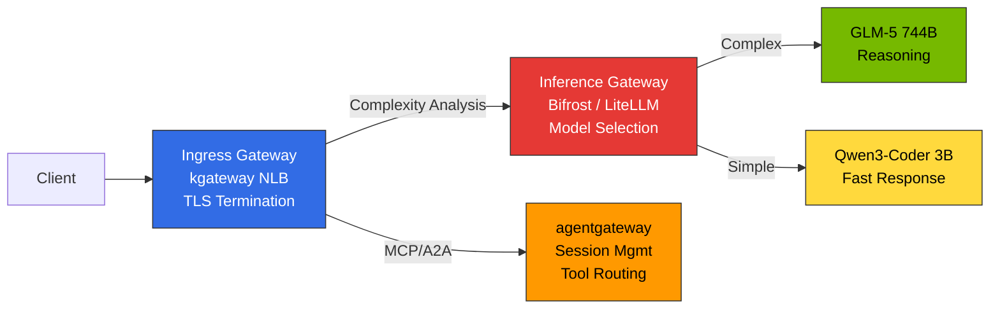
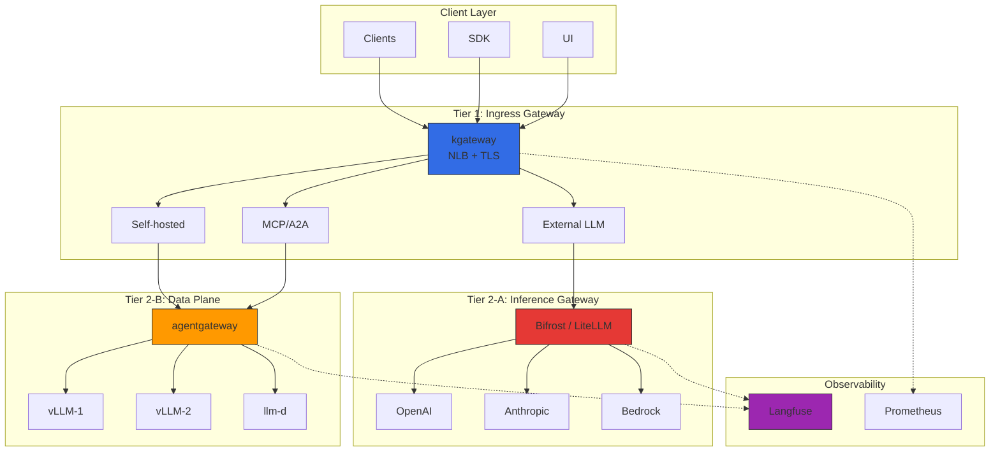
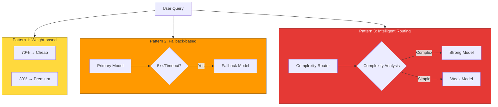
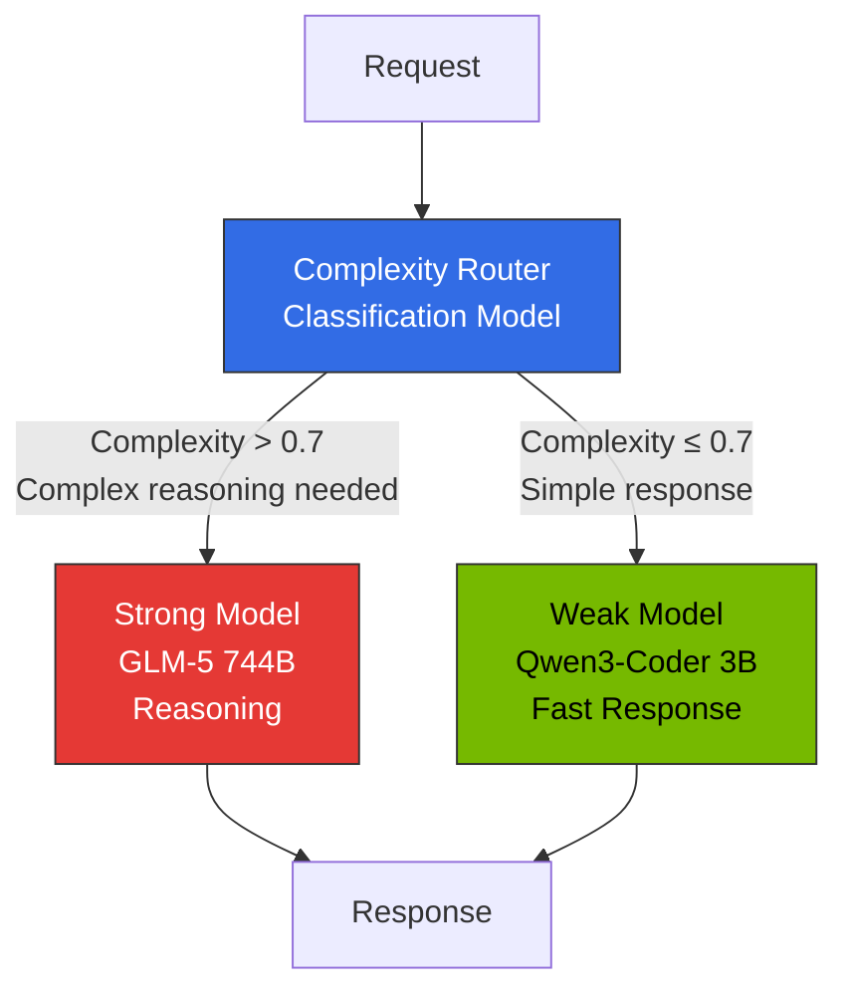
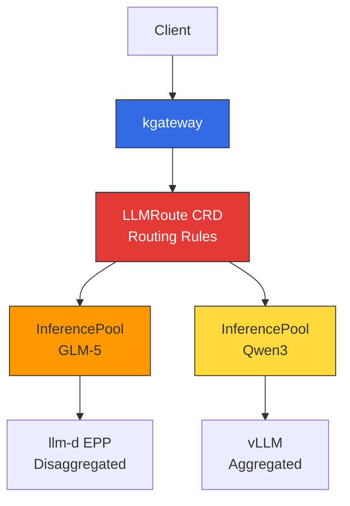

# Inference Gateway & LLM Gateway Architecture

> Written: 2025-02-05 | Updated: 2026-04-06 | Reading time: ~15 min

## Overview

In large-scale AI model serving environments, **infrastructure traffic management** and **LLM provider abstraction** must be separated. A single gateway leads to rapidly increasing complexity and makes it difficult to optimize each layer independently.

**2-Tier Gateway Architecture**:
- **L1 (Ingress Gateway)**: kgateway — Kubernetes Gateway API standard, traffic routing, mTLS, rate limiting
- **L2-A (Inference Gateway)**: Bifrost/LiteLLM — Provider integration, cascade routing, semantic caching
- **L2-B (Data Plane)**: agentgateway — MCP/A2A protocols, stateful session management

Each tier is independently managed, separating infrastructure from AI workloads.

---

## 2-Tier Gateway Architecture

### Gateway Layer Separation

LLM inference platforms must clearly distinguish **3 different Gateway roles**:

| Gateway Type | Role | Implementation | Position |
|-------------|------|---------------|----------|
| **Ingress Gateway** | External traffic reception, TLS termination, path-based routing | kgateway (NLB integration) | Tier 1 |
| **Inference Gateway** | Model selection, intelligent routing, request cascading | Bifrost / LiteLLM | Tier 2-A |
| **Data Plane** | MCP/A2A protocols, stateful sessions, tool routing | agentgateway | Tier 2-B |



**Core Principles:**
- **Ingress Gateway (kgateway)**: Handles only network-level traffic control. Does not include model selection logic
- **Inference Gateway (Bifrost/LiteLLM)**: Analyzes request complexity → auto-selects appropriate model → cost optimization
- **Data Plane (agentgateway)**: Processes AI-specific protocols (MCP/A2A), maintains stateful sessions

### Overall Structure



### Per-Tier Role Separation

| Tier | Component | Responsibility | Protocol |
|------|----------|---------------|----------|
| **Tier 1** | kgateway (Envoy-based) | Traffic routing, mTLS, rate limiting, network policies | HTTP/HTTPS, gRPC |
| **Tier 2-A** | Bifrost / LiteLLM | Intelligent model selection, cost tracking, request cascading, semantic caching | OpenAI-compatible API |
| **Tier 2-B** | agentgateway | MCP/A2A session management, self-hosted inference routing, Tool Poisoning prevention | HTTP, JSON-RPC, MCP, A2A |

### Traffic Flow

**External LLM**: Client → kgateway → Bifrost/LiteLLM (Cascade + Cache) → OpenAI → Response + cost recording
**Self-hosted vLLM**: Client → kgateway → agentgateway → vLLM → Response

---

## kgateway (L1 Inference Gateway)

### Gateway API-Based Routing

kgateway implements the Kubernetes Gateway API standard, enabling vendor-neutral configuration.

import { ComponentStructureTable } from '@site/src/components/InferenceGatewayTables';

<ComponentStructureTable />

Gateway API v1.2.0+ provides improved HTTPRoute, stabilized GRPCRoute, and BackendTLSPolicy. kgateway v2.0+ fully supports these.

### Dynamic Routing Concepts

| Routing Type | Criteria | Use Case |
|-------------|----------|----------|
| **Header-based** | `x-model-id`, `x-provider` | Per-model/provider backend selection |
| **Path-based** | `/v1/chat/completions`, `/v1/embeddings` | API type-based service separation |
| **Weight-based** | backendRef weight | Canary deployment, A/B testing |
| **Compound conditions** | Header + path + tier | Per-customer tier backend routing |

Canary deployments start with 5-10% traffic and gradually increase. On issues, immediately rollback by setting weight=0.

### Load Balancing Strategies

| Strategy | Description | Suitable Scenario |
|----------|-------------|-------------------|
| **Round Robin** | Sequential distribution (default) | Uniform model instances |
| **Random** | Random distribution | Large backend pools |
| **Consistent Hash** | Same key → same backend | KV Cache reuse, session persistence |

Consistent Hash is particularly useful for LLM inference. Routing the same user's requests to the same vLLM instance increases prefix cache hit rates, significantly improving TTFT (Time to First Token).

### Topology-Aware Routing (Kubernetes 1.33+)

Kubernetes 1.33+ topology-aware routing prioritizes intra-AZ Pod communication, reducing cross-AZ data transfer costs.

import { TopologyEffectsTable } from '@site/src/components/InferenceGatewayTables';

<TopologyEffectsTable />

### Failure Handling Concepts

| Mechanism | Description | LLM Inference Considerations |
|-----------|-------------|---------------------------|
| **Timeout** | Per-request maximum processing time | LLM long responses can take tens of seconds. Generous timeouts needed (120s+) |
| **Retry** | Auto-retry on 5xx, timeout, connection failure | Max 3 retries. Infinite retries cause system overload |
| **Circuit Breaker** | Temporarily blocks backends on consecutive failures | Set `maxEjectionPercent` to 50% or less to guarantee at least half of backends available |

For streaming responses, `backendRequest` timeout covers time to first byte, while `request` covers the entire request duration. POST retries require idempotency guarantees (caution with tool calls).

---

## LLM Gateway Solution Comparison

### Major Solution Comparison

| Solution | Language | Key Features | Cascade Routing | License | Suitable Environment |
|----------|---------|-------------|-----------------|---------|---------------------|
| **Bifrost** | Go/Rust | 50x faster, CEL Rules conditional routing, failover | CEL Rules + external classifier | Apache 2.0 | High-performance, low-cost, self-hosted |
| **LiteLLM** | Python | 100+ providers, native complexity-based routing | `routing_strategy: complexity-based` | MIT | Python ecosystem, rapid prototyping |
| **vLLM Semantic Router** | Python | vLLM-native, lightweight embedding-based routing | Embedding similarity-based | Apache 2.0 | vLLM-only environments |
| **Portkey** | TypeScript | SOC2 certified, semantic caching, Virtual Keys | Supported | Proprietary + OSS | Enterprise, regulatory compliance |
| **Kong AI Gateway** | Lua/C | MCP support, existing Kong infrastructure | Plugin | Apache 2.0 / Enterprise | Existing Kong users |
| **Helicone** | Rust | Gateway + Observability integrated, high-performance | Supported | Apache 2.0 | High-perf + observability needed |

### Bifrost vs LiteLLM

**Bifrost**: Go/Rust implementation with 50x faster throughput and 1/10 memory usage vs Python. CEL Rules enable conditional routing (header-based cascade, failover). Helm Chart deployment, OpenAI-compatible API. Proxy latency under 100us. Intelligent cascade requires app-level complexity score calculation → `x-complexity-score` header → CEL rule branching pattern or Go Plugin implementation.

**LiteLLM**: 100+ provider support, **native complexity-based routing** (activated with single `routing_strategy: complexity-based` setting), one-line Langfuse integration (`success_callback: ["langfuse"]`), direct LangChain/LlamaIndex integration. However, Python-based with lower throughput and higher memory usage.

### Selection Criteria

| Use Case | Recommended Solution | Reason |
|----------|---------------------|--------|
| Intelligent cascade (convenience) | **LiteLLM** | Native complexity-based routing, single-line config |
| Intelligent cascade (performance) | **Bifrost** | CEL Rules + external classifier, 50x faster |
| vLLM-only environment | **vLLM Semantic Router** | vLLM native, lightweight routing |
| High-performance, low-cost self-hosted | **Bifrost** | 50x faster processing, low memory |
| Python ecosystem (LangChain) | **LiteLLM** | Native integration, 100+ providers |
| Enterprise regulatory compliance | **Portkey** | SOC2/HIPAA/GDPR, Semantic Cache |
| High-performance + observability | **Helicone** | Rust-based all-in-one |

### Scenario-Based Recommended Combinations

| Scenario | Recommended Combination | Reason |
|----------|----------------------|--------|
| **Startup/PoC** | kgateway + LiteLLM | Low cost, 10-min deploy, 1-line complexity routing |
| **Self-hosted (performance)** | kgateway + Bifrost (CEL cascade) + agentgateway | High-perf, external+self 2-Tier |
| **Enterprise multi-provider** | kgateway + Portkey + Langfuse | Regulatory compliance, 250+ providers |
| **Hybrid (external+self)** | kgateway + Bifrost/LiteLLM + agentgateway | Bifrost/LiteLLM for external, agentgateway for self |
| **Global deployment** | Cloudflare AI Gateway + kgateway | Edge caching, DDoS protection |

---

## Request Cascading: Intelligent Model Routing

### Concept

**Request Cascading** is an intelligent optimization technique that automatically analyzes request complexity and routes to the appropriate model. Simple queries go to cheaper, faster models while complex reasoning goes to powerful models, improving both cost and latency simultaneously. IDEs use a single endpoint, and model selection is centrally controlled at the platform level.

### 3 Cascading Patterns

| Pattern | Description | Implementation | Use Case |
|---------|-------------|---------------|----------|
| **1. Weight-based** | Fixed ratio traffic distribution | Bifrost `weights: [0.7, 0.3]` | A/B testing, gradual model migration |
| **2. Fallback-based** | Auto-switch to another model on error | Bifrost `fallback: true` | Availability improvement, rate limit avoidance |
| **3. Intelligent routing** | Auto model selection after request analysis | LiteLLM/Bifrost/vLLM Semantic Router | Cost optimization, quality maintenance |



### Intelligent Cascade Routing Implementation Methods

Intelligent cascade routing analyzes request complexity to automatically route to appropriate models. There are 3 main implementation approaches:

#### Approach A: LiteLLM Native (Convenience First)

LiteLLM natively supports **complexity-based routing**. Adding a single line to the config file automatically analyzes request complexity and selects models.

```yaml
model_list:
  - model_name: gpt-4-turbo
    litellm_params:
      model: gpt-4-turbo-preview
      api_key: os.environ/OPENAI_API_KEY
  - model_name: gpt-3.5-turbo
    litellm_params:
      model: gpt-3.5-turbo
      api_key: os.environ/OPENAI_API_KEY

router_settings:
  routing_strategy: complexity-based  # Activated with this single line
  complexity_threshold: 0.7           # 0.7+ → powerful model
```

**Pros**: Single-line activation, auto-analyzes prompt length, code presence, reasoning keywords
**Cons**: Python-based low throughput, complexity algorithm not customizable

#### Approach B: Bifrost CEL Rules + External Classifier (Performance First)

Bifrost uses **CEL (Common Expression Language) Rules** for header-based conditional routing. Complexity analysis is performed at the **application level**, and results are passed via `x-complexity-score` header for Bifrost to select models via CEL rules.

```yaml
# Bifrost config (config.yaml)
routes:
  - path: /v1/chat/completions
    rules:
      - condition: 'request.headers["x-complexity-score"] > 0.7'
        backend: gpt-4-turbo
      - condition: 'request.headers["x-complexity-score"] <= 0.7'
        backend: gpt-3.5-turbo
    fallback: gpt-4-turbo  # Fallback when CEL rule fails
```

Application calculates complexity score and passes it as a header:

```python
# Client code (e.g., Python)
import openai

def calculate_complexity(prompt: str) -> float:
    # Simple heuristic (use ML model in production)
    score = 0.0
    if len(prompt) > 500: score += 0.3
    if "explain" in prompt or "analyze" in prompt: score += 0.4
    if "```" in prompt: score += 0.3  # Contains code
    return min(score, 1.0)

prompt = "Analyze this complex algorithm and explain..."
complexity_score = calculate_complexity(prompt)

response = openai.ChatCompletion.create(
    model="auto",  # Bifrost selects actual model
    messages=[{"role": "user", "content": prompt}],
    headers={"x-complexity-score": str(complexity_score)}
)
```

**Pros**: 50x faster throughput, full control over complexity algorithm, Go/Rust performance
**Cons**: Requires app-level classifier development (though simple heuristics are often sufficient)

#### Approach C: Bifrost Go Plugin (Full Integration)

Bifrost can perform **complexity analysis directly inside the Gateway** via Go Plugins. Implement the `PreLLMHook` interface to intercept requests, analyze complexity, and route to appropriate backends.

```go
// complexity_plugin.go (Bifrost Plugin)
package main

import (
    "strings"
    "github.com/bifrost/sdk"
)

type ComplexityRouter struct{}

func (c *ComplexityRouter) PreLLMHook(req *sdk.LLMRequest) (*sdk.RouteDecision, error) {
    score := c.analyzeComplexity(req.Prompt)
    
    if score > 0.7 {
        return &sdk.RouteDecision{Backend: "gpt-4-turbo"}, nil
    }
    return &sdk.RouteDecision{Backend: "gpt-3.5-turbo"}, nil
}

func (c *ComplexityRouter) analyzeComplexity(prompt string) float64 {
    score := 0.0
    if len(prompt) > 500 { score += 0.3 }
    if strings.Contains(prompt, "explain") { score += 0.4 }
    if strings.Contains(prompt, "```") { score += 0.3 }
    return score
}

func main() {
    sdk.RegisterPlugin(&ComplexityRouter{})
}
```

**Pros**: Gateway-level integration, no client modifications, high-performance
**Cons**: Go plugin development required, Bifrost-specific

#### Approach D: vLLM Semantic Router (vLLM Only)

In vLLM environments, **vLLM Semantic Router** performs lightweight embedding-based routing. It matches pre-defined "categories" to embeddings for model selection.

```python
# vLLM Semantic Router configuration
from vllm import SemanticRouter

router = SemanticRouter(
    categories={
        "simple": ["basic question", "quick answer", "definition"],
        "complex": ["explain in detail", "analyze", "step by step"]
    },
    models={
        "simple": "qwen3-coder-3b",
        "complex": "glm-5-744b"
    },
    threshold=0.85
)

# Auto-routing
response = router.route(prompt="Explain the architecture...")  # → glm-5-744b
```

**Pros**: vLLM native, lightweight embeddings (inference latency < 5ms), simple configuration
**Cons**: vLLM-only, requires pre-defined categories

### Hybrid Routing Pattern (Rule-based + ML-based)

In practice, a combination of **Rule-based Fast Path (80%)** + **ML-based Slow Path (20%)** is effective. Simple heuristics handle most traffic, with only ambiguous cases classified by ML models.

**Pros**: 80% of requests processed instantly (< 1ms overhead), only 20% use ML inference (5-10ms)
**Effect**: Average latency < 2ms, cost savings ~70%

### Cost Savings

10,000 requests/day scenario: Simple (50% GPT-3.5 $2.5) + Medium (30% Haiku $2.4) + Complex (15% GPT-4o $3.75) + Very Complex (5% GPT-4 Turbo $5) = **$13.65/day**. Compared to $50/day if all requests used GPT-4 Turbo — **73% savings**.

### Enterprise Model Routing Patterns

**Implementation location priority**: Gateway > IDE > Client

| Location | Pros | Suitable Environment |
|----------|------|---------------------|
| **Gateway (Bifrost/LiteLLM)** | Central control, policy consistency | Enterprise **(recommended)** |
| **IDE (Claude Code)** | Context-aware | Dev tool vendors |
| **Client (SDK)** | High flexibility | Prototyping |

**Production recommendation**: Deploy LiteLLM or Bifrost as Inference Gateway for central routing. Developers use a single endpoint; platform team manages policies.

---

## Research Reference: RouteLLM

**RouteLLM** is an open-source LLM routing framework developed by LMSYS. A lightweight classification model (Matrix Factorization) analyzes requests to automatically select between strong/weak models.



| Item | Description |
|------|-------------|
| **Classification Model** | Matrix Factorization (MF) — Lightweight embedding-based complexity prediction |
| **Input** | User prompt + conversation history |
| **Output** | Strong/Weak selection decision + confidence score |
| **Latency** | Additional latency < 10ms (classification model inference time) |
| **Accuracy** | Trained on LMSYS Chatbot Arena data, 90%+ accuracy |

:::warning RouteLLM Production Deployment Caution
RouteLLM is a research project, and direct production deployment is not recommended. While the MF classifier concept is useful, in practice **LiteLLM complexity routing** (native support) or **Bifrost CEL Rules** (high-performance) are more stable.
:::

For detailed deployment code, see the [Gateway Configuration Guide](../reference-architecture/inference-gateway-setup.md).

---

## Gateway API Inference Extension

Kubernetes Gateway API enables managing LLM inference as Kubernetes-native resources through **Inference Extension**.

### Core CRDs (Custom Resource Definitions)

| CRD | Role | Example |
|-----|------|---------|
| **InferenceModel** | Define per-model serving policy (criticality, routing rules) | `criticality: high` → dedicated GPU allocation |
| **InferencePool** | Model serving Pod group (vLLM replicas) | `replicas: 3` → 3 vLLM instances |
| **LLMRoute** | Rules for routing requests to InferenceModel | `x-model-id: glm-5` → GLM-5 Pool |

For detailed YAML manifests, see the [Gateway Configuration Guide](../reference-architecture/inference-gateway-setup.md).

### Gateway API Inference Extension Integration

Gateway API Inference Extension integrates with **kgateway + llm-d EPP** to provide Kubernetes-native inference routing:



**Current Status**: Actively developed as a CNCF project. Expected as alpha in Kubernetes 1.34+; production use is not recommended at this time. For production deployment, see the [Reference Architecture](../reference-architecture/) guides.

---

## Semantic Caching

### Concept

Semantic Caching detects **semantically similar prompts** and reuses previous responses, reducing LLM API costs. It uses embedding-based similarity matching (threshold > 0.85) to skip LLM calls on cache hits.

### Similarity Threshold

| Threshold | Meaning | Cache Hit Rate | Accuracy |
|-----------|---------|---------------|----------|
| **0.95+** | Nearly identical sentences | Low (~10%) | Very high |
| **0.85-0.94** | Same meaning, slightly different phrasing | Medium (~30%) | High **(recommended)** |
| **0.75-0.84** | Similar topic | High (~50%) | Medium (false positive risk) |
| **0.70 or below** | Related topic | Very high | Low (inappropriate response risk) |

**Recommended setting**: **0.85** (cache reuse when meaning is the same but phrasing differs)

### Cost Savings

10,000 requests/day, 30% cache hit rate, GPT-4 Turbo: monthly cost $4,500 → $3,150 (30% savings). Including additional costs (embedding ~$0.5/month, Redis/Milvus ~$10-20/month), net savings ~$1,300/month (29%).

**Implementation options**: Portkey (built-in semantic cache), Helicone (Rust-based high-performance), custom implementation (Redis + embeddings). See Reference Architecture for detailed configuration.

---

## agentgateway Data Plane

### Overview

**agentgateway** is the AI workload-specific data plane for kgateway. While existing Envoy is optimized for stateless HTTP/gRPC, AI agents have special requirements including stateful JSON-RPC sessions, MCP protocol, and Tool Poisoning prevention.

### Envoy vs agentgateway Comparison

| Item | Envoy Data Plane | agentgateway |
|------|-------------------|---------------------------|
| **Session Management** | Stateless, HTTP cookie-based | Stateful JSON-RPC sessions, in-memory session store |
| **Protocol** | HTTP/1.1, HTTP/2, gRPC | MCP (Model Context Protocol), A2A (Agent-to-Agent) |
| **Security** | mTLS, RBAC | Tool Poisoning prevention, per-session Authorization |
| **Routing** | Path/header-based | Session ID-based, tool call verification |
| **Observability** | HTTP metrics, Access Log | LLM token tracking, tool call chains, cost |

### Key Features

**1. Stateful JSON-RPC Session Management**: `X-MCP-Session-ID` header-based session tracking, Sticky Session routing, inactive session auto-cleanup (default 30 min)

**2. MCP/A2A Protocol Native Support**: `/mcp/v1` (MCP protocol), `/a2a/v1` (A2A agent communication) path support

**3. Tool Poisoning Prevention**: Allowed tool list, dangerous tool blocking (`exec_shell`, `read_credentials`), response size limits, integrity verification (SHA-256)

**4. Per-session Authorization**: JWT token verification, role-based tool access, session hijacking prevention

:::info agentgateway Project Status
agentgateway was separated from the kgateway project as an AI-specific data plane in late 2025, and is currently under active development. Features are continuously added to keep pace with rapid MCP and A2A protocol evolution.
:::

---

## Monitoring & Observability

### Key Metrics

Key metrics that should be monitored in AI inference gateways:

import { MonitoringMetricsTable } from '@site/src/components/InferenceGatewayTables';

<MonitoringMetricsTable />

| Metric Category | Key Items | Meaning |
|----------------|----------|---------|
| **Latency** | TTFT (Time to First Token) | Time until first token generation. User-perceived responsiveness |
| **Throughput** | TPS (Tokens Per Second) | Tokens generated per second. Model serving efficiency |
| **Error Rate** | 5xx / Total Requests | Backend failure ratio. Immediate response needed above 5% |
| **Cache Hit Rate** | Cache Hit / Total Requests | Semantic Cache efficiency. 30%+ recommended |
| **Cost** | Per-model token usage x unit price | Real-time cost tracking |

### Langfuse OTel Integration

OTel traces are sent from Bifrost/LiteLLM to Langfuse to track prompt/completion content, token usage, cost analysis, and tool call chains. Bifrost uses `otel` plugin; LiteLLM uses `success_callback: ["langfuse"]` configuration. See [Monitoring Stack Setup](../reference-architecture/monitoring-observability-setup.md) for detailed configuration.

### Recommended Alert Rules

| Alert | Condition | Severity |
|-------|----------|----------|
| High Error Rate | 5xx > 5% (5 min) | Critical |
| High Latency | P99 > 30s (5 min) | Warning |
| Circuit Breaker Activated | circuit_breaker_open == 1 | Critical |
| Cache Hit Rate Drop | Cache hit < 30% | Warning |
| Budget Threshold | Budget > 80% | Warning |

---

## Related Documents

### Production Deployment Guides

For actual code examples and YAML manifests, see the Reference Architecture section:

- [Gateway Configuration Guide](../reference-architecture/inference-gateway-setup.md) - kgateway, Bifrost, agentgateway installation and YAML manifests
- [OpenClaw AI Gateway Deployment](../reference-architecture/openclaw-ai-gateway.mdx) - OpenClaw + Bifrost + Hubble production deployment
- [Custom Model Deployment](../reference-architecture/custom-model-deployment.md) - vLLM/llm-d deployment guide

### Cost and Observability

- [Coding Tools & Cost Analysis](../reference-architecture/coding-tools-cost-analysis.md) - Aider/Cline connectivity, NLB integrated routing patterns
- [Monitoring Stack Setup](../reference-architecture/monitoring-observability-setup.md) - Langfuse OTel integration, Prometheus, Grafana dashboards
- [LLMOps Observability](../operations-mlops/llmops-observability.md) - Langfuse/LangSmith-based LLM observability

### Related Infrastructure

- [GPU Resource Management](../model-serving/gpu-resource-management.md) - Dynamic resource allocation strategy
- [llm-d Distributed Inference](../model-serving/llm-d-eks-automode.md) - EKS Auto Mode-based distributed inference
- [Agent Monitoring](../operations-mlops/agent-monitoring.md) - Langfuse integration guide

---

## References

### Official Documentation

- [Kubernetes Gateway API](https://gateway-api.sigs.k8s.io/)
- [Gateway API Inference Extension (Proposal)](https://github.com/kubernetes-sigs/gateway-api/issues/2813)
- [kgateway Official Documentation](https://kgateway.dev/docs/)
- [agentgateway GitHub](https://github.com/kgateway-dev/agentgateway)
- [Bifrost Official Documentation](https://www.getmaxim.ai/bifrost/docs)
- [LiteLLM Official Documentation](https://docs.litellm.ai/)
- [LiteLLM Complexity Routing](https://docs.litellm.ai/docs/routing)
- [vLLM Semantic Router](https://github.com/vllm-project/semantic-router)

### LLM Providers

- [OpenAI API Reference](https://platform.openai.com/docs/api-reference)
- [Anthropic Claude API](https://docs.anthropic.com/claude/reference)
- [AWS Bedrock](https://docs.aws.amazon.com/bedrock/)

### Related Protocols

- [Model Context Protocol (MCP) Spec](https://modelcontextprotocol.io/specification)
- [Agent-to-Agent (A2A) Protocol](https://github.com/a2a-protocol/spec)

### Research & Patterns

- [RouteLLM: Learning to Route LLMs with Preference Data (arXiv)](https://arxiv.org/abs/2406.18665)
- [LMSYS Chatbot Arena Leaderboard](https://chat.lmsys.org/?leaderboard)
- [LLM Router Pattern: Model Switching](https://markaicode.com/llm-router-pattern-model-switching/)
