# AgentCore Hybrid Deployment Patterns

> 📅 **Written**: 2026-04-18 | ⏱️ **Reading Time**: ~15 minutes

## Overview

Bedrock AgentCore는 강력한 매니지드 Agent 플랫폼이지만, 엔터프라이즈 환경에서는 자체 호스팅 인프라와의 조합이 필요한 경우가 많습니다. 이 문서는 **AgentCore의 서버리스 장점과 EKS 기반 Self-hosted 인프라의 유연성을 결합**하여 Optimal의 하이브리드 아키텍처를 설계하기 위한 의사결정 프레임워크와 검증된 패턴 카탈로그를 제공합니다.

:::info Prerequisites
Before reading this document, refer to:
- [AWS Native Platform](./aws-native-agentic-platform.md) — AgentCore 7개 서비스 개요 (avoid duplication)
- [EKS-based Open Architecture](./agentic-ai-solutions-eks.md) — Self-hosted stack composition
- [AI Platform Decision Framework](./ai-platform-decision-framework.md) — Managed vs open-source decision-making
- [SageMaker-EKS 통합](../../reference-architecture/integrations/sagemaker-eks-integration.md) — Hybrid VPC/IAM reference
:::

:::caution Verification pending
The Decision Matrix 8-axis weights, Hand-off pattern catalog, IAM session sharing flow, and migration roadmap are in a pre-review state awaiting MLOps lead review and real-deployment E2E verification. Value footnotes and banner will be updated after validation.

Verification tracking: [Issue #6](https://github.com/devfloor9/engineering-playbook/issues/6)
:::


---

## Hybrid Deployment Motivation

### Single Approach Limitations

**Constraints of AgentCore Only**:
- Bedrock GA 100+ 모델 중심 (cannot host self fine-tuned SLMs)
- 토큰 기반 과금 (고빈도 Simple task에서 Cost 증가)
- Latency with on-premises data sources
- Complex PrivateLink setup when MCP servers are inside VPC

**Constraints of EKS Self-hosted Only**:
- Agent Runtime infrastructure operational burden (Kagent Pod + Redis State Store)
- Complex autoscaling vs serverless scaling (KEDA Queue 기반)
- Lack of managed memory management (direct implementation required)
- Direct multi-agent orchestration framework construction

### Core Value of Hybrid

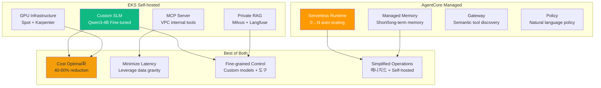

### Cost Break-even Calculation

| Monthly Inference Volume | AgentCore Only | EKS Self-hosted Only | Hybrid (Cascade) | Optimal Approach |
|-------------|---------------|---------------------|------------------|----------|
| ~100K requests | **$300-500** | $800-1,200 | $400-700 | AgentCore Only |
| ~500K requests | $1,500-2,000 | $1,200-1,800 | **$800-1,200** | Hybrid starting point |
| ~1.5M requests | $4,500-6,000 | $2,500-3,500 | **$2,000-2,800** | Hybrid required |
| ~5M+ requests | $15,000+ | **$3,500-5,000** | **$4,000-6,000** | EKS-centric Hybrid |

:::tip Break-even Point
Hybrid approach becomes cost-effective at 500K+ monthly inference volumes. [Coding Tools Cost Analysis](../../reference-architecture/integrations/coding-tools-cost-analysis.md)for detailed calculation formulas.
:::

---

## Decision Matrix: Where to Place Agents

Evaluate agent placement using 8 core dimensions.

| Evaluation Axis | AgentCore | EKS Kagent | Hybrid | Decision Criteria |
|--------|-----------|------------|--------|----------|
| **Inference Latency** | Medium (50-200ms) | Low (10-50ms) | **낮음** | VPC internal tools 호출 → EKS |
| **Cost** | High for high-frequency | 고빈도 시 Low | **Optimal** | 단순=EKS, 복잡=AgentCore |
| **PII Handling** | VPC 외부 (제약) | VPC 내부 (유리) | **유연** | 민감 데이터 → EKS MCP |
| **Model Customization** | Bedrock 모델만 | 자유 (Qwen3, 커스텀) | **자유** | Fine-tuned 모델 → EKS |
| **Tool Chain** | REST→MCP 변환 | K8s 네이티브 | **양쪽** | 외부 SaaS → AgentCore Gateway |
| **Session Length** | 최대 8시간 | 제한 없음 | **제한 없음** | 장시간 대화 → EKS State |
| **Audit Requirements** | CloudTrail 자동 | 직접 Implementation 필요 | **CloudTrail + Custom** | 규제 → AgentCore 우선 |
| **Team Capability** | Kubernetes 불필요 | Kubernetes 필수 | **선택적** | K8s Beginner → AgentCore 중심 |

### Decision Flowchart

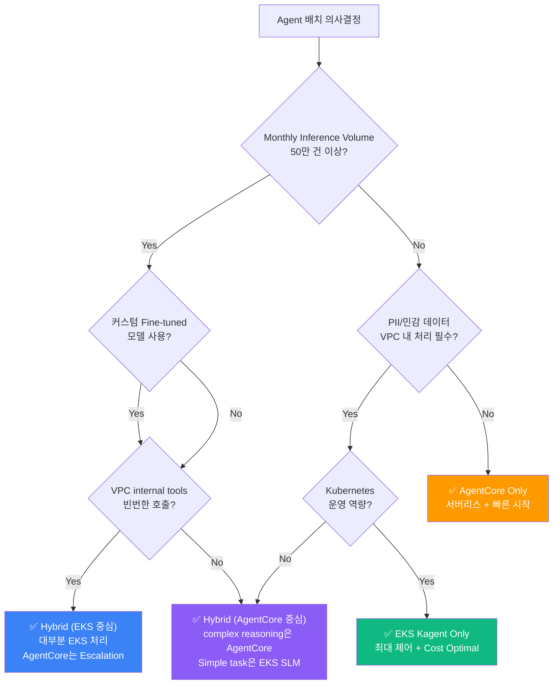

---

## Data Gravity and Tool Colocation Patterns

### What is Data Gravity?

데이터가 많은 곳에 컴퓨팅을 배치하는 것이 네트워크 지연과 Cost을 최소화합니다.

**Typical Scenario**:
- EKS VPC 내부에 Milvus 벡터 DB (수 GB~TB 규모)
- AgentCore Runtime은 VPC 외부 (Bedrock 서비스 계정)
- Agent가 RAG 검색을 위해 Milvus 조회 시 **PrivateLink 경유 필요** → 지연 증가 + 복잡도 증가

### Reverse Call Pattern

Architecture where AgentCore Runtime calls MCP servers inside EKS VPC.

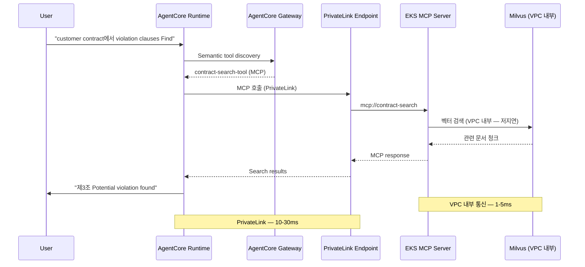

### PrivateLink Setup

```yaml
# privatelink-mcp-endpoint.yaml
apiVersion: v1
kind: Service
metadata:
  name: mcp-server-nlb
  namespace: mcp-system
  annotations:
    service.beta.kubernetes.io/aws-load-balancer-type: "nlb"
    service.beta.kubernetes.io/aws-load-balancer-internal: "true"
    service.beta.kubernetes.io/aws-load-balancer-nlb-target-type: "ip"
spec:
  type: LoadBalancer
  selector:
    app: mcp-server
  ports:
    - port: 443
      targetPort: 8080
      protocol: TCP
---
# VPC Endpoint Service 생성 (AWS Console 또는 Terraform)
# 1. NLB ARN 확인
# 2. VPC Endpoint Service 생성 (Acceptance required: No)
# 3. AgentCore IAM Role에 Endpoint 접근 권한 추가
```

### S3+KMS Boundary Setup

Securely share sensitive data between AgentCore and EKS via S3 + KMS encryption.

```python
# secure_artifact_manager.py
import boto3
import json

class SecureArtifactManager:
    def __init__(self, bucket: str, kms_key_id: str):
        self.s3 = boto3.client('s3')
        self.kms = boto3.client('kms')
        self.bucket = bucket
        self.kms_key_id = kms_key_id
    
    def store_sensitive_result(self, agent_id: str, session_id: str, data: dict) -> str:
        """Store sensitive results encrypted in S3"""
        key = f"agentcore/{agent_id}/{session_id}/result.json"
        
        self.s3.put_object(
            Bucket=self.bucket,
            Key=key,
            Body=json.dumps(data),
            ServerSideEncryption='aws:kms',
            SSEKMSKeyId=self.kms_key_id,
            Metadata={'pii': 'true', 'agent-session': session_id}
        )
        return f"s3://{self.bucket}/{key}"
    
    def load_from_eks(self, s3_uri: str) -> dict:
        """Load S3 object from EKS Pod (Pod Identity로 KMS 복호화)"""
        bucket, key = s3_uri.replace('s3://', '').split('/', 1)
        response = self.s3.get_object(Bucket=bucket, Key=key)
        return json.loads(response['Body'].read())
```

**IAM 정책**:
```json
{
  "Version": "2012-10-17",
  "Statement": [
    {
      "Effect": "Allow",
      "Principal": {
        "AWS": "arn:aws:iam::ACCOUNT:role/AgentCoreExecutionRole"
      },
      "Action": ["s3:PutObject"],
      "Resource": "arn:aws:s3:::my-secure-artifacts/agentcore/*",
      "Condition": {
        "StringEquals": {"s3:x-amz-server-side-encryption": "aws:kms"}
      }
    },
    {
      "Effect": "Allow",
      "Principal": {
        "AWS": "arn:aws:iam::ACCOUNT:role/EKSPodRole"
      },
      "Action": ["s3:GetObject"],
      "Resource": "arn:aws:s3:::my-secure-artifacts/agentcore/*"
    }
  ]
}
```

---

## Hand-off Pattern Catalog

### Pattern (a): Router-front (AgentCore Gateway→Self-hosted)

AgentCore Gateway analyzes requests and routes to either AgentCore Agent or EKS Self-hosted Agent.

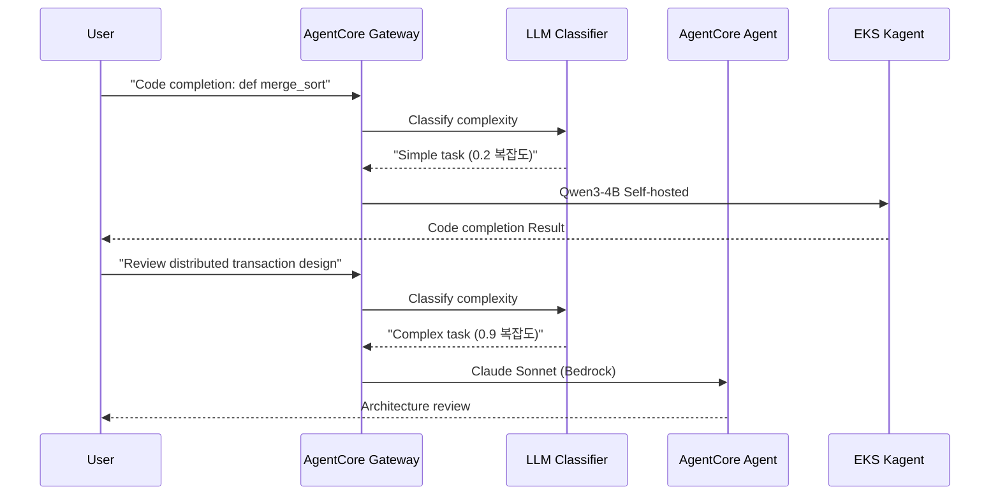

**Classification Criteria**:

| Complexity Score | Routing Target | Example Tasks |
|-----------|-----------|----------|
| 0.0-0.3 | EKS Qwen3-4B | Code completion, translation, summarization |
| 0.3-0.7 | AgentCore Claude Haiku | Basic analysis, simple reasoning |
| 0.7-1.0 | AgentCore Claude Sonnet | Architecture review, complex reasoning |

**Implementation**:

```python
# classifier_router.py
from strands import Agent
from strands.models import BedrockModel
import boto3

bedrock_runtime = boto3.client('bedrock-agent-runtime')

class HybridRouter:
    def __init__(self):
        self.classifier = Agent(
            model=BedrockModel(model_id="anthropic.claude-haiku-20250320"),
            system_prompt="""당신은 Request Classify complexity기입니다.
Evaluate complexity on a 0.0-1.0 scale and respond with JSON.
{"complexity": 0.0-1.0, "reason": "explanation"}"""
        )
    
    def route(self, user_request: str) -> dict:
        classification = self.classifier(f"Request: {user_request}")
        complexity = classification['complexity']
        
        if complexity < 0.3:
            return self._route_to_eks(user_request)
        elif complexity < 0.7:
            return self._route_to_agentcore(user_request, model='haiku')
        else:
            return self._route_to_agentcore(user_request, model='sonnet')
    
    def _route_to_eks(self, request: str) -> dict:
        """EKS Kagent로 라우팅"""
        import requests
        response = requests.post(
            "http://kagent-service.agents.svc.cluster.local/invoke",
            json={"prompt": request, "model": "qwen3-4b"}
        )
        return {"response": response.json(), "routed_to": "eks-kagent"}
    
    def _route_to_agentcore(self, request: str, model: str) -> dict:
        """AgentCore로 라우팅"""
        response = bedrock_runtime.invoke_agent(
            agentId='AGENT123',
            agentAliasId='ALIAS456',
            sessionId='session-' + str(hash(request)),
            inputText=request
        )
        return {"response": response, "routed_to": f"agentcore-{model}"}
```

---

### Pattern (b): Escalation (Qwen3 Self→AgentCore Reasoning)

EKS Self-hosted Agent processes first, escalates to AgentCore when complexity exceeds threshold.

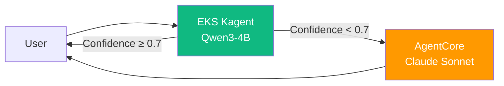

**Escalation Triggers**:
- LLM response Confidence 점수 < 0.7
- Tool call failure 2회 이상
- User 명시적 Request ("need more accurate answer")

**Implementation**:

```python
# escalation_agent.py
from strands import Agent
import boto3

class EscalatingAgent:
    def __init__(self):
        self.primary_agent = Agent(
            model=LocalModel("http://vllm-qwen3.vllm.svc.cluster.local"),
            tools=["code_completion", "translation"]
        )
        self.bedrock_runtime = boto3.client('bedrock-agent-runtime')
    
    def process(self, user_request: str) -> dict:
        # 1차: EKS Self-hosted Agent
        response = self.primary_agent(user_request)
        confidence = response.metadata.get('confidence', 0.0)
        
        if confidence >= 0.7:
            return {"response": response, "agent": "eks-qwen3", "confidence": confidence}
        
        # 에스컬레이션: AgentCore Claude Sonnet
        print(f"⚠️ 낮은 Confidence ({confidence}) → AgentCore 에스컬레이션")
        agentcore_response = self.bedrock_runtime.invoke_agent(
            agentId='EXPERT_AGENT_ID',
            agentAliasId='PROD_ALIAS',
            sessionId='escalation-session',
            inputText=f"원본 Request: {user_request}\n\n초기 시도 실패 (Confidence: {confidence}). 정확한 답변 제공 필요."
        )
        return {"response": agentcore_response, "agent": "agentcore-sonnet", "escalated": True}
```

---

### Pattern (c): Dual-write Memory (AgentCore Memory↔EKS Langfuse)

Synchronize conversation history between AgentCore and EKS Agents to maintain consistent context.

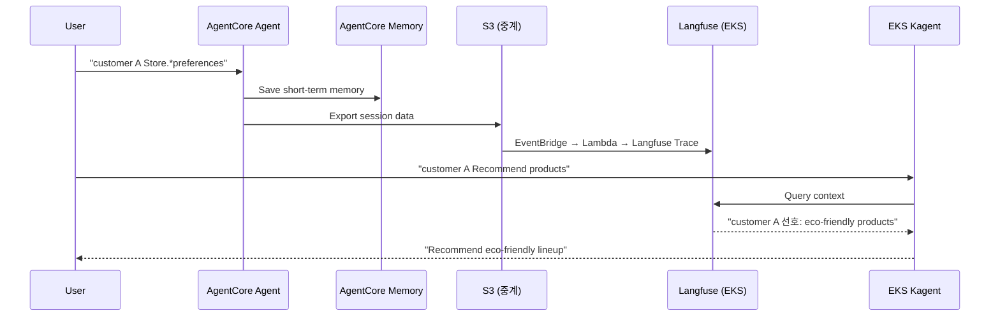

**Synchronization Strategy**:

| Event | AgentCore → EKS | EKS → AgentCore |
|--------|----------------|----------------|
| Session start | Memory Session ID → S3 | Langfuse Trace ID → DynamoDB |
| 도구 호출 | Action Group execution log → CloudWatch → Langfuse | Langfuse Span → CloudWatch Logs Insights |
| Session end | Memory summarization → S3 → Langfuse | Langfuse session statistics → AgentCore Analytics |

**Implementation**:

```python
# dual_memory_sync.py
import boto3
from langfuse import Langfuse
from datetime import datetime

class DualMemoryManager:
    def __init__(self):
        self.s3 = boto3.client('s3')
        self.langfuse = Langfuse(
            public_key="lf_pk_...",
            secret_key="lf_sk_...",
            host="https://langfuse.eks.internal"
        )
        self.agentcore_memory_bucket = "agentcore-memory-export"
    
    def sync_agentcore_to_langfuse(self, agent_id: str, session_id: str):
        """AgentCore Memory → Langfuse 동기화"""
        # AgentCore Memory 내보내기 (S3)
        memory_key = f"{agent_id}/{session_id}/memory.json"
        memory_obj = self.s3.get_object(Bucket=self.agentcore_memory_bucket, Key=memory_key)
        memory_data = json.loads(memory_obj['Body'].read())
        
        # Langfuse Trace 생성
        trace = self.langfuse.trace(
            id=session_id,
            name=f"AgentCore Session {agent_id}",
            metadata={"source": "agentcore", "agent_id": agent_id}
        )
        
        for turn in memory_data['conversation']:
            trace.span(
                name=f"Turn {turn['turn_id']}",
                input=turn['user_input'],
                output=turn['agent_response'],
                metadata={"timestamp": turn['timestamp']}
            )
        
        trace.update(output=memory_data.get('summary'))
        print(f"✅ AgentCore Memory → Langfuse 동기화 완료: {session_id}")
    
    def sync_langfuse_to_agentcore(self, trace_id: str, agent_id: str):
        """Langfuse → AgentCore Memory 동기화"""
        trace = self.langfuse.get_trace(trace_id)
        
        # AgentCore Memory 형식으로 변환
        memory_data = {
            "agent_id": agent_id,
            "session_id": trace_id,
            "conversation": [
                {"turn_id": i, "user_input": span.input, "agent_response": span.output}
                for i, span in enumerate(trace.spans)
            ],
            "synced_at": datetime.utcnow().isoformat()
        }
        
        # S3 업로드 (AgentCore가 import)
        self.s3.put_object(
            Bucket=self.agentcore_memory_bucket,
            Key=f"{agent_id}/{trace_id}/imported-memory.json",
            Body=json.dumps(memory_data)
        )
        print(f"✅ Langfuse → AgentCore Memory 동기화 완료: {trace_id}")
```

---

### Pattern (d): Cost-arbitrage (High-freq=EKS, Low-freq Complex=AgentCore)

Request 빈도와 복잡도에 따라 Cost Optimal Agent를 선택합니다.

**Cost 모델**:

| Scenario | 월 Request 수 | Avg Tokens | AgentCore Cost | EKS Cost | Optimal 선택 |
|---------|-----------|---------|--------------|----------|----------|
| Code completion | 500만 건 | 300 토큰 | ~$15,000 | ~$3,500 | **EKS** |
| Architecture review | 5만 건 | 5,000 토큰 | ~$2,500 | $3,500 (GPU 유휴) | **AgentCore** |
| translation | 200만 건 | 500 토큰 | ~$10,000 | ~$2,000 | **EKS** |
| complex reasoning | 10만 건 | 8,000 토큰 | ~$8,000 | $4,000 (dedicated GPU) | **AgentCore** |

**라우팅 로직**:

```python
# cost_arbitrage_router.py
class CostArbitrageRouter:
    def __init__(self):
        self.request_counts = {}  # Request 빈도 추적
        
        # Cost 계수 (예시)
        self.agentcore_cost_per_1k_tokens = 0.003  # Claude Haiku
        self.eks_fixed_monthly = 500  # GPU 인스턴스 고정 Cost
        self.eks_break_even_requests = 200000  # 손익분기
    
    def should_use_eks(self, task_type: str, estimated_tokens: int) -> bool:
        """Cost 기반 라우팅 결정"""
        monthly_requests = self.request_counts.get(task_type, 0)
        
        # 고빈도 작업 → EKS
        if monthly_requests > self.eks_break_even_requests:
            return True
        
        # 저빈도 + 복잡 → AgentCore
        if estimated_tokens > 5000 and monthly_requests < 50000:
            return False
        
        # Simple task → EKS (고정 Cost 상각)
        if estimated_tokens < 1000:
            return True
        
        return False  # 기본: AgentCore
```

---

## IAM, Session, and Observability Integration Boundaries

### AgentCore Identity OAuth Token Propagation

Safely propagate OAuth tokens issued by AgentCore Identity to EKS MCP servers.

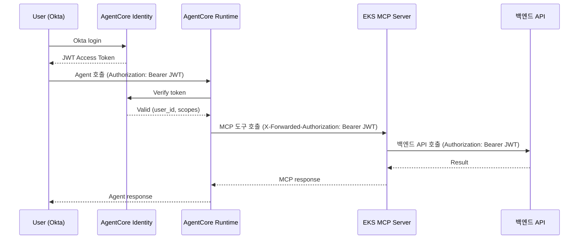

**EKS MCP Server 인증 검증**:

```python
# mcp_auth_middleware.py
import jwt
from functools import wraps
from flask import request, jsonify

def validate_agentcore_token(f):
    @wraps(f)
    def decorated(*args, **kwargs):
        token = request.headers.get('X-Forwarded-Authorization', '').replace('Bearer ', '')
        
        if not token:
            return jsonify({"error": "Missing authorization token"}), 401
        
        try:
            # AgentCore Identity 공개키로 검증
            payload = jwt.decode(
                token,
                audience="mcp-server",
                issuer="https://bedrock.amazonaws.com/agentcore/identity",
                algorithms=["RS256"],
                options={"verify_signature": True}
            )
            request.user_id = payload['sub']
            request.scopes = payload['scope']
            return f(*args, **kwargs)
        except jwt.ExpiredSignatureError:
            return jsonify({"error": "Token expired"}), 401
        except jwt.InvalidTokenError:
            return jsonify({"error": "Invalid token"}), 401
    
    return decorated

@app.route('/mcp/customer-lookup', methods=['POST'])
@validate_agentcore_token
def customer_lookup():
    """인증된 User만 customer 조회 가능"""
    customer_id = request.json.get('customer_id')
    # request.user_id로 감사 로그 기록
    return {"customer": fetch_customer(customer_id)}
```

### CloudWatch GenAI Observability ↔ Langfuse OTel Bridge

Integrate AgentCore traces and EKS Langfuse traces to track complete Agent flows.

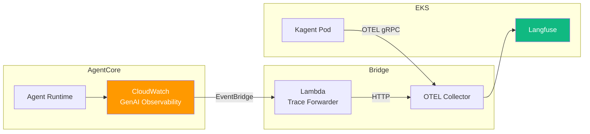

**Trace Correlation ID 규칙**:

| 소스 | Trace ID 형식 | Parent Span ID |
|------|--------------|----------------|
| AgentCore | `ac-{session_id}-{timestamp}` | `ac-root` |
| EKS Kagent | `eks-{pod_name}-{trace_id}` | `ac-{session_id}` (AgentCore 호출 시) |
| Hybrid Trace | `hybrid-{session_id}` | 양쪽에서 공유 |

**Lambda Trace Forwarder**:

```python
# trace_forwarder_lambda.py
import boto3
import json
import requests
from datetime import datetime

cloudwatch = boto3.client('logs')
langfuse_endpoint = "https://langfuse.eks.internal/api/public/ingestion"

def lambda_handler(event, context):
    """CloudWatch GenAI Observability → Langfuse 전달"""
    for record in event['Records']:
        message = json.loads(record['Sns']['Message'])
        
        if message['source'] == 'aws.bedrock.agentcore':
            trace_data = message['detail']
            
            # Langfuse 형식으로 변환
            langfuse_trace = {
                "id": f"hybrid-{trace_data['sessionId']}",
                "name": f"AgentCore {trace_data['agentId']}",
                "metadata": {
                    "source": "agentcore",
                    "agent_id": trace_data['agentId'],
                    "aws_region": message['region']
                },
                "spans": [
                    {
                        "name": step['actionGroupName'],
                        "input": step['input'],
                        "output": step['output'],
                        "start_time": step['startTime'],
                        "end_time": step['endTime']
                    }
                    for step in trace_data.get('actionGroupInvocations', [])
                ]
            }
            
            # Langfuse로 전송
            response = requests.post(
                langfuse_endpoint,
                json=langfuse_trace,
                headers={"Authorization": f"Bearer {os.environ['LANGFUSE_API_KEY']}"}
            )
            print(f"✅ Trace 전달 완료: {trace_data['sessionId']} → Langfuse")
    
    return {"statusCode": 200}
```

---

## Gradual Migration Roadmap

### Phase 1: AgentCore Only (0-3 months)

**Goal**: Fast production deployment, zero infrastructure operational burden

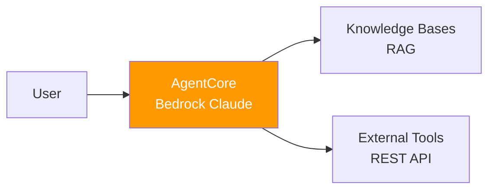

**Checklist**:
- [ ] Select Bedrock model (Claude Sonnet/Haiku)
- [ ] Strands SDK로 Agent Implementation
- [ ] Deploy to AgentCore (`agentcore deploy`)
- [ ] Configure Knowledge Bases RAG
- [ ] Enable CloudWatch GenAI Observability

**Exit Criteria (Phase 2 transition triggers)**:
- Monthly Inference Volume 50만 건 초과
- Bedrock 토큰 Cost 월 $1,500 초과
- VPC internal tools 호출 빈도 높음 (p95 latency > 100ms)

---

### Phase 2: Bedrock + Self-hosted SLM (3-6 months)

**Goal**: Cost Optimal화, Simple task을 EKS Qwen3-4B로 오프로드

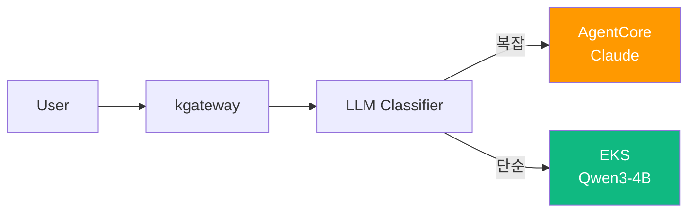

**Checklist**:
- [ ] Configure EKS cluster (Auto Mode 또는 Karpenter)
- [ ] Deploy Qwen3-4B with vLLM
- [ ] LLM Classifier Implementation (Cascade Routing)
- [ ] kgateway + Bifrost 2-Tier Gateway 구성
- [ ] Cost 대시보드 구축 (AgentCore vs EKS Cost 추적)

**Exit Criteria (Phase 3 transition triggers)**:
- EKS Agent와 AgentCore Agent 간 컨텍스트 공유 필요
- 양쪽에서 동일한 세션 유지 요구
- Fine-tuned Custom models 필요

---

### Phase 3: Full Hybrid Cross-routing (6-12 months)

**Goal**: 양방향 라우팅, 통합 컨텍스트, Optimal Cost

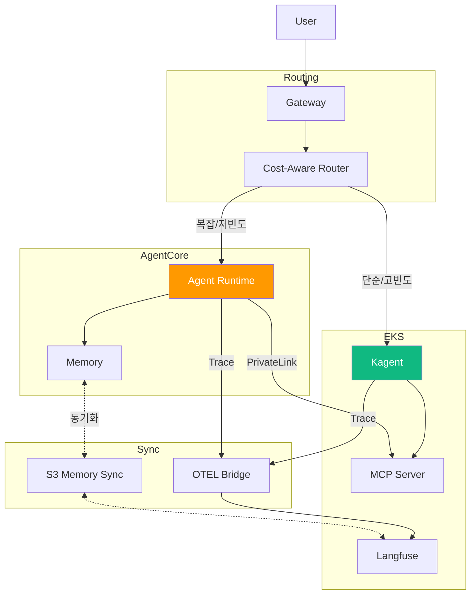

**Checklist**:
- [ ] Dual-write Memory 동기화 Implementation (패턴 c)
- [ ] Integrate Trace Correlation ID
- [ ] PrivateLink Endpoint for MCP
- [ ] Cost-arbitrage Router Implementation (패턴 d)
- [ ] Escalation 로직 Implementation (패턴 b)
- [ ] Unified dashboard (AgentCore + EKS integrated observability)

**Success Metrics**:
- Cost reduction률: 40-60% (Bedrock Only vs)
- p95 latency.*improvement
- Session context consistency: 95% 이상
- Agent availability: 99.9% (both-side Failover)

---

## transition triggers Metric

Quantitative metrics to determine each Phase transition.

| Metric | Phase 1 → 2 Threshold | Phase 2 → 3 Threshold |
|------|-------------------|-------------------|
| **Monthly Inference Volume** | > 50만 건 | > 150만 건 |
| **월 Cost** | > $1,500 | > $3,000 |
| **평균 지연 (p95)** | > 100ms | > 200ms |
| **Session Context Loss Rate** | N/A | > 5% |
| **Custom models 요구** | Fine-tuning needed | Domain-specific SLM needed |
| **팀 K8s Capability** | Beginner | Intermediate+ |

---

## References

### AgentCore Official Documentation
- [Amazon Bedrock AgentCore](https://docs.aws.amazon.com/bedrock/latest/userguide/agents.html)
- [AgentCore Identity & Policy](https://docs.aws.amazon.com/bedrock/latest/userguide/agents-identity.html)
- [CloudWatch Generative AI Observability](https://aws.amazon.com/blogs/mt/launching-amazon-cloudwatch-generative-ai-observability-preview/)

### EKS & Kubernetes
- [EKS PrivateLink](https://docs.aws.amazon.com/eks/latest/userguide/private-clusters.html)
- [Kagent - Kubernetes Agent Framework](https://github.com/kagent-dev/kagent)
- [Langfuse Self-Hosting](https://langfuse.com/docs/deployment/self-host)

### Hybrid Architecture Reference
- [SageMaker-EKS 통합](../../reference-architecture/integrations/sagemaker-eks-integration.md)
- [추론 게이트웨이 라우팅](../../reference-architecture/inference-gateway/routing-strategy.md)
- [Coding Tools Cost Analysis](../../reference-architecture/integrations/coding-tools-cost-analysis.md)

### MCP & A2A
- [AWS MCP Servers (GitHub)](https://github.com/awslabs/mcp)
- [Model Context Protocol Specification](https://modelcontextprotocol.io/)
- [Agent-to-Agent Protocol](https://agentprotocol.io/)
