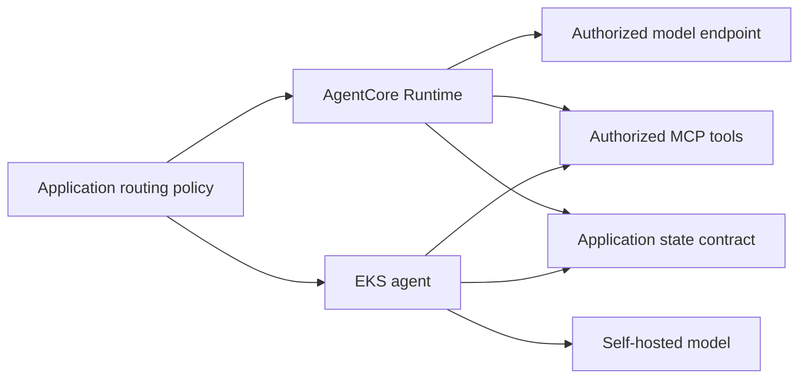
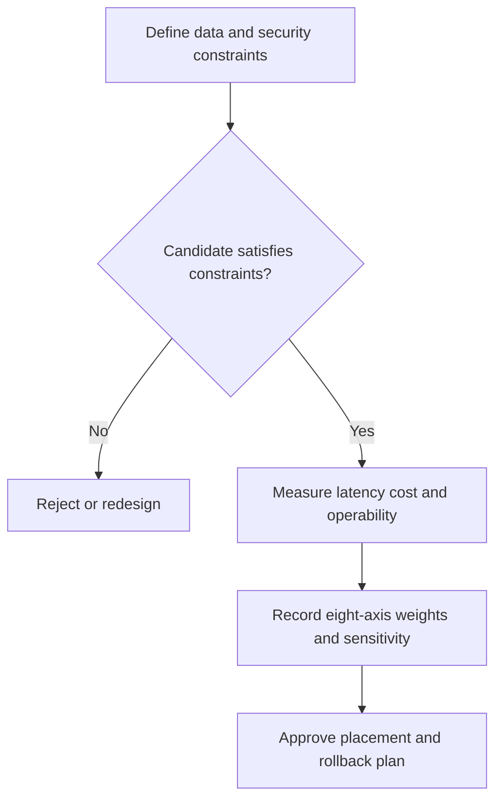
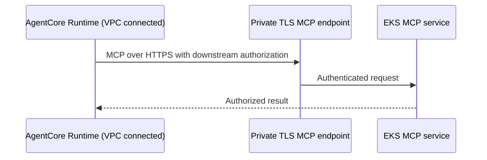

## Overview

This guide defines placement, networking, identity, and state boundaries between Amazon Bedrock AgentCore Runtime and EKS-hosted agents. AgentCore Runtime, AgentCore Gateway, and Bedrock model inference are separate capabilities and cost components.

:::caution Operator acceptance pending
Public API/design errors have been corrected; organization-specific weights, on-premises integration, IAM/STS end-to-end behavior, and migration timing remain unaccepted. This review performed no deployment or paid model invocation. Residual acceptance: [Issue #4](https://github.com/devfloor9/engineering-playbook/issues/4).
:::

## Hybrid Deployment Motivation

Choose placement using data boundaries, model control, operational capability, and total cost together.

### Single Approach Limitations

AgentCore Runtime executes agents that call model endpoints. Runtime cost is not simply the model’s token charge. Bedrock Custom Model Import and operating vLLM on EKS are separate choices. EKS also requires state, scaling, availability, and authorization operations.

### Core Value of Hybrid

The design offers placement flexibility. Cost and latency improvements require a measured baseline.


```mermaid
flowchart LR
    ROUTER[Application routing policy] --> AC[AgentCore Runtime]
    ROUTER --> EKS[EKS agent]
    AC --> MODEL[Authorized model endpoint]
    EKS --> LOCAL[Self-hosted model]
    AC --> TOOLS[Authorized MCP tools]
    EKS --> TOOLS
    AC --> STATE[Application state contract]
    EKS --> STATE
```

### Cost Break-even Calculation

Request volume alone does not determine break-even. Include input/output tokens, model/provider, Runtime vCPU/memory duration, Memory/Gateway usage, idle/warm GPU capacity, network, storage, and operations over the same window. Use public pricing and approved ledgers, recording currency, region, and pricing date. The unsupported fixed 500,000-request threshold and cost table have been removed.

## Decision Matrix: Where to Place Agents

These eight axes are an evaluation framework, not approved organizational weights. Apply mandatory data/security constraints as pass/fail first. For eligible options, use score = Σ(weight × rating), with weights summing to 1. Leave unknown ratings unknown.

| Axis | Required evidence |
|---|---|
| Inference latency | Same payload, warm/cold and network p95/p99 |
| Cost | Runtime + model + infrastructure over the same window |
| PII processing | Data flows, authorization, retention, log/embedding exposure |
| Model customization | Model/engine features and endpoint contract |
| Tool chain | MCP transport, authentication, timeout, idempotency |
| Session length | Runtime lifetime versus durable application state |
| Audit | Enabled CloudTrail/data events and application audit coverage |
| Team capability | On-call, security, GPU/deployment/recovery ownership |

### Decision Flowchart

Decide using mandatory constraints, measurement, and approval instead of fixed request counts or “PII implies EKS.” EKS alone does not guarantee sensitive-data protection.


```mermaid
flowchart TD
    A[Define data and security constraints] --> B{Candidate satisfies constraints?}
    B -->|No| C[Reject or redesign]
    B -->|Yes| D[Measure latency cost and operability]
    D --> E[Record eight-axis weights and sensitivity]
    E --> F[Approve placement and rollback plan]
```

## Data Gravity and Tool Colocation Patterns

Design data location, access paths, authorization, and agent placement together.

### What is Data Gravity?

Data gravity describes how the location of data influences where an application should run. Here, the practical question is how AgentCore Runtime reaches data inside a VPC. Runtime VPC connectivity provides access through selected subnets and security groups; the default public network mode does not automatically provide access to arbitrary private endpoints.

### Reverse Call Pattern

An internal MCP endpoint requires Runtime VPC connectivity plus actual DNS, routes, security groups, TLS, and authentication. *.svc.cluster.local is not automatically resolvable throughout a VPC. Use a VPC-reachable endpoint such as an internal load balancer. If using AgentCore Gateway, verify its target networking/authentication separately.


```mermaid
sequenceDiagram
    participant R as AgentCore Runtime (VPC connected)
    participant E as Private TLS MCP endpoint
    participant M as EKS MCP service
    R->>E: MCP over HTTPS with downstream authorization
    E->>M: Authenticated request
    M-->>R: Authorized result
```

### PrivateLink Setup

PrivateLink connects a consumer interface endpoint to a provider endpoint service; NLB Service YAML alone is insufficient. Configure allowed principals/connection acceptance, NLB listeners/targets, and TLS termination. Verify consumer endpoints, DNS, security groups, and the Runtime VPC path. An IAM endpoint permission alone creates neither TCP connectivity nor application authorization. EKS API PrivateLink and an endpoint service for a custom MCP application are different.

### S3+KMS Boundary Setup

S3 resource policies (bucket policies), role identity policies, and KMS key policies are distinct. Bucket policies have Principal; role identity policies do not. Writers need scoped s3:PutObject and kms:GenerateDataKey; multipart uploads can also require kms:Decrypt. Readers need s3:GetObject and kms:Decrypt, with the key policy/grant also allowing use.

Pin the key ARN, prefix, TLS, retention, and deletion policy. Verify denials for a wrong key, another tenant prefix, and another role. SSE-KMS headers alone do not establish the boundary. Bind object keys to a verified tenant/owner, not merely a caller-supplied session_id.

## Hand-off Pattern Catalog

These patterns are application implementation contracts, not automatic AgentCore routing or memory-replication features.

### Pattern (a): Application Router-front {#pattern-a-router-front-agentcore-gatewayself-hosted}

AgentCore Gateway exposes tools through MCP. Complexity classification and model selection for inference belong to the application router. Returning a model name does not change a deployed Runtime’s model configuration. Map approved runtime ARNs/endpoints to configured agent models or implement a validated payload contract.

### Pattern (b): Escalation (Qwen3 Self→AgentCore Reasoning)

Escalation requires validated quality rules and remaining deadline. An LLM-reported confidence is not a calibrated probability. Do not automatically repeat side-effecting tools or a started stream in another agent. Define transferred context, allowed tools, idempotency key, request_id, and response ownership.

### Pattern (c): Canonical State and Purpose-specific Projections {#pattern-c-dual-write-memory-agentcore-memoryeks-langfuse}

Langfuse is an observability store, not automatic bidirectional session replication for AgentCore Memory. Writing memory.json to S3 does not import it into AgentCore Memory. Use actual Memory APIs and explicit adapters.

Use one authoritative conversation/event log containing event_id, tenant, session owner, sequence, and schema version. Memory and Langfuse should hold derived views of that log for their respective purposes. Define how each view handles retries, duplicate events, ordering, update delays, conflicting records, and deletion propagation. Do not use traces as user conversation state without authorization.

### Pattern (d): Cost-arbitrage (High-freq=EKS, Low-freq Complex=AgentCore)

Compare cost only across paths that satisfy quality and authorization constraints. Do not collapse Runtime and model charges into one fixed token price. Include marginal path cost, ready capacity, and fallback attempts. Do not declare a cheaper route before measurement.

## IAM, Session, and Observability Integration Boundaries

The IAM caller, STS target role, Runtime execution role, and end-user OAuth identity are distinct. This example lets an EKS caller role in example account A assume RuntimeInvokerRole in account B, then **invoke B’s Runtime with B credentials**. Put real accounts, region, and ARNs in an approved manifest. The code illustrates the invocation contract and was not executed in this review.

1. A’s caller identity policy allows sts:AssumeRole on B’s exact role ARN.
2. B’s trust policy trusts A’s exact caller role. Initial EKS Pod Identity/IRSA federation trust is separate. On-premises callers use an approved federation/credential provider.
3. B’s invoker identity policy allows InvokeAgentRuntime on the selected runtime and runtime endpoint. The distinct Runtime execution role trusts bedrock-agentcore.amazonaws.com and holds required model/tool permissions. Do not distribute execution-role credentials to callers.
4. This path invokes within B after AssumeRole. Direct invocation with A’s credentials instead requires separate review of caller permissions and runtime/endpoint resource policies.

```json
[
  {
    "name": "A caller identity policy",
    "policy": {"Version": "2012-10-17", "Statement": [{
      "Effect": "Allow", "Action": "sts:AssumeRole",
      "Resource": "arn:aws:iam::444455556666:role/RuntimeInvokerRole"
    }]}
  },
  {
    "name": "B RuntimeInvokerRole trust policy",
    "policy": {"Version": "2012-10-17", "Statement": [{
      "Effect": "Allow", "Action": "sts:AssumeRole",
      "Principal": {"AWS": "arn:aws:iam::111122223333:role/EKSPodCallerRole"}
    }]}
  },
  {
    "name": "B invoker identity policy",
    "policy": {"Version": "2012-10-17", "Statement": [{
      "Effect": "Allow", "Action": "bedrock-agentcore:InvokeAgentRuntime",
      "Resource": [
        "arn:aws:bedrock-agentcore:us-east-1:444455556666:runtime/example_agent-0123456789",
        "arn:aws:bedrock-agentcore:us-east-1:444455556666:runtime/example_agent-0123456789/runtime-endpoint/DEFAULT"
      ]
    }]}
  }
]
```

```python
import json
import uuid
import boto3

REGION = "us-east-1"
ROLE_ARN = "arn:aws:iam::444455556666:role/RuntimeInvokerRole"
RUNTIME_ARN = ("arn:aws:bedrock-agentcore:us-east-1:444455556666:"
               "runtime/example_agent-0123456789")

def invoke_assumed(prompt: str, session_id: str):
    # session_id is server-owned and bound to the authenticated tenant/user.
    if not 33 <= len(session_id) <= 256:
        raise ValueError("Use a valid conversation session ID, such as a UUID")
    sts = boto3.client("sts", region_name=REGION)  # Default credential chain
    creds = sts.assume_role(
        RoleArn=ROLE_ARN,
        RoleSessionName="hybrid-invoker",
        DurationSeconds=3600,  # Chained role sessions cannot exceed one hour.
    )["Credentials"]
    client = boto3.client(
        "bedrock-agentcore", region_name=REGION,
        aws_access_key_id=creds["AccessKeyId"],
        aws_secret_access_key=creds["SecretAccessKey"],
        aws_session_token=creds["SessionToken"],
    )
    return client.invoke_agent_runtime(
        agentRuntimeArn=RUNTIME_ARN, qualifier="DEFAULT",
        runtimeSessionId=session_id, contentType="application/json",
        payload=json.dumps({"prompt": prompt}).encode("utf-8"),
    )

# Generate once for a NEW conversation; persist it under verified ownership.
new_session_id = str(uuid.uuid4())
# response = invoke_assumed("approved test input", new_session_id)
# Consume/close response["response"] according to response["contentType"].
```

The JSON wraps three named policy documents; it is not one IAM policy to submit as-is. The example obtains fresh STS credentials per call. Services should use a refreshing SDK credential provider and handle the session token and Expiration. Runtime conversation lifetime and STS credential lifetime are different. Adding a user-ID propagation header also requires reviewing InvokeAgentRuntimeForUser permissions.

### AgentCore Identity OAuth Token Propagation

The JWT issuer is the configured IdP/authorization server, not AgentCore Identity. If the Runtime inbound token’s audience differs from MCP, obtain a downstream-service token through an appropriate OAuth credential/token-exchange flow. OAuth Runtime invocation uses HTTPS Bearer authentication, separately from the SigV4 SDK example.

MCP receives Authorization Bearer over a trusted TLS path and verifies signature, issuer, audience, expiry, and scope. Do not trust arbitrary X-Forwarded-Authorization headers. This example assumes one IdP with space-delimited scopes. Middleware must map token/JWKS failures to 401, insufficient scope to 403, and enforce tenant/object permissions.

```python
import jwt
from jwt import PyJWKClient

ISSUER = "https://idp.example.com/oauth2/default"
AUDIENCE = "mcp-service"
JWKS = PyJWKClient("https://idp.example.com/oauth2/default/v1/keys")

def verify_mcp_token(token: str) -> dict:
    # Trusted configuration supplies the issuer/JWKS URL, never the token.
    key = JWKS.get_signing_key_from_jwt(token).key
    claims = jwt.decode(
        token, key, algorithms=["RS256"], audience=AUDIENCE, issuer=ISSUER,
        options={"require": ["exp", "iss", "aud", "sub"]},
    )
    scope_value = claims.get("scope", "")
    scopes = set(scope_value.split()) if isinstance(scope_value, str) else set()
    if "customer:read" not in scopes:
        raise PermissionError("Insufficient scope")
    return claims  # Caller must still enforce tenant/object authorization.
```

### CloudWatch GenAI Observability ↔ Langfuse OTel Bridge

OTel trace IDs are 16 bytes (32 hex), span IDs are 8 bytes (16 hex), and valid IDs are not all-zero. Do not use strings such as `ac-{session_id}` as trace IDs. Propagate W3C `traceparent`/`tracestate` and keep session/request identifiers in separate attributes.

Explicitly configure instrumentation, approved OTel collectors/exporters, and CloudWatch/Langfuse destinations. There is no automatic contract that CloudWatch exports spans through EventBridge to the former Lambda example. Verify parent/child correlation, sampling, duplicates, loss, and PII redaction.

## Gradual Migration Roadmap

The durations below illustrate sequencing, not calendar commitments. Advance only after exit criteria are met, with separately approved change windows, service registration, and security-review dates.

### Phase 1: AgentCore Only (0-3 months)

Define payload/response contracts, session ownership, IAM/OAuth, data boundaries, and baseline. Record model and Runtime charges separately. Advance only with static contract checks and results from authorized tests.

### Phase 2: Bedrock + Self-hosted SLM (3-6 months)

Validate the EKS path’s model capabilities, network, ready capacity, and failure policy. Compare cost and TTFT on the same dataset and quality bar. Approve traffic shares and rollback gates and record stage results.

### Phase 3: Full Hybrid Cross-routing (6-12 months)

For cross-routing, verify tenant/session isolation, state-event ordering/replay, tool deduplication, credential expiry, fallback, and trace correlation. Resolve registration/security-schedule conflicts with dependency owners and decision dates. The former fixed savings and 95% state-consistency numbers are not acceptance criteria.

## Transition Trigger Metrics

Operators retain evidence privately and publish only approved deidentified conclusions.

1. Record eight-axis weights, rating evidence, hard constraints, sensitivity analysis, and ADR approver.
2. Map DNS, routes, TLS, authentication, timeout, payload contract, and owner for each on-premises/Runtime/EKS hop.
3. Verify caller policy → STS trust → temporary credentials → Runtime permission → execution role → tool authorization end to end. Record allowed correct-role access and denial of other principals/ARNs, expired credentials, and missing session tokens.
4. OAuth must reject wrong issuer/audience/signature, expiry, insufficient scope, and cross-tenant session reuse. Keep decisions and correlation IDs, never tokens.
5. Validate canonical-state replay, deletion, partial failures, and trace parentage. Tests requiring models/tools run only within operator-approved scope.
6. Link phase exit criteria, change windows, service-registration dependencies, rollback owner, and dated acceptance. Unmeasured items remain pending.

## References

### Official Documentation

- [Amazon Bedrock AgentCore](https://docs.aws.amazon.com/bedrock-agentcore/latest/devguide/what-is-bedrock-agentcore.html) — AgentCore official developer guide
- [AgentCore Identity](https://docs.aws.amazon.com/bedrock-agentcore/latest/devguide/identity.html) — Authentication & credential guide
- [AgentCore VPC Connectivity](https://docs.aws.amazon.com/bedrock-agentcore/latest/devguide/agentcore-vpc.html) — Runtime & built-in tools VPC configuration
- [EKS PrivateLink](https://docs.aws.amazon.com/eks/latest/userguide/private-clusters.html) — VPC internal connection
- [AWS PrivateLink for Services](https://docs.aws.amazon.com/vpc/latest/privatelink/) — Service endpoints
- [InvokeAgentRuntime API](https://docs.aws.amazon.com/bedrock-agentcore/latest/APIReference/API_InvokeAgentRuntime.html) — payload, session, response
- [STS AssumeRole](https://docs.aws.amazon.com/STS/latest/APIReference/API_AssumeRole.html) — temporary credentials, trust, role chaining
- [Runtime permissions](https://docs.aws.amazon.com/bedrock-agentcore/latest/devguide/runtime-permissions.html) — caller and execution roles
- [AgentCore resource policies](https://docs.aws.amazon.com/bedrock-agentcore/latest/devguide/resource-based-policies.html) — runtime/endpoint cross-account boundaries
- [OpenTelemetry Trace API](https://opentelemetry.io/docs/specs/otel/trace/api/) — trace and span identifiers

### Papers / Technical Blogs

- [CloudWatch Generative AI Observability](https://aws.amazon.com/blogs/mt/launching-amazon-cloudwatch-generative-ai-observability-preview/) — Observability integration
- [Network Connectivity Patterns for AgentCore Runtime](https://aws.amazon.com/blogs/networking-and-content-delivery/network-connectivity-patterns-for-agents-deployed-on-amazon-bedrock-agentcore-runtime/) — Runtime VPC & PrivateLink connectivity patterns
- [Langfuse Self-Hosting Guide](https://langfuse.com/docs/deployment/self-host) — Self-hosting guide
- [Building Cost-Effective AI Systems](https://huyenchip.com/2023/04/11/llm-engineering.html) — Cost optimization

### Related Documents (Internal)

- [AWS Native Platform](./aws-native-agentic-platform.md) — AgentCore service overview
- [EKS-based Open Architecture](./agentic-ai-solutions-eks.md) — Self-hosted stack
- [Inference Platform Benchmark: AgentCore vs EKS](../../../benchmarks/agentcore-vs-eks-inference.md) — Feature/performance/cost benchmark plan
- [SageMaker-EKS Integration](../../reference-architecture/integrations/sagemaker-eks-integration.md) — VPC/IAM reference
- [Coding Tools Cost Analysis](../../reference-architecture/integrations/coding-tools-cost-analysis.md) — Break-even calculation
