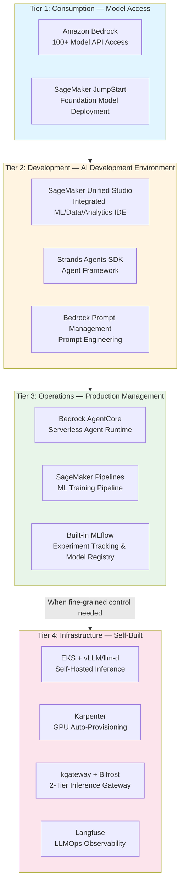
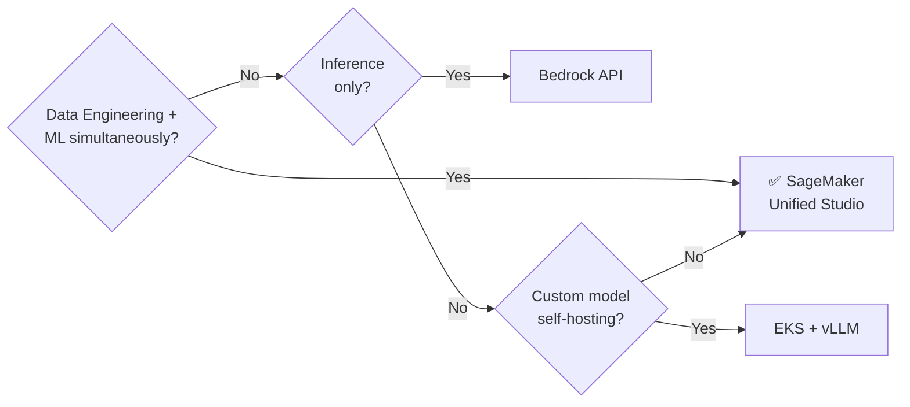
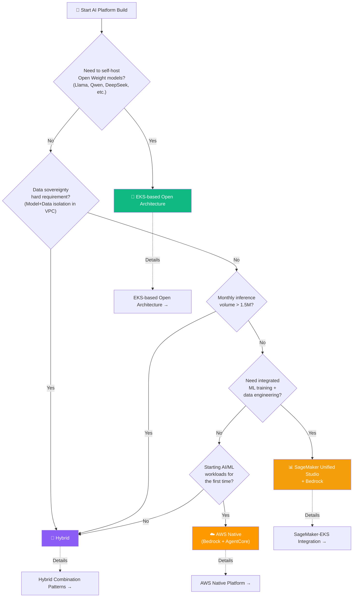
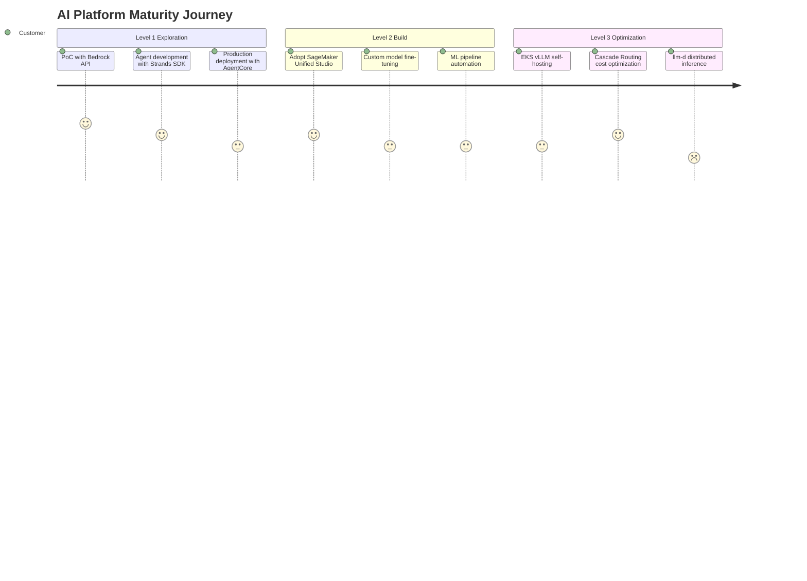
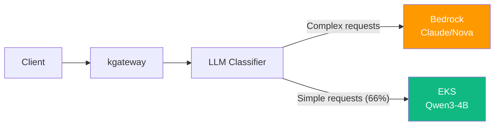
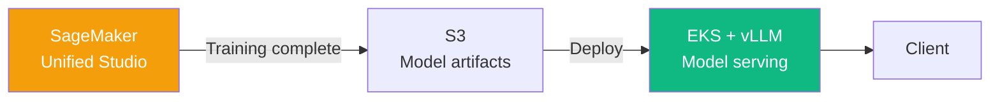
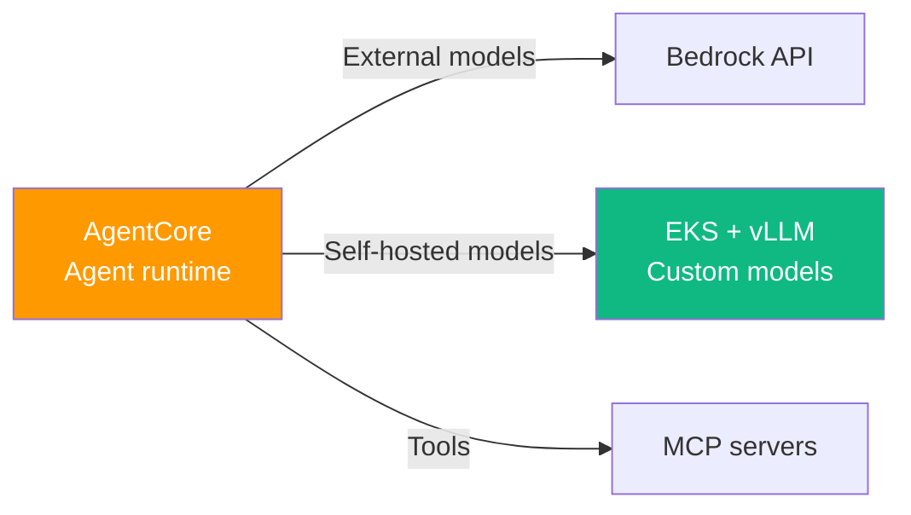

import { PlatformComparisonMatrix, MaturityPathTable, HybridPatternSummary } from '@site/src/components/DecisionFrameworkTables';

# AI Platform Selection Guide

> 📅 **Written**: 2026-04-15 | ⏱️ **Reading time**: ~15 minutes

When customers start developing AI systems, they face the fundamental question: "Should we use managed services or build with open source?" This document provides a decision framework for selecting the optimal approach among **SageMaker Unified Studio**, **Bedrock AgentCore**, and **EKS-based open architecture** based on customer circumstances.

AI platform construction paths are broadly divided into three categories:

- **(A) AWS Managed**: Start with Bedrock + Strands SDK + AgentCore with no infrastructure operations
- **(B) EKS + Open Source**: Self-host with vLLM, llm-d, Langfuse for maximum control
- **(C) Hybrid**: Combine Bedrock and EKS to balance cost, control, and speed

:::info Prerequisites
Before reading this document, refer to:
- [Platform Architecture](./agentic-platform-architecture.md) — 6-layer design blueprint
- [Technical Challenges](./agentic-ai-challenges.md) — 5 core challenge analysis
:::

---

## AWS AI Platform Service Landscape

AWS AI services are structured into 4 tiers. Customers typically start at lower tiers and progress upward based on their needs.

**Key Tier Distinctions**:
- **Tier 1-3**: AWS managed services allow you to start without infrastructure operations.
- **Tier 4**: Choose when fine-grained control, cost optimization, or data sovereignty is required.
- **Most customers start at Tier 1 and expand incrementally**, while enterprises tend to combine Tier 3 and Tier 4 in hybrid configurations.

---

## SageMaker Unified Studio

### Integrated AI Development Environment

**SageMaker Unified Studio** is an integrated AI development environment released in H2 2024, designed to perform ML/data/analytics tasks in a single IDE. Previously, teams had to use fragmented tools like SageMaker Studio Classic, Athena, and Glue Studio separately, but Unified Studio consolidates them into one platform.

### Key Differentiators

| Feature | Description | Improvement vs Previous |
|---------|-------------|------------------------|
| **Unified IDE** | JupyterLab + SQL Editor + No-code Interface | Data+ML integration vs SageMaker Studio Classic |
| **Built-in MLflow** | Experiment tracking, model registry, model comparison | No need to operate separate MLflow server |
| **Lakehouse Integration** | Apache Iceberg tables, Glue Catalog native integration | One-stop data engineering → ML pipeline |
| **Governance Collaboration** | Amazon DataZone-based IAM sharing, data lineage tracking | Secure data/model sharing between teams |
| **Unified Compute** | Manage training, notebooks, pipelines in single environment | Prevent resource fragmentation |

### Positioning: When to Choose?

:::tip Key Message
SageMaker Unified Studio is a **development environment (Tier 2)**. It has a **complementary relationship** with Bedrock (inference) or EKS (serving), and provides greatest value when data teams and ML teams need to collaborate on a single platform.
:::

---

## Platform Comparison Matrix

The optimal approach varies based on customer circumstances. Compare each platform option across 5 key evaluation dimensions.

<PlatformComparisonMatrix />

:::info Detailed Cost Analysis
For detailed cost comparison between self-hosting and Bedrock (break-even points, Cascade Routing savings), refer to [Coding Tools Cost Analysis](../reference-architecture/integrations/coding-tools-cost-analysis.md).
:::

---

## Decision Flowchart

A decision flow you can use in customer meetings. Find the optimal approach by answering key questions.

:::warning The Flowchart is a Starting Point
This flowchart is the starting point for conversation, not the final conclusion. Actual customer situations are complex, and most enterprises converge on a **hybrid approach**.
:::

---

## Recommended Path by Customer Maturity

Starting points and expansion paths vary based on the customer's current AI/ML maturity level.

<MaturityPathTable />

**Detailed Guide by Level**:
- **Level 1 (Exploration)**: → [AWS Native Platform](./aws-native-agentic-platform.md)
- **Level 2 (Build)**: → [SageMaker-EKS Integration](../reference-architecture/integrations/sagemaker-eks-integration.md)
- **Level 3 (Optimization)**: → [EKS-based Open Architecture](./agentic-ai-solutions-eks.md), [Inference Gateway](../reference-architecture/inference-gateway/routing-strategy.md)

---

## Hybrid Combination Patterns

Most enterprises converge on hybrid approaches rather than a single path. Here are 4 proven combination patterns.

<HybridPatternSummary />

### Pattern 1: Bedrock + EKS SLM (Cascade Routing)

**When to use**: When monthly inference volume exceeds 500K requests and 60-70% of requests are simple tasks (code completion, translation, summarization)

**Core value**: Maintain Bedrock API quality while reducing costs by 40-60%

**Reference**: [Inference Gateway & Cascade Routing](../reference-architecture/inference-gateway/routing-strategy.md)

---

### Pattern 2: SageMaker Training + EKS Serving

**When to use**: When training custom models and minimizing inference costs

**Core value**: SageMaker's managed training environment + EKS cost-efficient serving

**Reference**: [SageMaker-EKS Integration](../reference-architecture/integrations/sagemaker-eks-integration.md)

---

### Pattern 3: AgentCore + Self-Hosted Models

**When to use**: When operating Agent runtime serverlessly but self-hosting specific domain models

**Core value**: AgentCore's serverless operability + custom model domain accuracy

**Reference**: [AWS Native Platform](./aws-native-agentic-platform.md)

---

### Pattern 4: Full Stack (SageMaker + Bedrock + EKS)

The most complex but most flexible pattern:
- **Data & Training**: SageMaker Unified Studio + Pipelines
- **Production Inference**: Bedrock API (high-reliability tasks) + EKS vLLM (high-volume tasks)
- **Agent Runtime**: AgentCore (serverless) + Kagent (Kubernetes-native)
- **Observability**: CloudWatch (managed) + Langfuse (self-hosted)

This pattern is chosen by large enterprises to meet different requirements across teams. Due to high architectural complexity, clear operational responsibility boundaries and a service catalog are essential.

**Reference**: For technical implementation of hybrid architecture, refer to [SageMaker-EKS Integration](../reference-architecture/integrations/sagemaker-eks-integration.md).

---

## Cost Simulation Summary

Optimal options and estimated costs based on monthly inference volume.

| Monthly Inference Volume | Optimal Option | Est. Monthly Cost | Notes |
|-------------------------|----------------|-------------------|-------|
| ~100K requests | Bedrock API | ~$300-500 | No GPU management, fastest start |
| ~500K requests | Bedrock + Cascade | ~$800-1,200 | Start separating simple requests with SLM |
| ~1.5M requests | Hybrid transition point | ~$2,500-3,500 | Near self-hosting break-even |
| ~5M+ requests | EKS self-hosting | ~$3,500-5,000 | 60%+ savings with Spot + Cascade |

:::info Detailed Cost Analysis
For detailed analysis of instance costs, Spot savings rates, and Cascade Routing effects, refer to [Coding Tools Cost Analysis](../reference-architecture/integrations/coding-tools-cost-analysis.md).
:::

---

## Customer Discovery Checklist

10 key questions to identify the optimal approach in customer meetings.

1. **Are you currently operating AI/ML workloads?** *→ Determine maturity level*
2. **What is your monthly inference request volume?** *→ Cost optimization path*
3. **Do you need to self-host Open Weight models?** *→ EKS necessity*
4. **Do you have data sovereignty or VPC isolation requirements?** *→ Self-hosting/hybrid*
5. **Does your team have Kubernetes operations experience?** *→ Assess operational burden*
6. **Do you perform ML training and data engineering together?** *→ SageMaker Unified Studio*
7. **What is your monthly budget range?** *→ Cost structure matching*
8. **When is your target production deployment date?** *→ Time-to-value path*
9. **Do you have multi-cloud or on-premises hybrid requirements?** *→ EKS Hybrid Nodes*
10. **What AWS services are you currently using?** *→ Leverage existing investments*

---

## Related Documents

### Design & Architecture
- [Platform Architecture](./agentic-platform-architecture.md) — 6-layer design blueprint
- [Technical Challenges](./agentic-ai-challenges.md) — 5 core challenge analysis
- [AWS Native Platform](./aws-native-agentic-platform.md) — Bedrock + Strands SDK + AgentCore details
- [EKS-based Open Architecture](./agentic-ai-solutions-eks.md) — EKS Auto Mode + open source stack details
- [Inference Gateway & Cascade Routing](../reference-architecture/inference-gateway/routing-strategy.md) — 2-Tier Gateway architecture

### Reference Architecture
- [SageMaker-EKS Integration](../reference-architecture/integrations/sagemaker-eks-integration.md) — Hybrid ML pipeline implementation
- [Coding Tools Cost Analysis](../reference-architecture/integrations/coding-tools-cost-analysis.md) — Bedrock vs self-hosting break-even analysis
- [Custom Model Deployment](../reference-architecture/model-lifecycle/custom-model-deployment.md) — vLLM deployment practical guide
