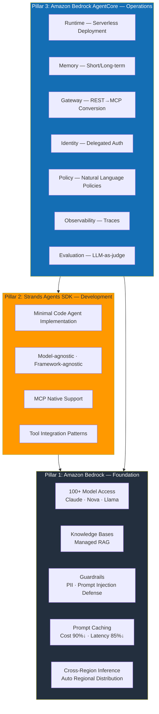
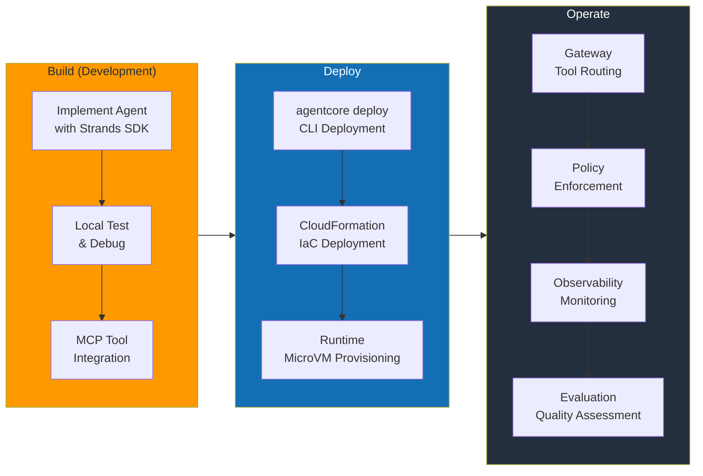
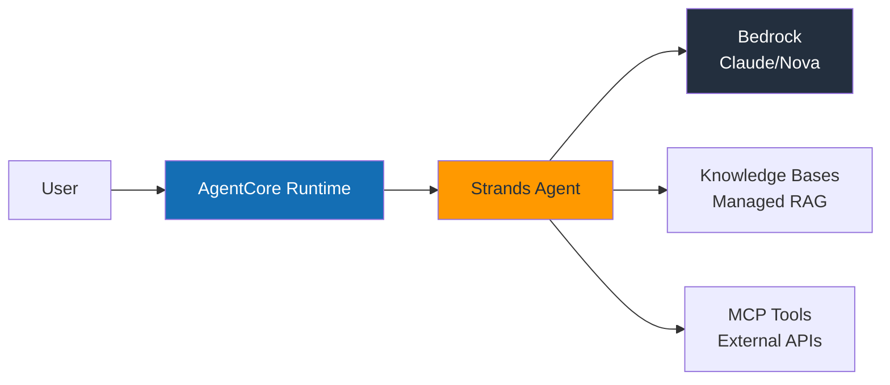
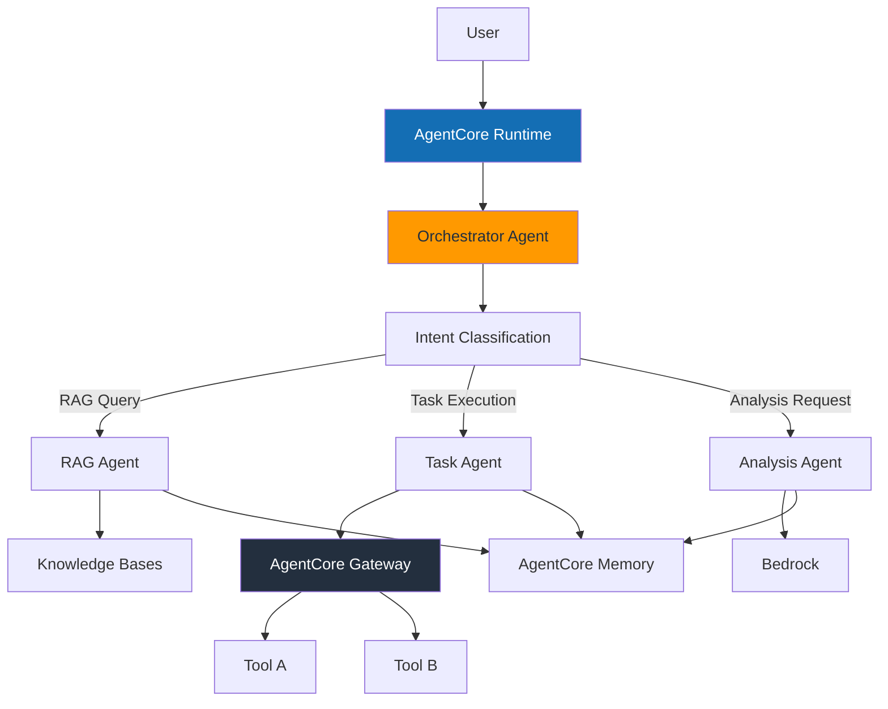
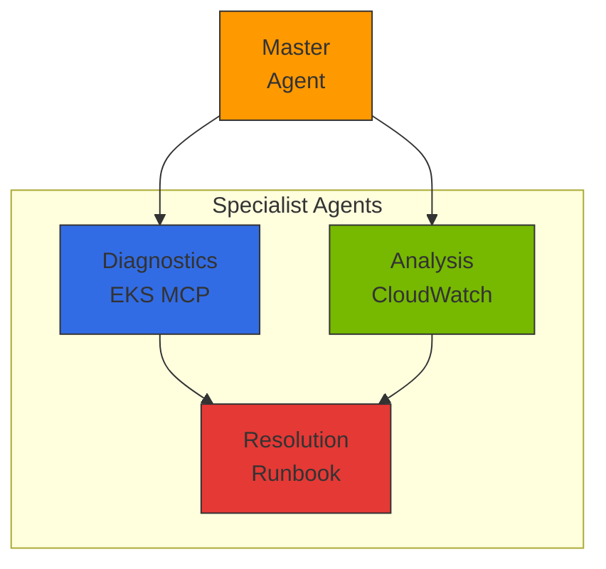

import { EKSMCPFeatures, KagentVsAgentCore, MultiAgentPatterns, MCPServerEcosystem } from '@site/src/components/BedrockMcpTables';

# AWS Native Agentic AI Platform

> **Written**: 2026-03-18 | **Updated**: 2026-03-20 | **Status**: Draft

## Overview

By leveraging AWS managed services, you can **focus on agent business logic rather than infrastructure operations**. AWS handles GPU management, scaling, availability, and security, while your development team invests its efforts solely on the problems agents need to solve.

The AWS Agentic AI stack consists of three pillars.

| Pillar | Service | Role |
|--------|---------|------|
| **Foundation** | Amazon Bedrock | Model access, RAG, guardrails, prompt caching |
| **Development** | Strands Agents SDK | Agent framework, MCP native, tool integration |
| **Operations** | Amazon Bedrock AgentCore | Serverless deployment, memory, gateway, policy, evaluation |

:::info Key Perspective
This document covers the **agent development optimization approach** provided by AWS managed services. The strategy is to delegate areas where managed services are sufficient to AWS, focusing team capabilities on agent business logic. However, this approach is the **first step** in a multi-model journey. When cost pressure from traffic growth, need for domain-specific SLMs, or data sovereignty requirements arise, the realistic optimum is to expand to [EKS-Based Open Architecture](./agentic-ai-solutions-eks.md) and **combine self-hosted models with Bedrock in a hybrid approach**.
:::

### Challenge Resolution Mapping

How the 5 key challenges covered in [Technical Challenges](../foundations/agentic-ai-challenges.md) are addressed with the AWS Native approach:

| Challenge | AWS Native Solution |
|-----------|-------------------|
| GPU resource management and cost optimization | Bedrock serverless inference — no GPU management required |
| Intelligent inference routing and gateway | Bedrock Cross-Region Inference + AgentCore Gateway |
| LLMOps observability and cost governance | AgentCore Observability + CloudWatch |
| Agent orchestration and safety | Strands SDK + Bedrock Guardrails + AgentCore Policy |
| Model supply chain management | Bedrock Model Evaluation + Prompt Management |

:::tip Core Value of AWS Native
Since AWS handles GPU infrastructure management, scaling, availability, and security, teams can focus solely on agent business logic. For more fine-grained control, it can be combined with [EKS-Based Open Architecture](./agentic-ai-solutions-eks.md).
:::

---

## AWS Agentic AI Service Architecture

### 3-Pillar Architecture



---

## Amazon Bedrock: Foundation Layer

Amazon Bedrock provides the **foundational infrastructure** for the Agentic AI Platform. It offers single API access to over 100 foundation models, with managed support for RAG, guardrails, and prompt caching.

### Key Features

| Feature | Description | Core Value |
|---------|-------------|-----------|
| **Model Access** | 100+ models: Claude, Nova, Llama, Mistral, etc. | Single API, no code changes for model switching |
| **Knowledge Bases** | Document parsing → chunking → embedding → indexing → search | One-click RAG pipeline, completed with just S3 upload |
| **Guardrails** | PII filtering, prompt injection defense, topic restrictions | Policy configuration in console, no code changes |
| **Prompt Caching** | Caching of repeated contexts | Up to 90% cost reduction, up to 85% latency reduction |
| **Cross-Region Inference** | Automatic cross-region traffic distribution | Auto-fallback on capacity limits, improved availability |
| **Prompt Management** | Prompt version control, A/B testing | Prompt history tracking, rollback support |
| **Model Evaluation** | Automated model evaluation, batch processing | LLM-as-a-judge, human evaluation workflows |

:::tip Prompt Caching Usage
Agents with long system prompts or repetitive tool definitions can significantly reduce cost and latency by enabling Prompt Caching. It is especially effective for patterns where RAG context is frequently repeated.
:::

---

## Strands Agents SDK: Development Framework

**Strands Agents SDK** is an open-source agent framework released by AWS under Apache 2.0. It implements production-grade agents with minimal code and supports various model providers beyond Bedrock through its model-agnostic design.

### Minimal Code Agent Implementation

```python
from strands import Agent
from strands.models import BedrockModel

# Basic Agent — completed in 3 lines
agent = Agent(
    model=BedrockModel(model_id="anthropic.claude-sonnet-4-20250514"),
    tools=["calculator", "web_search"],
)
result = agent("Convert the current temperature in Seoul to Celsius and Fahrenheit")
```

### MCP Native Support

```python
from strands import Agent
from strands.tools.mcp import MCPClient

# MCP server connection — auto-discovers external tools and integrates with agent
mcp_client = MCPClient(server_url="http://mcp-server:8080")

agent = Agent(
    model=BedrockModel(model_id="anthropic.claude-sonnet-4-20250514"),
    tools=[mcp_client],  # Automatic MCP tool discovery and registration
)
result = agent("Look up recent order history and check delivery status")
```

### Custom Tool Definition

```python
from strands import Agent, tool

@tool
def lookup_customer(customer_id: str) -> dict:
    """Looks up customer information."""
    # Business logic implementation
    return {"name": "John Doe", "tier": "GOLD", "since": "2023-01"}

@tool
def create_ticket(title: str, priority: str, description: str) -> dict:
    """Creates a customer inquiry ticket."""
    return {"ticket_id": "TK-2026-0042", "status": "OPEN"}

agent = Agent(
    model=BedrockModel(model_id="anthropic.claude-sonnet-4-20250514"),
    tools=[lookup_customer, create_ticket],
    system_prompt="You are a customer service agent. Look up customer information and create tickets when needed.",
)
```

### Strands SDK Key Characteristics

| Characteristic | Description |
|---------------|-------------|
| **Apache 2.0** | Free for commercial use, forkable |
| **Model-agnostic** | Supports various backends: Bedrock, OpenAI, Anthropic API, Ollama, etc. |
| **Framework-agnostic** | Runs on any runtime: FastAPI, Flask, Lambda, etc. |
| **MCP Native** | Built-in Model Context Protocol support, no separate adapter needed |
| **AgentCore Integration** | Production deployment with single `agentcore deploy` command |
| **Streaming Responses** | Per-token streaming, real-time UX support |

---

## Amazon Bedrock AgentCore: Operations Platform

AgentCore is a platform that provides **everything needed for production agent operations** as a managed service. Released as GA in 2025, it consists of 7 core services.

### 7 Core Services

#### 1. Runtime — Serverless Agent Deployment

AgentCore Runtime provides an isolated execution environment based on **Firecracker MicroVM**.

| Item | Specification |
|------|--------------|
| Isolation Level | Firecracker MicroVM (hardware-level isolation) |
| Session Duration | Up to 8 hours continuous session |
| Scaling | Auto-scale from 0, scale to 0 when idle |
| Deployment | `agentcore deploy` CLI or CloudFormation |
| Cold Start | Within seconds |

```bash
# Deploy a Strands Agent to AgentCore
agentcore deploy \
  --agent-name "customer-service" \
  --entry-point "agent.py" \
  --runtime python3.12 \
  --memory 512 \
  --timeout 3600
```

#### 2. Memory — Short/Long-term Memory Management

A managed memory service that enables agents to remember conversation context and user preferences.

| Memory Type | Description | Usage Example |
|------------|-------------|---------------|
| **Short-term Memory** | In-session conversation history | Referencing previous questions in multi-turn conversations |
| **Long-term Memory** | Persistent cross-session information | User preferences, past interaction patterns |
| **Auto-summarization** | Automatically summarizes long conversations | Retaining key information when context window is exceeded |
| **User Profiles** | Personalization learning | "This user prefers concise answers" |

#### 3. Gateway — Intelligent Tool Routing

AgentCore Gateway **automatically converts REST APIs to MCP protocol** and uses semantic tool search to select only relevant tools from hundreds of registered tools.

:::info Semantic Tool Search
Even with 300 tools registered, the Gateway analyzes the user request and delivers only the 4 relevant tools to the agent. This saves LLM context window and improves tool selection accuracy.
:::

| Feature | Description |
|---------|-------------|
| **REST → MCP Conversion** | Automatically wraps existing REST APIs as MCP tools |
| **Semantic Search** | 300 tools → 4 relevant auto-filtered |
| **Tool Registry** | Centralized tool registration and version management |
| **Auth Propagation** | Safely propagates user authentication to tools |

#### 4. Identity — Delegated Authentication

| Feature | Description |
|---------|-------------|
| **IdP Integration** | Okta, Amazon Cognito, OIDC-compatible providers |
| **Delegated Auth** | Agent authenticates to tools on behalf of the user (OAuth 2.0 token exchange) |
| **Fine-grained Permissions** | Per-tool, per-resource access control |
| **Audit Logs** | All authentication events recorded in CloudTrail |

#### 5. Policy — Natural Language Policy Definition

Policies defined in natural language are **compiled into deterministic runtimes** to ensure consistent policy enforcement.

```text
# Natural language policy examples
Policy: "Only allow refund processing for Gold tier and above customers"
→ Compiled → Executed by deterministic rule engine (no LLM calls)

Policy: "PII must be masked when calling external APIs"
→ Compiled → Automatically applied at Gateway level
```

| Characteristic | Description |
|---------------|-------------|
| **Natural Language Input** | Non-developers can define policies |
| **Deterministic Execution** | Compiled policies are applied deterministically without LLM |
| **Real-time Enforcement** | Policy verification on every request at runtime |
| **Audit Trail** | Complete history of policy application/rejection |

#### 6. Observability — Integrated Monitoring

| Feature | Description |
|---------|-------------|
| **CloudWatch Integration** | Automatic collection of metrics, logs, and alarms |
| **OpenTelemetry** | Standard instrumentation compatible with existing monitoring tools |
| **Per-step Traces** | Full tracking from agent reasoning → tool calls → responses |
| **Cost Dashboard** | Per-model, per-agent, per-session cost visualization |

#### 7. Evaluation — Continuous Quality Monitoring

| Feature | Description |
|---------|-------------|
| **LLM-as-judge** | LLM automatically evaluates agent response quality |
| **13 Evaluation Criteria** | Accuracy, relevance, harmfulness, consistency, etc. |
| **A/B Testing** | Quantitative measurement of quality impact from prompt/model changes |
| **Continuous Monitoring** | Real-time quality tracking on production traffic |
| **Human Evaluation Workflows** | Parallel automated and expert evaluation |

---

## Architecture Patterns

### Build → Deploy → Operate Workflow



### Simple Agent Pattern

Suitable for agents performing single tasks such as FAQ, billing lookup, and status checks.



### Complex Agent Pattern (Multi-step)



### Multi-Agent Pattern

```python
from strands import Agent
from strands.models import BedrockModel
from strands.multiagent import MultiAgentOrchestrator

research_agent = Agent(
    model=BedrockModel(model_id="anthropic.claude-sonnet-4-20250514"),
    system_prompt="You are a research specialist.",
    tools=["web_search", "document_reader"],
)

analysis_agent = Agent(
    model=BedrockModel(model_id="anthropic.claude-sonnet-4-20250514"),
    system_prompt="You are a data analysis specialist.",
    tools=["calculator", "chart_generator"],
)

writer_agent = Agent(
    model=BedrockModel(model_id="anthropic.claude-sonnet-4-20250514"),
    system_prompt="You are a report writing specialist.",
    tools=["document_writer"],
)

orchestrator = MultiAgentOrchestrator(
    agents=[research_agent, analysis_agent, writer_agent],
    strategy="sequential",
)
result = orchestrator("Write a Q1 2026 market trends report")
```

---

## Deployment Guide

### Deployment Methods Overview

| Approach | Tool | Suitable Scenario |
|----------|------|------------------|
| **CLI Deployment** | `agentcore deploy` | Quick prototyping, single agent deployment |
| **IaC Deployment** | CloudFormation / CDK | Production environments, reproducible infrastructure |
| **Full-stack Template** | FAST Templates | Full stack (Agent + API + UI) bootstrap |

### CloudFormation IaC Pattern

```yaml
Resources:
  CustomerServiceAgent:
    Type: AWS::Bedrock::AgentCoreEndpoint
    Properties:
      AgentName: customer-service
      Runtime: python3.12
      EntryPoint: agent.py:handler
      Environment:
        Variables:
          MODEL_ID: anthropic.claude-sonnet-4-20250514
          KNOWLEDGE_BASE_ID: !Ref KnowledgeBase

  KnowledgeBase:
    Type: AWS::Bedrock::KnowledgeBase
    Properties:
      Name: customer-faq
      StorageConfiguration:
        Type: OPENSEARCH_SERVERLESS
```

:::info Production Deployment Guide
For detailed kubectl/helm commands, complete YAML manifests, and Python boto3 deployment scripts, see the [Reference Architecture](../../reference-architecture/) section.
:::

---

## Enterprise Use Cases

### Baemin (Woowa Brothers): RAG-based Knowledge Agent

| Item | Details |
|------|---------|
| **Challenge** | Reducing knowledge search time for customer service agents |
| **Architecture** | Strands Agent + Bedrock Knowledge Bases + Claude |
| **Results** | **30% improvement** in consultation efficiency, 90% reduction in policy search time |
| **Key Value** | Completed knowledge agent with just S3 document upload, without building a RAG pipeline |

### CJ OnStyle: Multi-Agent Live Commerce

| Item | Details |
|------|---------|
| **Challenge** | Automating real-time customer Q&A during live broadcasts |
| **Architecture** | Multi-agent (Product Info Agent + Order Agent + Recommendation Agent) |
| **Results** | **3x improvement** in customer response rate, real-time processing latency under 2 seconds |
| **Key Value** | AgentCore Runtime auto-scaling handled live broadcast traffic surges |

### Amazon Devices: Manufacturing Agent

| Item | Details |
|------|---------|
| **Challenge** | Automating quality inspection model fine-tuning for manufacturing lines |
| **Architecture** | Strands Agent + Bedrock Fine-tuning + AgentCore |
| **Results** | Fine-tuning time reduced from **days to 1 hour** |
| **Key Value** | Agent auto-orchestrated data preprocessing → fine-tuning → evaluation |

---

## Cost Structure

### Billing Model

| Service | Billing Basis | Characteristics |
|---------|--------------|----------------|
| **Bedrock Inference** | Input/output token count | On-demand or provisioned throughput options |
| **AgentCore Runtime** | Session time + memory usage | $0 when idle, up to 8-hour sessions |
| **Knowledge Bases** | Storage + query count | OpenSearch Serverless based |
| **Guardrails** | Processed text units | Billed separately for input/output |
| **Prompt Caching** | 90% discount on cache hits | Greater savings with more repeated patterns |

:::info Cost Optimization Tips
- **Prompt Caching**: Must enable for agents with long system prompts
- **Provisioned Throughput**: Up to 50% savings vs on-demand for stable traffic
- **Cross-Region Inference**: Prevents throttling with auto-fallback when regional capacity is limited
- **Batch Inference**: Use batch mode for evaluation/analysis tasks that don't require real-time processing
:::

---

## MCP Protocol and EKS Integration

### MCP (Model Context Protocol) Overview

MCP is a **standard communication protocol** between AI agents and tools:

- **Tool Discovery**: Agents dynamically discover available tools
- **Context Passing**: Execution context and state passed in standardized format
- **Result Return**: Tool execution results returned in structured format
- **Inter-Agent Communication**: Multi-agent collaboration via A2A protocol

### EKS MCP Server Integration

<EKSMCPFeatures />

### Hybrid Strategy with Self-hosted Agents

<KagentVsAgentCore />

**Hybrid Approach**: Route high-frequency, cost-sensitive calls to EKS self-hosted agents, and low-frequency calls requiring complex reasoning to Bedrock AgentCore.

### Multi-Agent Orchestration

<MultiAgentPatterns />



### AWS MCP Server Ecosystem

<MCPServerEcosystem />

### CloudWatch Gen AI Observability Integration

:::tip CloudWatch Gen AI Observability GA
CloudWatch Generative AI Observability became **GA in October 2025**. Natively integrated with AgentCore, agent invocations, tool executions, and token usage are automatically recorded in CloudWatch without additional configuration.
:::

- **Agent Execution Tracing**: End-to-end tracing for full inference flow visibility
- **Tool Call Monitoring**: Per-MCP-server call count, latency, and error rate tracking
- **Token Consumption Analysis**: Per-model input/output token usage and cost tracking
- **Anomaly Detection**: Automatic detection of abnormal patterns via CloudWatch Anomaly Detection

---

## Next Steps

- For EKS-based open-source architecture → [EKS-Based Open Architecture](./agentic-ai-solutions-eks.md)
- For overall platform design → [Platform Architecture](../foundations/agentic-platform-architecture.md)

## References

- [Amazon Bedrock AgentCore Documentation](https://docs.aws.amazon.com/bedrock/latest/userguide/agents.html)
- [AWS MCP Servers (GitHub)](https://github.com/awslabs/mcp)
- [Model Context Protocol Specification](https://modelcontextprotocol.io/)
- [CloudWatch Generative AI Observability](https://aws.amazon.com/blogs/mt/launching-amazon-cloudwatch-generative-ai-observability-preview/)
- [CNS421: Streamline EKS Operations with Agentic AI (re:Invent 2025)](https://www.youtube.com/watch?v=4s-a0jY4kSE)
