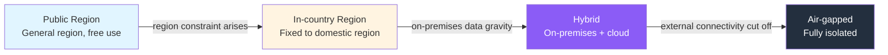
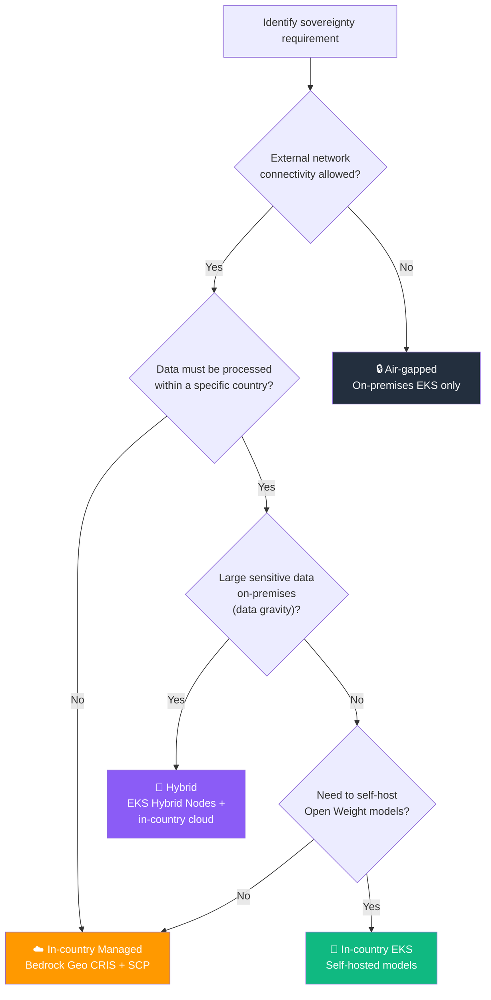
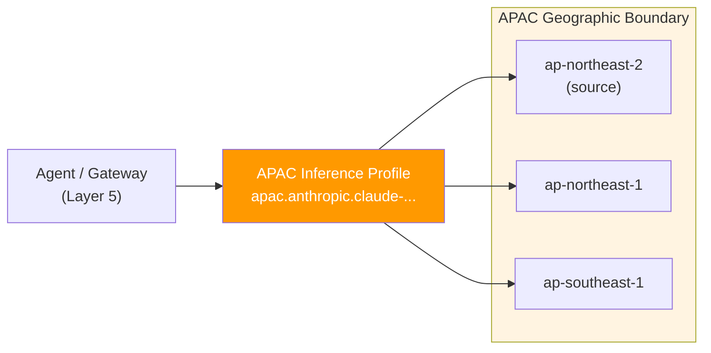
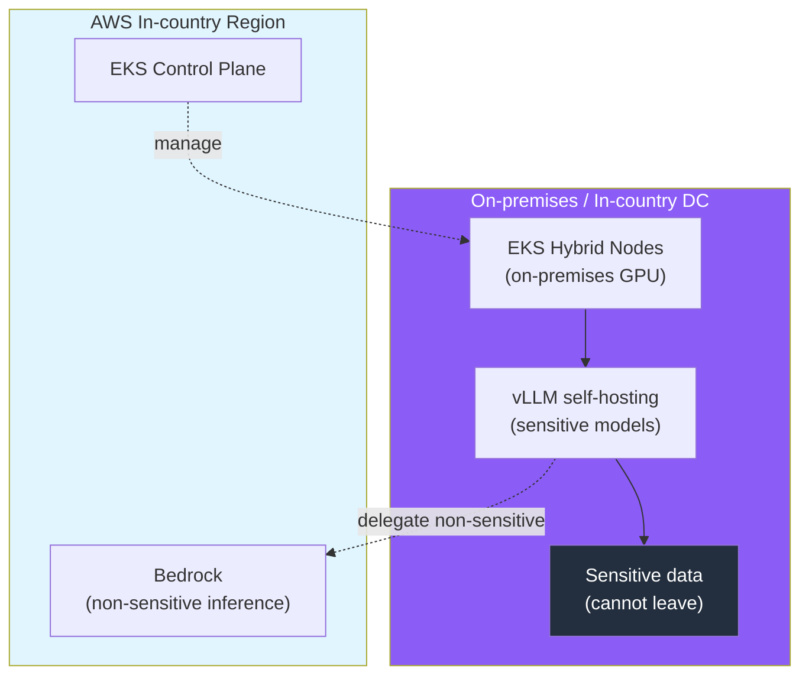

import { SovereigntySpectrum } from '@site/src/components/DecisionFrameworkTables';

## Overview

When adopting Agentic AI in regulated industries such as finance, public sector, healthcare, and autonomous driving, the strongest constraint is **data sovereignty**. The requirement that inference inputs/outputs, training data, and model weights must not leave a specific country or geographic boundary acts as a hard constraint. This document provides a decision framework for which combination of **AWS Native, EKS self-hosting, and hybrid** meets data sovereignty requirements, and summarizes implementation patterns based on **SCP region enforcement**, **Bedrock Geographic cross-Region inference**, and **EKS Hybrid Nodes**.

:::info Prerequisites
Before reading this document, refer to the following:
- [Platform Architecture](../foundations/agentic-platform-architecture.md) — Governance, Safety & Sovereignty plane
- [AI Platform Selection Guide](./ai-platform-decision-framework.md) — Managed vs open source decision
- [EKS-Based Open Architecture](./agentic-ai-solutions-eks.md) — Self-hosted stack, EKS Hybrid Nodes
:::

---

## The Data Sovereignty Spectrum

Data sovereignty requirements are not a single criterion but a **continuous spectrum**. The stronger the requirement, the lower the dependency on managed services and the larger the share of self-hosting/on-premises.

<SovereigntySpectrum />



| Level | Data Boundary | Recommended Approach | Representative Case |
|-------|---------------|---------------------|---------------------|
| **Public** | No region constraint | AWS Native (Bedrock + AgentCore) | General SaaS, internal productivity tools |
| **In-country** | Processing/storage within domestic region | Bedrock Geographic CRIS + SCP region enforcement | Domestic finance, public cloud |
| **Hybrid** | On-premises + in-country cloud | EKS Hybrid Nodes + self-hosted models | Manufacturing/autonomous driving with high data gravity |
| **Air-gapped** | External network fully cut off | On-premises EKS + dedicated self-hosting | Defense, classified research |

:::tip Most converge on In-country or Hybrid
Fully air-gapped is rare; in practice, **fixing to an in-country region + self-hosting only sensitive workloads on-premises** (Hybrid) is the most common solution. Organizations handling large, highly sensitive data such as autonomous driving vision data keep on-premises GPUs due to data gravity and combine general inference with in-country Bedrock/EKS.
:::

---

## Decision Flowchart



---

## Means 1: SCP-based Region Enforcement

The most basic technical control for data sovereignty is **blocking AWS API calls from unapproved regions at the organization level**. It is implemented with AWS Organizations Service Control Policies (SCP) and acts as a guardrail above individual IAM policies.

### Region Deny SCP Pattern

The key is to apply a `Deny` effect with an `aws:RequestedRegion` condition, while **excepting global services (IAM, Organizations, CloudFront, Route 53, etc.) that have no region concept via `NotAction`**. Without the exception, even global service calls are blocked and the account cannot function normally.

```json
{
    "Version": "2012-10-17",
    "Statement": [
        {
            "Sid": "DenyOutsideApprovedRegions",
            "Effect": "Deny",
            "NotAction": [
                "iam:*",
                "organizations:*",
                "kms:*",
                "cloudfront:*",
                "route53:*",
                "sts:*",
                "support:*",
                "globalaccelerator:*",
                "budgets:*",
                "ce:*",
                "health:*",
                "ec2:DescribeRegions"
            ],
            "Resource": "*",
            "Condition": {
                "StringNotEquals": {
                    "aws:RequestedRegion": [
                        "ap-northeast-2",
                        "ap-northeast-1"
                    ]
                },
                "ArnNotLike": {
                    "aws:PrincipalARN": [
                        "arn:aws:iam::*:role/RegionBypassBreakGlassRole"
                    ]
                }
            }
        }
    ]
}
```

| Element | Role |
|---------|------|
| `Effect: Deny` + `aws:RequestedRegion` | Deny all requests outside approved regions (`ap-northeast-2`, etc.) |
| `NotAction` (global services) | Except region-agnostic services such as IAM·Organizations·KMS·CloudFront |
| `ArnNotLike` (break-glass) | Designate one exception role for emergency operations (audit trail required) |

:::warning Watch for SCP and cross-Region inference conflicts when using Bedrock
When using Bedrock Geographic cross-Region inference, allowing only the source region causes inference to **fail**. You must **include all destination regions that the inference profile routes to in the SCP allow list**. For example, if an `apac` profile routes to `ap-northeast-1`, `ap-northeast-2`, and `ap-southeast-1`, all three regions must be allowed.
:::

### Control Tower Region Deny Control

Organizations using AWS Control Tower can achieve the same effect declaratively by enabling the **Region deny control** (at the landing zone level) instead of writing SCPs directly. The global service exception list is predefined, making maintenance simpler.

---

## Means 2: Bedrock Geographic Cross-Region Inference

To maintain data residency while using managed models (Bedrock), use **Geographic cross-Region inference (CRIS)**. It distributes requests only across **regions within a designated geographic boundary (US, EU, APAC, etc.)** rather than a single region, increasing throughput while ensuring data does not leave the geographic boundary.



| Characteristic | Description |
|----------------|-------------|
| **Data boundary** | Routes only to regions within a geography (US/EU/APAC), no movement outside the boundary |
| **Throughput** | Absorbs burst traffic vs single region, mitigates throttling |
| **Transit encryption** | Inter-region traffic is encrypted over Amazon's secure network |
| **IAM requirement** | Requires foundation model access in source region + all destination regions |

:::info IAM and SCP must both be configured
Geographic CRIS requires `bedrock:InvokeModel` permissions for ① the inference profile ARN, ② the foundation model in the source region, and ③ **the foundation model in all destination regions**. If your organization has a region deny SCP, the destination regions must also be allowed. (See the [Means 1](#means-1-scp-based-region-enforcement) warning above.)
:::

---

## Means 3: EKS Hybrid Nodes-based Hybrid/Self-hosting

When data gravity is high (large vision/log data) or even an in-country region is not permitted, **incorporate GPUs from on-premises or in-country data centers into the EKS cluster** with EKS Hybrid Nodes for self-hosting. The control plane stays in an AWS region while the data plane (GPU nodes) stays on-premises, maintaining a single Kubernetes operating model.



| Component | Placement | Reason |
|-----------|-----------|--------|
| EKS Control Plane | AWS in-country region | Managed operations, patching/HA delegated |
| GPU data plane | On-premises (Hybrid Nodes) | Prevent sensitive data egress, data gravity |
| Sensitive model inference | On-premises vLLM | Inputs/outputs do not leave the boundary |
| Non-sensitive inference | In-country Bedrock | Reduce operational burden, Cascade delegation |

**Autonomous driving vision data scenario**: Vehicle camera raw data is large and sensitive, so it is fixed on-premises. Annotation/preprocessing inference is handled on-premises GPUs (Hybrid Nodes) with self-hosted models, while only non-sensitive tasks such as general text summarization and reporting are delegated to managed services in an in-country region, reducing cost and operational burden.

:::info EKS Hybrid Nodes Details
For EKS Hybrid Nodes configuration, on-premises GPU incorporation, and networking requirements, see [EKS-Based Open Architecture](./agentic-ai-solutions-eks.md).
:::

---

## Recommended Configuration Summary by Sovereignty Level

| Sovereignty Level | Inference | Data·Models | Region Control | Key Means |
|-------------------|-----------|-------------|----------------|-----------|
| **Public** | Bedrock (global/geo CRIS) | No region constraint | Optional | AWS Native |
| **In-country (Managed)** | Bedrock Geographic CRIS | In-country region | SCP region enforcement | Means 1 + 2 |
| **In-country (Self-hosted)** | In-country EKS + vLLM | In-country region | SCP region enforcement | Means 1 + 3 |
| **Hybrid** | On-premises vLLM + in-country Bedrock | On-premises + region | SCP + network isolation | Means 1 + 2 + 3 |
| **Air-gapped** | On-premises EKS only | On-premises only | Physical/network isolation | Means 3 (external connectivity cut off) |

---

## Compliance Mapping

Data sovereignty means connect directly to regulatory requirements.

| Regulation | Key Requirement | Corresponding Means |
|------------|-----------------|---------------------|
| **e-Finance Supervisory Regulation (Korea)** | Domestic data processing/storage | SCP in-country region enforcement, self-hosting |
| **ISMS-P** | Data location/access control, audit trail | SCP + CloudTrail, RBAC |
| **GDPR (EU)** | Personal data processing within the EU | Bedrock EU Geographic CRIS |
| **Personal Information Protection Act (Korea)** | Cross-border transfer restriction | Region deny SCP, on-premises isolation |

:::info Compliance Details
For SOC2·ISMS-P control items and their mapping to platform components, see [Compliance Framework](../../operations-mlops/governance/compliance-framework.md).
:::

---

## Conclusion

Data sovereignty is not a single switch but a spectrum from Public → In-country → Hybrid → Air-gapped, and each level is met by combining SCP region enforcement, Bedrock Geographic cross-Region inference, and EKS Hybrid Nodes self-hosting. Most regulated-industry organizations converge on **fixing to an in-country region + self-hosting sensitive workloads on-premises** (Hybrid), delegating non-sensitive tasks to managed services to optimize cost and operational burden. Sovereignty controls are enforced across all platform layers from the governance plane.

---

## References

### Official Documentation

- [Service Control Policies (SCP)](https://docs.aws.amazon.com/organizations/latest/userguide/orgs_manage_policies_scps.html) — AWS Organizations SCP guide
- [Region deny control - AWS Control Tower](https://docs.aws.amazon.com/controltower/latest/controlreference/primary-region-deny-policy.html) — Region deny control SCP
- [Geographic cross-Region inference - Amazon Bedrock](https://docs.aws.amazon.com/bedrock/latest/userguide/geographic-cross-region-inference.html) — Geographic boundary inference, IAM·SCP requirements
- [Restrict data transfers across AWS Regions](https://docs.aws.amazon.com/prescriptive-guidance/latest/privacy-reference-architecture/restrict-data-transfers-across-regions.html) — Sample SCP for restricting inter-region data transfers

### Papers / Technical Blogs

- [AWS Well-Architected Generative AI Lens](https://docs.aws.amazon.com/wellarchitected/latest/generative-ai-lens/generative-ai-lens.html) — Generative AI design principles, data governance
- [Data Residency and Hybrid Cloud Lens](https://docs.aws.amazon.com/wellarchitected/latest/financial-services-industry-lens/data-residency.html) — Data residency design
- [Amazon EKS Hybrid Nodes](https://docs.aws.amazon.com/eks/latest/userguide/hybrid-nodes-overview.html) — Incorporating on-premises nodes

### Related Documents (Internal)

- [Platform Architecture](../foundations/agentic-platform-architecture.md) — Governance, Safety & Sovereignty plane
- [AI Platform Selection Guide](./ai-platform-decision-framework.md) — Managed vs open source vs hybrid
- [EKS-Based Open Architecture](./agentic-ai-solutions-eks.md) — EKS Hybrid Nodes self-hosting
- [Compliance Framework](../../operations-mlops/governance/compliance-framework.md) — SOC2·ISMS-P mapping
