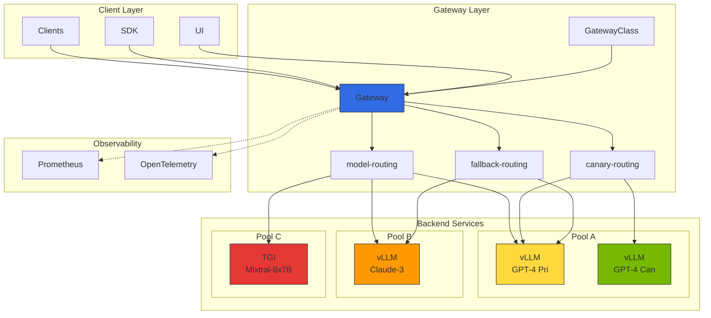
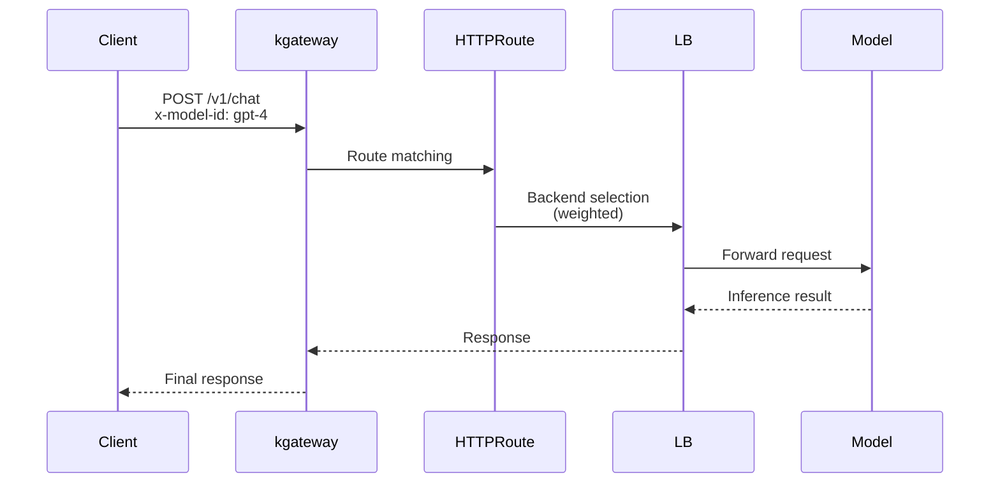
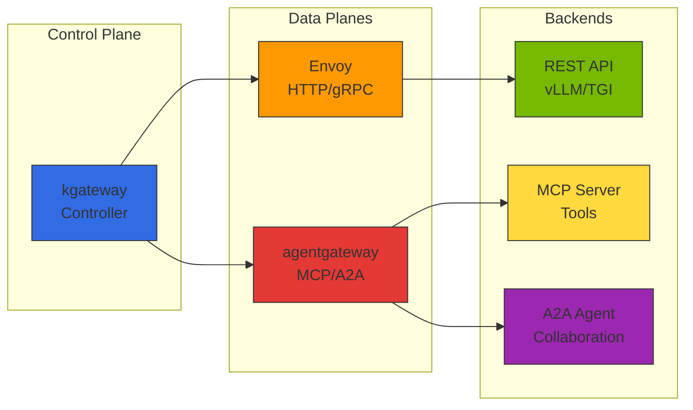

# Inference Gateway and Dynamic Routing

> 📅 **Created**: 2025-02-05 | **Updated**: 2026-02-14 | ⏱️ **Reading time**: Approximately 6 minutes

## Overview

In large-scale AI model serving environments, efficiently routing and managing inference requests across various models is critical. This document covers how to configure dynamic routing, load balancing, and failure recovery strategies for AI model inference requests using Kubernetes Gateway API and Kgateway.

### Key Objectives

- **Intelligent Routing**: Optimal model backend selection based on request characteristics
- **Traffic Distribution**: Stable service delivery through weighted load balancing
- **Progressive Deployment**: Safe model updates through canary and A/B testing
- **High Availability**: Service continuity through fallback and retry policies

---

## Inference Gateway Architecture

### Overall Architecture Diagram



### Component Structure

import { ComponentStructureTable } from '@site/src/components/InferenceGatewayTables';

<ComponentStructureTable />


### Traffic Flow



:::info Gateway API Standard
Kgateway implements the Kubernetes Gateway API standard, enabling vendor-neutral configuration. This facilitates migration to other Gateway implementations.
:::

### Topology-Aware Routing (Kubernetes 1.33+)

Leveraging topology-aware routing in Kubernetes 1.33+ prioritizes communication between Pods in the same AZ, reducing cross-AZ data transfer costs and improving latency.

```yaml
apiVersion: v1
kind: Service
metadata:
  name: vllm-inference
  namespace: ai-inference
  annotations:
    # Kubernetes 1.33+ Topology-Aware Routing
    service.kubernetes.io/topology-mode: "Auto"
spec:
  selector:
    app: vllm
  ports:
    - port: 8000
      targetPort: 8000
  # Enable topology-aware routing
  trafficDistribution: PreferClose
```

##### Topology-Aware Routing Benefits

import { TopologyEffectsTable } from '@site/src/components/InferenceGatewayTables';

<TopologyEffectsTable />


:::tip Topology-Aware Routing Use Cases
- **Multi-AZ Deployment**: Optimize communication between GPU nodes distributed across multiple AZs
- **Large-Scale Inference**: Inference workloads requiring high throughput
- **Cost Optimization**: When reducing cross-AZ data transfer costs is critical
:::

---

## Kgateway Installation and Configuration

### Prerequisites

- Kubernetes 1.33 or later (topology-aware routing support)
- Helm 3.x
- Gateway API CRD installation

:::info Kubernetes 1.33+ Recommended
Using Kubernetes 1.33+ allows you to leverage topology-aware routing to reduce cross-AZ traffic costs and improve latency. Kubernetes 1.34+ further enhances security with projected service account tokens.
:::

### Gateway API CRD Installation

```bash
# Install Gateway API standard CRDs (v1.2.0+)
kubectl apply -f https://github.com/kubernetes-sigs/gateway-api/releases/download/v1.2.0/standard-install.yaml

# Install with experimental features (HTTPRoute filters, etc.)
kubectl apply -f https://github.com/kubernetes-sigs/gateway-api/releases/download/v1.2.0/experimental-install.yaml
```

:::info Gateway API v1.2.0+ Features
Gateway API v1.2.0 provides the following enhanced features:
- **HTTPRoute Improvements**: More flexible routing rules
- **GRPCRoute Stabilization**: gRPC service routing support
- **BackendTLSPolicy**: Standardized backend TLS configuration
- **Kubernetes 1.33+ Integration**: Topology-aware routing support
:::

### Kgateway Helm Chart Installation

```bash
# Add Helm repository
helm repo add kgateway oci://cr.kgateway.dev/kgateway-dev/charts
helm repo update

# Create namespace
kubectl create namespace kgateway-system

# Install Kgateway (v2.0+)
helm install kgateway kgateway/kgateway \
  --namespace kgateway-system \
  --version 2.0.5 \
  --set controller.replicaCount=2 \
  --set controller.resources.requests.cpu=500m \
  --set controller.resources.requests.memory=512Mi \
  --set controller.resources.limits.cpu=1000m \
  --set controller.resources.limits.memory=1Gi \
  --set metrics.enabled=true \
  --set metrics.serviceMonitor.enabled=true
```

:::info Kgateway v2.0+ Features
Kgateway v2.0+ provides the following enhanced features:
- **Gateway API v1.2.0+ Support**: Full support for the latest Gateway API standard
- **Enhanced Performance**: Faster routing and lower latency
- **Kubernetes 1.33+ Optimization**: Topology-aware routing integration
:::

### Detailed Helm Values Configuration

```yaml
# values.yaml
controller:
  replicaCount: 2

  resources:
    requests:
      cpu: 500m
      memory: 512Mi
    limits:
      cpu: 1000m
      memory: 1Gi

  # High availability configuration
  affinity:
    podAntiAffinity:
      preferredDuringSchedulingIgnoredDuringExecution:
        - weight: 100
          podAffinityTerm:
            labelSelector:
              matchLabels:
                app: kgateway
            topologyKey: kubernetes.io/hostname

# Metrics configuration
metrics:
  enabled: true
  port: 9090
  serviceMonitor:
    enabled: true
    interval: 15s
    labels:
      release: prometheus

# Logging configuration
logging:
  level: info
  format: json

# TLS configuration
tls:
  enabled: true
  certManager:
    enabled: true
    issuerRef:
      name: letsencrypt-prod
      kind: ClusterIssuer
```

---

## GatewayClass and Gateway Configuration

### GatewayClass Definition

GatewayClass defines the Gateway implementation.

```yaml
apiVersion: gateway.networking.k8s.io/v1
kind: GatewayClass
metadata:
  name: kgateway
spec:
  controllerName: kgateway.dev/kgateway-controller
  description: "Kgateway for AI inference routing"
  parametersRef:
    group: kgateway.dev
    kind: GatewayClassConfig
    name: kgateway-config
---
apiVersion: kgateway.dev/v1alpha1
kind: GatewayClassConfig
metadata:
  name: kgateway-config
spec:
  # Proxy configuration
  proxy:
    replicas: 3
    resources:
      requests:
        cpu: "1"
        memory: "2Gi"
      limits:
        cpu: "2"
        memory: "4Gi"

  # Connection settings
  connectionSettings:
    maxConnections: 10000
    connectTimeout: 10s
    idleTimeout: 60s
```

### Gateway Resource Definition

```yaml
apiVersion: gateway.networking.k8s.io/v1
kind: Gateway
metadata:
  name: ai-inference-gateway
  namespace: ai-gateway
  annotations:
    # AWS ALB integration
    service.beta.kubernetes.io/aws-load-balancer-type: "external"
    service.beta.kubernetes.io/aws-load-balancer-nlb-target-type: "ip"
    service.beta.kubernetes.io/aws-load-balancer-scheme: "internet-facing"
spec:
  gatewayClassName: kgateway

  listeners:
    # HTTPS listener
    - name: https
      protocol: HTTPS
      port: 443
      hostname: "inference.example.com"
      tls:
        mode: Terminate
        certificateRefs:
          - name: inference-tls-cert
            kind: Secret
      allowedRoutes:
        namespaces:
          from: Selector
          selector:
            matchLabels:
              gateway-access: "true"

    # HTTP listener (for HTTPS redirect)
    - name: http
      protocol: HTTP
      port: 80
      hostname: "inference.example.com"
      allowedRoutes:
        namespaces:
          from: Same

    # Internal gRPC listener
    - name: grpc
      protocol: HTTPS
      port: 8443
      hostname: "inference-grpc.example.com"
      tls:
        mode: Terminate
        certificateRefs:
          - name: inference-grpc-tls-cert
      allowedRoutes:
        kinds:
          - kind: GRPCRoute
```

:::warning TLS Certificate Management
In production environments, use cert-manager to automatically manage TLS certificates. Manual certificate management poses risks of service disruption due to expiration.
:::

---

## Dynamic Routing Configuration

### Header-Based Routing

Route to appropriate model backends based on the `x-model-id` header value.

```yaml
apiVersion: gateway.networking.k8s.io/v1
kind: HTTPRoute
metadata:
  name: model-header-routing
  namespace: ai-gateway
spec:
  parentRefs:
    - name: ai-inference-gateway
      namespace: ai-gateway
      sectionName: https

  hostnames:
    - "inference.example.com"

  rules:
    # GPT-4 model routing
    - matches:
        - path:
            type: PathPrefix
            value: /v1/chat/completions
          headers:
            - name: x-model-id
              value: "gpt-4"
      backendRefs:
        - name: vllm-gpt4-service
          namespace: ai-inference
          port: 8000
          weight: 100

    # Claude-3 model routing
    - matches:
        - path:
            type: PathPrefix
            value: /v1/chat/completions
          headers:
            - name: x-model-id
              value: "claude-3"
      backendRefs:
        - name: vllm-claude3-service
          namespace: ai-inference
          port: 8000
          weight: 100

    # Mixtral MoE model routing
    - matches:
        - path:
            type: PathPrefix
            value: /v1/chat/completions
          headers:
            - name: x-model-id
              value: "mixtral-8x7b"
      backendRefs:
        - name: tgi-mixtral-service
          namespace: ai-inference
          port: 8080
          weight: 100
```

### Path-Based Routing

Route to different services based on API paths.

```yaml
apiVersion: gateway.networking.k8s.io/v1
kind: HTTPRoute
metadata:
  name: path-based-routing
  namespace: ai-gateway
spec:
  parentRefs:
    - name: ai-inference-gateway
      namespace: ai-gateway

  hostnames:
    - "inference.example.com"

  rules:
    # Chat Completions API
    - matches:
        - path:
            type: PathPrefix
            value: /v1/chat/completions
      backendRefs:
        - name: chat-completion-service
          port: 8000

    # Embeddings API
    - matches:
        - path:
            type: PathPrefix
            value: /v1/embeddings
      backendRefs:
        - name: embedding-service
          port: 8000

    # Completions API (Legacy)
    - matches:
        - path:
            type: PathPrefix
            value: /v1/completions
      backendRefs:
        - name: completion-service
          port: 8000

    # Health Check
    - matches:
        - path:
            type: Exact
            value: /health
      backendRefs:
        - name: health-check-service
          port: 8080
```

### Complex Conditional Routing

Advanced routing rules combining multiple conditions.

```yaml
apiVersion: gateway.networking.k8s.io/v1
kind: HTTPRoute
metadata:
  name: advanced-routing
  namespace: ai-gateway
spec:
  parentRefs:
    - name: ai-inference-gateway

  rules:
    # Premium customer + GPT-4 request → Dedicated backend
    - matches:
        - path:
            type: PathPrefix
            value: /v1/chat/completions
          headers:
            - name: x-model-id
              value: "gpt-4"
            - name: x-customer-tier
              value: "premium"
      backendRefs:
        - name: vllm-gpt4-premium
          port: 8000

    # Standard customer + GPT-4 request → Shared backend
    - matches:
        - path:
            type: PathPrefix
            value: /v1/chat/completions
          headers:
            - name: x-model-id
              value: "gpt-4"
            - name: x-customer-tier
              value: "standard"
      backendRefs:
        - name: vllm-gpt4-shared
          port: 8000
```

---

## Load Balancing Strategies

### Weighted Traffic Distribution

Distribute traffic between model versions by weight.

```yaml
apiVersion: gateway.networking.k8s.io/v1
kind: HTTPRoute
metadata:
  name: weighted-routing
  namespace: ai-gateway
spec:
  parentRefs:
    - name: ai-inference-gateway

  rules:
    - matches:
        - path:
            type: PathPrefix
            value: /v1/chat/completions
          headers:
            - name: x-model-id
              value: "gpt-4"
      backendRefs:
        # Primary backend: 80% traffic
        - name: vllm-gpt4-v1
          port: 8000
          weight: 80
        # Secondary backend: 20% traffic
        - name: vllm-gpt4-v2
          port: 8000
          weight: 20
```

### A/B Test Routing

Expose new model versions to specific user groups only.

```yaml
apiVersion: gateway.networking.k8s.io/v1
kind: HTTPRoute
metadata:
  name: ab-test-routing
  namespace: ai-gateway
spec:
  parentRefs:
    - name: ai-inference-gateway

  rules:
    # A/B test group A (existing model)
    - matches:
        - path:
            type: PathPrefix
            value: /v1/chat/completions
          headers:
            - name: x-ab-test-group
              value: "control"
      backendRefs:
        - name: vllm-model-baseline
          port: 8000

    # A/B test group B (new model)
    - matches:
        - path:
            type: PathPrefix
            value: /v1/chat/completions
          headers:
            - name: x-ab-test-group
              value: "experiment"
      backendRefs:
        - name: vllm-model-new
          port: 8000
```

### Canary Deployment

Progressively roll out new model versions.

```yaml
apiVersion: gateway.networking.k8s.io/v1
kind: HTTPRoute
metadata:
  name: canary-deployment
  namespace: ai-gateway
  annotations:
    # Track canary deployment stage
    deployment.kubernetes.io/canary-weight: "10"
spec:
  parentRefs:
    - name: ai-inference-gateway

  rules:
    - matches:
        - path:
            type: PathPrefix
            value: /v1/chat/completions
          headers:
            - name: x-model-id
              value: "gpt-4"
      backendRefs:
        # Stable version: 90%
        - name: vllm-gpt4-stable
          port: 8000
          weight: 90
        # Canary version: 10%
        - name: vllm-gpt4-canary
          port: 8000
          weight: 10
```

:::tip Canary Deployment Strategy

1. **Initial Stage**: Start with 5-10% traffic
2. **Monitoring**: Check error rates, latency, quality metrics
3. **Progressive Increase**: If no issues, proceed 25% → 50% → 75% → 100%
4. **Rollback Readiness**: Immediately rollback to 0% if issues occur

:::

### Canary Deployment Progress Example

```mermaid
gantt
    title Canary Deployment Timeline
    dateFormat HH:mm
    axisFormat %H:%M

    section Traffic
    10%  :a1, 00:00, 30m
    25%  :a2, after a1, 30m
    50%  :a3, after a2, 60m
    75%  :a4, after a3, 60m
    100% :a5, after a4, 60m

    section Monitoring
    Metrics check :b1, 00:00, 300m
```



---

## Failure Recovery Configuration

### Fallback Configuration

Automatically switch to backup backend when primary backend fails.

```yaml
apiVersion: gateway.networking.k8s.io/v1
kind: HTTPRoute
metadata:
  name: fallback-routing
  namespace: ai-gateway
spec:
  parentRefs:
    - name: ai-inference-gateway

  rules:
    - matches:
        - path:
            type: PathPrefix
            value: /v1/chat/completions
          headers:
            - name: x-model-id
              value: "gpt-4"
      backendRefs:
        # Primary backend
        - name: vllm-gpt4-primary
          port: 8000
          weight: 100
      # Fallback configuration via BackendLBPolicy
---
apiVersion: gateway.networking.k8s.io/v1alpha2
kind: BackendLBPolicy
metadata:
  name: gpt4-fallback-policy
  namespace: ai-gateway
spec:
  targetRefs:
    - group: ""
      kind: Service
      name: vllm-gpt4-primary
  sessionPersistence:
    sessionName: "model-session"
    type: Cookie
  # Specify fallback backend
  default:
    backendRef:
      name: vllm-gpt4-fallback
      port: 8000
```

### Timeout Configuration

Configure timeouts for inference requests.

```yaml
apiVersion: gateway.networking.k8s.io/v1
kind: HTTPRoute
metadata:
  name: timeout-config
  namespace: ai-gateway
spec:
  parentRefs:
    - name: ai-inference-gateway

  rules:
    - matches:
        - path:
            type: PathPrefix
            value: /v1/chat/completions
      backendRefs:
        - name: vllm-service
          port: 8000
      timeouts:
        # Request timeout (total request processing time)
        request: 120s
        # Backend connection timeout
        backendRequest: 60s
```

### Retry Policy

Configure automatic retries for transient errors.

```yaml
apiVersion: gateway.networking.k8s.io/v1
kind: HTTPRoute
metadata:
  name: retry-policy
  namespace: ai-gateway
spec:
  parentRefs:
    - name: ai-inference-gateway

  rules:
    - matches:
        - path:
            type: PathPrefix
            value: /v1/chat/completions
      backendRefs:
        - name: vllm-service
          port: 8000
      # Retry configuration (Kgateway extension)
      filters:
        - type: ExtensionRef
          extensionRef:
            group: kgateway.dev
            kind: RetryPolicy
            name: inference-retry-policy
---
apiVersion: kgateway.dev/v1alpha1
kind: RetryPolicy
metadata:
  name: inference-retry-policy
  namespace: ai-gateway
spec:
  # Maximum retry attempts
  numRetries: 3

  # Retry conditions
  retryOn:
    - "5xx"
    - "reset"
    - "connect-failure"
    - "retriable-4xx"

  # Retry interval
  perTryTimeout: 30s

  # Backoff configuration
  retryBackOff:
    baseInterval: 100ms
    maxInterval: 1s
```

### Circuit Breaker Configuration

Temporarily block backend after consecutive failures.

```yaml
apiVersion: kgateway.dev/v1alpha1
kind: CircuitBreakerPolicy
metadata:
  name: inference-circuit-breaker
  namespace: ai-gateway
spec:
  targetRefs:
    - group: ""
      kind: Service
      name: vllm-gpt4-service

  # Maximum concurrent connections
  maxConnections: 1000

  # Maximum pending requests
  maxPendingRequests: 100

  # Maximum concurrent requests
  maxRequests: 1000

  # Consecutive error threshold
  consecutiveErrors: 5

  # Block duration
  interval: 10s

  # Test requests after unblocking
  maxEjectionPercent: 50
```

:::danger Failure Recovery Precautions

- **Timeout Settings**: LLM inference can take time, so sufficient timeout configuration is needed
- **Retry Limits**: Unlimited retries can cause system overload
- **Circuit Breaker**: Overly sensitive settings can block normal traffic

:::

---

## Monitoring and Observability

### Prometheus Metrics

Key metrics exposed by Kgateway.

import { MonitoringMetricsTable } from '@site/src/components/InferenceGatewayTables';

<MonitoringMetricsTable />


### ServiceMonitor Configuration

```yaml
apiVersion: monitoring.coreos.com/v1
kind: ServiceMonitor
metadata:
  name: kgateway-metrics
  namespace: monitoring
spec:
  selector:
    matchLabels:
      app: kgateway
  namespaceSelector:
    matchNames:
      - kgateway-system
  endpoints:
    - port: metrics
      interval: 15s
      path: /metrics
```

### Grafana Dashboard Query Examples

```promql
# Requests per second (RPS)
sum(rate(kgateway_requests_total[5m])) by (route)

# P99 latency
histogram_quantile(0.99,
  sum(rate(kgateway_request_duration_seconds_bucket[5m])) by (le, route)
)

# Error rate
sum(rate(kgateway_upstream_rq_5xx[5m])) /
sum(rate(kgateway_requests_total[5m])) * 100

# Active connections per backend
sum(kgateway_upstream_cx_active) by (upstream_cluster)
```

### Alert Rules

```yaml
apiVersion: monitoring.coreos.com/v1
kind: PrometheusRule
metadata:
  name: kgateway-alerts
  namespace: monitoring
spec:
  groups:
    - name: kgateway-alerts
      rules:
        - alert: HighErrorRate
          expr: |
            sum(rate(kgateway_upstream_rq_5xx[5m])) /
            sum(rate(kgateway_requests_total[5m])) > 0.05
          for: 5m
          labels:
            severity: critical
          annotations:
            summary: "Inference Gateway error rate exceeds 5%"
            description: "Error rate in the last 5 minutes is {{ $value | humanizePercentage }}"

        - alert: HighLatency
          expr: |
            histogram_quantile(0.99,
              sum(rate(kgateway_request_duration_seconds_bucket[5m])) by (le)
            ) > 30
          for: 5m
          labels:
            severity: warning
          annotations:
            summary: "Inference Gateway P99 latency exceeds 30 seconds"

        - alert: CircuitBreakerOpen
          expr: kgateway_circuit_breaker_open == 1
          for: 1m
          labels:
            severity: critical
          annotations:
            summary: "Circuit breaker activated"
            description: "Circuit breaker for {{ $labels.upstream_cluster }} backend has opened"
```

---

## Operational Best Practices

### Routing Rule Management

1. **Version Control**: Manage HTTPRoutes with Git to track change history
2. **Namespace Separation**: Separate namespaces by environment (dev/staging/prod)
3. **Labeling**: Secure resource manageability through consistent labeling

### Performance Optimization

```yaml
# Connection pool optimization
apiVersion: kgateway.dev/v1alpha1
kind: ConnectionPoolSettings
metadata:
  name: inference-connection-pool
spec:
  targetRefs:
    - kind: Service
      name: vllm-service
  tcp:
    maxConnections: 1000
    connectTimeout: 10s
  http:
    h2UpgradePolicy: UPGRADE
    maxRequestsPerConnection: 100
    maxRetries: 3
```

### Security Configuration

```yaml
# Rate Limiting
apiVersion: kgateway.dev/v1alpha1
kind: RateLimitPolicy
metadata:
  name: inference-rate-limit
spec:
  targetRefs:
    - kind: HTTPRoute
      name: model-routing
  local:
    tokenBucket:
      maxTokens: 1000
      tokensPerFill: 100
      fillInterval: 1s
  # Per-tenant limits
  descriptors:
    - entries:
        - key: x-tenant-id
      limit:
        requestsPerUnit: 100
        unit: MINUTE
```

---

## agentgateway: AI-Native Data Plane

### agentgateway Overview

agentgateway is kgateway's **AI workload-specific data plane**, addressing AI-specific protocols and security requirements that the existing Envoy data plane struggles to handle.



### Envoy vs agentgateway Comparison

| Feature | Envoy Data Plane | agentgateway |
|---|---|---|
| Protocol | HTTP/1.1, HTTP/2, gRPC | MCP (JSON-RPC), A2A |
| Session Management | Stateless | Stateful (JSON-RPC sessions) |
| Security Model | TLS, mTLS | Per-session Authorization, Tool Poisoning prevention |
| Traffic Pattern | Request-Response | Bidirectional Streaming |
| Main Target | REST API, model inference | AI Agent communication, Tool invocation |

### Core Features

#### 1. Stateful JSON-RPC Sessions

agentgateway supports the stateful nature of the MCP protocol, maintaining session context between agents and tools.

```yaml
apiVersion: agentgateway.io/v1alpha1
kind: MCPRoute
metadata:
  name: tool-routing
  namespace: ai-gateway
spec:
  parentRefs:
    - name: ai-inference-gateway
  rules:
    - matches:
        - method: "tools/call"
      backendRefs:
        - name: mcp-tool-server
          port: 3000
      sessionAffinity:
        enabled: true
        ttl: 300s
```

#### 2. Tool Poisoning Prevention

Validates the integrity of tools invoked by agents to prevent malicious tool injection.

```yaml
apiVersion: agentgateway.io/v1alpha1
kind: ToolPolicy
metadata:
  name: tool-validation
spec:
  validation:
    # Only allowed tools can be invoked
    allowedTools:
      - "search_database"
      - "send_email"
      - "create_ticket"
    # Tool response size limit
    maxResponseSize: 1Mi
    # Tool invocation timeout
    timeout: 30s
  # Tool description tampering detection
  integrityCheck:
    enabled: true
    hashAlgorithm: sha256
```

#### 3. Per-session Authorization

Apply independent authorization policies per session.

```yaml
apiVersion: agentgateway.io/v1alpha1
kind: SessionPolicy
metadata:
  name: agent-session-auth
spec:
  authorization:
    # Validate JWT token at session start
    jwt:
      issuer: "https://auth.example.com"
      audience: "agent-gateway"
    # Per-session tool access control
    toolAccess:
      - role: "admin"
        tools: ["*"]
      - role: "user"
        tools: ["search_database", "create_ticket"]
```

### Integration with 2-Tier Gateway

agentgateway handles AI-native traffic in Tier 2-B (self-hosted inference infrastructure) of kgateway's 2-Tier architecture. For detailed 2-Tier Gateway architecture and solution comparison, see [LLM Gateway 2-Tier Architecture](./llm-gateway-architecture.md).

:::info agentgateway Project Status
agentgateway is an AI-specific data plane separated from the kgateway project in late 2025, currently under active development. Features are continuously being added to keep pace with the rapid evolution of MCP and A2A protocols.
:::

---

## Summary

Inference Gateway is a core component of traffic management in AI model serving environments.

### Key Points

1. **Kubernetes Gateway API**: Portability through standards-based configuration
2. **Dynamic Routing**: Flexible routing rules based on headers and paths
3. **Load Balancing**: Progressive deployment support through weighted traffic distribution
4. **Failure Recovery**: Stability through timeouts, retries, and circuit breakers
5. **Observability**: Real-time monitoring with Prometheus metrics
6. **agentgateway**: Native MCP/A2A protocol support for enhanced AI agent communication security

### Next Steps

- [LLM Gateway 2-Tier Architecture](./llm-gateway-architecture.md) - 2-Tier Gateway design and solution selection
- [LLMOps Observability](./llmops-observability.md) - Langfuse/LangSmith-based LLM observability
- [GPU Resource Management](../model-serving/gpu-resource-management.md) - Dynamic resource allocation strategies
- [MoE Model Serving](../model-serving/moe-model-serving.md) - Mixture of Experts model deployment
- [Agent Monitoring](../operations-mlops/agent-monitoring.md) - Langfuse integration guide

---

## References

- [Kubernetes Gateway API Official Documentation](https://gateway-api.sigs.k8s.io/)
- [Kgateway Official Documentation](https://kgateway.dev/docs/)
- [vLLM Official Documentation](https://docs.vllm.ai/)
- [Envoy Proxy Documentation](https://www.envoyproxy.io/docs/)
